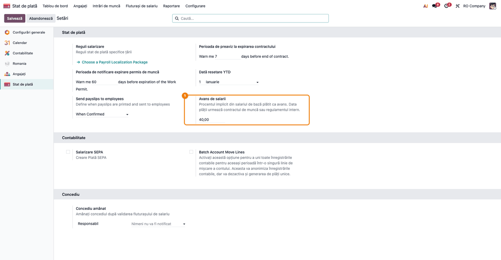
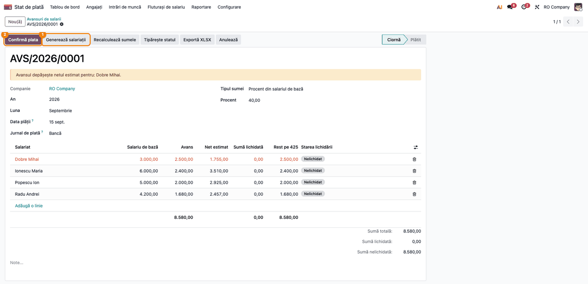
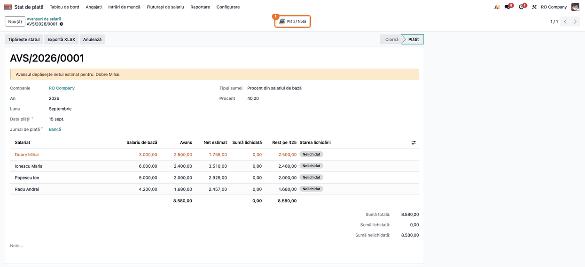
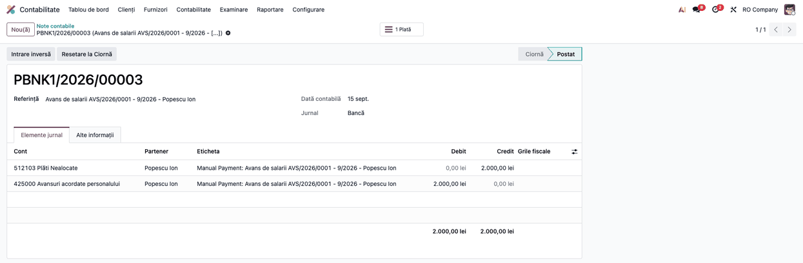
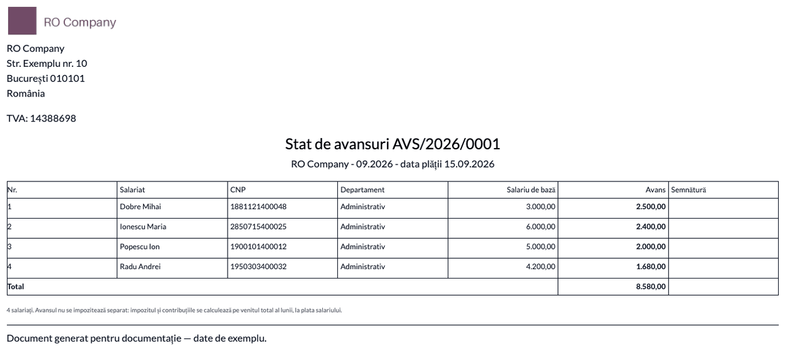
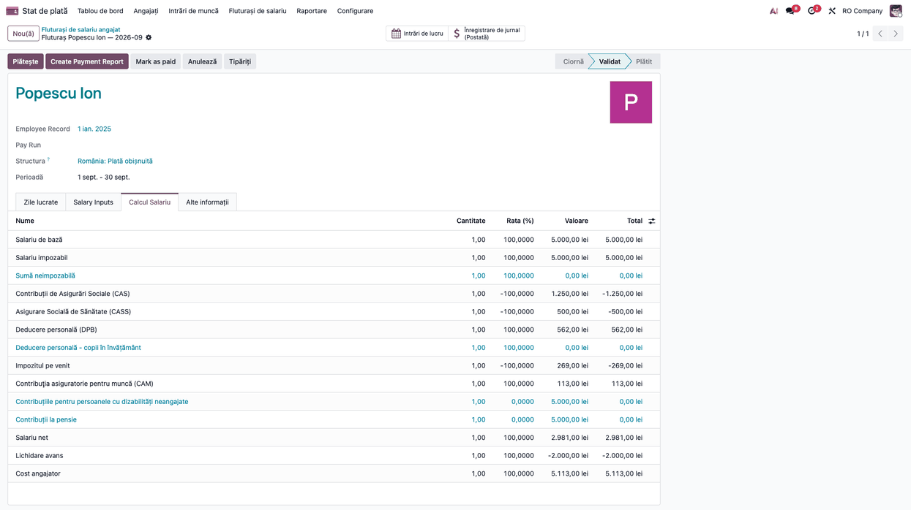
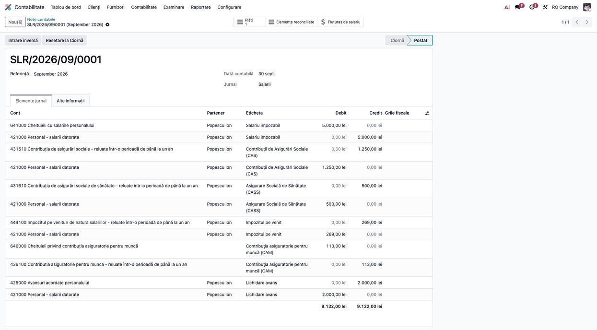
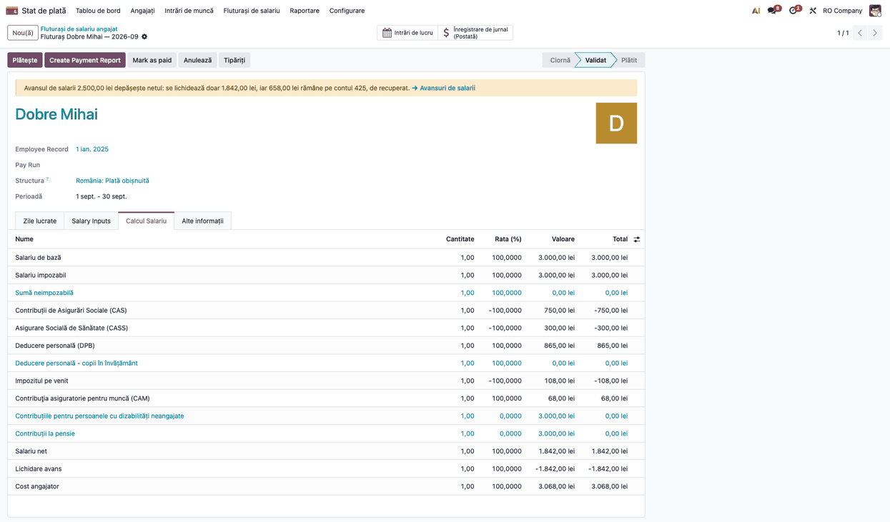
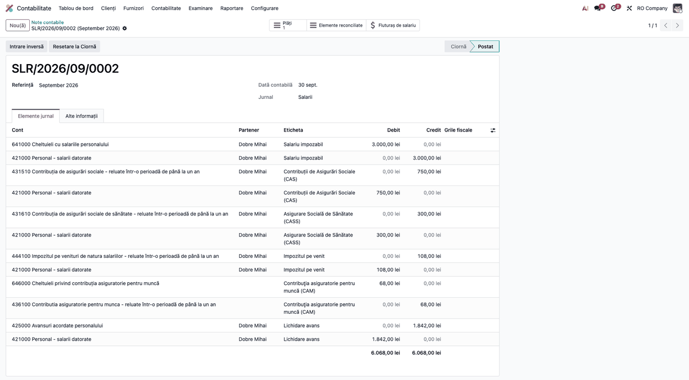
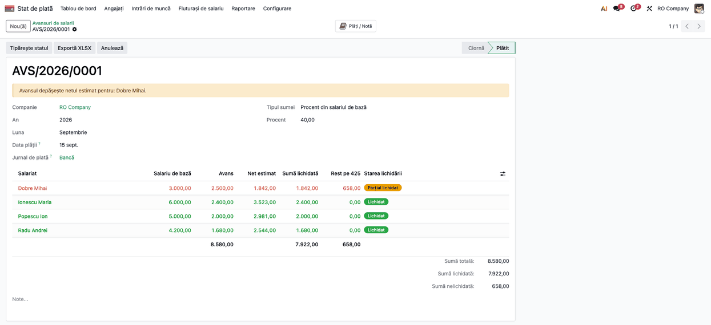

# Fișă Modul: Avans chenzinal pe salarii

**Modul:** `l10n_ro_payroll_advance`
**Utilizator principal:** responsabil salarizare / contabil
**Prioritate:** 🟡 Medie (avansul se poate ține în afara sistemului, dar atunci 425 nu se lămurește pe salariat și statul de avansuri se face de mână)

## 1. Scop business

Firmele care plătesc salariul în două tranșe dau salariaților un avans la jumătatea lunii. Fără modul, avansul nu apare în fluturaș: contabilul plătește avansul de mână, iar la salariul lunii scade suma din plata restului, fără urmă în fluturaș și fără lichidarea contului 425. Modulul ține avansul într-un lot cu plata contabilizată pe 425, îl lichidează automat pe fluturașul lunii (`Dr 421 = Cr 425`), scade avansul din restul de plată fără să atingă brutul, contribuțiile sau impozitul, și tipărește statul de avansuri cu semnături.

## 2. Bază legală și context

- **Plata salariului**: Codul muncii, art. 166 alin. (1): salariul se plătește cel puțin o dată pe lună, la data stabilită în contractul individual sau colectiv de muncă ori în regulamentul intern. Data și mărimea avansului țin de aceste documente; legea nu fixează sume minime sau maxime.
- **Fiscalitate**: avansul nu se impozitează separat și nu generează contribuții. Impozitul și contribuțiile se calculează lunar, pe venitul total al lunii, la data ultimei plăți a salariului lunii (Codul fiscal, art. 80; HG 1/2016, Titlul IV, pct. 16 alin. 3). Avansul nu apare în D112.
- **Monografie** (OMFP 1802/2014): plata `425 = 5121 / 5311` (prin bancă, creditul trece întâi pe analiticul de plăți în curs al 5121 (ex. 512103) și ajunge pe 5121 la reconcilierea extrasului); lichidarea pe statul de plată `421 = 425`; plata restului `421 = 5121 / 5311`.
- **Avans mai mare decât netul**: diferența rămâne pe 425 și se reține pe statul de plată al lunii următoare (`Dr 421 = Cr 425`; funcțiunea contului 425 admite pe credit doar 421 și 423); reținerile cumulate nu pot depăși jumătate din salariul net (Codul muncii, art. 169 alin. 4). Contul 4282 `Alte creanțe în legătură cu personalul` se folosește doar când suma devine creanță (de exemplu la încetarea contractului). Recuperarea automată nu este implementată.
- **Avans nerecuperat** (de exemplu la încetarea contractului): temei posibil art. 256 alin. (1) Codul muncii; practica pentru reținere fără acord scris nu este unitară, **de confirmat juridic**.

## 3. Utilizatori și roluri

Administrator salarizare (grupul *Salarizare / Administrator*): creează și confirmă loturile, tipărește statul. Contabilul verifică nota și soldul 425.

## 4. Conturi și date implicate

| Operațiune | Debit | Credit | Partener |
|---|---|---|---|
| Plata avansului, jurnal de bancă (confirmarea lotului, o plată pe salariat) | 425 Avansuri acordate personalului | analiticul de plăți în curs al 5121 (ex. 512103), apoi 5121 la reconcilierea extrasului | salariatul (contactul de muncă), pe ambele linii |
| Plata avansului, jurnal de numerar (nota directă a lotului) | 425 | 5311 (contul din jurnal) | salariatul, pe ambele linii |
| Lichidarea (validarea fluturașului) | 421 Personal - salarii datorate | 425 | salariatul |
| Plata restului (butonul de plată al fluturașului; vezi secțiunea 11) | 421 | 5121 / 5311 | salariatul |

Regula *Lichidare avans* (cod `AVANS`, secvența 205, categoria proprie *Avans de salarii*) este în afara categoriilor BASIC, ALW, DED și GROSS, deci brutul, CAS, CASS, CAM, impozitul și netul rămân neschimbate. Suma regulii este minus min(avansurile plătite ale lunii, net), de unde restul de plată nu devine negativ.

## 5. Configurare inițială

- Procentul implicit al avansului pe companie (*Setări → Stat de plată → Avans de salarii*), implicit 40%.

- Conturile regulii (425 și 421) se completează automat pe planul RO; pe alte planuri se completează pe regulă.
- Jurnal de bancă sau de numerar cu cont implicit (5121 / 5311). Pe jurnalul de bancă: **setați contul de plăți în curs pe metoda de plată de ieșire a jurnalului de bancă** (*Contabilitate → Configurare → Jurnale → Plăți Efectuate*); Odoo nu îl completează automat pe planul RO, iar modulul refuză plata (mesaj în secțiunea 9) dacă lipsește: cu aplicația Contabilitate, o plată fără acest cont s-ar posta fără nota contabilă. Dacă metoda de ieșire este SEPA / ISO 20022, plata cere cont bancar validat al salariatului (eroare standard Odoo): folosiți metoda *Manual*. Contul trebuie să aibă bifat *Permite reconcilierea* și tipul *Active circulante*: folosiți contul creat de Odoo (512103, afișat ca „Plăți Nealocate”, în coloana *Conturi de plăți restante* a tab-ului *Plăți Efectuate*), nu 5125 (cont de suspensie al jurnalelor, nereconciliabil) și nici 473.
- Salariații au contact de muncă și contract activ în luna avansului.

## 6. Flux de utilizare

### Pasul 1 — Lotul de avans

*Stat de plată → Fluturași de salariu → Avansuri de salarii* → **Nou**: luna, data plății, jurnalul, procentul sau suma fixă, apoi **Generează salariații**. Suma se poate edita pe linie.

**Verificați:** apar doar salariații cu contract activ în lună; fiecare apare o singură dată; liniile peste netul estimat sunt marcate, iar lotul arată avertizarea.

### Pasul 2 — Plata

Pentru un jurnal de **bancă**, **Confirmă plata** creează câte o plată de ieșire (`account.payment`) pe salariat, pe contactul de muncă, cu `Dr 425 = Cr` analiticul de plăți în curs al 5121 (ex. 512103): creditul rămâne pe plăți în curs până la reconcilierea extrasului bancar, când trece pe 5121. Linia de extras importată se reconciliază cu plata; nu se contabilizează manual pe 425 și 5121, altfel 5121 s-ar credita de două ori. Pentru un jurnal de **numerar** (fără extrase) se postează direct `Dr 425 = Cr 5311`, pe salariat.

Butonul **Plăți / Notă** al lotului deschide plățile (jurnal de bancă) sau nota directă (numerar).

**Verificați:** totalul pe 425 al plăților (sau al notei directe) este totalul lotului; fiecare linie are salariatul ca partener.

### Pasul 3 — Statul de avansuri

**Tipărește statul** (PDF A4 pe lat, cu coloană de semnătură) sau **Exportă XLSX**.

**Verificați:** numărul de linii și totalul coincid cu lotul.

### Pasul 4 — Lichidarea pe fluturaș

La calculul fluturașului lunii apare regula *Lichidare avans*, cu minus. La validare se creează nota fluturașului cu `Dr 421 = Cr 425`; linia lotului devine *Lichidat*. Nota fluturașului se postează ca de obicei: la postare, linia `Cr 425` se reconciliază automat cu liniile `Dr 425` ale lotului de avans (parțial, dacă sumele diferă), așa că în nota fluturașului rămân deschise doar 421 și contul de plată (vezi secțiunea 11 pentru butonul *Plătește*). Restul de plată nu apare ca rând pe fluturaș: este soldul contului 421 al salariatului (net − avans), pe care îl achită plata fluturașului. Fluturașul se **anulează** cu butonul **Anulează** (nota fluturașului se șterge, se anulează sau se stornează, după blocarea perioadei și audit trail, iar reconcilierea pe 425 se desface), apoi **Setează ca ciornă** de pe formular; acțiunea *Setează ca ciornă* din meniul *Acțiuni* al listei nu desface nimic și este blocată pe un fluturaș care a lichidat un avans.

**Verificați:** *Net* și brutul fluturașului sunt aceleași ca fără avans; restul de plată (soldul 421 al salariatului) este net − avans; soldul 425 al salariatului este zero.

### Pasul 5 — Avansul mai mare decât netul

Se scade doar netul; restul de plată este 0; pe fluturaș și pe lot apare avertizarea; diferența rămâne pe 425 (linia lotului este *Parțial lichidat*). Nota fluturașului are `Dr 421 = Cr 425` doar pentru suma lichidată (1.842,00 în exemplu), iar soldul de 658,00 rămâne pe 425 pe salariat (coloana *Rest pe 425* a lotului).

Diferența se reține pe statul de plată al lunii următoare (`Dr 421 = Cr 425`), în limita de jumătate din salariul net pentru toate reținerile cumulate; 4282 doar când suma devine creanță (de exemplu la încetarea contractului).

### Pasul 6 — Anularea

Lotul se anulează cu **Anulează**: plățile jurnalului de bancă și nota directă a jurnalului de numerar se șterg, se anulează sau se stornează, după blocarea perioadei și audit trail (plățile ajung în starea *Anulat*). O plată deja reconciliată cu un extras blochează anularea, cu mesaj: desfaceți mai întâi reconcilierea bancară. Un lot lichidat pe un fluturaș validat nu se anulează înainte de anularea fluturașului (butonul **Anulează** al fluturașului, apoi *Setează ca ciornă*). Când fluturașul este anulat, avansul revine la *Nelichidat*.

### Note de monografie și raportare

Avansul nu intră în D112 și nu modifică baza de calcul a contribuțiilor. Avansul plătit prin bancă se plătește din modul (plata pe salariat), nu din fișierul bancar al fluturașului, care conține netul întreg, fără avans. Extrasul importat se reconciliază cu plățile avansului; linia de extras nu se contabilizează manual pe 425 / 5121. Plata restului din butonul fluturașului trece tot prin contul de plăți în curs, până la reconcilierea extrasului.

## 7. Legături cu alte module / declarații

| Modul | Rol |
|---|---|
| `l10n_ro_hr_payroll_enhancement` | fluturașii și regulile RO |
| `l10n_ro_hr_payroll_account_enhancement` | mecanismul de conturi pe reguli (421 și contul de personal pe linie) |
| `l10n_ro_payroll_statements` | statul de plată (doar NET, fără avans); statul de avansuri este un raport separat, al acestui modul |
| `l10n_ro_payroll_bank_export` | fișier bancar pe fluturași (netul întreg; fără avans în v1) |

**Automat:** sumele implicite, nota plății, lichidarea, plafonarea la net, avertizările. **Automat și reconcilierea 425** cu plata avansului, la postarea notei fluturașului. **Manual:** reținerea diferenței rămase pe 425 în luna următoare.

## 8. Verificări pentru consultant

- [ ] Lotul conține doar salariați cu contract activ în lună, câte o linie fiecare.
- [ ] Plata avansului: la bancă, o plată pe salariat cu `Dr 425 = Cr` plăți în curs; la numerar, nota `Dr 425 = Cr 5311`; salariatul ca partener pe ambele linii.
- [ ] La importul extrasului bancar, linia avansului se reconciliază cu plata (nu se contabilizează manual).
- [ ] Fluturașul cu avans: brut, CAS, CASS, impozit și net identice cu cele fără avans.
- [ ] La validare apare `Dr 421 = Cr 425`, pe salariat, pentru suma lichidată.
- [ ] Avans peste net: restul de plată este 0, avertizarea apare, soldul 425 este diferența.
- [ ] Anularea lotului: plățile (bancă) și nota directă (numerar) se șterg, se anulează sau se stornează, după blocarea perioadei și audit trail; un lot lichidat sau o plată reconciliată cu extrasul nu se poate anula.
- [ ] Statul PDF și XLSX au aceleași sume ca lotul.

## 9. Mesaje de eroare frecvente

| Mesaj | Cauză | Remediere |
|---|---|---|
| Adăugați cel puțin un salariat în avans | lotul nu are linii | apăsați *Generează salariații* sau adăugați linii |
| Fiecare linie trebuie să aibă o sumă mai mare decât 0: ștergeți liniile cu suma zero. | o linie are suma zero | ștergeți linia sau completați suma |
| Jurnalul … nu are cont implicit | jurnalul de plată nu are cont | setați contul implicit al jurnalului |
| Contul 425 (Avansuri acordate personalului) lipsește din planul de conturi. | planul nu are 425 | adăugați contul sau completați regula |
| Avansul … este deja lichidat pe un fluturaș validat | lotul are sume lichidate | anulați fluturașul, apoi lotul |
| Fluturașii în ciornă deduc deja avansul … (…): recalculați-i sau ștergeți-i mai întâi. | o ciornă de fluturaș are deja linia *Lichidare avans* | recalculați sau ștergeți ciorna, apoi anulați lotul |
| Un avans plătit nu se poate șterge: anulați-l mai întâi. | lotul *Plătit* se șterge direct | apăsați *Anulează*, apoi ștergeți lotul |
| … nu are contact de muncă: avansul nu se poate posta. | salariatul nu are contact de muncă | completați contactul de muncă al salariatului |
| Plata lui … pentru avansul … este deja reconciliată cu un extras de cont: desfaceți mai întâi reconcilierea bancară. | plata avansului a fost reconciliată cu extrasul | desfaceți reconcilierea bancară, apoi anulați lotul |
| Fluturașul … lichidează un avans de salarii: folosiți Anulează, care desface reconcilierea pe 425 și șterge, anulează sau stornează nota (după blocarea perioadei și audit trail), apoi Setează ca ciornă de pe formular. | s-a folosit *Setează ca ciornă* din lista fluturașilor pe un fluturaș validat cu avans | apăsați *Anulează* pe fluturaș, apoi *Setează ca ciornă* pe formular |
| Setați contul de plăți în curs pe metoda de plată de ieșire a jurnalului … (Contabilitate → Configurare → Jurnale → Plăți Efectuate): altfel avansul nu se poate plăti. | metoda de plată de ieșire a jurnalului de bancă nu are cont de plăți în curs; lotul rămâne în ciornă | setați contul de plăți în curs pe metoda de plată de ieșire a jurnalului, apoi confirmați din nou |
| Eroare de cont bancar nevalidat al salariatului (standard Odoo) | metoda de ieșire a jurnalului este SEPA / ISO 20022 | folosiți metoda de plată *Manual* (prima în tab-ul *Plăți Efectuate*, sau singura) sau validați contul bancar al salariatului |

## 10. Capturi de ecran

Capturile sunt în `static/description/`, în ordinea fluxului:

| Fișier | Ce arată |
|---|---|
| `01_setari_procent_avans.png` | procentul implicit în *Setări → Stat de plată → Avans de salarii* |
| `02_lot_avans_ciorna.png` | lotul în ciornă, cu liniile pe salariat și avertizarea peste netul estimat |
| `03_lot_platit.png` | lotul după *Confirmă plata*, starea *Plătit* |
| `04_nota_plata_avans.png` | plata avansului unui salariat (jurnal de bancă, cont de plăți în curs setat pe metoda de plată): `Dr 425 = Cr` plăți în curs, pe salariat |
| `05_stat_avansuri.png` | statul de avansuri (previzualizarea HTML a raportului PDF) |
| `06_fluturas_lichidare_avans.png` | fluturașul cu linia *Lichidare avans* |
| `07_nota_fluturas_421_425.png` | nota fluturașului cu `Dr 421 = Cr 425` |
| `08_fluturas_avans_peste_net.png` | avans peste net: avertizare, lichidare plafonată la net |
| `09_nota_fluturas_avans_peste_net.png` | nota fluturașului cu avans peste net: `Dr 421 = Cr 425` de 1.842,00 |
| `10_lot_lichidat.png` | lotul după lichidare: *Lichidat* și *Parțial lichidat*, cu restul de 658,00 pe 425 |

## 11. Observații pentru manual

- Netul estimat din avertizarea lotului folosește fluturașul lunii dacă este calculat, altfel salariul de bază cu CAS, CASS și impozit, fără deduceri personale: este o estimare.
- Dacă fluturașul a fost validat înainte de confirmarea avansului, avansul rămâne nelichidat: anulați fluturașul cu butonul **Anulează**, apoi *Setează ca ciornă* și recalculați-l.
- Un fluturaș validat nu se invalidează: nu există această acțiune în Odoo 19. **Anulează** șterge, anulează sau stornează nota fluturașului (după blocarea perioadei și audit trail) și desface reconcilierea pe 425; *Setează ca ciornă* (butonul de pe formular, vizibil după Anulează) se apasă după aceea. Acțiunea *Setează ca ciornă* din meniul *Acțiuni* al listei fluturașilor, aplicată pe un fluturaș validat ar lăsa nota și reconcilierea pe loc (avansul ar apărea *Nelichidat* deși 425 este reconciliat), de aceea modulul o blochează pe fluturașii care au lichidat un avans.
- Opțiunea *Batch Account Move Lines* (*Setări → Stat de plată*, vizibilă în captura 01) scoate salariatul de pe liniile notei de salarii; reconcilierea automată pe 425 filtrează liniile după salariat, deci nu se mai face. Reconcilierea automată cere opțiunea dezactivată; fluturașul afișează o avertizare când opțiunea este activă și există avans de lichidat.
- Plata avansului prin bancă se face din modul (plată pe salariat), nu din extrasul importat: linia de extras se reconciliază cu plata, nu se contabilizează manual. Fișierul bancar al fluturașului nu conține avansul.
- Butonul *Plătește* al fluturașului cere ca regula NET să aibă un cont de credit reconciliabil; în baza de test cu configurarea RO dă eroarea „Contul de credit din regula salariului NET nu este reconciliabil” (în engleză: „The credit account on the NET salary rule is not reconciliable”) (de verificat în baza clientului). Fără butonul, plata restului se înregistrează din liniile 421 ale notei fluturașului. Plata trece prin contul de plăți în curs până la reconcilierea extrasului.
- Pentru mai multe loturi pe aceeași lună, avansurile se lichidează împreună pe fluturaș, în ordinea creării.
- Recuperarea automată din luna următoare și fișierul bancar al avansului sunt în ROADMAP.
- Statul de plată semnat din `l10n_ro_payroll_statements` (`wizard/l10n_ro_payroll_statement.py`) are doar coloana NET, fără avans și fără rest de plată, deși plata salariului se dovedește prin semnarea statelor (Codul muncii, art. 168 alin. 1): de completat într-un PR separat, nu în acest modul. Până atunci, la plata în numerar se semnează statul de avansuri la avans și statul de plată la lichidare; la plata prin bancă dovada avansului este extrasul.
- Regula *Lichidare avans* este legată doar de structura `hr_payroll_structure_ro_employee_salary`: pe alte structuri avansul rămâne *Nelichidat*.
- Dacă o ciornă de fluturaș are deja linia de lichidare, lotul nu se poate anula până la recalcularea sau ștergerea ei.
- Un al doilea fluturaș al aceleiași luni (corecție) nu scade din nou avansul deja lichidat pe un fluturaș validat.
