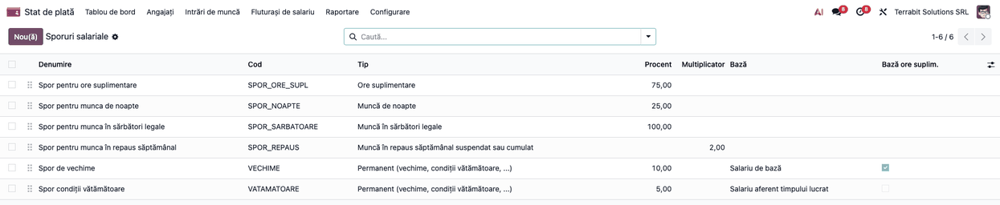
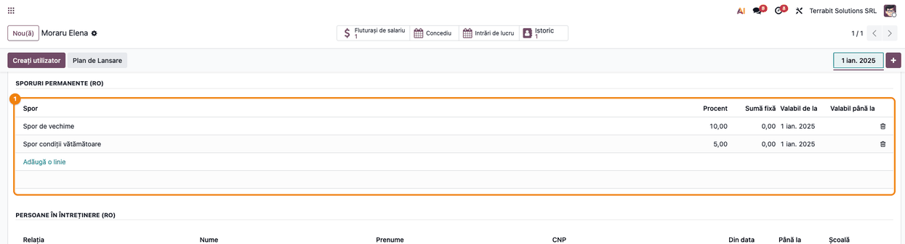
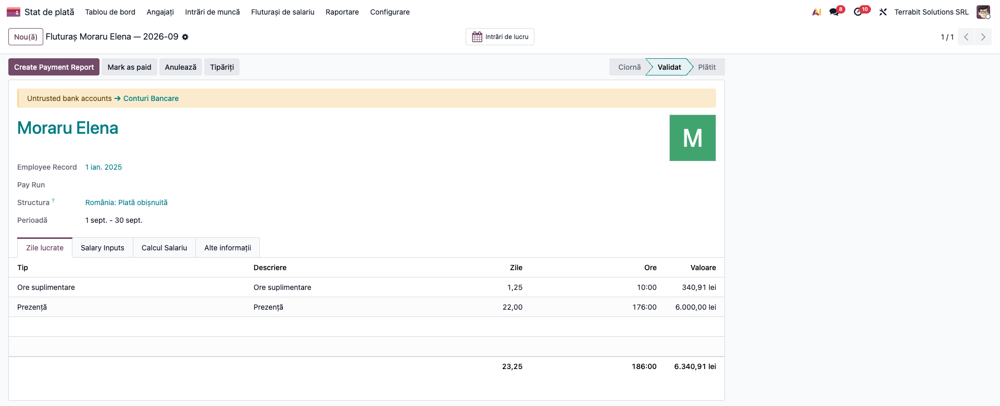
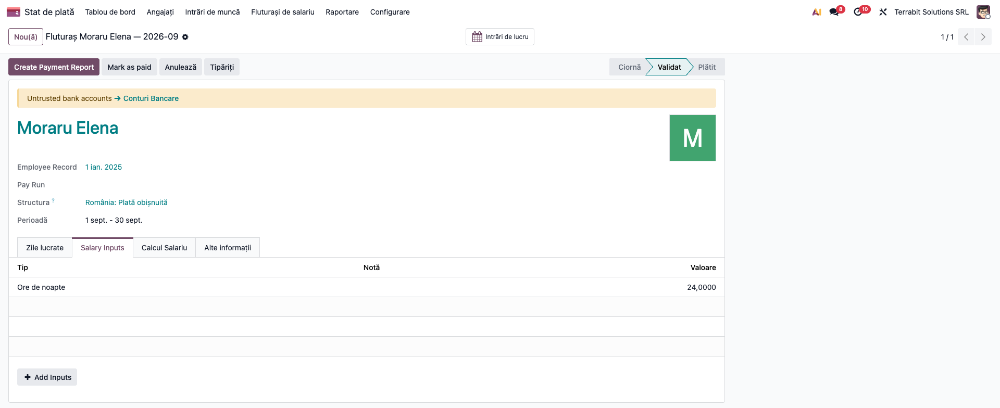
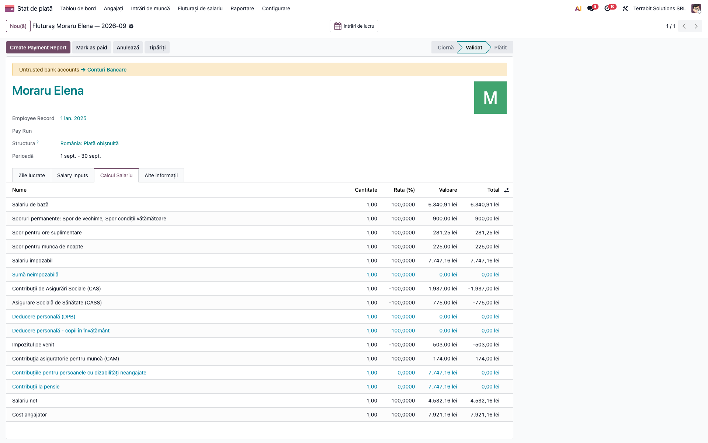

# Fișă Modul: Sporuri, ore suplimentare și muncă de noapte

**Modul:** `l10n_ro_payroll_allowances`
**Utilizator principal:** Responsabil salarizare / contabil
**Prioritate:** 🟡 Medie (sporurile se configurează o dată; calculul lunar e automat)

## 1. Scop business

Aduce în brutul fluturașului sporurile pe care firmele din România le plătesc lunar: sporuri permanente (vechime, condiții vătămătoare, ...), spor pentru orele suplimentare, spor pentru munca de noapte, spor pentru munca în sărbători legale și spor pentru munca în repaus săptămânal suspendat sau cumulat, plus tratarea orelor compensate cu timp liber. Contabilul nu mai calculează sporurile de mână și nu mai introduce sume ca «prime»: procentul și baza se configurează o dată, iar fluturașul le calculează, le include în CAS, CASS, CAM și impozit și le trece în media indemnizației de concediu, acolo unde legea cere.

## 2. Bază legală și context

- Codul muncii, art. 122 alin. (1) și art. 123 alin. (2): orele suplimentare se compensează cu timp liber plătit în următoarele **90 de zile calendaristice**; dacă nu e posibil, se plătesc cu un spor de cel puțin 75% din salariul de bază.
- Codul muncii, art. 125–126: munca de noapte (22:00–06:00); salariatul de noapte (cel puțin 3 ore de noapte din programul normal) primește program redus cu o oră sau un spor de cel puțin 25% din salariul de bază.
- Codul muncii, art. 142: munca în sărbătorile legale (unitățile de la art. 140 și locurile de muncă de la art. 141). Alin. (1): regula de bază este timp liber în următoarele **30 de zile**. Alin. (2): sporul, de cel puțin 100% din salariul de bază corespunzător muncii prestate în programul normal, se acordă doar dacă din motive justificate nu se dau zilele libere; timpul liber și sporul sunt alternative. Textul nu spune explicit dacă orele lucrate se plătesc separat, pe lângă ziua de sărbătoare rămasă plătită în salariul lunar: **de confirmat cu contractul colectiv**. Pentru angajatorii din afara art. 140–141 legea nu prevede explicit: **de confirmat juridic** (nu există temei confirmat pentru aplicarea prin analogie).
- Codul muncii, art. 137 alin. (4)–(5) și art. 138: repausul săptămânal acordat **cumulat** (alin. (4)–(5)) sau **suspendat** pentru lucrări urgente (art. 138) se plătește cu dublul compensațiilor de la art. 123 alin. (2), adică 2 × sporul de ore suplimentare (150% la 75%, 200% la 100%). Decizia ÎCCJ HP nr. 415/2025 (compensația se datorează chiar dacă munca din ziua de repaus nu depășește durata normală) este de confirmat juridic în raport cu implementarea: **Limită declarată (de confirmat juridic, decizia ÎCCJ HP nr. 415/2025):** sporul dublu se aplică doar orelor peste programul zilei (în ziua fără program, toate orele); pentru zile de repaus planificate sau cumulate într-un calendar de ture, orele din program nu primesc sporul dublu și se tratează cu un spor permanent sau manual. Repausul în alte zile decât sâmbătă–duminică (art. 137 alin. (2)–(3)): spor stabilit prin contractul colectiv sau individual, fără minim legal.
- Codul muncii, art. 150: media indemnizației de concediu include sporurile cu caracter permanent.
- Codul fiscal, art. 76 alin. (1): sporurile sunt venituri din salarii, deci intră în baza CAS, CASS, CAM și a impozitului.

## 3. Utilizatori și roluri

- **Utilizator salarizare:** adaugă sporurile pe angajat și introduce orele de noapte.
- **Administrator salarizare:** configurează nomenclatorul de sporuri.

## 4. Conturi și date implicate

- **641** Cheltuieli cu salariile personalului = **421** Personal – salarii datorate, prin linia `GROSS` (sporurile nu au conturi proprii).
- Date minime: un angajat cu versiune de contract, salariu lunar și prezențe generate pentru luna calculată.

## 5. Configurare inițială

1. Instalați `l10n_ro_payroll_allowances` (nu se instalează automat: schimbă brutul).
2. Verificați *Stat de plată → Configurare → Sporuri salariale*: există *Spor pentru ore suplimentare* (75%), *Spor pentru munca de noapte* (25%), *Spor pentru munca în sărbători legale* (100%, art. 142 alin. (2)) și *Spor pentru munca în repaus săptămânal* (multiplicator 2 × sporul de ore suplimentare, art. 137–138), cu minimele legale; nu pot fi coborâte sub minim, iar multiplicatorul repausului nu poate fi sub 2.
3. Creați sporurile permanente ale firmei (tip *Permanent*, procent, bază, bifa «în baza orelor suplimentare» doar dacă o prevede contractul).

## 6. Flux de utilizare

### Pasul 1 — Nomenclatorul de sporuri

*Stat de plată → Configurare → Sporuri salariale*. Fiecare spor are cod, tip, procent implicit și bază: **salariul de bază** (integral), **salariul aferent timpului lucrat** (reduce absențele fără plată) sau **salariul de bază plus celelalte sporuri permanente**.

**Verificați:** procentul orelor suplimentare ≥ 75, al sporului de noapte ≥ 25, al sporului de sărbătoare ≥ 100 și multiplicatorul repausului ≥ 2 (aceste patru sporuri nu se arhivează); baza sporurilor legate de munca prestată e *Salariu aferent timpului lucrat*.

**În luna cu concediu** (de odihnă, medical sau fără plată), sporurile pe *Salariu de bază*, *Salariu de bază plus sporuri* și sumele fixe se proratează cu timpul lucrat, iar indemnizația de concediu include deja drepturile permanente (media pe 3 luni și pragul din art. 150). Baza *Salariu aferent timpului lucrat* se proratează oricum.

### Pasul 2 — Sporurile permanente ale angajatului

*Angajați → fișa angajatului → fila Stat de plată → secțiunea Sporuri permanente (RO)*: adăugați sporul, procentul (sau suma fixă) și perioada de valabilitate. Un spor expirat sau început după lună nu intră în fluturaș. La schimbarea sporului pe un rând, procentul se preia din nomenclator (îl puteți modifica apoi); suma fixă are prioritate față de procent.

**Verificați:** fiecare rând are procent sau sumă fixă și data de început.

### Pasul 3 — Ore suplimentare și ore de noapte

- **Ore suplimentare:** vin din prezențele lunii, de tipul *Ore suplimentare* (de exemplu din pontaj, cu `l10n_ro_hr_pontaj_payroll`); le vedeți în fila *Zile lucrate* a fluturașului. Ele se plătesc la tariful orar prin salariul de bază (100%), iar sporul de 75% se adaugă separat. Folosiți acest tip numai pentru orele **plătite**; orele compensate cu timp liber se pontează pe alt tip de prezență, neplătit. Tipul de prezență *Ore suplimentare* trebuie să aibă rata 100%: sporul de 75% îl adaugă modulul (la o rată peste 100% diferența se scade din spor).

- **Sărbători legale, repaus săptămânal, ore compensate** (cu `l10n_ro_hr_pontaj_payroll`): tipurile de prezență *Ore suplimentare în sărbătoare legală* (`L10N_RO_OT_HOL`, rata implicită 1), *Ore suplimentare în repaus săptămânal* (`L10N_RO_OT_REST`) și *Ore suplimentare compensate cu timp liber* (`L10N_RO_OT_COMP`, rata 0) apar în fila *Zile lucrate*. Codurile de pontaj: orele într-o zi de sărbătoare legală, pontate cu codul obișnuit, merg automat pe tipul de sărbătoare; `RS` (repaus suspendat sau cumulat) merge pe tipul de repaus; `OC` (ore compensate) pe tipul compensat. Clasificarea ca repaus este explicită, aleasă de ofițerul de pontaj: o zi lucrată fără program poate fi simplă oră suplimentară la 75%.
- **Ore de noapte:** pe fluturaș, fila *Salary Inputs* (intrări), adăugați intrarea *Ore de noapte* cu numărul de ore.

**Cât se plătește la sărbătoare:** ziua rămâne plătită în salariul lunar; orele lucrate se plătesc 100% prin *Salariu de bază* (ca orele suplimentare, `L10N_RO_OT_HOL` are rata 1) plus *Spor pentru munca în sărbători legale* de 100% = ore × tarif × 100%. Art. 142 alin. (2) nu spune explicit dacă orele se plătesc separat: de confirmat cu contractul colectiv.

**Cod `RS` pe sărbătoare legală:** codul `RS` câștigă în fața tipului automat de sărbătoare, deci într-o zi de sărbătoare pontată cu `RS` se aplică repausul (≥ 150%), nu 100%; e deliberat (clasificarea explicită a ofițerului de pontaj are prioritate).

**Repaus suspendat sau cumulat — fără dublă plată:** orele `RS` dintr-o zi fără program se plătesc 100% (*Salariu de bază*) plus sporul dublu. La repausul **suspendat** (art. 138) nu se dau zile libere ulterior: orele sunt plătite plus sporul dublu. La repausul **cumulat** (art. 137 alin. (4)–(5)) zilele de repaus acordate ulterior **nu** se pontează `REC` plătit peste orele deja plătite (altfel orele se plătesc de două ori, ca la `OC`): se pontează neplătit sau nu se pontează.

**Compensarea cu timp liber — două termene diferite:** orele suplimentare se compensează în **90 de zile** (art. 122 alin. (1)); munca în sărbătoare legală, în **30 de zile** (art. 142 alin. (1)). Codul `OC` este descris pentru art. 122; compensarea sărbătorii se pontează tot cu `OC` (ore neplătite și fără spor), cu termenul de 30 de zile ținut manual, fiindcă modulul nu urmărește niciun termen. Ziua liberă se pontează apoi `REC` (plătit normal). Timpul liber și sporul sunt alternative: nu se dau amândouă pentru aceleași ore.

**Limită declarată (de confirmat juridic, decizia ÎCCJ HP nr. 415/2025):** sporul dublu se aplică doar orelor peste programul zilei (în ziua fără program, toate orele); pentru zile de repaus planificate sau cumulate într-un calendar de ture, orele din program nu primesc sporul dublu și se tratează cu un spor permanent sau manual.

**Verificați:** orele de noapte sunt cele lucrate între 22:00 și 06:00 de un salariat care are cel puțin 3 ore de noapte în programul normal.

### Pasul 4 — Fluturașul

Calculați fluturașul. În *Calcul Salariu* apar liniile *Sporuri permanente: …*, *Spor pentru ore suplimentare*, *Spor pentru munca de noapte* și, când există ore pe tipurile respective, `SPOR_SARBATOARE` (*Spor pentru munca în sărbători legale*) și `SPOR_REPAUS` (*Spor pentru munca în repaus săptămânal*), în brut, înaintea liniei de salariu impozabil.

**Verificați** cifrele din exemplu (salariu 6.000 lei, septembrie 2026 cu 176 de ore normale):

- tarif orar: 6.000 / 176 = 34,09 lei/oră; salariul de bază cu cele 10 ore suplimentare la 100%: 6.000 + 10 × 34,09 = 6.340,91;
- sporuri permanente: vechime 10% × 6.000 = 600, condiții vătămătoare 5% din timpul lucrat = 300, total 900;
- tarif pentru sporurile de ore suplimentare și de noapte: (6.000 + 600 vechime marcată «în baza orelor suplimentare») / 176 = 37,50 lei/oră;
- spor ore suplimentare: 10 × 37,50 × 75% = 281,25; spor noapte: 24 × 37,50 × 25% = 225,00;
- *Salariu impozabil* = 6.340,91 + 900 + 281,25 + 225 = 7.747,16; CAS 1.937, CASS 775, impozit 503, net 4.532,16.

### Note de monografie și raportare

- La validare (cu `l10n_ro_hr_payroll_account_enhancement` instalat; fără el fluturașul nu generează nota), pe exemplul de mai sus:
    - **Dr 641 = Cr 421** 7.747,16 (brutul, inclusiv sporurile; sporurile nu au conturi proprii);
    - **Dr 421 = Cr 4315** 1.937 (CAS) și **Dr 421 = Cr 4316** 775 (CASS);
    - **Dr 421 = Cr 444** 503 (impozit);
    - **Dr 646 = Cr 436** 174 (CAM).
    Soldul 421 rămâne 4.532,16, egal cu netul.
- D112 (din fluturași, cu `l10n_ro_anaf_d112_payroll`): sporurile intră în venitul brut (`E3_8`) și în bazele CAS, CASS și impozit ale asiguratului.

## 7. Legături cu alte module / declarații

| Modul | Rol |
|---|---|
| `l10n_ro_hr_payroll_enhancement` | fluturașul, regulile și media concediului de odihnă |
| `l10n_ro_hr_pontaj_payroll` | prezențele de tip *Ore suplimentare*, de sărbătoare, de repaus și compensate, din pontaj |
| `l10n_ro_hr_payroll_account_enhancement` | nota contabilă a fluturașului (641 = 421 etc.) |
| `l10n_ro_anaf_d112` / `l10n_ro_anaf_d112_payroll` | declararea veniturilor în D112, din fluturașii validați |

**Automat:** calculul sporurilor, includerea lor în brut și în media CO (sporurile permanente), minimul legal al procentului. **Manual:** alegerea codului `RS` sau `OC` în pontaj, orele de noapte, urmărirea termenelor de compensare (90 de zile la ore suplimentare, art. 122 alin. (1); 30 de zile la sărbătoare, art. 142 alin. (1)), alegerea celor două moduri la repaus cumulat (zilele acordate nu se pontează `REC` plătit peste orele plătite).

## 8. Verificări pentru consultant

- [ ] Procentele minime: ore suplimentare ≥ 75%, noapte ≥ 25%, sărbătoare ≥ 100%, multiplicatorul repausului ≥ 2.
- [ ] Sporul permanent apare în fluturaș, în brut, cu denumirea lui în titlul liniei.
- [ ] Sporul permanent expirat nu apare.
- [ ] Tipul de prezență *Ore suplimentare* are rata 100%.
- [ ] Într-o lună cu concediu, sporul pe salariul de bază e proratat cu timpul lucrat (nu se plătește integral).
- [ ] Orele suplimentare: *Salariu de bază* crește cu orele × tariful orar, iar *Spor pentru ore suplimentare* = ore × tarif × 75%.
- [ ] Orele din sărbători legale ajung pe tipul *Ore suplimentare în sărbătoare legală*: *Salariu de bază* crește cu orele × tarif (100%), iar *Spor pentru munca în sărbători legale* (`SPOR_SARBATOARE`) = ore × tarif × 100%; ziua de sărbătoare rămâne plătită în salariul lunar.
- [ ] Orele din repausul săptămânal sunt pontate cu codul `RS` (alegere explicită): *Spor pentru munca în repaus săptămânal* = ore × tarif × 2 × sporul de ore suplimentare (150% la 75%, 200% la 100%); sporul dublu se aplică doar orelor peste programul zilei.
- [ ] La repaus cumulat, zilele acordate ulterior nu sunt pontate `REC` plătit peste orele plătite.
- [ ] Orele compensate cu timp liber sunt pontate cu codul `OC` (nu se plătesc și nu primesc spor), iar ziua liberă cu `REC`, în 90 de zile (ore suplimentare) sau 30 de zile (sărbătoare).
- [ ] CAS, CASS și impozitul includ sporurile.

## 9. Mesaje de eroare frecvente

| Mesaj | Cauză | Remediere |
|---|---|---|
| Minimul legal al acestui spor este de 75% / 25% / 100% | procent sub minim la ore suplimentare, noapte sau sărbătoare | folosiți cel puțin minimul legal |
| Sporul pentru repaus este cel puțin de 2 ori sporul de ore suplimentare | multiplicator sub 2 | folosiți cel puțin 2 |
| Procentul și suma unui spor nu pot fi negative | valori negative pe rândul sporului | folosiți valori pozitive |
| Sporurile pentru ore suplimentare, muncă de noapte, sărbătoare și repaus nu se pot arhiva | arhivarea acestor sporuri | lăsați-le active (procentul ar deveni 0) |
| Completați un procent sau o sumă fixă pentru spor | rând de spor fără procent și fără sumă | completați unul dintre ele |
| Data de sfârșit a unui spor nu poate fi înaintea celei de început | perioadă inversă | corectați datele |
| Codul sporului trebuie să fie unic pe companie | cod dublat | alegeți alt cod |

## 10. Capturi de ecran

Generate automat din `tests/test_screenshots.py` (mixinul `ScreenshotCase` din `l10n_ro_doc_screenshots`, care trebuie instalat în baza de regenerare; altfel testul se sare), în RO, pe planul RO. Regenerare: `odoo-bin -c <conf> -d <baza_cu_ro_RO> -u l10n_ro_payroll_allowances --test-tags=fise_screenshots:TestAllowancesScreenshots --stop-after-init`.

- `01_nomenclator_sporuri.png`: nomenclatorul de sporuri.
- `02_sporuri_angajat.png`: sporurile permanente pe fișa angajatului.
- `03_fluturas_zile_lucrate.png`: orele suplimentare în fila *Zile lucrate*.
- `04_fluturas_ore_noapte.png`: intrarea *Ore de noapte*.
- `05_fluturas_sporuri.png`: fluturașul cu sporuri, ore suplimentare și de noapte.

## 11. Observații pentru manual

- Tariful orar este salariul lunar împărțit la orele normale ale lunii (variază de la lună la lună); se scrie în regulamentul intern sau contractul colectiv.
- În luna cu timp nelucrat, sporurile pe salariul de bază și sumele fixe se proratează cu timpul lucrat.
- Sporurile marcate «în baza orelor suplimentare» depășesc minimul legal (salariul de bază nu conține sporuri, art. 160 alin. (2)); se bifează doar dacă contractul le prevede.
- Munca în sărbători (art. 142): timpul liber în 30 de zile (alin. (1)) și sporul de cel puțin 100% (alin. (2)) sunt alternative; modulul plătește sporul pentru orele pontate pe tipul de sărbătoare, iar pentru timp liber se folosește codul `OC`, cu termenul de 30 de zile ținut manual. Ziua rămâne plătită în salariul lunar, orele se plătesc 100% plus spor 100%; dacă orele se plătesc separat este de confirmat cu contractul colectiv. Pentru angajatorii din afara art. 140–141: de confirmat juridic.
- Repausul săptămânal: multiplicatorul 2 se aplică sporului de ore suplimentare, nu este o valoare fixă de 150%; clasificarea este explicită (codul `RS`, care are prioritate și față de tipul automat de sărbătoare), fiindcă o zi lucrată fără program poate fi simplă oră suplimentară. Sporul dublu se aplică doar orelor peste programul zilei; pentru zile de repaus planificate sau cumulate în calendar de ture, de tratat cu un spor permanent sau manual (de confirmat juridic, HP 415/2025). La repausul cumulat, zilele acordate ulterior nu se pontează `REC` plătit peste orele plătite.
- Compensarea orelor suplimentare (art. 122 alin. (1), 90 de zile): modulul nu ține evidența termenului; dacă soldul rămâne necompensat, orele se plătesc ore × tarif × (100% + spor) și se pontează de mână ca ore suplimentare plătite.
- Clauza de mobilitate (art. 25 din Codul muncii, art. 76 alin. (4^1) din Codul fiscal) se tratează în alt modul / alt flux, nu aici.
- Sporurile de ore suplimentare și de noapte se calculează pe salariul de bază al lunii; în luna cu concediu, sporurile permanente se proratează, iar pragul minim al indemnizației de concediu folosește sporul proratat.
