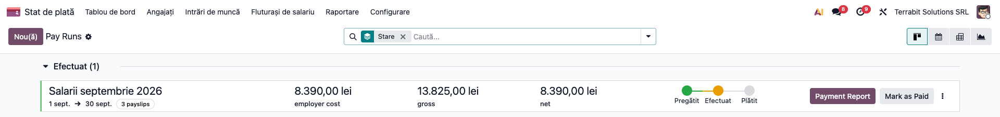
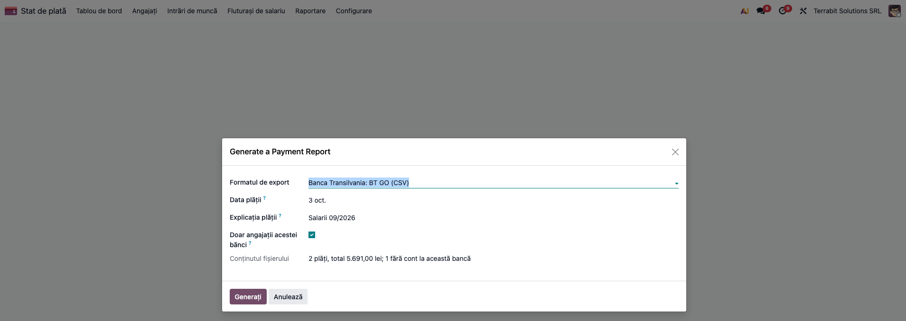
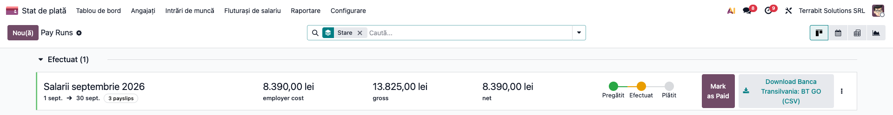

# Fișă Modul: Fișiere de plată a salariilor pentru bănci

**Modul:** `l10n_ro_payroll_bank_export`
**Utilizator principal:** contabil / operator salarizare
**Prioritate:** 🟡 Medie (economisește retastarea IBAN-urilor și a sumelor în aplicația băncii; nu schimbă calculul salariilor)
**Poziție plan:** S7 din `ROADMAP_salarizare_ro.md`

## 1. Scop business

După închiderea lotului de fluturași, contabilul trebuie să plătească restul de plată fiecărui angajat. Modulul generează, din lotul închis, fișierul pe care banca îl importă (Internet Banking, BRD@ffice, BT GO etc.), cu IBAN-ul, numele și suma fiecărui angajat. Se evită retastarea și erorile de transcriere.

## 2. Bază legală și context

Salariul se plătește în bani cel puțin o dată pe lună (Codul muncii, art. 166 alin. (1)). Formatele fișierelor sunt cele ale băncilor, nu un act normativ; modulul nu înregistrează plata în contabilitate: nota `421 = 5121` rămâne la extrasul de cont, ca până acum.

## 3. Utilizatori și roluri

- **Utilizator salarizare / Administrator salarizare**: generează fișierul (aceleași drepturi ca la raportul de plată standard).
- Contabilul care încarcă fișierul în aplicația băncii și îl aprobă acolo.

## 4. Conturi și date implicate

- pe fișa angajatului: **IBAN** (*Angajați → angajatul → tab Personal → Cont bancar*) și **CNP** (câmpul *Nr. identificare*);
- pe companie: denumirea, CUI-ul, strada și orașul (apar în formatele BRD, CEC și UniCredit);
- fluturașii lotului sunt **validați**, cu restul de plată mai mare ca zero.

## 5. Configurare inițială

1. Instalați modulul `l10n_ro_payroll_bank_export` (depinde de `l10n_ro_hr_payroll`).
2. Verificați că angajații au IBAN-ul completat; codul băncii din IBAN (literele 5–8) decide în ce fișier intră angajatul.
3. Completați datele companiei (denumire, CUI, stradă, oraș).

## 6. Flux de utilizare

### Pasul 1 — Deschideți lotul închis

**Stat de plată → Fluturași de salariu → Pay Runs**. Lotul în starea *Efectuat* are butonul **Payment Report** (Raport de plată).



### Pasul 2 — Alegeți formatul băncii

Apăsați **Payment Report**. În fereastră alegeți **Formatul de export** (de exemplu *Banca Transilvania: BT GO (CSV)*), data plății și, dacă e cazul, *Explicația plății* (implicit *Salarii LL/AAAA*).

**Citiți rezumatul** din câmpul *Conținutul fișierului*: numărul de plăți, totalul și câte conturi rămân în afara fișierului (alte bănci sau angajați fără cont). Doar angajații băncii alese intră în fișier; debifați *Doar angajații acestei bănci* ca să includeți toate conturile.



**Verificați înainte de a continua:**
- totalul din rezumat este suma restului de plată al angajaților acelei bănci (comparați cu fluturașii);
- numărul de conturi rămase în afară corespunde angajaților altor bănci sau celor plătiți altfel.

### Pasul 3 — Generați și încărcați fișierul

Apăsați **Generați**. Fișierul apare pe lot (și pe fiecare fluturaș) și se descarcă din buton. Exemplu, `TERRABIT_SOLUTIONS_SRL_031026_BT_GO.csv` (nume fără diacritice, majuscule, CRLF):

```
OrderNumber;SourceAccountNumber;TargetAccountNumber;BeneficiaryName;BeneficiaryBankBIC;BeneficiaryFiscalCode;Amount;PaymentRef1;PaymentRef2;ValueDate;Urgent
1;;RO10BTRLRONCRT00200TEST0;POPESCU MARIA;BTRLRO22XXX;;2710.00;Salarii 09/2026;;03/10/2026;F
2;;RO48BTRLRONCRT00100TEST0;STEFANESCU ION;BTRLRO22XXX;;2981.00;Salarii 09/2026;;03/10/2026;F
```



Generarea completează și *Data plății* pe toți fluturașii lotului: folosiți aceeași dată pentru toate băncile lotului.

Încărcați fișierul în aplicația băncii; **IBAN-ul plătitorului îl alegeți acolo** (fișierul îl lasă gol). Pentru BRD, același lot dă `Salarii_BRD@ffice.csv`, cu sumele fără zecimale și datele plătitorului din companie:

```
BRDE;;TERRABIT SOLUTIONS SRL;33947087;BRDE;RO30BRDERONCRT00202TEST0;IONESCU VASILE;1900210040036;1;03/10/2026;RON;2699;Salarii 09/2026;;;;;
```

### Pasul 4 — Repetați pentru celelalte bănci

Pentru angajații altor bănci repetați pașii 2–3 cu formatul băncii lor.

### Pasul 5 — După plată

După execuția plății la bancă, apăsați **Mark as Paid** pe lot, iar plata se înregistrează în contabilitate la extrasul de cont (`421 = 5121`). Pentru un singur angajat, același raport se generează din butonul *Create Payment Report* al fluturașului.

### Formate disponibile

BT (BT GO, CSV simplu), BRD (BRD@ffice), BCR (Click 24 / George, plăți salariale), ING (OneCSV, MT), CEC Bank (CSV), Raiffeisen (DBF), UniCredit (CSV), OTP (TXT), Alpha Bank (ALPHAClick). Lipsesc First Bank (integrată în Intesa Sanpaolo Bank România), Banca Românească (integrată în Exim Banca Românească) și MT100: formatul trebuie cerut băncii. **La BCR alegeți *Contul plătitor*** (IBAN-ul din care se plătește): fișierul începe cu el. La BRD și CEC se scrie dacă e ales.

## 7. Legături cu alte module / declarații

| Modul | Rol |
|---|---|
| `l10n_ro_hr_payroll` / `hr_payroll` | lotul, fluturașii și raportul de plată pe care îl extinde |
| `l10n_ro_hr_payroll_account_enhancement` | nota contabilă a salariilor (421); plata rămâne la extras |

**Automat:** conținutul fișierului (nume, IBAN, CNP, sumă, explicație, dată), filtrul pe banca din IBAN, arhivarea pe lot.
**Manual:** încărcarea și aprobarea în aplicația băncii, alegerea contului plătitorului, înregistrarea plății în contabilitate.

## 8. Verificări pentru consultant

- [ ] Rezumatul din fereastră arată numărul de plăți și totalul așteptat pentru banca aleasă.
- [ ] Fișierul se deschide în aplicația băncii fără eroare de format (încercare pe un lot mic, înainte de prima plată reală).
- [ ] Numele angajaților cu diacritice apar fără diacritice, cu majuscule.
- [ ] Un angajat cu IBAN la altă bancă nu apare în fișier, dar este numărat în rezumat la „fără cont la această bancă”.
- [ ] Un angajat cu mai multe conturi (repartizare a salariului) apare câte o dată pe cont, cu suma repartizată.
- [ ] BRD: suma apare cu virgulă și două zecimale (`3250,00`), iar coloana *Data* e goală; CEC / UniCredit / OTP: sumele întregi apar fără zecimale, un net cu bani cu două zecimale (de verificat cu banca).
- [ ] BCR: prima linie începe cu `OPM|`, urmată de total, IBAN-ul plătitorului și data; fiecare plată se termină cu `|N|6`.

## 9. Mesaje de eroare frecvente

| Mesaj | Cauză | Remediere |
|---|---|---|
| Alegeți contul plătitor: fișierul BCR începe cu IBAN-ul lui | formatul BCR fără contul plătitor | alegeți *Contul plătitor* (cont bancar al companiei) |
| Niciun angajat nu are cont la banca formatului ales | niciun IBAN al lotului nu are codul băncii formatului | alegeți formatul potrivit sau debifați *Doar angajații acestei bănci* |
| Ar trebui să existe cel puțin un fluturaș de salariu... | fereastra s-a deschis fără fluturași | deschideți fereastra din lot sau din fluturaș |
| There is no valid payslip (validated and net wage > 0)... | fluturașii nu sunt validați sau au rest de plată 0 | validați fluturașii |
| Listă „• Fluturaș X: ...” | fluturașii au probleme de calcul | rezolvați problemele indicate |

## 10. Capturi de ecran

Generate automat din `tests/test_screenshots.py` (mixinul `ScreenshotCase` din `l10n_ro_doc_screenshots`), în RO, pe planul RO:

- `01_loturi_raport_plata.png`: loturile de fluturași, cu butonul *Payment Report*;
- `02_fereastra_raport_plata.png`: fereastra raportului, formatul BT GO și rezumatul conținutului;
- `03_lot_fisier_generat.png`: lotul după generare, cu fișierul atașat.

Regenerare: `odoo-bin -c <conf> -d <baza_cu_ro_RO> -u l10n_ro_payroll_bank_export --test-tags=fise_screenshots:TestPayrollBankExportScreenshots --stop-after-init`

## 11. Observații pentru manual

- Fiecare bancă are propriul format; manualul trebuie să indice formatul pe bancă, nu o procedură unică.
- Formatele au fost aliniate cu fișierele pe care băncile le acceptă la import; înainte de prima plată reală se recomandă un import de probă.
- Plata nu se contabilizează din acest modul: se face la extrasul de cont, cu nota `421 = 5121`.
