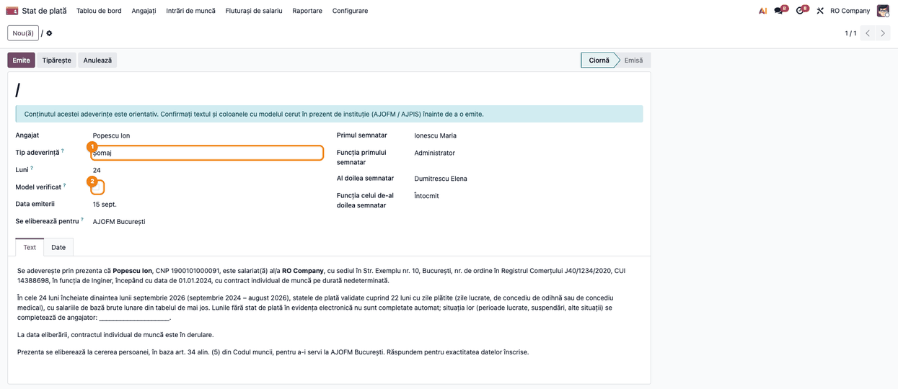
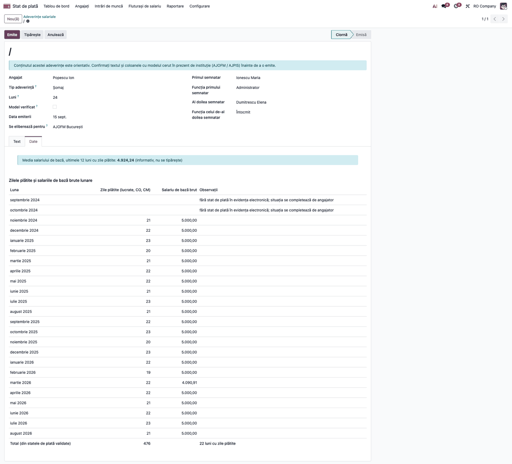
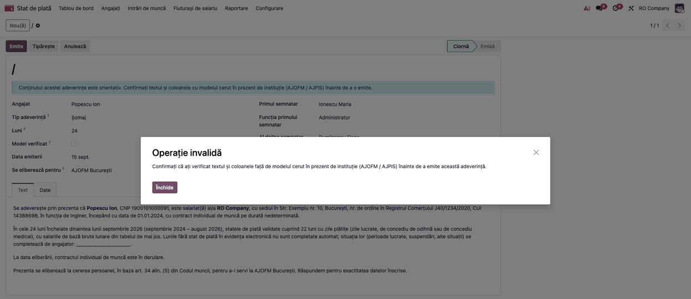
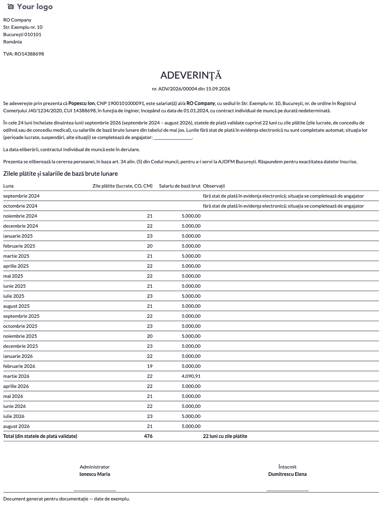
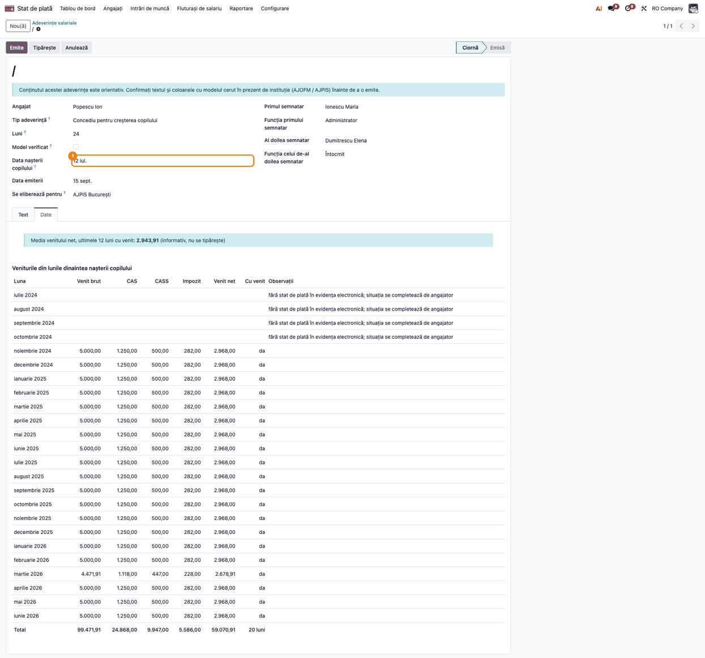
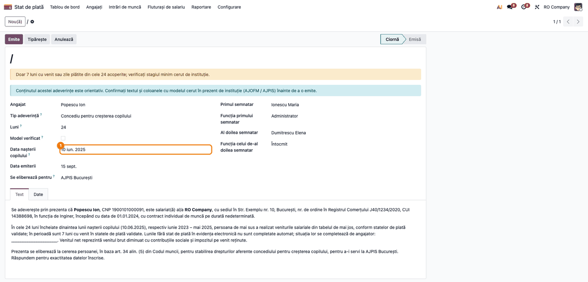

# Fișă Modul: Adeverințe salariale — venit, bază pentru concediul medical, asigurat, șomaj, creșterea copilului

**Modul:** `l10n_ro_payroll_certificates`
**Utilizator principal:** Inspector resurse umane / salarizare, Contabil salarii
**Prioritate:** 🟡 Medie (cerute lunar de angajați; nu schimbă calculul salariilor)

---

## 1. Scop business

Angajații cer des adeverințe: de venit (bancă, chirie, credit), cu baza pentru concediul medical (la schimbarea angajatorului) sau privind contribuția la sănătate. Modulul le emite **direct din fluturașii validați**, fără recopierea sumelor: textul se precompletează din fișa angajatului, tabelul se calculează, adeverința primește număr din secvență, două semnături și un PDF arhivat pe fișa angajatului.

## 2. Bază legală și context

- **Codul muncii, art. 34 alin. (5):** angajatorul eliberează, la cerere, document care atestă activitatea desfășurată, durata, salariul și vechimea, inclusiv pentru fost salariat.
- **OUG 158/2005**, concediul medical: art. 7 (stagiul de asigurare), **art. 10** (baza de calcul: ultimele 6 luni din cele 12 ale stagiului, venituri pe baza cărora se calculează contribuția asiguratorie pentru muncă; indemnizațiile de concediu medical se cuprind în baza lunii respective, alin. 4 lit. a) și art. 3^1 (adeverința plătitorului de indemnizații cu zilele de concediu medical).
- **Șomaj și concediul pentru creșterea copilului:** conținut **orientativ**, editabil în ciornă, **de confirmat cu modelul în vigoare cerut de AJOFM / AJPIS** înainte de utilizare. Regulile despre care nu avem confirmare sunt în roadmap-ul de salarizare (S9).
- Textele sunt documente oficiale românești: se scriu doar în limba română. **Modelul unei bănci sau al casei de asigurări prevalează** asupra modelului din modul.
- **De verificat:** dacă există un model obligatoriu de adeverință pentru stagiu și venituri în normele de aplicare (Ordinul MS/CNAS 15/1.311/2006); articolul din actul care fixează suma neimpozabilă pentru 2026.

## 3. Utilizatori și roluri

- **Inspector salarizare** (grupul *Utilizator salarizare*) — creează, editează și emite adeverințele;
- **Manager salarizare** — la fel; **Angajatul** nu are acces la modul.

## 4. Conturi și date implicate

Modulul **nu face înregistrări contabile**. Citește din fluturașii validați sau plătiți liniile: GROSS, CM_FS, CM_FNUASS, CAS, CAS_CM, CASS, CASS_CM, INCOMETAX, TAX_CM, NET, TICHETE, NEIMPOZ și zilele lucrate. Pe fișa angajatului folosește CNP-ul, funcția, datele contractului, iar pe companie denumirea, sediul, CUI și numărul din Registrul Comerțului. Date minime pentru demo: un angajat cu fluturași validați pe lunile cerute.

## 5. Configurare inițială

1. Instalați `l10n_ro_payroll_certificates` (necesită `l10n_ro_hr_payroll_enhancement`).
2. Completați pe companie denumirea, adresa, CUI și numărul din Registrul Comerțului (apar în text).
3. Validați fluturașii lunilor pe care vreți să le adeveriți; la *Venit* și *Asigurat* lunile fără fluturaș validat nu apar; la baza pentru concediul medical, șomaj și creșterea copilului apar cu celule goale și o observație (pașii 5, 7 și 8).

## 6. Flux de utilizare

### Pasul 1 — Lista adeverințelor

**Stat de plată → Angajați → Adeverințe salariale (RO)**. Lista arată numărul (pentru cele emise), data, angajatul, tipul, destinatarul și starea (*Ciornă*, *Emisă*, *Anulată*).


### Pasul 2 — Crearea adeverinței

Apăsați **Nou**: alegeți **angajatul** și **tipul adeverinței** (*Venit*, *Bază de calcul pentru concediul medical*, *Asigurat (sănătate)*). Pentru tipurile *Venit* și *Asigurat* completați **numărul de luni** (implicit 6; se iau lunile încheiate înainte de data emiterii), apoi **Data emiterii** și **Se eliberează pentru** (destinatarul; se tipărește în text). Completați cele două semnături (nume și funcție).

Pentru *Șomaj* și *Concediu pentru creșterea copilului* numărul de luni implicit este 24; la creșterea copilului completați obligatoriu **Data nașterii copilului** (fereastra = lunile dinaintea lunii nașterii), iar la șomaj perioada se oprește la încetarea contractului, dacă acesta a încetat. Formularul afișează o notă că **conținutul este orientativ**.

Fila **Text** se precompletează din fișa angajatului: CNP, funcție, data angajării, durata contractului; contractul încetat apare ca „a fost salariat(ă) … în perioada …", nu ca „în derulare". Textul se poate edita cât timp adeverința e în ciornă; dacă schimbați apoi tipul, luna sau destinatarul, textul se recalculează și editările se pierd.


### Pasul 3 — Verificarea datelor înainte de emitere

Deschideți fila **Date**: aici se vede tabelul exact cum se va tipări. Verificați:

1. **Avertismentul** din partea de sus (dacă există): „Doar X din cele N luni acoperite au fluturași validați" — validați fluturașii lipsă sau micșorați numărul de luni;
2. la **Venit**: *Venit net* = *Venit brut* − CAS − CASS − impozit; coloanele *Tichete de masă*, *Rețineri / popriri* și *din care indemnizații CM* apar doar când există;
3. la **Bază pentru concediul medical**: toate cele 12 luni anterioare lunii emiterii, inclusiv cele fără venit; *Venit realizat* este baza contribuției asiguratorii (fără suma neimpozabilă, cu indemnizațiile de concediu medical din FNUASS), iar al doilea tabel listează concediile medicale confirmate din perioadă, cu codul de indemnizație și zilele. *Venit mediu zilnic pe 12 luni (informativ)* apare doar în fila *Date*, nu pe documentul tipărit; al doilea tabel apare doar dacă există concedii medicale confirmate. Noul angajator își calculează baza la data concediului medical de la el;
4. la **Asigurat**: contribuția CASS reținută pe luni;
5. la **Șomaj**: vezi pasul 7;
6. la **Concediu pentru creșterea copilului**: vezi pasul 8;
7. la **Emite** (șomaj și creșterea copilului): bifa **Model verificat** e obligatorie; fără ea apare eroarea „Confirmați că ați verificat textul și coloanele față de modelul cerut în prezent de instituție (AJOFM / AJPIS) înainte de a emite această adeverință.”


### Pasul 4 — Emiterea și adeverința de venit (PDF)

Apăsați **Emite**: adeverința primește numărul (`ADV/an/nr`), starea devine *Emisă*, iar PDF-ul se arhivează ca atașament pe fișa angajatului (câmpul *PDF*). **Tipăriți** generează documentul pentru semnat. Verificați pe document: datele angajatului, perioada, tabelul, destinatarul, formula „Răspundem pentru exactitatea datelor înscrise" și cele două semnături.


### Pasul 5 — Adeverința cu baza pentru concediul medical

Se emite la fel. Textul cuprinde stagiul de asigurare și veniturile din ultimele 12 luni (OUG 158/2005, art. 7 și 10) și precizează că indemnizațiile de concediu medical sunt prezentate separat, iar suma neimpozabilă nu e cuprinsă în venit; trimiterea la al doilea tabel apare doar când există concedii medicale confirmate. Lunile fără fluturaș (de exemplu cele dinaintea punerii în funcțiune a Odoo) apar cu celule goale și observația „situația se completează de angajator” (sau „înainte de data angajării”), nu ca 0 zile și 0,00: completați situația reală înainte de emitere, altfel noul angajator poate calcula o bază mai mică. Zilele de concediu medical se adeveresc pe 12 luni; cazul de 24 de luni din art. 3^1 OUG 158/2005 nu e acoperit.


### Pasul 6 — Adeverința de asigurat

Atestă că societatea a calculat și a reținut contribuția CASS pe lunile din tabel și, dacă e cazul, că la data eliberării contractul este în derulare. **Nu atestă calitatea de asigurat** — aceasta o stabilește casa de asigurări de sănătate.


### Pasul 7 — Adeverința pentru șomaj (conținut orientativ, de confirmat cu modelul AJOFM)

Se creează cu tipul *Șomaj*, 24 de luni implicit (*Luni*): cele 24 de luni încheiate dinaintea lunii din *Data emiterii* (la contract încetat, până la luna încetării inclusiv). Formularul arată nota „conținutul acestei adeverințe este orientativ” și bifa **Model verificat**, necompletată în ciornă.



Fila *Date* arată toate cele 24 de luni, cu zilele plătite (lucrate, CO, CM) și salariul de bază brut din fluturaș (fără orele suplimentare, proporțional cu timpul plătit), totalul lunilor cu zile plătite și media salariului de bază pe ultimele 12 luni cu zile plătite (informativă, nu se tipărește). Lunile fără stat de plată în evidența electronică au celule goale și observația „situația se completează de angajator”; cele dinaintea datei angajării, „înainte de data angajării”. Modulul nu verifică contractul sau suspendările și nu afirmă motivul. **Atenție:** lunile dinaintea punerii în funcțiune a Odoo apar ca lipsă de stat de plată, deși salariatul a lucrat (în captură, septembrie–octombrie 2024); situația reală se completează în textul editabil. Stagiul de cotizare îl stabilește AJOFM, nu modulul.



Fără bifa *Model verificat*, **Emite** este refuzat:



După bifare și emitere, documentul tipărit conține tabelul, totalul lunilor cu zile plătite și cele două semnături, fără media pe el:



### Pasul 8 — Adeverința pentru concediul de creștere a copilului (conținut orientativ, de confirmat cu modelul AJPIS)

Se completează *Data nașterii copilului* (obligatorie); tabelul din fila *Date* cuprinde cele 24 de luni dinaintea lunii nașterii, cu brut, CAS, CASS, impozit, net și marcajul „da”. Lunile fără stat de plată în evidența electronică, inclusiv cele dinaintea punerii în funcțiune a Odoo, au **celulele cu sume goale** (nu 0,00) și observația „situația se completează de angajator” (în captură, iulie–octombrie 2024), iar cele dinaintea datei angajării, „înainte de data angajării”; nu sunt declarate „fără venit”. Textul, care se încheie cu „Răspundem pentru exactitatea datelor”, cere completarea situației lor de către angajator. Media netă pe ultimele 12 luni cu venit se vede doar în fila *Date*.



Sub 12 luni cu venit apare avertismentul din partea de sus a formularului (în exemplu, 7 luni din 24):



### Pasul 9 — Adeverința emisă

După emitere, câmpurile și tabelul sunt blocate (**Anulează** o scoate din uz, iar după anulare **Setează ca ciornă** o redeschide; la reemitere adeverința primește un număr nou); o adeverință emisă **nu se șterge**. Tabelul și textul emise nu se recalculează la retipărire, deci documentul rămâne identic cu PDF-ul arhivat.


## 7. Legături cu alte module / declarații

| Modul | Rol |
|---|---|
| `l10n_ro_hr_payroll_enhancement` (19.0.2.6.3+) | Fluturașii, regulile salariale și certificatele medicale din care se citesc veniturile și concediile |

**Ce e automat:** textul din fișa angajatului, tabelul din fluturașii validați, numărul, PDF-ul arhivat. **Ce rămâne manual:** destinatarul, semnăturile, verificarea modelului cerut de destinatar, concediile medicale de la alt angajator (nu apar).

## 8. Verificări pentru consultant

- [ ] Adeverința de venit pe 6 luni are câte o linie pe lună cu fluturaș validat; lunile cu ciornă sau fără fluturaș lipsesc și apare avertismentul.
- [ ] *Venit net* = brut − CAS − CASS − impozit; reținerile (sindicat, popriri) apar separat.
- [ ] La baza pentru concediul medical sunt 12 luni, cu zilele de stagiu și concediile medicale din perioadă (cu cod de indemnizație).
- [ ] La un salariat plătit cu salariul minim, venitul din baza CM nu include suma neimpozabilă, iar certificatul medical din `l10n_ro_hr_payroll_enhancement` dă aceeași bază.
- [ ] Contractul încetat apare la timpul trecut, fără „durată determinată".
- [ ] Textul editat nu se pierde la emitere; tabelul nu se schimbă la retipărire.
- [ ] Numărul urmează secvența `ADV/an/nr`; PDF-ul e pe fișa angajatului.
- [ ] Șomaj: 24 de luni, lunile fără fluturaș marcate, avertisment sub 12 luni cu venit sau zile plătite, perioada oprită la încetarea contractului.
- [ ] Creșterea copilului: fără data nașterii adeverința nu se salvează; fereastra se mută odată cu data; avertisment sub 12 luni cu venit; lunile fără stat de plată sunt marcate neutru, nu „fără venit”.
- [ ] La șomaj, completați manual situația lunilor fără stat de plată; salariul de bază nu include orele suplimentare; fără *Model verificat* adeverința nu se emite.
- [ ] Textul și coloanele celor două tipuri au fost comparate cu modelul cerut de AJOFM / AJPIS.

## 9. Mesaje de eroare frecvente

| Mesaj | Cauză | Remediere |
|---|---|---|
| Nu există fluturași validați de adeverit pentru … | Lunile acoperite nu au fluturaș validat/plătit | Validați fluturașii sau micșorați numărul de luni |
| Nu există fluturași validați pentru lunile acoperite. | Niciuna dintre lunile acoperite nu are fluturaș validat (avertisment în ciornă) | Validați fluturașii sau schimbați perioada |
| Se pot emite doar adeverințe în ciornă. | **Emite** pe o adeverință deja emisă sau anulată | Folosiți **Setează ca ciornă** (după **Anulează**), apoi emiteți din nou |
| Doar X din cele N luni acoperite au fluturași validați | Unele luni lipsesc (venit, asigurat) | Validați fluturașii lipsă |
| Doar N luni cu venit sau zile plătite din cele 24 acoperite; verificați stagiul minim cerut de instituție. | Șomaj sau creșterea copilului: sub 12 luni cu venit | Verificați stagiul minim cerut de instituție; validați fluturașii lipsă |
| Doar N din cele 6 luni ale bazei de calcul au venit. | Baza pentru concediul medical: sub 6 luni cu venit | Validați fluturașii lipsă; noul angajator calculează baza la data concediului |
| Confirmați că ați verificat textul și coloanele față de modelul cerut în prezent de instituție (AJOFM / AJPIS) înainte de a emite această adeverință. | **Emite** la șomaj sau creșterea copilului fără bifa *Model verificat* | Comparați adeverința cu modelul instituției, apoi bifați *Model verificat* |
| Data nașterii copilului este obligatorie pentru concediul pentru creșterea copilului. | Tip *Concediu pentru creșterea copilului* fără data nașterii | Completați *Data nașterii copilului* |
| Completați data nașterii copilului. | Aceeași situație, avertisment în ciornă | Completați *Data nașterii copilului* |
| Numărul de luni trebuie să fie între 1 și 36 | Valoare în afara intervalului | Corectați câmpul *Luni* |
| O adeverință emisă nu poate fi ștearsă; anulați-o | Încercare de ștergere după emitere | Folosiți **Anulează** |

## 10. Capturi de ecran

Capturile sunt **generate automat** din `tests/test_screenshots.py` (mixin `ScreenshotCase` din `l10n_ro_doc_screenshots`, import defensiv), în română, pe planul RO:

1. `01_lista_adeverinte.png` — lista adeverințelor.
2. `02_formular_adeverinta.png` — formularul, cu tipul și destinatarul.
3. `03_date_baza_cm.png` — fila *Date* a bazei pentru concediul medical.
4. `04_pdf_venit.png` — adeverința de venit (PDF).
5. `05_pdf_baza_cm.png` — adeverința cu baza pentru concediul medical (PDF).
6. `06_pdf_asigurat.png` — adeverința de asigurat (PDF).
7. `07_adeverinta_emisa.png` — adeverința emisă, cu numărul și PDF-ul arhivat.
8. `08_somaj_formular.png` — adeverința de șomaj: tip, notă orientativă, bifa *Model verificat*.
9. `09_somaj_date.png` — adeverința de șomaj, fila *Date*: tabelul pe 24 de luni, cu lunile fără stat de plată marcate neutru.
10. `10_somaj_eroare_model_neverificat.png` — eroarea la **Emite** fără *Model verificat*.
11. `11_pdf_somaj.png` — adeverința de șomaj (PDF).
12. `12_crestere_copil_date.png` — concediul pentru creșterea copilului, fila *Date* (lunile fără stat de plată marcate neutru).
13. `13_crestere_copil_avertisment.png` — avertismentul sub 12 luni cu venit (7 din 24).

```bash
./odoo/odoo-bin -c odoo.conf -d test19 --load-language=ro_RO -i l10n_ro_payroll_certificates,l10n_ro_doc_screenshots \
  --test-tags=/l10n_ro_payroll_certificates:TestPayrollCertificatesScreenshots --stop-after-init
```

## 11. Observații pentru manual

- Subliniați că adeverința nu înlocuiește modelul cerut de bancă sau de casa de asigurări: textul se editează în ciornă.
- Baza pentru concediul medical e un **document informativ pentru noul angajator**: baza efectivă o calculează el, la data concediului.
- Limite cunoscute:
  - șomajul și creșterea copilului au conținut orientativ, neconfirmat cu modelele oficiale (de verificat, vezi secțiunea 2);
  - **declarația de venituri peste salariul minim nu este implementată**: ține de cumulul de contracte (art. 146 alin. 5^7 lit. e din Codul fiscal) și de un ordin al ministerului finanțelor al cărui număr și model nu sunt confirmate;
  - zilele plătite (la șomaj) numără doar zilele lucrate, concediul de odihnă și concediul medical; alte absențe plătite nu se numără; stagiul de cotizare îl stabilește AJOFM;
  - la baza pentru concediul medical, zilele de concediu medical se adeveresc pe 12 luni; cazul de 24 de luni din art. 3^1 OUG 158/2005 nu e acoperit;
  - la șomaj și la creșterea copilului, lunile dinaintea punerii în funcțiune a Odoo apar fără stat de plată, deși salariatul a lucrat: situația se completează manual în textul editabil;
  - la baza pentru concediul medical, lunile fără fluturaș (inclusiv cele dinaintea Odoo) apar cu celule goale și observație; completarea lor rămâne în sarcina angajatorului;
  - baza CM raportează venitul realizat; plafonul de 12 salarii minime îl aplică angajatorul care plătește concediul medical, nu adeverința;
  - concediile medicale înregistrate la alt angajator nu apar;
  - baza concediului medical din certificatul medical (`l10n_ro_hr_payroll_enhancement` 19.0.2.6.3+) exclude, ca și adeverința, suma neimpozabilă (art. 10 alin. 1); **de verificat** actul care fixează suma neimpozabilă pentru 2026.
