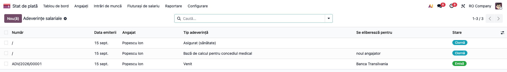
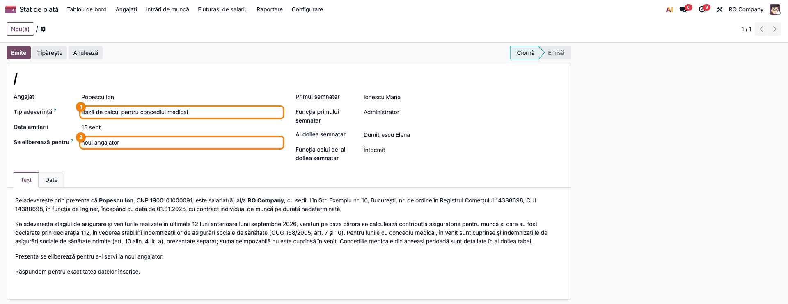
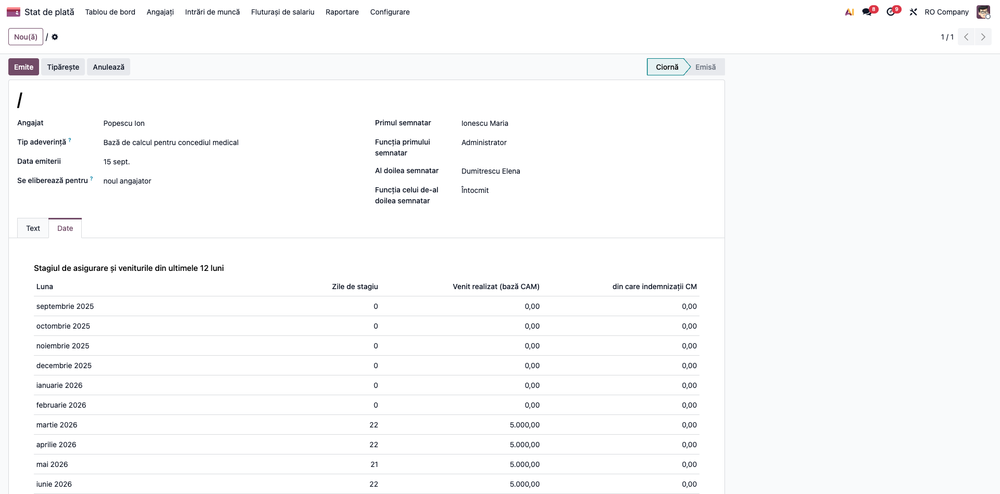
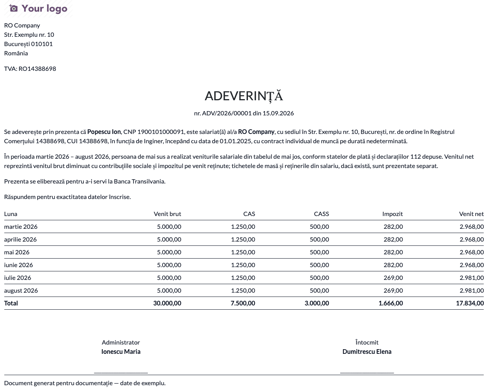
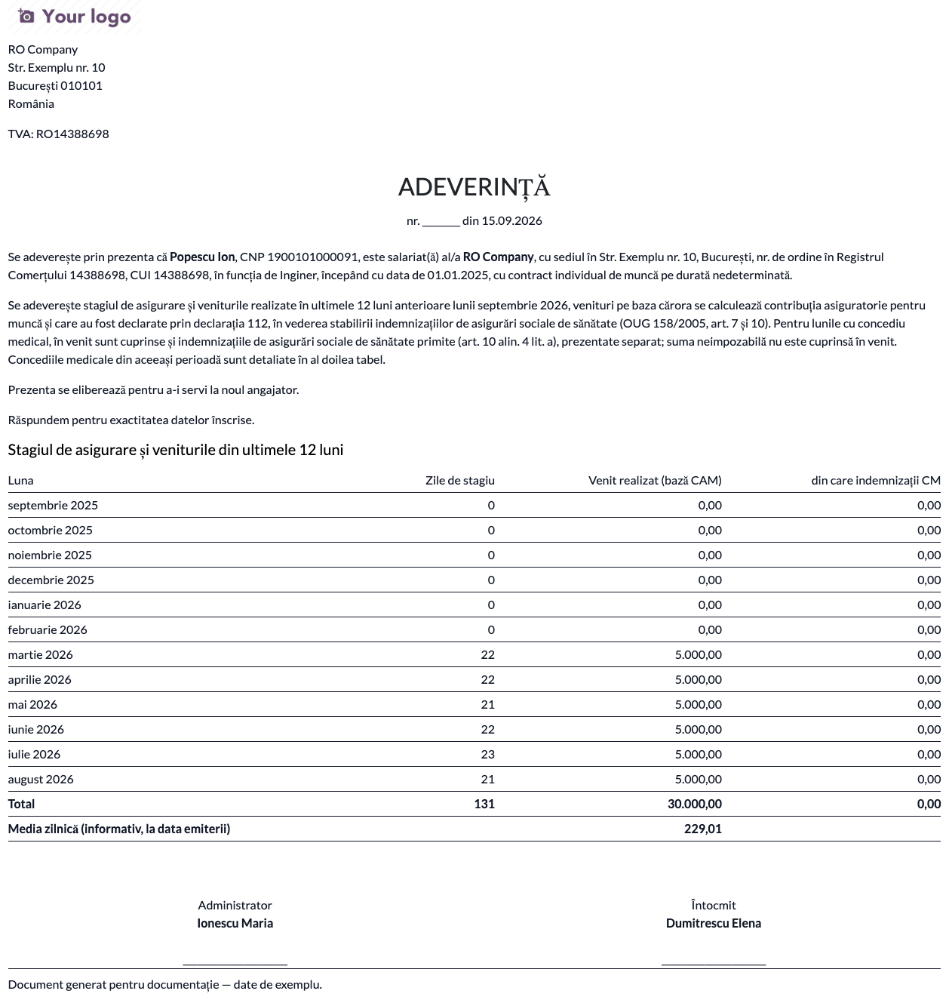
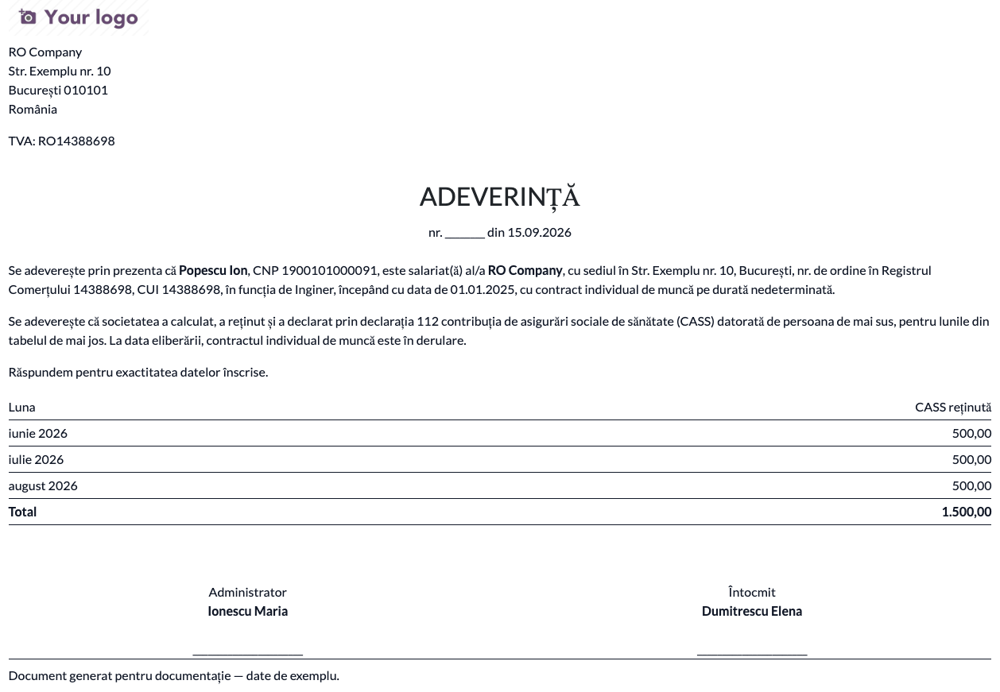
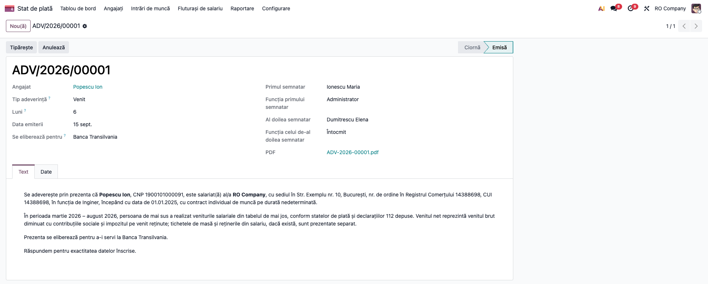

# Fișă Modul: Adeverințe salariale — venit, bază pentru concediul medical, asigurat

**Modul:** `l10n_ro_payroll_certificates`
**Utilizator principal:** Inspector resurse umane / salarizare, Contabil salarii
**Prioritate:** 🟡 Medie (cerute lunar de angajați; nu schimbă calculul salariilor)

---

## 1. Scop business

Angajații cer des adeverințe: de venit (bancă, chirie, credit), cu baza pentru concediul medical (la schimbarea angajatorului) sau privind contribuția la sănătate. Modulul le emite **direct din fluturașii validați**, fără recopierea sumelor: textul se precompletează din fișa angajatului, tabelul se calculează, adeverința primește număr din secvență, două semnături și un PDF arhivat pe fișa angajatului.

## 2. Bază legală și context

- **Codul muncii, art. 34 alin. (5):** angajatorul eliberează, la cerere, document care atestă activitatea desfășurată, durata, salariul și vechimea, inclusiv pentru fost salariat.
- **OUG 158/2005**, concediul medical: art. 7 (stagiul de asigurare), **art. 10** (baza de calcul: ultimele 6 luni din cele 12 ale stagiului, venituri pe baza cărora se calculează contribuția asiguratorie pentru muncă; indemnizațiile de concediu medical se cuprind în baza lunii respective, alin. 4 lit. a) și art. 3^1 (adeverința plătitorului de indemnizații cu zilele de concediu medical).
- Textele sunt documente oficiale românești: se scriu doar în limba română. **Modelul unei bănci sau al casei de asigurări prevalează** asupra modelului din modul.
- **De verificat:** dacă există un model obligatoriu de adeverință pentru stagiu și venituri în normele de aplicare (Ordinul MS/CNAS 15/1.311/2006); articolul din actul care fixează suma neimpozabilă pentru 2026.

## 3. Utilizatori și roluri

- **Inspector salarizare** (grupul *Utilizator salarizare*) — creează, editează și emite adeverințele;
- **Manager salarizare** — la fel; **Angajatul** nu are acces la modul.

## 4. Conturi și date implicate

Modulul **nu face înregistrări contabile**. Citește din fluturașii validați sau plătiți liniile: GROSS, CM_FS, CM_FNUASS, CAS, CAS_CM, CASS, CASS_CM, INCOMETAX, TAX_CM, NET, TICHETE, NEIMPOZ și zilele lucrate. Pe fișa angajatului folosește CNP-ul, funcția, datele contractului, iar pe companie denumirea, sediul, CUI și numărul din Registrul Comerțului. Date minime pentru demo: un angajat cu fluturași validați pe lunile cerute.

## 5. Configurare inițială

1. Instalați `l10n_ro_payroll_certificates` (necesită `l10n_ro_hr_payroll_enhancement`).
2. Completați pe companie denumirea, adresa, CUI și numărul din Registrul Comerțului (apar în text).
3. Validați fluturașii lunilor pe care vreți să le adeverești; lunile fără fluturaș validat nu apar.

## 6. Flux de utilizare

### Pasul 1 — Lista adeverințelor

**Stat de plată → Angajați → Adeverințe salariale (RO)**. Lista arată numărul (pentru cele emise), data, angajatul, tipul, destinatarul și starea (*Ciornă*, *Emisă*, *Anulată*).



### Pasul 2 — Crearea adeverinței

Apăsați **Nou**: alegeți **angajatul** și **tipul adeverinței** (*Venit*, *Bază de calcul pentru concediul medical*, *Asigurat (sănătate)*). Pentru tipurile *Venit* și *Asigurat* completați **numărul de luni** (implicit 6; se iau lunile încheiate înainte de data emiterii), apoi **Data emiterii** și **Se eliberează pentru** (destinatarul; se tipărește în text). Completați cele două semnături (nume și funcție).

Fila **Text** se precompletează din fișa angajatului: CNP, funcție, data angajării, durata contractului; contractul încetat apare ca „a fost salariat(ă) … în perioada …", nu ca „în derulare". Textul se poate edita cât timp adeverința e în ciornă; dacă schimbați apoi tipul, luna sau destinatarul, textul se recalculează și editările se pierd.



### Pasul 3 — Verificarea datelor înainte de emitere

Deschideți fila **Date**: aici se vede tabelul exact cum se va tipări. Verificați:

1. **Avertismentul** din partea de sus (dacă există): „Doar X din cele N luni acoperite au fluturași validați" — validați fluturașii lipsă sau micșorați numărul de luni;
2. la **Venit**: *Venit net* = *Venit brut* − CAS − CASS − impozit; coloanele *Tichete de masă*, *Rețineri / popriri* și *din care indemnizații CM* apar doar când există;
3. la **Bază pentru concediul medical**: toate cele 12 luni anterioare lunii emiterii, inclusiv cele fără venit; *Venit realizat* este baza contribuției asiguratorii (fără suma neimpozabilă, cu indemnizațiile de concediu medical din FNUASS), iar al doilea tabel listează concediile medicale confirmate din perioadă, cu codul de indemnizație și zilele. *Media zilnică* e informativă: noul angajator își calculează baza la data concediului medical de la el;
4. la **Asigurat**: contribuția CASS reținută pe luni.



### Pasul 4 — Emiterea și adeverința de venit (PDF)

Apăsați **Emite**: adeverința primește numărul (`ADV/an/nr`), starea devine *Emisă*, iar PDF-ul se arhivează ca atașament pe fișa angajatului (câmpul *PDF*). **Tipăriți** generează documentul pentru semnat. Verificați pe document: datele angajatului, perioada, tabelul, destinatarul, formula „Răspundem pentru exactitatea datelor înscrise" și cele două semnături.



### Pasul 5 — Adeverința cu baza pentru concediul medical

Se emite la fel. Textul cuprinde stagiul de asigurare și veniturile din ultimele 12 luni (OUG 158/2005, art. 7 și 10) și precizează că indemnizațiile de concediu medical sunt prezentate separat, iar suma neimpozabilă nu e cuprinsă în venit.



### Pasul 6 — Adeverința de asigurat

Atestă că societatea a calculat, a reținut și a declarat prin D112 contribuția CASS pe lunile din tabel și, dacă e cazul, că la data eliberării contractul este în derulare. **Nu atestă calitatea de asigurat** — aceasta o stabilește casa de asigurări de sănătate.



### Pasul 7 — Adeverința emisă

După emitere, câmpurile și tabelul sunt blocate (**Anulează** o scoate din uz, iar **Setează ca ciornă** o redeschide); o adeverință emisă **nu se șterge**. Tabelul și textul emise nu se recalculează la retipărire, deci documentul rămâne identic cu PDF-ul arhivat.



## 7. Legături cu alte module / declarații

| Modul | Rol |
|---|---|
| `l10n_ro_hr_payroll_enhancement` (19.0.2.6.3+) | Fluturașii, regulile salariale și certificatele medicale din care se citesc veniturile și concediile |
| `l10n_ro_anaf_d112` | Declarația la care face trimitere textul (nu există legătură în date) |

**Ce e automat:** textul din fișa angajatului, tabelul din fluturașii validați, numărul, PDF-ul arhivat. **Ce rămâne manual:** destinatarul, semnăturile, verificarea modelului cerut de destinatar, concediile medicale de la alt angajator (nu apar).

## 8. Verificări pentru consultant

- [ ] Adeverința de venit pe 6 luni are câte o linie pe lună cu fluturaș validat; lunile cu ciornă sau fără fluturaș lipsesc și apare avertismentul.
- [ ] *Venit net* = brut − CAS − CASS − impozit; reținerile (sindicat, popriri) apar separat.
- [ ] La baza pentru concediul medical sunt 12 luni, cu zilele de stagiu și concediile medicale din perioadă (cu cod de indemnizație).
- [ ] La un salariat plătit cu salariul minim, venitul din baza CM nu include suma neimpozabilă, iar certificatul medical (D_17) dă aceeași bază.
- [ ] Contractul încetat apare la timpul trecut, fără „durată determinată".
- [ ] Textul editat nu se pierde la emitere; tabelul nu se schimbă la retipărire.
- [ ] Numărul urmează secvența `ADV/an/nr`; PDF-ul e pe fișa angajatului.

## 9. Mesaje de eroare frecvente

| Mesaj | Cauză | Remediere |
|---|---|---|
| Nu există fluturași validați de adeverit pentru … | Lunile acoperite nu au fluturaș validat/plătit | Validați fluturașii sau micșorați numărul de luni |
| Doar X din cele N luni acoperite au fluturași validați | Unele luni lipsesc | Validați fluturașii lipsă |
| Numărul de luni trebuie să fie între 1 și 36 | Valoare în afara intervalului | Corectați câmpul *Luni* |
| O adeverință emisă nu poate fi ștearsă; anulați-o | Încercare de ștergere după emitere | Folosiți **Anulează** |

## 10. Capturi de ecran

Capturile sunt **generate automat** din `tests/test_screenshots.py` (mixin `ScreenshotCase` din `l10n_ro_doc_screenshots`, import defensiv), în română, pe planul RO:

1. `01_lista_adeverinte.png` — lista adeverințelor.
2. `02_formular_adeverinta.png` — formularul, cu tipul și destinatarul.
3. `03_date_baza_cm.png` — fila *Date* a bazei pentru concediul medical.
4. `04_pdf_venit.png` — adeverința de venit (PDF).
5. `05_pdf_baza_cm.png` — adeverința cu baza pentru concediul medical (PDF).
6. `06_pdf_asigurat.png` — adeverința de asigurat (PDF).
7. `07_adeverinta_emisa.png` — adeverința emisă, cu numărul și PDF-ul arhivat.

```bash
./odoo/odoo-bin -c odoo.conf -d test19 --load-language=ro_RO -i l10n_ro_payroll_certificates,l10n_ro_doc_screenshots \
  --test-tags=/l10n_ro_payroll_certificates:TestPayrollCertificatesScreenshots --stop-after-init
```

## 11. Observații pentru manual

- Subliniați că adeverința nu înlocuiește modelul cerut de bancă sau de casa de asigurări: textul se editează în ciornă.
- Baza pentru concediul medical e un **document informativ pentru noul angajator**: baza efectivă o calculează el, la data concediului.
- Limite cunoscute:
  - nu există încă adeverințele pentru șomaj (Anexa 7), concediul pentru creșterea copilului și venituri peste salariul minim;
  - zilele de stagiu numără doar zilele lucrate, concediul de odihnă și concediul medical; alte absențe plătite nu se numără;
  - concediile medicale înregistrate la alt angajator nu apar;
  - baza concediului medical din certificatul medical (`l10n_ro_hr_payroll_enhancement` 19.0.2.6.3+) exclude, ca și adeverința, suma neimpozabilă (art. 10 alin. 1); **de verificat** actul care fixează suma neimpozabilă pentru 2026.
