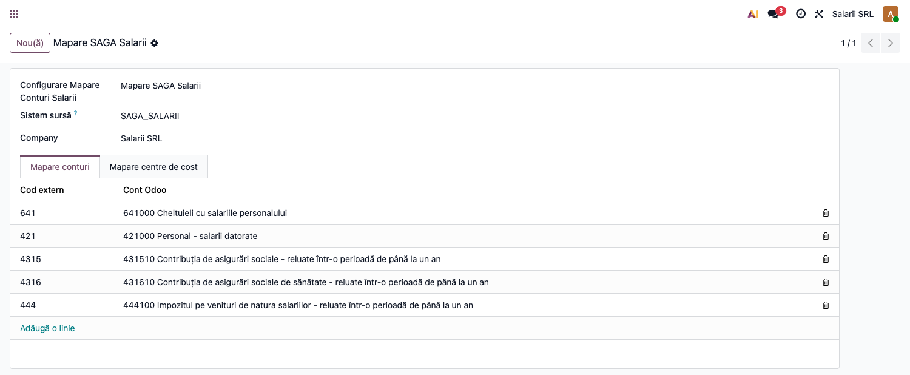
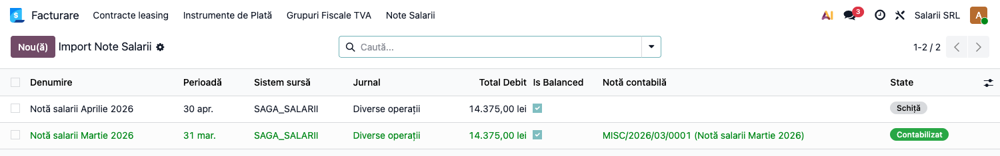
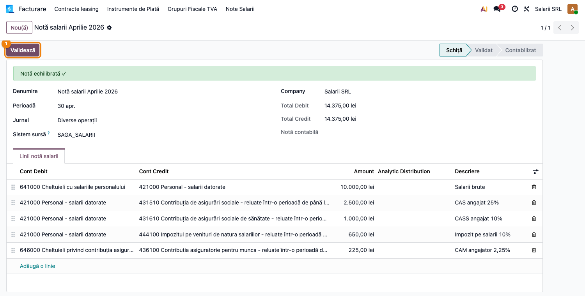
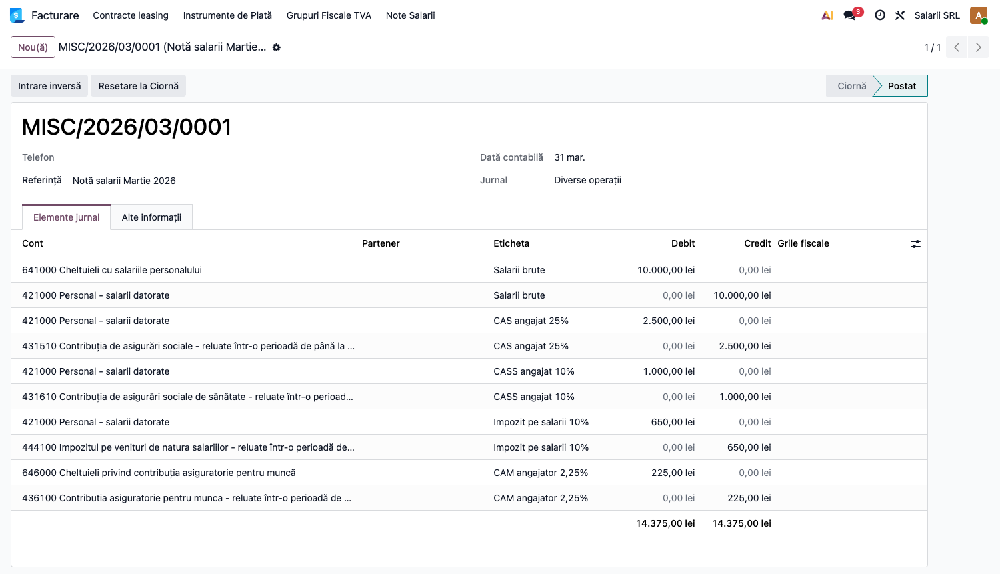

# Fișă Modul: Import Note Salarii

**Modul:** `l10n_ro_payroll_import`
**FR:** FR-13
**Capitol manual:** Cap 10.3 — Import note salarii
**Utilizator principal:** Contabil salarii, Contabil șef
**Prioritate:** 🟡 Medie
**Status document:** Draft consultant

---

## 1. Scop business

Modulul permite importul lunar al notei contabile de salarii din aplicații externe
de salarizare, precum SAGA Salarii, Nexus HR, Charisma sau fișiere interne exportate
în format generic.

Scopul este ca departamentul financiar să poată prelua rapid nota de salarii în
Odoo, cu mapare pe conturi contabile și centre de cost, fără reintroducere manuală
a liniilor contabile.

---

## 2. Bază legală și context

Nota contabilă de salarii reflectă obligațiile salariale lunare în contabilitate:

- cheltuieli salariale: `641`;
- datorii către personal: `421`;
- contribuții sociale: `431x`;
- impozit salarii: `444`;
- contribuția asiguratorie pentru muncă: `646` / conturi configurate local.

Modulul acoperă importul notei contabile. Declarația D112 propriu-zisă rămâne cerință
separată, tratată în FR-44.

---

## 3. Utilizatori și roluri

| Rol | Responsabilitate |
|-----|------------------|
| Contabil salarii | Importă fișierul și verifică liniile generate |
| Contabil șef | Validează și postează nota contabilă |
| Administrator financiar | Configurează jurnalul și mapările de conturi/centre de cost |

---

## 4. Configurare inițială

### 4.1 Jurnal salarii

**Contabilitate → Configurare → Jurnale → Nou**

| Câmp | Valoare recomandată |
|------|---------------------|
| Nume | Salarii |
| Tip | Diverse |
| Cod scurt | SAL |

### 4.2 Mapare conturi salarii

**Contabilitate → Configurare → Mapare Conturi Salarii → Nou**

| Câmp | Exemplu |
|------|---------|
| Denumire | SAGA Salarii — Companie |
| Sistem sursă | `SAGA_SALARII` |

În tabul **Mapare conturi**, configurați corespondența între codurile externe și
conturile Odoo:

| Cod extern | Cont Odoo |
|------------|-----------|
| `641` | `641 Cheltuieli cu salariile personalului` |
| `421` | `421 Personal — salarii datorate` |
| `4312` | `4312 CAS reținut angajat` |
| `4314` | `4314 CASS reținut angajat` |
| `444` | `444 Impozit pe venituri salariale` |

Dacă un cod extern nu are mapare explicită, modulul caută automat primul cont Odoo
al cărui cod începe cu acel prefix.



### 4.3 Mapare centre de cost

În tabul **Mapare centre de cost**, legați codurile externe de conturile analitice
Odoo:

| Cod CC extern | Cont analitic Odoo |
|---------------|--------------------|
| `CC_ADMIN` | Administrație |
| `CC_SALES` | Vânzări |
| `CC_PROD` | Producție |

---

## 5. Format fișier import

### JSON

```json
{
  "source_system": "SAGA_SALARII",
  "period": "2026-01-31",
  "lines": [
    {
      "account_debit": "641",
      "account_credit": "421",
      "amount": 50000.00,
      "description": "Salarii brute ianuarie",
      "cost_center": "CC_ADMIN"
    }
  ]
}
```

### CSV

```csv
account_debit,account_credit,amount,description,cost_center
641,421,50000.00,Salarii brute ianuarie,CC_ADMIN
421,4312,12500.00,CAS retinut,CC_ADMIN
421,4314,5000.00,CASS retinut,CC_ADMIN
421,444,3250.00,Impozit salarii,CC_ADMIN
```

Separatorul poate fi virgulă sau punct și virgulă.

---

## 6. Flux de utilizare

### Pasul 1 — Deschidere wizard import

**Contabilitate → Înregistrări → Import Note Salarii**

Selectați:

| Câmp | Descriere |
|------|-----------|
| Fișier | Fișierul JSON/CSV exportat din aplicația de salarii |
| Format | JSON sau CSV |
| Perioadă | Ultima zi a lunii de salarii |
| Jurnal | Jurnalul de salarii |
| Configurare mapare | Maparea conturilor și centrelor de cost |

### Pasul 2 — Import

Apăsați **Importă**.

Sistemul:

- parsează fișierul;
- mapează conturile externe;
- aplică distribuția analitică pentru centrele de cost;
- creează documentul de import în starea **Schiță**.

Documentele importate se regăsesc în **Note Salarii → Import Note Salarii**:



### Pasul 3 — Verificare linii

Deschideți documentul și verificați liniile (conturi debit/credit, sume, descrieri, distribuție
analitică). Bannerul **Notă echilibrată** confirmă că totalul debit = total credit.



### Pasul 4 — Validare

Apăsați **Validează** ①.

Sistemul blochează validarea dacă:

- importul nu are linii;
- există deja un import contabilizat pentru aceeași perioadă și același jurnal.

### Pasul 5 — Contabilizare

Apăsați **Postează**.

Sistemul creează și postează automat nota contabilă în jurnalul selectat. Câmpul
**Notă contabilă** devine link către documentul generat.



### Pasul 6 — Anulare / corecție

Dacă importul este greșit:

1. apăsați **Anulează**;
2. nota contabilă asociată este anulată;
3. resetați importul în **Schiță**;
4. corectați liniile sau reimportați fișierul.

---

## 7. Verificări pentru consultant

- Fișierul se importă fără erori de parsare.
- Toate codurile externe sunt mapate pe conturi Odoo corecte.
- Centrele de cost sunt transformate în distribuții analitice.
- Nota contabilă generată este postată în jurnalul de salarii.
- Nu se poate posta accidental același import de două ori pentru aceeași perioadă.
- Sumele din nota importată se reconciliază cu raportul din aplicația de salarii.

---

## 8. Legături cu alte module / declarații

| Modul / proces | Rol în flux |
|---|---|
| `account` | nota contabilă de salarii și jurnalul SAL |
| `analytic` | distribuții analitice pe centre de cost |
| Aplicații externe salarizare | sursa fișierului CSV/JSON importat |
| D112 | declarația salarială rămâne flux separat, neacoperit de importul notei |
| `l10n_ro_anaf_d112` | modul planificat pentru generarea declarației D112 |

Ce este automat: parsarea fișierului, maparea conturilor și generarea notei contabile.
Ce rămâne manual: validarea semantică a salariilor și reconcilierea cu D112/plățile bancare.

## 9. Limitări versiune Alpha

- Importul standard acceptă JSON și CSV generic, nu template XLS/XLSX dedicat fiecărui furnizor.
- Modulul nu generează D112 XML; acest flux aparține FR-44.
- Validarea semantică brut = net + CAS + CASS + impozit + CAM nu este încă automată.
- Reconcilierea cu plățile salariale din bancă rămâne manuală.

---

## 10. Mesaje de eroare frecvente

| Mesaj | Cauză | Rezolvare |
|-------|-------|-----------|
| Contul debit nu există | Cod extern fără mapare și fără cont Odoo cu prefixul respectiv | Adăugați mapare explicită |
| Contul credit nu există | Cod extern greșit sau cont lipsă | Corectați fișierul sau planul de conturi |
| Nu există linii de importat | Fișier gol sau linii cu sumă 0 | Verificați exportul din aplicația de salarii |
| Există deja un import contabilizat | Import duplicat pentru aceeași perioadă și jurnal | Anulați importul vechi sau folosiți altă perioadă |

---

## 11. Capturi de ecran

Capturile (`readme/screenshots/`) sunt **generate automat** din `tests/test_screenshots.py`
(mixinul `ScreenshotCase` din `l10n_ro_doc_screenshots`, import defensiv), în **limba română**,
pe planul de conturi RO:

1. `01_configurare_mapare.png` — Configurarea mapării conturilor (cod extern → cont Odoo).
2. `02_lista_importuri.png` — Lista notelor de salarii importate.
3. `03_import_form.png` — Nota importată în Schiță, cu liniile Dr/Cr și butonul „Validează".
4. `04_nota_salarii.png` — Nota contabilă generată (monografie salarii: 641/421/4315/4316/444/646/436).

Regenerare:

```bash
./odoo/odoo-bin -c odoo.conf -d <db> -i l10n_ro_payroll_import,l10n_ro_doc_screenshots \
    --test-tags=fise_screenshots --stop-after-init
```
