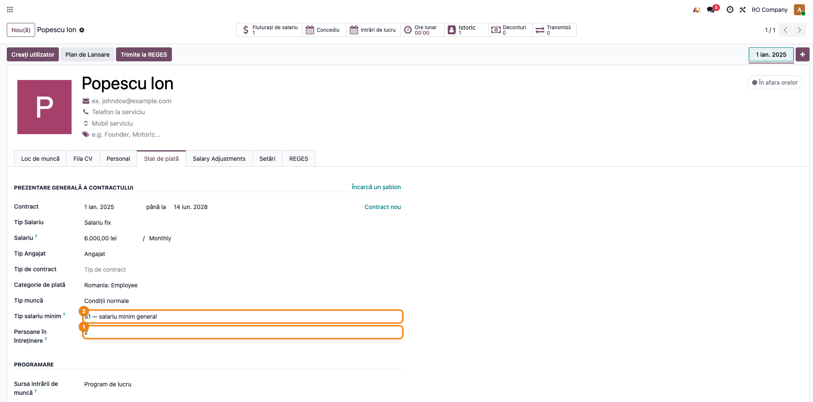
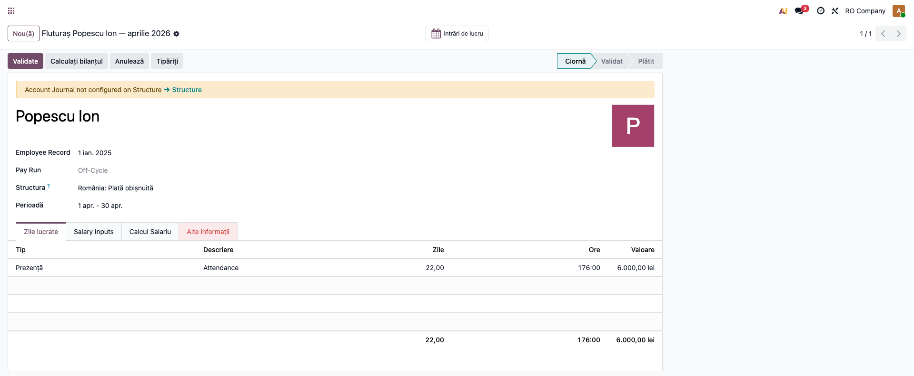
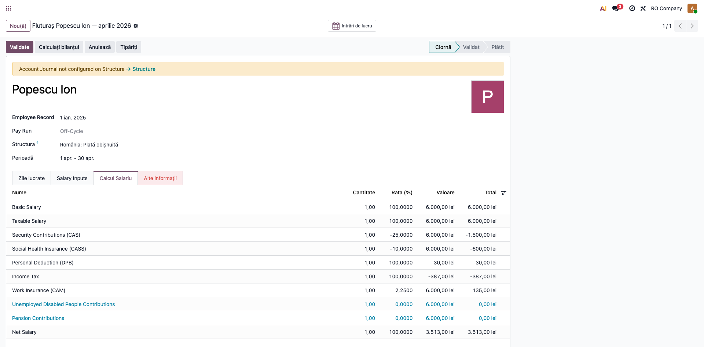

# Fișă Modul: Salarizare RO — Impozit Corect + Deducere Personală

**Modul:** `l10n_ro_payroll_ro`
**Utilizator principal:** Inspector resurse umane/salarizare, Contabil salarii
**Prioritate:** 🔴 Ridicată (corectitudine fiscală a statului de plată)

---

## 1. Scop business

Modulul **corectează calculul impozitului pe salarii** din structura nativă Odoo Enterprise și adaugă
**deducerea personală de bază (DPB)**, care lipsește în nativ. Nativul calculează `impozit = 10% × brut`,
ceea ce este greșit fiscal: în România impozitul se aplică pe `brut − CAS − CASS − deducere personală`.
Rezultatul: net și impozit corecte pe fluturaș (și, implicit, D112 corect, fiindcă D112 citește din
fluturași).

## 2. Bază legală și context

Legea 227/2015 (Codul fiscal): **art. 78** (calculul impozitului pe venitul din salarii, pe baza
impozabilă = venit net − deducere personală) și **art. 77** (deducerea personală, în funcție de venit
și de numărul de persoane în întreținere). Cotele 2026: CAS 25%, CASS 10%, impozit 10%, CAM 2,25%
(angajator). Facilitățile sectoriale IT/construcții/agro au fost **abrogate de la 01.01.2025** (Legea
290/2024, art. LXIV) — nu sunt incluse în modul.

## 3. Utilizatori și roluri

Inspector salarizare (configurează angajatul, rulează fluturașul), Contabil salarii (verifică netul
și impozitul).

Roluri recomandate pentru testare:
- Administrator HR/Payroll: instalează modulul, verifică parametrii și câmpurile angajatului.
- Inspector salarizare: rulează un fluturaș pe structura RO și verifică liniile.

## 4. Conturi și date implicate

Conturile de salarizare folosite de structura nativă RO: 641 (cheltuieli salarii), 421 (personal-
salarii datorate), 4315 (CAS), 4316 (CASS), 444 (impozit pe venituri din salarii), 436 (CAM angajator).
Date minime pentru demo: companie RO, un angajat cu contract pe structura **„Romania: Regular Pay"
(ROMONTHLY)**, salariu brut, tip salariu minim (S1/S2) și numărul de persoane în întreținere.

## 5. Configurare inițială

1. Instalați `l10n_ro_payroll_ro` (necesită Enterprise `l10n_ro_hr_payroll` + `l10n_ro_hr_payroll_account`).
2. Pe angajat/contract, completați **Tip salariu minim** (S1 general / S2 construcții) și **Persoane
   în întreținere**.
3. Verificați parametrii versionați (cote și plafoane 2026) în `hr.rule.parameter`
   (`l10n_ro_salary_params`) — actualizarea anuală se face adăugând o nouă valoare cu altă dată.

## 6. Flux de utilizare

> **Capturi:** se generează cu `fisa-screenshots` (secțiunea 10); încă nu există în `readme/screenshots/`.

### Pasul 1 — Configurarea angajatului

Pe fișa angajatului (sau pe versiunea de contract), completați salariul brut, **Tip salariu minim**
(S1/S2) și **Persoane în întreținere** — acestea determină deducerea personală.



### Pasul 2 — Generarea fluturașului

Creați un fluturaș pe structura **„Romania: Regular Pay"** și apăsați **Calculează**. Regulile rulează
în ordine: BASIC → GROSS → CAS → CASS → **DEDUCERE (DPB)** → **INCOMETAX (corectat)** → … → NET.



### Pasul 3 — Verificarea liniilor (baza corectă a impozitului)

Pe ecran, citiți liniile: CAS = 25% × brut, CASS = 10% × brut, **DPB** = deducerea personală (după
venit și persoane în întreținere). Verificați că **impozitul = 10% × (brut − CAS − CASS − DPB)**, nu
10% × brut, și că netul = brut − CAS − CASS − impozit. DPB **nu** reduce netul (doar baza impozabilă).



### Note de monografie și raportare

Notele contabile sunt generate de structura nativă (`l10n_ro_hr_payroll_account`), pe care modulul o
corectează valoric:
- **Dr 641 = Cr 421** — salariul brut;
- **Dr 421 = Cr 4315 (CAS) + 4316 (CASS) + 444 (impozit)** — reținerile salariale;
- **Dr 646 = Cr 436** — CAM angajator (2,25%).

Modulul corectează **valoarea impozitului (444)** și, implicit, netul (421), prin baza impozabilă
redusă și deducerea personală. Valorile alimentează corect declarația **D112**.

## 7. Legături cu alte module / declarații

| Modul | Rol |
|---|---|
| `l10n_ro_hr_payroll` (Enterprise) | Structura RO, regulile CAS/CASS/CAM, work entries, payslip. |
| `l10n_ro_hr_payroll_account` (Enterprise) | Maparea regulilor pe conturi (note contabile). |
| `l10n_ro_anaf_d112` | Declarația contribuții+impozit; citește din fluturași → preia valorile corecte. |

**Ce e automat:** deducerea personală, corecția bazei impozitului, parametrii versionați.
**Ce rămâne manual:** completarea câmpurilor angajatului (S1/S2, persoane în întreținere); actualizarea
anuală a parametrilor (o nouă valoare în `hr.rule.parameter`).

## 8. Verificări pentru consultant

- [ ] Impozitul pe fluturaș = 10% × (brut − CAS − CASS − DPB), **nu** 10% × brut.
- [ ] Regula **DEDUCERE (DPB)** apare pe fluturaș cu o valoare pozitivă conformă art. 77.
- [ ] DPB **nu** reduce netul (categorie în afara DED) — netul = brut − CAS − CASS − impozit.
- [ ] DPB crește cu numărul de persoane în întreținere și scade spre 0 peste salariul minim + 2.000 lei.
- [ ] Valorile fluturașului corespund cu declarația D112 pentru aceleași date.

## 9. Mesaje de eroare frecvente

| Mesaj | Cauză | Remediere |
|---|---|---|
| Impozit neașteptat de mare | Câmpurile S1/S2 sau persoane în întreținere necompletate | Completați-le pe fișa angajatului/contract |
| Structura RO nu apare | Enterprise `l10n_ro_hr_payroll` neinstalat | Instalați dependențele de payroll Enterprise |
| Parametri lipsă la o dată | Lipsește valoarea `hr.rule.parameter` pentru anul respectiv | Adăugați o nouă valoare cu `date_from` pentru anul nou |

## 10. Capturi de ecran

Se **generează automat** din `tests/test_screenshots.py` (mixin `ScreenshotCase`), în RO, pe planul RO.
La momentul redactării **nu există încă** — rulați `fisa-screenshots`. Lista planificată:

1. `01_config_angajat.png` — câmpuri RO pe angajat (S1/S2, persoane în întreținere).
2. `02_fluturas.png` — fluturaș calculat pe structura RO.
3. `03_linii_fluturas.png` — liniile (CAS, CASS, DPB, impozit, net).

```bash
./odoo/odoo-bin -c odoo.conf -d test19 -u l10n_ro_payroll_ro \
  --test-tags=fise_screenshots --stop-after-init
```

## 11. Observații pentru manual

- Subliniați eroarea corectată: nativul calcula impozitul pe brut; modulul aplică baza fiscală corectă.
- Explicați deducerea personală (DPB) — variabilă cu venitul și persoanele în întreținere (art. 77).
- Menționați parametrii versionați (actualizare anuală fără cod) și abrogarea facilităților sectoriale
  (01.01.2025), ca să nu fie căutate de utilizatori.
- Legați de D112: corectarea fluturașului propagă valori corecte în declarație.
