# Fișă Modul: Salarizare RO — Impozit corect, deduceri personale și tichete de masă

**Modul:** `l10n_ro_payroll_ro`
**Utilizator principal:** Inspector resurse umane/salarizare, Contabil salarii
**Prioritate:** 🔴 Ridicată (corectitudine fiscală a statului de plată)

---

## 1. Scop business

Modulul **corectează calculul impozitului pe salarii** din structura nativă Odoo Enterprise și completează
statul de plată cu regulile fiscale care lipsesc în nativ:

- impozitul se calculează pe baza corectă (`brut + tichete − suma neimpozabilă − CAS − CASS − deduceri`), nu ca 10% din brut;
- **suma neimpozabilă** acordată la salariul minim (300 lei ian.–iun. 2026, 200 lei din 01.07.2026);
- CAS, CASS și CAM se rețin rotunjite la leu, iar **baza impozabilă** se rotunjește la leu prin neglijarea fracțiunilor
  de până la 50 de bani inclusiv (HG 1/2016, pct. 4 la art. 64);
- **deducerea personală de bază** pe grila oficială (tranșe de 50 lei), cu salariul minim versionat în timp;
- **persoane în întreținere** cu CNP și perioade, inclusiv deducerea de 100 lei pe lună pentru fiecare copil
  înscris în învățământ;
- **deducere suplimentară pentru angajații sub 26 de ani**;
- bifa **Funcție de bază** și **scutirea de impozit** pentru handicap și cercetare-dezvoltare (art. 60);
- **tichete de masă** incluse corect în CASS și în venitul pentru deducere.

Rezultatul: net și impozit corecte pe fluturaș, transferate în D112 prin puntea `l10n_ro_anaf_d112_payroll` (tichete, suma neimpozabilă, deducerile și scutirea art. 60; Pasul 9).

## 2. Bază legală și context

Legea 227/2015 (Codul fiscal): **art. 78** (impozitul lunar pe salarii), **art. 77** (deducerea personală de
bază: grila pe venit și persoane în întreținere; deducerea pentru copii; deducerea pentru tineri) și **art. 60**
(scutiri de impozit pe venit). Plafonul de eligibilitate al deducerii de bază este **salariul minim brut pe
țară + 2.000 lei**. Cote 2026: CAS 25%, CASS 10%, impozit 10%, CAM 2,25% (angajator).

Salariul minim brut pe țară: **4.050 lei până la 30.06.2026 și 4.325 lei din 01.07.2026**; ambele valori se
păstrează în istoricul parametrilor, iar fluturașul o folosește pe cea în vigoare în luna calculată.
Suma neimpozabilă la salariul minim este reglementată de **OUG 89/2025** și **OUG 8/2026** (aceleași acte pe care le folosește `l10n_ro_anaf_d112`): 300 lei în ian.–iun. 2026, 200 lei din 01.07.2026, plafonată la 33% din salariul de bază. Se acordă pe funcția de bază, când **salariul de bază din contract nu depășește salariul minim**, cu normă întreagă și proporțional cu partea din lună plătită; valorile sunt parametri versionați. Grila deducerii se raportează întotdeauna la salariul minim **general** pe țară (art. 77), nu la cel sectorial.
Facilitățile sectoriale IT/construcții/agro au fost abrogate de la 01.01.2025 și nu sunt incluse.

## 3. Utilizatori și roluri

- **Administrator HR/Payroll** — instalează modulul, verifică parametrii versionați, configurează angajații.
- **Inspector salarizare** — completează câmpurile angajatului și persoanele în întreținere, rulează fluturașul.
- **Contabil salarii** — verifică netul, impozitul și deducerile pe fluturaș.

## 4. Conturi și date implicate

Conturile din structura nativă RO: 641 (cheltuieli salarii), 421 (personal – salarii datorate), 4315 (CAS),
4316 (CASS), 444 (impozit pe venituri din salarii), 436 (CAM), 6461 (cheltuieli cu CAM), 6422 (tichete de masă), 5328
(tichete de masă în casierie), 5121 (plata netului). Date minime: companie RO în RON, un angajat cu
contract pe structura **„România: Plată obișnuită"**, salariu brut și, după caz, persoane în întreținere.

Modulul instalează în demo 7 angajați cu fluturaș calculat pentru **iulie 2026** (salariu minim 4.325 lei):

| Angajat demo | Cazul ilustrat |
|---|---|
| Ion Popescu | Salariu minim, fără persoane în întreținere; suma neimpozabilă de 200 lei |
| Maria Ionescu | Brut 4.325, 1 persoană, 20 tichete × 45 lei |
| Andrei Dobre | Brut 7.000 — peste plafon, fără deducere de bază |
| Elena Radu | Soț/soție și 2 copii, unul înscris în învățământ |
| Cristina Matei | Sub 26 de ani, deducere suplimentară |
| Vlad Stan | Scutit de impozit (handicap grav, art. 60) |
| Radu Georgescu | Fără funcție de bază — nicio deducere |

## 5. Configurare inițială

1. Instalați `l10n_ro_payroll_ro` (necesită Enterprise `l10n_ro_hr_payroll` și `l10n_ro_hr_payroll_account`).
2. Verificați parametrii versionați, descriși la Pasul 1 (**Stat de plată → Configurare → Salariu → Regulă Parametri**, vizibil pentru
   managerul de salarizare, parametrul *Romania Salary Parameters*): salariul minim, procentele grilei, suma
   neimpozabilă, valoarea nominală a tichetului. O valoare
   nouă se adaugă cu o altă **dată de început**, fără intervenție în cod.
3. Pe fiecare angajat completați câmpurile de pe fila **Stat de plată** (Pasul 2).

## 6. Flux de utilizare

### Pasul 1 — Parametrii care intră în calculul salariului

**Stat de plată → Configurare → Salariu → Regulă Parametri → Romania Salary Parameters** (vizibil pentru managerul de
salarizare). Fiecare rând din fila *Istoric* are o **dată de început** și o valoare; fluturașul folosește rândul în
vigoare la data lui. Pentru o modificare legislativă adăugați un rând nou, nu editați rândul vechi.

| Parametru | Rol | Valoare 2026 |
|---|---|---|
| `cas`, `cass`, `impozit`, `cam` | cotele de contribuții și de impozit | 25%, 10%, 10%, 2,25% |
| `salariu_minim` | salariul minim brut; `S1` este baza grilei | 4.050 lei (din 01.01), 4.325 lei (din 01.07) |
| `dpb_pct_la_minim` | procentul deducerii la salariul minim, după nr. persoane în întreținere (0, 1, 2, 3, 4+) | 20 / 25 / 30 / 35 / 45% |
| `dpb_transe_lei`, `dpb_scadere_pe_transa` | tranșa de venit și scăderea procentului pe tranșă | 50 lei, 0,5 puncte procentuale |
| `plafon_dpb_peste_minim` | peste salariul minim + plafon nu se acordă deducere | 2.000 lei |
| `deducere_copil`, `varsta_copil_deducere` | deducerea lunară per copil în învățământ și vârsta limită | 100 lei, 18 ani |
| `deducere_tineri_pct`, `varsta_tineri` | deducerea pentru tineri (% din salariul minim) și vârsta limită | 15%, 26 ani |
| `tichet_valoare` | valoarea nominală a unui tichet de masă | 45 lei |
| `suma_neimpozabila`, `suma_neimpozabila_plafon_pct` | suma neimpozabilă la salariul minim și plafonul din salariul de bază | 300 lei (ian.–iun.), 200 lei și 33% (din 01.07) |

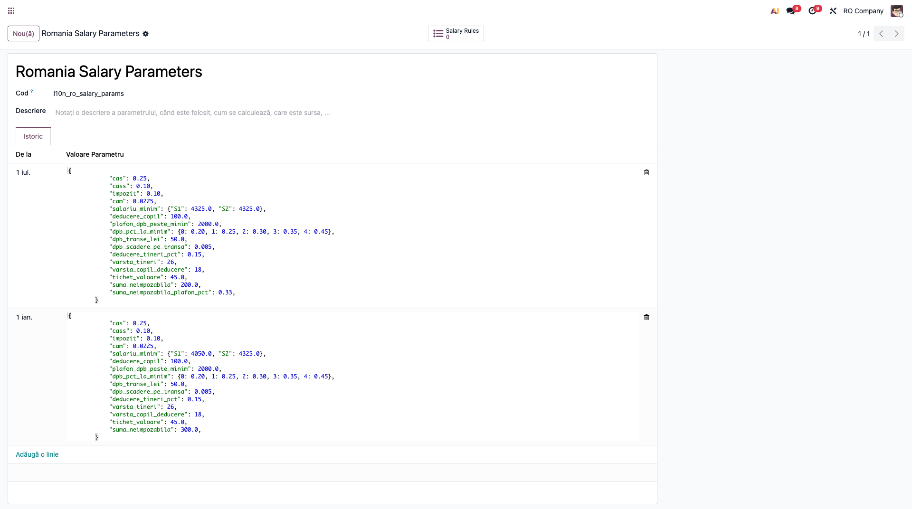

### Pasul 2 — Configurarea angajatului

**Angajați → fișa angajatului → fila Stat de plată.** Câmpurile adăugate de modul:

1. **Tip salariu minim** — S1/S2, doar informativ: grila deducerii folosește mereu salariul minim general;
2. **Persoane în întreținere** — folosit doar dacă nu sunt listate persoane la Pasul 3;
3. **Funcție de bază** — fără bifă nu se acordă nicio deducere personală;
4. **Tichete de masă** — angajatul primește tichete.

Mai sunt **Deducere sub 26 de ani** (se acordă doar cât timp angajatul are sub 26 de ani la sfârșitul lunii
fluturașului) și **Scutire de impozit pe venit** (handicap grav sau accentuat; cercetare-dezvoltare — impozitul
devine 0). Scutirea pentru cercetare-dezvoltare are trei condiții cumulative (art. 60 pct. 3): persoana face parte din echipa
unui proiect conform OG 57/2002, cu indicatori de rezultat; scutirea este în limita cheltuielilor cu personalul din
bugetul proiectului; stat de plată separat pe fiecare proiect. Modulul pune impozit 0 pe **tot** fluturașul, deci
bifați scutirea doar pe fluturașul separat al proiectului.

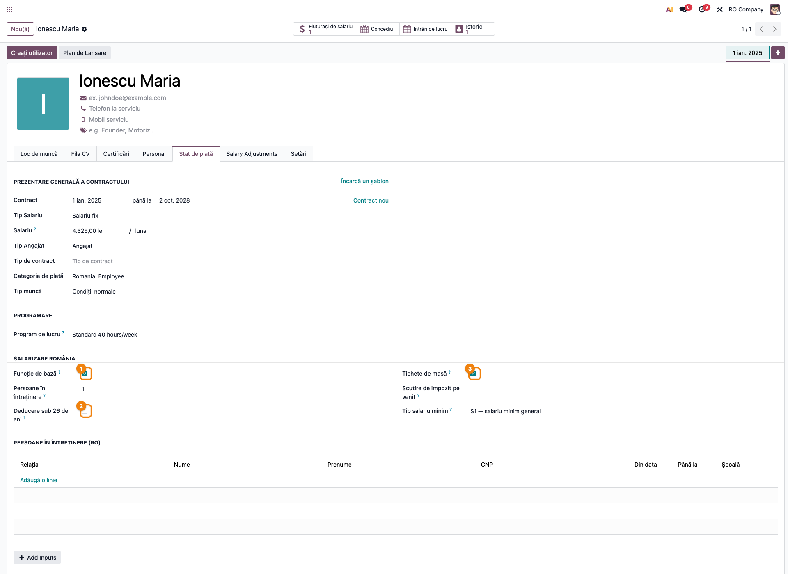

### Pasul 3 — Persoane în întreținere

Pe aceeași filă, lista **Persoane în întreținere (RO)**: relația, nume, prenume, CNP, **Din data**, **Până la**
(se completează când se cunoaște) și bifa **Școală** (doar pentru copii). Datele de început și sfârșit permit
recalcularea fără a modifica lunile anterioare. Când lista are rânduri, ea înlocuiește câmpul numeric
*Persoane în întreținere*.

Pentru fiecare copil în întreținere, înscris în învățământ și sub 18 ani (vârsta se deduce din CNP-ul copilului),
se acordă **100 lei pe lună**, indiferent de nivelul salariului.

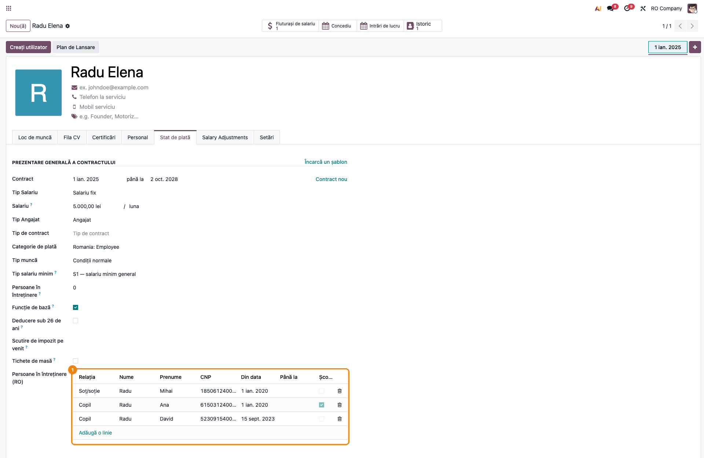

### Pasul 4 — Generarea fluturașului și numărul de tichete

**Stat de plată → Fluturași de salariu → Fluturași de salariu → Nou**: alegeți angajatul, structura **România: Plată obișnuită** și
perioada, apoi apăsați **Calculați bilanțul**. Câmpul **Tichete de masă** apare când numărul de tichete este diferit de 0; la angajații cu bifa
*Tichete de masă* este propus automat ca zilele lucrate fără concedii (23 în iulie 2026); îl puteți modifica manual (aici 20), apoi
recalculați fluturașul.

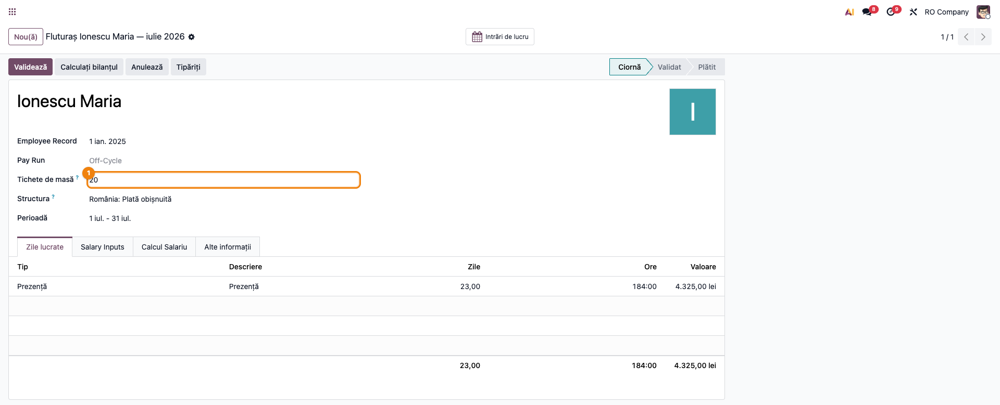

### Pasul 5 — Verificarea liniilor: tichete de masă și suma neimpozabilă

Pe fila **Calcul Salariu** citiți, în ordine (contribuțiile și impozitul sunt rotunjite la leu, de aceea coloana
*Rata* arată ±100%, minus la rețineri): *Salariu impozabil* (brut) = 4.325; *Sumă neimpozabilă* = 200 (salariul de bază din contract este
egal cu salariul minim); *Tichete de masă* = 20 × 45 = 900; *CAS* = 25% × (4.325 − 200) = 1.031; *CASS* =
10% × (4.325 + 900 − 200) = 502,50 → 503; *Deducere personală (DPB)* = 692 — grila se citește la venitul 5.225
(brut + tichete, fără a scădea suma neimpozabilă), unde 1 persoană în întreținere înseamnă 16% din 4.325;
*Impozitul pe venit* = 10% × (4.325 + 900 − 200 − 1.031 − 503 − 692) = 279,90 → 280.

Verificați că **Salariu net** (2.511) este în bani, fără tichete, și că **Cost angajator** (5.318) = brut + CAM (93) +
tichete. Aceste valori coincid cu exemplul de calcul din cerința clientului.

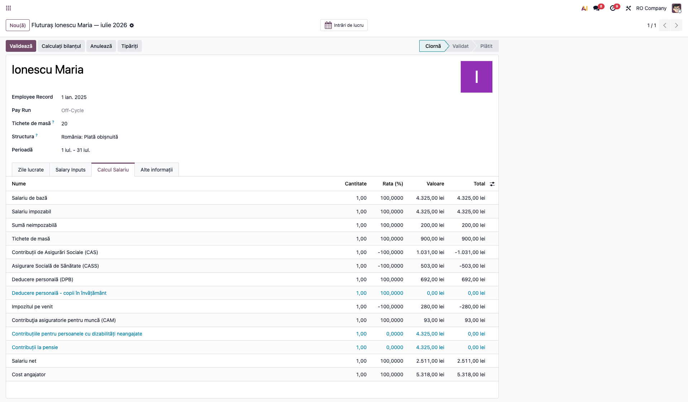

### Pasul 6 — Verificarea liniilor: familie cu copii

La Elena Radu (brut 5.000, 3 persoane în întreținere): *DPB* = 1.211 (28% din 4.325, fiindcă la venitul 5.000
grila a coborât cu 7 puncte procentuale de la 35%), plus *Deducere personală – copii în învățământ* = 100
(doar copilul înscris la școală; celălalt nu se numără). Impozitul este 194 (193,90 rotunjit), netul 3.056.

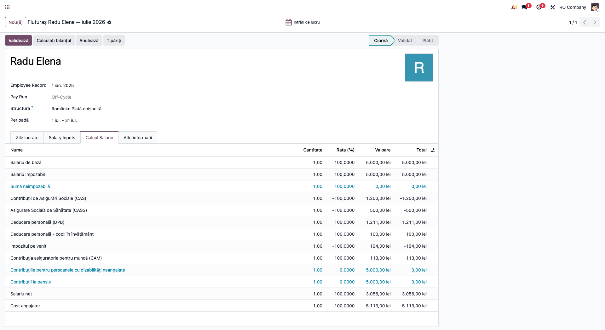

### Pasul 7 — Verificarea liniilor: angajat sub 26 de ani

La Cristina Matei (născută în 2003, brut 4.800) apare linia *Deducere personală – sub 26 de ani* = 15% din salariul
minim = 649 lei, **în plus** față de deducerea de bază (tot 649: la 475 lei peste salariul minim, 10 tranșe de 50
lei coboară procentul de la 20% la 15%). Deducerea pentru tineri se acordă doar dacă venitul se încadrează în
plafon (salariul minim + 2.000 lei). Vârsta se ia din câmpul **Data nașterii** al angajatului; dacă lipsește, din
CNP; dacă diferă, se folosește data nașterii și pe fișă apare un avertisment. Impozitul este 182, netul 2.938.

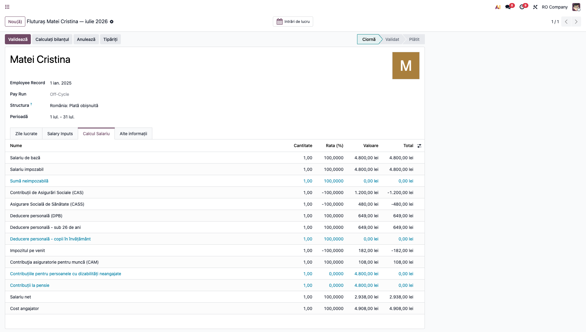

### Pasul 8 — Verificarea liniilor: angajat scutit de impozit

La Vlad Stan (scutire *Handicap grav sau accentuat*), linia *Impozitul pe venit* este 0 și netul este
brut − CAS − CASS = 3.250 lei. Contribuțiile CAS, CASS și CAM se calculează normal.

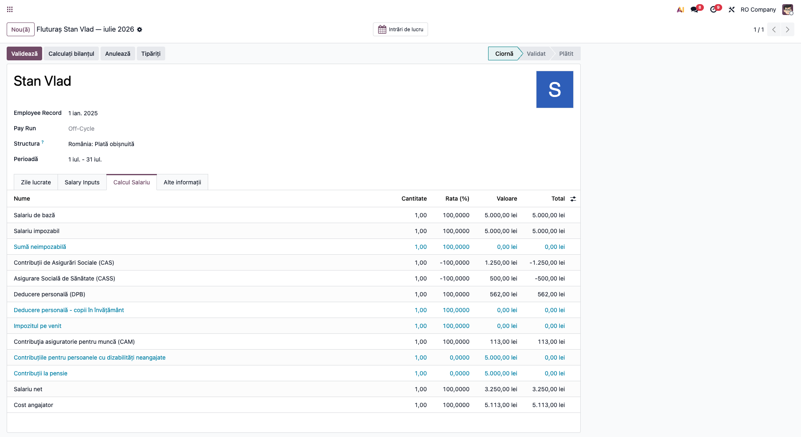

### Pasul 9 — Declarația D112

Cu puntea `l10n_ro_anaf_d112_payroll` instalată: **validați fluturașii lunii**, apoi **Contabilitate → Raportare → Declarația D112 → Nou**
(luna 7, anul 2026, tip *Declarație inițială*) și apăsați **Calculează**. Fila **Angajați** se completează din
fluturași. Coloanele care vin din regulile acestui modul sunt opționale: activați-le din butonul de coloane din
colțul listei (*Tichete de masă*, *Sumă neimpozabilă*, *Baza CASS*, iar deducerile apar în *Ded. pers.*).

Verificați pe rândul fiecărui angajat că valorile coincid cu fluturașul: la Ionescu Maria, *Tichete de masă* = 900,
*CAS* = 1.031, *CASS* = 503, *Sumă neimpozabilă* = 200, *Ded. pers.* = 692 și *Bază impozabilă* = 2.799. Suma
neimpozabilă se declară în XML ca tip asigurat 51 (câmpul A_13S), iar bazele CAS și CASS ale declarației țin cont de ea
(CAS pe brut − suma neimpozabilă; CASS pe brut + tichete − suma neimpozabilă). Scutirea art. 60 se transferă: la
Stan Vlad (scutit pentru handicap) declarația arată `asigScu` 1, baza impozabilă 2.688 în `E3_14` și `E3_23`, impozitul teoretic 269 în
`E3_24` și impozitul reținut 0; obligația 602 are `A_scutit` și există `angajatorF1`.

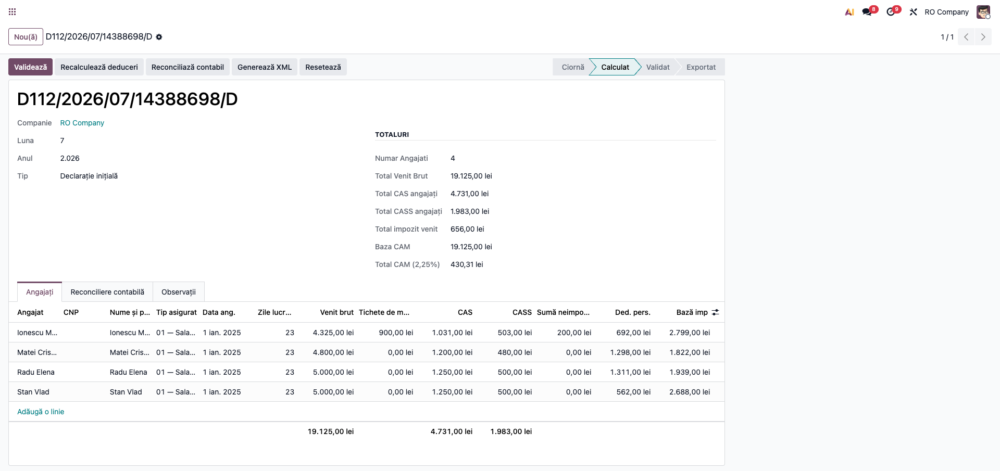

### Pasul 10 — Fluturașul tipărit (PDF)

Din fluturașul calculat sau validat, butonul **Tipăriți** generează fluturașul individual al angajatului (raportul
standard Odoo pentru structura România, în PDF): perioada de plată, zilele lucrate și liniile fluturașului. Linia
**Tichete de masă** arată numărul de tichete și valoarea nominală (20 × 45 lei = 900), iar la contribuții și impozit se
afișează doar valoarea reținută. Documentul se predă angajatului după validare.

Verificați pe document: *Suma neimpozabilă*, *Tichete de masă*, *CAS*, *CASS*, *Deducerea personală*, *Impozit*,
**Salariu net** (2.511) și suma de plată.

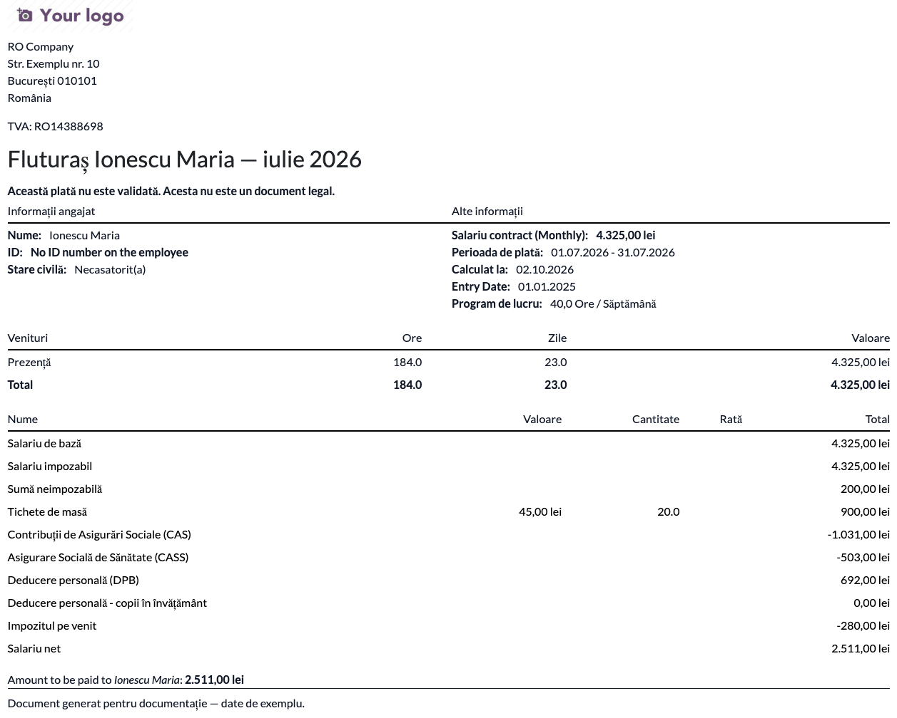

### Pasul 11 — Validarea fluturașului și nota contabilă

La **Validează**, fluturașul generează nota contabilă în jurnalul **Salarii**, datată în ultima zi a lunii (**Contabilitate → Note
contabile**, fila *Elemente jurnal*). Conturile sunt cele implicite din planul RO (vezi mai jos); la fiecare linie, contul 421 are ca
partener angajatul. Verificați că nota e echilibrată și că soldul lui 421 pe angajat este salariul net.

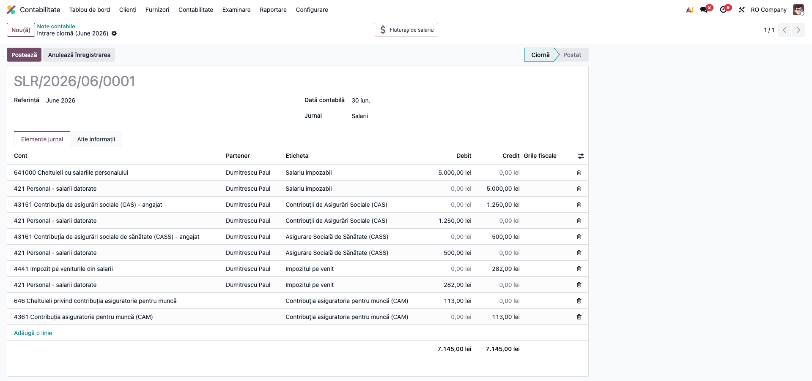

### Pasul 12 — Rețineri deductibile din baza de impozit (sindicat, pensie facultativă)

1. *Salarizare → Ajustări salariale → Nou*: angajatul, tipul **Cotizație sindicală**, suma lunară (ex. 50) și durata nelimitată.
2. Pentru pensia facultativă plătită direct de salariat alegeți **Pensie facultativă (doar baza impozabilă)** (ex. 100); dacă o reține
   angajatorul, **Pensie facultativă (reținută)**.
3. Generați fluturașul: apare **Deduceri din baza impozabilă** 150; deducerea personală nu se schimbă, impozitul scade (5.000 brut,
   09/2026: bază 2.538, impozit 254), iar **Rețineri voluntare** −50 scad netul (rest de plată 2.946).
4. Plafonul de 400 EUR/an se aplică automat pensiei facultative și asigurării de sănătate; verificați cursul EUR din companie.
5. În D112 suma ajunge în câmpul «alte deduceri» (`E1_5` / `E3_13`).

*Captura acestui pas se adaugă la următoarea actualizare a capturilor.*

### Note de monografie și raportare

Modulul completează conturile implicite pe regulile salariale (doar unde lipsesc; configurările manuale rămân). Monografia generată:
- **Dr 641 = Cr 421** — salariul brut;
- **Dr 421 = Cr 43151 (CAS) + 43161 (CASS) + 4441 (impozit)** — rețineri;
- **Dr 6461 = Cr 4361** — CAM angajator (2,25%); Dr 646 dacă planul nu are 6461;
- **Dr 6422 = Cr 5328** — contravaloarea tichetelor de masă acordate;
- **Dr 421 = Cr 4271** — popriri și alte rețineri în favoarea terților.

Cifre de control (SAGA, 09/2026, 3 salariați la brut 5.000 și unul la salariul minim cu tichete): 641 = 421 19.325; 421 = 43xx/444 7.333 (impozit
549, CAS 4.781, CASS 2.003); 6422 = 5328 900. CAM: 3 × 113 + 93 = 432 lei pe fluturași, față de 430 în D112 (care rotunjește pe total) — diferența de
2 lei se acoperă din toleranța reconcilierii D112 sau printr-o corecție lunară.

Regulile *Sumă neimpozabilă*, *Cost angajator* și deducerile nu generează înregistrări. **Nemapate:** plata netului (reconcilierea se face pe
contul 421, cu partenerul angajat), plata obligațiilor către buget, avansul chenzinal, achiziția tichetelor (Dr 5328 = Cr 401), `PENSION` și
`UNEMPDISABLED`.

## 7. Legături cu alte module / declarații

| Modul | Rol |
|---|---|
| `l10n_ro_hr_payroll` (Enterprise) | Structura RO, regulile CAS/CASS/CAM, work entries, fluturaș. |
| `l10n_ro_hr_payroll_account` (Enterprise) | Maparea regulilor pe conturi (note contabile). |
| `l10n_ro_anaf_d112` | Declarația 112. |
| `l10n_ro_anaf_d112_payroll` | Puntea fluturaș → D112: transferă tichetele, suma neimpozabilă, deducerile și bazele CAS/CASS (Pasul 9). |

**Ce e automat:** grila deducerii, salariul minim și suma neimpozabilă în vigoare la data fluturașului, deducerea
pentru copii, deducerea pentru tineri (doar sub 26 de ani la data fluturașului), valoarea tichetelor, CASS pe
brut + tichete − suma neimpozabilă, rotunjirea la leu.
**Ce rămâne manual:** completarea câmpurilor angajatului și a persoanelor în întreținere; bifa pentru scutire;
numărul de tichete când diferă de zilele lucrate; actualizarea parametrilor când se modifică legislația.

## 8. Verificări pentru consultant

- [ ] Parametrul *Romania Salary Parameters* are două valori: 01.01.2026 (S1 = 4.050, suma neimpozabilă 300) și
      01.07.2026 (S1 = 4.325, suma neimpozabilă 200).
- [ ] La brut = salariu minim, fără persoane și fără tichete: *Sumă neimpozabilă* = 200, DPB = 20% × 4.325 = 865,
      CAS = 1.031, CASS = 413 (Ion Popescu).
- [ ] Dacă salariul de bază din contract depășește salariul minim, nu există sumă neimpozabilă; deducerea scade cu 0,5 puncte procentuale la fiecare 50
      lei peste salariul minim și este 0 peste salariul minim + 2.000 lei (Andrei Dobre).
- [ ] CASS = 10% × (brut + tichete − suma neimpozabilă); CAS și CAM = procent × (brut − suma neimpozabilă).
- [ ] Impozitul = 10% × (brut + tichete − suma neimpozabilă − CAS − CASS − deduceri), rotunjit conform regulii de mai sus: baza se rotunjește la leu (0,50 în jos), apoi se aplică cota.
- [ ] Salariul net = brut − CAS − CASS − impozit, fără tichete (Maria Ionescu: 2.511); *Cost angajator* = brut + CAM + tichete.
- [ ] Copil neînscris la școală sau major nu generează cei 100 lei.
- [ ] Fără bifa Funcție de bază, toate deducerile și suma neimpozabilă sunt 0 (Radu Georgescu).
- [ ] La scutire (art. 60), impozitul este 0 (Vlad Stan).
- [ ] Cei 100 lei pentru copil se acordă unui singur părinte, pe baza declarației și a documentului de înscriere (se verifică manual).
- [ ] În D112 (cu puntea instalată), linia fiecărui angajat are aceleași tichete, sumă neimpozabilă, deduceri și bază impozabilă ca fluturașul.
- [ ] Verificați manual condiția din art. 77: persoana în întreținere nu are venituri peste 20% din salariul minim
      (modulul nu o verifică).

## 9. Mesaje de eroare frecvente

| Mesaj | Cauză | Remediere |
|---|---|---|
| Deducerea personală este 0 | Lipsește bifa Funcție de bază, sau venitul depășește salariul minim + 2.000 lei | Verificați bifa și venitul brut (inclusiv tichete) |
| Deducerea de bază nu crește cu persoanele | Persoanele listate au perioada încheiată înainte de luna fluturașului | Verificați coloanele Din data / Până la |
| Deducerea pentru copii lipsește | Copilul nu are CNP, nu e bifat Școală sau are 18 ani împliniți | Completați CNP-ul și bifa Școală |
| Avertisment la data nașterii | Data nașterii diferă de cea din CNP | Corectați una dintre ele; se folosește câmpul Data nașterii |
| Tichetele nu apar pe fluturaș | Angajatul nu are bifa Tichete de masă | Bifați-o pe fila Stat de plată |
| Parametri lipsă la o dată | Lipsește valoarea parametrului pentru perioada respectivă | Adăugați o valoare nouă cu data de început corectă |

## 10. Capturi de ecran

Capturile sunt **generate automat** din `tests/test_screenshots.py` (mixin `ScreenshotCase` din
`l10n_ro_doc_screenshots`, import defensiv), în română, pe planul RO, în RON, pe cazurile din iulie 2026:

1. `01_parametri_salariali.png` — parametrii salariali RO, cu istoric.
2. `02_config_angajat.png` — câmpurile RO pe fila Stat de plată.
3. `03_persoane_intretinere.png` — lista persoanelor în întreținere.
4. `04_fluturas_tichete.png` — fluturaș cu numărul de tichete.
5. `05_linii_tichete.png` — liniile fluturașului cu tichete de masă.
6. `06_linii_familie.png` — familie cu copii în învățământ.
7. `07_linii_tineri.png` — angajat sub 26 de ani.
8. `08_linii_scutit.png` — angajat scutit de impozit.
9. `09_d112_linii_tichete.png` — linia D112 cu tichete, sumă neimpozabilă și deduceri (necesită puntea D112).
10. `10_fluturas_pdf.png` — fluturașul tipărit (PDF) al angajatului cu tichete.
11. `11_nota_contabila.png` — nota contabilă a fluturașului validat.

```bash
./odoo/odoo-bin -c odoo.conf -d test19 -i l10n_ro_payroll_ro,l10n_ro_doc_screenshots \
  --test-tags=fise_screenshots --stop-after-init
```

## 11. Observații pentru manual

- Subliniați eroarea corectată: nativul calcula impozitul pe brut.
- Explicați grila ca pe o tabelă cu trepte de 50 lei și arătați cum se citește la venitul care include tichetele.
- Salariul minim și suma neimpozabilă sunt parametri cu istoric: fluturașii lunilor trecute rămân corecți la recalculare.
- Limite cunoscute:
  - plata netului, avansurile, achiziția tichetelor și contribuțiile în condiții speciale nu sunt încă mapate contabil (vezi monografia);
  - declarația `l10n_ro_anaf_d112` are propria formulă liniară pentru deducere; în ian.–iun. 2026 ea acordă 200 lei
    sumă neimpozabilă și la nivelul S2 (4.325), pe când acest modul acordă 300 lei doar la salariul de bază egal cu
    S1 (4.050) — de aliniat după confirmarea regulii;
  - cotizația sindicală și pensiile facultative/ocupaționale nu sunt scăzute din baza impozabilă;
  - **de confirmat de contabil, din textul OUG 89/2025 și OUG 8/2026:** valorile 300/200 lei, plafonul de 33%
    (care, la salariul minim, nu limitează practic suma de 200 lei), eventualul prag al venitului brut fără tichete
    (parametrul opțional `suma_neimpozabila_prag_venit`, nesetat), tratamentul concediului medical la proratare,
    rotunjirea CAS/CASS/CAM și vârsta în luna în care se împlinește;
  - suma neimpozabilă se proratează cu zilele lucrate fără concedii și cu partea din lună în care contractul este activ.
