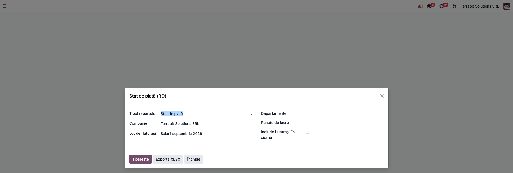
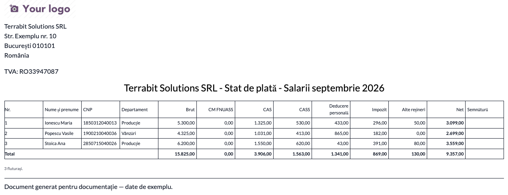
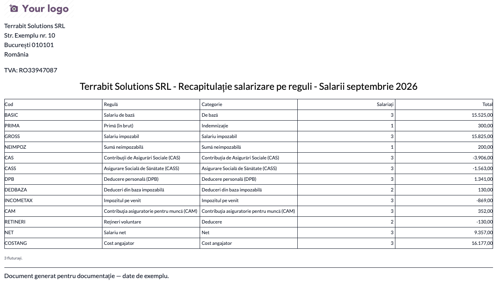
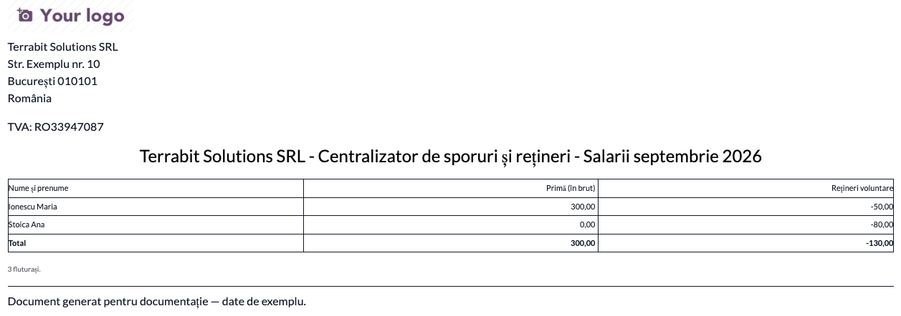
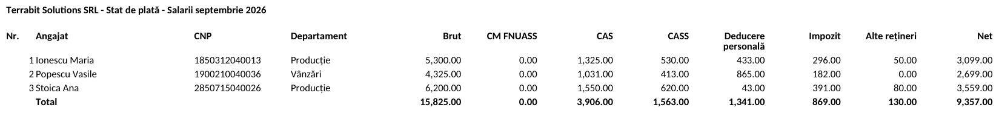

# Fișă Modul: Stat de plată și recapitulații

**Modul:** `l10n_ro_payroll_statements`
**Utilizator principal:** responsabil salarizare / contabil
**Prioritate:** 🟡 Medie (rapoartele se pot aduna de mână, dar greu și cu risc de greșeli)

## 1. Scop business

După calculul fluturașilor, firma are nevoie de documente centralizate: statul de plată (semnat de salariați), recapitulația pe reguli (pentru verificarea cu contabilitatea) și centralizatorul de sporuri și rețineri. Modulul le generează din fluturașii lotului sau ai lunii, cu filtre și export XLSX.

## 2. Bază legală și context

Statul de plată este document justificativ al plății salariilor (Legea contabilității 82/1991, art. 6; conținutul minim al statelor de salarii: OMFP 2634/2015). Modelul nu e obligatoriu, dar conținutul minim da (nume, CNP, brut, contribuții, impozit, rețineri, net). Rapoartele nu se depun la ANAF; ele reflectă fluturașii și se verifică cu declarația D112 și cu nota contabilă a salariilor.

## 3. Utilizatori și roluri

Utilizator salarizare (*Utilizator salarizare*, grupul de salarizare).

## 4. Conturi și date implicate

Modulul nu face note contabile. Folosește liniile fluturașilor validați sau plătiți: brut, CAS, CASS, deducere personală, impozit, rețineri și net (restul de plată).

## 5. Configurare inițială

Fără configurare. Departamentul și punctul de lucru se iau de pe versiunea contractului angajatului. Completați datele companiei și aspectul documentelor pentru antetul PDF.

## 6. Flux de utilizare

### Pasul 1 — Alegerea raportului și a filtrelor

aplicația *Stat de plată* (Salarizare) → *Raportare → Stat de plată (RO)*. Alegeți **tipul raportului** (stat de plată, recapitulație pe reguli sau centralizator de sporuri și rețineri), **lotul de fluturași** sau luna, și, dacă e nevoie, departamentele și punctele de lucru. Implicit intră fluturașii **validați și plătiți**; bifa *Include fluturașii în ciornă* adaugă și ciornele.

### Pasul 2 — Statul de plată

Apăsați **Tipărește**. Statul are o linie pe salariat (nume, CNP, departament), cu **brut, CAS, CASS, deducere personală, impozit, alte rețineri și net**, totaluri pe coloană și coloană de semnătură (necesară la plata în numerar; la plata pe card dovada plății e extrasul bancar). Concediul medical plătit din FNUASS are coloană proprie (*CM FNUASS*), în afara brutului. Concediul medical intră în CAS, CASS și impozit prin rândurile lui de contribuții.

**Verificați:** numărul de linii e cel al fluturașilor lotului; pe fiecare linie, brut + CM FNUASS − CAS − CASS − impozit − alte rețineri = net; totalul brut și totalul net coincid cu lotul.

### Pasul 3 — Recapitulația pe reguli

**Recapitulația** însumează fiecare regulă salarială pe toți fluturașii: cod, denumire, categorie, numărul de salariați și suma.

**Verificați:** totalul regulii *Brut* este brutul total al statului; CAS, CASS și impozit coincid cu sumele din nota contabilă a salariilor și din D112 (în recapitulație reținerile apar cu semnul minus: comparați valorile absolute).

### Pasul 4 — Sporuri și rețineri

**Centralizatorul** arată, pentru fiecare salariat, regulile din categoriile sporuri și rețineri (primă, indemnizații, popriri, sindicat), cu totaluri pe coloană; apar doar salariații care au astfel de sume.

### Pasul 5 — Exportul XLSX

**Exportă XLSX** produce același raport într-un fișier de calcul tabelar, pentru prelucrări ulterioare.

### Note de monografie și raportare

Modulul nu generează note contabile și nu transmite date în D112: statul și recapitulația se folosesc pentru verificarea notei contabile a salariilor și a declarației.

## 7. Legături cu alte module / declarații

| Modul | Rol |
|---|---|
| `l10n_ro_hr_payroll_enhancement` | fluturașii și regulile RO (CAS, CASS, impozit, concedii medicale, prime) |
| `hr_payroll` | lotul de fluturași și categoriile de reguli |

**Automat:** totalurile și coloanele. **Manual:** verificarea cu nota contabilă și cu D112; statul de avansuri lipsește (nu există avans pe fluturaș).

## 8. Verificări pentru consultant

- [ ] Numărul de linii al statului coincide cu numărul fluturașilor lotului.
- [ ] Brut, CAS, CASS, impozit și net din stat coincid cu totalurile lotului.
- [ ] Recapitulația are aceleași totaluri ca statul și ca nota contabilă a salariilor.
- [ ] Filtrul pe departament lasă doar salariații departamentului ales.
- [ ] Fluturașii în ciornă apar doar cu bifa *Include fluturașii în ciornă*.
- [ ] Exportul XLSX are aceleași sume ca PDF-ul.

## 9. Mesaje de eroare frecvente

| Mesaj | Cauză | Remediere |
|---|---|---|
| Nu există fluturași pentru filtrele alese | lotul sau luna nu au fluturași validați / plătiți, sau filtrele sunt prea restrictive | validați fluturașii, bifați *Include fluturașii în ciornă* sau lărgiți filtrele |

## 10. Capturi de ecran

Generate automat din `tests/test_screenshots.py` (mixinul `ScreenshotCase` din `l10n_ro_doc_screenshots`), în RO, pe planul RO:

- `01_fereastra_stat.png`: fereastra raportului;
- `02_pdf_stat_de_plata.png`: statul de plată (PDF);
- `03_pdf_recapitulatie.png`: recapitulația pe reguli (PDF);
- `04_pdf_sporuri_retineri.png`: centralizatorul de sporuri și rețineri (PDF);
- `05_xlsx_stat_de_plata.png`: statul exportat în XLSX.

Regenerare: `odoo-bin -c <conf> -d <baza_cu_ro_RO> -i l10n_ro_payroll_statements --test-tags=fise_screenshots:TestPayrollStatementsScreenshots --stop-after-init`

## 11. Observații pentru manual

- Statul de avansuri (avans chenzinal) și filtrul pe analitic lipsesc: salarizarea Odoo nu are avans pe fluturaș și nici analitic pe fluturaș.
- Departamentul și punctul de lucru sunt cele din versiunea contractului în luna fluturașului.
- În exportul XLSX sumele se afișează după setările regionale ale Excel-ului (în capturi apar cu format en-US).
