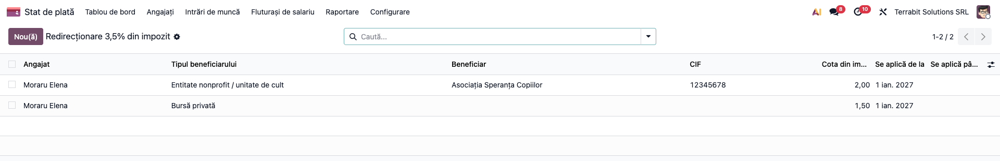
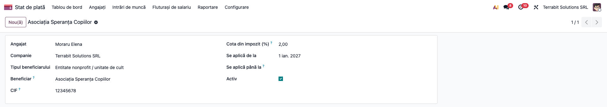
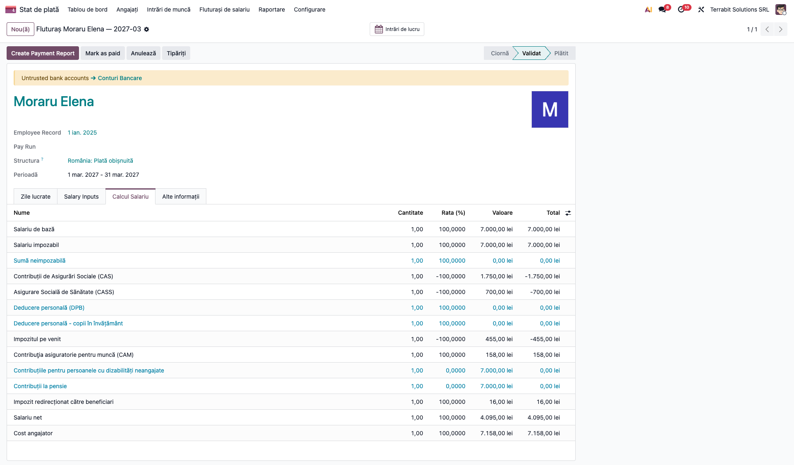

# Fișă Modul: Redirecționarea a 3,5% din impozit

**Modul:** `l10n_ro_payroll_tax_redirect`
**Utilizator principal:** responsabil salarizare / contabil
**Prioritate:** 🟢 Scăzută (se aplică doar salariaților care cer redirecționarea prin angajator)

## 1. Scop business

Salariatul poate cere ca până la 3,5% din impozitul pe salarii să meargă către o entitate nonprofit, o unitate de cult sau o bursă privată. Când cererea se face la angajator, angajatorul calculează, reține, declară și plătește sumele. Modulul ține evidența cererilor, calculează suma lunară, o arată în fluturaș, o înregistrează contabil și o declară în D112.

## 2. Bază legală și context

Codul fiscal, art. 78 alin. (6) (până la 3,5% din impozitul anual pe salarii către entități nonprofit, unități de cult și burse private) și art. 123^1 alin. (6)–(7) (cererea la angajator, prin înscris încheiat cu acesta, cu acordul lui; angajatorul calculează, reține, declară și plătește până la termenul de plată al impozitului; cel mult 2 ani fiscali consecutivi pentru aceiași beneficiari; calea prin angajator exclude declarația D230 pe aceeași perioadă). Înainte de fiecare plată, angajatorul verifică dacă beneficiarul figurează în registrul entităților nonprofit (art. 123^1 alin. (9)–(10)). Suma lunară: cota × impozitul lunar reținut (HG 1/2016, pct. 15 alin. (4)). **Verificat Pacioli (05.10.2026).**

## 3. Utilizatori și roluri

Utilizator salarizare (grupul de salarizare), pentru evidență; contabilul pentru plata către beneficiari.

## 4. Conturi și date implicate

- **444** impozit pe venituri de natura salariilor (analitic **4441** în planul Odoo RO) și **462** creditori diverși, pentru suma redirecționată; contul 462 se mută pe beneficiar manual, la plată;
- beneficiarul: entitate nonprofit (denumire, CIF) sau bursă privată (CNP beneficiar, număr și dată contract);
- cota (în %) și perioada de aplicare; cererea (înscrisul) rămâne la dosar.

## 5. Configurare inițială

1. Modulul se instalează singur împreună cu `l10n_ro_hr_payroll_enhancement` și `l10n_ro_anaf_d112_payroll`.
2. Pentru nota contabilă (Dr 4441 = Cr 462) instalați și `l10n_ro_hr_payroll_account_enhancement` și verificați că planul de conturi are contul 462. Maparea regulii se face la instalarea sau actualizarea acelui modul: pe o bază unde era deja instalat, actualizați-l ori completați manual fila *Contabilitate* a regulii „Impozit redirecționat către beneficiari” (Debit 4441 / Credit 462), din *Stat de plată → Configurare → Reguli*.

## 6. Flux de utilizare

### Pasul 1 — Evidența redirecționărilor

*Stat de plată → Angajați → Redirecționare 3,5% din impozit*. Lista arată, pe angajat, beneficiarul, cota și perioada.



### Pasul 2 — Beneficiarul și cota

Apăsați **Nou**: alegeți angajatul și tipul beneficiarului. La **entitate nonprofit** completați denumirea și CIF-ul (doar cifre, fără RO) și cota (**1 sau 2**, cum cere schema D112). La **bursă privată** completați CNP-ul beneficiarului, numărul și data contractului și cota (cel mult 3,5). Cota totală a unui angajat nu depășește **3,5%**, iar perioada este de cel mult **2 ani fiscali consecutivi**. Un angajat are cel mult o entitate și o bursă în aceeași perioadă.



**Verificați:** cererea salariatului (înscrisul) e la dosar; beneficiarul figurează în registrul entităților nonprofit; cota și perioada coincid cu cererea.

### Pasul 3 — Fluturașul și nota contabilă

La calculul fluturașului apare linia **Impozit redirecționat către beneficiari**, informativă, în afara netului: impozitul se reține în întregime. Suma este `ROUND(impozit × cotă / 100)` pe beneficiar, fără să depășească rotunjirea totalului. Aici: impozit 455 lei, entitate 2% → 9 lei, bursă 1,5% → 7 lei, **16 lei** în total.



**Verificați:** linia are suma așteptată; netul fluturașului nu se schimbă; la validare, nota are **Dr 4441 = Cr 462** pe suma redirecționată.

### Pasul 4 — D112

La **Calculează** în D112, redirecționarea se transferă pe linia asiguratului. În XML, suma redirecționată scade impozitul de plată (`A_deductibil`, `angajatorF1`), iar pe asigurat apar `Tcota_E4`, `Tsuma_E4` și elementul `asiguratE4`:

```xml
<angajatorA A_codBugetar="5503XXXXXX" A_codOblig="602" A_datorat="455" A_deductibil="16" A_scutit="0" A_plata="439"/>
<angajatorF1 F1_suma="455" F1_suma_ded="16" F1_suma_scut="0" F1_deplata="439"/>
<asiguratE4 den="Asociația Speranța Copiilor" cui="12345678" cota="2" suma="9" cnp_ctr="5010101000012" nr_ctr="BP-7/2026" data_ctr="01.02.2027" cota_ctr="1.50" suma_ctr="7"/>
```

**Verificați:** `A_plata` = `A_datorat` − `A_deductibil` − `A_scutit` (455 − 16 = 439); `Tsuma_E4` = 16 nu depășește `ROUND(Timp_E3 × Tcota_E4 / 100)` = `ROUND(455 × 3,5 / 100)` = 16; XML-ul trece validarea ANAF.

### Note de monografie și raportare

- impozitul calculat (nota de bază a fluturașului): **Dr 421 = Cr 4441**, 455 lei în exemplu;
- la reținere (validarea fluturașului): **Dr 4441 = Cr 462**, cu suma redirecționată (16 lei = 9 entitate + 7 bursă, într-o singură linie, fără împărțire pe beneficiar); restul impozitului se plătește la buget: **Dr 4441 = Cr 5121**, 439 lei (suma din *Pregătește plăți* din D112);
- plata către beneficiari, până la termenul de plată al impozitului: **Dr 462 = Cr 5121**, 9 lei către entitate și 7 lei către bursă; analiticul pe beneficiar se ține manual.

## 7. Legături cu alte module / declarații

| Modul | Rol |
|---|---|
| `l10n_ro_hr_payroll_enhancement` | fluturașul și regulile RO |
| `l10n_ro_anaf_d112` / `l10n_ro_anaf_d112_payroll` | declarația D112 (puncte de extensie din 19.0.2.10.0) |
| `l10n_ro_hr_payroll_account_enhancement` | nota contabilă (Dr 4441 = Cr 462) |

**Automat:** suma lunară, linia din fluturaș, `A_deductibil`, `angajatorF1`, `asiguratE4`. **Manual:** plata către beneficiari, verificarea în registrul entităților, păstrarea cererii.

## 8. Verificări pentru consultant

- [ ] Cererea salariatului e la dosar, cu acordul angajatorului, și nu s-a depus D230 pentru aceeași perioadă.
- [ ] Cota totală pe angajat ≤ 3,5%; la entitate, cota e 1 sau 2; „Se aplică până la” e completat.
- [ ] Regula „Impozit redirecționat către beneficiari” are Debit 4441 / Credit 462 mapat.
- [ ] Linia din fluturaș = `ROUND(impozit × cotă / 100)`; netul e neschimbat.
- [ ] Nota fluturașului conține Dr 4441 = Cr 462 pe suma redirecționată.
- [ ] D112: `A_plata` redus cu suma redirecționată; `asiguratE4` completat; XML validat.
- [ ] Plata către beneficiar s-a făcut până la termenul de plată al impozitului.

## 9. Mesaje de eroare frecvente

| Mesaj | Cauză | Remediere |
|---|---|---|
| Cotele lui X însumează peste 3,5% în aceeași perioadă | cote cumulate peste 3,5% | reduceți cotele sau separați perioadele |
| Cota unei entități nonprofit este 1 sau 2 (schema D112) | cota entității nu e 1 sau 2 | folosiți 1 sau 2 |
| Un angajat are cel mult o entitate nonprofit și o bursă privată în aceeași perioadă | două entități în aceeași perioadă | păstrați una singură |
| Bursa privată se declară împreună cu o entitate nonprofit | bursă fără entitate în D112 | adăugați entitatea (schema cere cota și suma entității) |
| Redirecționarea se aplică pe cel mult 2 ani fiscali consecutivi | perioadă prea lungă | reînnoiți cererea după 2 ani |

## 10. Capturi de ecran

Generate automat din `tests/test_screenshots.py` (mixinul `ScreenshotCase` din `l10n_ro_doc_screenshots`), în RO, pe planul RO:

- `01_lista_redirectionari.png`: lista redirecționărilor;
- `02_formular_entitate.png`: formularul unei redirecționări către o entitate nonprofit;
- `03_fluturas_redirectionare.png`: fluturașul cu impozitul redirecționat.

Regenerare: `odoo-bin -c <conf> -d <baza_cu_ro_RO> -u l10n_ro_payroll_tax_redirect --test-tags=fise_screenshots:TestTaxRedirectScreenshots --stop-after-init`

## 11. Observații pentru manual

- Schema ANAF are un singur `asiguratE4` pe asigurat, cu cota entității 1 sau 2; bursa privată nu se poate declara fără entitate. Din această cauză o entitate nu poate primi 3,5% în D112, deși art. 123^1 o permite.
- **De confirmat:** atributul `cota` (tip întreg 1–2) este tratat ca procent; dacă instrucțiunile D112 îl definesc drept cod (de exemplu 1 = 2%, 2 = 3,5%), maparea trebuie schimbată înainte de utilizare în producție.
- Bursa privată: contractul se prezintă în 30 de zile, justificativele lunar până la termenul de virare, iar suma e limitată la cheltuiala efectiv plătită (HG 1/2016, pct. 15 alin. (5) și pct. 7^1 alin. (7)); modulul calculează cota fără aceste condiții, deci verificarea rămâne manuală.
- Completați mereu „Se aplică până la”: fără dată de final, redirecționarea se aplică nelimitat, iar limita de 2 ani fiscali nu se verifică.
- Captura 03 nu arată nota contabilă (fluturașul e validat prin test); verificați nota în *Elemente jurnal* după validarea reală.
- Regulile validatorului au fost verificate pe schema ANAF (XSD), nu cu DUKIntegrator.
- Plata către beneficiari și verificarea registrului entităților rămân manuale.
