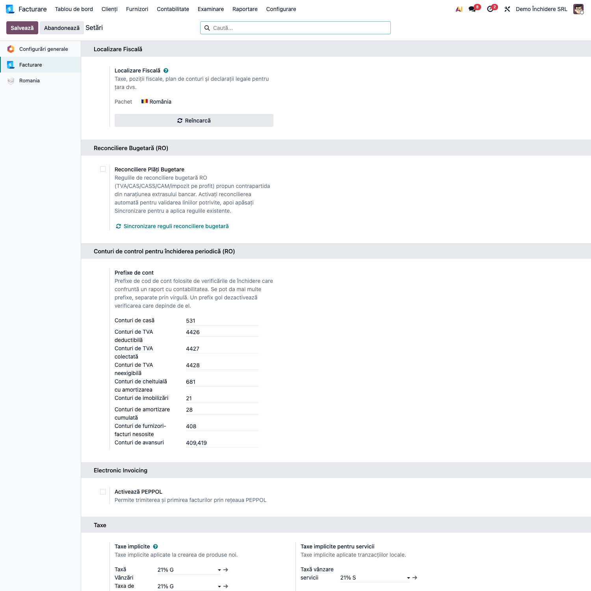
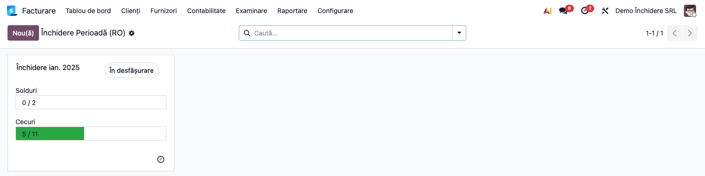
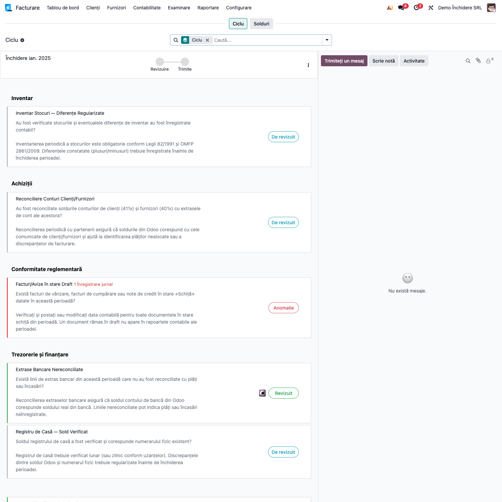
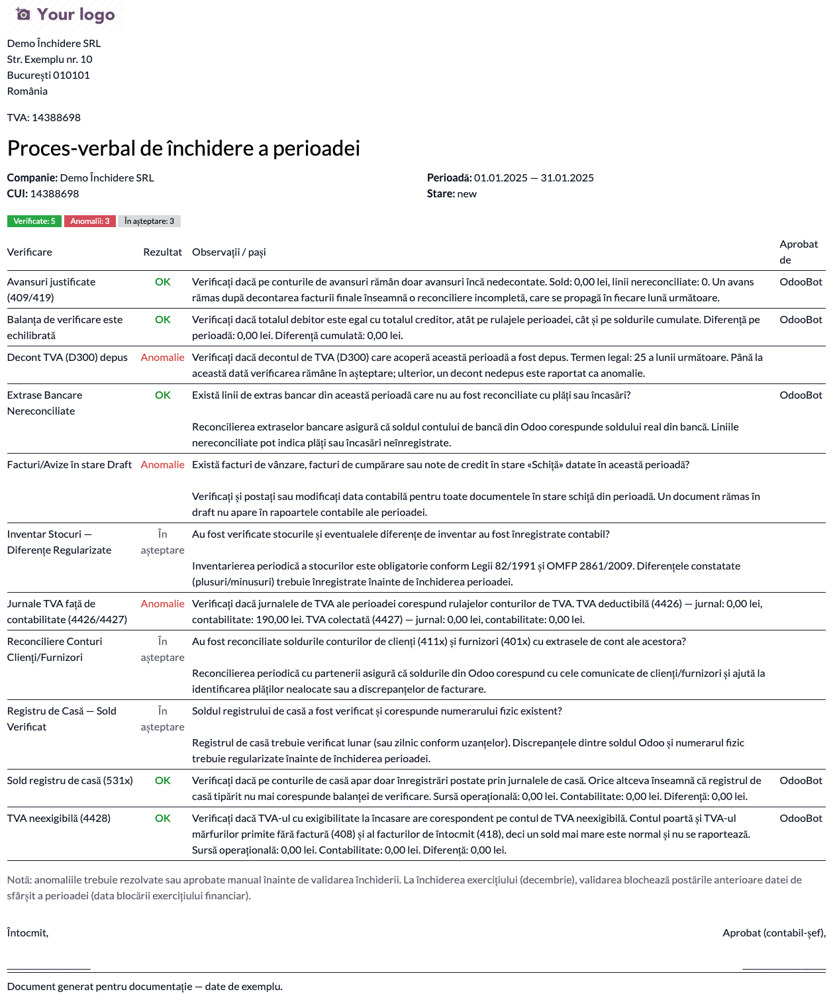
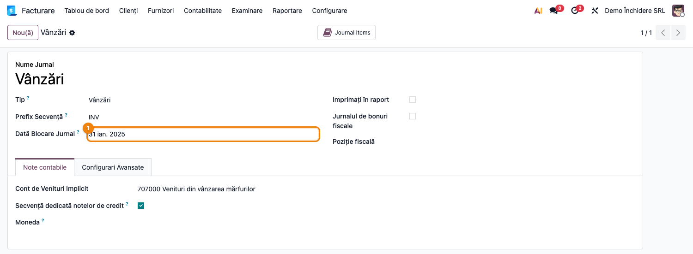

# Fișă Modul: Checklist Închidere Perioadă

**Poziție plan:** B2.4
**Modul:** `l10n_ro_period_close_enhanced`
**FR:** FR-27
**Capitol manual:** Cap 11.1
**Utilizator principal:** Contabil șef, Manager Contabilitate
**Prioritate:** 🟡 Medie

---

## 1. Scop business

Această fișă descrie utilizarea modulului `l10n_ro_period_close_enhanced` pentru scenariul **Checklist Închidere Perioadă**.
Consultantul folosește documentul pentru reproducerea fluxului în baza demo și
pentru pregătirea capitolului Cap 11.1 din manualul utilizator.

## 2. Bază legală și context

OMFP 1802/2014 — procedura închiderii lunare

## 3. Utilizatori și roluri

Contabil Șef

Roluri recomandate pentru testare:
- Administrator funcțional: instalează modulul și verifică meniurile
- Utilizator operațional: rulează fluxul zilnic sau lunar
- Contabil/manager: validează rezultatele contabile și rapoartele

## 4. Conturi și date implicate

Modulul nu generează note contabile proprii: el **confruntă** ce există deja. Conturile de mai jos
sunt cele pe care le citește, fiecare configurabil prin prefix (vezi secțiunea 5).

| Cont | Rol în verificare |
|---|---|
| 531x | soldul casei, confruntat cu jurnalele de casă |
| 4426 / 4427 | TVA deductibilă și colectată, confruntate cu liniile de taxă ale perioadei |
| 4428 | TVA neexigibilă — confruntare **unidirecțională** (vezi nota de mai jos) |
| 681x | cheltuiala cu amortizarea, confruntată cu notele generate de active |
| 21x / 28x | valoarea brută și amortizarea cumulată, confruntate cu registrul imobilizărilor |
| 408 | furnizori-facturi nesosite, confruntat cu recepțiile rămase nefacturate |
| 409 / 419 | avansuri acordate și primite, verificate pentru linii rămase nereconciliate |
| 3xx | conturile de stoc, confruntate cu valorizarea |

> **Despre verificarea lui 408.** Cu modulul `l10n_ro_rni_report` instalat, verificarea
> confruntă *sume*: soldul contabil față de ce vede raportul ca rămas deschis pe furnizori.
> Butonul verificării deschide chiar raportul, cu lista recepțiilor și vechimea lor. Fără
> modul, cade pe o verificare de consistență — sold fără nicio recepție pe aviz în evidență,
> sau invers — care nu prinde un sold greșit la o companie cu recepții în istoric.

> **Despre 4428.** În România contul nu ține doar TVA-ul la încasare, ci și contrapartida de TVA a
> facturilor nesosite (408) și a celor de întocmit (418). De aceea verificarea nu cere egalitate — ar
> raporta anomalie permanentă la orice companie cu recepție pe aviz. Se semnalează un singur lucru,
> cel care e sigur o eroare: există taxă cu exigibilitate la încasare în perioadă, dar contul nu s-a
> mișcat deloc. Un sold mai mare decât taxa la încasare e normal.

Date minime pentru demo:
- companie românească cu localizarea contabilă instalată
- o lună cu documente postate: extrase, registru de casă, facturi de intrare și ieșire
- cel puțin un activ amortizabil și o recepție, dacă se testează fazele de imobilizări și stoc
- perioada precedentă blocată, ca punct de pornire curat

## 5. Configurare inițială

1. Instalați modulul `l10n_ro_period_close_enhanced` pe baza demo.
2. Accesați **Contabilitate → Configurare → Setări**, secțiunea **Conturi de control pentru
   închiderea periodică (RO)**, și verificați cele nouă prefixe de cont. Implicitele urmează OMFP
   1802 (531, 4426, 4427, 4428, 681, 21, 28, 408, 409/419), dar planurile analitice ale clienților
   diferă — ajustați-le după planul real.
3. Rețineți regula: **un prefix golit scoate verificarea din checklist**, în loc să o lase să
   raporteze fals. Este mecanismul prin care se elimină verificările irelevante pentru client. Mai
   multe prefixe se despart prin virgulă.
4. Verificați ce module opționale sunt instalate — verificările de stoc, e-Factura, imobilizări și
   declarații apar **doar** dacă modulul care furnizează datele există. O instalare fără stoc nu
   primește verificări de stoc.
5. Pregătiți un set minim de documente postate pentru luna de test și verificați că utilizatorul are
   grupul de contabilitate necesar.



## 6. Flux de utilizare

Modulul transformă procedura de închidere lunară într-o sarcină cu stări, termen și verificări în
Odoo. **23 de verificări rulează cod** și se recalculează la fiecare reîmprospătare; restul rămân
bife manuale pentru pașii care țin de decizia contabilului. Câte apar efectiv depinde de modulele
instalate: o verificare pe care instalarea curentă n-o poate evalua nu e afișată deloc.

### Pasul 1 — Deschiderea checklist-ului lunii

Accesați **Contabilitate → Închidere → Închidere Perioadă (RO)**. Lista arată câte o fișă pe lună,
cu starea ei și cu verificările aferente. Deschideți luna care se închide, sau creați-o dacă nu a
fost generată automat.



### Pasul 2 — Citirea verificărilor

Fișa lunii afișează verificările grupate pe cicluri, cu etichetele din interfață — „Conformitate
normativă", „Trezorerie și finanțare", „Inventar", „Active fixe", „Salarizare", „Achiziții".
Fiecare verificare are unul din trei rezultate:

| Rezultat | Sens | Ce faceți |
|---|---|---|
| **Verificat** | confruntarea a trecut | nimic |
| **Anomalie** | s-a găsit o divergență | se rezolvă înainte de validare |
| **În așteptare** | obligație care încă are termen, sau bifă manuală | se reia mai târziu, ori se marchează |

Distincția dintre „anomalie" și „în așteptare" contează la declarații: o declarație nedepusă pe 3 ale
lunii nu e o eroare, ci o sarcină care are timp până pe 25. Abia după termenul legal devine anomalie.

**Verificările de confruntare a soldurilor** — fiecare compară o sursă operațională cu rulajul
contabil, iar mesajul arată ambele sume și diferența dintre ele:

| Verificare | Confruntă | Ce prinde |
|---|---|---|
| Sold registru de casă | jurnalele de casă ↔ 531x | postare pe contul de casă dintr-un alt jurnal |
| Jurnale TVA | liniile de taxă ↔ 4426 / 4427 | taxă mapată pe alt cont, postare manuală pe contul de TVA |
| TVA neexigibil | taxa la încasare ↔ 4428 | exigibilitate incompletă înainte de decont |
| Balanța de verificare | total debit ↔ total credit | dezechilibru pe rulaje sau pe solduri |
| Amortizare | notele activelor ↔ 681x | amortizare postată manual, în afara registrului |
| Registrul imobilizărilor | registrul ↔ 21x și 28x | divergență pe valoare brută sau amortizare cumulată |

**Verificările de completitudine operațională** — întreabă dacă o operațiune a rămas neterminată:

| Verificare | Semnalează |
|---|---|
| Stoc negativ | cantitate negativă pe locație internă, care face valorizarea nedeterminată |
| Recepții fără factură (408) | soldul contului nu corespunde recepțiilor rămase nefacturate, furnizor cu furnizor |
| Valorizare vs conturi de stoc | produse cu diferență între valorizare și 3xx |
| Mesaje SPV | e-factură descărcată și netransformată în factură |
| Avansuri (409/419) | linii rămase nereconciliate deși soldul e zero |

**Verificările de declarații** — D300, D390, D394, D112 și recipisele ANAF, toate cu termenul legal
pe 25 ale lunii următoare.

> **Despre periodicitate.** Închiderea e lunară, dar declarația nu neapărat. Termenul se calculează
> pe **perioada de raportare**, nu pe lună: la un plătitor trimestrial, luna ianuarie face parte
> dintr-o perioadă care se încheie pe 31 martie, deci scadența e 25 aprilie. Când declarația are tip
> propriu de raportare (D300, D390, D112) se citește direct termenul calculat de Odoo pentru ea;
> altfel (D394) se deduce din periodicitatea configurată în **Contabilitate → Configurare → Setări →
> Periodicitate declarație fiscală**.
>
> **D390 apare doar când e cazul:** verificarea se declară numai dacă perioada chiar are operațiuni
> intracomunitare, recunoscute după tag-urile fiscale folosite de declarație. La o companie care
> lucrează numai pe piața internă nu apare deloc în checklist.



### Pasul 3 — Rezolvarea anomaliilor

Fiecare verificare are un buton care deschide exact înregistrările vinovate: liniile contabile de pe
conturile confruntate, cantitățile negative, mesajele SPV neprocesate, declarația lipsă. Nu căutați
manual — porniți din verificare.

Rezolvați anomalia în modulul ei (postați documentul, reconciliați, rulați coeficientul K), apoi
reîmprospătați verificările pe fișa lunii. Valorile se recalculează de la zero, nu se memorează.

Pe fiecare verificare există și butonul **De revizuit**, care o marchează manual ca verificată. E
calea pentru bifele care nu pot fi confruntate automat — cele care țin de decizia contabilului — și
pentru declarațiile aflate încă în termen. O verificare marcată manual rămâne verificată până la
următoarea reîmprospătare, care o reevaluează dacă are cod în spate.

### Pasul 4 — Procesul-verbal de pre-închidere

Raportul listează toate verificările cu rezultatul lor și sumele comparate, plus loc de semnături.
Este documentul care arată **ce s-a verificat**, nu doar că s-a închis luna.



### Pasul 5 — Validarea și blocarea

Validați fișa lunii. La validare, modulul aplică blocarea perioadei: la închiderea lunii **decembrie**
setează blocarea exercițiului (`fiscalyear_lock_date`), avansând-o doar, niciodată retrăgând-o.
Pentru ianuarie–noiembrie blocarea de TVA rămâne pe seama fluxului D300.

Validarea nu trece cât timp o verificare a stadiului curent e în **anomalie** sau **în așteptare** —
acesta e rostul controalelor blocante. Practic: anomaliile se rezolvă, iar cele rămase în așteptare
se marchează cu **De revizuit** înainte de validare. Mesajul afișat altfel este „Unele verificări au eșuat în această etapă".

### Pasul 6 — Blocare configurabilă per jurnal (FR-27)

Pe lângă blocarea anuală a exercițiului, fiecare **jurnal** poate avea o **Dată blocare jurnal**
proprie. Astfel se pot bloca, de exemplu, jurnalele de TVA după depunerea D300, păstrând deschis
jurnalul de salarii. Accesați **Contabilitate → Configurare → Jurnale**, deschideți un jurnal și
completați câmpul **Dată blocare jurnal** ①.



Postarea unei înregistrări datate la sau înainte de această dată, în jurnalul respectiv, este blocată
cu un mesaj clar — independent de blocările la nivel de companie.

### Note de monografie și raportare

Modulul **nu generează note contabile proprii**. Verificările sunt read-only: citesc rulaje, solduri,
mișcări de stoc și mesaje, fără să scrie nimic în contabilitate. Singurele scrieri sunt data de
blocare a perioadei, la validare, și procesul-verbal atașat în chatter.

Notele contabile ale închiderii rămân în modulele care le produc: regularizarea TVA în
`l10n_ro_vat_regularization`, închiderea 6xx/7xx în `l10n_ro_account_return_pl_closing`, reevaluarea
în `l10n_ro_currency_revaluation`.

## 7. Legături cu alte module / declarații

Modulul e un consumator: fiecare verificare depinde de modulul care furnizează datele și dispare
dacă acela lipsește.

| Modul / proces | Rol în flux |
|---|---|
| `l10n_ro_vat_regularization` | regularizarea TVA, verificată ca postată |
| `l10n_ro_account_return_pl_closing` | închiderea 6xx/7xx în 121 |
| `l10n_ro_currency_revaluation` | reevaluarea valutară lunară |
| `l10n_ro_stock_k_coefficient` / `l10n_ro_stock_cmp_periodic` | procese de stoc înainte de închidere |
| `l10n_ro_wip_closing` | producția în curs (331/711) |
| `l10n_ro_stock_provision` | provizioane pentru stoc cu mișcare lentă (39x) |
| `l10n_ro_stock_account` | mecanismul recepției pe aviz, în spatele contului 408 |
| `l10n_ro_stock_account_check` | raportul care confruntă valorizarea cu conturile de stoc |
| `l10n_ro_message_spv` | mesajele e-Factura din SPV |
| `l10n_ro_anaf_d300` / `_d390` / `_d112` | declarațiile cu tip propriu de raportare |
| `l10n_ro_anaf_submission` | registrul de depuneri și recipisele ANAF |
| `account_asset` | registrul de imobilizări și notele de amortizare |

**Ce e automat:** cele 23 de verificări cu cod, recalculate la fiecare reîmprospătare; blocarea perioadei la
validare; procesul-verbal atașat în chatter.

**Ce rămâne manual:** rezolvarea anomaliilor în modulele lor, bifele pentru pașii care țin de
decizia contabilului, și decizia finală de validare a lunii.

## 8. Verificări pentru consultant

Configurare:
- [ ] Modulul se instalează fără erori pe baza demo.
- [ ] Meniul **Contabilitate → Închidere → Închidere Perioadă (RO)** e vizibil pentru contabil.
- [ ] Cele nouă prefixe de cont din Setări corespund planului de conturi al clientului.
- [ ] Un prefix golit scoate verificarea din listă, fără eroare și fără să o lase „în așteptare".

Verificări de sold — pentru fiecare, provocați deliberat divergența și confirmați că e prinsă:
- [ ] O notă pe contul de casă dintr-un jurnal divers → anomalie pe soldul casei.
- [ ] O postare manuală pe 4426 fără linie de taxă → anomalie pe jurnalele de TVA.
- [ ] Amortizare postată manual → anomalie pe cheltuiala cu amortizarea.
- [ ] Mesajul verificării arată ambele sume și diferența, nu doar verdictul.

Verificări operaționale:
- [ ] O cantitate negativă pe locație internă → anomalie pe stoc.
- [ ] Sold pe 408 care nu se regăsește în raportul recepțiilor fără factură → anomalie.
- [ ] Un mesaj SPV descărcat și netransformat în factură → anomalie.
- [ ] Linii de avans care se anulează între ele, rămase nereconciliate → anomalie.

Declarații:
- [ ] Luna curentă, fără declarații depuse → rezultat „în așteptare", nu anomalie.
- [ ] O lună veche, fără declarații depuse → anomalie.
- [ ] O depunere respinsă în registrul ANAF → anomalie pe verificarea recipiselor.

Validare:
- [ ] Validarea nu trece cât timp o verificare e în anomalie sau în așteptare.
- [ ] Butonul „De revizuit" marchează manual o verificare și deblochează validarea.
- [ ] Procesul-verbal se generează și se atașează în chatter.
- [ ] Închiderea lunii decembrie avansează blocarea exercițiului; ianuarie–noiembrie nu o ating.
- [ ] Verificările modulelor neinstalate nu apar deloc în listă.

## 9. Mesaje de eroare frecvente

| Mesaj / simptom | Cauză probabilă | Remediere |
|-----------------|-----------------|-----------|
| O verificare așteptată nu apare în listă | Prefixul de cont e gol, sau modulul care furnizează datele nu e instalat | Completați prefixul în Setări, ori instalați modulul; verificările pe care instalarea nu le poate evalua sunt omise intenționat, ca să nu blocheze validarea |
| „Unele verificări au eșuat în această etapă" la validare | Au rămas verificări în anomalie sau în așteptare | Rezolvați anomaliile și marcați cu „De revizuit" ce rămâne în așteptare |
| Anomalie pe D390 la o companie fără operațiuni intracomunitare | Verificarea nu e condiționată de existența livrărilor IC | Marcați manual cu „De revizuit"; vezi nota din secțiunea 6 |
| Termenul unei declarații pare greșit | Periodicitatea fiscală a companiei nu corespunde realității | Verificați „Periodicitate declarație fiscală" în Setări — termenul se calculează pe perioada de raportare, nu pe lună |
| Anomalie pe soldul casei, deși registrul pare corect | Cineva a postat pe contul de casă dintr-un alt jurnal | Deschideți liniile din verificare și mutați-le pe jurnalul de casă |
| Anomalie pe jurnalele de TVA fără nicio postare manuală | O taxă e mapată pe alt cont decât cel din prefix | Verificați repartizarea taxei, sau extindeți prefixul configurat |
| Declarație marcată „în așteptare" deși a fost depusă | Depunerea nu e înregistrată nici ca `account.return`, nici în registrul ANAF | Înregistrați depunerea pe calea pe care o folosește compania |
| Validarea nu trece | O verificare e în anomalie | Rezolvați anomalia; acesta e rostul controalelor blocante |
| Verificarea de valorizare durează mult | Confruntă toate mișcările perioadei | Normal pe baze mari; rulează pe intervalul lunii, nu pe istoric |

## 10. Capturi de ecran

| # | Fișier | Conținut |
|---|--------|----------|
| 1 | `screenshots/01_setari_conturi_control.png` | Conturile de control în Setări — cele nouă prefixe care alimentează verificările |
| 2 | `screenshots/02_checklist_kanban.png` | Lista checklist-urilor de închidere, câte unul pe lună |
| 3 | `screenshots/03_verificari_fisa.png` | Verificările lunii, grupate pe ciclu, cu rezultatul fiecăreia |
| 4 | `screenshots/04_raport_pv.png` | Procesul-verbal de pre-închidere (PDF), cu totalurile verificat / anomalie / în așteptare |
| 5 | `screenshots/05_blocare_jurnal.png` | Câmpul „Dată blocare jurnal" ① pe formularul jurnalului (FR-27) |

Capturile sunt generate automat din `tests/test_screenshots.py` (mixinul `ScreenshotCase` din
`l10n_ro_doc_screenshots`), în română, pe planul de conturi RO. Baza demo conține deliberat două
anomalii — o factură rămasă în ciornă și o notă postată direct pe contul de TVA deductibilă, cu
contrapartidă pe contul tehnic 473 — la care se adaugă a treia, D300 nedepus, fiindcă perioada demo
e ianuarie 2025. Procesul-verbal arată astfel și verificări căzute, nu doar verificări trecute.

Regenerare:

```bash
./odoo/odoo-bin -c odoo.conf -d <bază> -i l10n_ro_period_close_enhanced,l10n_ro_doc_screenshots --test-tags=/l10n_ro_period_close_enhanced:TestPeriodCloseScreenshots --stop-after-init
```

> Notă: eticheta **Stare** din antetul procesului-verbal apare încă în engleză („new"), fiindcă
> valorile stării vin din `account_reports` (Enterprise), nu din acest modul. Denumirile și
> descrierile verificărilor sunt traduse integral.

## 11. Observații pentru manual

În manualul final, păstrați explicația orientată pe activitatea utilizatorului:
ce problemă rezolvă modulul, când se rulează, ce date trebuie pregătite și cum se verifică rezultatul.
