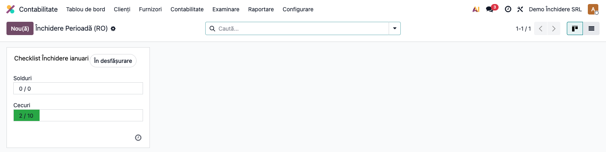
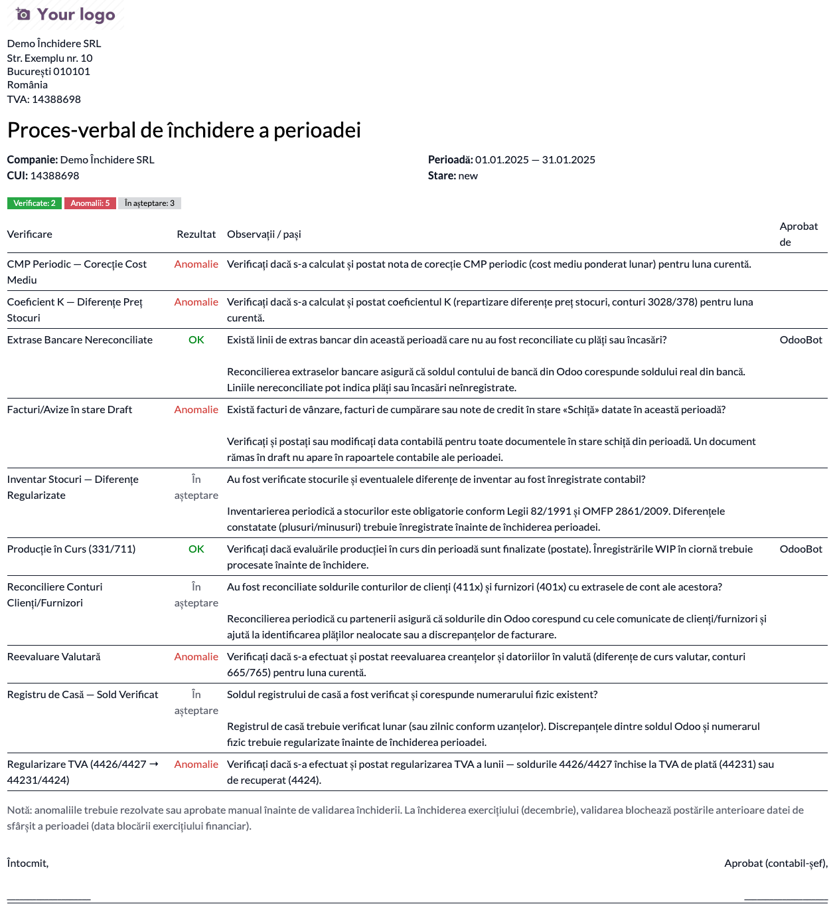
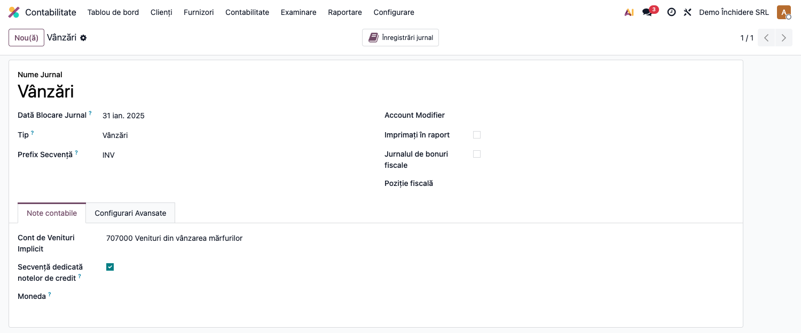

# Fișă Modul: Checklist Închidere Perioadă

**Poziție plan:** B2.4
**Modul:** `l10n_ro_period_close_enhanced`
**FR:** FR-27
**Capitol manual:** Cap 11.1
**Utilizator principal:** Contabil șef, Manager Contabilitate
**Prioritate:** 🟡 Medie

---

## 1. Scop business

Această fișă descrie utilizarea modulului `l10n_ro_period_close_enhanced` pentru scenariul **Checklist Închidere Perioadă**.
Consultantul folosește documentul pentru reproducerea fluxului în baza demo și
pentru pregătirea capitolului Cap 11.1 din manualul utilizator.

## 2. Bază legală și context

OMFP 1802/2014 — procedura închiderii lunare

## 3. Utilizatori și roluri

Contabil Șef

Roluri recomandate pentru testare:
- Administrator funcțional: instalează modulul și verifică meniurile
- Utilizator operațional: rulează fluxul zilnic sau lunar
- Contabil/manager: validează rezultatele contabile și rapoartele

## 4. Conturi și date implicate

—

Date minime pentru demo:
- companie românească cu localizarea contabilă instalată
- perioadă contabilă deschisă
- jurnale și conturi configurate conform scenariului
- documente de test postate, acolo unde fluxul pornește din contabilitate, stocuri, HR sau vânzări

## 5. Configurare inițială

1. Instalați modulul `l10n_ro_period_close_enhanced` pe baza demo.
2. Verificați dependențele cerute de manifest și meniurile nou apărute.
3. Configurați conturile, jurnalele, produsele, partenerii sau parametrii specifici fluxului.
4. Pregătiți un set minim de documente postate pentru perioada de test.
5. Verificați că utilizatorul de test are grupurile de acces necesare.

## 6. Flux de utilizare

### Pasul 1 — Accesare

Accesați **Contabilitate → Închidere perioadă → Checklist Închidere** și creați checklist-ul pentru luna de test.

### Pasul 2 — Completare date

Completați câmpurile obligatorii: companie, perioadă, jurnal, conturi, parteneri sau documente sursă, după caz.

### Pasul 3 — Calcul / import / generare

Rulați acțiunea principală a modulului. Pentru această fișă sunt documentate:

- Checklist vizual cu pre-condiții: facturi draft, extrase nereconciliate, K calculat, CMP rulat, reevaluare valutară, **regularizare TVA**, și (nou) **WIP finalizat, provizioane de stoc confirmate, inventar contabilizat**
- blocare perioadă după confirmare

**Lista checklist-urilor de închidere** (kanban) — fiecare lună cu starea și verificările aferente:

**Procesul-verbal de pre-închidere** (PDF) — toate verificările cu rezultatul lor (verificat /
anomalie / în așteptare); în exemplu, o factură rămasă în ciornă produce o anomalie:

### Pasul 4 — Verificare rezultat

Comparați rezultatul generat cu documentele sursă și cu monografia contabilă așteptată.
Verificați totalurile, starea documentului și eventualele mesaje de avertizare.

### Pasul 5 — Confirmare / postare

Confirmați documentul sau postați nota contabilă, după caz. Notați ce câmpuri devin readonly și ce linkuri apar către documentele generate.

### Pasul 6 — Export / raportare

Dacă modulul oferă export PDF, XLSX sau XML, generați fișierul și verificați că include datele de test relevante.

### Pasul 7 — Blocare configurabilă per jurnal (FR-27)

Pe lângă blocarea anuală a exercițiului, fiecare **jurnal** poate avea o **Dată blocare jurnal**
proprie. Astfel se pot bloca, de exemplu, jurnalele de TVA după depunerea D300, păstrând deschis
jurnalul de salarii. Accesați **Contabilitate → Configurare → Jurnale**, deschideți un jurnal și
completați câmpul **Dată blocare jurnal** ①.

Postarea unei înregistrări datate la sau înainte de această dată, în jurnalul respectiv, este blocată
cu un mesaj clar — independent de blocările la nivel de companie.

## 7. Legături cu alte module / declarații

| Modul / proces | Rol în flux |
|---|---|
| `l10n_ro_account_return_pl_closing` | închiderea 6xx/7xx în 121 |
| `l10n_ro_anaf_d300` | decont TVA și checklist depunere |
| `l10n_ro_currency_revaluation` | reevaluare valutară lunară |
| `l10n_ro_stock_cmp_periodic` / `l10n_ro_stock_k_coefficient` | procese stoc înainte de închidere |

Ce este automat: afișarea checkurilor și stării procesului de închidere.
Ce rămâne manual: decizia finală de închidere și rezolvarea excepțiilor.

## 8. Verificări pentru consultant

- [ ] Modulul se instalează fără erori pe baza demo.
- [ ] Meniurile și acțiunile sunt vizibile pentru rolul de utilizator potrivit.
- [ ] Fluxul poate fi reprodus de la cap la coadă cu date fictive românești.
- [ ] Rezultatul contabil sau operațional corespunde descrierii din plan.
- [ ] Mesajele de eroare sunt clare pentru un utilizator non-tehnic.
- [ ] Exporturile sau rapoartele se descarcă și conțin datele testate.

## 9. Mesaje de eroare frecvente

| Mesaj / simptom | Cauză probabilă | Remediere |
|-----------------|-----------------|-----------|
| Meniul nu este vizibil | Utilizatorul nu are grupurile necesare | Verificați drepturile de acces și reîncărcați aplicațiile |
| Nu se generează linii | Lipsesc documente postate în perioada aleasă | Creați și postați datele de test necesare |
| Cont lipsă sau jurnal lipsă | Configurarea contabilă este incompletă | Completați conturile și jurnalele în setările modulului |
| Perioada este blocată | Data documentului este într-o perioadă închisă | Folosiți o perioadă deschisă sau ajustați lock date-ul în demo |

## 10. Capturi de ecran

| # | Fișier | Conținut |
|---|--------|----------|
| 1 | `screenshots/01_checklist_kanban.png` | Lista checklist-urilor de închidere (kanban) cu verificările |
| 2 | `screenshots/02_raport_pv.png` | Procesul-verbal de pre-închidere (PDF) cu toate verificările și rezultatele |
| 3 | `screenshots/03_blocare_jurnal.png` | Câmpul „Dată blocare jurnal" ① pe formularul jurnalului (FR-27) |

> Notă i18n: textul raportului PV și denumirile verificărilor apar încă în engleză — traducerile
> există în `i18n/ro.po` dar nu se aplică la randarea `/report/html`. De rezolvat separat (agent
> `traducator-modul` / randare raport cu `lang=ro_RO`). Nu afectează conținutul: verificările și
> rezultatele sunt corecte.

## 11. Observații pentru manual

În manualul final, păstrați explicația orientată pe activitatea utilizatorului:
ce problemă rezolvă modulul, când se rulează, ce date trebuie pregătite și cum se verifică rezultatul.
