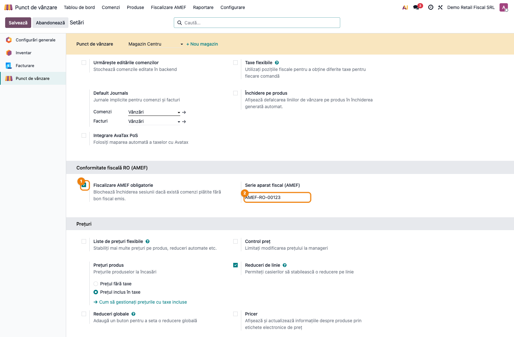
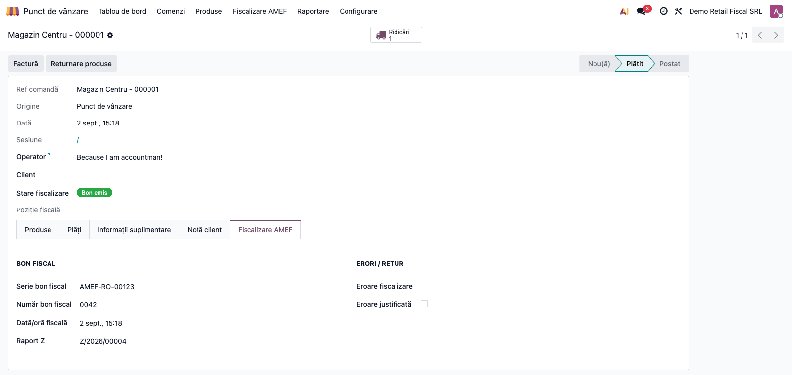
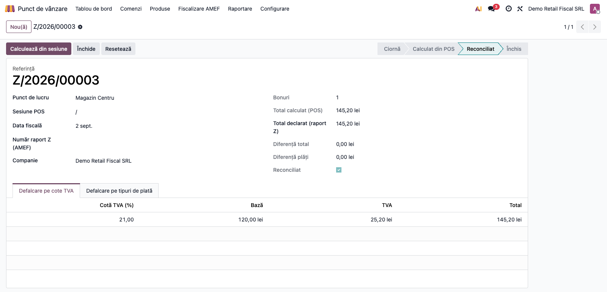
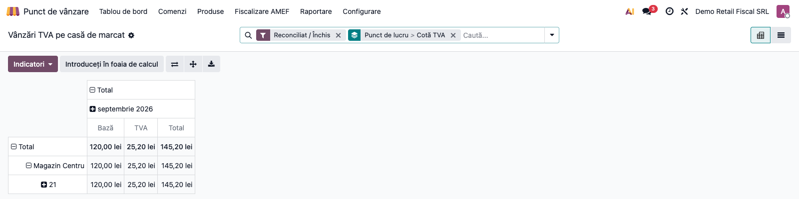
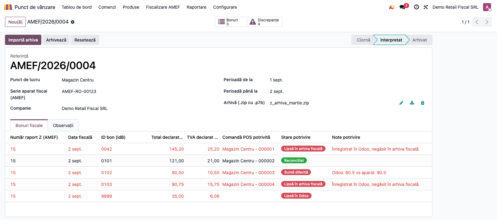
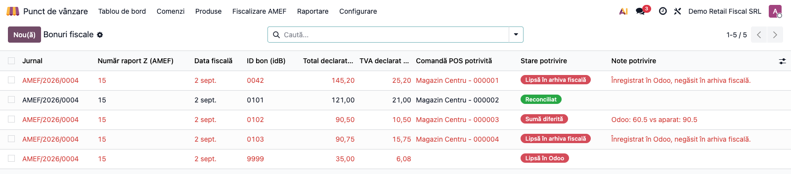
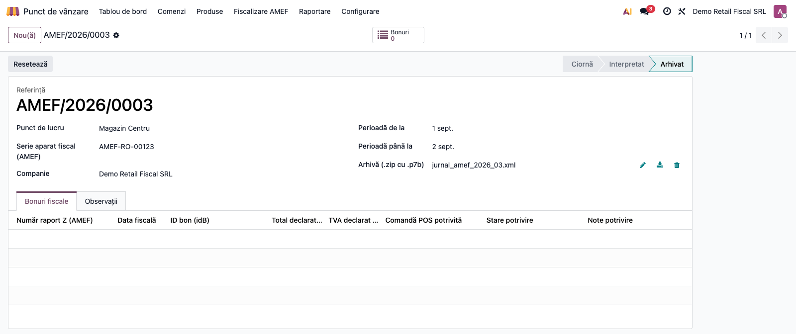

# Fișă Modul: Conformitate fiscală POS (AMEF)

**Modul:** `l10n_ro_pos_fiscal_compliance`
**FR:** FR-47
**Utilizator principal:** Operator POS / casier, Contabil retail
**Prioritate:** 🟡 Medie (zilnic în retail)

---

## 1. Scop business

Această fișă descrie utilizarea modulului `l10n_ro_pos_fiscal_compliance` pentru **conformitatea fiscală
a vânzării cu amănuntul prin POS** (aparate de marcat electronice fiscale — AMEF). Modulul completează
POS-ul Odoo cu evidența cerută în România: urmărirea seriei și numărului bonului fiscal pe fiecare
comandă, blocarea închiderii sesiunii dacă există comenzi plătite fără bon fiscal, raportul Z fiscal
reconciliat cu vânzările și încasările, și arhivarea jurnalului electronic AMEF.

Din versiunea 19.0.2.0.0, modulul poate **importa direct arhiva periodică a casei de marcat** (fișierul
`.zip` cu bonurile `.p7b` primit de la aparat) și reconciliază automat, bon cu bon, ce a emis fizic
aparatul fiscal față de ce a înregistrat Odoo — fără introducere manuală și fără să depindă de
corespondența aproximativă dată+sumă acolo unde bonul e deja înregistrat cu serie și număr.

## 2. Bază legală și context

OUG 28/1999 — obligația operatorilor economici care fac vânzări cu amănuntul către populație să
utilizeze aparate de marcat electronice fiscale și să emită bon fiscal. OPANAF 4156/2017 și actele
ulterioare reglementează fișierele AMEF (jurnal electronic, raport Z, bonuri fiscale) și conectarea
AMEF la ANAF.

> Modulul acoperă latura de conformitate (evidență, blocaj, raport Z, arhivă) peste POS-ul Odoo.
> Comunicarea efectivă cu aparatul fiscal se face printr-un driver (ex. `deltatech_pos`, opțional),
> care apelează metoda publică de înregistrare a răspunsului fiscal. Modulul **nu depinde** de un
> driver anume.

## 3. Utilizatori și roluri

Operator POS / casier (emite bonuri), Contabil retail (reconciliază raportul Z, arhivează jurnalul).

Roluri recomandate pentru testare:
- Administrator funcțional: instalează modulul, activează fiscalizarea pe punctul de lucru.
- Operator POS: înregistrează bonurile fiscale pe comenzi.
- Contabil/manager retail: generează și reconciliază raportul Z, arhivează jurnalul electronic.

## 4. Conturi și date implicate

Modulul **nu generează note contabile** — gestionează evidența fiscală a vânzărilor POS. Datele
implicate:
- **bon fiscal** pe `pos.order`: serie, număr, dată/oră fiscală, stare (de fiscalizat / emis / eroare);
- **punct de lucru** (`pos.config`): fiscalizare obligatorie + serie aparat fiscal (AMEF);
- **raport Z**: defalcare pe cote TVA și pe metode de plată, valori declarate vs. calculate;
- **jurnal electronic AMEF**: arhiva `.zip` cu bonurile `.p7b` pe perioadă și aparat;
- **bonuri fiscale reconciliate**: câte o linie per bon din arhivă, cu starea potrivirii cu comanda
  Odoo corespunzătoare (Reconciliat / Sumă diferită / TVA diferit / Lipsă în Odoo / Lipsă în arhiva
  fiscală).

Date minime pentru demo:
- companie românească cu localizarea contabilă și `point_of_sale` instalate;
- un punct de lucru POS cu fiscalizare activă și metode de plată;
- una sau mai multe comenzi POS plătite în sesiune.

## 5. Configurare inițială

1. Instalați modulul `l10n_ro_pos_fiscal_compliance`.
2. În **Point of Sale → Configurare → Setări**, selectați punctul de lucru și, la secțiunea
   **Conformitate fiscală RO (AMEF)**, bifați **Fiscalizare AMEF obligatorie** și completați **Seria
   aparatului fiscal**.
3. Verificați metodele de plată ale punctului de lucru (numerar, card, tichete).
4. Verificați că operatorul are grupul **Point of Sale / Utilizator**.

## 6. Flux de utilizare

### Pasul 1 — Activarea fiscalizării pe punctul de lucru

În **Point of Sale → Configurare → Setări**, la secțiunea **Conformitate fiscală RO (AMEF)**, activați
**Fiscalizare AMEF obligatorie** și completați seria aparatului fiscal. De acum, comenzile plătite din
acest punct de lucru trebuie să aibă bon fiscal emis înainte de închiderea sesiunii.



### Pasul 2 — Bonul fiscal pe comandă

Pe fiecare comandă POS (**Point of Sale → Comenzi → Comenzi**), fila **Fiscalizare AMEF** arată starea
și datele bonului. Driverul aparatului fiscal completează automat seria și numărul (prin metoda de
integrare); alternativ, le puteți introduce manual și apăsa **Înregistrează bon fiscal**, ceea ce trece
comanda în starea **Bon emis**. Dacă aparatul a întors eroare, comanda rămâne **Eroare fiscalizare** și
poate fi marcată drept eroare justificată.



### Pasul 3 — Raportul Z fiscal

La finalul zilei, generați raportul Z din sesiune sau din **Point of Sale → Fiscalizare AMEF →
Rapoarte Z**. Apăsați **Calculează din sesiune**: se agregă vânzările pe cote TVA și încasările pe
metode de plată. Completați valorile declarate din raportul Z al aparatului și apăsați **Reconciliază**
— diferențele față de totalurile POS sunt evidențiate (stare „Reconciliat" sau „Diferențe").



### Pasul 4 — Raportul TVA pe interval, per casă de marcat

Pentru un sumar centralizat pe o perioadă oarecare (nu doar sesiune cu sesiune), deschideți
**Point of Sale → Fiscalizare AMEF → Vânzări TVA pe casă de marcat**. Raportul pornește implicit
grupat pe **punct de lucru** și **cotă TVA**, filtrat pe rapoartele Z reconciliate/închise, și
însumează pentru fiecare combinație baza fără TVA, TVA-ul și totalul — indiferent de metoda de
încasare (numerar, card, tichete etc.), pentru că liniile provin din defalcarea pe cote TVA a
raportului Z, nu din liniile de plată.

**Găsește pe ecran** — vederea implicită e de tip pivot: rândurile grupează punctul de lucru și
cota de TVA, coloanele defalcă pe lună (interval de dată). Fiecare celulă arată baza, TVA-ul și
totalul agregat. Câmpul **Serie dispozitiv fiscal** (vizibil în vederea listă) identifică exact
aparatul fizic — cel care apare și în arhiva jurnalului electronic exportată de casă.

**Verifică** — înainte de a trimite cifrele mai departe (ex. către contabilitatea externă),
confirmați: intervalul de dată selectat corespunde perioadei cerute; toate punctele de lucru cu
vânzări în perioadă apar în raport (nu doar unul); suma totalurilor pe cote TVA ale unui punct de
lucru coincide cu totalul din raportul Z declarat/reconciliat al aceluiași punct de lucru pentru
aceeași perioadă. Dacă filtrul „Reconciliat / Închis" e activ și lipsesc zile din perioadă, e
posibil ca acele rapoarte Z să fie încă în starea „Ciornă"/„Calculat din POS" — verificați Pasul 3 pentru
zilele lipsă înainte de a trage concluzii.

> **Limitări de citit înainte de a trimite cifrele mai departe.** Raportul **nu** e o citire directă
> a jurnalului/arhivei ANAF — e calculat din datele Odoo ale raportului Z (Pasul 3), care la rândul
> lor sunt doar reconciliate ca *total* cu arhiva, nu linie cu linie pe cotă (vezi „Note de
> monografie și raportare" mai jos); tratați-l ca sursă de lucru, nu ca substitut al arhivei oficiale.
> Cota de TVA a fiecărei linii se ia din **prima taxă procentuală** a liniei — vânzările scutite și
> cele cu taxe fixe (fără procent) apar toate cumulat pe rândul „0", care merită verificat separat.
> Agregarea include orice comandă a sesiunii care nu e ciornă/anulată, deci și comenzile POS
> facturate — pentru un total strict pe bonuri fiscale, verificați și distincția factură/bon din
> Pasul 2.

**Treci mai departe** — pentru detaliere pe bon individual sau pe sesiune, treceți din pivot în
vederea **listă** (butonul din colțul din dreapta sus): fiecare linie arată raportul Z sursă,
data, punctul de lucru, seria aparatului și cota de TVA. Din listă, exportul standard Odoo (XLSX)
e disponibil pentru a transmite datele mai departe.



### Pasul 5 — Importul arhivei jurnalului electronic AMEF

În **Point of Sale → Fiscalizare AMEF → Jurnale electronice AMEF**, creați o înregistrare nouă:
selectați punctul de lucru, seria aparatului, perioada (dată început/sfârșit) și atașați arhiva
`.zip` primită de la casa de marcat (fișierele `.p7b` din interior sunt exporturile semnate ale
raportului Z, în formatul standard ANAF de monitorizare AMEF). Apăsați **Importă arhiva**.

Modulul extrage conținutul fiecărui `.p7b` (semnătura garantează doar autenticitatea, nu e nevoie de
nicio cheie sau certificat pentru citire), identifică bonurile și raportul Z al fiecărei zile și le
reconciliază automat cu comenzile din Odoo pe **seria și numărul bonului** — nu pe o simplă
apropiere de dată și sumă, acolo unde bonul e deja înregistrat. Starea jurnalului trece în
**Parsed**, iar fila **Fiscal Receipts** se umple cu câte o linie per bon fiscal găsit în arhivă.



> Dacă arhiva conține și fișierul OPIS (manifestul perioadei), modulul verifică și dacă lipsesc
> rapoarte Z întregi din arhivă față de ce apare în OPIS, afișând lista în câmpul **Missing Z
> Reports (OPIS)** de pe formular.

### Pasul 6 — Verificarea discrepanțelor

Din butonul statistic **Discrepancies** de pe jurnal (sau din meniul **Point of Sale → Fiscalizare
AMEF → Fiscal Receipts Discrepancies**) se deschide lista completă a bonurilor cu probleme, cu
filtre pe starea potrivirii: bonuri fără corespondent în Odoo, sume sau cote TVA diferite între
aparat și Odoo, și — simetric — comenzi fiscalizate în Odoo care nu apar în arhiva fiscală a
aparatului pentru ziua respectivă.



După ce discrepanțele sunt lămurite (corectare manuală în Odoo sau justificare), reveniți pe jurnal
și apăsați **Archive** pentru a-l marca drept închis pentru perioada respectivă.



### Note de monografie și raportare

Modulul **nu produce note contabile** — nota contabilă agregată a sesiunii POS rămâne cea generată de
`point_of_sale` la închidere. Aportul modulului este: evidența seriei/numărului de bon fiscal,
**blocarea închiderii sesiunii** dacă există comenzi plătite nefiscalizate fără eroare justificată,
raportul Z reconciliat (pe cote TVA și metode de plată) și arhiva jurnalului electronic AMEF.
Returul fiscal referențiază bonul inițial (câmpurile „Bon inițial (retur)").

La importul arhivei (Pasul 5), raportul Z al fiecărei zile se completează și reconciliază automat:
totalul declarat (`declared_total`) devine suma bonurilor găsite în arhivă pentru ziua respectivă,
iar plățile declarate se aliniază, unde numele metodei de plată din Odoo corespunde celei din
arhivă, cu sumele raportate de aparat (nodul `<pl>` din raportul Z). Reconcilierea rămâne la nivel
de total declarat pe raport — defalcarea pe cote TVA e disponibilă doar la nivel de bon individual
(fila **Fiscal Receipts**), nu agregată automat pe liniile raportului Z.

Raportul **Vânzări TVA pe casă de marcat** (Pasul 4) nu recalculează nimic — citește direct liniile
de TVA deja calculate de fiecare raport Z (`action_compute_from_session`) și le însumează pe
interval, punct de lucru și cotă. De aceea reflectă întotdeauna starea curentă a rapoartelor Z din
perioadă: dacă un raport Z e încă „Ciornă"/„Calculat din POS" (necalculat sau nereconciliat),
valorile lui intră totuși în sumă doar dacă filtrul „Reconciliat / Închis" e dezactivat — cu filtrul
activ (implicit), doar rapoartele Z finalizate contează. Chiar și așa, raportul rămâne o citire a
datelor Odoo, nu a arhivei ANAF — vezi rezerva de la Pasul 4 privind bucketul de cotă „0" și
comenzile facturate.

## 7. Legături cu alte module / declarații

| Modul / proces | Rol în flux | Tip legătură |
|---|---|---|
| `point_of_sale` | comenzi, sesiuni, metode de plată, nota de sesiune | dependență (manifest) |
| `account` | nota contabilă de sesiune (generată de POS) | dependență (manifest) |
| `l10n_ro` | plan de conturi și taxe RO | dependență (manifest) |
| `deltatech_pos` / `deltatech_pos_base` | driver fiscal AMEF (apelează `_l10n_ro_apply_fiscal_response`) | integrare opțională (nu dependență) |
| `l10n_ro_anaf_d394_pos` | agregarea bonurilor fiscale POS în declarația D394 (dacă e instalat) | integrare prin convenție (realizată de modulul D394 POS, nu de acesta) |

> Raportul **Vânzări TVA pe casă de marcat** (Pasul 4) e o vedere peste datele deja calculate ale
> rapoartelor Z — nu are dependențe suplimentare și e disponibil oricărui client cu modulul
> instalat, nu doar celor care importă arhiva jurnalului electronic (Pasul 5).

Ce este automat: marcarea stării de fiscalizare, blocarea închiderii sesiunii, importul și
reconcilierea bon-cu-bon din arhiva `.zip`/`.p7b`, completarea raportului Z din arhivă,
reconcilierea cu vânzările/încasările POS, și agregarea pe interval/casă de marcat/cotă TVA a
liniilor deja calculate ale rapoartelor Z.
Ce rămâne manual: configurarea fiscalizării pe punctul de lucru, obținerea arhivei periodice de la
casa de marcat și încărcarea ei, lămurirea discrepanțelor semnalate (corectare în Odoo sau
justificare), și justificarea erorilor de fiscalizare.

## 8. Verificări pentru consultant

- [ ] Modulul se instalează fără erori (cu `point_of_sale` prezent).
- [ ] În Setări POS apare secțiunea **Conformitate fiscală RO (AMEF)** cu cele două opțiuni.
- [ ] Pe comanda POS apare fila **Fiscalizare AMEF** cu starea bonului.
- [ ] O comandă plătită fără bon fiscal blochează închiderea sesiunii (cu mesaj clar).
- [ ] „Înregistrează bon fiscal" trece comanda în starea „Bon emis" și salvează seria/numărul.
- [ ] Raportul Z agregă corect pe cote TVA și pe metode de plată; reconcilierea semnalează diferențele.
- [ ] **Vânzări TVA pe casă de marcat** grupează corect pe punct de lucru și cotă TVA; totalul pe un
      punct de lucru pentru o zi coincide cu totalul raportului Z reconciliat al aceleiași zile.
- [ ] Cu filtrul „Reconciliat / Închis" activ, rapoartele Z în starea „Ciornă"/„Calculat din POS" nu
      intră în sumă (dezactivând filtrul, intră și ele).
- [ ] Coloana **Serie dispozitiv fiscal** din vederea listă a raportului corespunde cu seria
      configurată pe punctul de lucru (Pasul 1) și cu cea din jurnalul AMEF importat (Pasul 5).
- [ ] Jurnalul electronic AMEF poate fi arhivat cu fișier atașat.
- [ ] „Importă arhiva" pe un jurnal cu un `.zip` valid de `.p7b` trece starea în „Parsed" și
      populează fila **Fiscal Receipts** cu câte o linie per bon găsit.
- [ ] Un bon cu serie+număr deja înregistrate pe o comandă Odoo, cu sumă identică, apare
      **Reconciliat**; cu sumă diferită apare **Sumă diferită**.
- [ ] Un `idB` din arhivă fără nicio comandă Odoo corespunzătoare apare **Lipsă în Odoo**; o comandă
      fiscalizată în Odoo absentă din arhiva zilei respective apare **Lipsă în arhiva fiscală**.
- [ ] Lista de discrepanțe (buton statistic sau meniu dedicat) filtrează corect după starea
      potrivirii.
- [ ] Un `.zip` invalid sau un `.p7b` care nu poate fi decodat CMS/PKCS7 produce un mesaj de eroare
      clar, nu o eroare tehnică.

## 9. Mesaje de eroare frecvente

| Mesaj / simptom | Cauză probabilă | Remediere |
|-----------------|-----------------|-----------|
| „Nu se poate închide sesiunea …: … comenzi plătite nu au bon fiscal emis." | Comenzi plătite nefiscalizate într-o sesiune cu fiscalizare obligatorie | Emiteți bonul fiscal sau marcați eroarea ca justificată pe comenzile listate |
| „Completați numărul bonului fiscal pentru comanda …" | „Înregistrează bon fiscal" apăsat fără număr completat | Completați numărul (și seria) bonului fiscal |
| „Încărcați fișierul jurnalului electronic înainte de arhivare." | „Arhivează" apăsat fără fișier atașat | Atașați fișierul jurnalului electronic AMEF |
| „Please upload the .zip archive before importing." | „Importă arhiva" apăsat fără fișier atașat | Atașați arhiva `.zip` primită de la casa de marcat |
| „The uploaded file is not a valid .zip archive." | Fișierul atașat nu e o arhivă `.zip` (ex. e chiar un `.p7b` sau un fișier corupt) | Verificați că atașați arhiva `.zip` originală, nenmodificată |
| „…: could not be parsed as a valid CMS/PKCS7 (.p7b) file." (în notele jurnalului, după import) | Un fișier `.p7b` din arhivă e corupt sau nu e o structură CMS SignedData | Verificați exportul de la casa de marcat; fișierele valide sunt sărite din raport, restul se importă normal |

## 10. Capturi de ecran

Capturile (`readme/screenshots/`) sunt **generate automat** din `tests/test_screenshots.py`
(mixinul `ScreenshotCase` din `l10n_ro_doc_screenshots`, import defensiv), în **limba română**,
pe planul de conturi RO (`setup_country("ro")`):

1. `01_config_fiscal.png` — setări POS, secțiunea „Conformitate fiscală RO (AMEF)".
2. `02_comanda_fiscal.png` — comanda POS, fila „Fiscalizare AMEF".
3. `03_raport_z.png` — raportul Z fiscal (defalcare TVA + metode de plată, reconciliere).
4. `07_raport_tva_casa_marcat.png` — raportul „Vânzări TVA pe casă de marcat" (pivot pe interval,
   punct de lucru și cotă TVA).
5. `05_import_arhiva.png` — jurnalul AMEF după import, fila „Fiscal Receipts" cu bonurile reconciliate.
6. `06_discrepante.png` — lista discrepanțelor bonurilor fiscale.
7. `04_jurnal_amef.png` — jurnalul electronic AMEF arhivat (pasul final, după lămurirea discrepanțelor).

Regenerare:

```bash
./odoo/odoo-bin -c odoo.conf -d <db> -i l10n_ro_pos_fiscal_compliance,l10n_ro_doc_screenshots \
    --test-tags=fise_screenshots --stop-after-init
```

## 11. Observații pentru manual

În manualul final, păstrați explicația orientată pe activitate: obligația bonului fiscal la vânzarea cu
amănuntul, ce înseamnă blocarea închiderii sesiunii, cum se citește raportul Z reconciliat și de ce se
arhivează jurnalul electronic. Subliniați că modulul nu modifică contabilitatea POS, ci adaugă
controlul fiscal cerut de lege; comunicarea cu aparatul fiscal fizic se face prin driverul de
fiscalizare instalat separat.

Pentru fluxul de import arhivă, precizați clar diferența dintre cele două stări de reconciliere pe
care le poate întâlni consultantul: **Reconciliat/Sumă diferită/TVA diferit** (bonul există și în
arhivă, și în Odoo — verificarea e pe conținut) versus **Lipsă în Odoo/Lipsă în arhiva fiscală**
(bonul există doar de o parte — verificarea e pe existență). A doua categorie e cea care necesită
investigație operațională (vânzare neînregistrată în Odoo sau bon emis manual fără corespondent
fizic), nu doar o corecție de sumă.
