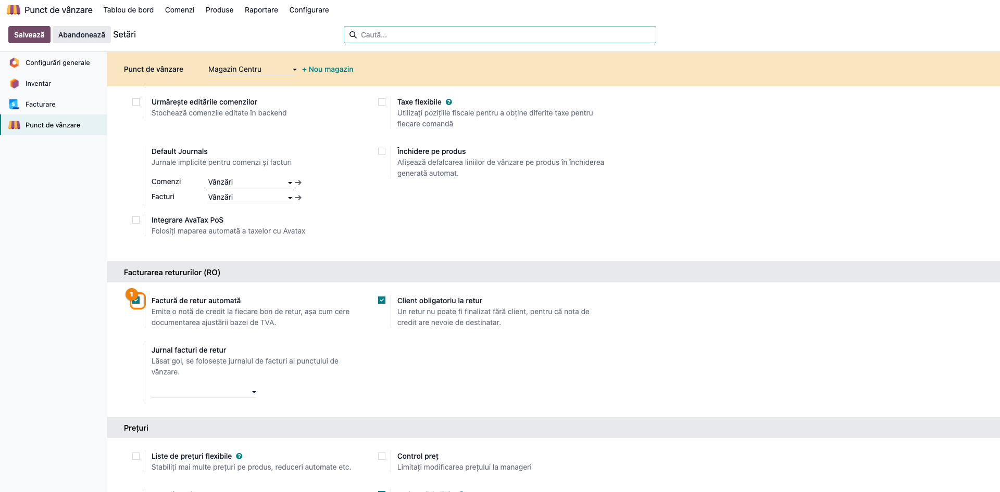
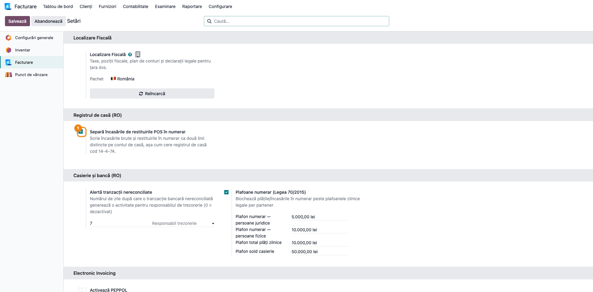
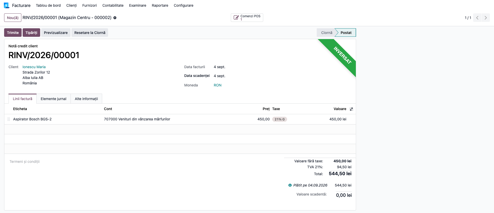
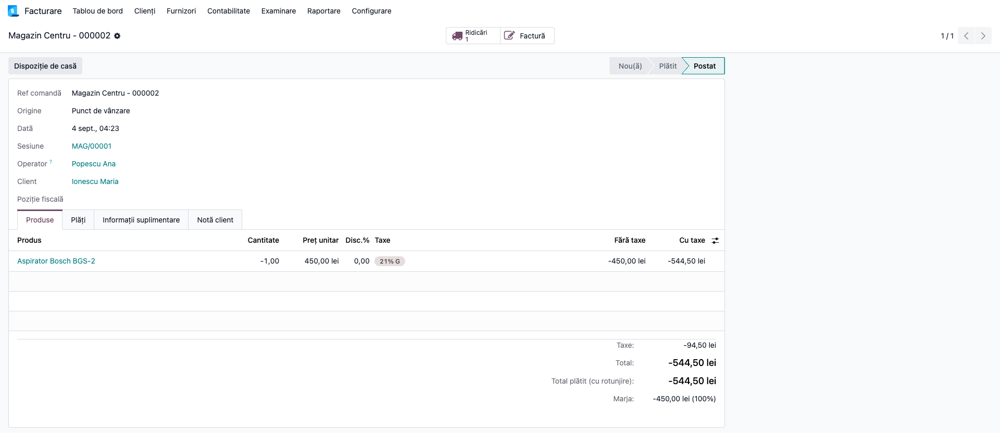
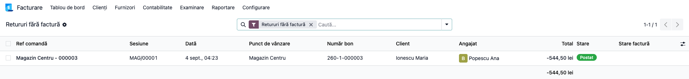
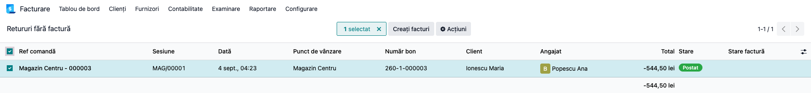
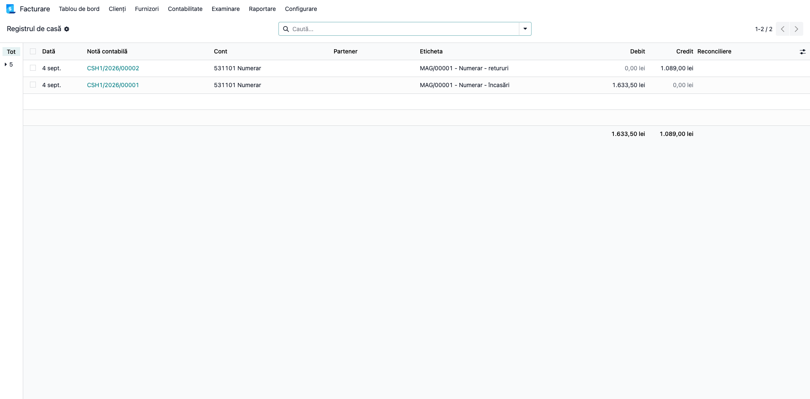
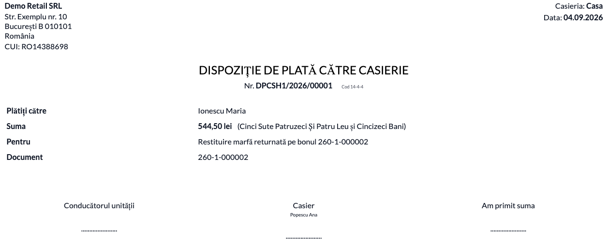

# Fișă Modul: Retururi POS — factură de retur și registrul de casă

**Modul:** `l10n_ro_pos_returns`
**Utilizator principal:** Casier / responsabil magazin (operare), Contabil (verificare și perioada scursă)
**Prioritate:** 🔴 Ridicată (fără factura de retur, TVA-ul colectat nu se poate diminua)

---

## 1. Scop business

În comerțul cu amănuntul, vânzarea pe bon fiscal este scutită de obligația emiterii facturii, dar
**returul nu este**. Fără un document de retur, contabilul nu are pe ce să diminueze TVA-ul colectat,
iar în registrul de casă banii dați înapoi clientului dispar din vedere: Odoo îi scade direct din
încasarea zilei, așa că ziua arată o încasare mai mică, nu o încasare și o plată.

Modulul închide ambele goluri. La fiecare bon de retur se emite automat **factura de retur**, iar la
închiderea sesiunii restituirile de numerar apar pe **rândul de plăți** al registrului de casă,
separat de încasări. Soldul casei nu se schimbă — se schimbă doar felul în care este citit.

## 2. Bază legală și context

- **Art. 319 alin. (10) lit. a) din Codul fiscal** — vânzarea cu amănuntul este scutită de obligația
  emiterii facturii; bonul fiscal este suficient la vânzare.
- **Art. 287 lit. b) și art. 330 alin. (2) din Codul fiscal**, cu **HG 1/2016, pct. 32 alin. (1)** —
  pentru reducerea bazei de impozitare (returul de marfă intră la lit. b), refuzuri și desființarea
  contractului) se emite factură cu valorile înscrise **cu semnul minus**, care se transmite și
  cumpărătorului. Scutirea de la vânzare nu se extinde asupra returului. Bonul fiscal restituit și
  nota de stoc **nu** țin locul acestui document.

  **Nota de credit este acest document.** Odoo emite o notă de credit (tip 381 în CIUS-RO) cu valori
  pozitive și sens de creditare — semnul îl dă tipul documentului, nu valorile de pe linii. Nu
  căutați o factură cu cifre negative: efectul fiscal este identic și acceptat.
- **Registrul de casă, cod 14-4-7A (OMFP 2634/2015)** — formularul cere încasările pe rândul de
  încasări și plățile pe rândul de plăți; o valoare netă pe un singur rând nu respectă formularul.
- **Dispoziția de plată/încasare către casierie, cod 14-4-4 (OMFP 2634/2015)** — formular
  bidirecțional, folosit aici pe sensul de plată; documentul de disciplină de casă pentru ieșirea
  efectivă a numerarului. Nu este emis de acest modul, ci de modulul de casierie
  (vezi secțiunea 7).

## 3. Utilizatori și roluri

| Rol | Ce face în acest flux |
|---|---|
| Casier | Introduce returul, identifică cumpărătorul, restituie banii |
| Responsabil magazin | Închide sesiunea, verifică filtrul „Retururi fără factură" |
| Contabil | Verifică facturile de retur, registrul de casă, emite facturile pentru perioada scursă |

Roluri recomandate pentru testare: un utilizator cu drepturi de punct de vânzare (operarea la casă),
unul de contabilitate (verificarea notelor) și un administrator funcțional (setările).

## 4. Conturi și date implicate

| Cont | Rol în flux |
|---|---|
| 4111 | Clienți — creanța stornată prin factura de retur |
| 707 (sau contul de venit al articolului) | Venituri din vânzarea mărfurilor — diminuate cu valoarea returului |
| 4427 | TVA colectată — diminuată cu TVA-ul aferent returului |
| 5311 (în planul RO livrat cu Odoo: `531101 Numerar`) | Casa în lei — creditată cu numerarul restituit |
| 371 / 607 | Marfa reintrată în gestiune și costul aferent, prin nota de stoc a POS-ului |

Date minime pentru demo:
- companie românească cu planul de conturi RO instalat;
- un punct de vânzare cu **jurnal de facturi configurat** (cerință a nucleului POS) și o metodă de
  plată în numerar;
- un contact de tip persoană fizică, cu țară, județ, oraș și stradă completate;
- cel puțin o vânzare finalizată, pentru a avea ce returna.

## 5. Configurare inițială

1. Instalați modulul `l10n_ro_pos_returns`.
2. Deschideți **Punct de vânzare → Configurare → Setări**, alegeți punctul de vânzare și, în
   secțiunea **Facturarea retururilor (RO)**, activați **Factură de retur automată**. Setarea este
   oprită implicit, ca instalarea să nu schimbe comportamentul unei case fără ca cineva să decidă.
3. Lăsați activă opțiunea **Client obligatoriu la retur** (implicit pornită).

   > **Atenție la combinația celor două.** Obligativitatea clientului se verifică **independent** de
   > facturarea automată. Dacă lăsați „Factură de retur automată" oprită (starea implicită) și
   > „Client obligatoriu la retur" pornită (tot starea implicită), casa va **bloca** retururile fără
   > client, fără să emită nicio factură în schimb. Fie le porniți pe amândouă — configurația
   > recomandată — fie le opriți pe amândouă.
4. Opțional, completați **Jurnal facturi de retur** dacă doriți facturile de retur într-un jurnal
   separat de cel al punctului de vânzare.
5. Verificați în **Facturare / Contabilitate → Configurare → Setări**, secțiunea **Registrul de casă (RO)**, că
   opțiunea **Separă încasările de restituirile POS în numerar** este activă (implicit da).
6. Repetați pașii 2–4 pentru fiecare punct de vânzare — setările sunt per casă.

## 6. Flux de utilizare

### Pasul 1 — Setările punctului de vânzare

Din **Punct de vânzare → Configurare → Setări**, selectați punctul de vânzare și derulați la
secțiunea **Facturarea retururilor (RO)**. Aici se decid cele trei comportamente: emiterea automată a
facturii, obligativitatea clientului și jurnalul facturilor de retur.



### Pasul 2 — Separarea încasărilor de restituiri

Din **Facturare / Contabilitate → Configurare → Setări**, secțiunea **Registrul de casă (RO)**, verificați
comutatorul **Separă încasările de restituirile POS în numerar**. Se aplică la nivel de companie și
acționează asupra sesiunilor închise **după** activare; sesiunile deja închise păstrează linia netă.



### Pasul 3 — Returul la casă

Casierul introduce returul ca de obicei — fie prin butonul de retur al POS-ului, fie cu cantități
negative direct pe bon — și trece la ecranul de plată. Bonul este marcat automat „de facturat", ceea
ce face ca ecranul să **ceară clientul înainte de finalizare**.

Cumpărătorul trebuie identificat efectiv, nu doar completat formal: un contact colectiv folosit
pentru bonurile anonime este refuzat, iar contactul ales trebuie să aibă țara, județul, orașul și
strada completate — datele pe care factura le cere destinatarului. Mesajul apare **la casă**, cât
clientul este încă acolo, nu ca eroare de postare după ce a plecat cu banii.

### Pasul 4 — Factura de retur

La sincronizarea bonului, factura de retur se emite și se postează automat: document de tip **notă de
credit**, cu cota de TVA și valoarea pe fiecare articol.

Când returul a fost introdus prin butonul de retur al POS-ului — deci este legat de un bon anterior —
în subsolul facturii, la **Termeni și condiții**, apare și trimiterea la bonul stornat. La un retur
introdus cu cantități negative direct pe bon, acea legătură nu există, deci câmpul rămâne gol.



Panglica verde **„Inversat"** de pe document nu înseamnă că nota a fost anulată: Odoo o marchează
astfel după ce documentul a fost stins integral prin plata de pe bon. Este un document valid și
complet decontat.

Bonul de retur păstrează legătura către factură, astfel încât documentul se regăsește pornind de la
oricare dintre cele două.



### Pasul 5 — Verificarea situației

În **Punct de vânzare → Comenzi**, deschideți meniul **Filtre** din bara de căutare: filtrul
**Retururi** arată toate bonurile cu total negativ, iar **Retururi fără factură** pe cele care nu au
primit încă document. (Capturile de mai jos sunt luate pe lista deja filtrată.)

**Găsiți pe ecran:** fiecare rând este un bon de retur; coloana de total este negativă, iar coloana
de client arată cui i s-a emis factura.
**Verificați:** în funcționare normală, filtrul **Retururi fără factură** trebuie să rămână **gol**.
Ce apare acolo are nevoie de atenție — de regulă retururi fără cumpărător identificat, sau bonuri
intrate prin sincronizare offline.
**Abia apoi** treceți la emiterea în lot (pasul 6) sau la corectarea contactelor.



### Pasul 6 — Emiterea pentru perioada scursă

Selectați în listă bonurile de retur rămase fără factură și rulați **Acțiuni → Emite facturile de
retur**. Notificarea spune câte facturi s-au emis și câte bonuri au fost sărite; motivele apar în
jurnalul serverului — lipsa cumpărătorului, contact incomplet, bon nefinalizat, bon deja facturat,
lipsa jurnalului de facturi pe casă.

Pentru un bon dintr-o sesiune deja închisă, factura primește **data curentă**, iar contribuția
bonului din nota de închidere a sesiunii se reversează, tot cu data curentă. Efectul contabil net
rămâne astfel o singură dată în evidență.

> **De discutat cu contabilul, nu de tratat ca rezolvat.** Rămâne un decalaj între document și
> perioadă: factura poartă data lunii curente, în timp ce operațiunea a avut loc în luna bonului.
> Poziția noastră este că nu sunt necesare declarații rectificative, pentru că sumele nu se mută
> între perioade — dar este o poziție asumată, pe care contabilul o poate aprecia diferit.
> **Recomandarea practică rămâne emiterea facturii în aceeași perioadă cu bonul**, ori de câte ori
> este posibil; emiterea retroactivă este soluția pentru situația deja creată, nu regimul normal.

Emiterea în lot nu generează PDF-uri și nu trimite e-mailuri; documentele se transmit ulterior,
controlat, prin fluxul de e-Factura.



### Pasul 7 — Registrul de casă

După închiderea sesiunii, contul de casă arată **două linii** în locul uneia: încasările brute pe
debit și restituirile de retur pe credit.

**Găsiți pe ecran:** liniile generate de sesiunea POS, în fișa contului 5311 sau în raportul de
registru de casă — livrat de modulul `l10n_ro_cash_register_report`, la
**Facturare / Contabilitate → Raportare → Registru de casă**.
**Verificați:** suma celor două linii este egală cu vechea valoare netă — soldul casei nu s-a
schimbat; iar restul dat clientului la o vânzare **nu** apare ca plată, pentru că în sertar a intrat
doar diferența.
**Abia apoi** tipăriți sau exportați registrul de casă.



### Pasul 8 — Dispoziția de plată pentru numerarul restituit

Dacă este instalat modulul de casierie, bonul de retur are butonul **Dispoziție de casă**, care
întocmește documentul cod 14-4-4 pe casieria bonului, cu numerarul efectiv restituit și cu
beneficiarul de pe bon. Documentul se tipărește și se semnează la casierie.



### Note de monografie și raportare

- **Factura de retur** (notă de credit către cumpărător):
  **Dr 707 + Dr 4427 = Cr 4111** — venitul și TVA-ul colectat se diminuează cu valoarea returului.
- **Restituirea numerarului**: **Dr 4111 = Cr 5311**.
- **Marfa reintrată în gestiune**, prin nota de stoc a POS-ului: **Dr 371 = Cr 607**, la costul
  articolului.
- **Fără dublare.** La emiterea facturii pentru un bon dintr-o sesiune închisă, contribuția acelui
  bon din nota de închidere se reversează pe toate naturile, deci venitul și TVA-ul rămân înregistrate
  o singură dată. Aceasta este și rațiunea pentru care emiterea retroactivă nu impune declarații
  rectificative.
- **Retur aferent exercițiului precedent.** Conturile de mai sus acoperă returul din **același**
  exercițiu financiar. Pentru marfa vândută într-un exercițiu încheiat, corecția se înregistrează la
  data bilanțului prin **418** (respectiv 408), conform OMFP 1802/2014 pct. 330 alin. (1).
- **În D300**, TVA-ul aferent returului intră prin tag-urile taxelor de pe factura de retur, cu semn
  opus vânzării, cumulându-se cu livrările taxabile.
- **Registrul de casă** citește liniile contabile de pe contul jurnalului, deci ambele forme de
  registru folosite în practică beneficiază de separare fără modificări proprii.

## 7. Legături cu alte module / declarații

| Modul / proces | Rol în flux | Tip legătură |
|---|---|---|
| `point_of_sale` | bonuri, sesiuni, generarea facturii din bon | dependență (manifest) |
| `l10n_ro` | planul de conturi RO | dependență (manifest) |
| `l10n_ro_cash_bank_enhanced` | registrul dispozițiilor de casă (14-4-4) alimentat de butonul de pe bon | integrare opțională, verificată la rulare |
| `deltatech_partner_generic` | desemnează contactul colectiv refuzat la retur | integrare opțională |
| `l10n_ro_pos_fiscal_compliance` | evidența bonului fiscal AMEF; când e instalat, trimiterea la bonul inițial intră în descrierea facturii | integrare opțională |
| `l10n_ro_efactura_b2c` | completează CNP-ul în XML-ul CIUS-RO pentru facturile către persoane fizice | recomandat la transmiterea în SPV |
| `l10n_ro_cash_register_report` | tipărește registrul de casă (14-4-7A), care citește liniile separate | complementar, fără suprapunere |
| `l10n_ro_pos` (OCA) | scoate din nota de închidere liniile de ieșire din gestiune | complementar, fără suprapunere |

**Ce este automat:** marcarea bonului de retur, cererea cumpărătorului la casă, emiterea și postarea
facturii de retur, separarea încasări/restituiri la închiderea sesiunii.

**Ce rămâne manual:** identificarea corectă a persoanei care aduce marfa înapoi, completarea datelor
de contact, decizia asupra retururilor din perioada scursă, transmiterea facturilor în SPV și
tipărirea dispoziției de casă.

## 8. Verificări pentru consultant

- [ ] Modulul se instalează fără erori, iar în setările punctului de vânzare apare secțiunea
      **Facturarea retururilor (RO)**.
- [ ] Cu **Client obligatoriu la retur** activ, un retur fără client nu poate fi finalizat la casă,
      iar mesajul spune ce lipsește.
- [ ] Un contact colectiv pentru bonuri anonime este refuzat la retur, cu mesaj explicit.
- [ ] Un contact fără județ (sau oraș, sau stradă) este refuzat, iar mesajul numește câmpurile lipsă.
- [ ] Bonul de retur finalizat are factură postată, de tip notă de credit, cu TVA pe fiecare articol.
- [ ] Filtrul **Retururi fără factură** este gol după o zi de operare normală.
- [ ] Emiterea în lot pe bonuri vechi produce facturi cu data curentă, iar notificarea raportează
      corect câte au fost emise și câte sărite.
- [ ] După emiterea retroactivă, venitul și TVA-ul apar **o singură dată** în balanța perioadei.
- [ ] După închiderea unei sesiuni cu retururi, contul de casă are două linii, iar suma lor este
      egală cu valoarea netă de dinainte.
- [ ] Un bon de vânzare cu rest dat clientului **nu** produce o linie de plată.
- [ ] Butonul **Dispoziție de casă** produce documentul cu suma efectiv restituită (doar cu modulul
      de casierie instalat).

## 9. Mesaje de eroare frecvente

| Mesaj / simptom | Cauză probabilă | Remediere |
|---|---|---|
| „Bonul de retur … nu are client. Nu se poate emite o factură de retur fără destinatar…" | Retur finalizat fără client selectat | Selectați cumpărătorul pe bon și reluați |
| „«…» este un contact colectiv pentru bonuri anonime și nu poate fi cumpărătorul…" | S-a ales contactul folosit pentru vânzările anonime | Identificați persoana care aduce marfa înapoi; factura se emite pe numele ei |
| „Contactul «…» de pe bonul de retur … nu are: județ, stradă…" | Contact incomplet față de cerințele destinatarului unei facturi | Completați contactul cu țara, județul, orașul și strada |
| Bonul de facturat nu se poate finaliza | Punctul de vânzare nu are jurnal de facturi configurat | Configurați jurnalul de facturi pe punctul de vânzare (cerință a nucleului POS) |
| „Documentul de dispoziție de casă nu este instalat…" | Butonul apăsat fără modulul de casierie | Instalați modulul de casierie sau ignorați butonul |
| „Pe acest bon nu s-a restituit numerar…" | Returul a fost restituit prin card sau altă metodă | Nu se întocmește dispoziție de casă; documentul acoperă doar numerarul |
| Restituirile continuă să apară cumulat cu încasările | Sesiunea fusese închisă înainte de activarea separării | Corectura se aplică sesiunilor închise după activare; perioadele anterioare rămân ca atare |

## 10. Capturi de ecran

Capturile din `readme/screenshots/` sunt **generate automat** din `tests/test_screenshots.py`
(mixinul `ScreenshotCase` din `l10n_ro_doc_screenshots`, import defensiv), în **limba română**, pe
planul de conturi RO:

1. `01_setari_pos.png` — setările **Facturarea retururilor (RO)** pe punctul de vânzare.
2. `02_setari_registru_casa.png` — comutatorul **Separă încasările de restituirile POS în numerar**.
3. `03_factura_retur.png` — factura de retur postată, cu TVA pe articol.
4. `04_bon_retur.png` — bonul de retur cu factura emisă.
5. `05_filtre_retururi.png` — lista de comenzi filtrată pe **Retururi fără factură**.
6. `06_emitere_lot.png` — acțiunea **Emite facturile de retur** din meniul **Acțiuni**, cu bonul selectat.
7. `07_registru_casa.png` — cele două linii distincte pe contul de casă.
8. `08_dispozitie_plata.png` — dispoziția de plată tipărită (cod 14-4-4).

Regenerare:

```bash
./odoo/odoo-bin -c odoo.conf -d <db> \
    -i l10n_ro_pos_returns,l10n_ro_cash_bank_enhanced,l10n_ro_doc_screenshots \
    --test-tags=fise_screenshots --stop-after-init
```

## 11. Observații pentru manual

Păstrați în manual distincția care produce cele mai multe neînțelegeri în teren: **returul** (bon cu
total negativ, bani care ies definitiv din casă, document de retur obligatoriu) nu este același lucru
cu **restul dat clientului** (bon cu total pozitiv, bani care intră net în sertar, fără document
separat). De asemenea, merită spus explicit că nota de închidere a sesiunii POS conține corect
venitul și TVA-ul cu semn opus, dar **nu** este documentul justificativ cerut pentru ajustarea bazei
de impozitare — de aici vine necesitatea facturii de retur.
