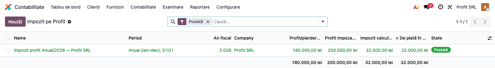
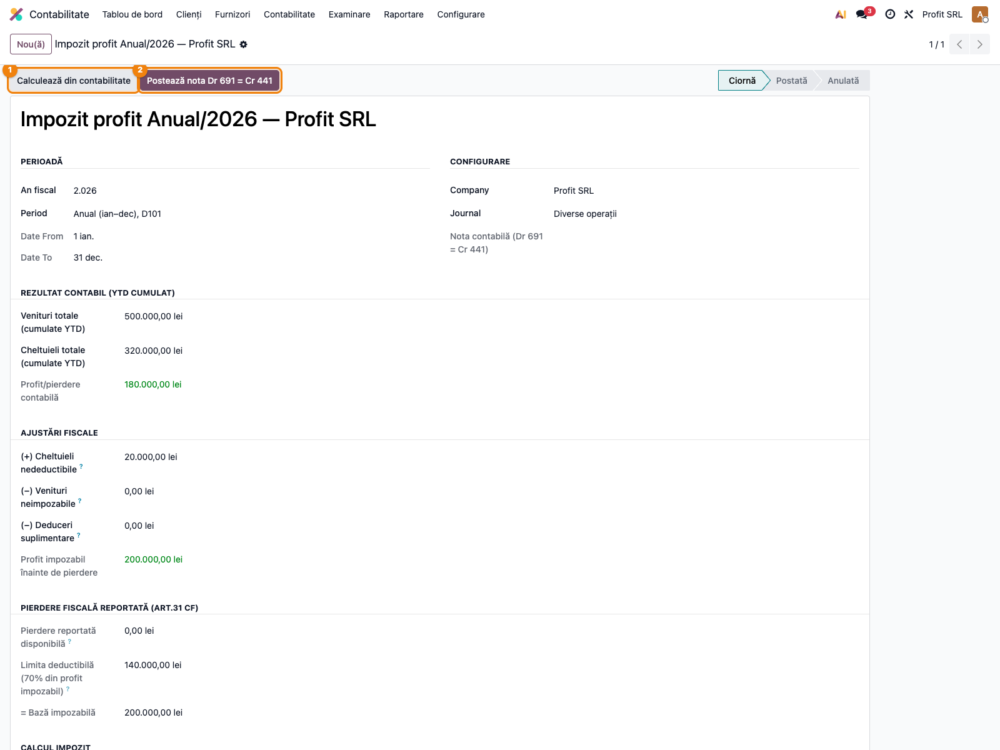
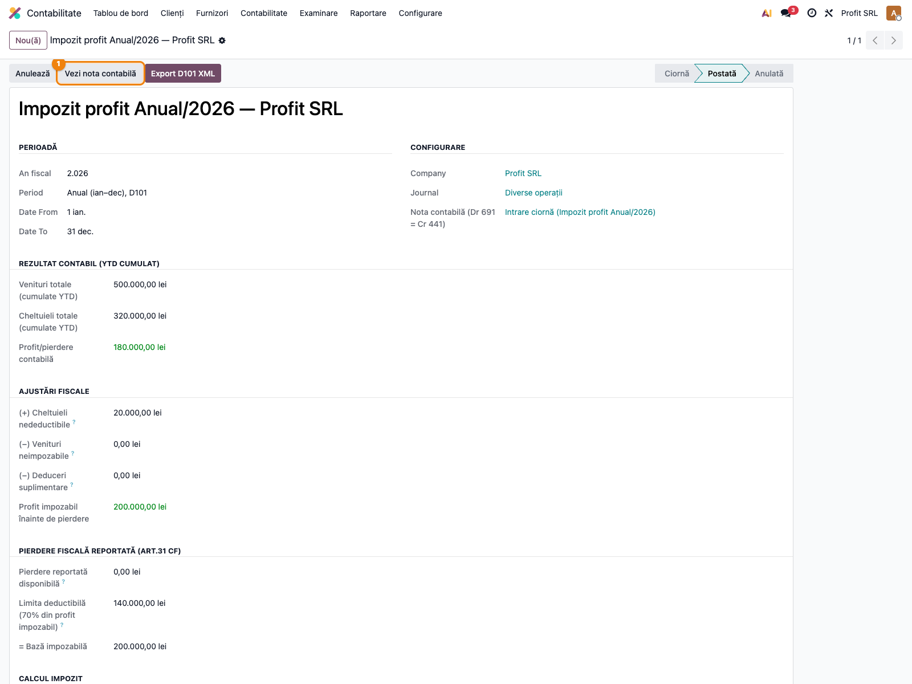
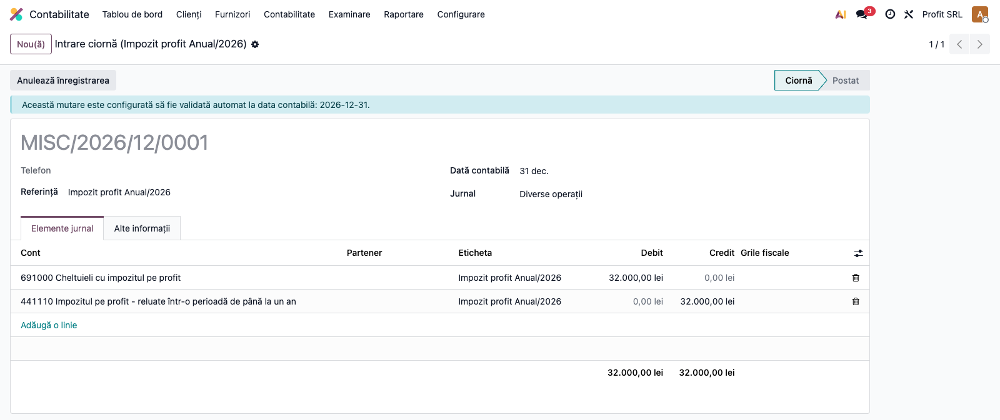
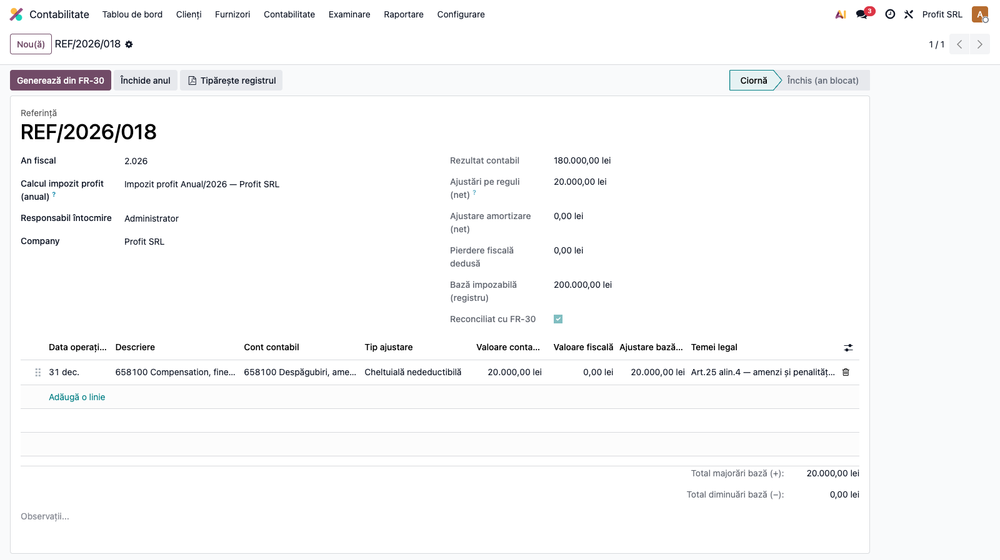

# Fișă Modul: Impozit pe Profit (D100/D101)

**Poziție plan:** B3.3
**Modul:** `l10n_ro_profit_tax`
**FR:** FR-30
**Capitol manual:** Cap 3.5
**Utilizator principal:** Responsabil fiscal, Contabil șef
**Prioritate:** 🟡 Medie (doar firme plătitoare profit)

---

## 1. Scop business

Această fișă descrie utilizarea modulului `l10n_ro_profit_tax` pentru scenariul **Impozit pe Profit (D100/D101)**.
Consultantul folosește documentul pentru reproducerea fluxului în baza demo și
pentru pregătirea capitolului Cap 3.5 din manualul utilizator.

## 2. Bază legală și context

Codul Fiscal Titlul II — 16% impozit profit; ajustări nedeductibile/neimpozabile

## 3. Utilizatori și roluri

Contabil, Responsabil Fiscal

Roluri recomandate pentru testare:
- Administrator funcțional: instalează modulul și verifică meniurile
- Utilizator operațional: rulează fluxul zilnic sau lunar
- Contabil/manager: validează rezultatele contabile și rapoartele

## 4. Conturi și date implicate

691 (cheltuieli impozit profit), 441 (impozit profit de plată)

Date minime pentru demo:
- companie românească cu localizarea contabilă instalată
- perioadă contabilă deschisă
- jurnale și conturi configurate conform scenariului
- documente de test postate, acolo unde fluxul pornește din contabilitate, stocuri, HR sau vânzări

## 5. Configurare inițială

1. Instalați modulul `l10n_ro_profit_tax` pe baza demo.
2. Verificați dependențele cerute de manifest și meniurile nou apărute.
3. Configurați conturile, jurnalele, produsele, partenerii sau parametrii specifici fluxului.
4. Pregătiți un set minim de documente postate pentru perioada de test.
5. Verificați că utilizatorul de test are grupurile de acces necesare.

## 6. Flux de utilizare

### Pasul 1 — Lista calculelor de impozit pe profit

Accesați **Contabilitate → Contabilitate → Impozit pe Profit**. Lista afișează calculele, cu profitul
contabil, profitul impozabil, impozitul calculat și suma de plată per perioadă (T1–T3 cumulate = D100,
Anual = D101).



Apăsați **Nou** și alegeți **anul fiscal**, **perioada** și **jurnalul** de operațiuni diverse.

---

### Pasul 2 — Calculul rezultatului fiscal

Apăsați **Calculează din contabilitate** ①. Modulul preia, cumulat de la 1 ianuarie (YTD):
- **veniturile** și **cheltuielile** din conturile de clasa 7, respectiv 6;
- **ajustările fiscale** configurate per cont (nedeductibile, neimpozabile, deduceri suplimentare);
- baza pentru **creditul de sponsorizare** (contul 6582) și pentru **pierderea reportată** (limita 70%).



Opțional, apăsați **Sugerează deducere pierdere** pentru a aplica FIFO pierderile reportate (în limita
a 70% din profitul impozabil, art.31 CF). Rezultatul: `Bază impozabilă × 16% = Impozit calculat`,
ajustat cu creditul de sponsorizare și plățile anterioare → **De plată**.

---

### Pasul 3 — Postarea notei contabile

Apăsați **Postează nota Dr 691 = Cr 441** ②. Calculul trece în **Postată** și devine readonly, iar
nota se accesează prin **Vezi nota contabilă**.



Nota contabilă înregistrează obligația fiscală:



```
Dr 691   32.000 RON   (Cheltuieli cu impozitul pe profit)
  Cr 441   32.000 RON   (Impozitul pe profit)
```

---

### Pasul 4 — Registrul de evidență fiscală (OMFP 870/2005)

Din **Contabilitate → Contabilitate → Registru de evidență fiscală** creați un registru pentru anul
fiscal, selectați calculul anual (D101) și apăsați **Generează din FR-30**. Registrul listează
ajustările fiscale pe rânduri (cu temei legal) și se **reconciliază** automat cu calculul de impozit.



La **Închide anul**, registrul devine imutabil (retenție legală).

## 7. Legături cu alte module / declarații

| Modul / proces | Rol în flux |
|---|---|
| `l10n_ro_anaf_d100` / `l10n_ro_anaf_d120` | declararea impozitului |
| `account` | venituri, cheltuieli și note 691/441 |
| `l10n_ro_anaf_d107` | credit sponsorizări |
| `l10n_ro_financial_statements` | corelare rezultat fiscal/contabil |

Ce este automat: calcul YTD și ajustări fiscale configurate.
Ce rămâne manual: validarea nedeductibilelor, neimpozabilelor și pierderilor reportate.

## 8. Verificări pentru consultant

- [ ] Modulul se instalează fără erori pe baza demo.
- [ ] Meniurile și acțiunile sunt vizibile pentru rolul de utilizator potrivit.
- [ ] Fluxul poate fi reprodus de la cap la coadă cu date fictive românești.
- [ ] Rezultatul contabil sau operațional corespunde descrierii din plan.
- [ ] Mesajele de eroare sunt clare pentru un utilizator non-tehnic.
- [ ] Exporturile sau rapoartele se descarcă și conțin datele testate.

## 9. Mesaje de eroare frecvente

| Mesaj / simptom | Cauză probabilă | Remediere |
|-----------------|-----------------|-----------|
| Meniul nu este vizibil | Utilizatorul nu are grupurile necesare | Verificați drepturile de acces și reîncărcați aplicațiile |
| Nu se generează linii | Lipsesc documente postate în perioada aleasă | Creați și postați datele de test necesare |
| Cont lipsă sau jurnal lipsă | Configurarea contabilă este incompletă | Completați conturile și jurnalele în setările modulului |
| Perioada este blocată | Data documentului este într-o perioadă închisă | Folosiți o perioadă deschisă sau ajustați lock date-ul în demo |

## 10. Capturi de ecran

Capturile (`readme/screenshots/`) sunt **generate automat** din `tests/test_screenshots.py`
(mixinul `ScreenshotCase` din `l10n_ro_doc_screenshots`, import defensiv), în **limba română**,
pe planul de conturi RO:

1. `01_lista_calcule.png` — Lista calculelor de impozit pe profit.
2. `02_formular_calcul.png` — Formularul de calcul cu rezultatul fiscal (venituri, cheltuieli, ajustări, bază).
3. `03_declaratie_postata.png` — Calcul postat, cu link către nota contabilă.
4. `04_nota_691_441.png` — Nota contabilă generată: Dr 691 = Cr 441.
5. `05_registru_evidenta_fiscala.png` — Registrul de evidență fiscală, reconciliat cu calculul D101.

Regenerare:

```bash
./odoo/odoo-bin -c odoo.conf -d <db> -i l10n_ro_profit_tax,l10n_ro_doc_screenshots \
    --test-tags=fise_screenshots --stop-after-init
```

## 11. Observații pentru manual

În manualul final, păstrați explicația orientată pe activitatea utilizatorului:
ce problemă rezolvă modulul, când se rulează, ce date trebuie pregătite și cum se verifică rezultatul.
