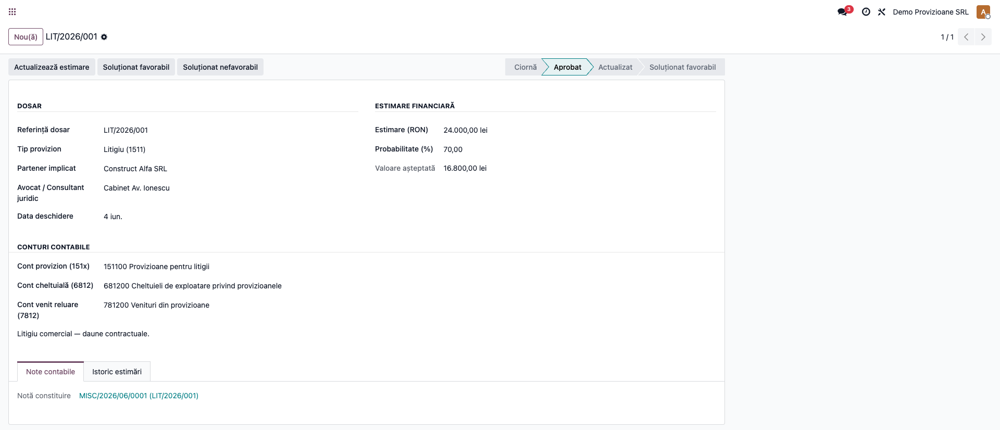
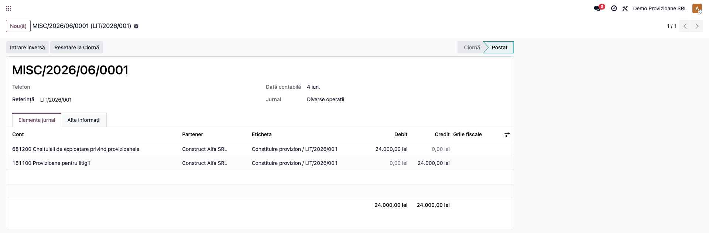
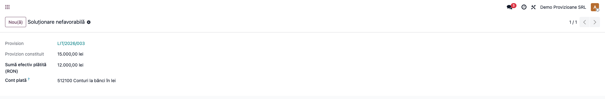
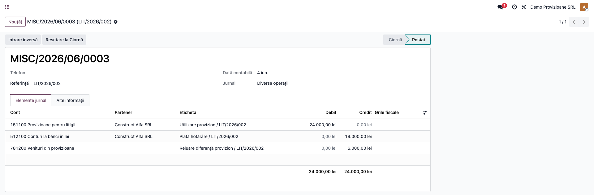
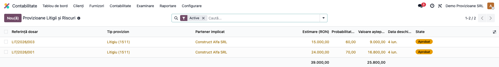

# Fișă Modul: Provizioane Litigii și Riscuri (151)

**Modul:** `l10n_ro_provisions`
**FR:** FR-40
**Utilizator principal:** Contabil, Contabil șef, Departament juridic
**Prioritate:** 🟡 Medie (la apariția unui risc/litigiu și la închiderea de an)

---

## 1. Scop business

Modulul urmărește **provizioanele pentru litigii și alte riscuri** (clasa **151x**) pe dosare, cu un
flux de aprobare, ajustare și soluționare. Fiecare etapă generează automat nota contabilă
corespunzătoare, iar istoricul estimărilor este păstrat pentru justificare la inspecție. Modulul
calculează și **valoarea așteptată** (estimare × probabilitate) și reamintește trimestrial revizuirea
provizioanelor mai vechi de 90 de zile.

## 2. Bază legală și context

OMFP 1802/2014 — Reglementările contabile privind situațiile financiare anuale — tratează
recunoașterea și evaluarea **provizioanelor** (obligații actuale, probabile, estimabile credibil) în
conturile din grupa **151**. Cheltuiala/venitul aferent se reflectă în **6812** „Cheltuieli de
exploatare privind provizioanele" și **7812** „Venituri din provizioane". Recunoașterea și evaluarea
provizioanelor sunt reglementate la pct. 373–381 din OMFP 1802/2014.

> Atenție la regimul fiscal: deductibilitatea provizioanelor diferă pe tipuri (art. 26 din Legea
> 227/2015). De exemplu, provizioanele pentru garanții de bună execuție acordate clienților sunt, în
> condițiile legii, deductibile, în timp ce provizioanele pentru litigii sunt în general nedeductibile.
> De urmărit în registrul de evidență fiscală și de confirmat cu consultantul fiscal.

## 3. Utilizatori și roluri

Contabil / Contabil șef; informații de la departamentul juridic.

Roluri recomandate pentru testare:
- **Contabil** (grupul „Contabil / Accountant") — creează dosarul, îl aprobă, actualizează și
  soluționează (meniul cere `account.group_account_user`).
- **Contabil șef / Manager** — validează estimările și notele generate.

## 4. Conturi și date implicate

Conturi (precompletate automat în funcție de tipul de provizion):

- **151x** — contul de provizion: **1511** litigii, **1512** garanții clienți, **1513** dezafectare,
  **1514** restructurare, **1518** alte provizioane.
- **6812** „Cheltuieli de exploatare privind provizioanele" — debitat la constituire/majorare.
- **7812** „Venituri din provizioane" — creditat la diminuare/reluare.
- **5121** „Conturi la bănci în lei" (sau 401) — creditat la plata efectivă în caz de soluționare nefavorabilă.

Monografia pe etape:
- **Constituire** (Aprobă): **Dr 6812 = Cr 151x** cu estimarea;
- **Majorare** (Actualizare, estimare ↑): **Dr 6812 = Cr 151x** cu diferența;
- **Diminuare** (Actualizare, estimare ↓): **Dr 151x = Cr 7812** cu diferența;
- **Soluționat favorabil** (riscul nu s-a materializat): **Dr 151x = Cr 7812** cu valoarea integrală;
- **Soluționat nefavorabil** (plată): **Dr 151x = Cr 5121** cu suma plătită **+ Cr 7812** cu restul
  neutilizat (dacă plata < provizion).

Date minime pentru demo:
- companie românească cu plan de conturi RO (conturile 151x, 6812, 7812, 5121);
- un partener (reclamant/beneficiar) și, opțional, un avocat;
- estimarea inițială și probabilitatea de materializare.

## 5. Configurare inițială

1. Instalați modulul `l10n_ro_provisions` (dependențe: `account`, `l10n_ro`, `mail`).
2. Verificați că în planul de conturi există grupa **151x** și conturile **6812**, **7812**, **5121**.
   Modulul le precompletează automat pe dosar în funcție de tipul de provizion (le puteți schimba manual).
3. Opțional, activați acțiunea planificată de reamintire a revizuirii (alertă trimestrială pentru
   estimări mai vechi de 90 de zile).

## 6. Flux de utilizare

### Pasul 1 — Deschiderea dosarului de provizion

**Contabilitate → Provizioane Litigii → Nou**. Completați referința dosarului, **tipul de provizion**
(la alegere se precompletează conturile 151x/6812/7812), partenerul implicat, eventual avocatul,
descrierea riscului, **estimarea** și **probabilitatea** (se calculează automat valoarea așteptată).



### Pasul 2 — Aprobarea (constituirea)

Apăsați **„Aprobă"**. Se generează și se postează nota de constituire **Dr 6812 = Cr 151x** cu
estimarea, dosarul trece în starea **Aprobat**, iar în istoric apare constituirea inițială.



### Pasul 3 — Actualizarea estimării (opțional)

Pe parcursul dosarului, **„Actualizează estimare"** deschide un wizard în care introduceți noua
estimare și motivul. Diferența se contabilizează automat: **Dr 6812 = Cr 151x** (majorare) sau
**Dr 151x = Cr 7812** (diminuare), iar modificarea se înregistrează în istoric.

### Pasul 4 — Soluționarea

La închiderea dosarului:
- **„Soluționat favorabil"** (riscul nu s-a materializat) → reluare integrală **Dr 151x = Cr 7812**;
- **„Soluționat nefavorabil"** → wizard în care indicați **suma efectiv plătită** și contul de plată
  (implicit 5121). Se generează **Dr 151x = Cr 5121** (plata) **+ Cr 7812** pentru diferența neutilizată.





### Pasul 5 — Evidența dosarelor

Lista **Contabilitate → Provizioane Litigii** afișează dosarele cu tipul, partenerul, estimarea,
probabilitatea, valoarea așteptată și starea (implicit filtrate pe cele **Active** — Aprobat/Actualizat).
Pe fiecare dosar, fila „Note contabile" leagă nota de constituire și nota de soluționare, iar fila
„Istoric estimări" păstrează toate modificările cu motivație.



### Note de monografie și raportare

- Constituire/Majorare: **Dr 6812 = Cr 151x**; Diminuare/Reluare favorabilă: **Dr 151x = Cr 7812**;
- Soluționare nefavorabilă: **Dr 151x = Cr 5121** (plată) **+ Cr 7812** (rest neutilizat);
- toate notele sunt echilibrate și legate de dosar; istoricul estimărilor susține justificarea;
- operațiunile mișcă doar conturi de clasă 1/5/6/7 — **nu afectează TVA**;
- impact fiscal: vezi nota de la secțiunea 2 (deductibilitate diferențiată per tip de provizion).

## 7. Legături cu alte module / declarații

| Modul / proces | Rol în flux | Tip legătură |
|---|---|---|
| `account` | notele contabile pe fiecare etapă | dependență (manifest) |
| `l10n_ro` | plan de conturi RO (151x/6812/7812/5121) | dependență (manifest) |
| `mail` | urmărire (chatter), activități și alerta trimestrială de revizuire | dependență (manifest) |
| Registrul de evidență fiscală / impozit pe profit | tratarea fiscală a provizioanelor (deductibil/nedeductibil) | corelare manuală |

Ce este automat: precompletarea conturilor pe tip, notele contabile pe fiecare etapă, valoarea
așteptată, istoricul estimărilor și alerta de revizuire.
Ce rămâne manual: deschiderea și aprobarea dosarului, deciziile de actualizare/soluționare, suma
efectiv plătită și tratamentul fiscal.

## 8. Verificări pentru consultant

- [ ] Modulul se instalează fără erori pe baza demo.
- [ ] La alegerea tipului de provizion se precompletează conturile 151x/6812/7812.
- [ ] Aprobarea generează nota Dr 6812 = Cr 151x și trece dosarul în „Aprobat".
- [ ] Actualizarea în plus/minus generează corect majorarea/diminuarea și o linie în istoric.
- [ ] Soluționarea favorabilă reia integral provizionul (Dr 151x = Cr 7812).
- [ ] Soluționarea nefavorabilă cu plată parțială produce Dr 151x = Cr 5121 + Cr 7812 (rest).
- [ ] Suma plătită mai mare decât provizionul este blocată cu mesaj clar.
- [ ] Valoarea așteptată = estimare × probabilitate.

## 9. Mesaje de eroare frecvente

| Mesaj / simptom | Cauză probabilă | Remediere |
|-----------------|-----------------|-----------|
| „Configurați contul de provizion (151x) și contul de cheltuială (6812)." | Conturile nu au fost găsite/precompletate | Alegeți tipul de provizion sau setați manual conturile pe dosar |
| „Dosarul nu este în stare Ciornă." | Aprobare cerută pe un dosar deja aprobat | Folosiți „Actualizează" sau „Soluționează" |
| „Estimarea nouă este identică cu cea curentă." | Actualizare fără modificarea sumei | Introduceți o estimare diferită |
| „Suma plătită (… RON) depășește provizionul constituit (… RON)." | Plata indicată > provizion | Corectați suma sau majorați întâi provizionul |
| „Doar dosarele în stare Ciornă pot fi anulate." | Anulare pe un dosar aprobat | Soluționați dosarul (favorabil/nefavorabil) în loc să-l anulați |

## 10. Capturi de ecran

Capturile (`readme/screenshots/`) sunt **generate automat** din `tests/test_screenshots.py`
(mixinul `ScreenshotCase` din `l10n_ro_doc_screenshots`, import defensiv), în **limba română**,
pe planul de conturi RO (`setup_country("ro")`):

1. `01_formular_provizion.png` — dosarul de provizion (date, conturi, estimare), aprobat.
2. `02_nota_constituire.png` — nota de constituire (Dr 6812 / Cr 1511).
3. `03_wizard_solutionare.png` — wizardul de soluționare nefavorabilă (suma plătită, contul).
4. `04_nota_solutionare.png` — nota de soluționare nefavorabilă (Dr 1511 = Cr 5121 + Cr 7812).
5. `05_lista_provizioane.png` — lista provizioanelor.

Regenerare:

```bash
./odoo/odoo-bin -c odoo.conf -d <db> -i l10n_ro_provisions,l10n_ro_doc_screenshots \
    --test-tags=fise_screenshots --stop-after-init
```

## 11. Observații pentru manual

În manualul final, păstrați explicația orientată pe activitatea utilizatorului: când se constituie un
provizion (obligație actuală, probabilă, estimabilă), cum se actualizează estimarea pe parcurs și cum
se soluționează (favorabil = reluare; nefavorabil = plată + reluarea diferenței). Subliniați istoricul
estimărilor (justificare la control) și **regimul fiscal diferențiat** al provizioanelor (deductibil
doar în cazurile prevăzute la art. 26 Cod fiscal), de corelat cu registrul de evidență fiscală.
