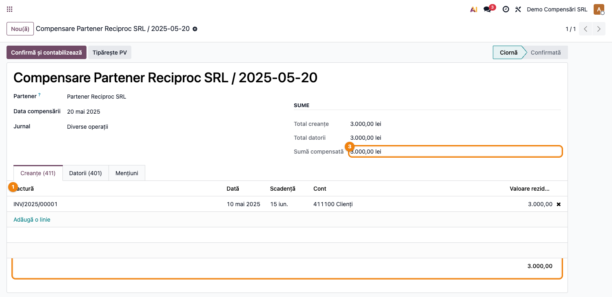
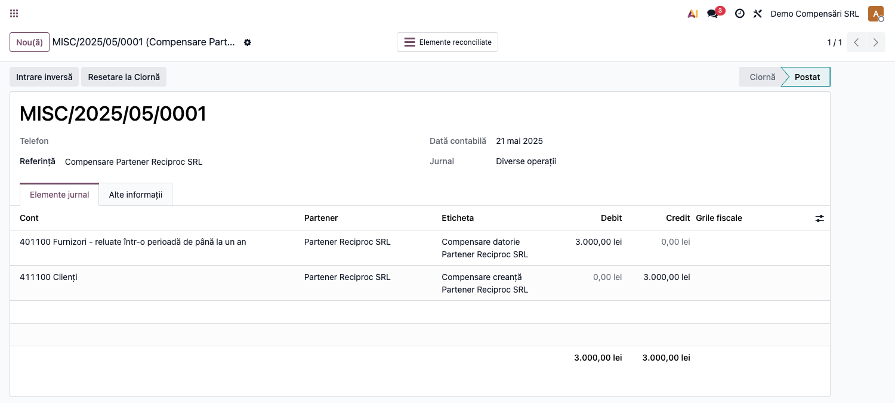
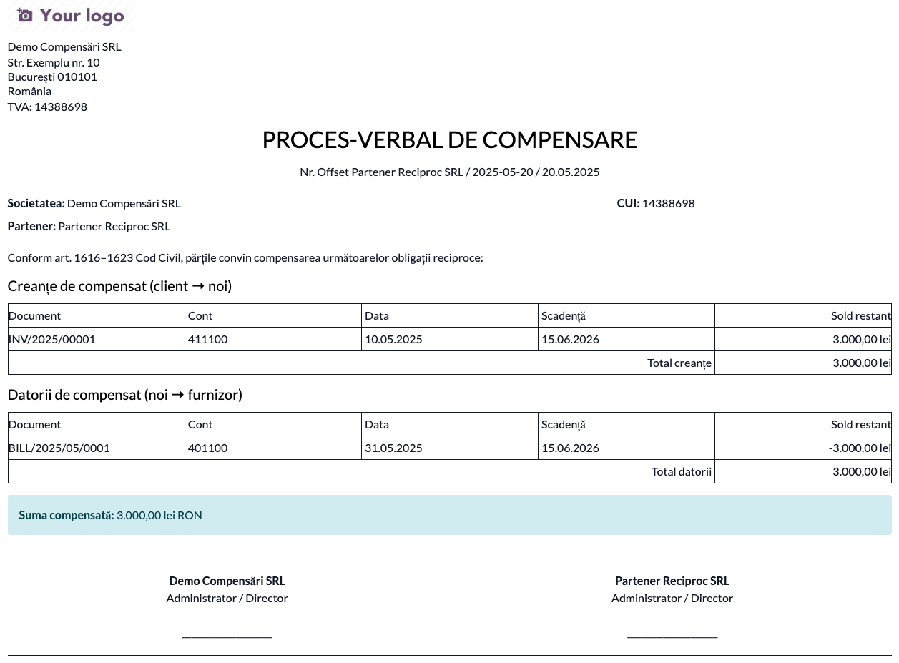
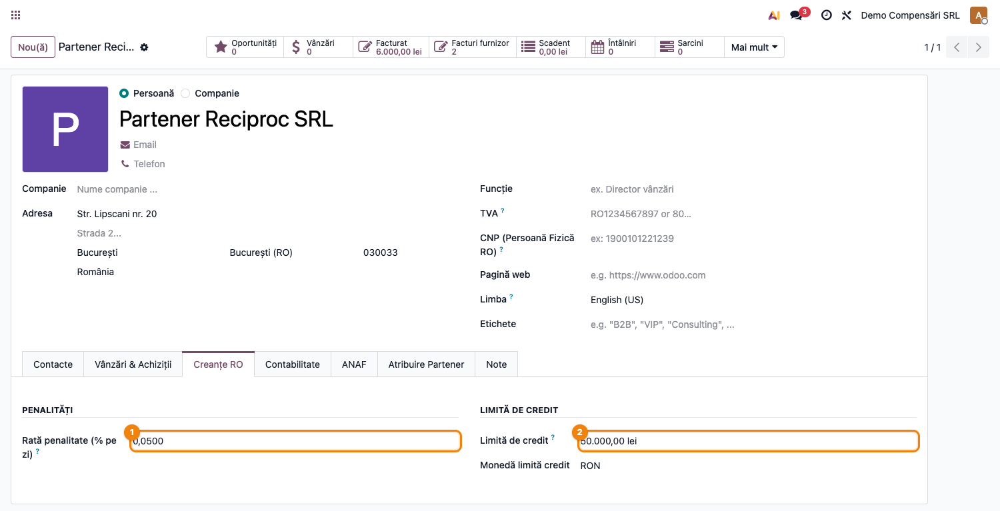
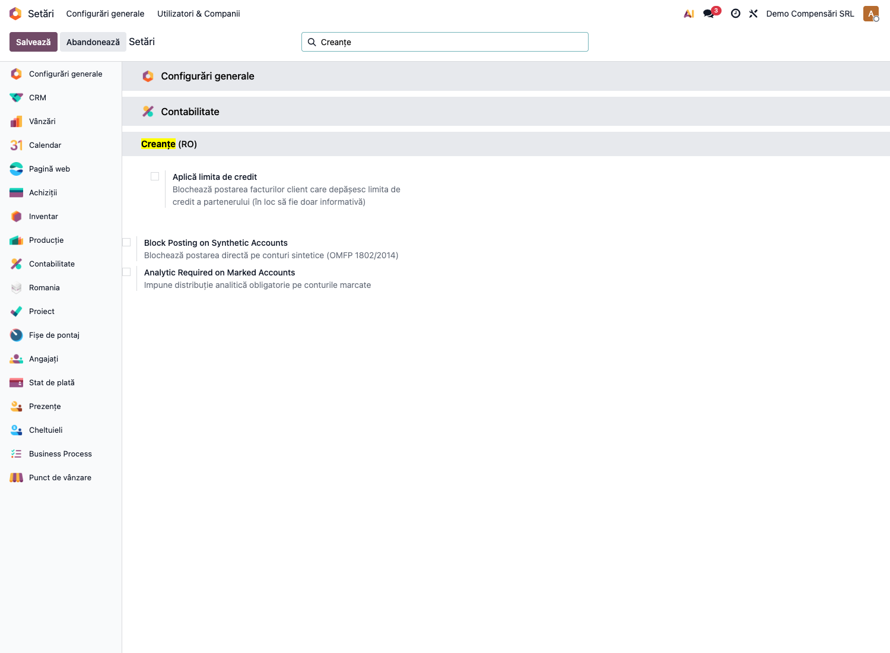

# Fișă Modul: Creanțe și Datorii Extinse

**Modul:** `l10n_ro_receivables_enhanced`
**FR:** FR-29
**Capitol manual:** Cap 9.4
**Utilizator principal:** Contabil, Responsabil creanțe/recuperare
**Prioritate:** Medie

---

## 1. Scop business

Modulul extinde gestiunea creanțelor și datoriilor cu trei elemente cerute în practica RO:
**compensarea client-furnizor** cu proces-verbal, **penalitățile de întârziere** (Legea 72/2013)
și parametri de **limită de credit** per partener. Consultantul îl prezintă ca instrument de
stingere a soldurilor reciproce și de control al expunerii pe client.

## 2. Bază legală și context

- **Legea 72/2013** — combaterea întârzierii la plată; penalități de întârziere între profesioniști.
- Compensarea creanțe/datorii reciproce — practică uzuală, formalizată prin proces-verbal de
  compensare semnat de ambele părți.

## 3. Utilizatori și roluri

- Contabil: creează compensarea, selectează liniile reciproce, confirmă nota.
- Responsabil creanțe: urmărește penalitățile și limita de credit per partener.
- Contabil șef: validează procesul-verbal și nota de compensare.

## 4. Date implicate

- compensare (`l10n.ro.partner.compensation`): partener, dată, jurnal, linii creanțe/datorii;
- linii contabile deschise (creanțe 411 / datorii 401) ale aceluiași partener;
- parametri partener: rata penalității, limita de credit (cu monedă).

## 5. Configurare inițială

1. Instalați `l10n_ro_receivables_enhanced`.
2. Pe parteneri, completați după caz:
   - **Rata penalității** (`l10n_ro_penalty_rate`) — pentru calculul penalităților de întârziere;
   - **Limita de credit** (`l10n_ro_credit_limit`) și moneda asociată.
3. Verificați jurnalul folosit pentru nota de compensare (tip „diverse").

## 6. Flux de utilizare

### Compensare client-furnizor

1. Creați o **compensare** pentru partenerul care e simultan client și furnizor.
2. Selectați **liniile de creanță** (411) și **liniile de datorie** (401) deschise.
3. Modulul calculează `compensation_amount = min(total creanțe, total datorii)`.
4. **Confirmați** → se generează nota contabilă de compensare și se reconciliază liniile.
5. **Tipăriți procesul-verbal** (PDF) pentru semnătura părților.
6. La nevoie, **anulați** / readuceți în ciornă.

**Compensarea** cu liniile de creanțe (411) și datorii (401) ale aceluiași partener și suma
compensată = `min(total creanțe, total datorii)`:

**Nota contabilă** generată la confirmare (Dr 401 = Cr 411 pentru suma compensată):

**Procesul-verbal de compensare** (PDF) cu liniile compensate și suma, pentru semnătura părților:

### Penalități și limită de credit

- Penalitățile se calculează pe baza ratei configurate pe partener (Legea 72/2013).
- Limita de credit per partener servește la monitorizarea expunerii.

Parametrii se completează pe partener, în fila **Creanțe RO**:

### Blocaj opt-in la depășirea limitei de credit (FR-29)

Implicit, limita de credit este doar **informativă** (monitorizare expunere). Pentru a **bloca efectiv**
postarea facturilor care depășesc limita, activați în **Setări → Configurări generale**, secțiunea
**Creanțe (RO)** (folosiți caseta de căutare cu „Creanțe"), opțiunea **Aplică limita de credit** ①.

Cu opțiunea activă, postarea unei facturi care ar duce soldul clientului peste limita configurată este
oprită cu un mesaj clar; lăsată dezactivată, limita rămâne doar un reper de monitorizare.

## 7. Reguli funcționale

| Situație | Tratament |
|---|---|
| Compensare confirmată | notă contabilă + reconcilierea liniilor 411/401 |
| Sumă compensare | `min(total creanțe selectate, total datorii selectate)` |
| Proces-verbal | PDF cu liniile compensate și suma |
| Anulare compensare | reluarea liniilor, ștergerea/anularea notei |
| Penalitate întârziere | rată per partener × zile întârziere (Legea 72/2013) |

## 8. Scenarii de test pentru consultant

| ID | Scenariu | Rezultat așteptat |
|---|---|---|
| RE-01 | Partener client+furnizor, compensare egală | notă contabilă, ambele linii reconciliate |
| RE-02 | Creanțe > datorii | compensare = total datorii; rest creanță rămâne |
| RE-03 | Tipărire PV | PDF cu liniile și suma compensată |
| RE-04 | Anulare compensare | liniile redevin nereconciliate |

## 9. Legături cu alte module / declarații

| Modul | Rol |
|---|---|
| `account` | liniile contabile (creanțe/datorii) și reconcilierea |
| `l10n_ro_partner_ledger_currency` | fișa partener în valută, complementar urmăririi creanțelor |

## 10. Verificări pentru consultant

- [ ] Compensarea selectează doar linii ale aceluiași partener.
- [ ] Suma compensată = minimul dintre creanțe și datorii.
- [ ] Nota contabilă reconciliază corect liniile.
- [ ] Procesul-verbal listează liniile compensate.
- [ ] Rata penalității și limita de credit sunt configurate unde e cazul.

## 11. Mesaje de eroare frecvente

| Simptom | Cauză | Remediere |
|---|---|---|
| Compensare fără sumă | nu sunt selectate atât creanțe cât și datorii | selectați linii pe ambele părți |
| Notă neechilibrată | linii din parteneri diferiți | folosiți doar liniile aceluiași partener |
| PV gol | compensare în ciornă | confirmați compensarea întâi |

## 12. Capturi de ecran

| # | Fișier | Conținut |
|---|--------|----------|
| 1 | `screenshots/01_compensare_form.png` | Compensare — linii creanțe (411) / datorii (401) și suma compensată |
| 2 | `screenshots/02_nota_compensare.png` | Nota contabilă de compensare (Dr 401 = Cr 411) |
| 3 | `screenshots/03_proces_verbal.png` | Proces-verbal de compensare (PDF) cu liniile și suma |
| 4 | `screenshots/04_partener_config.png` | Partener — rata penalității și limita de credit (fila Creanțe RO) |
| 5 | `screenshots/05_setare_blocaj_credit.png` | Setare — blocaj opt-in postare peste limita de credit (FR-29) |
