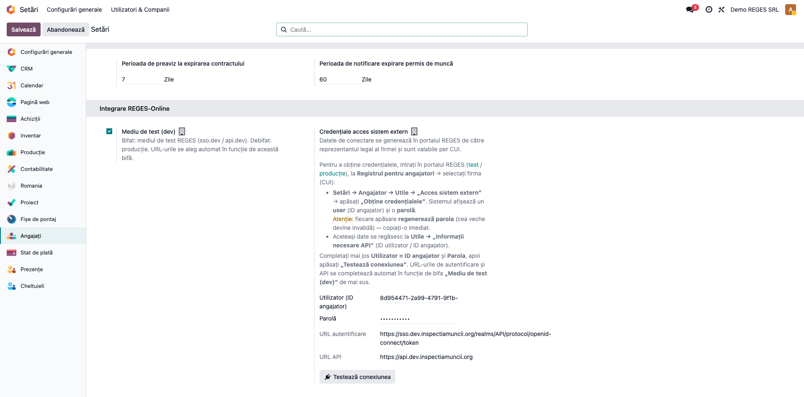
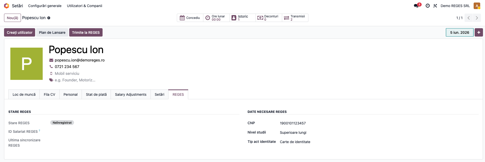
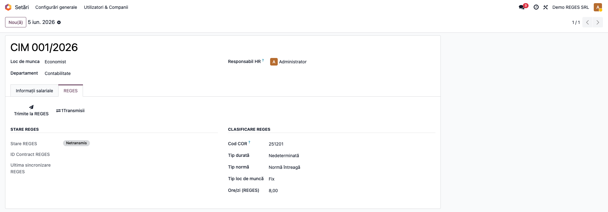
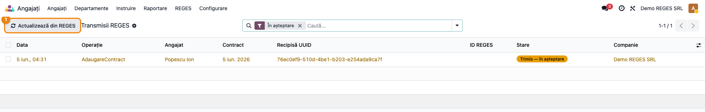
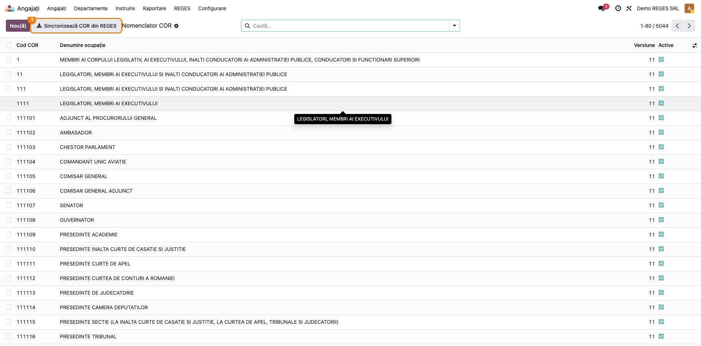

# Fișă Modul: Integrare REGES-Online (Registrul General de Evidență a Salariaților)

**Poziție plan:** B7.1
**Modul:** `l10n_ro_reges`
**FR:** FR-45
**Capitol manual:** Cap 10.2
**Utilizator principal:** Responsabil resurse umane / Inspector personal
**Prioritate:** 🔴 Ridicată (obligație legală pentru orice angajator cu salariați)

---

## 1. Scop business

Modulul transmite electronic către **REGES-Online** (sistemul Inspecției Muncii care a înlocuit
REVISAL) datele de personal: înregistrarea salariaților, încheierea și modificarea contractelor de
muncă, suspendările și încetările. Transmiterea se face direct din Odoo, prin API-ul REGES (acces
„din sistem extern" per CUI), cu confirmare (recipisă) și urmărirea stării fiecărei transmisii.

Consultantul folosește documentul pentru reproducerea fluxului pe o bază demo cu plan de conturi RO
și pentru pregătirea capitolului Cap 10.2 din manualul utilizator.

## 2. Bază legală și context

- **REGES-Online** — Registrul General de Evidență a Salariaților, administrat de Inspecția Muncii,
  înlocuiește REVISAL. Toți angajatorii sunt obligați să transmită electronic datele de personal.
  Obligația ținerii registrului de evidență a salariaților are temei în **Codul muncii (Legea
  53/2003), art. 34**; modul de completare și transmitere prin REGES-Online este reglementat prin
  hotărâre de guvern (verificați actul normativ în vigoare la data implementării).
- Termen legal pentru **înregistrarea salariatului / contractului**: cel târziu în ziua anterioară
  începerii activității. Modificările, suspendările și încetările se transmit la termenele prevăzute
  de lege pentru fiecare eveniment.
- Nerespectarea termenelor se sancționează cu **amendă 5.000–8.000 RON per salariat** neraportat.
- Acest modul **nu generează note contabile** — este un modul de raportare către o autoritate.

## 3. Utilizatori și roluri

Operatorul de resurse umane care administrează angajații și contractele.

Grupuri de acces livrate de modul:
- **Utilizator REGES** (`group_reges_user`) — vede transmisiile și fișele.
- **Administrator REGES** (`group_reges_manager`) — configurează credențialele, rulează sincronizarea
  COR și operațiunile manuale.

Roluri recomandate la testare:
- Administrator funcțional: instalează modulul, configurează accesul în Setări, sincronizează COR.
- Operator HR: înregistrează angajați și contracte, urmărește confirmările.

## 4. Date implicate (nu conturi contabile)

Datele minime pe care REGES le cere și pe care modulul le trimite:

- **Angajat:** CNP, nume, prenume, data nașterii, **adresa de domiciliu** (obligatorie), naționalitate
  (valoarea exactă din nomenclator, ex. „România"), tip act de identitate.
- **Contract:** cod **COR** (ocupația), salariu, data începerii, tip durată (Nedeterminată/Determinată),
  tip normă (Normă întreagă/Timp parțial), tip loc de muncă (**Fix/Mobil**), ore/zi.
- **Credențiale de acces:** ID angajator (UUID) și parolă, generate în portalul REGES — vezi
  [OBTINERE_ACCES.md](OBTINERE_ACCES.md).

Date minime pentru demo:
- companie cu **plan de conturi RO** activ (altfel secțiunea REGES nu apare — vezi nota de la final);
- cel puțin un angajat cu CNP și adresă privată completate;
- un contract de muncă cu cod COR și salariu;
- credențiale REGES de mediu de test (sau lăsați gol și parcurgeți doar fluxul UI).

## 5. Configurare inițială

1. Instalați modulul `l10n_ro_reges` pe baza demo (companie cu localizare RO).
2. Mergeți la **Setări → Angajați → „Integrare REGES-Online"**.
3. Bifați **„Mediu de test (dev)"** pentru încercări (debifat = producție); URL-urile de autentificare
   și API se completează automat în funcție de bifă.
4. Completați **Utilizator (ID angajator)** și **Parola** obținute din portalul REGES
   (Setări → Utile → „Acces sistem extern → Obține credențialele").
5. Apăsați **„Testează conexiunea"** — la succes apare „Conexiune REGES reușită! Angajator: …".
6. Mergeți la **Angajați → REGES → Nomenclator COR** și apăsați **„Sincronizează COR din REGES"** pentru a
   importa ocupațiile (necesare la contracte).

## 6. Flux de utilizare

### Pasul 1 — Configurarea accesului REGES

În **Setări → Angajați → „Integrare REGES-Online"** bifați mediul, introduceți ID angajator + parola
și testați conexiunea. URL-urile (autentificare OpenID pe realm `API` + API) sunt afișate read-only.



### Pasul 2 — Înregistrarea salariatului

Pe fișa angajatului (**Angajați → un angajat**), completați CNP, nivel studii, tip act de identitate
și **adresa privată** (domiciliul). În fila **REGES** verificați starea, apoi apăsați **„Trimite la
REGES"**. Modulul trimite operația `InregistrareSalariat` și obține o **recipisă**; starea trece în
„în așteptare", iar după confirmare în „înregistrat", cu ID-ul REGES completat. Butonul **„Transmisii"**
din zona de smart buttons deschide istoricul transmisiilor angajatului.



> Modificările ulterioare ale câmpurilor urmărite (salariu, funcție, normă etc.) declanșează automat
> o transmitere de tip `ModificareSalariat`. Radierea se face cu **„Radiere REGES"** (`RadiereSalariat`).

### Pasul 3 — Transmiterea contractului

Pe contractul de muncă (`hr.version`), în fila **REGES**, completați **codul COR**, tipul de durată,
norma, **tipul locului de muncă (Fix/Mobil)** și orele/zi, apoi apăsați **„Trimite la REGES"**
(`AdaugareContract`). Pentru evenimente ulterioare folosiți **„Suspendare REGES"** (cu perioada și
temeiul) și **„Încetare REGES"** (cu temeiul legal și data încetării). Starea contractului urmărește
ciclul: activ → suspendat → încetat.

> Butoanele **„Suspendare REGES"** și **„Încetare REGES"** apar doar **după** ce contractul este
> „Activ în REGES" (confirmat); pe un contract încă netransmis se vede doar „Trimite la REGES".



### Pasul 4 — Urmărirea transmisiilor și confirmărilor

**Angajați → REGES → Transmisii** listează toate mesajele trimise: operația, angajatul/contractul,
**recipisa (responseId)**, starea (trimis / confirmat / eroare) și payload-ul. Apăsați
**„Actualizează din REGES"** pentru a interoga coada de rezultate (REGES răspunde asincron, în câteva
secunde); mesajele trec din „trimis" în „confirmat" sau „eroare". Pe mesajele cu eroare există
**„Retrimitere"** după corectarea datelor.



### Pasul 5 — Nomenclatorul COR

**Angajați → REGES → Nomenclator COR** conține ocupațiile importate din REGES (cca 5044 în versiunea
curentă). Butonul **„Sincronizează COR din REGES"** reîmprospătează lista. Codul COR de pe contract
trebuie să existe în acest nomenclator.



### Note de transmitere și confirmare (în loc de monografie)

- Fiecare trimitere produce o **recipisă** (`responseId`) — dovada primirii, NU a înregistrării.
- Înregistrarea efectivă vine **asincron**, prin coada de rezultate: `SUCCES` (cu ID-ul REGES al
  entității) sau `FAIL` (cu motivul). Polling-ul (manual sau prin cron) actualizează starea.
- Operațiuni transmise: `InregistrareSalariat`, `ModificareSalariat`, `RadiereSalariat`,
  `AdaugareContract`, `SuspendareContract`, `IncetareContract`, `RadiereContract`.

## 7. Legături cu alte module / declarații

| Modul / proces | Rol în flux | Tip legătură |
|---|---|---|
| `hr_payroll` | angajați și contracte (`hr.version`) de transmis | dependență (manifest) |
| `l10n_ro` | plan de conturi RO (condiția ca secțiunea REGES să fie vizibilă) | dependență (manifest) |
| `l10n_ro_config` (OCA) | ascunde câmpurile `l10n_ro_*` pe companii fără plan RO | condiționare UI |
| `l10n_ro_anaf_d112` (FR-44) | D112 folosește aceleași contracte; REGES asigură sincronizarea cu realitatea | corelație |
| portalul REGES (Inspecția Muncii) | generarea credențialelor și a extraselor/rapoartelor | extern |

**Ce este automat:** transmiterea la apăsarea butonului, modificarea automată la schimbarea câmpurilor
urmărite, polling-ul confirmărilor prin cron, sincronizarea COR.
**Ce rămâne manual / pe portal:** generarea credențialelor de acces, **descărcarea extraselor /
adeverințelor / rapoartelor** (vezi limitarea de la final), gestiunea propunerilor de detașare/mutare.

## 8. Verificări pentru consultant

- [ ] Modulul se instalează fără erori pe baza demo (companie cu plan RO).
- [ ] Secțiunea „Integrare REGES-Online" apare în Setări → Angajați și câmpurile sunt editabile.
- [ ] „Testează conexiunea" întoarce succes cu credențiale de test valide.
- [ ] „Sincronizează COR din REGES" populează nomenclatorul de ocupații.
- [ ] Un angajat cu CNP + adresă poate fi trimis (`Trimite la REGES`) → stare „în așteptare".
- [ ] După „Actualizează din REGES", angajatul/contractul trece în „înregistrat"/„activ" cu ID REGES.
- [ ] Un contract cu cod COR valid se transmite, se poate suspenda și înceta.
- [ ] Mesajele cu eroare arată motivul și pot fi retrimise după corecție.

## 9. Mesaje de eroare frecvente

| Mesaj / simptom | Cauză probabilă | Remediere |
|-----------------|-----------------|-----------|
| Secțiunea „Integrare REGES-Online" nu apare în Setări | Compania activă nu are plan de conturi RO (ascunsă de `l10n_ro_config`) | Comutați pe o companie cu plan de conturi RO |
| „Credentialele REGES nu sunt configurate pentru compania …" | Lipsesc ID angajator / parola | Completați-le în Setări → REGES-Online (din portal) |
| „Valoare câmp AuthorId incorectă!" | ID angajator greșit (nu corespunde token-ului) | Folosiți ID-ul angajator din portal (Utile → Informații API) |
| „Naționalitate salariat incorectă!" | Naționalitate într-un format neacceptat | Folosiți valoarea din nomenclator (ex. „România"); modulul o trimite automat pentru RO |
| „Completați adresa privată (domiciliul) angajatului …" | Lipsește adresa de domiciliu | Completați adresa privată pe fișa angajatului |
| Contractul rămâne „în așteptare" mult timp | REGES procesează asincron / rezultatul nu a fost încă citit | Apăsați „Actualizează din REGES" sau așteptați cron-ul de polling |
| „Contractul nu este în starea Activ sau Reactivat!" (la încetare) | Contractul e suspendat sau deja încetat | Aduceți contractul în stare activă înainte de încetare |

## 10. Capturi de ecran

Capturile (`readme/screenshots/`) sunt **generate automat** din `tests/test_screenshots.py`
(mixinul `ScreenshotCase` din `l10n_ro_doc_screenshots`, import defensiv), în **limba română**, pe o
companie cu plan de conturi RO:

1. `01_config_setari.png` — Setări → „Integrare REGES-Online" (mediu, credențiale, test conexiune).
2. `02_angajat_reges.png` — fila REGES pe fișa angajatului (stare, date necesare, buton Trimite).
3. `03_contract_reges.png` — fila REGES pe contract (COR, normă, loc de muncă, butoane).
4. `04_transmisii.png` — lista Transmisii REGES (stări + buton „Actualizează din REGES").
5. `05_nomenclator_cor.png` — Nomenclatorul COR (buton de sincronizare).

Regenerare:

```bash
./odoo/odoo-bin -c odoo.conf -d <db> -i l10n_ro_reges,l10n_ro_doc_screenshots \
    --test-tags=fise_screenshots --stop-after-init
```

## 11. Observații pentru manual

- Păstrați explicația orientată pe activitatea utilizatorului HR: ce se transmite, când (termenele
  legale), cum se confirmă și ce se face la eroare.
- Subliniați **obligativitatea legală** și termenele (amendă per salariat neraportat).
- **Limitare cunoscută:** descărcarea **extraselor / adeverințelor de vechime / rapoartelor** se face
  momentan **din portalul REGES** („Extrase"), nu din Odoo — schema API o prevede (`CerereExtras`),
  dar endpoint-ul nu este expus pe mediul de test. De reluat când REGES îl expune sau pe producție.
- **Mediu:** integrarea funcționează pe **Odoo Enterprise**, pe companii cu plan de conturi RO.
