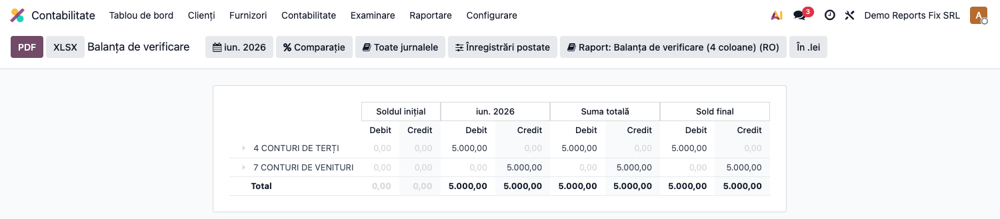

# Fișă Modul: Balanță de verificare RO — fixuri conturi bifuncționale

**Poziție plan:** C15
**Modul:** `l10n_ro_reports_fix`
**FR:** FR-43
**Capitol manual:** Cap 11.6
**Utilizator principal:** Contabil șef, Consultant raportare
**Prioritate:** 🟢 Standard

---

## 1. Scop business

Modulul corectează raportarea balanței RO pentru conturi bifuncționale și ierarhii de grupuri, astfel încât soldurile debitoare/creditoare să fie afișate corect.

## 2. Bază legală și context

Balanța de verificare este document contabil esențial pentru verificarea lunară și anuală. Pentru România sunt importante coloanele de sold inițial, rulaj și sold final D/C.

## 3. Utilizatori și roluri

- Contabil: rulează balanța.
- Contabil șef: validează totalurile.
- Auditor: verifică soldurile conturilor bifuncționale.

## 4. Date implicate

- conturi contabile;
- solduri inițiale;
- rulaje lunare;
- conturi bifuncționale precum 121, 512, 401/411 în situații specifice.

## 5. Configurare inițială

1. Instalați `l10n_ro_reports_fix`.
2. Verificați dependența `l10n_ro_reports`.
3. Pregătiți o perioadă cu rulaje pe conturi bifuncționale.
4. Verificați accesul la rapoartele contabile.

## 6. Flux de utilizare

### Pasul 1 — Accesare

Meniu: `Contabilitate → Raportare → Rapoarte contabile / rapoarte Odoo corectate de localizare`.

1. Deschideți balanța de verificare RO.
2. Selectați perioada.
3. Verificați soldurile D/C pe conturi bifuncționale.
4. Verificați totalurile pe grupe.
5. Exportați sau tipăriți raportul.

## 7. Legături cu alte module / declarații

| Modul / proces | Rol în flux |
|---|---|
| `account_reports` | rapoarte financiare Enterprise |
| `l10n_ro_journal_reports` | rapoarte contabile RO |
| `l10n_ro_financial_statements` | situații financiare anuale |
| Balanță de verificare | validarea conturilor bifuncționale |

Ce este automat: corectarea afișării conturilor bifuncționale în rapoarte.
Ce rămâne manual: validarea soldurilor în balanță și rapoarte legale.

## 8. Verificări pentru consultant

- [ ] Conturile bifuncționale apar pe partea corectă.
- [ ] Totalurile de grup sunt recalculate corect.
- [ ] Raportul se corelează cu General Ledger.
- [ ] Exportul este inteligibil pentru contabil.

## 9. Mesaje frecvente

| Simptom | Cauză probabilă | Remediere |
|---------|-----------------|-----------|
| Sold pe partea greșită | Modulul fix nu este instalat sau raportul vechi este folosit | Reîncărcați raportul RO |
| Total grup incorect | Cache/filtre raport | Recalculați raportul și verificați filtrele |

## 9. Capturi de ecran

**Balanță de verificare RO — coloane Sold inițial, Rulaj, Sold total, Sold final (Debit/Credit) ①:**

| # | Fișier | Conținut |
|---|--------|----------|
| 1 | `screenshots/01_balanta_ro_5_coloane.png` | Balanță verificare RO ① — conturi clasa 4 și 7, solduri finale corecte pe coloanele Debit/Credit |
