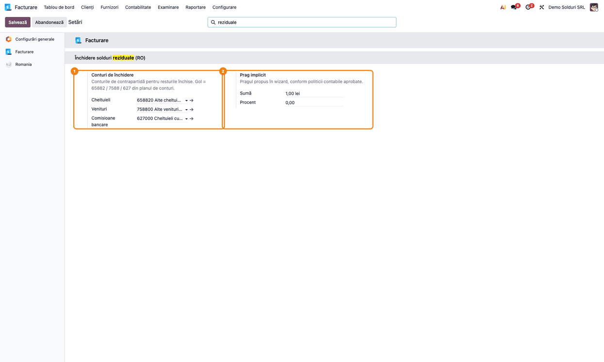
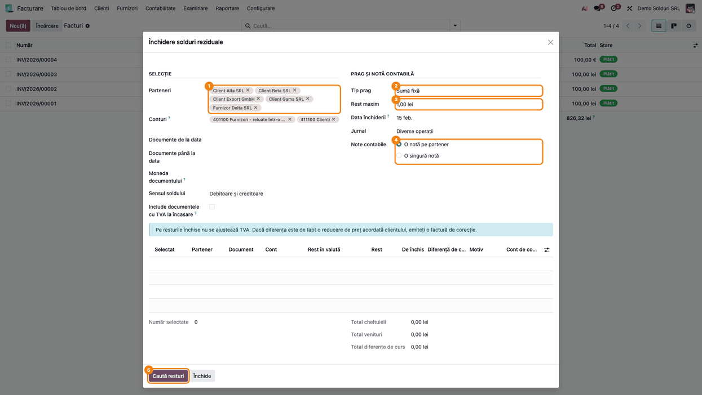
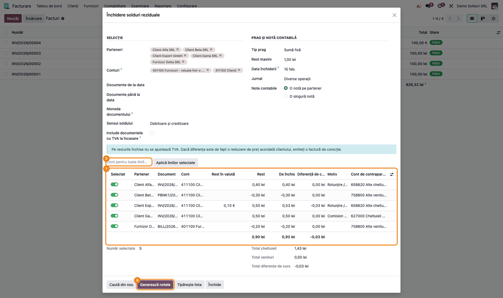
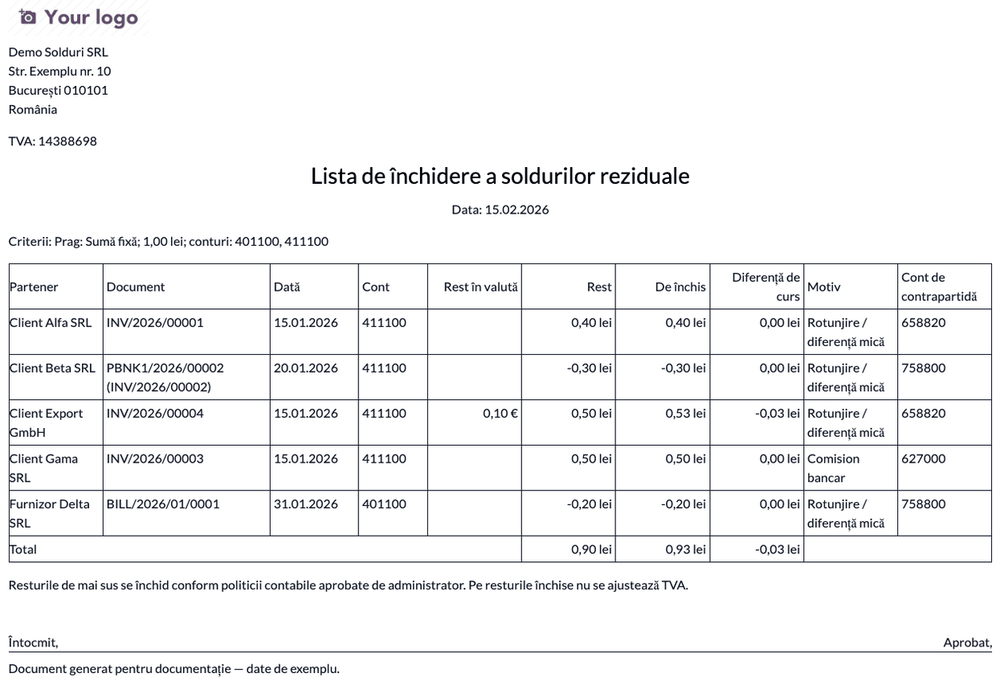
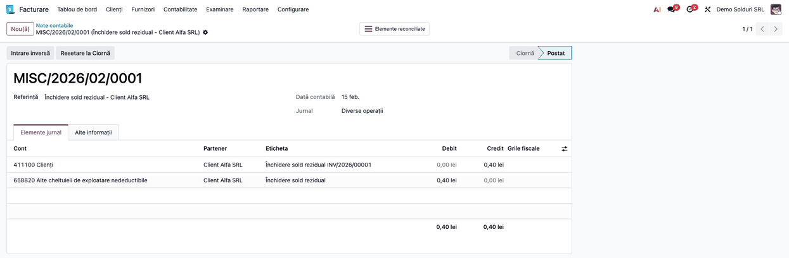
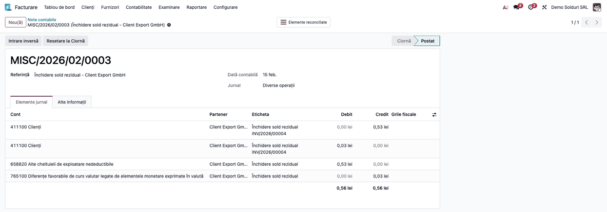
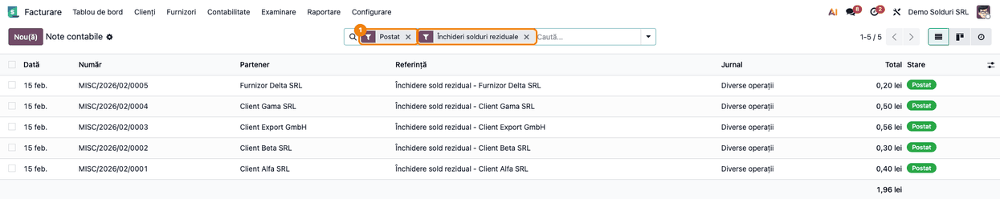

# Fișă Modul: Închiderea în masă a soldurilor reziduale pe terți

**Modul:** `l10n_ro_residual_balance_writeoff`
**Utilizator principal:** Contabil clienți/furnizori, Contabil șef (aprobarea listei)
**Prioritate:** 🟡 Medie (operațiune de închidere de lună, frecventă la firmele cu multe încasări mici)

---

## 1. Scop business

După încasări și plăți rămân pe fișele partenerilor resturi de câțiva bani. Ele vin din
rotunjiri, din comisioane bancare reținute de plătitor, din plăți cu o mică diferență sau, la
documentele în valută, din diferența dintre cursul facturii și cel al încasării. Resturile
umflă soldurile și confirmările de sold. În Odoo standard, fiecare se închide separat, factură
cu factură, la reconciliere.

Modulul le găsește pe toate deodată, sub un prag stabilit prin politica contabilă, și le arată
într-o previzualizare. Generează apoi notele contabile de închidere și reconciliază automat
documentele. Lista de închidere, în PDF, se aprobă de administrator și rămâne atașată la notă
ca document justificativ.

## 2. Bază legală și context

- **OMFP 1802/2014, funcțiunea conturilor 658 și 758:** contul 658 se debitează cu sumele
  prescrise, scutite sau anulate, potrivit prevederilor legale în vigoare, reprezentând creanțe
  față de clienți. Contul 758 se creditează cu sumele de aceeași natură reprezentând datorii față
  de furnizori. Pentru resturile mici, temeiul anulării este politica contabilă aprobată de
  administrator (punctul următor).
- **OMFP 1802/2014, pct. 61:** pragul și tipurile de diferențe admise se stabilesc prin
  politica contabilă aprobată de administrator.
- **OMFP 1802/2014, pct. 322:** diferențele de curs apărute la decontarea creanțelor și
  datoriilor în valută se recunosc la venituri sau cheltuieli din diferențe de curs (765/665).
- **Codul fiscal, art. 287, și HG 1/2016, Titlul VII, pct. 32:** baza de impozitare a TVA se
  ajustează doar în cazurile enumerate, prin factură de corecție. Un rest mic închis contabil
  **nu** modifică baza de impozitare și nici TVA colectată sau dedusă. Excepție tehnică: la
  documentele cu **TVA la încasare**, incluse doar prin bifă, reconcilierea face exigibilă TVA
  aferentă părții închise (vezi Pasul 2 și notele de monografie).
- **Codul fiscal, art. 25 alin. (4) lit. h):** pierderile din creanțe anulate în afara
  cazurilor prevăzute sunt **nedeductibile**, de aici contul implicit 65882. Veniturile din
  7588 sunt impozabile (art. 19 alin. (1)).

## 3. Utilizatori și roluri

| Rol | Ce face | Drept recomandat la test |
|---|---|---|
| Contabil clienți/furnizori | rulează wizardul, verifică previzualizarea, generează notele | Contabilitate: Bookkeeper sau Administrator (cu modulul Accountant) |
| Contabil șef / administrator | aprobă lista de închidere, stabilește pragul în politica contabilă | Contabilitate: Administrator |
| Administrator Odoo | configurează conturile și pragul implicit | Setări + Contabilitate: Administrator |

Meniul și wizardul cer grupul „Afișați toate funcțiile din contabilitate”. Cu modulul Accountant,
acesta vine cu rolurile de mai sus; fără Accountant (Facturare), bifați grupul pe utilizator, în
modul dezvoltator.

## 4. Conturi și date implicate

| Cont | Rol | Când se folosește |
|---|---|---|
| 4111 / 401 | contul restului (clienți / furnizori) | linia de închidere, reconciliată cu documentul |
| 65882 | Alte cheltuieli de exploatare nedeductibile | rest pierdut: client care mai datorează, furnizor plătit în plus |
| 7588 | Alte venituri din exploatare | rest câștigat: client care a plătit în plus, furnizor căruia i se mai datorează |
| 627 | Cheltuieli cu serviciile bancare | rest de la client cauzat de comisionul bancar al plătitorului |
| 665 / 765 | Diferențe de curs nefavorabile / favorabile | partea din rest care e diferență de curs, la documentele în valută |

Date pentru demo, același exemplu în toate capturile:

| Partener | Document | Încasare / plată | Rest | Contrapartidă |
|---|---|---|---|---|
| Client Alfa SRL | factură 100,00 lei | încasat 99,60 | 0,40 de încasat | 65882 |
| Client Beta SRL | factură 100,00 lei | încasat 100,30 | 0,30 încasat în plus | 7588 |
| Client Gama SRL | factură 100,00 lei | încasat 99,50 | 0,50, comision bancar | 627 |
| Client Export GmbH | factură 100,00 EUR (curs 5,00) | încasat 99,90 EUR | 0,10 EUR / 0,50 lei | 65882 0,53 și 765 0,03 |
| Furnizor Delta SRL | factură 200,00 lei | plătit 199,80 | 0,20 datorat | 7588 |

Pentru simplitate, facturile demo sunt fără TVA. Pe o factură reală cu TVA, restul se tratează
identic: nota de închidere nu atinge TVA (excepție: documentele cu TVA la încasare, vezi Pasul 2).

## 5. Configurare inițială

1. Instalați `l10n_ro_residual_balance_writeoff`.
2. Deschideți **Facturare → Configurare → Setări** (cu modulul Accountant instalat, aplicația
   se numește **Contabilitate**) și căutați secțiunea **Închidere solduri reziduale (RO)**:
   - **Conturi de închidere:** Cheltuieli (implicit 65882), Venituri (implicit 7588),
     Comisioane bancare (implicit 627). Gol = contul din planul de conturi RO.
   - **Prag implicit:** suma (implicit 1 leu) și procentul din document, așa cum sunt aprobate
     prin politica contabilă.

   

3. Verificați că firma are conturile de diferențe de curs configurate (665/765). Ele vin cu
   planul de conturi RO și sunt aceleași ca la încasări și plăți.
4. Verificați că există un jurnal de tip **Diverse**. Wizardul îl propune pe primul.

## 6. Flux de utilizare

### Pasul 1 — Deschiderea wizardului și criteriile de selecție

**Facturare → Clienți → Închidere solduri reziduale** (sau **Contabilitate → Clienți**, cu
modulul Accountant). Același meniu există și la **Furnizori**.

Completați:

- **Selecție:** partenerii (gol = toți), conturile (implicit conturile de clienți și
  furnizori), intervalul de date al documentelor, moneda documentului, sensul soldului
  (debitoare, creditoare sau ambele) și, dacă e cazul, bifa **Include documentele cu TVA la
  încasare**.
- **Prag și notă contabilă:** tipul pragului (**Sumă fixă**, **Procent din document** sau
  **Minimul dintre sumă și procent**), valoarea lui, **Data închiderii**, jurnalul și gruparea
  (**O notă pe partener** sau **O singură notă**).



Apăsați **Caută resturi**.

### Pasul 2 — Verificarea previzualizării

Lista arată câte un rând pe fiecare document cu rest sub prag.

1. **Găsiți pe ecran:** pe fiecare rând, partenerul, documentul, contul restului, **Rest în valută**
   (la documentele în valută), **Rest** în lei, **De închis**, **Diferență de curs** și
   **Cont de contrapartidă**. Sub listă apar numărul de rânduri selectate și totalurile de
   cheltuieli, venituri și diferențe de curs.
2. **Verificați:**
   - fiecare rest e sub pragul aprobat (în exemplu, sub 1 leu);
   - **De închis + Diferență de curs = Rest** pe fiecare rând;
   - resturile de încasat de la clienți (Client Alfa SRL, 0,40) au contul 65882, iar cele
     încasate în plus (Client Beta SRL, 0,30) au contul 7588;
   - la Client Export GmbH, restul de 0,10 EUR valorează 0,53 lei la cursul zilei: **De închis**
     0,53 și **Diferență de curs** −0,03 (câștig, 765);
   - niciun rând nu reprezintă o reducere de preț sau un refuz parțial (acelea se rezolvă prin
     factură de corecție, nu aici).

   La o încasare în plus, restul stă pe **încasare**, nu pe factură: în exemplu, documentul lui
   Client Beta SRL este încasarea `PBNK1/...`.

   Documentele cu **TVA la încasare** apar evidențiate cu galben și debifate: reconcilierea lor
   face exigibilă TVA aferentă părții închise (din 4428 în 4427/4426). Includeți-le doar după
   confirmarea tratamentului cu consultantul fiscal, bifând **Include documentele cu TVA la
   încasare** și apăsând **Caută din nou**. Coloana **TVA la încasare** se afișează din
   selectorul de coloane al listei.
3. **Ajustați, dacă e cazul:**
   - debifați rândurile care nu trebuie închise;
   - la un rest de la client cauzat de comisionul bancar al plătitorului (Client Gama SRL),
     alegeți motivul **Comision bancar**: contrapartida devine 627;
   - schimbați **Contul de contrapartidă** direct pe rând sau, pentru toate rândurile selectate,
     alegeți contul în **Cont pentru toate liniile** și apăsați **Aplică liniilor selectate**.
     Contul trebuie să fie de cheltuieli pentru o pierdere și de venituri pentru un câștig;
     rândurile de sens opus contului ales își păstrează contul.



### Pasul 3 — Lista de închidere pentru aprobare

Apăsați **Tipărește lista**. PDF-ul cuprinde criteriile, fiecare rest cu motivul și contul de
contrapartidă, totalurile și rubricile **Întocmit** / **Aprobat**.

1. **Găsiți pe ecran:** antetul cu data și criteriile (prag, conturi), tabelul pe documente și
   rândul de totaluri.
2. **Verificați:** totalul coloanei **Rest** este egal cu suma coloanelor **De închis** și
   **Diferență de curs**; criteriile tipărite sunt cele aprobate prin politica contabilă.
3. **Treceți mai departe:** predați lista spre aprobare administratorului. După generare,
   aceeași listă se atașează automat la fiecare notă.



### Pasul 4 — Generarea notelor contabile

Apăsați **Generează notele** și confirmați. Modulul:

- creează și validează nota de închidere (câte una pe partener sau una singură);
- reconciliază fiecare rest cu linia lui de închidere, iar documentul devine plătit;
- atașează la notă lista de închidere a liniilor ei, regenerată la momentul închiderii.

Lista semnată de administrator (Pasul 3) se scanează și se atașează la notă, ca document
justificativ aprobat.

Se deschid notele generate. În nota unui partener, liniile de închidere sunt pe contul
restului, iar contrapartidele pe 65882 / 7588 / 627 / 665 / 765.



### Pasul 5 — Documentele în valută

Nota pentru Client Export GmbH are două linii pe 4111: restul în valută (0,10 EUR, 0,53 lei) și
diferența de curs (0 EUR, 0,03 lei). Contrapartidele sunt 65882 0,53 și 765 0,03. Nu apare o
notă separată în jurnalul de diferențe de curs. Suma în EUR a fiecărei linii se vede activând
coloana opțională **Valoare în valută** din selectorul de coloane (disponibilă când firma
lucrează cu mai multe monede).



### Pasul 6 — Verificarea documentelor închise

**Facturare → Clienți → Facturi**: facturile cu rest închis apar **Plătite**. Notele generate
se găsesc în lista **Note contabile** (**Facturare → Contabilitate → Note contabile**), cu
filtrul **Închideri solduri reziduale**. Fiecare notă poartă partenerul pe antet.



Anularea: pe notă, **Resetare la Ciornă**, apoi **Anulează înregistrarea**. Anularea desface reconcilierea,
iar documentele revin la restul inițial. Simpla resetare la ciornă nu e suficientă: documentul
rămâne reconciliat până la anulare.

### Note de monografie și raportare

**Client cu rest de încasat (Client Alfa SRL, 0,40 lei):**

| Cont | Debit | Credit |
|---|---|---|
| 65882 Alte cheltuieli de exploatare nedeductibile | 0,40 | |
| 4111 Clienți | | 0,40 |

**Client care a plătit în plus (Client Beta SRL, 0,30 lei):**

| Cont | Debit | Credit |
|---|---|---|
| 4111 Clienți | 0,30 | |
| 7588 Alte venituri din exploatare | | 0,30 |

**Rest din comision bancar (Client Gama SRL, 0,50 lei):**

| Cont | Debit | Credit |
|---|---|---|
| 627 Cheltuieli cu serviciile bancare | 0,50 | |
| 4111 Clienți | | 0,50 |

**Furnizor căruia i se mai datorează (Furnizor Delta SRL, 0,20 lei):**

| Cont | Debit | Credit |
|---|---|---|
| 401 Furnizori | 0,20 | |
| 7588 Alte venituri din exploatare | | 0,20 |

**Furnizor plătit în plus:** `65882 = 401`.

**Client în valută (Client Export GmbH, rest 0,10 EUR / 0,50 lei, curs la închidere 5,2632):**

| Cont | Debit | Credit |
|---|---|---|
| 65882 Alte cheltuieli de exploatare nedeductibile | 0,53 | |
| 4111 Clienți (0,10 EUR) | | 0,53 |
| 4111 Clienți (diferență de curs, 0 EUR) | 0,03 | |
| 765 Venituri din diferențe de curs | | 0,03 |

Regula pentru valută: restul în valută, evaluat la cursul de la data închiderii, merge pe
65882/7588, iar ce rămâne din soldul în lei este diferență de curs realizată pe 665/765. Un rest
doar în lei (0 în valută) e integral diferență de curs. Un rest doar în valută (0 în lei) se
închide fără efect în lei.

**TVA:** nota de închidere nu atinge conturile de TVA.

**Document cu TVA la încasare inclus prin bifă** (rest 0,40 lei, din care TVA 21% = 0,07 lei):
pe lângă nota de închidere `65882 = 4111` 0,40, Odoo generează automat, la reconciliere, nota
de exigibilitate a TVA pentru partea închisă (în jurnalul CABA). Nota are și liniile bazei
(0,33 lei), în oglindă, pe contul tehnic de bază:

| Cont | Debit | Credit |
|---|---|---|
| 4428 TVA neexigibilă | 0,07 | |
| 4427 TVA colectată | | 0,07 |
| 442830 Bază TVA - cont tehnic | 0,33 | |
| 442830 Bază TVA - cont tehnic | | 0,33 |

Contul tehnic 442830 și jurnalul CABA le configurează `l10n_ro_caba`. Fără el, liniile bazei
rulează pe contul de venit al facturii (70x, debit și credit), adică rulaj artificial pe clasa 7.

Tratamentul fiscal al acestei TVA pentru un rest anulat se confirmă cu consultantul fiscal
înainte de utilizare; de aceea documentele cu TVA la încasare sunt excluse implicit.

## 7. Legături cu alte module / declarații

| Modul | Rol |
|---|---|
| `account` | reconcilierea și jurnalul de note contabile |
| `l10n_ro_currency_revaluation` | reevaluarea lunară. Liniile ei de ajustare nu sunt preluate ca resturi; partea nerealizată se realizează la reevaluarea următoare |
| `l10n_ro_balance_confirmation` | confirmările de sold arată fișele fără resturi după închidere |
| `l10n_ro_receivables_enhanced` | compensarea client-furnizor, pentru soldurile reciproce mari |
| `l10n_ro_caba` | contul tehnic 442830 și jurnalul CABA pentru TVA la încasare; necesar dacă includeți în închidere documente cu TVA la încasare |

**Ce e automat:** găsirea resturilor sub prag, împărțirea restului în valută în componenta de
închis și diferența de curs, propunerea contului de contrapartidă, nota contabilă, reconcilierea
și atașarea listei de închidere la notă.

**Ce rămâne manual:** stabilirea pragului prin politica contabilă, verificarea previzualizării,
alegerea motivului „Comision bancar” și aprobarea listei de către administrator.

**Declarații:** cheltuiala pe 65882 este nedeductibilă și se adaugă la rezultatul fiscal în
D101; veniturile pe 7588 sunt impozabile.

**Ordinea la închiderea lunii:** închideți resturile **înainte** de reevaluarea valutară de la
sfârșitul lunii. Altfel, diferența de curs a unui document închis după reevaluare se recunoaște
o dată în reevaluare și încă o dată la închidere, iar corecția vine abia la reevaluarea
următoare.

## 8. Verificări pentru consultant

- [ ] În setări sunt completate conturile de închidere și pragul implicit aprobat.
- [ ] Previzualizarea conține doar resturi sub prag.
- [ ] Pe fiecare rând, **De închis + Diferență de curs = Rest**.
- [ ] Resturile pierdute au cont de cheltuieli (65882 sau 627), iar cele câștigate cont de
      venituri (7588).
- [ ] Documentele cu TVA la încasare apar debifate și evidențiate.
- [ ] Totalul coloanei **Rest** din lista PDF este egal cu suma coloanelor **De închis** și
      **Diferență de curs**.
- [ ] Notele generate sunt validate, iar facturile închise apar **Plătite**.
- [ ] Nota în valută nu are o notă pereche în jurnalul de diferențe de curs.
- [ ] Lista de închidere e atașată la fiecare notă.
- [ ] Nota de închidere nu conține TVA. Pentru documentele cu TVA la încasare incluse, verificați
      separat nota CABA 4428 → 4427/4426 și liniile bazei pe 442830.
- [ ] **Resetare la Ciornă**, apoi **Anulează înregistrarea** pe o notă readuce documentul la
      restul inițial.

## 9. Mesaje de eroare frecvente

| Mesaj | Cauză | Remediere |
|---|---|---|
| „Restul maxim trebuie să fie pozitiv.” | prag 0 la tipul **Sumă fixă** sau **Minimul** | completați pragul |
| „Procentul maxim trebuie să fie pozitiv.” | procent 0 la tipul **Procent** sau **Minimul** | completați procentul |
| „Nu există resturi selectate de închis.” | toate rândurile sunt debifate sau lista e goală | bifați rândurile sau lărgiți criteriile |
| „Restul pentru … s-a modificat după previzualizare.” | între căutare și generare s-a înregistrat o încasare sau o reconciliere | apăsați **Caută din nou** |
| „Contul de contrapartidă … nu corespunde restului” | cont de venituri pe o pierdere sau cont de cheltuieli pe un câștig | alegeți un cont din clasa potrivită (sau 473/461/462) |
| „Completați contul de contrapartidă pentru …” | lipsește contul implicit din setări și din planul de conturi | completați contul pe rând sau în setări |
| „Configurați conturile de câștiguri și pierderi din diferențe de curs” | firma nu are 665/765 setate | completați-le în **Configurare → Setări** |
| „Selectați cel puțin un cont.” | lista de conturi e goală | adăugați conturile de clienți/furnizori |
| „Data de început trebuie să fie înaintea datei de sfârșit.” | interval de date inversat | corectați intervalul |
| „Nu există resturi selectate de tipărit.” | nicio linie bifată la **Tipărește lista** | căutați resturile și bifați liniile |
| „Închiderea a fost deja generată.” | wizardul a generat deja notele | deschideți din nou meniul pentru o rulare nouă |
| „Alegeți contul de aplicat.” | **Aplică liniilor selectate** fără cont ales | completați **Cont pentru toate liniile** |

## 10. Capturi de ecran

Capturile (`static/description/`) sunt **generate automat** din `tests/test_screenshots.py`
(mixinul `ScreenshotCase` din `l10n_ro_doc_screenshots`, import defensiv), în **limba română**,
pe planul de conturi RO (`setup_country("ro")`), cu datele din secțiunea 4:

1. `01_setari_conturi_prag.png` — setările: conturile de închidere și pragul implicit.
2. `02_wizard_criterii.png` — wizardul (dialog) cu criteriile de selecție și butonul
   **Caută resturi**.
3. `03_previzualizare.png` — previzualizarea resturilor, cu motivul „Comision bancar” pe
   Client Gama SRL, rândul în valută și butonul **Generează notele**.
4. `04_lista_inchidere_pdf.png` — lista de închidere (PDF), pentru aprobare.
5. `05_nota_inchidere.png` — nota de închidere pentru Client Alfa SRL.
6. `06_nota_valuta.png` — nota de închidere pentru Client Export GmbH (65882 și 765).
7. `07_filtru_note.png` — lista notelor contabile cu filtrul **Închideri solduri reziduale**.

Regenerare:

```bash
./odoo/odoo-bin -c odoo.conf -d <db> -i l10n_ro_residual_balance_writeoff,l10n_ro_doc_screenshots \
    --test-tags=fise_screenshots --stop-after-init
```

## 11. Observații pentru manual

- Începeți cu **politica contabilă**: pragul se aprobă de administrator, iar modulul doar îl
  aplică. Fără prag aprobat, închiderea nu are document justificativ.
- Păstrați exemplul numeric unic din secțiunea 4 în toate capturile și notele.
- Subliniați diferența dintre un **rest mic** (se închide aici, fără TVA, cu excepția
  documentelor cu TVA la încasare) și o **reducere de
  preț, un refuz parțial sau o contestare** (factură de corecție, care ajustează TVA).
- Explicați pe exemplul în valută de ce nota are două linii pe 4111: una închide restul în
  valută, cealaltă diferența de curs, fiecare pe contul ei de rezultat.
- Menționați ordinea față de reevaluarea valutară de la sfârșitul lunii.
