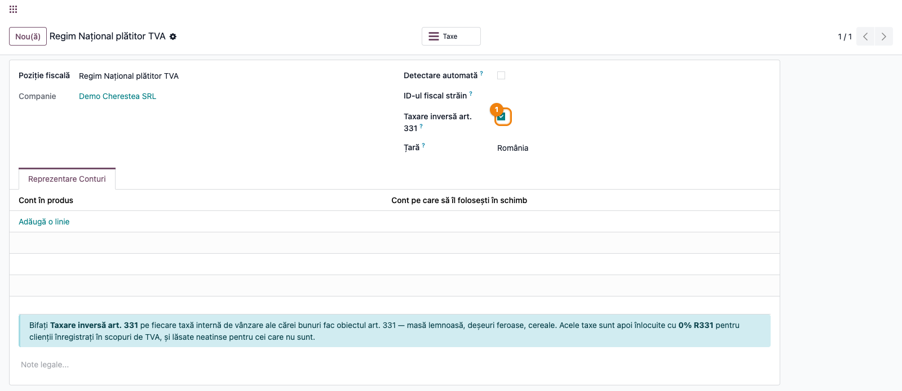
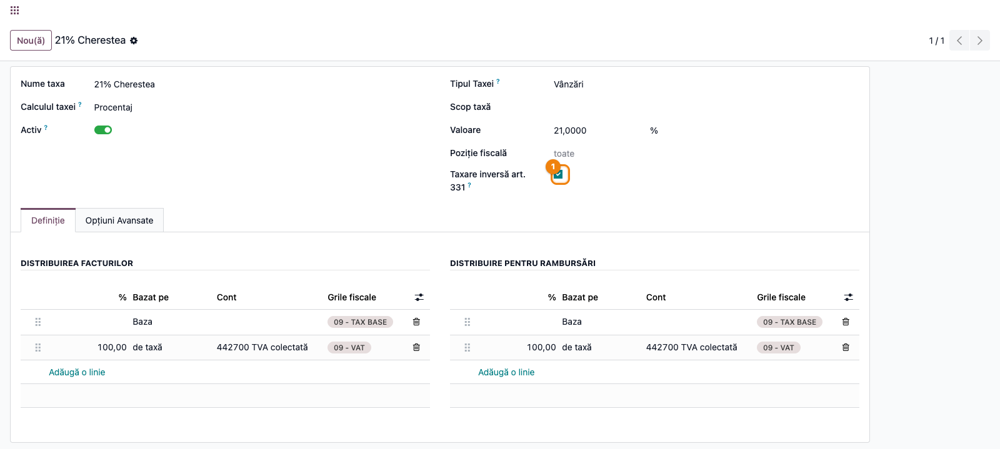
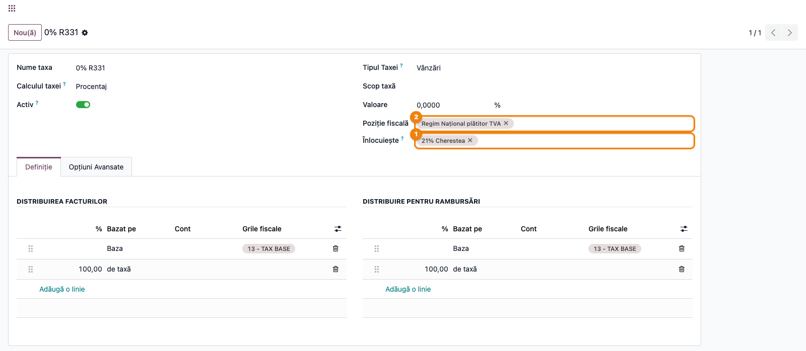
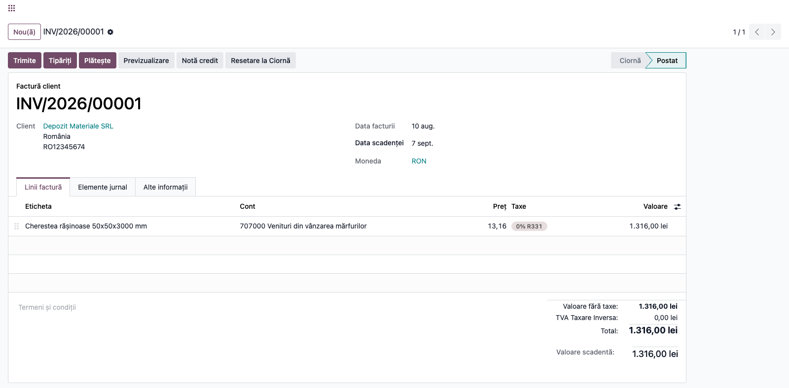
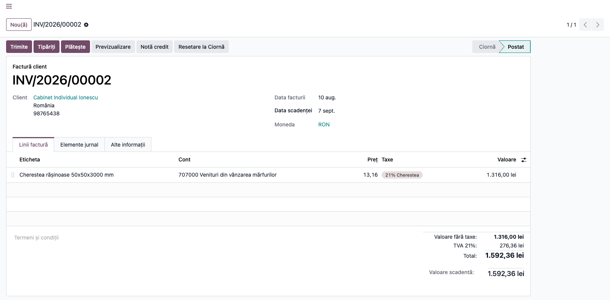
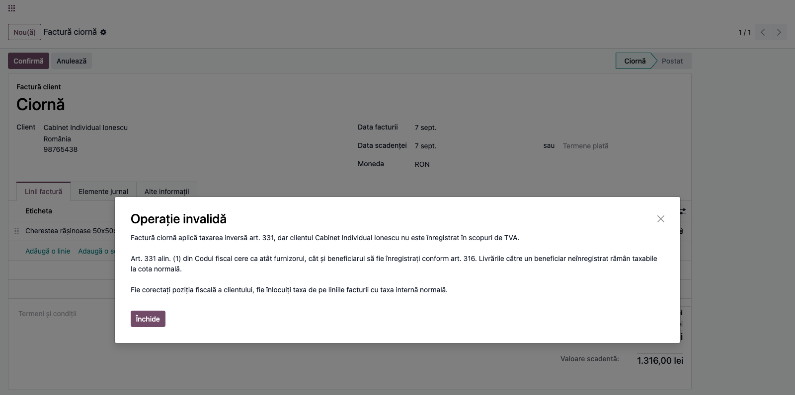
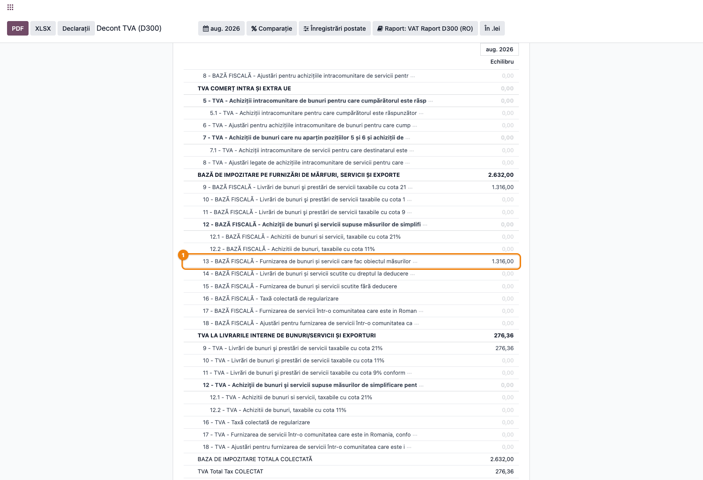

# Fișă Modul: Taxare inversă internă art. 331 (măsuri de simplificare)

**Modul:** `l10n_ro_reverse_charge_331`
**FR:** FR-68
**Utilizator principal:** Contabil TVA, Operator facturare
**Prioritate:** 🔴 Ridicată (greșeala se vede direct pe factură și în D300)

---

## 1. Scop business

Modulul aplică taxarea inversă pentru livrările interne din lista art. 331 alin. (2) din Codul
fiscal — masă lemnoasă, deșeuri feroase și neferoase, cereale și celelalte categorii — dar numai
atunci când beneficiarul are dreptul la ea. Pe factură nu se mai înscrie TVA colectată, baza intră
pe rândul 13 din D300, iar mențiunea legală se tipărește automat.

Fără modul, decizia cade pe operator la fiecare factură: trebuie să știe dacă bunul e în lista
alin. (2) **și** dacă beneficiarul e înregistrat în scopuri de TVA. Cu modulul, alegerea taxei se
face din datele partenerului, iar o factură greșită nu poate fi postată.

## 2. Bază legală și context

- **Art. 331 alin. (1)** — beneficiarul e persoana obligată la plata taxei, cu condiția obligatorie
  ca **atât furnizorul, cât și beneficiarul să fie înregistrați în scopuri de TVA conform art. 316**.
  Livrarea către un beneficiar neînregistrat rămâne taxabilă la cota normală, chiar dacă bunul e în
  lista alin. (2).
- **Art. 331 alin. (2) lit. b)** — livrarea de masă lemnoasă și materiale lemnoase, astfel cum sunt
  definite prin Legea nr. 46/2008 (Codul silvic). Cheresteaua e enumerată explicit în definiția
  materialelor lemnoase; plăcile derivate (PAL, OSB, placaj) **nu** sunt materiale lemnoase în acest
  sens și rămân la cota normală.
- **Art. 331 alin. (3)** — furnizorul nu înscrie taxa colectată pe factură; beneficiarul o
  evidențiază în decont atât ca taxă colectată, cât și ca taxă deductibilă.
- **Art. 331 alin. (5)** — măsura se aplică numai livrărilor în interiorul țării.
- **Art. 331 alin. (6)** — termenul de 31 decembrie 2026 se aplică **doar** literelor c)–f) și
  i)–l). Litera b) nu are termen de expirare.
- **Art. 331 alin. (7)** — plafonul de 22.500 lei per factură vizează **doar** literele i)–k)
  (telefoane, circuite integrate, console). Nu se aplică lemnului.

## 3. Utilizatori și roluri

| Rol | Ce face |
|---|---|
| Contabil TVA | bifează poziția fiscală și taxele din lista art. 331, verifică rândul 13 din D300 |
| Manager contabilitate | decide ce sortimente intră la lit. b) și ce rămâne la cota normală |
| Operator facturare | facturează normal; taxa se alege singură din datele clientului |
| Casier POS | nu are nimic de configurat; regimul nu apare în listă când nu i se cuvine |

Roluri recomandate la testare: un administrator funcțional pentru configurare, un operator
pentru emiterea facturilor, un contabil pentru validarea notelor și a decontului.

## 4. Conturi și date implicate

- **4426 / 4427** — TVA deductibilă și colectată; la o livrare cu taxare inversă **nu** se
  folosește 4427 pe factura furnizorului.
- **4424 / 44231** — conturile grupului de taxe „TVA Taxare Inversă" din planul RO, preluate
  automat de taxa creată de modul.
- **4111 / 707** — creanța și venitul de pe factura de livrare.
- **Eticheta de raportare „13 - TAX BASE"** — rândul 13 din D300, „Livrări de bunuri și prestări
  de servicii care fac obiectul măsurilor de simplificare".

Date minime pentru demo:
- companie românească cu planul de conturi RO instalat;
- o poziție fiscală atribuită clienților plătitori de TVA (la un client real, de regulă una numită
  după regimul național al plătitorilor);
- o taxă domestică de vânzare pentru bunul în cauză, de exemplu „21% Cherestea";
- doi clienți persoane juridice: unul înregistrat în scopuri de TVA, unul neînregistrat;
- un produs pe care e setată taxa domestică respectivă.

## 5. Configurare inițială

1. Instalați modulul `l10n_ro_reverse_charge_331`. Modulul creează taxa de vânzare **`0% R331`**,
   cu eticheta rândului 13 din D300, mențiunea legală art. 331 și categoria `AE` pentru e-Factura.
2. Verificați că limba română este instalată — modulul își aduce traducerile, iar bifele și
   mesajele apar în română doar dacă limba e activă.
3. Verificați statutul de TVA al partenerilor: câmpul **Plătitor TVA (scpTVA)** trebuie să fie
   corect. Dacă folosiți `l10n_ro_anaf_partner`, rulați sincronizarea din registrul ANAF.
4. Deschideți poziția fiscală a plătitorilor și bifați **Taxare inversă art. 331**.
5. Deschideți fiecare taxă domestică de vânzare pentru bunurile din lista alin. (2) și bifați
   **Taxare inversă art. 331**.
6. Nu modificați nimic pe produse: acestea păstrează taxa domestică obișnuită.

> Bifa de pe poziție se pune pe poziția **plătitorilor**, nu pe cea calculată de Odoo drept
> „domestică". Pe o bază cu poziții separate pentru plătitori și neplătitori, ambele cu aceeași
> secvență, Odoo alege pe cea cu id-ul mai mic — care poate fi tocmai a neplătitorilor.

## 6. Flux de utilizare

### Pasul 1 — Activarea regimului pe poziția fiscală

Accesați **Contabilitate → Configurare → Poziții fiscale**, deschideți poziția atribuită clienților
plătitori de TVA și bifați **Taxare inversă art. 331**. La salvare apare un mesaj care vă îndrumă
spre pasul următor.



### Pasul 2 — Marcarea taxei domestice

Accesați **Contabilitate → Configurare → Taxe**, deschideți taxa domestică a bunului — de exemplu
„21% Cherestea" — și bifați **Taxare inversă art. 331**.



Maparea se scrie singură. O puteți verifica deschizând taxa **`0% R331`**: în câmpul *Replaces*
apare taxa domestică marcată, iar în *Poziții fiscale* apare poziția bifată la pasul 1.



### Pasul 3 — Factură către o firmă plătitoare de TVA

Emiteți o factură obișnuită din **Contabilitate → Clienți → Facturi** către un client înregistrat
în scopuri de TVA, cu produsul pe care e setată taxa domestică. Pe linie apare **`0% R331`** în
locul cotei normale, totalul nu conține TVA, iar mențiunea legală art. 331 se tipărește pe factură.



### Pasul 4 — Factură către o firmă neplătitoare de TVA

Repetați pentru un client neînregistrat în scopuri de TVA. Pe linie rămâne taxa domestică, se
colectează TVA la cota normală, iar factura se postează normal.



### Pasul 5 — Ce se întâmplă la o configurare greșită

Dacă o factură ajunge totuși să poarte taxa art. 331 pentru un beneficiar neînregistrat — poziție
atribuită manual, taxă aleasă direct pe linie, document importat — postarea este blocată cu un
mesaj care spune ce e greșit și cum se repară.



### Pasul 6 — Verificarea în decontul de TVA (D300)

Accesați **Contabilitate → Raportare → Decont TVA (D300)** și selectați perioada facturilor de
test.

1. **Găsiți pe ecran** rândul **13 — „Livrări de bunuri și prestări de servicii care fac obiectul
   măsurilor de simplificare"**. Baza facturii emise la pasul 3 trebuie să apară acolo.
2. **Verificați** că: baza de pe rândul 13 este exact valoarea fără TVA a facturii cu taxare
   inversă; factura de la pasul 4 **nu** apare pe rândul 13, ci pe rândul de livrări taxabile la
   cota normală, împreună cu TVA-ul colectat; perioada selectată e cea corectă.
3. **Abia apoi** generați declarația sau exportul, cu butonul de export al raportului.



### Note de monografie și raportare

- livrare cu **taxare inversă** (beneficiar înregistrat): **Dr 4111 = Cr 707**, fără 4427 —
  art. 331 alin. (3) interzice înscrierea taxei colectate;
- livrare către **beneficiar neînregistrat**: **Dr 4111 = Cr 707 + Cr 4427** la cota normală;
- baza livrării cu taxare inversă se raportează pe **rândul 13 din D300**, prin eticheta
  „13 - TAX BASE" a taxei `0% R331`;
- beneficiarul, la rândul lui, evidențiază operațiunea ca taxă colectată **și** deductibilă
  (**Dr 4426 = Cr 4427**) — aceea e monografia lui, pe achiziție, și nu e produsă de acest modul;
- în XML-ul de e-Factura, taxa declară categoria UNCL5305 **`AE`** (VAT Reverse Charge), nu `E`.

## 7. Legături cu alte module / declarații

| Modul / proces | Rol în flux | Tip legătură |
|---|---|---|
| `account` | facturi, mapare de taxe, blocajul la postare | dependență (manifest) |
| `l10n_ro` | plan de conturi RO, grupul „TVA Taxare Inversă", eticheta rândului 13 | dependență (manifest) |
| `l10n_ro_reverse_charge_331_sale` | duce gardul pe oferte și comenzi de vânzare | modul-punte, `auto_install` |
| `l10n_ro_reverse_charge_331_pos` | ascunde regimul art. 331 în POS când clientul nu are dreptul | modul-punte, `auto_install` |
| `l10n_ro_anaf_partner` | sincronizează din ANAF statutul **Plătitor TVA (scpTVA)** pe care se sprijină gardul | opțional, recomandat |
| `l10n_ro_config` (OCA) | declară același câmp de statut TVA și rescrie codul de TVA în funcție de el | opțional |
| `account_edi_ubl_cii` | categoria `AE` în XML-ul de e-Factura | opțional |
| `l10n_ro_anaf_d300` | rândul 13, prin eticheta taxei | integrare prin convenție |
| `deltatech_pos_fix` | corectează prețul unitar în POS când o taxă inclusă e mapată la una neinclusă | necesar dacă taxa domestică e cu TVA inclus |

Ce este automat: alegerea taxei pe ofertă, comandă și factură; scrierea mapării; mențiunea legală;
eticheta rândului 13; categoria `AE`; blocajul la postare; ascunderea regimului în POS.

Ce rămâne manual: decizia ce sortimente intră în lista alin. (2), corectitudinea statutului de TVA
al partenerilor, și tratarea documentelor emise înainte de configurare.

> Taxele de taxare inversă livrate de `l10n_ro` lasă categoria e-Factura necompletată, deci
> declară `E` (scutit) în XML. Modulul corectează doar propria taxă; schimbarea celor native ar
> modifica XML-ul documentelor deja trimise la SPV și e o decizie separată.

## 8. Verificări pentru consultant

- [ ] Modulul se instalează fără erori, iar taxa `0% R331` există pe companie.
- [ ] Taxa `0% R331` are eticheta „13 - TAX BASE" pe liniile de bază (factură și restituire).
- [ ] Taxa `0% R331` are mențiunea legală art. 331 și categoria e-Factura `AE`.
- [ ] Poziția fiscală a plătitorilor are bifa **Taxare inversă art. 331**.
- [ ] Taxa domestică marcată apare în câmpul *Replaces* al taxei `0% R331`.
- [ ] Factura către un client plătitor de TVA are `0% R331`, TVA zero și mențiunea tipărită.
- [ ] Factura către un client neplătitor păstrează cota normală și colectează TVA.
- [ ] Baza facturii cu taxare inversă apare pe **rândul 13** din D300, iar cea a neplătitorului nu.
- [ ] Postarea unei facturi cu taxa art. 331 către un neplătitor este blocată cu mesaj explicit.
- [ ] Debifarea taxei domestice desface maparea, iar facturile noi revin la cota normală.
- [ ] Nicio altă taxă atașată aceleiași poziții nu are taxa domestică în *Replaces* (verificat automat la bifare).
- [ ] În POS, regimul art. 331 nu apare în lista de poziții fiscale fără un client plătitor.
- [ ] Dacă taxa domestică are TVA inclus în preț, `deltatech_pos_fix` este instalat.

## 9. Mesaje de eroare frecvente

| Mesaj / simptom | Cauză probabilă | Remediere |
|---|---|---|
| „Factura … aplică taxarea inversă art. 331, dar clientul … nu este înregistrat în scopuri de TVA." | Factura poartă taxa art. 331 pentru un beneficiar neînregistrat: poziție atribuită manual, taxă aleasă direct pe linie sau document importat | Corectați statutul **Plătitor TVA (scpTVA)** dacă clientul e într-adevăr înregistrat, altfel înlocuiți taxa pe linii cu cea domestică |
| „Taxa … nu poate fi marcată pentru taxare inversă art. 331: nu este o taxă internă." | Taxa domestică e legată exclusiv de alt regim, deci nu poate fi sursa unei înlocuiri | Adăugați poziția fiscală domestică a companiei în câmpul *Poziții fiscale* al taxei, apoi reluați bifa |
| „Taxa … este deja înlocuită de … pe poziția fiscală …" | Taxa domestică e deja înlocuită de o altă taxă atașată aceleiași poziții fiscale — de regulă o configurare manuală făcută înainte de instalarea modulului | Scoateți poziția din câmpul *Poziții fiscale* al taxei semnalate, sau scoateți taxa domestică din *Replaces*-ul ei; apoi reluați bifa |
| Taxa domestică nu apare în lista *Replaces* | Câmpul acceptă doar taxe domestice și doar cu același sens de utilizare (vânzare cu vânzare) | Verificați `Poziții fiscale` de pe taxa sursă și sensul de utilizare |
| Bifa **Taxare inversă art. 331** nu e vizibilă pe taxă | Taxa nu e de vânzare, e taxa `0% R331` însăși, sau compania nu e românească | Bifa apare doar pe taxele de vânzare ale unei companii cu plan de conturi RO |
| Factura veche păstrează cota normală după configurare | Taxele de pe documente existente sunt stocate, nu recalculate | Schimbați clientul sau poziția fiscală pe document, ori ștergeți și readăugați linia |
| În POS, prețul nu scade cu TVA-ul la trecerea pe taxare inversă | Taxa domestică are TVA inclus în preț, iar `deltatech_pos_fix` nu e instalat | Instalați `deltatech_pos_fix` |

## 10. Capturi de ecran

Capturile din `readme/screenshots/` sunt **generate automat** din `tests/test_screenshots.py`
(mixinul `ScreenshotCase` din `l10n_ro_doc_screenshots`, import defensiv), în **limba română**,
pe planul de conturi RO, cu tema luminoasă:

1. `01_poz_fiscala_331.png` — poziția fiscală a plătitorilor, cu bifa **Taxare inversă art. 331**.
2. `02_taxa_cherestea.png` — taxa domestică „21% Cherestea", marcată ca livrare art. 331.
3. `03_taxa_0r331.png` — taxa `0% R331` cu *Înlocuiește* și *Poziție fiscală* completate automat,
   și eticheta „13 - TAX BASE" pe ambele distribuții.
4. `04_factura_platitor.png` — factură cu `0% R331` către un plătitor: TVA zero, total 1.316,00 lei.
5. `05_factura_neplatitor.png` — factură cu „21% Cherestea" către un neplătitor: TVA 276,36 lei.
6. `06_blocaj_postare.png` — dialogul „Operație invalidă" la postarea unei facturi cu taxa
   art. 331 pentru un beneficiar neînregistrat.
7. `07_d300_rand13.png` — decontul de TVA: rândul **13** cu baza livrării cu taxare inversă
   (1.316,00), iar rândul **9** cu livrarea la cota normală (1.316,00 bază, 276,36 TVA).

Facturile sunt datate în luna anterioară, ca decontul — care se deschide implicit pe luna trecută —
să le cuprindă. Ciorna folosită pentru blocaj rămâne în luna curentă, altfel raportul ar afișa
bannerul „elemente jurnal nepostate".

Regenerare:

```bash
./odoo/odoo-bin -c odoo.conf -d <db> \
    -i l10n_ro_reverse_charge_331,l10n_ro_doc_screenshots,account_reports \
    --test-tags=fise_screenshots --stop-after-init
```

## 11. Observații pentru manual

Păstrați în manual distincția care face tot modulul: taxarea inversă nu depinde de bun, ci de bun
**și** de beneficiar. Un operator care înțelege asta nu va încerca să „forțeze" regimul din poziția
fiscală pentru un client neplătitor.

Merită menționat explicit și că litera b) — masa lemnoasă — nu are termen de expirare, spre
deosebire de majoritatea celorlalte categorii din alin. (2), care expiră la 31 decembrie 2026.
Este o întrebare pe care clienții o pun des.
