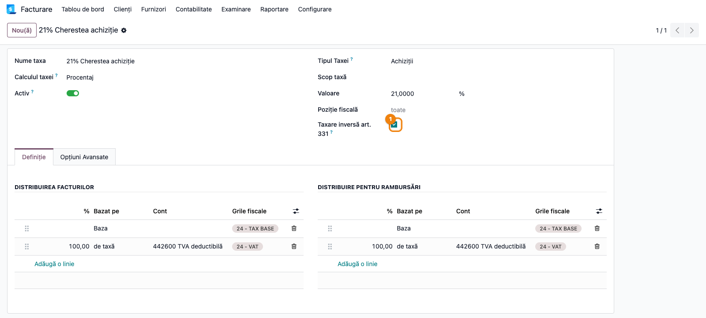
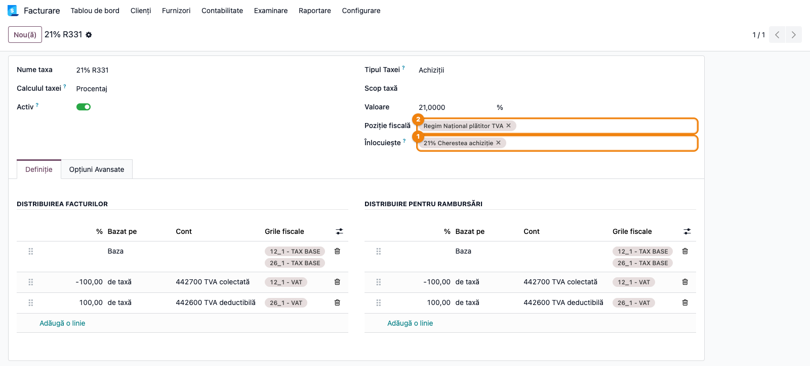
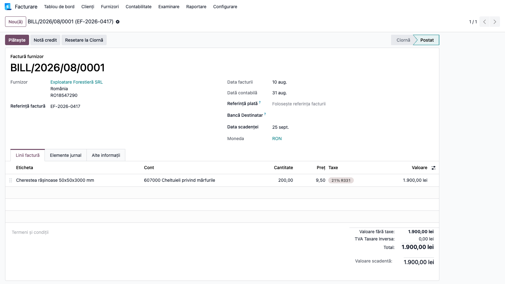
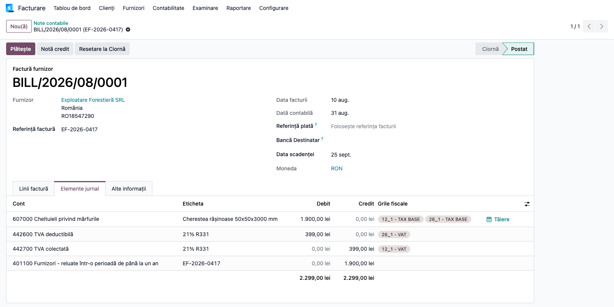
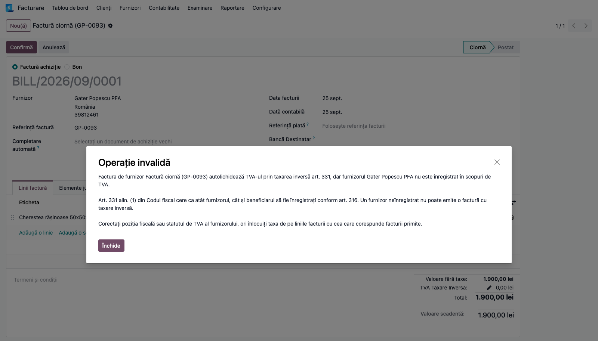
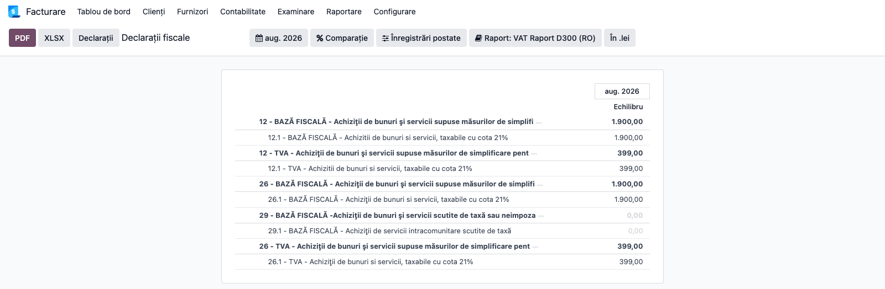

# Fișă Modul: Taxare inversă internă art. 331 (măsuri de simplificare)

**Modul:** `l10n_ro_reverse_charge_331`
**FR:** FR-68
**Utilizator principal:** Contabil TVA, Operator facturare, Operator achiziții
**Prioritate:** 🔴 Ridicată (greșeala se vede direct pe factură și în D300)

---

## 1. Scop business

Modulul aplică taxarea inversă pentru livrările interne din lista art. 331 alin. (2) din Codul
fiscal — masă lemnoasă, deșeuri feroase și neferoase, cereale și celelalte categorii — dar numai
atunci când beneficiarul are dreptul la ea. Pe factură nu se mai înscrie TVA colectată, baza intră
pe rândul 13 din D300, iar mențiunea legală se tipărește automat.

Același mecanism acoperă și partea cealaltă, când compania **cumpără** bunuri din lista
alin. (2): factura furnizorului înregistrat primește taxa **`21% R331`**, care autolichidează
TVA-ul — colectat și dedus în același timp (**Dr 4426 = Cr 4427**), cu baza și TVA-ul pe rândurile
12.1 și 26.1 din D300 — fără ca totalul facturii să conțină TVA.

Fără modul, decizia cade pe operator la fiecare factură: trebuie să știe dacă bunul e în lista
alin. (2) **și** dacă partenerul e înregistrat în scopuri de TVA. Cu modulul, alegerea taxei se
face din datele partenerului, iar o factură greșită nu poate fi postată.

## 2. Bază legală și context

- **Art. 331 alin. (1)** — beneficiarul e persoana obligată la plata taxei, cu condiția obligatorie
  ca **atât furnizorul, cât și beneficiarul să fie înregistrați în scopuri de TVA conform art. 316**.
  Livrarea către un beneficiar neînregistrat rămâne taxabilă la cota normală, chiar dacă bunul e în
  lista alin. (2).
- **Art. 331 alin. (2) lit. b)** — livrarea de masă lemnoasă și materiale lemnoase, astfel cum sunt
  definite prin Legea nr. 46/2008 (Codul silvic). Cheresteaua e enumerată explicit în definiția
  materialelor lemnoase; plăcile derivate (PAL, OSB, placaj) **nu** sunt materiale lemnoase în acest
  sens și rămân la cota normală.
- **Art. 331 alin. (3)** — furnizorul nu înscrie taxa colectată pe factură; beneficiarul o
  evidențiază în decont atât ca taxă colectată, cât și ca taxă deductibilă.
- **Norme metodologice (HG 1/2016), pct. 109 alin. (1)** — la beneficiar, taxa se înregistrează
  prin formula **4426 = 4427**. **Pct. 109 alin. (4)**: TVA dedus dintr-o factură care trebuia să
  poarte mențiunea „taxare inversă” nu este deductibil — de aceea taxa nu se „ajustează” ca să
  corespundă unei facturi primite greșit.
- **Art. 282 alin. (6) lit. a)** — furnizorul care aplică TVA la încasare nu aplică acest sistem
  livrărilor cu taxare inversă. **Art. 297 alin. (3)**, teza finală — la beneficiar, dreptul de
  deducere pentru achizițiile cu taxare inversă art. 331 nu se amână: taxa `21% R331` e exigibilă
  pe factură, fără trecere prin 4428.
- **Art. 331 alin. (5)** — măsura se aplică numai livrărilor în interiorul țării.
- **Art. 331 alin. (6)** — termenul de 31 decembrie 2026 se aplică **doar** literelor c)–f) și
  i)–l). Litera b) nu are termen de expirare.
- **Art. 331 alin. (7)** — plafonul de 22.500 lei per factură vizează **doar** literele i)–k)
  (telefoane, circuite integrate, console). Nu se aplică lemnului.

## 3. Utilizatori și roluri

| Rol | Ce face |
|---|---|
| Contabil TVA | bifează poziția fiscală și taxele din lista art. 331, verifică rândul 13 din D300 |
| Manager contabilitate | decide ce sortimente intră la lit. b) și ce rămâne la cota normală |
| Operator facturare | facturează normal; taxa se alege singură din datele clientului |
| Operator achiziții | înregistrează factura furnizorului normal; taxa se alege singură din datele furnizorului |
| Casier POS | nu are nimic de configurat; regimul nu apare în listă când nu i se cuvine |

Roluri recomandate la testare: un administrator funcțional pentru configurare, un operator
pentru emiterea facturilor, un contabil pentru validarea notelor și a decontului.

## 4. Conturi și date implicate

- **4426 / 4427** — TVA deductibilă și colectată; la o livrare cu taxare inversă **nu** se
  folosește 4427 pe factura furnizorului. La achiziție, taxa `21% R331` le folosește pe amândouă:
  4426 cu factor +100 și 4427 cu factor −100.
- **401 / 607 (sau 371, 301 după destinație)** — datoria și costul de pe factura de achiziție.
- **4424 / 44231** — conturile grupului de taxe „TVA Taxare Inversă" din planul RO, preluate
  automat de taxa creată de modul.
- **4111 / 707** — creanța și venitul de pe factura de livrare.
- **Eticheta de raportare „13 - TAX BASE"** — rândul 13 din D300, „Livrări de bunuri și prestări
  de servicii care fac obiectul măsurilor de simplificare".
- **Etichetele „12_1" și „26_1"** — rândurile 12.1 (taxa colectată) și 26.1 (taxa dedusă) din D300,
  „Achiziții de bunuri și servicii supuse măsurilor de simplificare… taxabile cu cota 21%".

Date minime pentru demo:
- companie românească cu planul de conturi RO instalat;
- o poziție fiscală atribuită clienților plătitori de TVA (la un client real, de regulă una numită
  după regimul național al plătitorilor);
- o taxă domestică de vânzare pentru bunul în cauză, de exemplu „21% Cherestea";
- doi clienți persoane juridice: unul înregistrat în scopuri de TVA, unul neînregistrat;
- un produs pe care e setată taxa domestică respectivă;
- pentru achiziție: o taxă deductibilă dedicată bunului (ex. „21% Cherestea achiziție"), setată ca
  taxă de furnizor pe produs, și doi furnizori — unul înregistrat în scopuri de TVA, cu poziția
  fiscală a plătitorilor (aceeași ca la clienți), și unul neînregistrat.

## 5. Configurare inițială

1. Instalați modulul `l10n_ro_reverse_charge_331`. Modulul creează taxa de vânzare **`0% R331`**,
   cu eticheta rândului 13 din D300, mențiunea legală art. 331 și categoria `AE` pentru e-Factura,
   și taxa de achiziție **`21% R331`**, cu autolichidarea pe 4426 / 4427 și etichetele rândurilor
   12.1 și 26.1. Pe o bază unde modulul era deja instalat, taxa de achiziție apare la actualizarea
   modulului.
2. Verificați că limba română este instalată — modulul își aduce traducerile, iar bifele și
   mesajele apar în română doar dacă limba e activă.
3. Verificați statutul de TVA al partenerilor: câmpul **Plătitor TVA (scpTVA)** trebuie să fie
   corect. Dacă folosiți `l10n_ro_anaf_partner`, rulați sincronizarea din registrul ANAF.
4. Deschideți poziția fiscală a plătitorilor și bifați **Taxare inversă art. 331**.
5. Deschideți fiecare taxă domestică de vânzare pentru bunurile din lista alin. (2) și bifați
   **Taxare inversă art. 331**.
6. Pentru achiziții: creați o taxă deductibilă **dedicată** bunului, la 21% (copie a taxei
   deductibile standard, ca să păstreze grilele fiscale), setați-o ca taxă de furnizor pe
   produsele respective și bifați pe ea **Taxare inversă art. 331**. **Nu** bifați taxa deductibilă
   standard de 21%: orice achiziție de bunuri la 21% de la un furnizor plătitor s-ar autolichida.
7. În afara taxei de furnizor de la pasul 6, nu modificați nimic pe produse: acestea păstrează
   taxa domestică obișnuită.

> Bifa de pe poziție se pune pe poziția **plătitorilor**, nu pe cea calculată de Odoo drept
> „domestică". Pe o bază cu poziții separate pentru plătitori și neplătitori, ambele cu aceeași
> secvență, Odoo alege pe cea cu id-ul mai mic — care poate fi tocmai a neplătitorilor.

## 6. Flux de utilizare

### Pasul 1 — Activarea regimului pe poziția fiscală

Accesați **Contabilitate → Configurare → Poziții fiscale**, deschideți poziția atribuită
partenerilor plătitori de TVA — clienți și furnizori — și bifați
**Taxare inversă art. 331**. La salvare apare un mesaj care vă îndrumă
spre pasul următor.


### Pasul 2 — Marcarea taxei domestice

Accesați **Contabilitate → Configurare → Taxe**, deschideți taxa domestică a bunului — de exemplu
„21% Cherestea" — și bifați **Taxare inversă art. 331**.


Maparea se scrie singură. O puteți verifica deschizând taxa **`0% R331`**: în câmpul *Replaces*
apare taxa domestică marcată, iar în *Poziții fiscale* apare poziția bifată la pasul 1.


### Pasul 3 — Factură către o firmă plătitoare de TVA

Emiteți o factură obișnuită din **Contabilitate → Clienți → Facturi** către un client înregistrat
în scopuri de TVA, cu produsul pe care e setată taxa domestică. Pe linie apare **`0% R331`** în
locul cotei normale, totalul nu conține TVA, iar mențiunea legală art. 331 se tipărește pe factură.


### Pasul 4 — Factură către o firmă neplătitoare de TVA

Repetați pentru un client neînregistrat în scopuri de TVA. Pe linie rămâne taxa domestică, se
colectează TVA la cota normală, iar factura se postează normal.


### Pasul 5 — Ce se întâmplă la o configurare greșită

Dacă o factură ajunge totuși să poarte taxa art. 331 pentru un beneficiar neînregistrat — poziție
atribuită manual, taxă aleasă direct pe linie, document importat — postarea este blocată cu un
mesaj care spune ce e greșit și cum se repară.


### Pasul 6 — Verificarea în decontul de TVA (D300)

Accesați **Contabilitate → Raportare → Taxe și fiscalitate → Raport Taxa** (ecranul se intitulează
„Declarații fiscale"). Pe o companie RO raportul se deschide pe varianta **VAT Raport D300 (RO)**
(butonul *Raport:* din bara de sus); selectați perioada facturilor de test.

1. **Găsiți pe ecran** rândul **13 — „Livrări de bunuri și prestări de servicii care fac obiectul
   măsurilor de simplificare"**. Baza facturii emise la pasul 3 trebuie să apară acolo.
2. **Verificați** că: baza de pe rândul 13 este exact valoarea fără TVA a facturii cu taxare
   inversă; factura de la pasul 4 **nu** apare pe rândul 13, ci pe rândul de livrări taxabile la
   cota normală, împreună cu TVA-ul colectat; perioada selectată e cea corectă.
3. **Abia apoi** generați declarația sau exportul, cu butonul de export al raportului.


În captură apare deasupra și rândul 12 / 12.1: e achiziția cu taxare inversă de la pasul 8, datată
în aceeași lună. Pe o bază fără achiziții art. 331, rândul 12 rămâne gol.

### Pasul 7 — Marcarea taxei de achiziție

Accesați **Contabilitate → Configurare → Taxe**, deschideți taxa deductibilă dedicată bunului —
de exemplu „21% Cherestea achiziție" — și bifați **Taxare inversă art. 331**. Taxa trebuie să aibă
cota de 21%; o taxă cu altă cotă este refuzată la bifare.



Deschideți apoi taxa **`21% R331`** și verificați maparea scrisă automat: în *Înlocuiește* apare
taxa bifată, în *Poziție fiscală* apare poziția plătitorilor. În distribuția facturilor,
**4427 TVA colectată** are −100%, cu eticheta **12_1 - VAT**, iar **4426 TVA deductibilă** are
100%, cu eticheta **26_1 - VAT**; baza poartă etichetele **12_1** și **26_1**.



### Pasul 8 — Factură de la un furnizor plătitor de TVA

Înregistrați factura furnizorului din **Contabilitate → Furnizori → Facturi**, pentru un furnizor
înregistrat în scopuri de TVA, cu produsul pe care e setată taxa de la pasul 7. Furnizorul trebuie
să aibă poziția fiscală a plătitorilor (cea bifată la pasul 1): fără ea nu se face nicio înlocuire,
iar linia ar primi taxa deductibilă de 21%, cu un TVA pe care furnizorul nu l-a facturat. Pe linie apare
**`21% R331`**, iar totalul facturii este egal cu valoarea fără taxe — furnizorul nu facturează TVA.



Deschideți tab-ul **Elemente jurnal**:

1. **Găsiți pe ecran** cele două linii de TVA etichetate „21% R331": una pe **4426 TVA
   deductibilă**, în debit, și una pe **4427 TVA colectată**, în credit.
2. **Verificați** că cele două sume sunt egale și reprezintă 21% din bază (în exemplu, 399,00 lei
   la o bază de 1.900,00 lei), iar furnizorul (401) e creditat doar cu baza.

Data contabilă din captură (31 aug.) diferă de data facturii (10 aug.): o factură de furnizor
înregistrată după încheierea lunii facturii primește ca dată contabilă ultima zi a acelei luni,
deci intră în decontul lunii facturii, nu al lunii înregistrării.



### Pasul 9 — Factură cu taxa art. 331 de la un furnizor neplătitor

Dacă o factură de furnizor ajunge să poarte **`21% R331`** pentru un furnizor neînregistrat în
scopuri de TVA — taxă aleasă direct pe linie, poziție atribuită manual, document importat —
postarea este blocată: un furnizor neînregistrat nu poate emite o factură cu taxare inversă.



> Un furnizor neînregistrat nu facturează TVA deloc. Nu îl lăsați pe poziția plătitorilor: dați-i
> poziția neplătitorilor, cu o mapare spre o taxă de achiziție fără TVA, altfel linia ar primi
> taxa deductibilă de 21%, cu un TVA pe care furnizorul nu l-a facturat.

### Pasul 10 — Verificarea achiziției în decontul de TVA (D300)

Accesați **Contabilitate → Raportare → Taxe și fiscalitate → Raport Taxa**, varianta
**VAT Raport D300 (RO)**, și selectați perioada facturii de la pasul 8.

1. **Găsiți pe ecran** rândurile **12** și **26** — „Achiziții de bunuri și servicii supuse
   măsurilor de simplificare pentru care beneficiarul este obligat la plata TVA" — cu subrândurile
   **12.1** și **26.1** (cota 21%), atât în secțiunea de bază, cât și în cea de TVA.
2. **Verificați** că: baza de pe 12.1 și de pe 26.1 este valoarea fără TVA a facturii; TVA-ul de pe
   12.1 (colectat) și de pe 26.1 (dedus) sunt egale între ele și cu linia 4426 / 4427 din nota
   contabilă; rândul 29 (achiziții scutite sau neimpozabile) rămâne la zero.
3. **Abia apoi** generați declarația sau exportul, cu butoanele raportului (**PDF**, **XLSX**,
   **Declarații**).



Captura afișează doar rândurile 12, 26 și 29 ale raportului, ca să încapă pe un singur ecran; pe
ecranul real ele sunt despărțite de celelalte rânduri ale decontului.

### Note de monografie și raportare

- livrare cu **taxare inversă** (beneficiar înregistrat): **Dr 4111 = Cr 707**, fără 4427 —
  art. 331 alin. (3) interzice înscrierea taxei colectate;
- livrare către **beneficiar neînregistrat**: **Dr 4111 = Cr 707 + Cr 4427** la cota normală;
- baza livrării cu taxare inversă se raportează pe **rândul 13 din D300**, prin eticheta
  „13 - TAX BASE" a taxei `0% R331`;
- achiziție cu **taxare inversă** (furnizor înregistrat): **Dr 607 (371 / 301) = Cr 401** la
  valoarea fără TVA, plus **Dr 4426 = Cr 4427** pentru TVA-ul de 21% autolichidat — totalul facturii
  rămâne baza;
- baza și TVA-ul achiziției se raportează pe **rândurile 12.1 și 26.1 din D300**, prin etichetele
  taxei `21% R331` — nu pe rândul 29 (achiziții scutite sau neimpozabile);
- factura de corecție (storno) a furnizorului, creată cu *Notă credit* din factura inițială,
  inversează nota: **Dr 401 = Cr 607** și **Dr 4427 = Cr 4426**, iar rândurile 12.1 și 26.1 scad.
  O notă de credit introdusă manual primește și ea `21% R331` din mapare — verificați taxa și
  cota când corectează o factură din 2025 la 19% sau una postată cu vechea taxă de 0%;
- în XML-ul de e-Factura, taxa declară categoria UNCL5305 **`AE`** (VAT Reverse Charge), nu `E`.

## 7. Legături cu alte module / declarații

| Modul / proces | Rol în flux | Tip legătură |
|---|---|---|
| `account` | facturi, mapare de taxe, blocajul la postare | dependență (manifest) |
| `l10n_ro` | plan de conturi RO, grupul „TVA Taxare Inversă", eticheta rândului 13 | dependență (manifest) |
| `l10n_ro_reverse_charge_331_sale` | duce gardul pe oferte și comenzi de vânzare | modul-punte, `auto_install` |
| `l10n_ro_reverse_charge_331_purchase` | duce gardul pe cereri de ofertă, comenzi de achiziție și reaprovizionare | modul-punte, `auto_install` |
| `l10n_ro_reverse_charge_331_pos` | ascunde regimul art. 331 în POS când clientul nu are dreptul | modul-punte, `auto_install` |
| `l10n_ro_anaf_partner` | sincronizează din ANAF statutul **Plătitor TVA (scpTVA)** pe care se sprijină gardul | opțional, recomandat |
| `l10n_ro_config` (OCA) | declară același câmp de statut TVA și rescrie codul de TVA în funcție de el | opțional |
| `account_edi_ubl_cii` | categoria `AE` în XML-ul de e-Factura | opțional |
| `l10n_ro_anaf_d300` | rândul 13 pe vânzare, rândurile 12.1 și 26.1 pe achiziție, prin etichetele taxelor | integrare prin convenție |
| `l10n_ro_account_vat_journal` / `l10n_ro_anaf_d394` | recunosc `21% R331` ca achiziție cu taxare inversă (factorul −100 pe 4427): TVA colectat separat în jurnalul de cumpărări, operațiune de tip „C" în D394 | integrare prin convenție |
| `deltatech_pos_fix` | corectează prețul unitar în POS când o taxă inclusă e mapată la una neinclusă | necesar dacă taxa domestică e cu TVA inclus |

Ce este automat: alegerea taxei pe ofertă, comandă și factură, de vânzare și de achiziție;
scrierea mapării; mențiunea legală; etichetele rândurilor 13, 12.1 și 26.1; autolichidarea
4426 / 4427; categoria `AE`; blocajul la postare; ascunderea regimului în POS.

Ce rămâne manual: decizia ce sortimente intră în lista alin. (2), corectitudinea statutului de TVA
al partenerilor, tratarea documentelor emise înainte de configurare (inclusiv reîncadrarea
facturilor de achiziție înregistrate anterior cu o taxă de 0% „taxare inversă"), deducerea
parțială (pro-rata) și bunurile art. 331 cu altă cotă decât 21% (ex. cerealele, la 11%).

> **Facturile primite prin e-Factura (SPV)** cu categoria `AE` și cota 0% **nu** sunt mapate
> automat la `21% R331` la import: linia păstrează taxa de 0% aleasă de import, deci fără
> 4426 / 4427 și cu rândurile 12 / 26 subdeclarate. Verificați taxa pe fiecare factură importată
> de la un furnizor art. 331 înainte de postare. Tot manual rămân: statutul de TVA, citit la data
> curentă și nu la data operațiunii (contează la o factură înregistrată târziu), și pragul de
> 22.500 lei al art. 331 alin. (7), neverificat nici pe achiziție.

> Taxele de taxare inversă livrate de `l10n_ro` lasă categoria e-Factura necompletată, deci
> declară `E` (scutit) în XML. Modulul corectează doar propria taxă; schimbarea celor native ar
> modifica XML-ul documentelor deja trimise la SPV și e o decizie separată.

## 8. Verificări pentru consultant

- [ ] Modulul se instalează fără erori, iar taxa `0% R331` există pe companie.
- [ ] Taxa `0% R331` are eticheta „13 - TAX BASE" pe liniile de bază (factură și restituire).
- [ ] Taxa `0% R331` are mențiunea legală art. 331 și categoria e-Factura `AE`.
- [ ] Poziția fiscală a plătitorilor are bifa **Taxare inversă art. 331**.
- [ ] Taxa domestică marcată apare în câmpul *Replaces* al taxei `0% R331`.
- [ ] Factura către un client plătitor de TVA are `0% R331`, TVA zero și mențiunea tipărită.
- [ ] Factura către un client neplătitor păstrează cota normală și colectează TVA.
- [ ] Baza facturii cu taxare inversă apare pe **rândul 13** din D300, iar cea a neplătitorului nu.
- [ ] Postarea unei facturi cu taxa art. 331 către un neplătitor este blocată cu mesaj explicit.
- [ ] Debifarea taxei domestice desface maparea, iar facturile noi revin la cota normală.
- [ ] Nicio altă taxă atașată aceleiași poziții nu are taxa domestică în *Replaces* (verificat automat la bifare).
- [ ] În POS, regimul art. 331 nu apare în lista de poziții fiscale fără un client plătitor.
- [ ] Dacă taxa domestică are TVA inclus în preț, `deltatech_pos_fix` este instalat.
- [ ] Taxa `21% R331` există, e de achiziție, cu 4427 la −100% (eticheta 12_1 - VAT) și 4426 la
      100% (eticheta 26_1 - VAT), iar baza poartă etichetele 12_1 și 26_1 — pe factură și pe storno.
- [ ] Taxa deductibilă dedicată bunului e bifată și apare în *Înlocuiește* al taxei `21% R331`;
      taxa deductibilă standard de 21% **nu** e bifată.
- [ ] Factura unui furnizor plătitor are `21% R331`, total egal cu baza și nota **Dr 4426 = Cr 4427**
      cu 21% din bază.
- [ ] Baza și TVA-ul achiziției apar pe rândurile **12.1 și 26.1** din D300, nu pe rândul 29.
- [ ] Postarea unei facturi de furnizor cu `21% R331` de la un furnizor neînregistrat este blocată.
- [ ] O comandă de achiziție către un furnizor plătitor are `21% R331`, iar factura creată din ea
      păstrează taxa.
- [ ] Furnizorii neînregistrați au poziția fiscală a neplătitorilor, nu pe cea a plătitorilor.
- [ ] Furnizorii plătitori de bunuri art. 331 au poziția fiscală a plătitorilor.
- [ ] Facturile importate din SPV de la furnizori art. 331 au `21% R331` pe linie înainte de postare.

## 9. Mesaje de eroare frecvente

| Mesaj / simptom | Cauză probabilă | Remediere |
|---|---|---|
| „Factura … aplică taxarea inversă art. 331, dar clientul … nu este înregistrat în scopuri de TVA." | Factura poartă taxa art. 331 pentru un beneficiar neînregistrat: poziție atribuită manual, taxă aleasă direct pe linie sau document importat | Corectați statutul **Plătitor TVA (scpTVA)** dacă clientul e într-adevăr înregistrat, altfel înlocuiți taxa pe linii cu cea domestică |
| „Taxa … nu poate fi marcată pentru taxare inversă art. 331: nu este o taxă internă." | Taxa domestică e legată exclusiv de alt regim, deci nu poate fi sursa unei înlocuiri | Adăugați poziția fiscală domestică a companiei în câmpul *Poziții fiscale* al taxei, apoi reluați bifa |
| „Taxa … este deja înlocuită de … pe poziția fiscală …" | Taxa domestică e deja înlocuită de o altă taxă atașată aceleiași poziții fiscale — de regulă o configurare manuală făcută înainte de instalarea modulului | Scoateți poziția din câmpul *Poziții fiscale* al taxei semnalate, sau scoateți taxa domestică din *Replaces*-ul ei; apoi reluați bifa |
| „Factura de furnizor … autolichidează TVA-ul prin taxarea inversă art. 331, dar furnizorul … nu este înregistrat în scopuri de TVA." | Factura de furnizor poartă `21% R331` pentru un furnizor neînregistrat | Corectați statutul **Plătitor TVA (scpTVA)** dacă furnizorul e înregistrat; altfel puneți pe linii taxa care corespunde facturii primite (fără TVA) |
| „Taxa … (…%) nu poate fi marcată pentru taxare inversă art. 331: taxa de achiziție cu taxare inversă … autolichidează TVA-ul la 21%." | Taxa de achiziție bifată are altă cotă decât 21% | Bifați taxa dedicată de 21%; bunurile cu altă cotă (ex. cereale la 11%) nu sunt acoperite |
| Factură importată din SPV, de la un furnizor art. 331, cu o taxă de 0% pe linie | Importul e-Factura alege taxa după cotă (0%, categoria `AE`) și nu aplică maparea art. 331 | Înlocuiți taxa de pe linie cu `21% R331` înainte de postare |
| Factura furnizorului plătitor vine cu TVA, iar totalul din Odoo nu corespunde | Furnizorul a facturat greșit, fără mențiunea „taxare inversă" | Nu schimbați taxa: TVA dedus dintr-o astfel de factură nu e deductibil (Norme pct. 109 alin. (4)). Cereți furnizorului factură de corecție |
| Taxa domestică nu apare în lista *Replaces* | Câmpul acceptă doar taxe domestice și doar cu același sens de utilizare (vânzare cu vânzare, achiziție cu achiziție) | Verificați `Poziții fiscale` de pe taxa sursă și sensul de utilizare |
| Bifa **Taxare inversă art. 331** nu e vizibilă pe taxă | Taxa nu e de vânzare sau de achiziție, e chiar taxa `0% R331` / `21% R331`, sau compania nu e românească | Bifa apare pe taxele de vânzare și de achiziție ale unei companii cu plan de conturi RO |
| Factura veche păstrează cota normală după configurare | Taxele de pe documente existente sunt stocate, nu recalculate | Schimbați clientul sau poziția fiscală pe document, ori ștergeți și readăugați linia |
| În POS, prețul nu scade cu TVA-ul la trecerea pe taxare inversă | Taxa domestică are TVA inclus în preț, iar `deltatech_pos_fix` nu e instalat | Instalați `deltatech_pos_fix` |

## 10. Capturi de ecran

Capturile din `readme/screenshots/` sunt **generate automat** din `tests/test_screenshots.py`
(mixinul `ScreenshotCase` din `l10n_ro_doc_screenshots`, import defensiv), în **limba română**,
pe planul de conturi RO, cu tema luminoasă:

1. `01_poz_fiscala_331.png` — poziția fiscală a plătitorilor, cu bifa **Taxare inversă art. 331**.
2. `02_taxa_cherestea.png` — taxa domestică „21% Cherestea", marcată ca livrare art. 331.
3. `03_taxa_0r331.png` — taxa `0% R331` cu *Înlocuiește* și *Poziție fiscală* completate automat,
   și eticheta „13 - TAX BASE" pe ambele distribuții.
4. `04_factura_platitor.png` — factură cu `0% R331` către un plătitor: TVA zero, total 1.316,00 lei.
5. `05_factura_neplatitor.png` — factură cu „21% Cherestea" către un neplătitor: TVA 276,36 lei.
6. `06_blocaj_postare.png` — dialogul „Operație invalidă" la postarea unei facturi cu taxa
   art. 331 pentru un beneficiar neînregistrat.
7. `07_d300_rand13.png` — decontul de TVA: rândul **13** cu baza livrării cu taxare inversă
   (1.316,00), rândul **9** cu livrarea la cota normală (1.316,00 bază, 276,36 TVA) și, deasupra,
   rândul **12** cu achiziția de la pasul 8.
8. `08_taxa_cherestea_achizitie.png` — taxa deductibilă „21% Cherestea achiziție", marcată pentru
   art. 331.
9. `09_taxa_21r331.png` — taxa `21% R331` cu *Înlocuiește* și *Poziție fiscală* completate automat
   și repartiția 4427 (−100%, 12_1 - VAT) / 4426 (100%, 26_1 - VAT).
10. `10_factura_furnizor_platitor.png` — factura furnizorului plătitor: `21% R331`, total
    1.900,00 lei, egal cu baza.
11. `11_nota_autolichidare.png` — tab-ul *Elemente jurnal*: 4426 debit 399,00, 4427 credit 399,00,
    401 credit 1.900,00.
12. `12_blocaj_factura_furnizor.png` — dialogul „Operație invalidă" la postarea unei facturi de
    furnizor cu `21% R331` de la un furnizor neînregistrat.
13. `13_d300_rand12_26.png` — decontul de TVA filtrat pe rândurile 12, 26 și 29: bază 1.900,00 și
    TVA 399,00 pe 12.1 și pe 26.1, rândul 29 la zero.

Facturile (de vânzare și de achiziție) sunt datate în luna anterioară, ca decontul — care se
deschide implicit pe luna trecută — să le cuprindă. Ciornele folosite pentru blocaj rămân în luna
curentă, altfel raportul ar afișa bannerul „elemente jurnal nepostate".

Regenerare:

```bash
./odoo/odoo-bin -c odoo.conf -d <db> \
    -i l10n_ro_reverse_charge_331,l10n_ro_doc_screenshots,account_reports \
    --test-tags=fise_screenshots --stop-after-init
```

## 11. Observații pentru manual

Păstrați în manual distincția care face tot modulul: taxarea inversă nu depinde de bun, ci de bun
**și** de beneficiar. Un operator care înțelege asta nu va încerca să „forțeze" regimul din poziția
fiscală pentru un client neplătitor.

Merită menționat explicit și că litera b) — masa lemnoasă — nu are termen de expirare, spre
deosebire de majoritatea celorlalte categorii din alin. (2), care expiră la 31 decembrie 2026.
Este o întrebare pe care clienții o pun des.

Pe partea de achiziție, subliniați două reguli care previn cele mai costisitoare greșeli: taxa
de achiziție de 0% „taxare inversă" nu autolichidează nimic (baza ajunge pe rândul 29, fără
4426 / 4427), iar o factură primită greșit, cu TVA, nu se „repară" schimbând taxa în Odoo — se
cere furnizorului factura de corecție.
