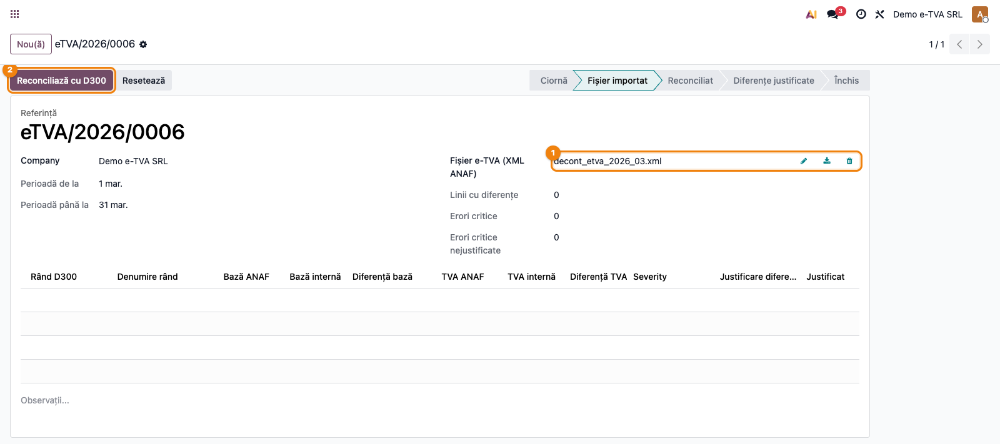
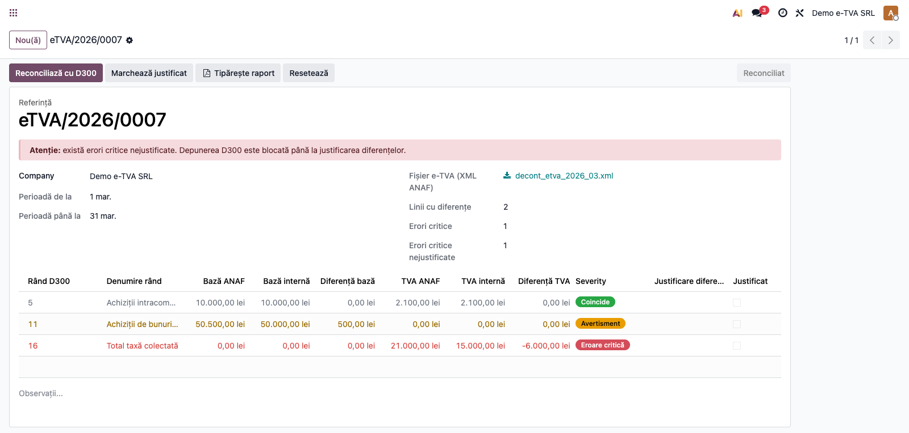
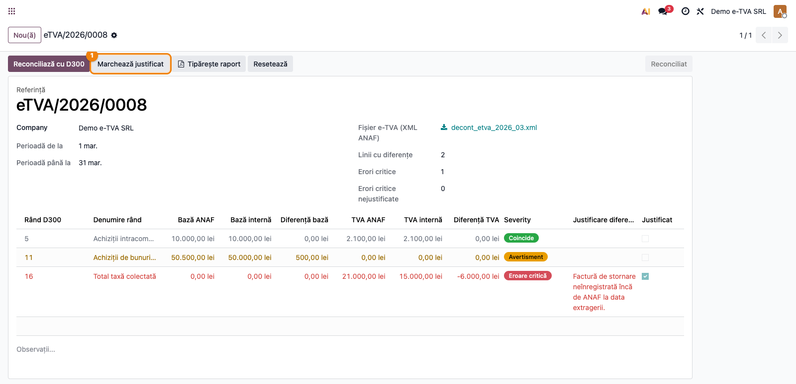

# Fișă Modul: Reconcilierea decontului precompletat RO e-TVA

**Modul:** `l10n_ro_saft_etva`
**FR:** FR-05 ext. / FR-25(b)
**Utilizator principal:** Contabil TVA
**Prioritate:** 🟡 Medie (lunar, înainte de depunerea D300)

---

## 1. Scop business

Această fișă descrie utilizarea modulului `l10n_ro_saft_etva` pentru **reconcilierea decontului
precompletat RO e-TVA** primit de la ANAF cu Decontul de TVA (D300) calculat intern în Odoo. ANAF
generează lunar, pe baza datelor deja deținute (e-Factura, e-Transport, SAF-T, case de marcat), un
decont de TVA pre-completat, transmis prin SPV. Modulul importă acest fișier, îl compară **rând cu
rând** cu D300-ul intern și evidențiază diferențele, gradate pe severitate, **înainte de depunere**.

## 2. Bază legală și context

OUG 70/2024 — sistemul RO e-TVA: începând cu august 2024, ANAF transmite contribuabililor, prin SPV,
un decont de TVA pre-completat. La diferențe semnificative față de propriul decont, contribuabilul
primește o „Notificare de conformare RO e-TVA" la care trebuie să răspundă, în general, în **20 de zile**
de la primire. Modulul acoperă latura (b) a cerinței FR-25 (SAF-T): importul fișierului e-TVA și
reconcilierea automată față de D300-ul calculat de modulul `l10n_ro_anaf_d300`, tocmai pentru a depista
și explica diferențele înainte de a primi notificarea.

> Decontul precompletat are aceeași structură ca formularul D300 (atribute pe rânduri `R<rând>_<col>`,
> coloana 1 = bază, coloana 2 = TVA), deci reconcilierea se face rând cu rând cu D300-ul intern.

## 3. Utilizatori și roluri

Contabil TVA / responsabil declarații.

Roluri recomandate pentru testare:
- Administrator funcțional: instalează modulul și configurează pragurile.
- Contabil TVA: importă fișierul e-TVA, reconciliază și justifică diferențele.
- Manager financiar: validează rezultatul înainte de depunerea D300.

## 4. Conturi și date implicate

Modulul **nu generează note contabile** — este un instrument de reconciliere și control. Datele
implicate:
- fișierul XML „Decont precompletat de TVA" descărcat din SPV;
- valorile D300 interne, calculate de `l10n_ro_anaf_d300` pe aceeași perioadă (rândurile R1..R44);
- praguri de severitate configurabile pe companie (valoric + procentual).

Date minime pentru demo:
- companie românească cu localizarea contabilă și modulul `l10n_ro_anaf_d300` instalate;
- o perioadă de TVA cu facturi postate (pentru valorile D300 interne);
- fișierul XML e-TVA aferent perioadei.

## 5. Configurare inițială

1. Instalați modulul `l10n_ro_saft_etva` (depinde de `l10n_ro_anaf_d300`).
2. În **Contabilitate → Configurare → Setări**, secțiunea declarațiilor ANAF, setați pragurile de la
   care o diferență devine **eroare critică**: **Prag valoric** (implicit 1.000 RON) și **Prag
   procentual** (implicit 20%). O diferență e critică doar dacă depășește **ambele** praguri.
3. Asigurați-vă că aveți date de TVA postate în perioadă (pentru calculul D300 intern).
4. Verificați că utilizatorul de test are grupul **Contabilitate / Contabil**.

## 6. Flux de utilizare

### Pasul 1 — Importul decontului precompletat

Descărcați din SPV fișierul XML „Decont precompletat de TVA" pentru perioadă. Accesați
**Contabilitate → Raportare → e-TVA → Reconciliere decont precompletat** și creați o reconciliere nouă:
alegeți perioada (de la / până la), încărcați fișierul XML și apăsați **Importă fișierul**.

> Alternativ, decontul poate fi deschis direct din **checklistul de închidere a perioadei de TVA**
> (return-ul de TVA), prin verificarea „Reconciliere e-TVA", care creează/deschide automat reconcilierea
> pentru perioada respectivă.



### Pasul 2 — Reconcilierea cu D300 intern

Apăsați **Reconciliază cu D300**. Sistemul calculează valorile D300 interne pe aceeași perioadă și le
compară rând cu rând cu cele din fișierul ANAF. Pentru fiecare rând se afișează: bază/TVA ANAF, bază/TVA
internă, diferența și **severitatea**:
- **Coincide** — fără diferență;
- **Avertisment** — diferență nenulă, sub praguri;
- **Eroare critică** — diferență peste ambele praguri (valoric + procentual).

Dacă există erori critice nejustificate, un banner avertizează că depunerea D300 este blocată.



### Pasul 3 — Justificarea diferențelor și închiderea

Completați **Justificarea** pe fiecare linie cu eroare critică (de exemplu: factură stornată
neînregistrată încă de ANAF, decalaj de raportare). După ce toate diferențele critice au justificare,
apăsați **Marchează justificat** și apoi **Închide** pentru a finaliza decontul (starea „Închis"). Cât
timp există erori critice nejustificate, verificarea e-TVA din checklistul de închidere a perioadei de
TVA rămâne blocată.



### Note de monografie și raportare

Modulul **nu produce note contabile**. Rezultatul este un raport de reconciliere (cu export PDF) și o
**verificare blocantă** în return-ul de TVA (`account.return`): diferențele critice nejustificate
împiedică închiderea verificării e-TVA până la explicarea lor. Valorile D300 interne provin integral
din modulul `l10n_ro_anaf_d300` (nu sunt recalculate aici), deci reconcilierea este coerentă cu
declarația D300 efectiv depusă.

## 7. Legături cu alte module / declarații

| Modul / proces | Rol în flux | Tip legătură |
|---|---|---|
| `l10n_ro_anaf_d300` | sursa valorilor D300 interne (rânduri R1..R44) | dependență (manifest) |
| `l10n_ro_reports` | tipul de return TVA pe care se adaugă verificarea e-TVA | dependență (manifest) |
| `l10n_ro` | plan de conturi și taxe RO | dependență (manifest) |
| `account` | datele de TVA din care se calculează D300 intern | dependență (manifest) |

Ce este automat: importul valorilor ANAF din XML, calculul D300 intern, reconcilierea rând cu rând,
severitatea pe praguri și blocarea închiderii verificării e-TVA.
Ce rămâne manual: descărcarea fișierului din SPV, justificarea diferențelor critice și decizia de
corectare a D300 sau de răspuns la notificarea de conformare.

## 8. Verificări pentru consultant

- [ ] Modulul se instalează fără erori (cu `l10n_ro_anaf_d300` prezent).
- [ ] Meniul **Contabilitate → Raportare → e-TVA → Reconciliere decont precompletat** este vizibil.
- [ ] Un fișier XML care nu conține atribute D300 (`R<rând>_<col>`) este respins la import cu mesaj clar.
- [ ] După „Reconciliază", liniile afișează bază/TVA ANAF vs. intern și diferența.
- [ ] Severitatea respectă pragurile: diferență mică → avertisment; diferență mare → eroare critică.
- [ ] O eroare critică nejustificată setează indicatorul „Blochează depunerea D300".
- [ ] „Marchează justificat" este refuzat cât timp există erori critice fără justificare.

## 9. Mesaje de eroare frecvente

| Mesaj / simptom | Cauză probabilă | Remediere |
|-----------------|-----------------|-----------|
| „Încărcați mai întâi fișierul e-TVA primit de la ANAF." | S-a apăsat „Importă" fără fișier atașat | Atașați fișierul XML descărcat din SPV |
| „Fișierul nu este un XML valid: …" | Fișier corupt sau alt format | Descărcați din nou fișierul din SPV |
| „Nu am găsit valori D300 (atribute R<rând>_<coloană>) în fișier." | Fișierul nu este decontul precompletat în format XML ANAF | Verificați că ați descărcat decontul precompletat, nu alt document |
| „Modulul D300 (l10n_ro_anaf_d300) nu este disponibil." | Lipsește modulul de declarație D300 | Instalați `l10n_ro_anaf_d300` |
| „Există … erori critice fără justificare." | S-a apăsat „Marchează justificat" cu linii critice negustificate | Completați justificarea pe fiecare linie critică |

## 10. Capturi de ecran

Capturile (`readme/screenshots/`) sunt **generate automat** din `tests/test_screenshots.py`
(mixinul `ScreenshotCase` din `l10n_ro_doc_screenshots`, import defensiv), în **limba română**,
pe planul de conturi RO (`setup_country("ro")`):

1. `01_decont_import.png` — decontul e-TVA cu fișierul importat.
2. `02_reconciliere.png` — reconcilierea rând cu rând, cu severități și banner de blocaj.
3. `03_justificare.png` — justificarea unei diferențe critice.

Regenerare:

```bash
./odoo/odoo-bin -c odoo.conf -d <db> -i l10n_ro_saft_etva,l10n_ro_doc_screenshots \
    --test-tags=fise_screenshots --stop-after-init
```

## 11. Observații pentru manual

În manualul final, păstrați explicația orientată pe activitate: ce este decontul precompletat RO e-TVA,
de unde se descarcă, cum se citește reconcilierea (bază/TVA ANAF vs. intern, severitate) și ce
înseamnă blocarea depunerii. Subliniați că modulul nu modifică contabilitatea — este un instrument de
control care previne depunerea unui D300 cu diferențe neexplicate față de datele ANAF.
