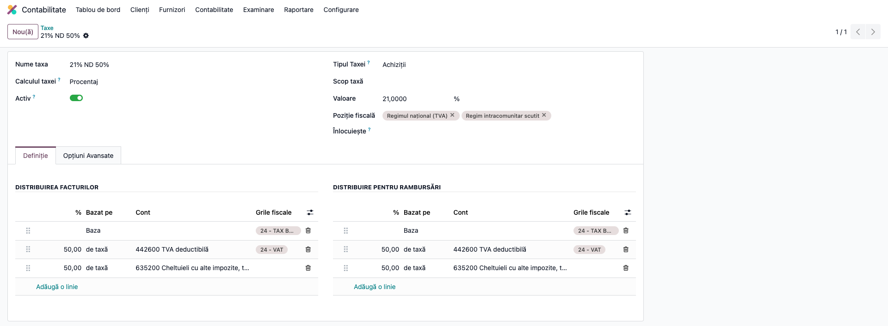
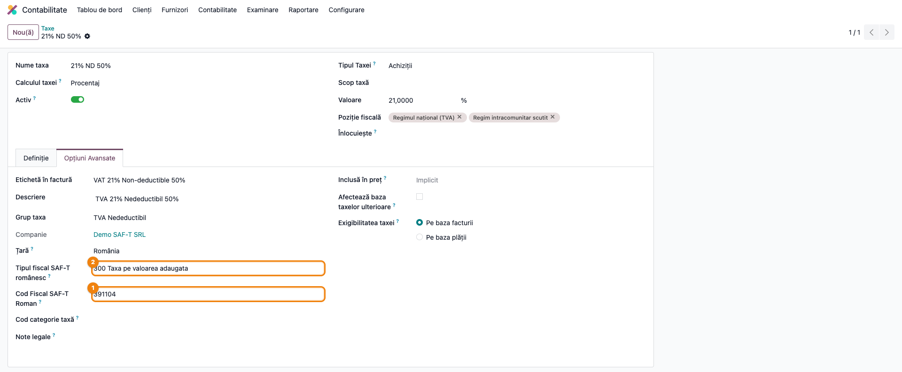
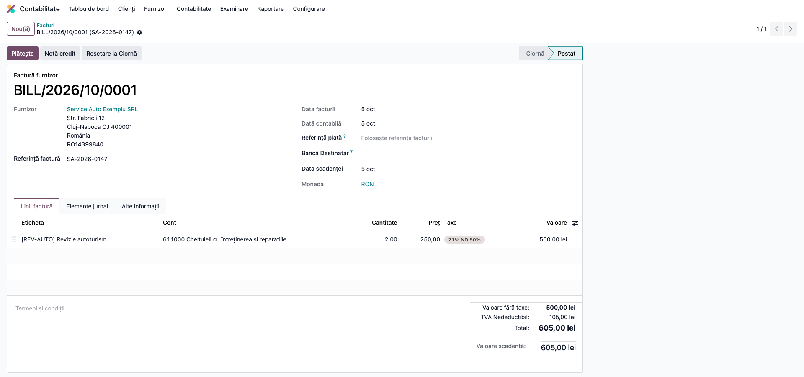
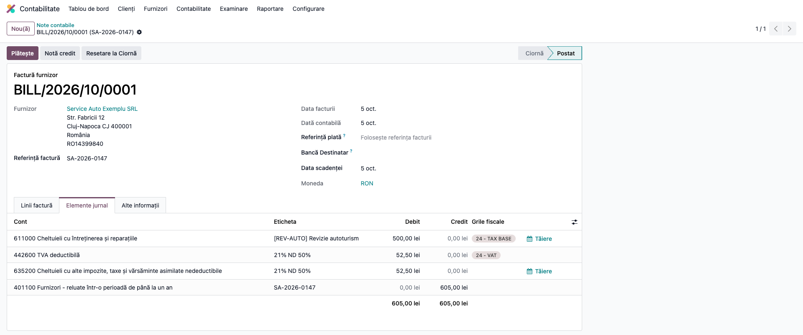
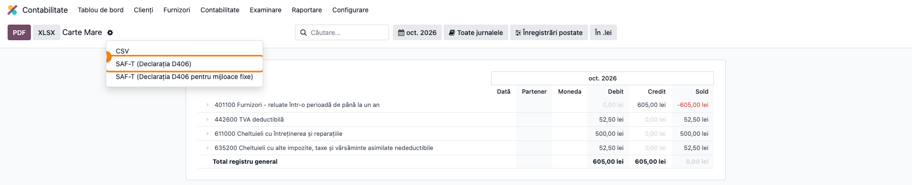

# Fișă Modul: SAF-T D406 — TVA cu deducere limitată la 50% și alte corecții de export

**Modul:** `l10n_ro_saft_export_fix` (peste `l10n_ro_saft` Enterprise)
**Utilizator principal:** Contabil, Responsabil SAF-T
**Prioritate:** 🔴 Ridicată (fără corecții, declarația D406 e respinsă sau raportează greșit TVA-ul dedus)

---

## 1. Scop business

Modulul corectează trei defecte ale exportului SAF-T D406 din Odoo Enterprise, toate vizibile doar
în fișierul XML generat:

1. **TVA cu deducere limitată la 50%.** Taxa standard „21% ND 50%” (autoturisme, combustibil,
   reparații auto) duce jumătate din TVA în 4426 și jumătate pe cheltuială (6352). Exportul standard
   raporta **toată** taxa cu codul „Achiziții nedeductibile 50%” (391104), deci și partea dedusă.
   Cu modulul, partea din 4426 primește codul deductibil 341104, iar doar partea de pe cheltuială
   rămâne pe 391104.
2. **Secțiuni goale.** O lună fără achiziții sau fără plăți producea secțiuni goale, iar validatorul
   ANAF respingea întregul fișier.
3. **Plăți fără extras.** Plățile înregistrate din factură („Înregistrează plata”) și operațiunile
   de casă nu ajungeau în declarație.

Fișa detaliază fluxul pentru deducerea limitată la 50%, singurul care cere o verificare din partea
contabilului. Celelalte două corecții sunt automate (vezi secțiunea 7).

## 2. Bază legală și context

- **Codul fiscal (Legea 227/2015), art. 298** — limitarea la 50% a dreptului de deducere a TVA
  pentru vehiculele rutiere motorizate care nu sunt folosite exclusiv în scop economic și pentru
  cheltuielile legate de acestea (combustibil, reparații, întreținere).
- **OPANAF 1783/2021**, cu modificările ulterioare — structura și termenele declarației D406.
- **Nomenclatorul ANAF de coduri SAF-T** (RO_SAFT_SchemaDefCod, versiunea din 16.02.2026), foile
  „Achizitii ded 50%” și „Achizitii neded 50%”. Nota „Situația 1” prevede că, pentru o factură
  înregistrată direct cu deducere de 50%, se folosesc **ambele** coduri: 341104 (deductibil, 21%)
  și 391104 (nedeductibil, 21%). Codul 341104 corespunde rândului 24 din D300.

## 3. Utilizatori și roluri

- **Contabil** — înregistrează facturile de achiziție cu taxa „21% ND 50%” și verifică nota
  contabilă.
- **Responsabil SAF-T** — generează D406 lunar/trimestrial și verifică codurile de taxă din XML
  înainte de validarea DUK Integrator.
- Rol recomandat la testare: utilizator cu drept **Contabilitate / Administrator**.

## 4. Conturi și date implicate

| Cont | Denumire | Rol în exemplu |
|------|----------|----------------|
| 611 | Cheltuieli cu întreținerea și reparațiile | baza facturii (revizie autoturism) |
| 4426 | TVA deductibilă | 50% din TVA — partea dedusă, cod SAF-T **341104** |
| 6352 | Cheltuieli cu alte impozite, taxe și vărsăminte asimilate nedeductibile | 50% din TVA — partea nededusă, cod SAF-T **391104** |
| 401 | Furnizori | totalul facturii |

Date minime pentru demo:

- companie RO cu planul de conturi RO și `l10n_ro_saft` + `l10n_ro_saft_export_fix` instalate;
- taxa de achiziție **„21% ND 50%”** activă (vine din planul de conturi RO);
- un furnizor român cu CUI și un articol de tip serviciu „Revizie autoturism” cu cont de
  cheltuială 611.

## 5. Configurare inițială

1. Instalați `l10n_ro_saft_export_fix`. Modulul aduce automat `l10n_ro_saft` dacă lipsește.
2. Completați datele companiei cerute de exportul D406 (CUI, adresă, telefon, cont bancar, contact
   cu nume și telefon, baza de impozitare SAF-T). Pre-validatorul `l10n_ro_saft_validator` le
   verifică pe toate.
3. Deschideți taxa „21% ND 50%” și verificați repartiția și codul SAF-T (Pașii 1 și 2 de mai jos).
4. Pe articolul „Revizie autoturism”, setați contul de cheltuială 611 și taxa de achiziție
   „21% ND 50%”.

## 6. Flux de utilizare

### Pasul 1 — Verificați repartiția taxei „21% ND 50%”

**Contabilitate → Configurare → Taxe**, căutați „21% ND 50%” și deschideți taxa. Tab-ul
**Definiție** se deschide implicit.

Pe ecran verificați că în **Distribuirea facturilor** (și la fel în **Distribuire pentru
rambursări**) există **două linii de taxă de câte 50%**:

- una pe contul **4426 TVA deductibilă**, cu grila fiscală **„24 - VAT”**;
- una pe contul **6352 Cheltuieli cu alte impozite, taxe și vărsăminte asimilate nedeductibile**,
  fără grilă fiscală.



### Pasul 2 — Verificați codul SAF-T al taxei

Pe aceeași taxă, deschideți tab-ul **Opțiuni Avansate**. Verificați că:

- **Cod Fiscal SAF-T Roman** ① (codul SAF-T al taxei) este **391104**;
- **Tipul fiscal SAF-T românesc** ② este **300** (taxa pe valoarea adăugată).

Codul de pe taxă rămâne 391104: modulul nu îl schimbă. Separarea pe 341104 se face la export,
după contul fiecărei linii de repartiție. Linia pe 4426 intră în decontul de TVA, deci e
deductibilă. Linia pe 6352 e o cheltuială, deci e nededusă.



### Pasul 3 — Înregistrați factura de achiziție

**Contabilitate → Furnizori → Facturi → Nou**:

- **Furnizor:** furnizorul român;
- **Data facturii:** în perioada de raportare;
- linie: **Revizie autoturism**, cantitate **2**, preț unitar **250,00 lei**, taxă
  **21% ND 50%**.

Verificați totalurile din subsolul facturii: **Valoare fără taxe 500,00 lei**, **TVA Nedeductibil
105,00 lei** (eticheta grupului de taxe cuprinde ambele jumătăți), **Total 605,00 lei**. Apăsați
**Confirmare**.



### Pasul 4 — Verificați nota contabilă

Pe factura confirmată, deschideți tab-ul **Elemente jurnal**.

Pe ecran verificați că TVA-ul de 105,00 lei e împărțit **în două linii egale**: 52,50 lei pe
**4426** și 52,50 lei pe **6352**. Dacă vedeți o singură linie de TVA de 105,00 lei, factura a
fost înregistrată cu altă taxă. Corectați taxa înainte de export.



#### Note de monografie și raportare

| Cont debitor | Cont creditor | Sumă (lei) | Explicație | Cod SAF-T |
|---|---|---:|---|---|
| 611 | 401 | 500,00 | revizie autoturism, bază | — |
| 4426 | 401 | 52,50 | TVA dedus 50% | **341104** |
| 6352 | 401 | 52,50 | TVA nededus 50% | **391104** |

În D300, partea din 4426 se regăsește pe rândul 24 (eticheta „24 - VAT”). Partea din 6352 nu intră
în decont.

### Pasul 5 — Generați declarația D406

**Contabilitate → Raportare → Carte Mare**:

1. **Găsiți pe ecran** — selectați luna facturii. În raport, contul **4426** arată un rulaj debitor
   de 52,50 lei, iar contul **6352** arată tot 52,50 lei.
2. **Verificați** — cele două rulaje sunt egale și împreună dau TVA-ul facturii (105,00 lei).
   Perioada selectată corespunde lunii sau trimestrului de raportare.
3. **Exportați** — deschideți meniul cu rotița (⚙) de lângă titlul raportului și alegeți
   **SAF-T (Declarația D406)** ①. Se descarcă fișierul XML.



### Pasul 6 — Verificați codurile de taxă în XML

Deschideți fișierul XML într-un editor de text și căutați factura după număr. Pe linia facturii
(`InvoiceLine`, în `SourceDocuments/PurchaseInvoices`) trebuie să apară **două** elemente
`TaxInformation`: 52,50 lei cu codul **341104** și 52,50 lei cu codul **391104**.

```xml
<InvoiceLine>
  <AccountID>611000</AccountID>
  <Quantity>2.0</Quantity>
  <InvoiceUOM>C62</InvoiceUOM>
  <UnitPrice>250.00</UnitPrice>
  <Description>[REV-AUTO] Revizie autoturism</Description>
  <InvoiceLineAmount>
    <Amount>500.00</Amount>
    <CurrencyCode>RON</CurrencyCode>
  </InvoiceLineAmount>
  <DebitCreditIndicator>D</DebitCreditIndicator>
  <TaxInformation>
    <TaxType>300</TaxType>
    <TaxCode>341104</TaxCode>
    <TaxPercentage>21.0</TaxPercentage>
    <TaxBaseDescription>21% ND 50%</TaxBaseDescription>
    <TaxAmount>
      <Amount>52.50</Amount>
      <CurrencyCode>RON</CurrencyCode>
    </TaxAmount>
  </TaxInformation>
  <TaxInformation>
    <TaxType>300</TaxType>
    <TaxCode>391104</TaxCode>
    <TaxPercentage>21.0</TaxPercentage>
    <TaxBaseDescription>21% ND 50%</TaxBaseDescription>
    <TaxAmount>
      <Amount>52.50</Amount>
      <CurrencyCode>RON</CurrencyCode>
    </TaxAmount>
  </TaxInformation>
</InvoiceLine>
```

Verificați același lucru în două locuri:

- în `GeneralLedgerEntries`, pe `TransactionLine` cu contul 611000 apar aceleași două coduri și sume;
- în `MasterFiles/TaxTable` există câte o intrare `TaxTableEntry` pentru **341104** și una pentru
  **391104**.

Abia după aceste verificări treceți fișierul prin DUK Integrator.

## 7. Legături cu alte module / declarații

| Modul | Rol |
|-------|-----|
| `l10n_ro_saft` (Enterprise) | exportul D406 propriu-zis; acest modul îi corectează rezultatul |
| `l10n_ro_saft_fix` | corectează codurile SAF-T ale taxelor de 21%/11% la instalare (ex. „21% ND 50%” → 391104) |
| `l10n_ro_saft_validator` | pre-validare înainte de export (date companie, parteneri, secțiuni goale, plăți fără extras) |
| `l10n_ro_vat_deductibility` | configurarea deductibilității TVA (integral / parțial / nedeductibil); vezi fișa lui pentru alegerea taxei |
| `l10n_ro_anaf_d300` | decontul de TVA: partea deductibilă (4426) apare pe rândul 24 |

**Ce e automat:**

- separarea TVA-ului „ND 50%” pe 341104 / 391104, la fiecare export, pentru cotele 21%, 19%, 11%,
  9% și 5% (391101–391105 → 341101–341105);
- omiterea secțiunilor `SalesInvoices`, `PurchaseInvoices` și `Payments` când perioada nu are
  documente de acel tip;
- includerea plăților fără extras bancar (din „Înregistrează plata” și din casă). O plată
  reconciliată cu un extras se raportează o singură dată, prin extras.

**Ce rămâne manual:**

- alegerea taxei „21% ND 50%” pe factură sau pe articol;
- **Situația 2** din nomenclator (TVA dedus integral la factură, apoi ajustat la 50% printr-o notă
  separată 6xx = 4426) **nu** este tratată de modul. Nota de ajustare trebuie să poarte codul
  391104, iar factura se înregistrează cu taxa de 21% deductibilă integral;
- validarea finală cu DUK Integrator.

## 8. Verificări pentru consultant

- [ ] Taxa „21% ND 50%” are două linii de repartiție de câte 50%: 4426 (eticheta „24 - VAT”) și 6352.
- [ ] Codul SAF-T al taxei este 391104, iar tipul este 300.
- [ ] Factura 2 × 250 lei are TVA 105,00 lei, împărțit în 52,50 lei pe 4426 și 52,50 lei pe 6352.
- [ ] În Carte Mare, pe luna facturii, rulajele 4426 și 6352 sunt egale.
- [ ] În XML, `InvoiceLine` are 52,50 lei pe 341104 și 52,50 lei pe 391104.
- [ ] În XML, `TransactionLine` pe 611 are aceleași două coduri și sume.
- [ ] `TaxTable` conține intrări pentru 341104 și 391104.
- [ ] O lună fără facturi de achiziție nu produce secțiunea `PurchaseInvoices` goală.
- [ ] O plată înregistrată din factură, fără extras, apare în secțiunea `Payments`.
- [ ] Fișierul trece prin DUK Integrator fără erori.

## 9. Mesaje de eroare frecvente

| Mesaj / simptom | Cauză | Remediere |
|---|---|---|
| În XML apare doar 391104, cu toată suma TVA | factura a fost înregistrată cu o taxă care duce tot TVA-ul pe cheltuială, sau modulul nu e instalat | verificați repartiția taxei (Pasul 1) și că `l10n_ro_saft_export_fix` e instalat |
| În XML apare 341104 cu suma întreagă, fără 391104 | taxa folosită are ambele linii pe conturi de TVA (nicio linie pe cheltuială) | corectați repartiția: a doua linie trebuie să fie pe 6352 |
| Taxa „21% ND 50%” are codul 391101 | codul vechi de 19%, copiat greșit de `l10n_ro_saft` | instalați `l10n_ro_saft_fix`, care îl corectează la 391104 |
| DUK: „elementul 'Payment' ar fi trebuit sa apara de minimum 1 ori” | versiune fără modul: secțiunea `Payments` era scrisă goală | instalați modulul și regenerați XML-ul |
| Plățile din casă lipsesc din declarație | exportul standard lua doar plățile din extrase bancare | instalați modulul și regenerați XML-ul |

## 10. Capturi de ecran

Capturile sunt **generate automat** de `tests/test_screenshots.py` (mixinul `ScreenshotCase` din
`l10n_ro_doc_screenshots`, import defensiv), în română, pe planul de conturi RO. Regenerare:

```bash
./odoo/odoo-bin -c odoo.conf -d <db> -u l10n_ro_saft_export_fix -i l10n_ro_doc_screenshots --test-tags=/l10n_ro_saft_export_fix:TestSaftExportFixScreenshots --stop-after-init
```

| # | Fișier | Conținut |
|---|--------|----------|
| 1 | `screenshots/01_taxa_21_nd_50.png` | Taxa „21% ND 50%”, tab Definiție: repartiția 4426 („24 - VAT”) / 6352, câte 50% |
| 2 | `screenshots/02_taxa_cod_saft.png` | Aceeași taxă, tab Opțiuni Avansate: Cod Fiscal SAF-T Roman 391104 ① și tipul SAF-T 300 ② |
| 3 | `screenshots/03_factura_achizitie_nd_50.png` | Factura de achiziție 2 × 250 lei cu taxa „21% ND 50%”: 500,00 + 105,00 = 605,00 lei |
| 4 | `screenshots/04_nota_contabila_nd_50.png` | Elementele de jurnal: 611 (500,00), 4426 (52,50), 6352 (52,50), 401 (605,00) |
| 5 | `screenshots/05_carte_mare_export_d406.png` | Carte Mare pe luna facturii, cu meniul ⚙ deschis și opțiunea „SAF-T (Declarația D406)” ① evidențiată |

Extrasul XML din Pasul 6 e text inline, nu imagine.

## 11. Observații pentru manual

- Situația cu deducere limitată la 50% trebuie explicată prin **perechea de coduri**: ANAF vrea să
  vadă separat ce s-a dedus (341104) și ce nu (391104). O singură linie cu 391104 pe toată suma
  subraportează TVA-ul dedus și nu se mai potrivește cu rândul 24 din D300.
- Codul de pe taxă rămâne 391104. Nu sfătuiți utilizatorii să-l schimbe manual în 341104: ar muta
  și partea nededusă pe codul deductibil.
- Pentru cota de 11%, codurile 341105 / 391105 apar în nomenclatorul 2026 marcate „x - Inactiv”.
  Deducerea limitată se aplică în practică la cota standard de 21%.
- Exemplul folosește o revizie auto (cont 611). Pentru combustibil, baza merge pe 6022, iar
  codurile SAF-T sunt aceleași.
