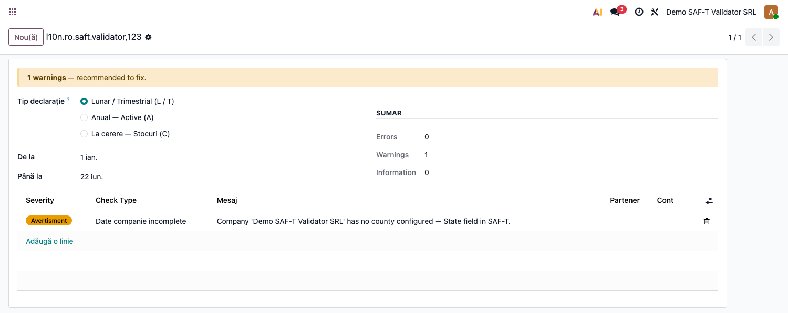

# Fișă Modul: Pre-Validator SAF-T D406 — Overview

**Modul:** `l10n_ro_saft_validator`
**FR:** FR-05 (SAF-T D406)
**Capitol manual:** Cap 5 / SAF-T
**Utilizator principal:** Contabil, Responsabil SAF-T
**Prioritate:** Medie

---

## 1. Scop business

Modulul rulează verificări **înainte** de generarea fișierului SAF-T D406, identificând datele
incomplete care ar duce la respingerea declarației de către ANAF (parteneri fără CUI, conturi
nemapate, active fără categorie SAF-T, tipuri de operație stoc fără cod etc.). Consultantul îl
prezintă ca pas de „pre-flight" care reduce erorile la validarea oficială DUK Integrator.

## 2. Bază legală și context

- **OPANAF 1783/2021** și actualizările — structura SAF-T D406 (fișierul standard de audit fiscal).
- Validarea oficială se face cu DUK Integrator; acest modul previne erorile uzuale înainte de export.

## 3. Cele trei spețe D406

D406 are patru tipuri de depunere indicate în câmpul `HeaderComment` din XML. Modulul tratează
cele trei spețe operaționale principale; vezi fișa dedicată pentru fluxul end-to-end:

| Tip | Cod ANAF | Conținut SAF-T | Fișa dedicată |
|-----|----------|----------------|----------------|
| Lunar / Trimestrial | **L** / **T** | GL + facturi + plăți + taxe + parteneri | [`FISA_CONSULTANT_LT.md`](FISA_CONSULTANT_LT.md) |
| Anual (Active) | **A** | Assets + AssetTransactions | [`FISA_CONSULTANT_A.md`](FISA_CONSULTANT_A.md) |
| La cerere (Stocuri) | **C** | PhysicalStocks + MovementOfGoods | [`FISA_CONSULTANT_C.md`](FISA_CONSULTANT_C.md) |

> Câmpul **Tip declarație** din wizard activează setul de verificări corespunzător. Verificarea de
> companie (CUI, adresă, județ) rulează pentru toate cele trei spețe.

## 4. Module Odoo implicate

| Modul | Rol |
|-------|-----|
| `l10n_ro_saft_validator` (acest modul) | pre-validare conform celor 3 spețe |
| `l10n_ro_saft` | export D406 — buton lunar (L/T) + buton **Asset Declaration** (A) |
| `l10n_ro_saft_stock` | export D406 — buton **Stocks** (C); câmp `l10n_ro_stock_movement_type` pe tip operație |
| `l10n_ro` | plan de conturi și structura fiscală RO |
| DUK Integrator (extern) | validare oficială ANAF înainte de depunere |

## 5. Verificări pe tip declarație

| Verificare | LT | A | C | Severitate |
|---|---|---|---|---|
| `company_incomplete` (date companie) | ✓ | ✓ | ✓ | error / warning |
| `partner_no_vat` (parteneri fără CUI) | ✓ |  |  | error / warning |
| `partner_no_country` / `partner_invalid_country` | ✓ |  |  | error / warning |
| `account_no_type` (conturi nemapate) | ✓ |  |  | error |
| `tax_no_saft_type` (taxe fără tip SAF-T) | ✓ |  |  | warning |
| `asset_no_saft_category` (active fără categorie SAF-T) |  | ✓ |  | error |
| `picking_type_no_movement_type` (tip operație stoc fără cod SAF-T) |  |  | ✓ | error |
| `uom_no_unece_code` (UoM fără cod UNECE) |  |  | ✓ | warning |

## 6. Flux general

1. Deschideți **Contabilitate → Raportare → SAF-T Validator**.
2. Selectați **Tip declarație** (LT / A / C).
3. Apăsați **Validate** — wizardul afișează lista problemelor.
4. Corectați datele (vezi fișa dedicată).
5. Re-rulați până când lista e goală.
6. Generați D406 din raportul **General Ledger** (l10n_ro_saft / l10n_ro_saft_stock).

## 7. Capturi de ecran

Capturile per variantă sunt în fișele dedicate (`FISA_CONSULTANT_LT.md`, `_A.md`, `_C.md`).

**Wizard cu Tip declarație vizibil ①:**

| # | Fișier | Conținut |
|---|--------|----------|
| 1 | `screenshots/01_saft_validator_wizard.png` | Wizard validare ① — radio Tip declarație (LT/A/C) + sumar Errors/Warnings + lista problemelor |
