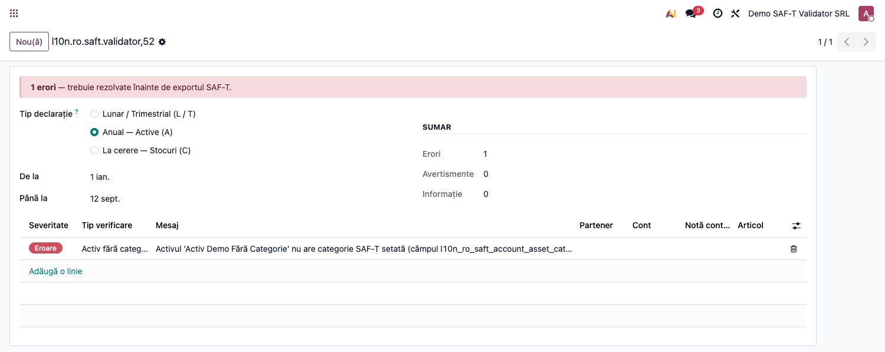
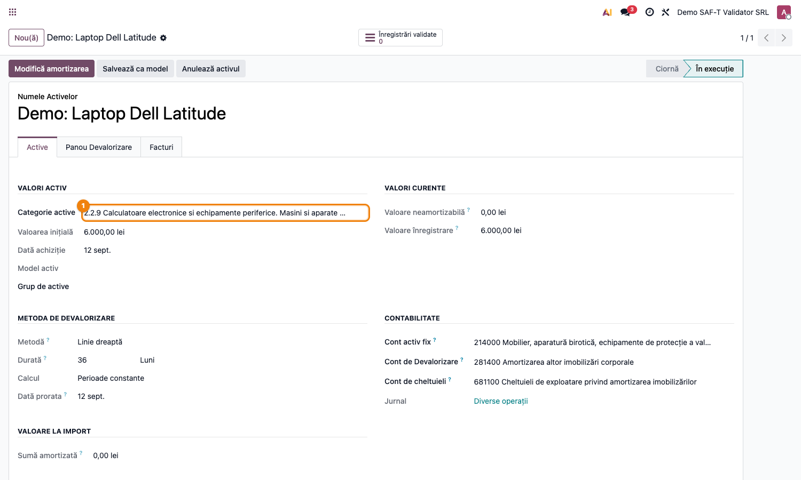
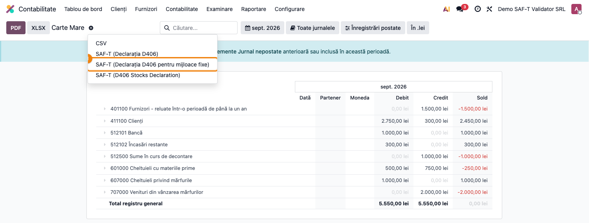

# Fișă Modul: SAF-T D406 — Speța A (Anual — Active)

**Modul:** `l10n_ro_saft_validator` + `l10n_ro_saft`
**Tip declarație ANAF:** **A** (anual)
**Capitol manual:** Cap 5 / SAF-T / Anual Active
**Utilizator principal:** Contabil, Responsabil Active fixe
**Prioritate:** Anuală (o singură depunere pe an)

---

## 1. Scop business

D406 Anual cuprinde **doar secțiunea Active** (Assets) din SAF-T — registrul activelor fixe ale
companiei și mișcările lor pe anul de raportare (achiziții, reevaluări, amortizări, casări,
vânzări). Se depune **o singură dată pe an**, până în ultima zi a lunii următoare închiderii
exercițiului financiar.

## 2. Bază legală

- **OPANAF 1783/2021** cu modificările și completările ulterioare — natura informațiilor SAF-T,
  inclusiv secțiunile `MasterFiles/Assets` și `SourceDocuments/AssetTransactions` care
  formează declarația anuală pe active.
- Codul depunerii în câmpul `HeaderComment` al XML: **`A`** (dedus de Odoo când perioada =
  `year` / `fiscalyear`).

## 3. Utilizatori și roluri

- Responsabil Active fixe: completează categoria SAF-T pe fiecare activ.
- Contabil: rulează validatorul + exportul la închiderea exercițiului.

## 4. Date implicate

- companie (CUI, adresă, județ);
- toate activele (`account.asset`) ale companiei, indiferent de stare (open/paused/close);
- **categoria SAF-T** mapată pe fiecare activ — câmpul
  `account.asset.l10n_ro_saft_account_asset_category_id` (model `l10n_ro_saft.account.asset.category`,
  populat prin CSV-ul nativ Odoo cu nomenclatorul ANAF al claselor de active).

## 5. Configurare inițială

1. Instalați `l10n_ro_saft` (aduce `account_asset` + tabela categoriilor SAF-T).
2. Pentru fiecare activ în registru: setați **Asset Category** (formular Active fixe).
3. Validați că `depreciation_min` / `depreciation_max` ale categoriei corespund duratei reale
   (există un warning nativ pe activ când amortizarea anuală iese din interval).

## 6. Flux de utilizare

1. **Pre-validare:**
   1. Deschideți **Contabilitate → Raportare → SAF-T Validator**.
   2. Selectați **Tip declarație = Anual — Active (A)**.
   3. Setați **From / To** = anul fiscal (ex. 01.01.2026 → 31.12.2026).
   4. Apăsați **Validate** — sunt listate activele fără categorie SAF-T.
   5. Corectați (setați **Asset Category** pe fiecare activ) și re-rulați.
2. **Generare D406 Active:**
   1. Deschideți **Contabilitate → Raportare → Carte Mare**.
   2. Selectați perioada = **anul fiscal** complet.
   3. Apăsați **SAF-T (D406 Asset Declaration)** — buton separat de cel lunar.
   4. Descărcați XML-ul.
3. **Validare oficială:** rulați prin DUK Integrator.
4. **Depunere:** încărcați în portal ANAF.

## 7. Reguli funcționale (verificări rulate pentru A)

| Verificare | Severitate | Ce semnalează |
|---|---|---|
| `company_incomplete` | error / warning | date companie lipsă: CUI, adresă, județ, telefon, cont bancar, bază de impozitare SAF-T, contact cu nume din două cuvinte și telefon |
| `asset_no_saft_category` | error | active fără `l10n_ro_saft_account_asset_category_id` |

> Verificarea **NU rulează** check-urile de parteneri / conturi / taxe (irelevante pentru A);
> declarația anuală conține doar registrul de active.

> **Verificarea de companie s-a înăsprit.** Telefonul, contul bancar și baza de impozitare SAF-T
> opresc exportul Enterprise înainte să genereze fișierul, iar lipsa unui contact cu nume din două
> cuvinte și telefon lasă declarația fără elementul obligatoriu `Contact` — respinsă de validatorul
> ANAF fără ca Odoo să semnaleze ceva. Toate patru se aplică și acestei spețe.

## 8. Scenarii de test pentru consultant

| ID | Scenariu | Rezultat așteptat |
|---|---|---|
| A-01 | Activ nou fără Asset Category | problemă `asset_no_saft_category` error |
| A-02 | Activ cu Asset Category dar fără reevaluare | listă goală, export OK |
| A-03 | Activ vândut în an (cu disposal) | apare în AssetTransactions |
| A-04 | Activ casat (disposal) în an | apare în AssetTransactions cu motiv |
| A-05 | Toate activele cu categorie | listă goală → export D406 cu HeaderComment `A` |

## 9. Legături cu alte module / declarații

| Modul | Rol |
|---|---|
| `account_asset` (Enterprise) | registrul de active fixe |
| `l10n_ro_saft` (Enterprise) | categoria SAF-T pe activ + buton export A |

## 10. Verificări pentru consultant

- [ ] Tip declarație în wizard = **A**.
- [ ] Perioada = anul fiscal complet.
- [ ] Compania are CUI, adresă, județ, telefon, cont bancar, bază de impozitare SAF-T și un contact cu nume și telefon.
- [ ] Toate activele active sau închise în an au **Asset Category** setată.
- [ ] Nu există active fără valoare de inventar sau cu durată = 0.
- [ ] Soldurile activelor SAF-T = soldurile claselor 21x/28x din D300/balanță.
- [ ] XML-ul exportat are `HeaderComment = A` și trece prin DUK Integrator.

## 11. Mesaje de eroare frecvente

| Simptom | Cauză | Remediere |
|---|---|---|
| Exportul refuză să pornească, fără fișier generat | lipsesc telefonul, contul bancar sau baza de impozitare SAF-T ale companiei | rulați validatorul — el arată exact care dintre ele lipsește |
| DUK: „elementul 'Contact' ar fi trebuit sa apara de minimum 1 ori" | compania nu are contact cu nume din două cuvinte și telefon | adăugați un contact „Nume Prenume" cu telefon pe fișa companiei |
| Active fără categorie SAF-T | active create înainte de instalarea l10n_ro_saft | bulk-edit pe registru: setați `l10n_ro_saft_account_asset_category_id` |
| Warning galben pe formularul activului | durata setată iese din `depreciation_min`/`max` al categoriei | verificați categoria SAF-T sau ajustați durata |
| XML respins „Asset count = 0" | filtrul de perioadă în raport nu acoperă date cu mișcări | extindeți perioada pe anul fiscal complet |

## 12. Capturi de ecran

**Pas 1 — Wizard validare A** ① cu activele fără categorie SAF-T listate ca eroare:

**Pas 2 — Formular activ corect configurat** ② — câmpul **Categorie active** mapat pe o
clasă din nomenclatorul ANAF (aici **2.2.9** — Calculatoare electronice și echipamente
periferice):

**Pas 3 — Buton de export D406 Active pe raportul Carte Mare** ③ — deschis prin cog menu;
butonul **„SAF-T (Declarația D406 pentru mijloace fixe)"** generează XML-ul anual:

| # | Fișier | Conținut |
|---|--------|----------|
| 1 | `screenshots/02_saft_validator_wizard_a.png` | Wizard cu **Tip declarație = A** ① — radio Anual selectat, listă cu activele fără categorie SAF-T |
| 2 | `screenshots/02_asset_form_categorie_saft.png` | Formular activ fix ② — câmpul **Categorie active** populat cu o clasă SAF-T (nomenclator ANAF) |
| 3 | `screenshots/03_saft_export_button_a.png` | Cog menu pe Carte Mare ③ cu opțiunea **„SAF-T (Declarația D406 pentru mijloace fixe)"** evidențiată — export-ul D406 Active |
