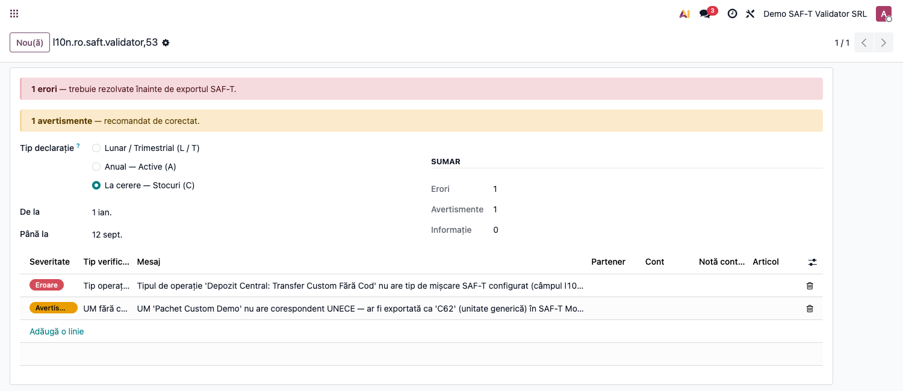
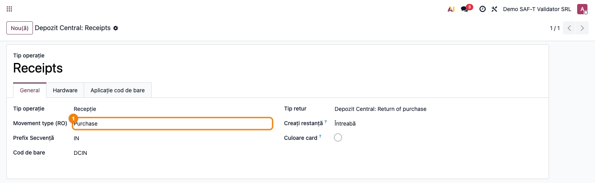
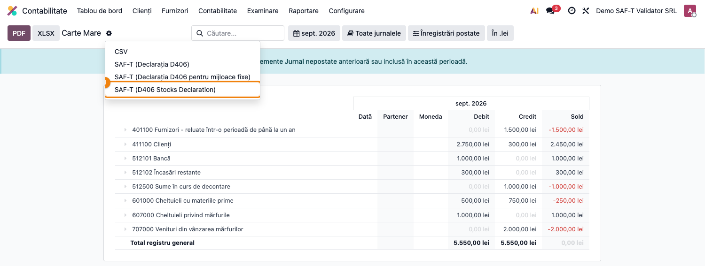

# Fișă Modul: SAF-T D406 — Speța C (La cerere — Stocuri)

**Modul:** `l10n_ro_saft_validator` + `l10n_ro_saft_stock`
**Tip declarație ANAF:** **C** (on-demand / la cerere)
**Capitol manual:** Cap 5 / SAF-T / La cerere Stocuri
**Utilizator principal:** Contabil, Gestionar stocuri
**Prioritate:** La cerere (numai când ANAF solicită explicit)

---

## 1. Scop business

D406 La cerere acoperă **secțiunea Stocuri** (PhysicalStocks + MovementOfGoods) din SAF-T — este
**pregătit, nu depus** lunar; se generează și se pune la dispoziția ANAF doar la cererea expresă
a inspectorilor fiscali (control). Perioada se stabilește prin solicitarea ANAF (de regulă o lună
sau un trimestru fiscal).

## 2. Bază legală

- **OPANAF 1783/2021** cu modificările și completările ulterioare — natura informațiilor SAF-T,
  inclusiv secțiunile `MasterFiles/PhysicalStocks`, `MasterFiles/MovementTypeTable`,
  `MasterFiles/Owners`, `SourceDocuments/MovementOfGoods` care formează declarația
  „la cerere" pe stocuri.
- Schema XSD este aceeași ca la depunerile L/T; doar `HeaderComment = C` și prezența
  obligatorie a `PhysicalStocks` + `MovementOfGoods` diferă.
- Codul depunerii în câmpul `HeaderComment` al XML: **`C`**.

## 3. Utilizatori și roluri

- Gestionar stocuri: configurează tipurile de operație stoc cu codul SAF-T corespunzător.
- Contabil: rulează validatorul + exportul la cererea ANAF.

## 4. Date implicate

- companie (CUI, adresă, județ);
- **tipuri operație stoc** (`stock.picking.type`) cu rulaj — câmpul
  `l10n_ro_stock_movement_type` (selecție 10/20/30/40/50/60/70/80 conform nomenclatorului ANAF);
- **unități de măsură** ale produselor mișcate — în Odoo 19 codul UNECE nu mai e câmp pe
  `uom.uom`, ci o **mapare hardcodată pe xml_id** (`UOM_TO_UNECE_CODE` din
  `account_edi_ubl_cii`). UoM-urile fără xml_id (custom, cum sunt baxuri, pachete) sunt
  exportate ca `C62` (unit generic) — ANAF NU acceptă această valoare;
- mișcări de stoc validate (`stock.move` în stare `done`) în perioada cerută.

## 5. Configurare inițială

1. Instalați `l10n_ro_saft_stock` (auto-install pe `l10n_ro_saft` + `stock_account`).
2. Pentru fiecare tip operație stoc activ:
   - Verificați **Tip mișcare SAF-T** (l10n_ro_stock_movement_type). Pentru tipurile create de
     warehouse-ul demo, Odoo setează valori implicite (receipts → 50, deliveries → 40); pentru
     tipuri custom completați manual codul.
3. Verificați că UoM-urile folosite au xml_id în mapping-ul UNECE (UoM-urile standard din
   modulul `uom` sunt deja mapate). UoM-urile custom (baxuri, pachete) nu au mapping și vor
   apărea în warning-ul validatorului.

## 6. Flux de utilizare

1. **Pre-validare:**
   1. Deschideți **Contabilitate → Raportare → SAF-T Validator**.
   2. Selectați **Tip declarație = La cerere — Stocuri (C)**.
   3. Setați **From / To** = perioada cerută de ANAF.
   4. Apăsați **Validate** — sunt listate tipurile de operație fără cod SAF-T și UoM-urile fără
      cod UNECE.
   5. Corectați pe formularele respective și re-rulați.
2. **Generare D406 Stocuri:**
   1. Deschideți **Contabilitate → Raportare → Carte Mare**.
   2. Selectați perioada cerută.
   3. Apăsați **SAF-T (D406 Stocks)** — buton adăugat de `l10n_ro_saft_stock`.
   4. Descărcați XML-ul.
3. **Validare oficială:** rulați prin DUK Integrator.
4. **Predare la ANAF:** încărcați XML-ul în SPV ca răspuns la solicitare.

## 7. Reguli funcționale (verificări rulate pentru C)

| Verificare | Severitate | Ce semnalează |
|---|---|---|
| `company_incomplete` | error / warning | date companie lipsă: CUI, adresă, județ, telefon, cont bancar, bază de impozitare SAF-T, contact cu nume din două cuvinte și telefon |
| `picking_type_no_movement_type` | error | tip operație stoc cu rulaj fără `l10n_ro_stock_movement_type` |
| `uom_no_unece_code` | warning | UoM folosit pe mișcări fără mapping UNECE (ar fi exportat ca `C62`) |

> Verificarea **NU rulează** check-urile de parteneri (irelevante pentru C); MovementOfGoods nu
> conține solduri pe parteneri.

> **Verificarea de companie s-a înăsprit.** Telefonul, contul bancar și baza de impozitare SAF-T
> opresc exportul Enterprise înainte să genereze fișierul, iar lipsa unui contact cu nume din două
> cuvinte și telefon lasă declarația fără elementul obligatoriu `Contact` — respinsă de validatorul
> ANAF fără ca Odoo să semnaleze ceva. Toate patru se aplică și acestei spețe.

## 8. Scenarii de test pentru consultant

| ID | Scenariu | Rezultat așteptat |
|---|---|---|
| C-01 | Tip operație custom (ex. „Transfer X") fără cod SAF-T | problemă `picking_type_no_movement_type` error |
| C-02 | UoM custom („Pachet Custom") fără xml_id în UOM_TO_UNECE_CODE | problemă `uom_no_unece_code` warning |
| C-03 | Recepție (cod 50) și livrare (cod 40) doar pe tipuri standard | listă goală |
| C-04 | Toate datele complete | export D406 cu `HeaderComment = C`, secțiunile PhysicalStocks + MovementOfGoods populate |

## 9. Legături cu alte module / declarații

| Modul | Rol |
|---|---|
| `l10n_ro_saft_stock` (Enterprise) | exportul Stocuri + câmpul movement_type pe picking type |
| `stock` / `stock_account` | mișcările de stoc și valorizarea |
| `account_edi_ubl_cii` | codurile UNECE pe UoM |

## 10. Verificări pentru consultant

- [ ] Tip declarație în wizard = **C**.
- [ ] Perioada corespunde exact cererii ANAF (de regulă o lună).
- [ ] Compania are CUI, adresă, județ, telefon, cont bancar, bază de impozitare SAF-T și un contact cu nume și telefon.
- [ ] Toate tipurile de operație stoc cu rulaj au cod SAF-T mapping.
- [ ] Toate UoM-urile folosite au mapping UNECE (nu cad pe default `C62`).
- [ ] Cantitățile din PhysicalStocks = solduri reale din `stock.quant`.
- [ ] Mișcările din MovementOfGoods = `stock.move done` din perioada raportării.
- [ ] XML-ul exportat are `HeaderComment = C` și trece prin DUK Integrator.

## 11. Mesaje de eroare frecvente

| Simptom | Cauză | Remediere |
|---|---|---|
| Exportul refuză să pornească, fără fișier generat | lipsesc telefonul, contul bancar sau baza de impozitare SAF-T ale companiei | rulați validatorul — el arată exact care dintre ele lipsește |
| DUK: „elementul 'Contact' ar fi trebuit sa apara de minimum 1 ori" | compania nu are contact cu nume din două cuvinte și telefon | adăugați un contact „Nume Prenume" cu telefon pe fișa companiei |
| Tipuri operație fără cod | tipuri custom create după instalarea modulului | setați manual `l10n_ro_stock_movement_type` |
| UoM fără mapping UNECE (warning C62) | UoM custom adăugate (pachet, baxuri) — nu au xml_id în `UOM_TO_UNECE_CODE` | înlocuiți cu un UoM standard (kg, l, m, buc) sau adăugați un patch de mapare ANAF pe UoM-ul custom |
| Secțiunea PhysicalStocks goală | data de raport în afara perioadei mișcărilor | extindeți perioada în raport |
| MovementOfGoods incomplet | mișcări încă în stare `assigned` / `draft` | validați transferurile (state = done) |

## 12. Capturi de ecran

**Pas 1 — Wizard validare C** ① cu tip operație fără cod și UoM custom fără mapping UNECE
listate ca probleme:

**Pas 2 — Formular tip operație stoc corect configurat** ② — câmpul **Movement type (RO)**
populat (aici **Purchase** = cod **50 Receipts** conform nomenclatorului ANAF):

**Pas 3 — Buton de export D406 Stocuri pe raportul Carte Mare** ③ — deschis prin cog menu;
butonul **„SAF-T (D406 Stocks Declaration)"** generează XML-ul pentru speța la cerere:

| # | Fișier | Conținut |
|---|--------|----------|
| 1 | `screenshots/03_saft_validator_wizard_c.png` | Wizard cu **Tip declarație = C** ① — radio La cerere selectat, listă cu tip operație fără cod SAF-T și UoM fără mapping UNECE |
| 2 | `screenshots/02_picking_type_movement_code.png` | Formular `stock.picking.type` ② — câmpul **Movement type (RO)** populat cu codul SAF-T (50 = Receipts / 40 = Deliveries / etc.) |
| 3 | `screenshots/03_saft_export_button_c.png` | Cog menu pe Carte Mare ③ cu opțiunea **„SAF-T (D406 Stocks Declaration)"** evidențiată — export-ul D406 Stocuri |
