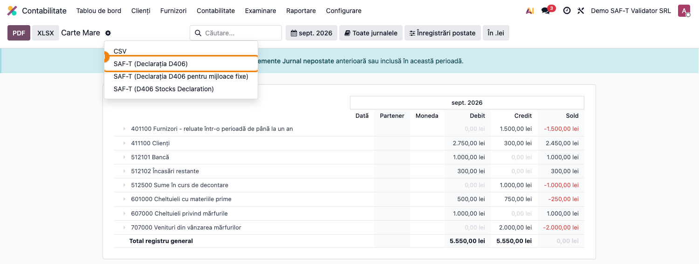

# Fișă Modul: SAF-T D406 — Speța L/T (Lunar / Trimestrial)

**Modul:** `l10n_ro_saft_validator` + `l10n_ro_saft`
**Tip declarație ANAF:** **L** (lunar) sau **T** (trimestrial)
**Capitol manual:** Cap 5 / SAF-T / Lunar-Trimestrial
**Utilizator principal:** Contabil, Responsabil SAF-T
**Prioritate:** Mare (e depunerea principală)

---

## 1. Scop business

D406 Lunar/Trimestrial este depunerea curentă SAF-T — cuprinde **toate** datele contabile ale
perioadei: registre, parteneri, facturi vânzare/cumpărare, plăți, taxe. Se depune până în ultima
zi calendaristică a lunii următoare perioadei de raportare (lună sau trimestru, în funcție de
perioada fiscală a contribuabilului). Pentru trimestrul IV, termenul poate fi extins conform
reglementărilor în vigoare.

## 2. Bază legală

- **OPANAF 1783/2021** cu modificările și completările ulterioare (OPANAF 2210/2021,
  1191/2022, 1907/2022, 6/2023, 1730/2023, 1234/2024) — natura informațiilor SAF-T,
  modelul de raportare, procedura, condițiile și termenele de transmitere a fișierului D406.
- Codul depunerii în câmpul `HeaderComment` al XML: **`L`** pentru lunar, **`T`** pentru trimestrial
  (deduse de Odoo din perioada selectată în raport).

## 3. Utilizatori și roluri

- Responsabil SAF-T: rulează validatorul + exportul la sfârșit de lună/trimestru.
- Contabil: corectează datele semnalate (parteneri, conturi, taxe).

## 4. Date implicate

- companie (CUI, adresă completă, județ, telefon, cont bancar, contact cu nume și telefon,
  baza de impozitare SAF-T);
- parteneri cu rulaj pe conturi de creanțe/datorii (CUI/CNP, țară ISO2, localitate, județ);
- conturi contabile (account_type completat);
- taxe (câmp `l10n_ro_saft_tax_type_id` din l10n_ro_saft Enterprise);
- articole facturate (referință internă, categorie, conturi de venit/cheltuială);
- facturi de vânzare **și** de cumpărare postate, linii de extras bancar, note contabile.

## 5. Configurare inițială

1. Instalați `l10n_ro_saft` (Enterprise) + `l10n_ro_saft_validator`.
2. Completați datele companiei: CUI, județ, cod poștal, **telefon** și **cont bancar**.
3. Setați **baza de impozitare SAF-T** pe companie (câmpul din l10n_ro_saft).
4. Adăugați companiei cel puțin un **contact** cu nume din două cuvinte (nume și prenume) și
   telefon — declarația îl cere, iar exportul îl ia doar pe acesta.
5. Asigurați că taxele active au tipul SAF-T configurat.
6. Asigurați că articolele vândute și cumpărate au **referință internă** și **categorie**.

## 6. Flux de utilizare

1. **Pre-validare:**
   1. Deschideți **Contabilitate → Raportare → SAF-T Validator**.
   2. Selectați **Tip declarație = Lunar / Trimestrial (L / T)**.
   3. Setați **From / To** = perioada de raportare (lună sau trimestru).
   4. Apăsați **Validate** — lista de probleme se populează.
   5. Corectați și re-rulați până la 0 erori.
2. **Generare D406:**
   1. Deschideți **Contabilitate → Raportare → Carte Mare**.
   2. Selectați perioada (declaration_type se deduce automat: lună → L, trimestru → T).
   3. Apăsați **SAF-T (D406 Declaration)** → descărcați XML-ul.
3. **Validare oficială:** rulați XML-ul prin DUK Integrator.
4. **Depunere:** încărcați XML-ul + zip-ul DUK în portalul ANAF (sau prin SPV).

## 7. Reguli funcționale (verificări rulate pentru LT)

| Verificare | Severitate | Ce semnalează |
|---|---|---|
| `company_incomplete` | error / warning | date companie lipsă: CUI, adresă, județ, telefon, cont bancar, bază de impozitare SAF-T, contact cu nume și telefon |
| `partner_no_vat` | error / warning | partener cu rulaj fără CUI (PJ) sau fără CNP (PF) |
| `partner_no_country` | error | partener fără țară configurată |
| `partner_invalid_country` | warning | cod de țară non-ISO2 |
| `partner_no_city` | error | partener fără localitate — exportul refuză să ruleze |
| `partner_no_state` | warning | partener român fără județ |
| `partner_invalid_state` | warning | județ în afara nomenclatorului ISO 3166-2:RO (`RO-B`, `RO-AB`…) |
| `partner_fiscal_type_mismatch` | error / warning | țara și prefixul codului de TVA se contrazic — decid rubrica din declarație (operator român, UE, non-UE) |
| `move_line_no_partner` | error | notă contabilă cu linii pe conturi de creanțe/datorii (40x/41x) fără partener |
| `account_no_type` | error | conturi cu rulaj fără `account_type` (lipsesc din SAF-T) |
| `tax_no_saft_type` | warning | taxe fără tipul SAF-T configurat |
| `export_section_empty` | error | o secțiune a declarației ar ieși goală (vânzări, achiziții sau plăți) |
| `payments_not_exported` | warning | plăți din perioadă care nu provin dintr-o linie de extras bancar |
| `product_no_default_code` | error | articol facturat fără referință internă — exportul refuză să ruleze |
| `product_no_category` | error | articol facturat fără categorie |
| `product_no_account` | warning | articol fără cont de venit/cheltuială, nici pe el, nici pe categorie |

> Verificarea partenerilor pe CUI, localitate și tip fiscal se face doar pentru cei cu rulaj pe
> conturi de creanțe/datorii (`asset_receivable` / `liability_payable`).

### Două capcane pe care interfața Odoo nu le arată

**Secțiunile goale invalidează tot fișierul.** Exportul scrie necondiționat secțiunile de vânzări,
achiziții și plăți, iar validatorul ANAF cere minimum un document în fiecare secțiune prezentă. O
lună fără nicio achiziție — sau fără nicio încasare — produce o declarație respinsă integral, cu o
eroare de structură care nu spune nimic despre cauza reală.

**Plățile intră în declarație doar dintr-un extras bancar.** Exportul ia exclusiv plățile venite
dintr-o linie de extras; o plată înregistrată prin butonul „Înregistrează plata", fără extras, nu
ajunge nicăieri în fișier. La un client care nu importă extrase în Odoo, secțiunea de plăți rămâne
goală lună de lună, iar declarația e respinsă de fiecare dată. Validatorul semnalează situația
înainte de export: eroare când nu există niciun extras în perioadă, avertisment când există extrase
dar și plăți care nu sunt legate de ele.

## 8. Scenarii de test pentru consultant

| ID | Scenariu | Rezultat așteptat |
|---|---|---|
| LT-01 | Partener PJ fără CUI cu rulaj de încasare | problemă `partner_no_vat` error |
| LT-02 | Partener fără țară setată | problemă `partner_no_country` error |
| LT-03 | Cont fără `account_type` cu rulaj | problemă `account_no_type` error |
| LT-04 | Taxă cu rulaj fără `l10n_ro_saft_tax_type_id` | problemă `tax_no_saft_type` warning |
| LT-05 | Companie fără județ | warning `company_incomplete` |
| LT-06 | Partener român fără județ | warning `partner_no_state` |
| LT-07 | Partener cu județ creat manual („Sector 3", cod `B3") | warning `partner_invalid_state` |
| LT-08 | Partener cu țară străină și fără prefix de TVA | error `partner_fiscal_type_mismatch` |
| LT-09 | Notă manuală pe 401 fără partener | error `move_line_no_partner` |
| LT-10 | Lună cu vânzări, dar fără nicio factură de achiziție | error `export_section_empty` |
| LT-11 | Perioadă fără nicio linie de extras bancar | error `export_section_empty` |
| LT-12 | Plată înregistrată din factură, fără extras, în lună cu extrase | warning `payments_not_exported` |
| LT-13 | Articol facturat fără referință internă | error `product_no_default_code` |
| LT-14 | Articol facturat fără categorie | error `product_no_category` |
| LT-15 | Partener cu rulaj fără localitate | error `partner_no_city` |
| LT-16 | Companie fără telefon / cont bancar / contact cu telefon | error `company_incomplete` |
| LT-17 | Toate datele complete | listă goală → export D406 cu HeaderComment `L`/`T`, acceptat de DUK Integrator |

## 9. Legături cu alte module / declarații

| Modul | Rol |
|---|---|
| `l10n_ro_saft` (Enterprise) | exportul efectiv lunar/trimestrial |
| `l10n_ro_anaf_d300` | verificare cross — soldurile SAF-T trebuie să corespundă cu D300 al perioadei |

## 10. Verificări pentru consultant

- [ ] Tip declarație în wizard = **LT**.
- [ ] Perioada de raportare corespunde periodicității fiscale (lună/trimestru).
- [ ] Compania are CUI, adresă completă, județ, telefon, cont bancar și bază de impozitare SAF-T.
- [ ] Compania are cel puțin un contact cu nume din două cuvinte și telefon.
- [ ] Toți partenerii cu rulaj au CUI/CNP, țară ISO2, localitate și județ din nomenclator.
- [ ] Niciun partener nu are țara și prefixul de TVA în contradicție.
- [ ] Nicio notă contabilă din perioadă nu are linii pe 40x/41x fără partener.
- [ ] Toate conturile cu rulaj au `account_type` setat.
- [ ] Taxele cu rulaj au tip SAF-T configurat.
- [ ] Articolele facturate au referință internă și categorie.
- [ ] Perioada conține cel puțin o factură de vânzare, una de achiziție și o linie de extras bancar.
- [ ] Plățile perioadei sunt legate de linii de extras bancar.
- [ ] Validatorul returnează 0 erori.
- [ ] XML-ul exportat trece prin DUK Integrator fără erori („Validare fara erori").

## 11. Mesaje de eroare frecvente

| Simptom | Cauză | Remediere |
|---|---|---|
| Listă lungă de parteneri fără CUI | parteneri importați incomplet | completați CUI/CNP pe parteneri |
| Conturi nemapate | conturi noi fără tip | setați `account_type` pe contul respectiv |
| Taxe semnalate | taxe fără tip SAF-T | configurați `l10n_ro_saft_tax_type_id` pe taxă |
| DUK: „elementul 'Payment' ar fi trebuit sa apara de minimum 1 ori" | perioada nu are nicio linie de extras bancar, deci secțiunea de plăți iese goală | importați sau introduceți extrasul bancar al perioadei, apoi regenerați |
| DUK: „elementul ''lipsa'' ar fi trebuit sa apara de minimum 1 ori" pe `PurchaseInvoices` | luna nu are nicio factură de achiziție | verificați dacă lipsesc facturi de înregistrat; altfel discutați cu ANAF depunerea pentru o perioadă fără achiziții |
| DUK: „atribut prezent dar vid nepermis" pe `ProductGroup` | articol fără categorie (în Odoo 19 categoria nu mai are valoare implicită) | completați categoria pe articolele semnalate |
| DUK: „elementul 'Contact' ar fi trebuit sa apara de minimum 1 ori" | compania nu are contact cu nume din două cuvinte și telefon | adăugați un contact „Nume Prenume" cu telefon pe fișa companiei |
| Exportul refuză să pornească, fără fișier generat | lipsesc telefonul, contul bancar, baza de impozitare SAF-T, localitatea unui partener sau referința internă a unui articol | rulați validatorul — el arată exact care dintre ele lipsește |
| Plățile nu apar în declarație, deși există în Odoo | exportul ia doar plățile venite din linii de extras bancar | legați plățile de extras (reconciliere) sau introduceți extrasul |

## 12. Capturi de ecran

**Pas 1 — Wizard validare LT cu rezultate** ①:

**Pas 2 — Buton de export D406 lunar/trimestrial pe raportul Carte Mare** ② — deschis prin
icon-ul de cog (engrenaj) lângă titlul raportului:

| # | Fișier | Conținut |
|---|--------|----------|
| 1 | `screenshots/01_saft_validator_wizard_lt.png` | Wizard cu **Tip declarație = LT** ① — radio LT selectat, sumar Errors/Warnings, listă probleme pe parteneri/conturi |
| 2 | `screenshots/03_saft_export_button_lt.png` | Cog menu deschis pe Carte Mare ② cu opțiunea **„SAF-T (Declarația D406)"** evidențiată — export-ul D406 lunar/trimestrial |
