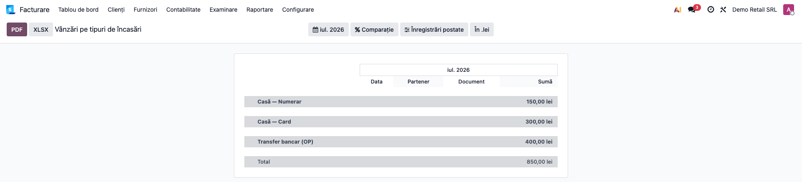
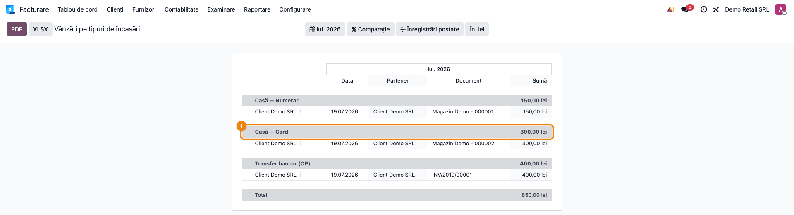
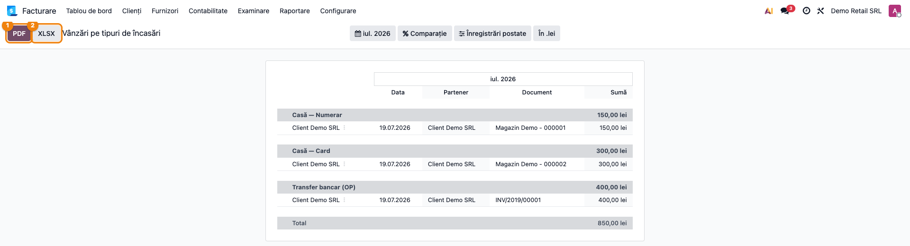

# Fișă Modul: Vânzări pe tipuri de încasări (raport Enterprise)

**Modul:** `l10n_ro_sale_receipt_type_report`
**Utilizator principal:** Contabil trezorerie, Contabil-șef, Casier (verificare zilnică)
**Prioritate:** 🟡 Medie (situație periodică de reconciliere, cerută explicit de client)
**Origine:** cerință contabilitate Damira — "Situație periodică cu vânzarea de produse, pe
tipuri de încasări: Casa de marcat — cash, card sau OP / Plata prin OP / Plata prin
platforme online"
**Poziție plan:** Trezorerie (clasa 5) / Vânzări
**Capitol manual:** —  (de alocat la integrarea în manualul general)

---

## 1. Scop business

Modulul oferă **Vânzări pe tipuri de încasări** ca **raport Enterprise nativ**
(`account.report`), nu ca listă sau wizard separat. Pentru un interval de date, raportul
grupează **toate încasările din vânzări** (indiferent de canal) în **patru secțiuni**:

- **Casă — Numerar** — încasări la casa de marcat, metodă de plată numerar;
- **Casă — Card** — încasări la casa de marcat, orice altă metodă de plată (card, terminal);
- **Transfer bancar (OP)** — încasări contabile pe jurnal bancar, fără o tranzacție de plată
  online asociată;
- **Platformă de plată online** — încasări contabile cu o tranzacție de plată online
  asociată (checkout site, link de plată etc.).

Fiecare secțiune afișează **totalul perioadei** pliat, iar desfășurată listează încasările
individuale (dată, partener, document, sumă), cu drill-down la comanda POS sau la plata
contabilă din care provine. Un rând de **Total general** încheie raportul.

Spre deosebire de rapoartele deja existente (Registru de casă, Jurnal de bancă — care
citesc **doar** mișcările contului de casă/bancă), acest raport unifică **două surse de date
eterogene**: încasările POS (`pos.payment`) și încasările contabile din afara POS-ului
(`account.payment`), exact cum a fost formulată cerința clientului.

## 2. Bază legală și context

Nu există un formular tipizat legal pentru acest raport — este o **situație de gestiune
internă**, cerută de client pentru reconcilierea periodică a încasărilor pe canal (de regulă
lunar, la închiderea contabilă), utilă pentru:

- verificarea sumei totale încasate cu numerar vs. cu cardul la fiecare punct de vânzare;
- reconcilierea încasărilor prin transfer bancar (OP) cu extrasul de cont;
- reconcilierea încasărilor prin platforme de plată online (Shopify, website_sale etc.) cu
  decontările providerului.

## 3. Utilizatori și roluri

Contabil trezorerie (reconciliere lunară), contabil-șef (control la închidere), casier
(verificare punctuală pe magazin).

Roluri recomandate pentru testare:
- Administrator funcțional: instalează modulul și verifică meniul din Raportare.
- Utilizator operațional: rulează raportul pe lună, verifică cele 4 secțiuni.
- Contabil-șef: verifică totalul general și exportă raportul.

## 4. Conturi și date implicate

- **Conturi de casă (clasa 5):** 5311 (casă lei) — contul implicit al jurnalului de casă
  folosit de metoda de plată POS de tip numerar.
- **Conturi bancare:** 512x — contul jurnalului bancar folosit de metoda de plată POS de tip
  card **și** de plățile contabile OP/online.
- **Contrapartide uzuale:** 4111 (client), 419 (avans client), 4427 (TVA colectată la
  vânzare directă cu numerar).
- Date minime pentru demo:
  - o configurație POS (`pos.config`) cu cel puțin o metodă de plată numerar și una card,
    ambele cu jurnal configurat;
  - o comandă POS finalizată (stare Paid/Posted/Invoiced) cu plată numerar și una cu plată
    card;
  - o încasare contabilă (`account.payment`, inbound, postată) pe jurnal bancar, fără
    tranzacție de plată — pentru secțiunea OP;
  - opțional, o tranzacție de plată online (`payment.transaction`) legată de o
    `account.payment` — pentru secțiunea Platformă online (necesită un provider de plată
    configurat/instalat; fără el, secțiunea nu apare, nu produce eroare).

## 5. Configurare inițială

1. Instalați modulul `l10n_ro_sale_receipt_type_report` (necesită Enterprise —
   `account_reports` — și modulele `point_of_sale` + `payment`, deja prezente la Damira).
2. Verificați că metodele de plată POS folosite au un **jurnal** configurat (tip Numerar sau
   Bancă) — raportul clasifică după tipul jurnalului metodei de plată, nu după numele ei.
3. Verificați accesul la meniul **Contabilitate → Raportare → Vânzări pe tipuri de încasări**
   (sub grupul „Rapoarte de situații").

## 6. Flux de utilizare

### Pasul 1 — Deschiderea raportului

Accesați **Contabilitate → Raportare → Vânzări pe tipuri de încasări**. Raportul se deschide
pe luna curentă și afișează câte o secțiune pentru fiecare tip de încasare **care are date în
perioadă** — secțiunile fără nicio încasare nu apar (raportul rămâne concis). Rândul de
**Total** de la final însumează toate secțiunile.



### Pasul 2 — Alegerea perioadei și a companiei

Din bara raportului folosiți filtrul de **dată** (de regulă o lună calendaristică) și, pentru
grupuri multi-companie, **selectorul de companie**.


### Pasul 3 — Citirea unei secțiuni

Desfășurați o secțiune (ex. „Casă — Card") pentru a vedea încasările individuale: data,
partenerul, documentul (referința comenzii POS sau a facturii) și suma. Totalul din antetul
secțiunii, pliat, este suma tuturor liniilor desfășurate.



### Pasul 4 — Drill-down

Pe o linie din secțiunile Casă, din caret alegeți **„Vezi comanda"** pentru a deschide
comanda POS din care provine încasarea. Pe o linie din secțiunile OP/Online, caretul
standard deschide **plata contabilă** (`account.payment`).

### Pasul 5 — Verificarea pe ecran și exportul

Înainte de a exporta, **citiți raportul pe ecran**:
1. **Găsiți** — totalul fiecărei secțiuni și totalul general de la final.
2. **Verificați** — totalul secțiunii Casă — Card + Casă — Numerar corespunde încasărilor
   raportate de sesiunile POS închise în perioadă; totalul OP corespunde extraselor bancare
   fără proveniență online; totalul Platformă online corespunde decontărilor providerului.
3. **Exportați** — din bara raportului, apăsați **PDF** sau **XLSX**.



## 7. Legături cu alte module / rapoarte

| Modul | Rol |
|---|---|
| `account_reports` (Enterprise) | framework de raportare: filtre, desfășurare, export PDF/XLSX/print |
| `point_of_sale` | sursa `pos.payment` / `pos.order` pentru secțiunile Casă — Numerar / Card |
| `payment` | câmpul `account.payment.payment_transaction_id`, folosit pentru a distinge Platformă online de OP |
| `l10n_ro_cash_register_report` | Registrul de casă — citește **doar** mișcările contului de casă, pe zile; complementar, nu duplică acest raport (acela e un registru legal, acesta e o reconciliere pe canal) |
| `l10n_ro_bank_register_report` | Jurnalul de bancă — similar, doar mișcările contului bancar |

**Ce e automat:** clasificarea pe canal, excluderea plăților „Cont client" (pay later) și a
plăților de decontare a sesiunii POS, totalurile pe secțiune și totalul general, exportul
PDF/XLSX. **Ce rămâne manual:** înregistrarea efectivă a încasărilor (POS, extrase bancare,
platforme online); configurarea corectă a jurnalelor pe metodele de plată POS.

## 8. Verificări pentru consultant

- [ ] Raportul se deschide din **Contabilitate → Raportare → Vânzări pe tipuri de încasări**.
- [ ] O comandă POS plătită cu numerar apare la secțiunea **Casă — Numerar**.
- [ ] O comandă POS plătită cu cardul apare la secțiunea **Casă — Card**.
- [ ] O comandă POS cu metoda „Cont client" (pay later) **nu** apare deloc în raport.
- [ ] O comandă POS nefinalizată (draft) **nu** apare în raport.
- [ ] O plată contabilă (`account.payment`) inbound postată pe jurnal bancar, fără tranzacție
      online, apare la secțiunea **Transfer bancar (OP)**.
- [ ] Aceeași plată, cu o `payment_transaction_id` asociată, apare la **Platformă de plată
      online**, nu la OP.
- [ ] O încasare cash înregistrată direct în contabilitate (nu prin POS) apare tot la
      **Casă — Numerar**.
- [ ] Plata de decontare a unei sesiuni POS (`account.payment.pos_session_id` completat)
      **nu** apare deloc — altfel ar dubla încasarea deja numărată din `pos.payment`.
- [ ] O plată ieșire (`payment_type = outbound`) **nu** apare în raport.
- [ ] O comandă cu două plăți în aceeași categorie (ex. două încasări cash) produce **două
      rânduri distincte**, nu unul singur suprascris.
- [ ] Totalul secțiunii = suma liniilor ei; totalul general = suma tuturor secțiunilor.
- [ ] Export PDF / XLSX din bara raportului produce raportul pe interval.

## 9. Mesaje de eroare frecvente

| Mesaj / Simptom | Cauză | Remediere |
|---|---|---|
| Raportul e gol pe interval | Nu există încasări postate în perioadă | Verificați perioada selectată și că sesiunile POS/facturile sunt închise/postate |
| O secțiune lipsește (ex. Platformă online) | Nu există încasări în categoria respectivă în perioadă | Normal — secțiunile fără date nu apar; nu e o eroare |
| O încasare cu cardul apare la OP în loc de la Casă — Card | Încasarea a fost înregistrată manual în contabilitate (nu prin POS) și nu are provider de plată online asociat | Limitare cunoscută v1 — vezi secțiunea 11; înregistrați încasările cu cardul prin POS când e posibil |
| Totalul unei secțiuni nu corespunde extrasului bancar | Există plăți neexcluse corect (ex. decontare sesiune) sau plăți lipsă (nepostate) | Verificați postarea tuturor plăților și că decontările de sesiune POS au `pos_session_id` completat |

## 10. Capturi de ecran

Capturile din `readme/screenshots/` sunt generate din `tests/test_screenshots.py` (mixinul
`ScreenshotCase` din `l10n_ro_doc_screenshots`, HttpCase + Playwright), pe companie RO, cu
un magazin demo (jurnal casă + jurnal bancă, o comandă POS cash, o comandă POS card, o
factură încasată prin OP). Modulul de infrastructură `l10n_ro_doc_screenshots` există doar
pe 19.0 — pe 18.0 testul face import defensiv și sare grațios; capturile au fost generate pe
19.0 și copiate manual în `readme/screenshots/` pe ambele branch-uri.

Lista capturilor (în ordinea fluxului):
1. `01_raport_deschis.png` — raportul deschis pe luna curentă, cele 3 secțiuni cu date
2. `02_filtru_perioada.png` — filtrul de dată din bara raportului
3. `03_sectiune_desfasurata.png` — secțiunea „Casă — Card" desfășurată, cu linia de încasare
4. `04_export_pdf.png` — butoanele de export PDF/XLSX

Regenerare (pe o bază 19.0, cu `l10n_ro_doc_screenshots` instalat):
```
./odoo/odoo-bin -c odoo.conf -d test19 -u l10n_ro_sale_receipt_type_report,l10n_ro_doc_screenshots \
    --test-tags=fise_screenshots --stop-after-init
```

## 11. Observații pentru manual

- **Limitare cunoscută (v1):** o încasare cu cardul înregistrată manual în contabilitate (în
  afara POS-ului, fără provider de plată online) nu poate fi distinsă de un transfer bancar
  obișnuit — ambele ajung în secțiunea OP. Pentru retail, marea majoritate a încasărilor cu
  cardul trec prin POS și sunt corect clasificate; această limitare afectează doar cazurile
  excepționale de înregistrare manuală.
- Subliniați diferența față de **Registrul de casă**/**Jurnalul de bancă**: acelea sunt
  registre legale, citesc un singur cont pe zile; acest raport e o **reconciliere pe canal de
  încasare**, unificând POS și contabilitate într-o singură vedere periodică.
- Secțiunile fără date în perioadă **nu apar** — nu este o eroare, ci comportamentul normal
  (raportul rămâne concis, nu afișează secțiuni goale cu total 0).
