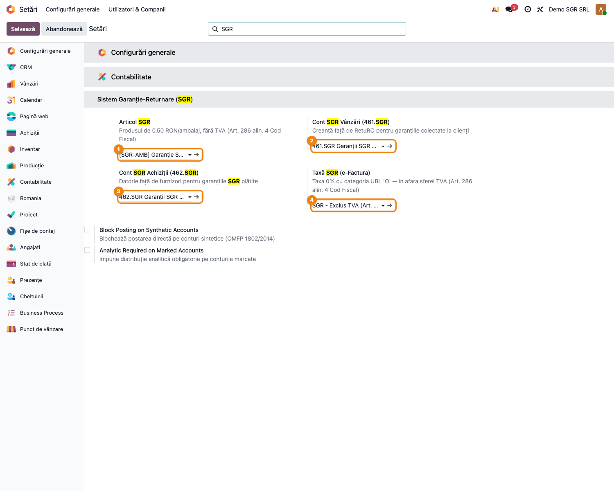
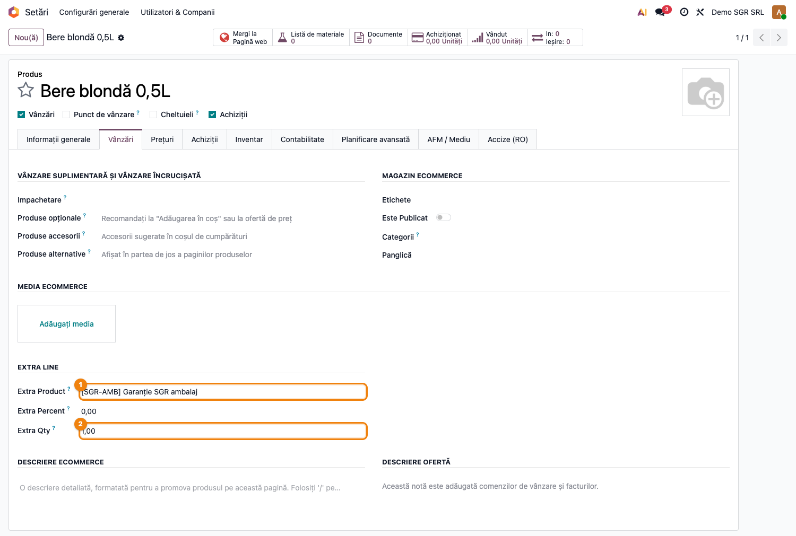
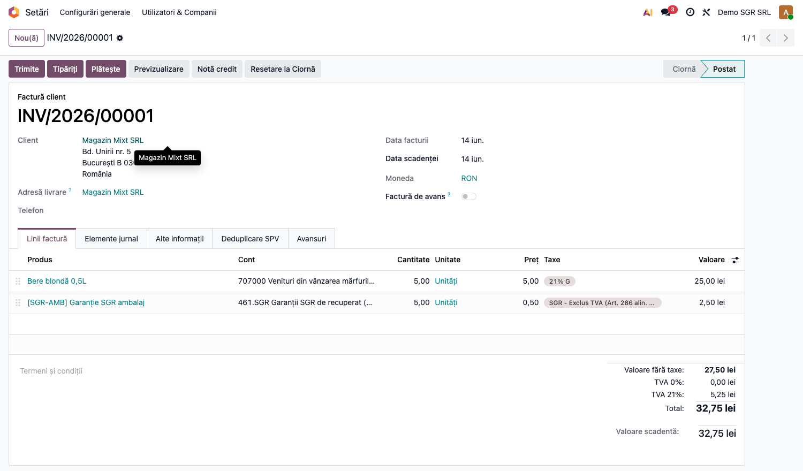
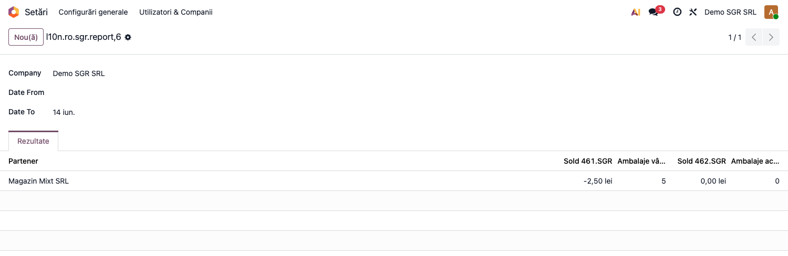
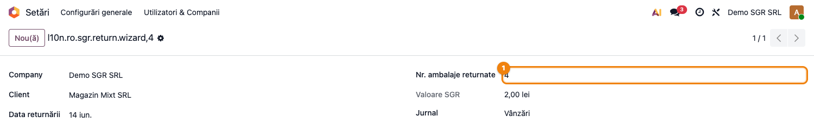
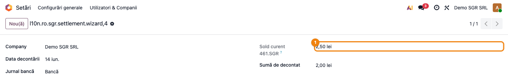

# Fișă Modul: SGR Garanție-Returnare Ambalaje

**Poziție plan:** B8.1
**Modul:** `l10n_ro_sgr`
**FR:** FR-07
**Capitol manual:** Cap 12.3
**Utilizator principal:** Operator vânzări, Contabil TVA
**Prioritate:** 🟡 Medie (obligatoriu pentru comerț cu ambalaje SGR)

---

## 1. Scop business

Această fișă descrie utilizarea modulului `l10n_ro_sgr` pentru scenariul **SGR Garanție-Returnare Ambalaje**.
Consultantul folosește documentul pentru reproducerea fluxului în baza demo și
pentru pregătirea capitolului Cap 12.3 din manualul utilizator.

## 2. Bază legală și context

OUG 74/2018 — sistemul de garanție-returnare; Codul Fiscal art. 286 — excludere TVA

## 3. Utilizatori și roluri

Operator Facturare, Contabil

Roluri recomandate pentru testare:
- Administrator funcțional: instalează modulul și verifică meniurile
- Utilizator operațional: rulează fluxul zilnic sau lunar
- Contabil/manager: validează rezultatele contabile și rapoartele

## 4. Conturi și date implicate

461.SGR (creanță RetuRO), 462.SGR (datorie furnizori SGR)

Date minime pentru demo:
- companie românească cu localizarea contabilă instalată
- perioadă contabilă deschisă
- jurnale și conturi configurate conform scenariului
- documente de test postate, acolo unde fluxul pornește din contabilitate, stocuri, HR sau vânzări

## 5. Configurare inițială

1. Instalați modulul `l10n_ro_sgr` pe baza demo.
2. Verificați dependențele cerute de manifest și meniurile nou apărute.
3. Configurați conturile, jurnalele, produsele, partenerii sau parametrii specifici fluxului.
4. Pregătiți un set minim de documente postate pentru perioada de test.
5. Verificați că utilizatorul de test are grupurile de acces necesare.

## 6. Flux de utilizare

### Pasul 1 — Accesare

Accesați **Vânzări → Comenzi → Comenzi → Nou** pentru un flux de vânzare cu produs SGR sau **Inventar → Produse** pentru configurarea produsului SGR.

### Pasul 2 — Completare date

Completați câmpurile obligatorii: companie, perioadă, jurnal, conturi, parteneri sau documente sursă, după caz.

### Pasul 3 — Calcul / import / generare

Rulați acțiunea principală a modulului. Pentru această fișă sunt documentate:

**Configurare SGR pe companie** (Setări → Contabilitate → Sistem Garanție-Returnare): produsul SGR
de 0,50 RON, conturile 461.SGR / 462.SGR și taxa 0% exclusă din TVA.

**Produs comercial cu garanție SGR atașată** (fila Vânzări → Extra Line): produsul de vânzare
(„Bere blondă 0,5L") are atașat produsul SGR, care se adaugă automat ca linie suplimentară.

**Inserare automată a liniei SGR pe factură + excludere din baza TVA**: la 5 sticle, linia SGR =
5 × 0,50 = 2,50 RON pe contul 461.SGR, cu taxa „Exclus TVA (Art. 286 alin. 4)" — 0,00 TVA pe SGR,
în timp ce berea poartă TVA 21%.

**Raport sold SGR per partener**: soldul 461.SGR și numărul de ambalaje în circulație per client.

**Wizard returnare ambalaje** → generează nota de credit pentru ambalajele returnate (4 × 0,50 = 2,00 RON).

**Wizard decontare RetuRO**: viramentul garanțiilor colectate (Debit bancă = Credit 461.SGR).

### Pasul 4 — Verificare rezultat

Comparați rezultatul generat cu documentele sursă și cu monografia contabilă așteptată.
Verificați totalurile, starea documentului și eventualele mesaje de avertizare.

### Pasul 5 — Confirmare / postare

Confirmați documentul sau postați nota contabilă, după caz. Notați ce câmpuri devin readonly și ce linkuri apar către documentele generate.

### Pasul 6 — Export / raportare

Dacă modulul oferă export PDF, XLSX sau XML, generați fișierul și verificați că include datele de test relevante.

## 7. Legături cu alte module / declarații

| Modul / proces | Rol în flux |
|---|---|
| `sale` | comenzi și facturi cu garanție SGR |
| `stock` | retururi ambalaje și mișcări fizice |
| `account` | conturi de garanții și încasări/restituiri |
| POS / e-commerce | fluxuri operaționale cu ambalaje SGR |

Ce este automat: adăugarea liniei SGR și calculul garanției.
Ce rămâne manual: reconcilierea garanțiilor încasate/restituite.

## 8. Verificări pentru consultant

- [ ] Modulul se instalează fără erori pe baza demo.
- [ ] Meniurile și acțiunile sunt vizibile pentru rolul de utilizator potrivit.
- [ ] Fluxul poate fi reprodus de la cap la coadă cu date fictive românești.
- [ ] Rezultatul contabil sau operațional corespunde descrierii din plan.
- [ ] Mesajele de eroare sunt clare pentru un utilizator non-tehnic.
- [ ] Exporturile sau rapoartele se descarcă și conțin datele testate.

## 9. Mesaje de eroare frecvente

| Mesaj / simptom | Cauză probabilă | Remediere |
|-----------------|-----------------|-----------|
| Meniul nu este vizibil | Utilizatorul nu are grupurile necesare | Verificați drepturile de acces și reîncărcați aplicațiile |
| Nu se generează linii | Lipsesc documente postate în perioada aleasă | Creați și postați datele de test necesare |
| Cont lipsă sau jurnal lipsă | Configurarea contabilă este incompletă | Completați conturile și jurnalele în setările modulului |
| Perioada este blocată | Data documentului este într-o perioadă închisă | Folosiți o perioadă deschisă sau ajustați lock date-ul în demo |

## 10. Capturi de ecran

| # | Fișier | Conținut |
|---|--------|----------|
| 1 | `screenshots/01_configurare_sgr.png` | Configurare SGR pe companie (produs 0,50 + conturi 461/462 + taxă 0%) |
| 2 | `screenshots/02_produs_cu_sgr.png` | Produs comercial cu garanție SGR atașată (Extra Line) |
| 3 | `screenshots/03_factura_linie_sgr.png` | Factură cu linia SGR inserată automat, exclusă din baza TVA |
| 4 | `screenshots/04_raport_sold_sgr.png` | Raport sold SGR per partener (sold 461 + ambalaje în circulație) |
| 5 | `screenshots/05_wizard_returnare.png` | Wizard returnare ambalaje → notă de credit |
| 6 | `screenshots/06_wizard_decontare.png` | Wizard decontare RetuRO (virament garanții, credit 461.SGR) |

> Notă i18n: câteva etichete auxiliare apar încă în engleză — `Extra Product/Qty` (din
> `deltatech_sale_add_extra_line`), `Company` și `Date From/To` (câmpuri comune pe raport/wizard).
> De completat în `i18n/ro.po` (agent `traducator-modul`); nu afectează fluxul SGR.

## 11. Observații pentru manual

În manualul final, păstrați explicația orientată pe activitatea utilizatorului:
ce problemă rezolvă modulul, când se rulează, ce date trebuie pregătite și cum se verifică rezultatul.
