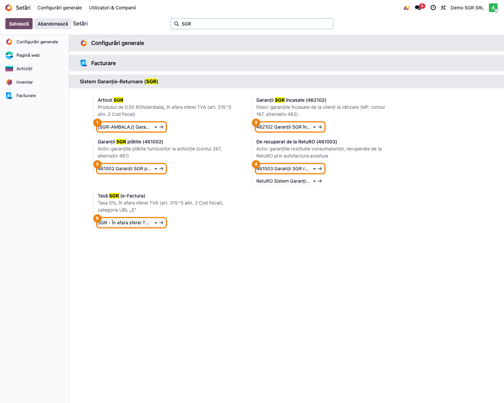
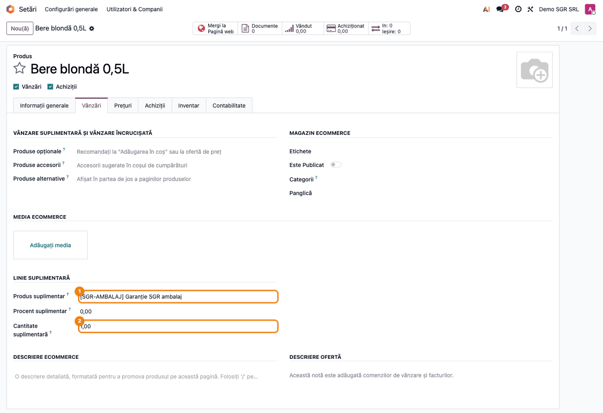
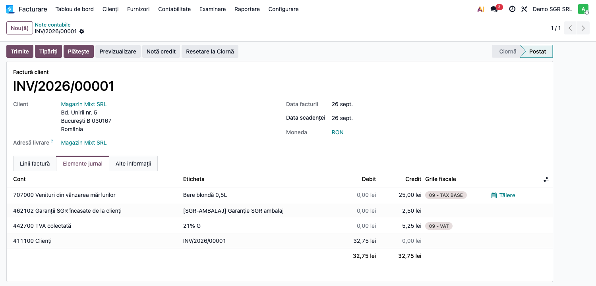
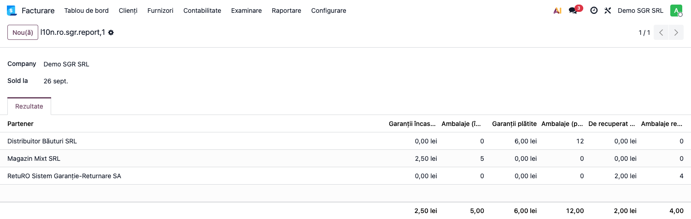
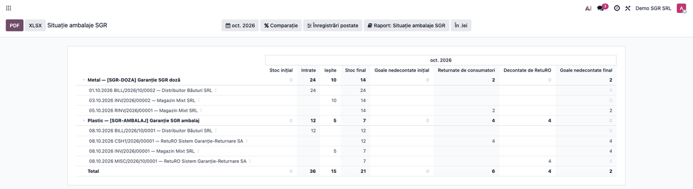
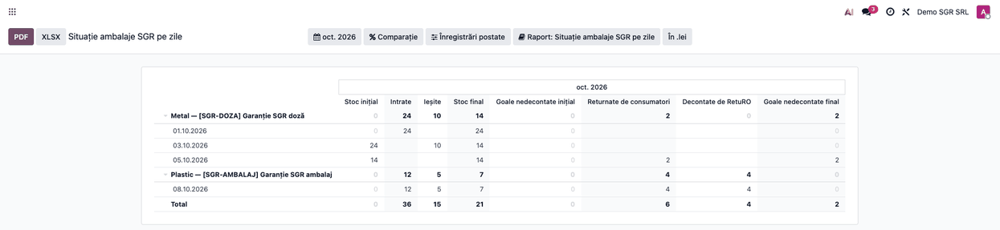
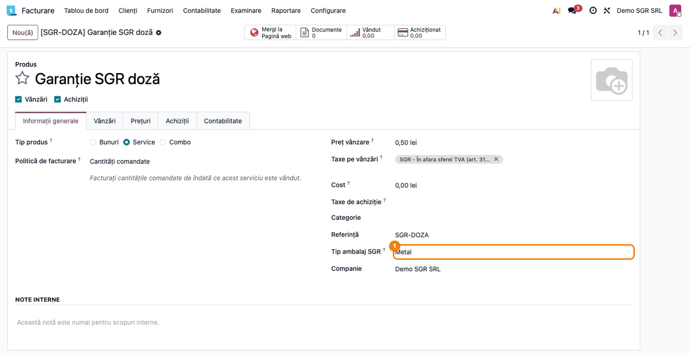
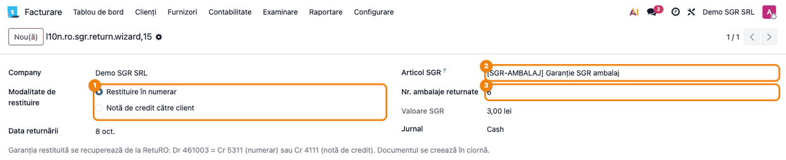
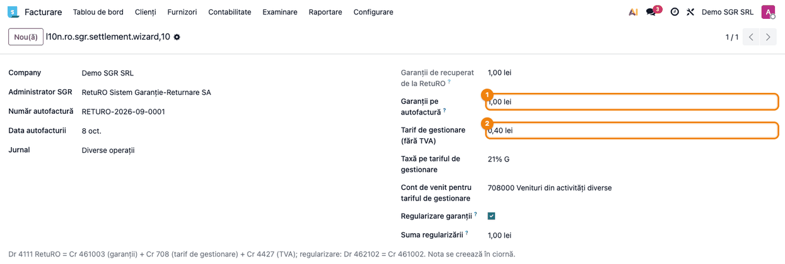

# Fișă Modul: SGR Garanție-Returnare Ambalaje

**Poziție plan:** B8.1
**Modul:** `l10n_ro_sgr`
**FR:** FR-07
**Capitol manual:** Cap 12.3
**Utilizator principal:** Operator vânzări, Contabil TVA
**Prioritate:** 🟡 Medie (obligatoriu pentru comerț cu ambalaje SGR)

---

## 1. Scop business

Această fișă descrie utilizarea modulului `l10n_ro_sgr` pentru scenariul **SGR Garanție-Returnare Ambalaje**.
Consultantul folosește documentul pentru reproducerea fluxului în baza demo și
pentru pregătirea capitolului Cap 12.3 din manualul utilizator.

## 2. Bază legală și context

H.G. 1074/2021, republicată — sistemul de garanție-returnare pentru ambalaje primare nereutilizabile;
Codul fiscal art. 315^5 alin. (2) — garanția SGR nu reprezintă contravaloarea unei livrări/prestări
**în sfera TVA** (deci în afara sferei TVA, nu scutită și nu doar exclusă din bază).

Tratamentul contabil: [precizarea Ministerului Finanțelor din 26.02.2024](https://mfinante.gov.ro/static/10/Mfp/hg1047_26022024.pdf)
— garanția încasată de entitate se înregistrează ca **datorie** (contul 167; modulul folosește
alternativa 462, propusă în Revista Consultant Fiscal nr. 1/2024), rambursarea ei în debitul
aceluiași cont. Precizarea nu tratează garanția plătită furnizorului, creanța față de RetuRO sau
autofactura. Monografia completă la comerciant
(garanția plătită furnizorului ca creanță, restituirea către consumator ca creanță față de RetuRO,
autofactura RetuRO cu tariful de gestionare, regularizarea periodică) urmează
[CECCAR Business Review nr. 2/2024](https://www.ceccarbusinessreview.ro/public/store/documente/articole/2024/2/CBR-Guarantee-return-system-for-nonreusable-primary-packaging-a394.pdf).
Toate sursele sunt listate în `readme/CONTEXT.md`.

## 3. Utilizatori și roluri

Operator Facturare, Contabil

Roluri recomandate pentru testare:
- Administrator funcțional: instalează modulul și verifică meniurile
- Utilizator operațional: rulează fluxul zilnic sau lunar
- Contabil/manager: validează rezultatele contabile și rapoartele

## 4. Conturi și date implicate

| Cont | Denumire | Funcțiune |
|---|---|---|
| 462102 | Garanții SGR încasate de la clienți | pasiv — Cr la vânzare, Dr la regularizare |
| 461002 | Garanții SGR plătite furnizorilor | activ — Dr la achiziție, Cr la regularizare |
| 461003 | Garanții SGR restituite, de recuperat de la RetuRO | activ — Dr la returnare, Cr la autofactura RetuRO |
| 4111 (RetuRO) / 708 / 4427 | Autofactura RetuRO | creanța față de RetuRO, tariful de gestionare, TVA 21% |
| 461001 / 462101 | Conturile versiunilor până la 19.0.1.4.0 | se reclasifică pe conturile de mai sus |

Date minime pentru demo:
- companie românească cu localizarea contabilă instalată
- perioadă contabilă deschisă
- jurnale și conturi configurate conform scenariului
- documente de test postate, acolo unde fluxul pornește din contabilitate, stocuri, HR sau vânzări

## 5. Configurare inițială

1. Instalați modulul `l10n_ro_sgr` pe baza demo.
2. Verificați dependențele cerute de manifest și meniurile nou apărute.
3. Configurați conturile, jurnalele, produsele, partenerii sau parametrii specifici fluxului.
4. Pregătiți un set minim de documente postate pentru perioada de test.
5. Verificați că utilizatorul de test are grupurile de acces necesare.

## 6. Flux de utilizare

### Pasul 1 — Accesare

Accesați **Vânzări → Comenzi → Comenzi → Nou** pentru un flux de vânzare cu produs SGR sau **Inventar → Produse** pentru configurarea produsului SGR.

### Pasul 2 — Completare date

Completați câmpurile obligatorii: companie, perioadă, jurnal, conturi, parteneri sau documente sursă, după caz.

### Pasul 3 — Calcul / import / generare

Rulați acțiunea principală a modulului. Pentru această fișă sunt documentate:

**Configurare SGR pe companie** (Setări → Contabilitate → Sistem Garanție-Returnare): produsul SGR
de 0,50 RON, conturile 462102 / 461002 / 461003, partenerul RetuRO și taxa 0% în afara sferei TVA.

**Produs comercial cu garanție SGR atașată** (fila Vânzări → Extra Line): produsul de vânzare
(„Bere blondă 0,5L") are atașat produsul SGR, care se adaugă automat ca linie suplimentară.

**Inserare automată a liniei SGR pe factură + tratare în afara sferei TVA**: la 5 sticle, linia SGR =
5 × 0,50 = 2,50 RON pe contul 462102 (Dr 4111 = Cr 462102), cu taxa „SGR - În afara sferei TVA (art. 315^5 alin. 2)" — 0,00 TVA pe SGR,
în timp ce berea poartă TVA 21%.

**Raport sold SGR per partener**: la o dată aleasă, garanțiile încasate (462102), plătite (461002) și
de recuperat de la RetuRO (461003), cu echivalentul în ambalaje.

**Situația ambalajelor SGR** (Contabilitate → Rapoarte → Situație ambalaje SGR): pe interval și
pe produs de garanție (tipul ambalajului în față), ambalajele pline — stoc inițial, intrate,
ieșite, stoc final — și ambalajele goale nedecontate de RetuRO — returnate de consumatori,
decontate prin autofactură. Varianta pe documente arată fiecare factură, notă sau comandă POS cu
soldurile după ea; varianta pe zile cumulează pe zi. Export PDF și XLSX din raport. Verificare:
goale nedecontate final × 0,50 = sold 461003; stoc final × 0,50 = sold 461002 − sold 462102.

**Tip ambalaj SGR pe produsul de garanție** (Informații generale): cu câte un produs de garanție
pe material (sticlă / plastic / metal), situația ambalajelor arată un rând pe tip.

**Wizard returnare ambalaje** → restituire în numerar (Dr 461003 = Cr 5311) sau notă de credit către
client (Dr 461003 = Cr 4111), în ciornă (4 × 0,50 = 2,00 RON).

**Wizard autofactură RetuRO**: Dr 4111 RetuRO = Cr 461003 (garanții) + Cr 708 (tarif de gestionare)
+ Cr 4427 (TVA 21%), plus regularizarea Dr 462102 = Cr 461002, în ciornă. Încasarea
(Dr 5121 = Cr 4111) se face din extrasul de cont.

**Wizard reclasificare conturi SGR** (doar pentru bazele care au folosit versiunile anterioare):
nota de mutare a soldurilor 461001 → 462102 și 462101 → 461002, per partener, în ciornă.

### Pasul 4 — Verificare rezultat

Comparați rezultatul generat cu documentele sursă și cu monografia contabilă așteptată.
Verificați totalurile, starea documentului și eventualele mesaje de avertizare.

### Pasul 5 — Confirmare / postare

Confirmați documentul sau postați nota contabilă, după caz. Notați ce câmpuri devin readonly și ce linkuri apar către documentele generate.

### Pasul 6 — Export / raportare

Dacă modulul oferă export PDF, XLSX sau XML, generați fișierul și verificați că include datele de test relevante.

## 7. Legături cu alte module / declarații

| Modul / proces | Rol în flux |
|---|---|
| `sale` | comenzi și facturi cu garanție SGR |
| `stock` | retururi ambalaje și mișcări fizice |
| `account` | conturi de garanții și încasări/restituiri |
| POS / e-commerce | fluxuri operaționale cu ambalaje SGR |

Ce este automat: adăugarea liniei SGR și calculul garanției.
Ce rămâne manual: verificarea și postarea documentelor create în ciornă de wizard-uri,
reconcilierea încasării de la RetuRO, voucherele de restituire și verificarea notei de
reclasificare de către contabil.

## 8. Verificări pentru consultant

- [ ] Modulul se instalează fără erori pe baza demo.
- [ ] Meniurile și acțiunile sunt vizibile pentru rolul de utilizator potrivit.
- [ ] Fluxul poate fi reprodus de la cap la coadă cu date fictive românești.
- [ ] Rezultatul contabil sau operațional corespunde descrierii din plan.
- [ ] Vânzarea creditează 462102 (pasiv), achiziția debitează 461002 (activ); niciun cont nu ajunge
      pe sold contrar funcțiunii lui.
- [ ] Autofactura RetuRO are TVA 21% doar pe tariful de gestionare, cu grilele decontului de TVA.
- [ ] Situația ambalajelor SGR se reconciliază cu balanța: goale nedecontate × 0,50 = sold 461003,
      stoc final × 0,50 = sold 461002 − sold 462102; vânzările POS nefacturate apar la ieșite.
- [ ] Mesajele de eroare sunt clare pentru un utilizator non-tehnic.
- [ ] Exporturile sau rapoartele se descarcă și conțin datele testate.

## 9. Mesaje de eroare frecvente

| Mesaj / simptom | Cauză probabilă | Remediere |
|-----------------|-----------------|-----------|
| Meniul nu este vizibil | Utilizatorul nu are grupurile necesare | Verificați drepturile de acces și reîncărcați aplicațiile |
| Nu se generează linii | Lipsesc documente postate în perioada aleasă | Creați și postați datele de test necesare |
| Cont lipsă sau jurnal lipsă | Configurarea contabilă este incompletă | Completați conturile și jurnalele în setările modulului |
| Perioada este blocată | Data documentului este într-o perioadă închisă | Folosiți o perioadă deschisă sau ajustați lock date-ul în demo |

## 10. Capturi de ecran

| # | Fișier | Conținut |
|---|--------|----------|
| 1 | `screenshots/01_configurare_sgr.png` | Configurare SGR pe companie (produs 0,50 + conturi 462102/461002/461003 + taxă 0%) |
| 2 | `screenshots/02_produs_cu_sgr.png` | Produs comercial cu garanție SGR atașată (Extra Line) |
| 3 | `screenshots/03_factura_linie_sgr.png` | Factură cu linia SGR inserată automat, în afara sferei TVA |
| 4 | `screenshots/04_raport_sold_sgr.png` | Raport sold SGR per partener (garanții încasate / plătite / de recuperat) |
| 5 | `screenshots/05_wizard_returnare.png` | Wizard returnare ambalaje (numerar sau notă de credit, produsul SGR returnat) |
| 6 | `screenshots/06_wizard_decontare.png` | Wizard autofactură RetuRO (garanții + tarif de gestionare + TVA) |
| 7 | `screenshots/07_situatie_ambalaje_sgr.png` | Situația ambalajelor SGR pe documente: pline (stoc) și goale nedecontate de RetuRO |
| 8 | `screenshots/08_situatie_ambalaje_sgr_zile.png` | Situația ambalajelor SGR, varianta cumulată pe zile |
| 9 | `screenshots/09_produs_tip_ambalaj.png` | Produs de garanție SGR cu tipul ambalajului (metal) |

> Notă i18n: câteva etichete auxiliare apar încă în engleză — `Extra Product/Qty` (din
> `deltatech_sale_add_extra_line`), `Company` și `Date From/To` (câmpuri comune pe raport/wizard).
> De completat în `i18n/ro.po` (agent `traducator-modul`); nu afectează fluxul SGR.

## 11. Observații pentru manual

În manualul final, păstrați explicația orientată pe activitatea utilizatorului:
ce problemă rezolvă modulul, când se rulează, ce date trebuie pregătite și cum se verifică rezultatul.
