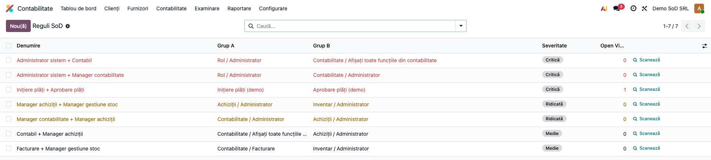
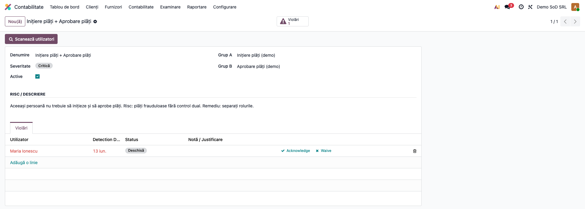
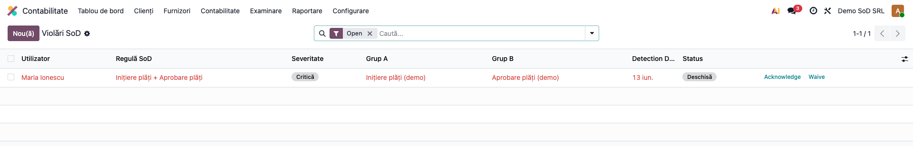
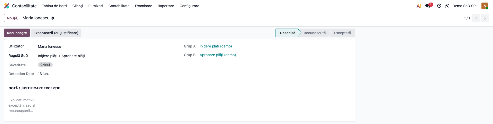

# Fișă Modul: Matrice SoD (Segregare Atribuții)

**Modul:** `l10n_ro_sod_matrix`
**FR:** FR-57
**Utilizator principal:** Auditor intern, Administrator funcțional, Contabil șef
**Prioritate:** 🟡 Medie (control intern; verificare periodică și la modificarea rolurilor)

---

## 1. Scop business

Modulul implementează o **matrice de segregare a atribuțiilor (Segregation of Duties)**: definește
perechi de grupuri de utilizatori (roluri) considerate **incompatibile** și detectează utilizatorii
care le cumulează — un risc clasic de control intern (ex. aceeași persoană administrează sistemul și
ține contabilitatea). Fiecare conflict generează o **violare** cu un flux de tratare
(Deschisă → Recunoscută → Exceptată / Rezolvată), pentru documentarea deciziilor la audit.

## 2. Bază legală și context

Modulul răspunde cerințelor de **control intern și audit financiar** (separarea atribuțiilor
incompatibile este un principiu fundamental de control intern — cf. standardelor de audit și bunelor
practici de guvernanță). Nu există un articol fiscal punctual; relevanța este pentru **auditul intern,
auditul statutar și conformitatea ISO/COSO**. Severitatea conflictelor (Critică/Ridicată/Medie/Redusă)
ajută la prioritizarea remedierii.

## 3. Utilizatori și roluri

Auditor intern / Administrator funcțional / Contabil șef.

Rol recomandat pentru testare: **Manager contabilitate** (`account.group_account_manager`) — meniurile
SoD sunt restricționate la acest grup.

## 4. Conturi și date implicate

Modulul **nu are impact contabil** (nu generează note). Date implicate:
- `l10n.ro.sod.rule` — reguli: **Grup A**, **Grup B** (grupuri Odoo incompatibile), **severitate**, descriere risc;
- `l10n.ro.sod.violation` — violări: regulă, utilizator, severitate (related), dată detectare, status, notă.

Reguli implicite preconfigurate (din `data/`):

| Regulă | Severitate |
|---|---|
| Administrator sistem + Manager contabilitate | Critică |
| Administrator sistem + Contabil | Critică |
| Manager achiziții + Manager gestiune stoc | Ridicată |
| Manager contabilitate + Manager achiziții | Ridicată |
| Facturare + Manager gestiune stoc | Medie |
| Contabil + Manager achiziții | Medie |

Date minime pentru demo: cel puțin un utilizator care cumulează două grupuri incompatibile.

## 5. Configurare inițială

1. Instalați modulul `l10n_ro_sod_matrix` (dependențe: `base`, `account`, `purchase`, `stock`).
2. Regulile implicite sunt **preîncărcate**; le puteți edita/dezactiva sau adăuga reguli noi
   (`noupdate` — personalizările nu se pierd la upgrade).
3. Opțional, activați **cron-ul săptămânal** de scanare automată (Setări tehnice → Acțiuni programate).
4. Acordați rolul de **Manager contabilitate** auditorilor care administrează matricea.

## 6. Flux de utilizare

### Pasul 1 — Matricea de reguli

**Contabilitate → Matrice SoD → Reguli SoD**. Lista afișează perechile de grupuri incompatibile, cu
severitatea (badge colorat) și numărul de violări deschise. Lista se deschide **filtrată implicit pe
„Critice"** — scoateți filtrul pentru a vedea toate regulile.



### Pasul 2 — Regula și scanarea

Pe o regulă, butonul **„Scanează utilizatori"** verifică imediat utilizatorii și creează violări pentru
cei care cumulează ambele grupuri. Butonul inteligent **„Violări"** arată numărul de conflicte deschise.



### Pasul 3 — Violările detectate

**Contabilitate → Matrice SoD → Violări SoD** listează conflictele, cu utilizatorul, regula, severitatea,
data detectării și statusul. Lista se deschide filtrată pe **„Deschise"**.



### Pasul 4 — Tratarea unei violări

Pe o violare: **„Recunoaște"** (preluare în analiză), **„Exceptează"** (acceptare cu justificare în notă)
sau **„Redeschide"**. Când utilizatorul pierde unul dintre grupuri, violarea se **auto-rezolvă** la
următoarea scanare (trece în „Rezolvată").



### Note de monografie și raportare

- Modulul **nu produce note contabile** — este un instrument de control intern/audit.
- Fluxul violării: **Deschisă → Recunoscută → Exceptată / Rezolvată**; nota documentează decizia.
- Scanarea este **idempotentă** (nu duplică violări) și **auto-rezolvă** conflictele dispărute.
- Severitatea violării este preluată din regulă (related) — utilă pentru prioritizare și raportare audit.

## 7. Legături cu alte module / declarații

| Modul / proces | Rol în flux | Tip legătură |
|---|---|---|
| `base` | grupuri de utilizatori (`res.groups`) și utilizatori | dependență (manifest) |
| `account` | grupurile contabile din reguli + meniul SoD | dependență (manifest) |
| `purchase` / `stock` | grupurile de achiziții/gestiune din regulile implicite | dependență (manifest) |
| Audit intern / statutar | matricea SoD ca probă de control intern | utilizare (raportare) |

Ce este automat: detectarea conflictelor (scanare manuală sau cron), calculul severității și
auto-rezolvarea conflictelor dispărute.
Ce rămâne manual: definirea/ajustarea regulilor, decizia de recunoaștere/exceptare și justificarea.

## 8. Verificări pentru consultant

- [ ] Modulul se instalează fără erori; regulile implicite sunt preîncărcate.
- [ ] „Scanează utilizatori" creează violări pentru utilizatorii care cumulează ambele grupuri.
- [ ] Un utilizator fără conflict nu produce violare (fără fals pozitiv).
- [ ] Scanarea repetată nu duplică violările.
- [ ] „Recunoaște" / „Exceptează" / „Redeschide" schimbă corect statusul.
- [ ] Pierderea unui grup auto-rezolvă violarea la următoarea scanare.
- [ ] Numărul de violări deschise pe regulă reflectă doar starea „Deschisă".

## 9. Mesaje de eroare frecvente

| Mesaj / simptom | Cauză probabilă | Remediere |
|-----------------|-----------------|-----------|
| Notificare „Scanare completă" / „0 violări deschise detectate." | Niciun utilizator nu cumulează grupurile regulii | Comportament normal — fără conflict |
| „Există deja o violație înregistrată pentru acest utilizator și această regulă." | Încercare de creare dublată manual | Folosiți violarea existentă (scanarea nu duplică) |
| Meniul SoD nu este vizibil | Utilizatorul nu are grupul „Manager contabilitate" | Acordați rolul necesar |
| Regula nu detectează un conflict cunoscut | Grupurile A/B nu corespund rolurilor reale | Verificați grupurile selectate pe regulă |

## 10. Capturi de ecran

Capturile (`readme/screenshots/`) sunt **generate automat** din `tests/test_screenshots.py`
(mixinul `ScreenshotCase` din `l10n_ro_doc_screenshots`, import defensiv), în **limba română**,
pe planul de conturi RO (`setup_country("ro")`):

1. `01_reguli_sod.png` — matricea regulilor SoD, cu severități.
2. `02_regula_form.png` — formular regulă (grupuri, severitate, scanare, violări).
3. `03_violari_sod.png` — lista violărilor SoD.
4. `04_violare_form.png` — formular violare, cu fluxul de tratare.

Regenerare:

```bash
./odoo/odoo-bin -c odoo.conf -d <db> -i l10n_ro_sod_matrix,l10n_ro_doc_screenshots \
    --test-tags=fise_screenshots --stop-after-init
```

## 11. Observații pentru manual

În manualul final, păstrați explicația orientată pe activitatea utilizatorului: ce este segregarea
atribuțiilor și de ce contează (control intern, audit), cum se citește severitatea, cum se tratează o
violare (recunoaștere, exceptare cu justificare) și că scanarea poate fi automatizată. Subliniați că
modulul **semnalează** riscuri organizatorice — remedierea efectivă (reorganizarea rolurilor) rămâne o
decizie de management.
