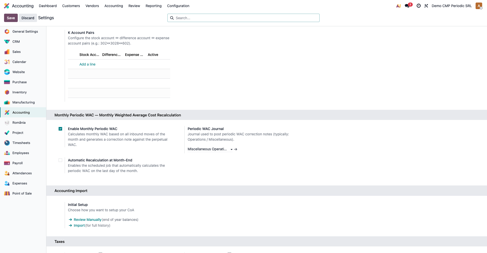
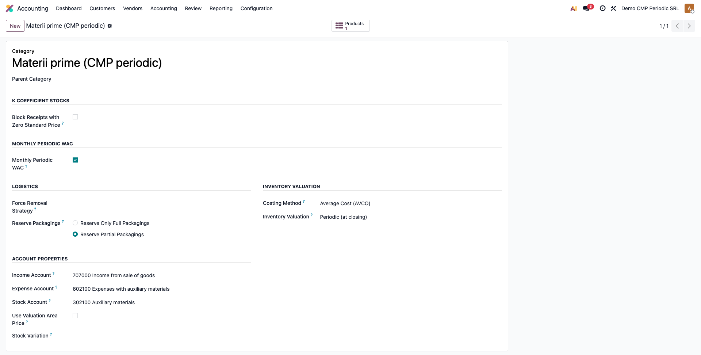
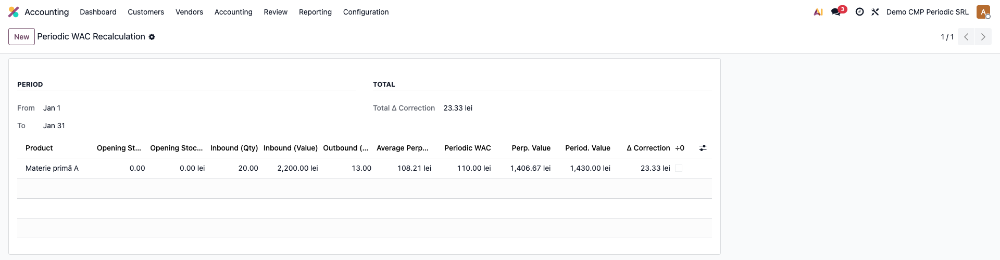
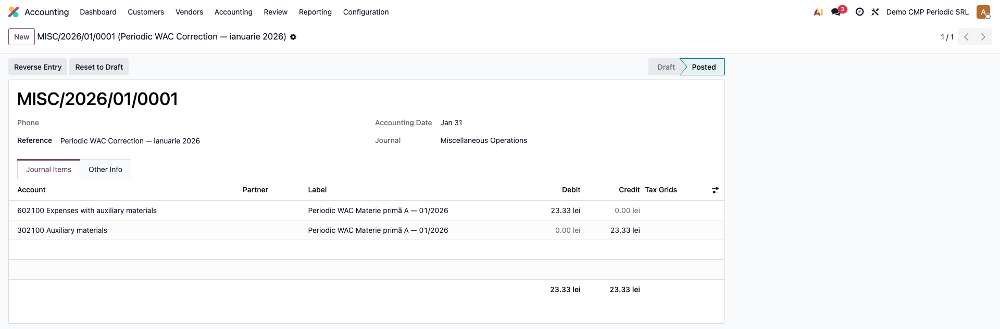
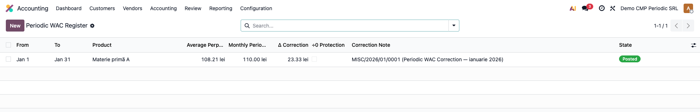

# Fișă Modul: CMP Periodic Lunar (notă de corecție)

**Poziție plan:** B1.2
**Modul:** `l10n_ro_stock_cmp_periodic`
**FR:** FR-36
**Capitol manual:** Cap 6.2
**Utilizator principal:** Contabil stocuri, Manager Contabilitate
**Prioritate:** 🔴 Ridicată (rulare lunară obligatorie dacă firma evaluează ieșirile la CMP periodic)

---

## 1. Scop business

Odoo 19 evaluează ieșirile din stoc la **CMP perpetuu**: costul mediu (`standard_price`) se
actualizează după fiecare intrare, iar fiecare ieșire este înregistrată imediat la CMP-ul din
momentul validării. Firmele migrate de la WinMentor sau SAGA folosesc însă **CMP periodic
(lunar)** — toate ieșirile dintr-o lună se evaluează la un cost mediu unic, calculat la finele
lunii pe baza stocului inițial și a tuturor intrărilor din lună.

Modulul `l10n_ro_stock_cmp_periodic` păstrează contabilitatea curentă a Odoo (perpetuu) și adaugă,
la sfârșit de lună, **o singură notă de corecție** care aduce valoarea ieșirilor de la CMP perpetuu
la CMP periodic. Nu rescrie notele deja postate (abordarea „notă de corecție", reversibilă și
auditabilă), păstrează un registru complet al calculelor și marchează fiecare mișcare de ieșire cu
valoarea provizorie și cea finală.

## 2. Bază legală și context

OMFP 1802/2014 — Reglementările contabile privind situațiile financiare anuale — admite mai multe
metode de evaluare la ieșirea din stoc (CMP, FIFO, identificare specifică). Atât CMP perpetuu, cât
și CMP periodic (lunar) sunt conforme; alegerea ține de politica contabilă a firmei și trebuie
păstrată consecvent de la un exercițiu la altul.

Formula CMP periodic lunar:

```
                Stoc_inițial_valoare + Intrări_valoare
CMP_periodic = ─────────────────────────────────────────
                Stoc_inițial_cant.  + Intrări_cant.

Δ corecție = (Ieșiri_cant. × CMP_periodic) − Valoare_perpetuă_postată
```

## 3. Utilizatori și roluri

Contabil stocuri / Manager contabilitate.

Roluri recomandate pentru testare:
- **Administrator funcțional** (Settings) — instalează modulul, activează opțiunea pe companie și
  alege jurnalul.
- **Contabil** (grupul „Contabil / Accountant") — rulează wizardul lunar și verifică nota de corecție.
- **Manager contabilitate** (grupul „Consilier / Adviser") — validează rezultatul și închiderea lunii.

## 4. Conturi și date implicate

Nota de corecție folosește conturile configurate **pe produs** (preluate automat din categoria de
produs, fila „Contabilitate de stoc"):

- **Cont cheltuieli** (`expense`) — un cont din grupa **602** „Cheltuieli cu materialele" (ex. 602.x
  consumabile/auxiliare) sau **607** „Cheltuieli privind mărfurile", după natura produsului.
- **Cont evaluare stoc** (`stock_valuation`) — un cont din grupa **302** „Materiale" sau **371** „Mărfuri".

> Sub-conturile concrete (ex. 602100, 302100) sunt cele configurate pe categoria/produsul din baza
> dvs. — modulul nu impune coduri fixe, ci preia conturile produsului.

Sensul notei:
- **Δ > 0** (CMP periodic > perpetuu, ieșiri subevaluate): **Dr 602/607 = Cr 302/371** cu valoarea Δ.
- **Δ < 0** (CMP periodic < perpetuu, ieșiri supraevaluate): **Dr 302/371 = Cr 602/607** cu |Δ|.

Date minime pentru demo:
- companie românească cu localizarea contabilă RO instalată;
- un jurnal de tip **Operațiuni diverse** (general) dedicat corecțiilor CMP;
- o categorie de produs cu metoda de cost **Cost mediu (AVCO)** și flag-ul CMP periodic activ;
- un produs stocabil în acea categorie, cu mișcări de intrare și ieșire în luna de test.

## 5. Configurare inițială

1. Instalați modulul `l10n_ro_stock_cmp_periodic` pe baza demo (dependențe: `account`,
   `stock_account`, `l10n_ro`).
2. **Contabilitate → Configurare → Setări → secțiunea „CMP Periodic Lunar"**: bifați
   **„Activează CMP periodic lunar"**.
3. La **„Jurnal CMP periodic"** alegeți un jurnal de tip *Operațiuni diverse*. Dacă nu există,
   creați-l înainte (ex: „Jurnal CMP Periodic").
4. Opțional, bifați **„Recalcul automat la închidere lună"** (vezi Pasul 5 din flux pentru limitări).
5. **Inventar → Configurare → Categorii de produse**: pe fiecare categorie relevantă verificați
   metoda de cost **Cost mediu (AVCO)** și bifa **„CMP periodic lunar"** (implicit bifată). Categoriile
   cu FIFO sau preț standard nu sunt eligibile și se ignoră automat.

> **Atenție la două câmpuri distincte pe categorie.** Câmpul nativ Odoo **„Evaluarea stocurilor"**
> (cu opțiunea „Periodic (la închidere)") controlează *când* generează Odoo notele de stoc și **nu
> este cerut de acest modul** — modulul lucrează peste valorile perpetue deja calculate de Odoo.
> Singurul comutator al modulului este bifa proprie **„CMP periodic lunar"** din secțiunea omonimă.

## 6. Flux de utilizare

### Pasul 1 — Activarea pe companie

**Contabilitate → Configurare → Setări**, secțiunea „CMP Periodic Lunar". Bifați opțiunea și
selectați jurnalul de corecție. Câmpurile pentru jurnal și recalcul automat devin vizibile doar
după activare.



### Pasul 2 — Marcarea categoriei de produs

**Inventar → Configurare → Categorii de produse** → deschideți categoria. În secțiunea „CMP
Periodic Lunar" lăsați bifa activă; verificați că metoda de cost este *Cost mediu (AVCO)*.



### Pasul 3 — Recalculul lunar (previzualizare)

**Contabilitate → CMP Periodic Lunar → Recalcul CMP Periodic**. Se deschide wizardul cu perioada
implicită setată pe luna curentă (prima → ultima zi). Opțional restrângeți la anumite produse în
câmpul „Produse (opțional)". Apăsați **„Calculează previzual"**.

Wizardul afișează câte o linie per produs care a avut ieșiri în lună, cu: stoc inițial (cant./val.),
intrări (cant./val.), ieșiri (cant.), CMP perpetuu mediu, CMP periodic, valoarea perpetuă, valoarea
periodică, **Δ corecție** și marcajul **÷0** (numitor zero → s-a folosit prețul standard ca fallback).
În antet apare **Total Δ corecție**. Liniile cu ÷0 sunt evidențiate, iar un banner avertizează dacă
perioada este blocată fiscal.



### Pasul 4 — Generarea notei de corecție

Apăsați **„Generează nota de corecție"**. Modulul:

1. creează și postează **o singură notă** în jurnalul CMP, datată în ultima zi a lunii, cu două
   linii per produs cu Δ ≠ 0 (cheltuieli vs. stoc), marcată **„Corecție CMP periodic"**;
2. scrie câte o linie în **Registrul CMP Periodic** (audit trail), cu toate valorile de calcul și
   legătura la notă;
3. marchează fiecare mișcare de ieșire din lună cu valoarea provizorie (CMP perpetuu) și valoarea
   finală (CMP periodic).

După confirmare, sistemul deschide direct nota de corecție generată.



### Pasul 5 — Verificarea în registru și recalcul automat

**Contabilitate → CMP Periodic Lunar → Registru CMP Periodic** afișează toate calculele, grupate
descrescător pe lună, cu starea **Calculat** sau **Postat** și link direct la nota de corecție.
Pe o mișcare de ieșire (Inventar → Operațiuni → Transferuri → linie mișcare), secțiunea „CMP
Periodic" arată valoarea provizorie, valoarea finală și nota asociată.

Pentru rulare automată există jobul **„CMP Periodic Lunar — Recalcul automat"** (lunar, **inactiv
implicit**). Se activează din **Setări tehnice → Automatizări → Acțiuni planificate**; când rulează,
procesează toate companiile cu CMP periodic activat și jurnal configurat, și sare lunile deja postate.



### Note de monografie și raportare

- Corecție **ieșiri subevaluate** (Δ > 0): **Dr 602/607 = Cr 302/371** cu valoarea Δ;
- corecție **ieșiri supraevaluate** (Δ < 0): **Dr 302/371 = Cr 602/607** cu |Δ| (sensul se inversează);
- nota este întotdeauna echilibrată (Σ Debit = Σ Credit) și marcată `l10n_ro_cmp_correction`,
  filtrabilă în jurnal prin filtrul **„Corecții CMP periodic"**;
- conturile sunt cele de stoc/cheltuieli ale produsului — corecția **nu afectează TVA** și nu intră
  în D300/D394;
- dacă Δ = 0 pentru un produs, nu se generează linie de notă pentru acel produs.

## 7. Legături cu alte module / declarații

| Modul / proces | Rol în flux | Tip legătură |
|---|---|---|
| `account` | nota de corecție și liniile contabile | dependență (manifest) |
| `stock_account` | valoarea mișcărilor de stoc (`value`, `is_in`/`is_out`), conturile produsului | dependență (manifest) |
| `l10n_ro` | localizare contabilă RO (plan de conturi) | dependență (manifest) |
| `l10n_ro_stock_k_coefficient` | metodă diferită (preț standard 302/378) — coexistă fără interferențe | independent |
| `l10n_ro_stock_report` | fișa de magazie reflectă valorile finale după corecție | integrare prin convenție |
| `l10n_ro_period_close_enhanced` | checklist de închidere — rulați CMP periodic înainte de închiderea lunii | secvențiere recomandată |

Ce este automat: calculul CMP lunar, nota de corecție, registrul de audit și marcarea mișcărilor.
Ce rămâne manual: activarea opțiunii și a categoriilor, alegerea jurnalului, validarea perioadei și
declanșarea wizardului (sau activarea explicită a cron-ului).

## 8. Verificări pentru consultant

- [ ] Modulul se instalează fără erori pe baza demo.
- [ ] Opțiunea „CMP periodic lunar" și jurnalul apar în Setări contabilitate.
- [ ] Categoriile cu Cost mediu (AVCO) au bifa CMP periodic; cele FIFO/standard sunt ignorate.
- [ ] Wizardul afișează o linie per produs cu ieșiri și un Total Δ corect.
- [ ] Nota de corecție este postată, echilibrată (Dr = Cr) și marcată „Corecție CMP periodic".
- [ ] Registrul CMP Periodic conține calculul lunii, cu link la notă și starea „Postat".
- [ ] Recalculul aceleiași luni deja postate este blocat cu mesaj clar.
- [ ] O perioadă blocată fiscal blochează generarea notei.

## 9. Mesaje de eroare frecvente

| Mesaj / simptom | Cauză probabilă | Remediere |
|-----------------|-----------------|-----------|
| „Calculați previzualul înainte de generarea notei." | S-a apăsat „Generează" fără previzualizare | Apăsați mai întâi „Calculează previzual" |
| „Nu există date de corectat pentru perioada selectată." | Nicio ieșire eligibilă în lună (sau toate Δ = 0) | Verificați mișcările lunii și categoriile bifate |
| „Configurați jurnalul CMP periodic în setările companiei." | Opțiunea e activă dar jurnalul lipsește | Selectați jurnalul în Setări → CMP Periodic Lunar |
| „Luna … are deja CMP periodic postat. Anulați nota de corecție înainte de recalcul." | Luna a fost deja calculată și postată | Anulați nota și resetați liniile din registru, apoi recalculați |
| „Perioada … este blocată (lock date: …). Nu se pot genera note contabile retroactive." | Data lunii ≤ data de blocare fiscală | Deblocați temporar perioada sau alegeți o lună deschisă |
| Produs eligibil dar absent din previzual | Produsul nu a avut ieșiri validate în lună | Comportament corect — CMP periodic se aplică doar la ieșiri |
| Linie cu marcaj ÷0 | Stoc inițial + intrări = 0 (s-a folosit prețul standard) | Verificați ieșirile fără intrări corespunzătoare (lipsuri de stoc) |

## 10. Capturi de ecran

Capturile (`readme/screenshots/`) sunt **generate automat** din `tests/test_screenshots.py`
(mixinul `ScreenshotCase` din `l10n_ro_doc_screenshots`, import defensiv), în **limba română**,
pe planul de conturi RO (`setup_country("ro")`):

1. `01_setari_companie.png` — Setări contabilitate cu CMP periodic activat și jurnalul de corecție.
2. `02_categorie_produs.png` — categorie de produs cu flag-ul CMP periodic activ.
3. `03_wizard_preview.png` — wizardul de recalcul în previzualizare, cu tabelul Δ per produs.
4. `04_nota_corectie.png` — nota de corecție generată (linii Dr 602 / Cr 302).
5. `05_registru_cmp.png` — Registrul CMP Periodic cu istoricul calculelor.

Regenerare:

```bash
./odoo/odoo-bin -c odoo.conf -d <db> -i l10n_ro_stock_cmp_periodic,l10n_ro_doc_screenshots \
    --test-tags=fise_screenshots --stop-after-init
```

## 11. Observații pentru manual

În manualul final, păstrați explicația orientată pe activitatea utilizatorului: diferența dintre CMP
perpetuu (implicit Odoo) și CMP periodic (lunar, WinMentor/SAGA), când se rulează corecția (la
închiderea lunii, înainte de blocarea perioadei), ce date trebuie pregătite (categorii AVCO bifate,
jurnal de corecție) și cum se verifică rezultatul (nota echilibrată + registrul de audit). Subliniați
că modulul nu modifică notele deja postate, ci adaugă o corecție transparentă și reversibilă.
