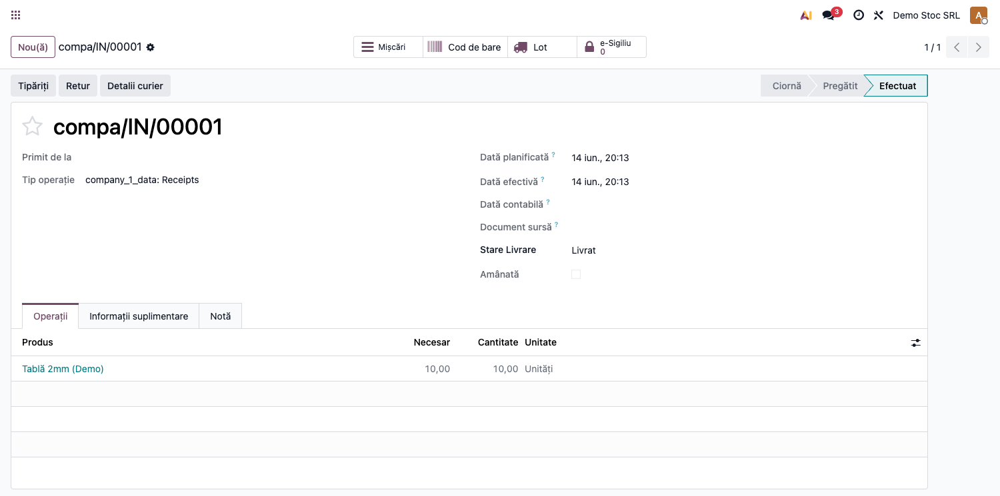
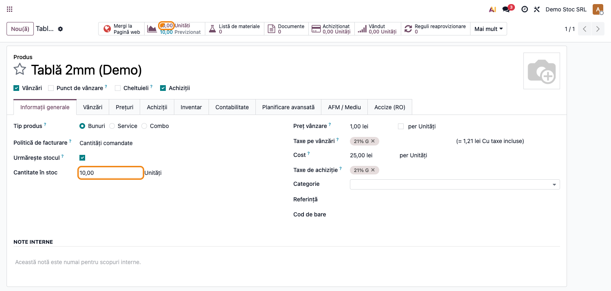

# Fișă Modul: Protecții Integritate Stocuri (FR-54)

**Poziție plan:** C16
**Modul:** `l10n_ro_stock_constraints`
**FR:** FR-54
**Capitol manual:** Cap 6.7
**Utilizator principal:** Contabil stocuri, Manager depozit
**Prioritate:** 🔴 Ridicată

---

## 1. Scop business

Modulul protejează integritatea stocurilor prin două mecanisme independente:
1. **Blocare ORM**: împiedică modificarea cantităților pe mișcări de stoc deja validate și
   valorificate contabil (`is_valued=True` în Odoo 19).
2. **Constraint SQL**: interzice stocul negativ pe locațiile interne (tip `internal`),
   aplicat direct la nivel de bază de date prin `ALTER TABLE ... ADD CONSTRAINT`.

Fără aceste protecții, operatorii pot corecta accidental cantitățile după validare, ceea
ce corupea fișa de magazie și valorizarea stocului.

## 2. Bază legală și context

OMFP 1802/2014 — integritatea înregistrărilor contabile; fișa de magazie trebuie să
reflecte exact mișcările validate. Modificarea post-factum a mișcărilor valorificate
produce discrepanțe între evidența de stoc și cea contabilă.

## 3. Utilizatori și roluri

- **Contabil stocuri**: verifică că mișcările valorificate nu au fost alterate.
- **Manager depozit**: confirmă că stocul nu scade sub zero pe locații interne.
- **Administrator**: gestionează excepțiile prin documente de ajustare/storno.

## 4. Date implicate

- Mișcări de stoc în stare `done` cu `is_valued=True` (au generat note contabile).
- Locații interne (`usage=internal`) — depozite, zone de producție.
- `stock.quant` — cantitățile fizice la nivel de locație.

## 5. Configurare inițială

1. Instalați `l10n_ro_stock_constraints` (dependență: `stock_account`).
2. `post_init_hook` adaugă automat constraint-ul SQL pe `stock_quant`:
   ```
   CHECK (quantity >= 0 OR location_usage != 'internal')
   ```
3. Nu necesită configurare suplimentară — protecțiile sunt active imediat după instalare.

## 6. Flux de utilizare

### Pasul 1 — Recepție validată (protecție ORM)

Creați și validați o recepție. Transferul trece în stare **Efectuat** cu mișcările
înregistrate contabil. Linia de produs (ex. "Tablă 2mm") are cantitatea blocată la editare.

**Recepție Efectuat — mișcări valorificate, stare protejată:**



### Pasul 2 — Stoc pozitiv verificat (constraint SQL)

Produsul stocabil apare cu **Cantitate în stoc ①** pozitivă. Orice tentativă de UPDATE
direct în BD care ar seta o cantitate negativă pe o locație internă este blocată de
constraint-ul `check_positive_quantity_for_internal_location`.

**Produsul după recepție — Cantitate în stoc 10,00 Unități ①:**



### Pasul 3 — Mesaje de blocare

| Acțiune blocată | Mesaj afișat |
|---|---|
| Modificare cantitate pe linie Done+valorificată | `Cannot modify the quantity on a completed stock move/transfer with accounting valuation.` |
| Adăugare linie pe mișcare Done+valorificată | `Cannot create a line on a completed stock move with existing accounting valuation.` |
| UPDATE cantitate negativă pe locație internă (BD) | `CheckViolation` PostgreSQL |

### Pasul 4 — Corecții permise

Corecțiile se fac **exclusiv** prin:
- **Ajustare inventar** (`Inventar → Operațiuni → Ajustări fizice`)
- **Returnare** (buton „Retur" pe transferul validat)
- **Storno** (pentru mișcări cu impact contabil)

## 7. Legături cu alte module

| Modul | Rol în flux |
|---|---|
| `stock_account` | valorificarea contabilă a mișcărilor (câmpul `is_valued`) |
| `l10n_ro_invoice_dvi_protect` | protecție similară pe DVI/consum FIFO |
| `l10n_ro_stock_report` | fișa de magazie — beneficiară directă a integrității |
| `l10n_ro_force_storno` | storno roșu pentru corecții post-validare |

Ce este automat: blocarea la nivel ORM și SQL, fără acțiune utilizator.
Ce rămâne manual: corecțiile legitime prin documente dedicate.

## 8. Verificări pentru consultant

- [ ] Modulul se instalează fără erori și constraint-ul SQL există în PostgreSQL.
- [ ] Modificarea cantității pe o mișcare Done+valorificată ridică `UserError`.
- [ ] Crearea unei linii noi pe mișcare Done+valorificată ridică `UserError`.
- [ ] Un UPDATE SQL negativ pe locație internă ridică `CheckViolation`.
- [ ] Mișcările pe locații non-interne (clienți, furnizori) nu sunt blocate de SQL constraint.

## 9. Mesaje frecvente

| Simptom | Cauză probabilă | Remediere |
|---------|-----------------|-----------|
| Nu pot modifica cantitatea pe o livrare Done | Mișcarea are valorizare contabilă | Faceți un Retur și reemiteți |
| Stoc negativ imposibil | Constraint SQL activ | Verificați stocul disponibil sau faceți recepție prealabilă |
| Constraint-ul SQL nu există | Instalare incompletă | Reinstalați modulul sau rulați `post_init_hook` manual |

## 10. Capturi de ecran

| # | Fișier | Conținut |
|---|--------|----------|
| 1 | `screenshots/01_receptie_validata.png` | Recepție în stare Efectuat — mișcări valorificate, linii blocate la editare |
| 2 | `screenshots/02_produs_cantitate_stoc.png` | Produsul cu Cantitate în stoc 10,00 ① — constraint SQL pozitiv activ |
