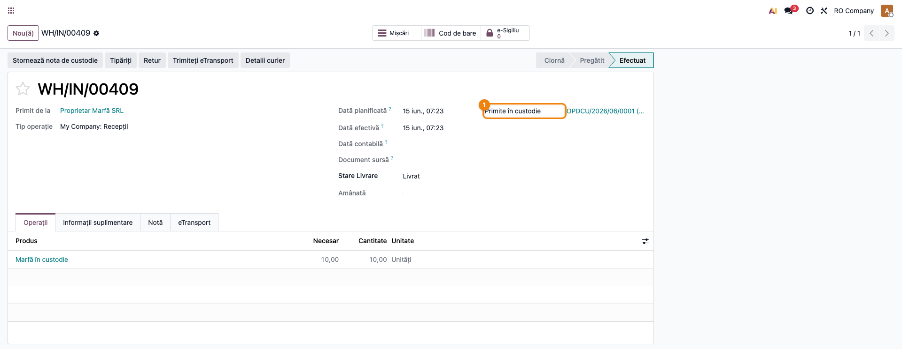
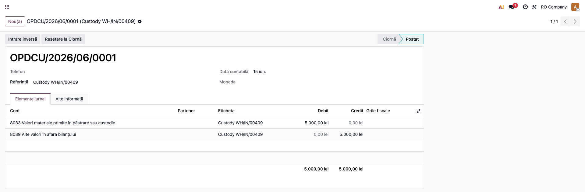
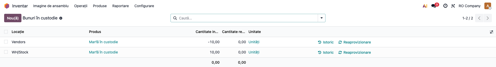
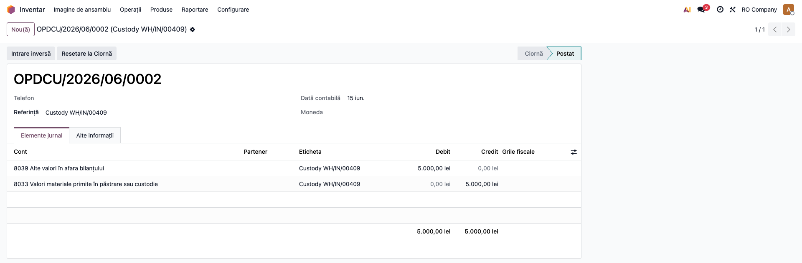

# Fișă Modul: Custodia Stocurilor (cont 8033)

**Modul:** `l10n_ro_stock_custody`
**Utilizator principal:** Gestionar, Contabil stocuri
**Prioritate:** 🟡 Medie (mărfuri ale terților în gestiune)

---

## 1. Scop business

Modulul gestionează **bunurile primite în custodie** (fără transfer de proprietate) — mărfuri ale
terților ținute spre păstrare/custodie. Evidența se ține în afara bilanțului, pe contul **8033**,
iar stocul nu intră în valorizarea proprie. Rezolvă o nevoie frecventă: să ai mărfurile terțului în
gestiune fizic, dar separate contabil de stocul propriu.

## 2. Bază legală și context

OMFP 1802/2014 — contul în afara bilanțului **8033 „Valori materiale primite în păstrare sau
custodie"**, distinct de obiectele de inventar date în folosință (8035). Evidența extracontabilă a
bunurilor terților, fără impact pe bilanț sau pe contul de profit și pierdere.

## 3. Utilizatori și roluri

Gestionar (recepție/retur custodie), Contabil stocuri (verifică nota 8033 și raportul).

Roluri recomandate pentru testare:
- Utilizator Inventar: marchează transferul ca custodie, validează recepția.
- Contabil: verifică nota extracontabilă și raportul „Bunuri în custodie".

## 4. Conturi și date implicate

- **8033** — Valori materiale primite în păstrare sau custodie (debit la recepție).
- **8039** — Alte valori în afara bilanțului (contrapartidă; credit la recepție).
- Un **jurnal** de tip Diverse pentru nota extracontabilă.

Date minime pentru demo: companie RO (plan de conturi cu 8033/8039), un produs, un partener (terțul),
o locație de recepție.

## 5. Configurare inițială

1. Instalați `l10n_ro_stock_custody`.
2. În **Contabilitate → Setări → Romania - Stock Custody**, verificați/setați **Contul de custodie**
   (implicit 8033), **Contul contrapartidă** (implicit 8039) și **Jurnalul de custodie**.
3. Dacă nu sunt setate, modulul le caută automat după cod în planul RO.

## 6. Flux de utilizare

### Pasul 1 — Marcarea și validarea recepției în custodie

Pe transferul de stoc (recepție), setați câmpul **Custodie** = „Primite în custodie", apoi
**Validează**. Modulul setează automat proprietarul (terțul) pe liniile de mișcare — consignație
nativă Odoo, deci bunurile **nu** intră în valorizarea proprie — și generează nota extracontabilă.



### Pasul 3 — Nota extracontabilă Dr 8033 = Cr 8039

Din transfer, deschideți nota de custodie generată automat: un articol pe conturi în afara bilanțului,
echilibrat, fără impact pe bilanț/CPP.



### Pasul 4 — Raportul „Bunuri în custodie"

Accesați **Inventar → Raportare → Goods in Custody**. Pe ecran, fiecare rând e un stoc ținut pe seama
unui terț (quant cu proprietar setat). Verificați că apar doar bunurile în custodie (proprietar ≠
companie) și cantitățile corespund recepțiilor. Lista poate fi grupată pe proprietar.



### Pasul 5 — Stornarea la retur

La returul bunurilor către terț, apăsați **Reverse Custody Entry** pe transfer — se generează nota
de stornare (Dr 8039 = Cr 8033).



### Note de monografie și raportare

- Recepție custodie: **Dr 8033 = Cr 8039** (valoarea bunurilor, în afara bilanțului).
- Retur custodie: **Dr 8039 = Cr 8033** (stornare).
- „Custodie dată" (bunuri proprii la terți) este doar marcaj/evidență — tratamentul on-balance prin
  contul **357 „Mărfuri aflate la terți"** nu face parte din scope-ul acestui modul.

## 7. Legături cu alte module / declarații

| Modul | Rol |
|---|---|
| `stock` / `stock_account` (nativ) | Consignația (proprietar pe stoc), transferurile. |
| `l10n_ro` | Planul de conturi RO (8033/8039). |

**Ce e automat:** proprietarul pe stoc, nota 8033/8039 la recepție, stornarea la retur, raportul.
**Ce rămâne manual:** marcarea transferului ca custodie; tratamentul 357 pentru „custodie dată".

## 8. Verificări pentru consultant

- [ ] Recepția marcată „custodie primită" setează proprietarul terț pe quant (stoc neevaluat propriu).
- [ ] Se generează nota **Dr 8033 = Cr 8039**, echilibrată și exclusiv pe conturi off-balance.
- [ ] Nota nu afectează bilanțul sau contul de profit și pierdere.
- [ ] Raportul „Bunuri în custodie" listează doar stocurile pe seama terților.
- [ ] **Reverse Custody Entry** generează stornarea (Dr 8039 = Cr 8033).

## 9. Mesaje de eroare frecvente

| Mesaj | Cauză | Remediere |
|---|---|---|
| „Configure the custody off-balance accounts (8033 / 8039)…" | Conturile nu sunt setate și nu există în plan | Setați conturile în Contabilitate → Setări sau verificați planul RO |
| „No general journal available…" | Lipsește jurnalul de tip Diverse | Configurați un jurnal general sau setați jurnalul de custodie |
| „This transfer has no custody entry to reverse." | Storno apăsat fără notă de custodie | Stornarea se aplică doar transferurilor cu notă de custodie |

## 10. Capturi de ecran

Se **generează automat** din `tests/test_screenshots.py` (mixin `ScreenshotCase`), în RO, pe planul RO.
La momentul redactării **nu există încă** — rulați `fisa-screenshots`. Lista planificată:

1. `02_receptie_validata.png` — recepție validată, marcată custodie primită (proprietar terț).
2. `03_nota_8033.png` — nota Dr 8033 = Cr 8039.
3. `04_raport_custodie.png` — raportul Bunuri în custodie.
4. `05_storno_custodie.png` — stornarea la retur (Dr 8039 = Cr 8033).

```bash
./odoo/odoo-bin -c odoo.conf -d test19 -u l10n_ro_stock_custody \
  --test-tags=fise_screenshots --stop-after-init
```

## 11. Observații pentru manual

- Subliniați separarea contabilă: bunurile în custodie NU sunt stoc propriu (off-balance 8033).
- Explicați diferența 8033 (primite în custodie) vs 357 (date la terți, on-balance, în afara scope).
- Menționați mecanismul de consignație nativ (proprietar pe quant) care exclude valorizarea proprie.
