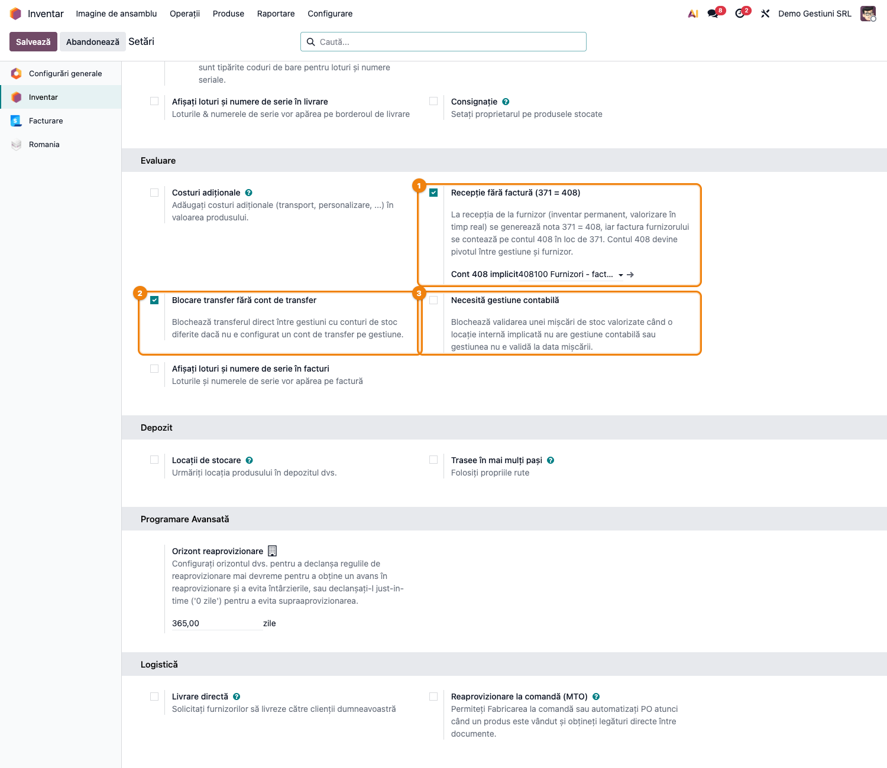
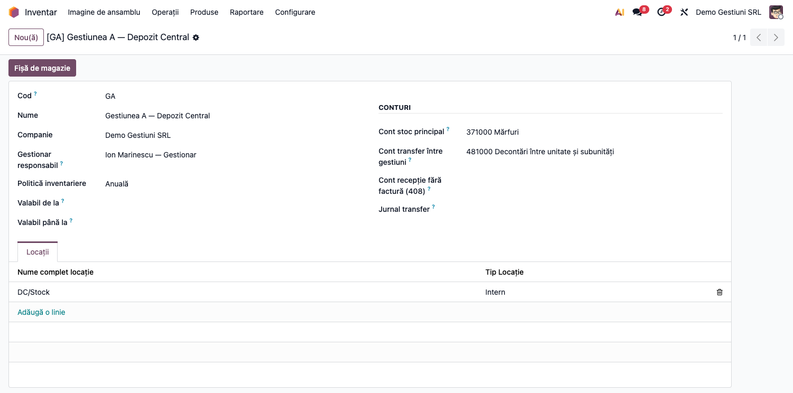
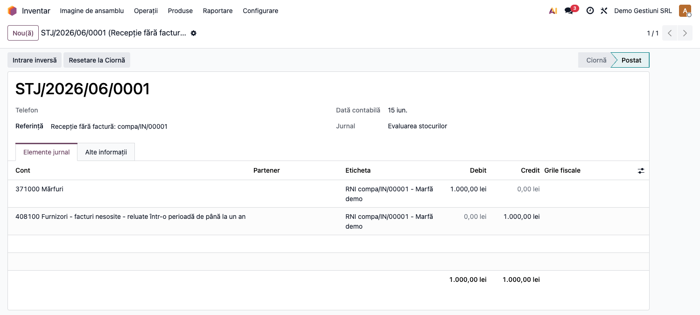
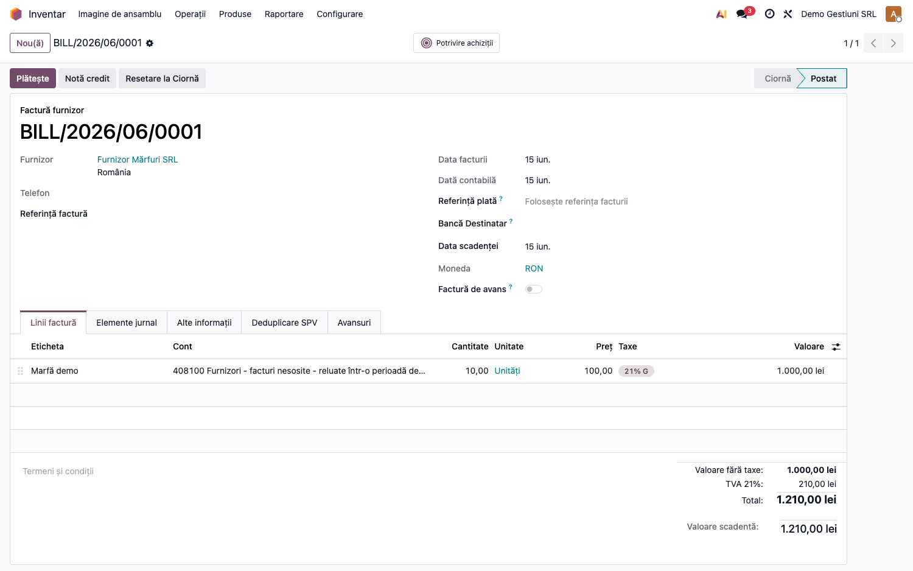
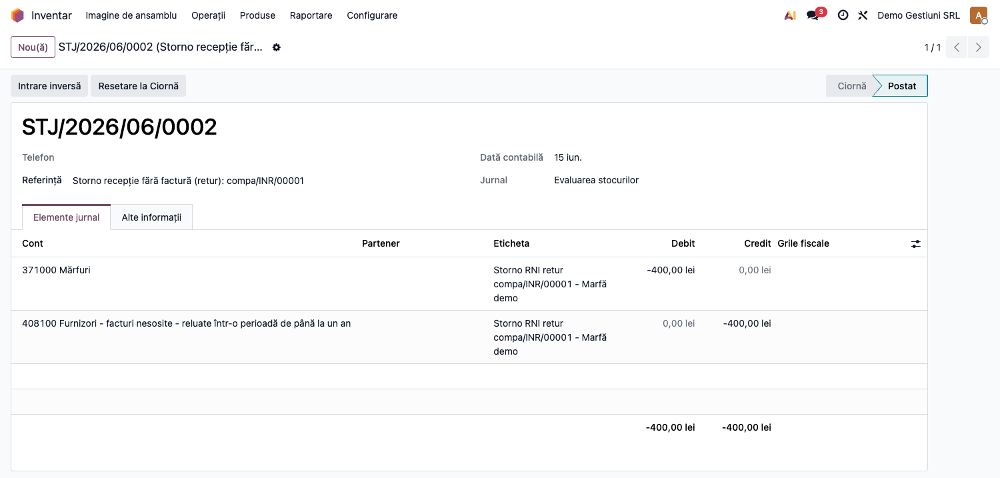
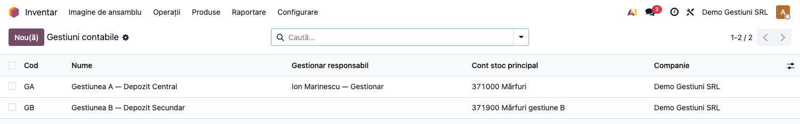
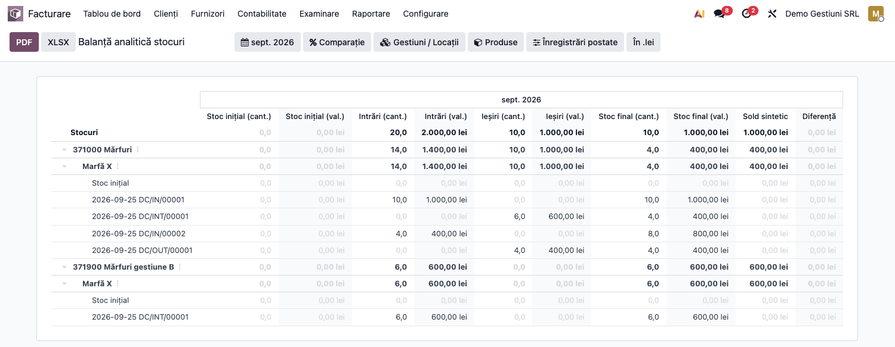

# Fișă Modul: Gestiuni contabile de stoc, transfer valoric și recepție fără factură (371=408)

**Poziție plan:** B1.6
**Modul:** `l10n_ro_stock_gestiune`
**FR:** FR-54
**Capitol manual:** Cap 6.9
**Utilizator principal:** Contabil stocuri, Contabil furnizori, Manager depozit
**Prioritate:** 🔴 Ridicată (afectează valorizarea stocurilor și datoriile către furnizori)

---

## 1. Scop business

Modulul definește gestiunea contabilă ca model propriu (`l10n.ro.gestiune`) și:

- separă **gestiunea contabilă de stoc** (cont 371/301/302/345, gestionar responsabil) de depozitul
  logistic și de locațiile operaționale;
- controlează **transferul valoric între gestiuni** cu conturi de stoc diferite (cont de transfer
  sau traseu prin tranzit);
- recunoaște automat **recepția mărfii fără factură** (inventar permanent, valorizare perpetuă):
  nota `371 = 408` la recepție și stingerea `408 = 401` la sosirea facturii.

Contul **408 „Furnizori – facturi nesosite"** devine pivot între gestiune și furnizor, independent de
ordinea recepție/factură, și tratează corect diferențele de curs (la achiziții în valută) și de preț.

**Firul valoric** — ideea centrală a modulului: fiecare operațiune de stoc (recepție, retur,
transfer) poartă o **valoare** care trebuie să se regăsească, în orice moment, în trei locuri
deodată, cu aceeași sumă:

1. pe **mișcarea de stoc** (valoarea operațiunii, calculată la cost FIFO/CMP/standard);
2. în **nota contabilă** generată automat în jurnalul de stoc, cu gestiunea pe fiecare linie;
3. în **soldul contului de stoc al gestiunii** (371.x al gestiunii = valoarea mărfii din gestiune).

Secțiunea 6 urmărește acest fir cu un exemplu numeric continuu, iar pasul final arată cum se
verifică egalitatea cantitate↔valoare↔contabilitate în balanța de stocuri.

## 2. Bază legală și context

- **Legea contabilității 82/1991** — evidență cronologică și sistematică, controlul stocurilor.
- **OMFP 1802/2014** — inventar permanent; elementele monetare în valută se reevaluează (diferențe de
  curs pe 765/665), iar stocul (activ nemonetar) rămâne la cursul recepției; metode de evaluare la
  ieșire (CMP, FIFO, cost standard).
- **OMFP 2861/2009** — inventariere pe gestiuni, locuri de depozitare și responsabili.
- **OMFP 2634/2015** — documente justificative de stoc (recepție, transfer, fișă de magazie).

Monografia RO pentru recepție înainte de factură: la recepție `% = 408` (Dr 371), iar la factură
`408 = 401` (plus `4426`), conform practicii de inventar permanent.

## 3. Utilizatori și roluri

- **Contabil stocuri / furnizori** — configurează conturile și verifică notele 371/408.
- **Manager depozit** — validează organizarea pe gestiuni și traseul prin tranzit.
- **Administrator Odoo** — activează setările companiei și definește gestiunile.

Roluri recomandate pentru testare:
- Administrator funcțional: instalează modulul, activează setările, verifică meniurile.
- Utilizator operațional: rulează recepțiile, transferurile și returnurile.
- Contabil/manager: validează notele contabile, stingerea contului 408 și balanța de stocuri.

## 4. Conturi și date implicate

| Cont | Rol |
|---|---|
| **371 / 301 / 302 / 345** | cont de stoc al gestiunii (latura debit la recepție); soldul lui = valoarea gestiunii |
| **408** | „Furnizori – facturi nesosite" — datoria estimată la recepția fără factură |
| **401** | datoria față de furnizor (la sosirea facturii) |
| **308 / 378** | diferențe de preț (la cost standard) |
| **665 / 765** | cheltuieli / venituri din diferențe de curs valutar |
| **481** | cont intermediar de transfer între gestiuni (exemplu) |

**Unde trăiește valoarea stocului** (Odoo 19, valorizare perpetuă):

- pe fiecare **mișcare de stoc**: câmpul *Valoare* — costul operațiunii la metoda produsului
  (FIFO/CMP/standard); suma mișcărilor de intrare minus ieșire = valoarea stocului;
- pe fiecare **linie contabilă** din jurnalul de stoc: pe lângă debit/credit, liniile poartă
  **cantitatea semnată** (pozitivă la intrare în cont, negativă la ieșire) și **gestiunea**
  (aria de evaluare) — de aceea balanța de stocuri poate afișa simultan cantitate și valoare,
  pe cont și pe gestiune;
- în **soldul contului de stoc** al fiecărei gestiuni: în orice moment, sold 371.x = valoarea
  mărfii aflate fizic în gestiunea respectivă.

Date minime pentru demo:
- companie românească cu localizarea contabilă (plan de conturi RO) și jurnal de stoc configurat;
- două gestiuni (arii de evaluare) cu conturi de stoc **diferite** (ex. 371.1 și 371.2), cont de
  transfer (ex. 481) și cont 408;
- produse stocabile cu **valorizare perpetuă (`real_time`)** și metodă de cost (FIFO / CMP / standard);
- furnizor și, pentru fluxul complet, o comandă de achiziție;
- pentru pasul de verificare finală: modulul `l10n_ro_stock_sheet` (balanța analitică a stocurilor).

## 5. Configurare inițială

### 5.1 Activare arii de evaluare, regulă strictă și recepție fără factură

Meniu: **Inventar → Configurare → Setări**

1. Activați **Recepție fără factură (371 = 408)** și alegeți **Contul 408 implicit** (dacă folosiți fluxul RNI).
2. Opțional, pentru control strict pe transferuri: **Blocare transfer fără cont de transfer**.



**Două moduri de declanșare a notei 371 = 408** — alegeți în funcție de cum lucrați:

- **La nivel de companie** — cu setarea **Recepție fără factură (371 = 408)** activă, *toate*
  recepțiile valorizate de la furnizor generează automat nota 371 = 408. Recomandat când marfa
  ajunge de regulă înaintea facturii.
- **Punctual, pe aviz (per recepție)** — chiar cu setarea de companie oprită, puteți marca o
  recepție ca **Recepție pe aviz** (câmpul `Recepție pe aviz` de pe transfer). Doar recepțiile
  bifate generează nota 371 = 408. Pentru automatizare, bifați **Recepție pe aviz în mod implicit**
  pe **tipul de operație** (Inventar → Configurare → Tipuri de operații) — orice transfer nou creat
  pentru acel tip (inclusiv recepțiile din comenzi de achiziție) primește automat bifa.

Cele două moduri sunt compatibile: dacă setarea de companie e activă, ea prevalează pentru toate
recepțiile; avizul per-transfer rămâne util când setarea de companie e oprită.

### 5.2 Configurare gestiuni

Meniu: **Inventar → Configurare → Gestiuni contabile**

| Câmp | Rol |
|---|---|
| `Code` / `Name` | identificarea gestiunii |
| `Gestionar responsabil` | persoana responsabilă (OMFP 2861/2009) |
| `Cont stoc principal` | contul clasa 3 al gestiunii |
| `Cont transfer între gestiuni` | cont intermediar (ex. 481) pentru transferuri cu conturi diferite |
| `Cont recepție fără factură (408)` | override per gestiune (altfel se folosește cel de pe companie) |
| `Politică inventariere` | la cerere / periodică / anuală |



### 5.3 Asociere locații interne

Asociați locațiile interne la gestiunea contabilă prin câmpul **Gestiune contabilă** (`l10n_ro_gestiune_id`) de pe locație.

## 6. Flux de utilizare

### Exemplul numeric condus prin toți pașii

Toți pașii de mai jos folosesc același caz, ca să poată fi urmărită valoarea de la un capăt la
altul:

- **Gestiunea A** „Depozit Central" — cont stoc **371.1**;
- **Gestiunea B** „Magazin" — cont stoc **371.2**; cont de transfer **481**;
- produs **Marfă X**, stocabil, valorizare perpetuă, FIFO;
- recepție de la furnizor: **10 buc × 100 lei = 1.000 lei**, TVA 21%.

După fiecare pas, tabelul „Starea stocului și a conturilor" arată unde se află cantitatea și
valoarea. Regula de control, valabilă la fiecare pas: **valoarea fizică a gestiunii = soldul
contului ei de stoc**, iar suma tuturor gestiunilor = soldul clasei 3.

### Pasul 1 — Recepția mărfii fără factură (371 = 408)

Meniu: **Inventar → Operațiuni → Recepții** — validați recepția de 10 buc Marfă X în Gestiunea A.

Nota se generează dacă recepția e „fără factură": fie pentru că setarea de companie **Recepție fără
factură (371 = 408)** e activă (toate recepțiile), fie pentru că recepția e marcată **Recepție pe
aviz** (bifă pe transfer sau implicită pe tipul de operație — vezi 5.1).

La validare, mișcarea de stoc primește **valoarea 1.000 lei** (10 × 100, la costul de achiziție),
iar modulul generează automat nota contabilă de încărcare în gestiune și de recunoaștere a
datoriei estimate — ambele linii poartă Gestiunea A:

- **Dr 371.1 = 1.000** (marfa intră în gestiune, cantitate +10 pe linie);
- **Cr 408 = 1.000** (datorie estimată; factura nu a sosit).



**Starea după pas:**

| | Cant. | Valoare | 371.1 | 371.2 | 408 | 401 |
|---|---|---|---|---|---|---|
| Gestiunea A | 10 buc | 1.000 | **1.000 D** | — | **1.000 C** | — |

### Pasul 2 — Factura furnizorului (408 = 401)

Meniu: **Achiziții → Comenzi** → comanda de achiziție → **Creare factură**, apoi confirmarea
facturii în **Contabilitate → Furnizori → Facturi**.

Linia de produs stocabil este contată pe **408** (nu pe 371 — marfa e deja în gestiune, valoarea
ei nu se modifică), iar contul 408 este debitat cu exact valoarea creditată la recepție:

- **Dr 408 = 1.000** + **Dr 4426 = 210** / **Cr 401 = 1.210**.

Stingerea este determinată de documente, nu de potrivirea sumelor: contul 408 **nu** trebuie să
fie marcat „Permite reconcilierea".



**Starea după pas** — observați că factura **nu mișcă stocul**: cantitatea și valoarea gestiunii
rămân neschimbate; se mută doar datoria, din „estimată" (408) în „certă" (401):

| | Cant. | Valoare | 371.1 | 371.2 | 408 | 401 |
|---|---|---|---|---|---|---|
| Gestiunea A | 10 buc | 1.000 | 1.000 D | — | **0** (stins) | **1.210 C** |

Cazuri particulare (tratate automat, detaliate în „Note de monografie"):
- **valută**: stocul rămâne la cursul recepției; diferența de curs recepție↔factură merge pe 665/765;
- **preț diferit pe factură**: diferența ajustează 371 (FIFO/CMP) sau merge pe 308 (cost standard).

### Pasul 3 — Returul către furnizor (storno în roșu)

*Ramură a fluxului: returul de mai jos presupune că factura nu a sosit încă (nota 371 = 408 e
activă). Cifrele acestui pas sunt pe ramură; firul principal continuă la Pasul 4 cu 10 buc.*

Meniu: **Inventar → Operațiuni → Recepții** → recepția validată → **Retur** — returnați 4 buc.

Nota `371 = 408` se **stornează în roșu** (OMFP 1802), proporțional cu valoarea returnată
(4 × 100 = 400), astfel încât gestiunea și contul 408 scad împreună:

- **Dr 371.1 = −400** / **Cr 408 = −400** (sume negative pe aceleași poziții, cantitate −4).



**Starea pe ramura de retur:**

| | Cant. | Valoare | 371.1 | 408 |
|---|---|---|---|---|
| Gestiunea A | 6 buc | 600 | 600 D | 600 C |

### Pasul 4 — Transfer valoric între gestiuni

Meniu: **Inventar → Operațiuni → Transferuri interne** — transferați **6 buc** din Gestiunea A
(locație legată de A) în Gestiunea B (locație legată de B).

Gestiunile au conturi de stoc **diferite** (371.1 ≠ 371.2), deci transferul nu e doar fizic, ci și
**valoric**: 6 × 100 = **600 lei** trebuie să iasă din contul gestiunii A și să intre în contul
gestiunii B. Modulul impune (cu regula strictă activă) ca traseul valoric să fie configurat înainte
de validare:

- **cu cont de transfer** (ex. 481): valoarea trece prin contul intermediar —
  ieșire **Dr 481 = Cr 371.1 (600)**, intrare **Dr 371.2 = Cr 481 (600)**; contul 481 se închide
  la zero, deci nu rămâne valoare „suspendată";
- **prin tranzit**: același rezultat, în doi pași (ieșire în locația de tranzit, apoi intrare),
  fiecare cu nota lui;
- **fără configurare**: validarea este **blocată** cu mesaj explicit (vezi secțiunea 9).

Nota valorică a transferului este generată **de acest modul** (nu de un strat extern de valorizare),
pe baza contului **Cont transfer între gestiuni** configurat pe gestiune: la ieșire `Dr 481 = Cr 371.sursă`,
la intrare `Dr 371.dest = Cr 481`. În plus, modulul garantează că transferul direct nu poate fi validat
fără un traseu contabil corect (regula strictă — vezi secțiunea 9).



**Starea după pas** — esențial: transferul **nu creează și nu pierde valoare**; totalul stocului
rămâne 1.000, doar se redistribuie între gestiuni:

| | Cant. | Valoare | 371.1 | 371.2 | 481 |
|---|---|---|---|---|---|
| Gestiunea A | 4 buc | 400 | **400 D** | — | 0 |
| Gestiunea B | 6 buc | 600 | — | **600 D** | 0 |
| **Total** | **10 buc** | **1.000** | | | |

### Pasul 5 — Verificarea valorii: balanța analitică a stocurilor (cantitate + valoare)

Meniu: **Contabilitate → Raportare → Balanță analitică a stocurilor (RO)** (din modulul
`l10n_ro_stock_sheet`); pentru un singur produs, butonul **Fișă de magazie** de pe fișa produsului
deschide direct detaliul lui.

1. **Găsiți pe ecran** — fiecare rând de nivel 1 este un **cont de stoc** (deci o gestiune: 371.1,
   371.2); desfășurat, nivelul 2 sunt **produsele**, iar nivelul 3 **mișcările** (fișa de magazie).
   Coloanele perechi arată **cantitate + valoare** pentru: *Stoc inițial*, *Intrări*, *Ieșiri*,
   *Stoc final*; ultimele două coloane sunt **Sold sintetic** (soldul contului din contabilitate)
   și **Diferență** (stoc final valoric − sold sintetic).
2. **Verificați** — pe exemplul condus: rândul 371.1 are stoc final **4 buc / 400 lei**, rândul
   371.2 are **6 buc / 600 lei**; pe fiecare rând, coloana *Diferență* este **0** (gestiunea bate
   cu contabilitatea); totalul valoric (1.000) este egal cu suma intrărilor minus ieșirile, iar
   contul 408 are sold 0 după facturare. O diferență nenulă înseamnă note manuale pe conturile de
   stoc sau mișcări nevalorizate — de investigat înainte de închidere.
3. **Treceți mai departe** — abia după confirmarea acestor egalități, exportați raportul cu
   butoanele **PDF** sau **XLSX** din antetul raportului, pentru dosarul de închidere de lună.



### Note de monografie și raportare

- Recepție fără factură: **Dr 371 = Cr 408** (la cursul recepției, pentru achiziții în valută).
- Factură furnizor: **Dr 408 + Dr 4426 = Cr 401**; contul 408 se stinge prin document (fără
  reconciliere), cu valoarea creditată la recepție, proporțional cu cantitatea facturată.
- Diferență de curs recepție↔factură (valută), recunoscută la primirea facturii: **Dr 408 = Cr 765**
  (favorabilă) sau **Dr 665 = Cr 408** (nefavorabilă). Stocul **nu** se reevaluează
  (activ nemonetar, IAS 21 / OMFP 1802).
- Diferență de preț (factură ≠ recepție): **308/378** la cost standard, **371** la FIFO/CMP, la
  cursul facturii — datoria suplimentară se naște la data facturii.
- Retur furnizor: storno în roșu al notei `371 = 408` (sume negative, aceleași conturi).
- Transfer inter-gestiune cu conturi diferite: prin contul de transfer (ex. 481) sau tranzit;
  valoarea totală a stocului nu se modifică.
- Liniile notelor de stoc poartă **cantitatea semnată** și **gestiunea** — baza balanței de
  stocuri pe cantitate + valoare.

### Scenarii verificate (din teste)

Comportamentul de mai jos este acoperit de `tests/test_rni.py`, `tests/test_notice.py` și
`tests/test_stock_gestiune.py` (pe FIFO/CMP/standard):

| Scenariu | Rezultat așteptat |
|---|---|
| Recepție 10×100, fără factură | nota `371 = 408` pe 1000 |
| Re-procesarea recepției | nu se generează a doua notă (idempotent) |
| Factura furnizor 10×100 | linia pe **408**; `408 = 401`; 408 se stinge la 0 |
| 371 recunoscut o singură dată | la recepție, nu se dublează la factură |
| Toate metodele de cost (FIFO / CMP / standard) | recepție `371 = 408` și rutare pe 408 funcționează |
| Recepție EUR @5,0 → factură @4,0 | stoc la curs recepție; diferența de curs pe **765**; 408 = 0 |
| Recepție EUR @5,0 → factură @6,0 | stoc la curs recepție; diferența de curs pe **665**; 408 = 0 |
| Recepție EUR, factură cu preț ȘI curs diferite | curs pe partea recepționată → 765/665; surplusul în stoc la cursul facturii |
| Contul 408 fără bifa de reconciliere | stingerea e identică — mecanismul nu folosește reconcilierea |
| Diferență de preț, factură mai scumpă / mai ieftină | FIFO/CMP → pe **371**; cost standard → pe **308** |
| Facturare parțială (4 din 10) | pe 408 rămâne valoarea cantității nefacturate; 371 nemodificat |
| Facturare parțială cu preț diferit | diferența se contează doar pentru cantitatea facturată |
| Retur parțial (4 din 10) | storno roșu; 371 și 408 scad la 600 / -600 |
| Retur total (10 din 10) | 371 = 0, 408 = 0 |
| Recepție fără factură dezactivată (companie) și fără aviz | nu se generează nicio notă RNI |
| Aviz per-transfer, setarea de companie oprită | recepția marcată **Recepție pe aviz** generează `371 = 408` |
| Aviz implicit pe tipul de operație | recepția din comanda de achiziție moștenește bifa și e rutată pe 408 |
| Serviciu (non-stocabil) | exclus din mecanismul RNI |
| Transfer aceeași gestiune / conturi identice | permis (nu necesită cont de transfer) |
| Transfer A→B, conturi diferite, fără cont transfer (strict) | **blocat** cu mesaj explicit |
| Transfer A→B cu cont de transfer configurat | permis |
| Transfer prin tranzit | permis (nu e tratat ca transfer direct) |

## 7. Legături cu alte module / declarații

| Modul / proces | Rol în flux |
|---|---|
| `l10n_ro_stock_gestiune_valuation` (punte, auto-install) | leagă gestiunile de ariile de evaluare (`deltatech_valuation_area`) și pune dimensiunea contabilă pe note |
| `stock_account` / `purchase_stock` | valorizarea nativă pe mișcarea de stoc și legătura factură↔recepție |
| `account` | notele contabile 371/408/401 și diferențele de preț/curs |
| `deltatech_stock_valuation` / `deltatech_obyc` | valorizare CMP și determinarea conturilor pe reguli (inclusiv notele transferului intern) |
| `l10n_ro_stock_sheet` | balanța analitică a stocurilor (cantitate + valoare + diferență) și fișa de magazie — pasul 5 |

Ce este automat: valoarea pe fiecare mișcare de stoc, nota `371 = 408` la recepție, rutarea facturii
pe 408 și stingerea lui, storno-ul la retur, notele valorice ale transferului, blocarea transferului
direct neconfigurat, diferențele de curs și de preț.
Ce rămâne manual: configurarea conturilor pe gestiune/companie, verificarea soldului 408 la
închidere și citirea coloanei *Diferență* din balanța de stocuri.

## 8. Verificări pentru consultant

- [ ] Setările **Valuation Area**, **Blocare transfer fără cont de transfer** și **Recepție fără factură** apar în Setări Inventar.
- [ ] Formularul **Gestiune contabilă** afișează câmpurile (gestionar, cont stoc, cont transfer, cont 408, politică inventariere, locații).
- [ ] Recepția unui produs stocabil de la furnizor generează nota `371 = 408`, cu valoarea = cantitate × cost.
- [ ] Cu setarea de companie oprită, o recepție marcată **Recepție pe aviz** generează totuși nota `371 = 408`; una nemarcată nu.
- [ ] Bifa **Recepție pe aviz în mod implicit** de pe tipul de operație se propagă pe recepțiile noi (inclusiv cele din comenzi de achiziție).
- [ ] După recepție, soldul contului de stoc al gestiunii = valoarea recepționată (exemplu: 1.000).
- [ ] Factura furnizorului contează linia pe 408, stinge contul 408 și **nu** modifică valoarea stocului.
- [ ] Contul 408 se stinge și dacă nu are bifa „Permite reconcilierea" — mecanismul nu depinde de reconciliere.
- [ ] La achiziție în valută, stocul rămâne la cursul recepției, iar diferența de curs apare pe 665/765.
- [ ] Diferența de preț ajunge pe 308 (cost standard) sau pe 371 (FIFO/CMP).
- [ ] Returul către furnizor generează storno în roșu, iar gestiunea și 408 scad cu aceeași sumă.
- [ ] Transferul direct A→B cu conturi diferite este blocat fără cont de transfer (regula strictă) și permis după configurare.
- [ ] După transfer, valoarea ieșită din contul gestiunii sursă = valoarea intrată în contul destinației; contul de transfer (481) are sold 0; totalul stocului e neschimbat.
- [ ] Balanța analitică a stocurilor arată, pe fiecare gestiune, cantitatea și valoarea așteptate, iar coloana *Diferență* este 0.

## 9. Mesaje de eroare frecvente

| Mesaj / simptom | Cauză probabilă | Remediere |
|---|---|---|
| Transferul intern este blocat la validare | gestiunile au conturi diferite și nu există cont de transfer | configurați **Cont transfer între gestiuni** sau folosiți tranzit |
| Recepția nu generează nota 371 = 408 | setarea de companie e oprită **și** recepția nu e marcată „Recepție pe aviz"; sau produsul nu e stocabil / nu are valorizare perpetuă | activați setarea de companie *sau* bifați **Recepție pe aviz** pe transfer (ori implicit pe tipul de operație); verificați tipul produsului și categoria (`real_time`) |
| Soldul 408 nu se stinge | factura nu e legată de recepție (fără comandă de achiziție), sau e facturată doar o parte din cantitatea recepționată | facturați din comanda de achiziție; verificați cantitatea facturată față de cea recepționată |
| Nu se generează nota RNI deși e activată | lipsește jurnalul de stoc sau contul 408 pe companie/gestiune | configurați jurnalul de stoc și contul 408 |
| Consultantul nu vede meniul gestiunilor | meniul **Gestiuni contabile** cere drepturi de Manager stoc | verificați grupul `stock.group_stock_manager` al utilizatorului |
| Coloana *Diferență* din balanța de stocuri nu e 0 | note manuale pe conturile de stoc sau mișcări nevalorizate | identificați nota prin drill-down pe cont → produs → mișcare; corectați sau reclasați |

## 10. Capturi de ecran

Capturile (`readme/screenshots/`) sunt **generate automat** din `tests/test_screenshots.py`
(mixinul `ScreenshotCase` din `l10n_ro_doc_screenshots`, import defensiv), în **limba română**,
pe planul de conturi RO:

1. `01_setari_gestiuni.png` — Setări Inventar: arii de evaluare, transfer strict, recepție fără factură + cont 408.
2. `02_gestiune_form.png` — formular gestiune cu câmpurile RO (gestionar, cont stoc, cont transfer, cont 408).
3. `03_receptie_nota_rni.png` — nota de recepție `371 = 408`.
4. `04_factura_pe_408.png` — factura furnizor cu linia pe 408.
5. `05_storno_retur.png` — nota de storno în roșu la returul către furnizor.
6. `06_transfer_blocat.png` — lista gestiunilor configurate (baza controlului de transfer; mesajul de blocare propriu-zis este un dialog la validare).
7. `07_balanta_stocuri.png` — **planificată, de generat**: balanța analitică a stocurilor (cantitate + valoare + diferență 0), pe scenariul din pasul 5; necesită modulul `l10n_ro_stock_sheet` instalat și extinderea `tests/test_screenshots.py` (rulați skill-ul `fisa-screenshots`).

Regenerare:

```bash
./odoo/odoo-bin -c odoo.conf -d <db> -i l10n_ro_stock_gestiune,l10n_ro_stock_sheet,l10n_ro_doc_screenshots \
    --test-tags=fise_screenshots --stop-after-init
```

## 11. Observații pentru manual

Păstrați explicația construită pe **firul valoric**: la fiecare operațiune, arătați cititorului
unde se află valoarea (mișcare de stoc → notă contabilă → sold cont de gestiune) și folosiți
exemplul numeric continuu (10 buc × 100 lei) din secțiunea 6 — tabelele „Starea după pas" sunt
gândite pentru a fi preluate direct în manual. Subliniați cele trei invariante pe care utilizatorul
le poate verifica singur: (1) valoarea gestiunii = soldul contului ei de stoc; (2) factura nu
modifică valoarea stocului, doar mută datoria de pe 408 pe 401; (3) transferul redistribuie
valoarea între gestiuni fără să schimbe totalul, iar contul de transfer se închide la zero.
Încheiați cu verificarea în balanța analitică a stocurilor (cantitate + valoare + diferență 0) și
tratamentul corect RO al diferențelor de curs (stocul nu se reevaluează) și de preț (308 la cost
standard).
