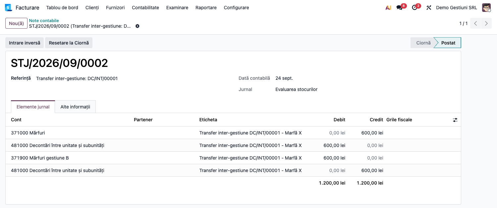
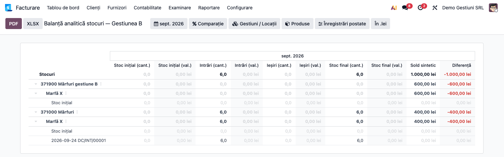

# Fișă Modul: Gestiuni contabile de stoc, transfer valoric și recepție fără factură (371=408)

**Poziție plan:** B1.6
**Modul:** `l10n_ro_stock_gestiune`
**FR:** FR-54
**Capitol manual:** Cap 6.9
**Utilizator principal:** Contabil stocuri, Contabil furnizori, Manager depozit
**Prioritate:** 🔴 Ridicată (afectează valorizarea stocurilor și datoriile către furnizori)

---

## 1. Scop business

Modulul definește gestiunea contabilă ca model propriu (`l10n.ro.gestiune`) și:

- separă **gestiunea contabilă de stoc** (cont de stoc de clasa 3, gestionar responsabil) de depozitul
  logistic și de locațiile operaționale;
- controlează **transferul valoric între gestiuni** cu conturi de stoc diferite (cont de transfer
  (direct sau prin tranzit);
- recunoaște automat **recepția mărfii fără factură** (RNI, *recepție fără factură* — inventar
  permanent, valorizare perpetuă): nota `371 = 408` la recepție și stingerea `408 = 401` la sosirea
  facturii.

Contul **408 „Furnizori – facturi nesosite"** devine pivot între gestiune și furnizor, independent de
ordinea recepție/factură, și tratează corect diferențele de curs (la achiziții în valută) și de preț.

**Firul valoric** — ideea centrală a modulului: fiecare operațiune de stoc (recepție, retur,
transfer) poartă o **valoare** care trebuie să se regăsească, în orice moment, în trei locuri
deodată, cu aceeași sumă:

1. pe **mișcarea de stoc** (valoarea operațiunii, calculată la cost FIFO/CMP/standard);
2. în **nota contabilă** generată automat în jurnalul de stoc, cu gestiunea pe fiecare linie;
3. în **soldul contului de stoc**: soldul clasei 3 = valoarea totală a stocului.

**Atenție:** contul de stoc propriu al gestiunii (*Cont stoc principal*) e folosit de modul **doar la
transferul între gestiuni**. Recepțiile, retururile, livrările și consumurile folosesc contul de stoc
al **categoriei produsului**. Soldul contului unei gestiuni este deci egal cu valoarea mărfii din ea
doar pe fluxul din exemplu (marfa intră în gestiunea al cărei cont e contul categoriei, apoi ajunge
în celelalte gestiuni prin transfer și nu iese de acolo). Vezi limitările.

Secțiunea 6 urmărește acest fir cu un exemplu numeric continuu, iar pasul final arată cum se
verifică egalitatea cantitate↔valoare↔contabilitate în balanța de stocuri.

## 2. Bază legală și context

- **Legea contabilității 82/1991** — evidență cronologică și sistematică, controlul stocurilor.
- **OMFP 1802/2014** — inventar permanent; elementele monetare în valută se reevaluează (diferențe de
  curs pe 765/665), iar stocul (activ nemonetar) rămâne la cursul recepției; metode de evaluare la
  ieșire (CMP, FIFO, cost standard).
- **OMFP 2861/2009** — inventariere pe gestiuni, locuri de depozitare și responsabili.
- **OMFP 2634/2015** — documente justificative de stoc (recepție, transfer, fișă de magazie).

Monografia RO pentru recepție înainte de factură: la recepție `371 = 408`, iar la factură
`408 = 401` (plus `4426`), conform practicii de inventar permanent. Varianta cu TVA neexigibilă
(`% = 408` cu 371 și 4428, apoi `4426 = 4428` la factură) nu este generată de modul.

## 3. Utilizatori și roluri

- **Contabil stocuri / furnizori** — configurează conturile și verifică notele 371/408.
- **Manager depozit** — validează organizarea pe gestiuni și traseul prin tranzit.
- **Administrator Odoo** — activează setările companiei și definește gestiunile.

Roluri recomandate pentru testare:
- Administrator funcțional: instalează modulul, activează setările, verifică meniurile.
- Utilizator operațional: rulează recepțiile, transferurile și returnurile.
- Contabil/manager: validează notele contabile, stingerea contului 408 și balanța de stocuri.

## 4. Conturi și date implicate

| Cont | Rol |
|---|---|
| **371 / 301 / 302 / 303** | cont de stoc (debitat la recepție: contul categoriei produsului); contul propriu al gestiunii e folosit doar la transfer |
| **408** | „Furnizori – facturi nesosite" — datoria estimată la recepția fără factură |
| **401** | datoria față de furnizor (la sosirea facturii) |
| **308 / 378** | diferențe de preț la cost standard: 308 pentru materii prime și materiale (301/302/303), 378 pentru mărfuri (371), după contul configurat pe categorie |
| **665 / 765** | cheltuieli / venituri din diferențe de curs valutar |
| **481** | cont de transfer cerut de modul la transferul între gestiuni cu conturi diferite (vezi limitările: OMFP 1802 rezervă 481/482 decontărilor cu subunități care țin contabilitate proprie) |

**Unde trăiește valoarea stocului** (Odoo 19, valorizare perpetuă):

- pe fiecare **mișcare de stoc**: câmpul *Valoare* — costul operațiunii la metoda produsului
  (FIFO/CMP/standard); suma mișcărilor de intrare minus ieșire = valoarea stocului;
- pe fiecare **linie contabilă** din jurnalul de stoc: debit/credit pe contul de stoc. Cu puntea
  `l10n_ro_stock_gestiune_valuation` instalată, liniile poartă și aria de evaluare a gestiunii;
  cantitatea pe linie nu e completată. Balanța de stocuri citește cantitățile și valorile din
  mișcările de stoc, nu din liniile contabile;
- în **soldul conturilor de stoc**: soldul clasei 3 = valoarea totală a stocului; pe gestiune, doar
  cu rezerva de la secțiunea 1.

Date minime pentru demo:
- companie românească cu localizarea contabilă (plan de conturi RO) și jurnal de stoc configurat;
- două gestiuni cu conturi de stoc **diferite** (ex. 371.1 și 371.2), cont de transfer (ex. 481) și
  cont 408;
- produse stocabile cu **valorizare perpetuă (`real_time`)** și metodă de cost (FIFO / CMP / standard);
- furnizor și, pentru fluxul complet, o comandă de achiziție;
- pentru pasul de verificare finală: modulul `l10n_ro_stock_sheet` (balanța analitică a stocurilor).

## 5. Configurare inițială

### 5.1 Recepție fără factură, regula strictă și gestiunea obligatorie

Meniu: **Inventar → Configurare → Setări**, blocul **Evaluare**:

1. ① **Recepție fără factură (371 = 408)** și **Cont 408 implicit** (dacă folosiți fluxul RNI).
2. ② Opțional, **Blocare transfer fără cont de transfer**: blochează transferul direct între gestiuni
   cu conturi de stoc diferite, dacă nu e configurat un cont de transfer.
3. ③ Opțional, **Necesită gestiune contabilă**: blochează validarea unei mișcări de stoc valorizate
   când o locație internă implicată nu are gestiune contabilă sau gestiunea nu e validă la data
   mișcării.


**Două moduri de declanșare a notei 371 = 408** — alegeți în funcție de cum lucrați:

- **La nivel de companie** — cu setarea **Recepție fără factură (371 = 408)** activă, *toate*
  recepțiile valorizate de la furnizor generează automat nota 371 = 408. Recomandat când marfa
  ajunge de regulă înaintea facturii.
- **Punctual, pe aviz (per recepție)** — chiar cu setarea de companie oprită, puteți marca o
  recepție ca **Recepție pe aviz** (câmpul `Recepție pe aviz` de pe transfer). Doar recepțiile
  bifate generează nota 371 = 408. Pentru automatizare, bifați **Recepție pe aviz în mod implicit**
  pe **tipul de operație** (Inventar → Configurare → Tipuri de operații) — orice transfer nou creat
  pentru acel tip (inclusiv recepțiile din comenzi de achiziție) primește automat bifa.

Cele două moduri sunt compatibile: dacă setarea de companie e activă, ea prevalează pentru toate
recepțiile; avizul per-transfer rămâne util când setarea de companie e oprită.

### 5.2 Configurare gestiuni

Meniu: **Inventar → Configurare → Gestiunea depozitului → Gestiuni contabile**

| Câmp | Rol |
|---|---|
| *Cod* / *Nume* | identificarea gestiunii |
| *Gestionar responsabil* | persoana responsabilă (OMFP 2861/2009) |
| *Cont stoc principal* | contul de clasa 3 al gestiunii, folosit la notele de transfer |
| *Cont transfer între gestiuni* | cont de trecere pentru transferurile către gestiuni cu alt cont |
| *Cont recepție fără factură (408)* | contul 408 al gestiunii; gol = se folosește cel de pe companie |
| *Politică inventariere* | la cerere / periodică / anuală |


### 5.3 Asociere locații interne

Asociați locațiile interne la gestiunea contabilă prin câmpul **Gestiune contabilă** de pe locație,
sau, pentru mai multe locații deodată, cu asistentul **Inventar → Configurare → Gestiunea depozitului
→ Atribuie locații la gestiune**. Raportul **Excepții gestiuni contabile** (același meniu) arată
locațiile și mișcările care nu respectă regulile gestiunilor.

## 6. Flux de utilizare

### Exemplul numeric condus prin toți pașii

Toți pașii de mai jos folosesc același caz, ca să poată fi urmărită valoarea de la un capăt la
altul:

- **Gestiunea A** „Depozit Central" — cont stoc **371.1**;
- **Gestiunea B** „Magazin" — cont stoc **371.2**; cont de transfer **481**;
- produs **Marfă X**, stocabil, valorizare perpetuă, FIFO;
- recepție de la furnizor: **10 buc × 100 lei = 1.000 lei**, TVA 21%.

În capturi, 371.1 este contul **371000 „Mărfuri”** (Gestiunea A — Depozit Central, și contul
categoriei produsului), iar 371.2 este **371900 „Mărfuri gestiune B”** (Gestiunea B — Magazin);
contul de transfer este 481.

După fiecare pas, tabelul „Starea stocului și a conturilor" arată unde se află cantitatea și
valoarea. Regula de control, valabilă **pe acest exemplu** la fiecare pas: **valoarea fizică a
gestiunii = soldul contului ei de stoc**, iar suma tuturor gestiunilor = soldul clasei 3 (în general,
doar totalul e garantat — vezi limitările).

### Pasul 1 — Recepția mărfii fără factură (371 = 408)

Meniu: **Inventar → Operațiuni → Recepții** — validați recepția de 10 buc Marfă X în Gestiunea A.

Nota se generează dacă recepția e „fără factură": fie pentru că setarea de companie **Recepție fără
factură (371 = 408)** e activă (toate recepțiile), fie pentru că recepția e marcată **Recepție pe
aviz** (bifă pe transfer sau implicită pe tipul de operație — vezi 5.1).

La validare, mișcarea de stoc primește **valoarea 1.000 lei** (10 × 100, la costul de achiziție),
iar modulul generează automat nota contabilă de încărcare în gestiune și de recunoaștere a
datoriei estimate:

- **Dr 371.1 = 1.000** (marfa intră în gestiune; contul e cel al categoriei produsului);
- **Cr 408 = 1.000** (datorie estimată; factura nu a sosit).


**Starea după pas:**

| | Cant. | Valoare | 371.1 | 371.2 | 408 | 401 |
|---|---|---|---|---|---|---|
| Gestiunea A | 10 buc | 1.000 | **1.000 D** | — | **1.000 C** | — |

### Pasul 2 — Factura furnizorului (408 = 401)

Meniu: **Achiziții → Comenzi** → comanda de achiziție → **Creare factură**, apoi confirmarea
facturii în **Contabilitate → Furnizori → Facturi**.

Linia de produs stocabil este contată pe **408** (nu pe 371 — marfa e deja în gestiune, valoarea
ei nu se modifică), iar contul 408 este debitat cu exact valoarea creditată la recepție:

- **Dr 408 = 1.000** + **Dr 4426 = 210** / **Cr 401 = 1.210**.

Stingerea este determinată de documente, nu de potrivirea sumelor: contul 408 **nu** trebuie să
fie marcat „Permite reconcilierea".


**Starea după pas** — observați că factura **nu mișcă stocul**: cantitatea și valoarea gestiunii
rămân neschimbate; se mută doar datoria, din „estimată" (408) în „certă" (401):

| | Cant. | Valoare | 371.1 | 371.2 | 408 | 401 |
|---|---|---|---|---|---|---|
| Gestiunea A | 10 buc | 1.000 | 1.000 D | — | **0** (stins) | **1.210 C** |

Cazuri particulare (tratate automat, detaliate în „Note de monografie"):
- **valută**: stocul rămâne la cursul recepției; diferența de curs recepție↔factură merge pe 665/765;
- **preț diferit pe factură**: diferența ajustează 371 (FIFO/CMP) sau merge pe contul de diferențe
  de preț la cost standard (378 la mărfuri, 308 la materii prime și materiale).

### Pasul 3 — Returul către furnizor (storno în roșu)

*Ramură a fluxului: returul presupune că factura nu a sosit încă (nota 371 = 408 e activă). Ca să nu
schimbe firul principal, în capturi ramura e o **recepție separată de 4 buc**, returnată integral;
firul principal continuă la Pasul 4 cu 10 buc.*

Meniu: **Inventar → Operațiuni → Recepții** → recepția validată → **Retur** — returnați cele 4 buc.

Nota `371 = 408` se **stornează în roșu** (OMFP 1802), proporțional cu valoarea returnată
(4 × 100 = 400), astfel încât gestiunea și contul 408 scad împreună:

- **Dr 371.1 = −400** / **Cr 408 = −400** (sume negative pe aceleași poziții).


**Starea pe ramura de retur** (recepția de 4 buc și returul ei se anulează):

| | Cant. | Valoare | 371.1 | 408 |
|---|---|---|---|---|
| Recepția de 4 buc | +4 buc | +400 | +400 D | +400 C |
| Returul | −4 buc | −400 | −400 D | −400 C |
| **Net pe ramură** | **0** | **0** | **0** | **0** |

### Pasul 4 — Transfer valoric între gestiuni

Meniu: **Inventar → Operațiuni → Transferuri interne** — transferați **6 buc** din Gestiunea A
(locație legată de A) în Gestiunea B (locație legată de B).

Gestiunile au conturi de stoc **diferite** (371.1 ≠ 371.2), deci transferul nu e doar fizic, ci și
**valoric**: 6 × 100 = **600 lei** trebuie să iasă din contul gestiunii A și să intre în contul
gestiunii B. Modulul impune (cu regula strictă activă) ca traseul valoric să fie configurat înainte
de validare:

- **cu cont de transfer** (ex. 481): la validare, modulul generează o singură notă cu patru linii —
  **Dr 481 = Cr 371.1 (600)** și **Dr 371.2 = Cr 481 (600)**. Contul 481 se închide la zero, dar are
  rulaj 1.200 pentru o mutare de 600;
- **prin tranzit**: marfa trece printr-o locație de tranzit, iar nota se generează **tot numai dacă
  există cont de transfer** pe gestiune. Fără cont de transfer, tranzitul nu e blocat, dar nu
  generează nicio notă: valoarea rămâne pe 371.1 (vezi limitările). Tranzitul nu înlocuiește deci
  configurarea contului de transfer;
- **fără cont de transfer, direct**: cu regula strictă activă, validarea este **blocată** (vezi
  secțiunea 9).

Valoarea transferului este costul curent al produsului × cantitatea; la FIFO nu se iau straturile
FIFO mutate. Nota e generată **de acest modul**, în jurnalul de stoc.



**Contul 481** este cel pe care îl cere modulul. OMFP 1802/2014 îl rezervă însă decontărilor cu
subunități fără personalitate juridică care **conduc contabilitate proprie** (482 între subunități).
Între două gestiuni ale aceleiași contabilități, monografia directă este **371.2 = 371.1**, pe care
modulul nu o generează (vezi limitările).

**Starea după pas** — esențial: transferul **nu creează și nu pierde valoare**; totalul stocului
rămâne 1.000, doar se redistribuie între gestiuni:

| | Cant. | Valoare | 371.1 | 371.2 | 481 |
|---|---|---|---|---|---|
| Gestiunea A | 4 buc | 400 | **400 D** | — | 0 |
| Gestiunea B | 6 buc | 600 | — | **600 D** | 0 |
| **Total** | **10 buc** | **1.000** | | | |

Tabelul e valabil pe acest exemplu. O vânzare ulterioară din Gestiunea B s-ar înregistra pe contul
categoriei (371.1), nu pe 371.2 (vezi limitările).

### Pasul 5 — Verificarea valorii: balanța analitică a stocurilor (cantitate + valoare)

Meniu: **Inventar → Raportare → Balanță analitică stocuri** (din modulul `l10n_ro_stock_sheet`).
Pentru un singur produs, butonul **Fișă de magazie** de pe fișa produsului deschide direct detaliul
lui, iar pentru o gestiune, butonul **Fișă de magazie** din formularul gestiunii (puntea
`l10n_ro_stock_sheet_gestiune`).

1. **Găsiți pe ecran** — fiecare rând de nivel 1 este un **cont de stoc** (deci o gestiune: 371.1,
   371.2); desfășurat, nivelul 2 sunt **produsele**, iar nivelul 3 **mișcările** (fișa de magazie).
   Coloanele perechi arată **cantitate + valoare** pentru: *Stoc inițial*, *Intrări*, *Ieșiri*,
   *Stoc final*; ultimele două coloane sunt **Sold sintetic** (soldul contului din contabilitate)
   și **Diferență** (stoc final valoric − sold sintetic).
2. **Verificați** — pe exemplul condus, **totalul** raportului („Stocuri”) are stoc final **10 buc /
   1.000 lei**, egal cu soldul sintetic 1.000 lei, iar *Diferența* totală este **0**. *Intrările* sunt
   14 buc / 1.400 lei (recepția de 10 și cea de 4 a ramurii de retur), iar *Ieșirile* 4 buc / 400 lei
   (returul). Contul 408 are sold 0 după facturare.

   **Atenție la transferul între gestiuni:** balanța nu include transferurile dintre două locații
   interne. Tot stocul rămâne afișat pe contul pe care a intrat, iar soldul sintetic arată deja
   mutarea valorii prin 481. Pe exemplu: rândul 371000 are stoc final 10 buc / 1.000 lei, sold
   sintetic 400 lei, *Diferență* **+600**; rândul 371900 are 0 buc, sold sintetic 600 lei,
   *Diferență* **−600**. Cele două diferențe se anulează pe total și provin exclusiv din transfer
   (vezi limitările). Orice altă diferență nenulă înseamnă note manuale pe conturile de stoc sau
   mișcări nevalorizate, de investigat înainte de închidere.
3. **Treceți mai departe** — abia după confirmarea acestor egalități, exportați raportul cu
   butoanele **PDF** sau **XLSX** din antetul raportului, pentru dosarul de închidere de lună.


**Filtrată pe gestiune** (butonul *Gestiuni / Locații* sau **Fișă de magazie** din gestiune),
balanța arată corect **cantitatea** transferului, dar nu și **valoarea** lui: pe Gestiunea B apar
*Intrări* 6 buc cu valoarea 0, pe rândul contului categoriei (371000), nu pe 371900. *Soldul
sintetic* nu e filtrat pe gestiune (arată soldul întreg al conturilor), deci *Diferența* totală a
raportului filtrat nu e 0 (în captură −1.000). Pe gestiune, folosiți balanța doar pentru cantități;
valoarea pe gestiune o verificați pe soldurile conturilor 371 numai în condițiile din limitări
(bulletul despre contul propriu al gestiunii).



### Note de monografie și raportare

- Recepție fără factură: **Dr 371 = Cr 408** (la cursul recepției, pentru achiziții în valută).
- Factură furnizor: **Dr 408 + Dr 4426 = Cr 401**; contul 408 se stinge prin document (fără
  reconciliere), cu valoarea creditată la recepție, proporțional cu cantitatea facturată.
- Diferență de curs recepție↔factură (valută), recunoscută la primirea facturii: **Dr 408 = Cr 765**
  (favorabilă) sau **Dr 665 = Cr 408** (nefavorabilă). Stocul **nu** se reevaluează
  (activ nemonetar, IAS 21 / OMFP 1802). Pe companiile cu înregistrări storno activate, modulul
  scrie însă aceste sume în roșu pe latura opusă (ex. „Dr 765 −1.000”); vezi limitările.
- Reevaluarea lunară a soldului 408 în valută (OMFP 1802, la finele lunii) **nu e făcută** nici de
  acest modul, nici de `l10n_ro_currency_revaluation` în configurația standard RO: acela reevaluează
  doar conturile cu valută sau de tip creanță / datorie comercială, iar 408 este cont curent fără
  valută (vezi limitările).
- Diferență de preț (factură ≠ recepție): la cost standard pe **378** (mărfuri) sau **308** (materii
  prime și materiale), la FIFO/CMP pe **371**, la cursul facturii — datoria suplimentară se naște la
  data facturii.
- Retur furnizor: storno în roșu al notei `371 = 408` (sume negative, aceleași conturi).
- Transfer inter-gestiune cu conturi diferite: prin contul de transfer (481), în aceeași notă
  (`481 = 371.1`, `371.2 = 481`), și pe ruta prin tranzit; valoarea totală a stocului nu se modifică.
  Monografia directă `371.2 = 371.1` nu e generată.
- Balanța de stocuri pe cantitate + valoare se construiește din mișcările de stoc; liniile notelor
  contabile nu poartă cantitatea.

### Scenarii verificate (din teste)

Comportamentul de mai jos este acoperit de `tests/test_rni.py`, `tests/test_notice.py` și
`tests/test_stock_gestiune.py` (pe FIFO/CMP/standard):

| Scenariu | Rezultat așteptat |
|---|---|
| Recepție 10×100, fără factură | nota `371 = 408` pe 1000 |
| Re-procesarea recepției | nu se generează a doua notă (idempotent) |
| Factura furnizor 10×100 | linia pe **408**; `408 = 401`; 408 se stinge la 0 |
| 371 recunoscut o singură dată | la recepție, nu se dublează la factură |
| Toate metodele de cost (FIFO / CMP / standard) | recepție `371 = 408` și rutare pe 408 funcționează |
| Recepție EUR @5,0 → factură @4,0 | stoc la curs recepție; diferența de curs pe **765**; 408 = 0 |
| Recepție EUR @5,0 → factură @6,0 | stoc la curs recepție; diferența de curs pe **665**; 408 = 0 |
| Recepție EUR, factură cu preț ȘI curs diferite | curs pe partea recepționată → 765/665; surplusul în stoc la cursul facturii |
| Contul 408 fără bifa de reconciliere | stingerea e identică — mecanismul nu folosește reconcilierea |
| Diferență de preț, factură mai scumpă / mai ieftină | FIFO/CMP → pe **371**; cost standard → pe contul de diferențe de preț al categoriei (378 / 308) |
| Facturare parțială (4 din 10) | pe 408 rămâne valoarea cantității nefacturate; 371 nemodificat |
| Facturare parțială cu preț diferit | diferența se contează doar pentru cantitatea facturată |
| Retur parțial (4 din 10) | storno roșu; 371 și 408 scad la 600 / -600 |
| Retur total (10 din 10) | 371 = 0, 408 = 0 |
| Recepție fără factură dezactivată (companie) și fără aviz | nu se generează nicio notă RNI |
| Aviz per-transfer, setarea de companie oprită | recepția marcată **Recepție pe aviz** generează `371 = 408` |
| Aviz implicit pe tipul de operație | recepția din comanda de achiziție moștenește bifa și e rutată pe 408 |
| Serviciu (non-stocabil) | exclus din mecanismul RNI |
| Transfer aceeași gestiune / conturi identice | permis (nu necesită cont de transfer) |
| Transfer A→B, conturi diferite, fără cont transfer (strict) | **blocat** cu mesaj explicit |
| Transfer A→B cu cont de transfer configurat | permis |
| Transfer prin tranzit | permis (nu e tratat ca transfer direct); fără cont de transfer nu se generează nicio notă |

## 7. Legături cu alte module / declarații

| Modul / proces | Rol în flux |
|---|---|
| `l10n_ro_stock_gestiune_valuation` (punte, auto-install cu `deltatech_valuation_area`) | leagă gestiunile de ariile de evaluare și pune dimensiunea contabilă pe note; nu schimbă contul |
| `stock_account` / `purchase_stock` | valorizarea nativă pe mișcarea de stoc și legătura factură↔recepție |
| `account` | notele contabile 371/408/401 și diferențele de preț/curs |
| `l10n_ro_stock_sheet` | balanța analitică a stocurilor (cantitate + valoare + diferență) și fișa de magazie — pasul 5 |
| `l10n_ro_stock_sheet_gestiune` (punte, auto-install) | filtrul pe gestiune în balanță și butonul **Fișă de magazie** din gestiune |
| `l10n_ro_currency_revaluation` | reevaluarea lunară a datoriilor în valută; **nu include 408** în configurația standard RO (vezi limitările) |

Ce este automat: valoarea pe fiecare mișcare de stoc, nota `371 = 408` la recepție, rutarea facturii
pe 408 și stingerea lui, storno-ul la retur, notele valorice ale transferului, blocarea transferului
direct neconfigurat, diferențele de curs și de preț.
Ce rămâne manual: configurarea conturilor pe gestiune/companie, verificarea soldului 408 la
închidere și citirea coloanei *Diferență* din balanța de stocuri.

## 8. Verificări pentru consultant

- [ ] Setările **Recepție fără factură (371 = 408)**, **Blocare transfer fără cont de transfer** și **Necesită gestiune contabilă** apar în Setări Inventar, blocul Evaluare.
- [ ] Formularul **Gestiune contabilă** afișează câmpurile (gestionar, cont stoc, cont transfer, cont 408, politică inventariere, locații).
- [ ] Recepția unui produs stocabil de la furnizor generează nota `371 = 408`, cu valoarea = cantitate × cost.
- [ ] Cu setarea de companie oprită, o recepție marcată **Recepție pe aviz** generează totuși nota `371 = 408`; una nemarcată nu.
- [ ] Bifa **Recepție pe aviz în mod implicit** de pe tipul de operație se propagă pe recepțiile noi (inclusiv cele din comenzi de achiziție).
- [ ] După recepție, soldul contului de stoc al categoriei = valoarea recepționată (exemplu: 1.000).
- [ ] Linia 408 a notei de recepție nu are partener în versiunea curentă (vezi limitările); verificați stingerea 408 pe cont, iar după corectarea codului, și pe furnizor.
- [ ] Factura furnizorului contează linia pe 408, stinge contul 408 și **nu** modifică valoarea stocului.
- [ ] Contul 408 se stinge și dacă nu are bifa „Permite reconcilierea" — mecanismul nu depinde de reconciliere.
- [ ] La achiziție în valută, stocul rămâne la cursul recepției, iar diferența de curs apare pe 665/765.
- [ ] Diferența de preț ajunge pe 378 / 308 (cost standard, după categorie) sau pe 371 (FIFO/CMP).
- [ ] Returul către furnizor generează storno în roșu, iar gestiunea și 408 scad cu aceeași sumă.
- [ ] Transferul direct A→B cu conturi diferite este blocat fără cont de transfer (regula strictă) și permis după configurare.
- [ ] După transfer, valoarea ieșită din contul gestiunii sursă = valoarea intrată în contul destinației; contul de transfer (481) are sold 0; totalul stocului e neschimbat.
- [ ] Balanța analitică a stocurilor are *Diferența* totală 0; pe conturile gestiunilor, ±valoarea transferurilor (vezi limitările). Filtrată pe gestiune, cantitățile sunt cele așteptate.

## 9. Mesaje de eroare frecvente

| Mesaj / simptom | Cauză probabilă | Remediere |
|---|---|---|
| „Transfer inter-gestiune blocat: gestiunile … au conturi de stoc diferite … și nu există un cont de transfer configurat.” | gestiunile au conturi diferite și nu există cont de transfer | configurați **Cont transfer între gestiuni** pe una dintre gestiuni. Mesajul propune și tranzitul, dar fără cont de transfer tranzitul nu generează nicio notă |
| „Locația internă … nu are o gestiune contabilă asociată — necesară pentru validarea mișcărilor de stoc valorizate.” | setarea **Necesită gestiune contabilă** e activă, iar locația nu are gestiune | asociați locația la o gestiune (5.3) |
| „Gestiunea … nu este validă la … (inactivă sau în afara perioadei de valabilitate).” | setarea **Necesită gestiune contabilă** e activă, iar gestiunea locației e inactivă sau în afara perioadei ei de valabilitate la data mișcării | reactivați gestiunea sau corectați-i perioada de valabilitate |
| Soldul 408 pe furnizor nu e 0 după facturare, deși contul 408 are sold 0 | linia 408 a notei de recepție nu are partener | comportament cunoscut (vezi limitările); verificați 408 pe cont, nu pe partener |
| Recepția nu generează nota 371 = 408 | setarea de companie e oprită **și** recepția nu e marcată „Recepție pe aviz"; sau produsul nu e stocabil / nu are valorizare perpetuă | activați setarea de companie *sau* bifați **Recepție pe aviz** pe transfer (ori implicit pe tipul de operație); verificați tipul produsului și categoria (`real_time`) |
| Soldul 408 nu se stinge | factura nu e legată de recepție (fără comandă de achiziție), sau e facturată doar o parte din cantitatea recepționată | facturați din comanda de achiziție; verificați cantitatea facturată față de cea recepționată |
| Nu se generează nota RNI deși e activată | lipsește jurnalul de stoc sau contul 408 pe companie/gestiune | configurați jurnalul de stoc și contul 408 |
| Consultantul nu vede meniul gestiunilor | meniul **Gestiuni contabile** cere drepturi de administrator pe Inventar | dați utilizatorului dreptul **Inventar / Administrator** |
| Coloana *Diferență* din balanța de stocuri nu e 0 pe conturile a două gestiuni, cu valori egale și de semn opus | transfer între gestiuni cu conturi diferite: balanța nu include transferurile interne | comportament cunoscut (vezi limitările); verificați că totalul are diferența 0 |
| Coloana *Diferență* din balanța de stocuri nu e 0 | note manuale pe conturile de stoc sau mișcări nevalorizate | identificați nota prin drill-down pe cont → produs → mișcare; corectați sau reclasați |

## 10. Capturi de ecran

Capturile (`readme/screenshots/`) sunt **generate automat** din `tests/test_screenshots.py`
(mixinul `ScreenshotCase` din `l10n_ro_doc_screenshots`, import defensiv), în **limba română**,
pe planul de conturi RO:

1. `01_setari_gestiuni.png` — Setări Inventar, blocul Evaluare: recepție fără factură + cont 408, transfer strict, gestiune obligatorie.
2. `02_gestiune_form.png` — formularul gestiunii (gestionar, cont stoc, cont transfer; cont 408 gol = cel de pe companie).
3. `03_receptie_nota_rni.png` — nota de recepție `371 = 408`.
4. `04_factura_pe_408.png` — factura furnizor cu linia pe 408.
5. `05_storno_retur.png` — nota de storno în roșu la returul către furnizor.
6. `06_nota_transfer.png` — nota contabilă a transferului A → B: `481 = 371000` și `371900 = 481`, câte 600.
7. `07_balanta_stocuri.png` — balanța analitică a stocurilor, desfășurată pe produse și mișcări, pe scenariul din pasul 5 (total cu diferență 0; transferul A→B vizibil doar în soldul sintetic). Se generează doar cu `l10n_ro_stock_sheet` instalat.
8. `08_balanta_gestiune_b.png` — aceeași balanță filtrată pe Gestiunea B: cantitatea transferului corectă, valoarea 0. Se generează doar cu `l10n_ro_stock_sheet` instalat.

Regenerare:

```bash
./odoo/odoo-bin -c odoo.conf -d <db> -i l10n_ro_stock_gestiune,l10n_ro_stock_sheet,l10n_ro_doc_screenshots \
    --test-tags=/l10n_ro_stock_gestiune:TestStockGestiuneScreenshots --stop-after-init
```

## 11. Observații pentru manual

Păstrați explicația construită pe **firul valoric**: la fiecare operațiune, arătați cititorului
unde se află valoarea (mișcare de stoc → notă contabilă → sold cont de stoc) și folosiți
exemplul numeric continuu (10 buc × 100 lei) din secțiunea 6 — tabelele „Starea după pas" sunt
gândite pentru a fi preluate direct în manual. Subliniați invariantele pe care utilizatorul le poate
verifica singur: (1) valoarea totală a stocului = soldul conturilor de stoc; (2) factura nu modifică
valoarea stocului, doar mută datoria de pe 408 pe 401; (3) transferul redistribuie valoarea între
gestiuni fără să schimbe totalul, iar contul de transfer se închide la zero. Nu prezentați „soldul
contului gestiunii = valoarea gestiunii” ca regulă generală: e valabil doar pe fluxul din exemplu
(vezi limitările). Încheiați cu verificarea în balanța analitică a stocurilor (totalul cu diferență
0) și tratamentul corect RO al diferențelor de curs (stocul nu se reevaluează) și de preț (378 la
mărfuri, 308 la materii prime și materiale, la cost standard).

### Limitări cunoscute

- **Balanța analitică a stocurilor (`l10n_ro_stock_sheet`) nu include transferurile între
  gestiuni.** Transferul dintre două locații interne nu e nici intrare, nici ieșire pentru raport,
  deci cantitatea și valoarea rămân pe contul de stoc pe care a intrat marfa. Nota valorică a
  transferului (481) mută însă soldul sintetic. Rezultatul: pe conturile celor două gestiuni,
  *Diferența* iese egală și de semn opus (pe exemplu +600 / −600), iar totalul rămâne 0. Până la
  corectarea raportului, verificați totalul balanței; soldurile conturilor 371 pe gestiune sunt
  fiabile doar în condițiile de la bulletul următor.
  Filtrată pe gestiune, balanța arată cantitatea transferului, dar cu valoarea 0, iar soldul
  sintetic rămâne nefiltrat.
- **Contul propriu al gestiunii e folosit doar la transfer.** Recepțiile (nota 371 = 408),
  retururile, livrările și consumurile folosesc contul de stoc al categoriei produsului. O recepție
  direct într-o gestiune cu alt cont se înregistrează tot pe contul categoriei, iar o vânzare din
  Gestiunea B creditează contul categoriei, nu 371.2 — soldul 371.2 nu mai scade. Soldurile pe
  gestiune sunt fiabile doar dacă marfa intră pe gestiunea cu contul categoriei și ajunge în
  celelalte numai prin transfer, fără ieșiri din ele.
- **Transferul între gestiunile aceleiași contabilități trece prin 481**, pe ambele laturi ale
  aceleiași note (rulaj 1.200 pentru o mutare de 600). OMFP 1802 rezervă 481/482 subunităților cu
  contabilitate proprie; monografia directă 371.2 = 371.1 nu e generată.
- **Transferul prin tranzit fără cont de transfer nu generează nicio notă** și nu e blocat de regula
  strictă: marfa se mută fizic, valoarea rămâne pe contul gestiunii sursă. Mesajul de blocare propune
  totuși tranzitul ca soluție.
- **Pe companiile cu înregistrări storno**, diferențele de curs recepție↔factură se scriu în roșu pe
  latura opusă (ex. „Dr 765 −1.000” în loc de „Cr 765 1.000”, iar pe diferența nefavorabilă 408
  apare „Dr −x” în loc de Cr). Soldul e corect, rulajele pe 765 și 408 nu.
- **Liniile 408 din nota de recepție și din storno nu au partener**, spre deosebire de linia 408 a
  facturii. Contul 408 se stinge, dar pe fișa furnizorului 408 rămâne cu sold (debit pe furnizor,
  credit fără partener).
- **Valoarea transferului** e costul curent al produsului × cantitatea; la FIFO nu se mută straturile
  de cost.
- **Soldul 408 în valută nu se reevaluează lunar.** `l10n_ro_currency_revaluation` alege doar
  conturile cu valută sau de tip creanță / datorie comercială; pe planul RO, 408 e cont curent fără
  valută, deci e exclus. Până la corectare, soldul 408 în valută rămas nefacturat la finele lunii se
  reevaluează manual.
