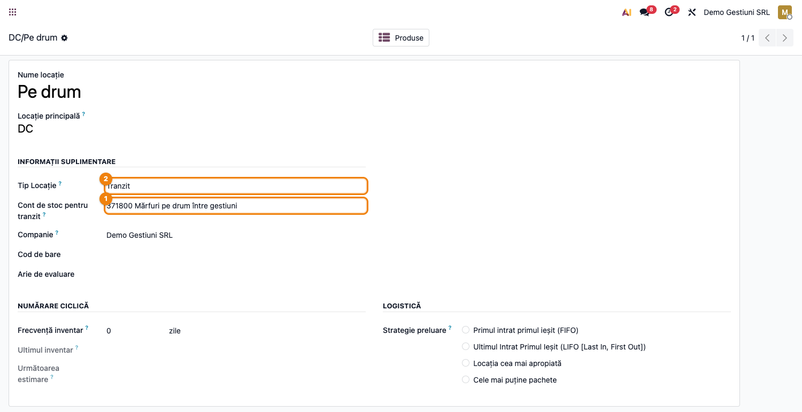
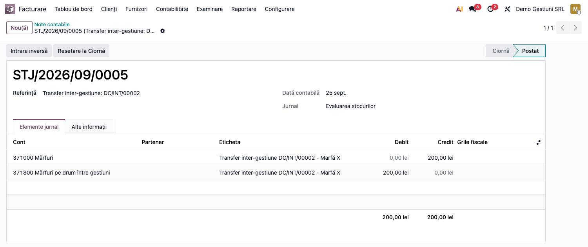
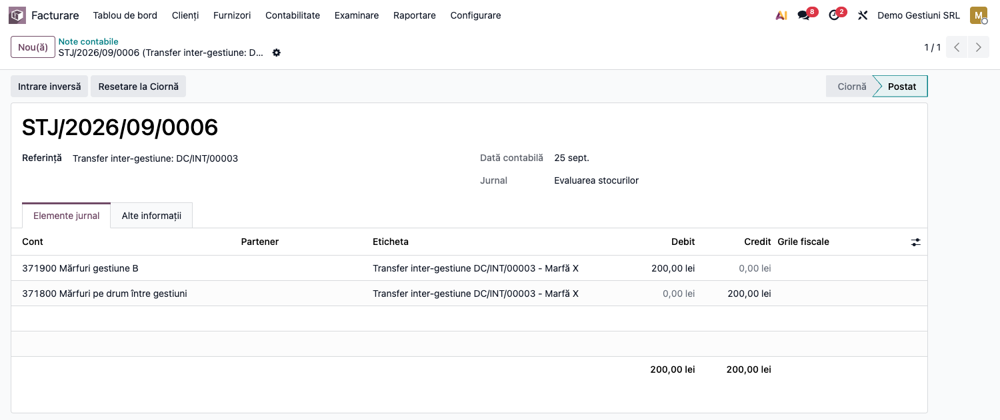
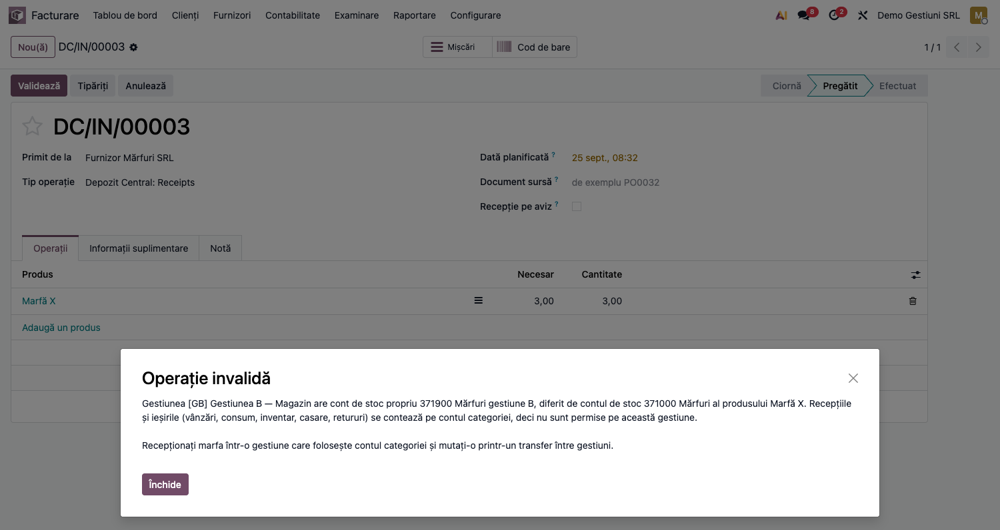
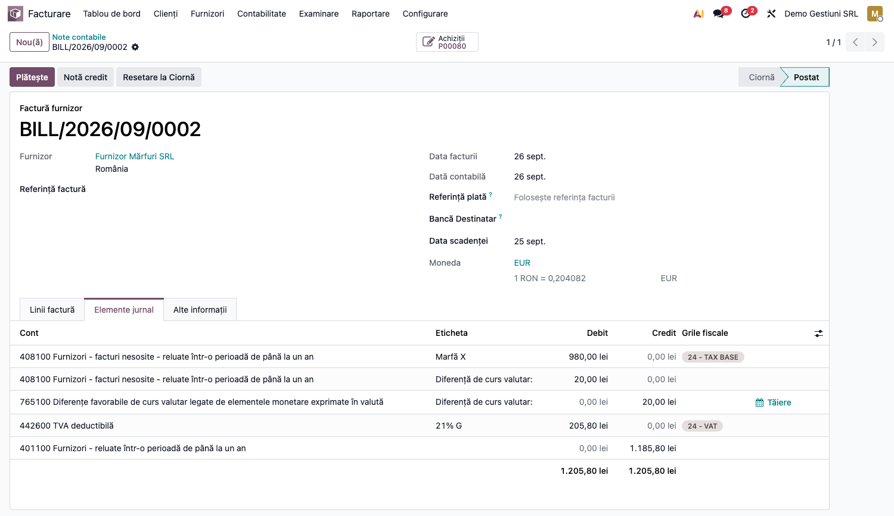
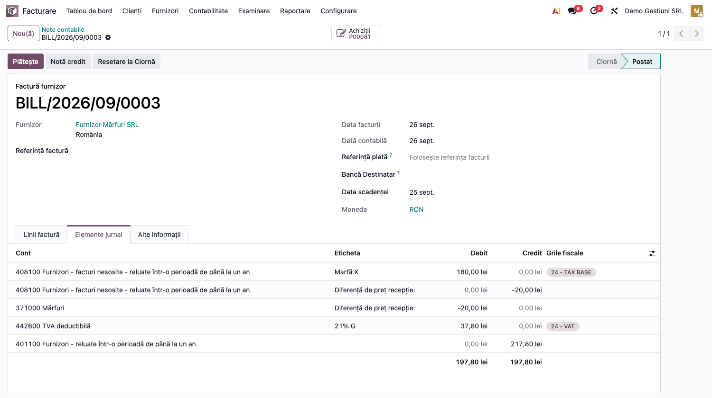

# Fișă Modul: Gestiuni contabile de stoc, transfer valoric și recepție fără factură (371=408)

**Poziție plan:** B1.6
**Modul:** `l10n_ro_stock_gestiune`
**FR:** FR-54
**Capitol manual:** Cap 6.9
**Utilizator principal:** Contabil stocuri, Contabil furnizori, Manager depozit
**Prioritate:** 🔴 Ridicată (afectează valorizarea stocurilor și datoriile către furnizori)

---

## 1. Scop business

Modulul definește gestiunea contabilă ca model propriu (`l10n.ro.gestiune`) și:

- separă **gestiunea contabilă de stoc** (cont de stoc de clasa 3, gestionar responsabil) de depozitul
  logistic și de locațiile operaționale;
- contează **transferul valoric între gestiuni** cu conturi de stoc diferite: direct `371.2 = 371.1`,
  prin contul de tranzit al locației (ex. 371.T) când marfa trece printr-un tranzit, prin 481/482
  doar la subunitățile cu contabilitate proprie;
- recunoaște automat **recepția mărfii fără factură** (RNI, *recepție fără factură* — inventar
  permanent, valorizare perpetuă): nota `371 = 408` la recepție și stingerea `408 = 401` la sosirea
  facturii.

Contul **408 „Furnizori – facturi nesosite"** devine pivot între gestiune și furnizor, independent de
ordinea recepție/factură, și tratează corect diferențele de curs (la achiziții în valută) și de preț.

**Firul valoric** — ideea centrală a modulului: fiecare operațiune de stoc (recepție, retur,
transfer) poartă o **valoare** care trebuie să se regăsească, în orice moment, în trei locuri
deodată, cu aceeași sumă:

1. pe **mișcarea de stoc** (valoarea operațiunii, calculată la cost FIFO/CMP/standard);
2. în **nota contabilă** generată automat în jurnalul de stoc, cu gestiunea pe fiecare linie;
3. în **soldul contului de stoc**: soldul clasei 3 = valoarea totală a stocului.

**Atenție:** contul de stoc propriu al gestiunii (*Cont stoc principal*) e folosit de modul **doar la
transferul între gestiuni**. Recepțiile, retururile, livrările și consumurile folosesc contul de stoc
al **categoriei produsului**. De aceea, pe o gestiune al cărei cont diferă de contul categoriei,
modulul **blochează** recepțiile și ieșirile directe (vânzare, consum, inventar, casare, retur):
marfa intră în ea și iese din ea doar prin transfer dintr-o gestiune care folosește contul
categoriei. Astfel soldul contului fiecărei gestiuni rămâne egal cu valoarea mărfii din ea.

Secțiunea 6 urmărește acest fir cu un exemplu numeric continuu, iar pasul final arată cum se
verifică egalitatea cantitate↔valoare↔contabilitate în balanța de stocuri.

### 1.1 Ce s-a schimbat în versiunea 19.0.3.1.0

Versiunea corectează monografiile găsite greșite la auditul contabil al fișei. Pe o bază care
folosea deja modulul, verificați după actualizare rândurile de mai jos.

| Operațiune | Până la 19.0.3.0.3 | Din 19.0.3.1.0 | Captură |
|---|---|---|---|
| Transfer direct între gestiunile aceleiași contabilități | notă cu 4 linii prin 481 (`481 = 371.1`, `371.2 = 481`) | `371.2 = 371.1`, fără cont de trecere (OMFP 1802/2014, pct. 95) | 06 |
| Transfer prin tranzit | notă prin 481, doar dacă gestiunea avea cont de transfer; altfel nicio notă și nicio blocare | `371.T = 371.1` la plecare, `371.2 = 371.T` la sosire, cu contul de tranzit de pe locație; fără el, blocat (regula strictă) | 09, 10, 11 |
| 481 / 482 | cerut la orice transfer între conturi diferite | doar pe gestiunile marcate *Subunitate cu contabilitate proprie* | 02 |
| Recepție sau ieșire direct pe o gestiune cu cont propriu ≠ contul categoriei | permisă, contată pe contul categoriei; soldul gestiunii rămânea greșit | **blocată**; marfa intră și iese doar prin transfer | 12 |
| Diferență de curs recepție↔factură, firmă cu storno | în roșu pe latura opusă (`Dr 765 −x`, `Dr 408 −x`) | în negru, pe latura normală: `Dr 408 = Cr 765`, `Dr 665 = Cr 408` | 13 |
| Diferență de preț, firmă cu storno | factura mai mare: `Dr 408 −x` în roșu; factura mai mică: o linie în negru, cealaltă în roșu | factura mai mare: `Dr 371 = Cr 408` în negru; factura mai mică: `371 = 408` în roșu pe ambele linii (pct. 69) | 14 |
| Linia 408 din nota de recepție și din storno | fără partener; 408 rămânea cu sold pe furnizor | poartă furnizorul; 408 se stinge și pe fișa furnizorului (pct. 329) | 03 |
| Balanța analitică a stocurilor | transferul lipsea; *Diferența* ±valoarea transferului pe conturile gestiunilor | transferul apare ca ieșire / intrare cu valoarea notei; *Diferența* 0 pe fiecare cont | 07, 08 |

**De verificat la actualizare:** gestiunile care aveau 481 configurat trec pe nota directă; bifați
*Subunitate cu contabilitate proprie* doar dacă gestiunea chiar ține contabilitate separată. Pentru
tranzit, completați contul de tranzit pe locație înainte de primul transfer. Fluxurile care
recepționau sau vindeau direct dintr-o gestiune cu cont propriu vor fi oprite: fie treceți gestiunea
pe contul categoriei, fie mutați marfa prin transfer.

## 2. Bază legală și context

- **Legea contabilității 82/1991** — evidență cronologică și sistematică, controlul stocurilor.
- **OMFP 1802/2014** — inventar permanent; elementele monetare în valută se reevaluează (diferențe de
  curs pe 765/665), iar stocul (activ nemonetar) rămâne la cursul recepției; metode de evaluare la
  ieșire (CMP, FIFO, cost standard).
- **OMFP 2861/2009** — inventariere pe gestiuni, locuri de depozitare și responsabili.
- **OMFP 2634/2015** — documente justificative de stoc (recepție, transfer, fișă de magazie).

Monografia RO pentru recepție înainte de factură: la recepție `371 = 408`, iar la factură
`408 = 401` (plus `4426`), conform practicii de inventar permanent. Varianta cu TVA neexigibilă
(`% = 408` cu 371 și 4428, apoi `4426 = 4428` la factură) nu este generată de modul.

## 3. Utilizatori și roluri

- **Contabil stocuri / furnizori** — configurează conturile și verifică notele 371/408.
- **Manager depozit** — validează organizarea pe gestiuni și traseul prin tranzit.
- **Administrator Odoo** — activează setările companiei și definește gestiunile.

Roluri recomandate pentru testare:
- Administrator funcțional: instalează modulul, activează setările, verifică meniurile.
- Utilizator operațional: rulează recepțiile, transferurile și returnurile.
- Contabil/manager: validează notele contabile, stingerea contului 408 și balanța de stocuri.

## 4. Conturi și date implicate

| Cont | Rol |
|---|---|
| **371 / 301 / 302 / 303** | cont de stoc (debitat la recepție: contul categoriei produsului); contul propriu al gestiunii e folosit doar la transfer |
| **408** | „Furnizori – facturi nesosite" — datoria estimată la recepția fără factură |
| **401** | datoria față de furnizor (la sosirea facturii) |
| **308 / 378** | diferențe de preț la cost standard: 308 pentru materii prime și materiale (301/302/303), 378 pentru mărfuri (371), după contul configurat pe categorie |
| **665 / 765** | cheltuieli / venituri din diferențe de curs valutar |
| **371.T** (analitic de 371) | cont de tranzit, setat pe locația de tranzit: marfa pe drum între două gestiuni |
| **481 / 482** | decontări cu subunitățile care conduc contabilitate proprie (OMFP 1802/2014); folosite doar pe gestiunile marcate *Subunitate cu contabilitate proprie* |

**Unde trăiește valoarea stocului** (Odoo 19, valorizare perpetuă):

- pe fiecare **mișcare de stoc**: câmpul *Valoare* — costul operațiunii la metoda produsului
  (FIFO/CMP/standard); suma mișcărilor de intrare minus ieșire = valoarea stocului;
- pe fiecare **linie contabilă** din jurnalul de stoc: debit/credit pe contul de stoc. Cu puntea
  `l10n_ro_stock_gestiune_valuation` instalată, liniile poartă și aria de evaluare a gestiunii;
  cantitatea pe linie nu e completată. Balanța de stocuri citește cantitățile și valorile din
  mișcările de stoc, nu din liniile contabile;
- în **soldul conturilor de stoc**: soldul clasei 3 = valoarea totală a stocului; soldul contului
  fiecărei gestiuni = valoarea mărfii din ea.

Date minime pentru demo:
- companie românească cu localizarea contabilă (plan de conturi RO) și jurnal de stoc configurat;
- două gestiuni cu conturi de stoc **diferite** (ex. 371.1 și 371.2), cont 408 și, pentru transferul
  prin tranzit, un cont de tranzit (ex. 371.T) pe locația de tranzit;
- produse stocabile cu **valorizare perpetuă (`real_time`)** și metodă de cost (FIFO / CMP / standard);
- furnizor și, pentru fluxul complet, o comandă de achiziție;
- pentru pasul de verificare finală: modulul `l10n_ro_stock_sheet` (balanța analitică a stocurilor).

## 5. Configurare inițială

### 5.1 Recepție fără factură, regula strictă și gestiunea obligatorie

Meniu: **Inventar → Configurare → Setări**, blocul **Evaluare**:

1. ① **Recepție fără factură (371 = 408)** și **Cont 408 implicit** (dacă folosiți fluxul RNI).
2. ② Opțional, **Blocare transfer fără cont de contrapartidă**: blochează transferul între gestiuni
   cu conturi de stoc diferite care nu poate fi contat — prin o locație de tranzit fără cont de
   tranzit, sau cu o subunitate cu contabilitate proprie fără cont de transfer.
3. ③ Opțional, **Necesită gestiune contabilă**: blochează validarea unei mișcări de stoc valorizate
   când o locație internă implicată nu are gestiune contabilă sau gestiunea nu e validă la data
   mișcării.


**Două moduri de declanșare a notei 371 = 408** — alegeți în funcție de cum lucrați:

- **La nivel de companie** — cu setarea **Recepție fără factură (371 = 408)** activă, *toate*
  recepțiile valorizate de la furnizor generează automat nota 371 = 408. Recomandat când marfa
  ajunge de regulă înaintea facturii.
- **Punctual, pe aviz (per recepție)** — chiar cu setarea de companie oprită, puteți marca o
  recepție ca **Recepție pe aviz** (câmpul `Recepție pe aviz` de pe transfer). Doar recepțiile
  bifate generează nota 371 = 408. Pentru automatizare, bifați **Recepție pe aviz în mod implicit**
  pe **tipul de operație** (Inventar → Configurare → Tipuri de operații) — orice transfer nou creat
  pentru acel tip (inclusiv recepțiile din comenzi de achiziție) primește automat bifa.

Cele două moduri sunt compatibile: dacă setarea de companie e activă, ea prevalează pentru toate
recepțiile; avizul per-transfer rămâne util când setarea de companie e oprită.

### 5.2 Configurare gestiuni

Meniu: **Inventar → Configurare → Gestiunea depozitului → Gestiuni contabile**

| Câmp | Rol |
|---|---|
| *Cod* / *Nume* | identificarea gestiunii |
| *Gestionar responsabil* | persoana responsabilă (OMFP 2861/2009) |
| *Cont stoc principal* | contul de clasa 3 al gestiunii, folosit la notele de transfer; dacă diferă de contul categoriei, marfa intră și iese din gestiune doar prin transfer |
| *Subunitate cu contabilitate proprie* | bifați doar dacă gestiunea aparține unei subunități care își ține contabilitatea separat |
| *Cont transfer între gestiuni* | 481/482, vizibil doar la subunități cu contabilitate proprie |
| *Cont recepție fără factură (408)* | contul 408 al gestiunii; gol = se folosește cel de pe companie |
| *Politică inventariere* | la cerere / periodică / anuală |


### 5.3 Asociere locații interne

Asociați locațiile interne la gestiunea contabilă prin câmpul **Gestiune contabilă** de pe locație,
sau, pentru mai multe locații deodată, cu asistentul **Inventar → Configurare → Gestiunea depozitului
→ Atribuie locații la gestiune**. Raportul **Excepții gestiuni contabile** (același meniu) arată
locațiile și mișcările care nu respectă regulile gestiunilor.

Pentru transferul în doi pași (marfa pleacă azi, ajunge peste câteva zile), setați pe **locația de
tranzit** câmpul **Cont de stoc pentru tranzit** (ex. un analitic 371.T). Cât marfa e pe drum,
valoarea ei stă pe acest cont, iar la sfârșit de lună soldul fiecărei gestiuni corespunde stocului
fizic din ea.

## 6. Flux de utilizare

### Exemplul numeric condus prin toți pașii

Toți pașii de mai jos folosesc același caz, ca să poată fi urmărită valoarea de la un capăt la
altul:

- **Gestiunea A** „Depozit Central" — cont stoc **371.1**;
- **Gestiunea B** „Magazin" — cont stoc **371.2**;
- produs **Marfă X**, stocabil, valorizare perpetuă, FIFO;
- recepție de la furnizor: **10 buc × 100 lei = 1.000 lei**, TVA 21%.

În capturi, 371.1 este contul **371000 „Mărfuri”** (Gestiunea A — Depozit Central, și contul
categoriei produsului), iar 371.2 este **371900 „Mărfuri gestiune B”** (Gestiunea B — Magazin).

După fiecare pas, tabelul „Starea stocului și a conturilor" arată unde se află cantitatea și
valoarea. Regula de control, la fiecare pas: **valoarea fizică a gestiunii = soldul contului ei de
stoc**, iar suma tuturor gestiunilor = soldul clasei 3.

### Pasul 1 — Recepția mărfii fără factură (371 = 408)

Meniu: **Inventar → Operațiuni → Recepții** — validați recepția de 10 buc Marfă X în Gestiunea A.

Nota se generează dacă recepția e „fără factură": fie pentru că setarea de companie **Recepție fără
factură (371 = 408)** e activă (toate recepțiile), fie pentru că recepția e marcată **Recepție pe
aviz** (bifă pe transfer sau implicită pe tipul de operație — vezi 5.1).

La validare, mișcarea de stoc primește **valoarea 1.000 lei** (10 × 100, la costul de achiziție),
iar modulul generează automat nota contabilă de încărcare în gestiune și de recunoaștere a
datoriei estimate:

- **Dr 371.1 = 1.000** (marfa intră în gestiune; contul e cel al categoriei produsului);
- **Cr 408 = 1.000** (datorie estimată; factura nu a sosit).


**Starea după pas:**

| | Cant. | Valoare | 371.1 | 371.2 | 408 | 401 |
|---|---|---|---|---|---|---|
| Gestiunea A | 10 buc | 1.000 | **1.000 D** | — | **1.000 C** | — |

### Pasul 2 — Factura furnizorului (408 = 401)

Meniu: **Achiziții → Comenzi** → comanda de achiziție → **Creare factură**, apoi confirmarea
facturii în **Contabilitate → Furnizori → Facturi**.

Linia de produs stocabil este contată pe **408** (nu pe 371 — marfa e deja în gestiune, valoarea
ei nu se modifică), iar contul 408 este debitat cu exact valoarea creditată la recepție:

- **Dr 408 = 1.000** + **Dr 4426 = 210** / **Cr 401 = 1.210**.

Stingerea este determinată de documente, nu de potrivirea sumelor: contul 408 **nu** trebuie să
fie marcat „Permite reconcilierea".


**Starea după pas** — observați că factura **nu mișcă stocul**: cantitatea și valoarea gestiunii
rămân neschimbate; se mută doar datoria, din „estimată" (408) în „certă" (401):

| | Cant. | Valoare | 371.1 | 371.2 | 408 | 401 |
|---|---|---|---|---|---|---|
| Gestiunea A | 10 buc | 1.000 | 1.000 D | — | **0** (stins) | **1.210 C** |

Cazuri particulare (tratate automat, detaliate în „Note de monografie"):
- **valută**: stocul rămâne la cursul recepției; diferența de curs recepție↔factură merge pe 665/765;
- **preț diferit pe factură**: diferența ajustează 371 (FIFO/CMP) sau merge pe contul de diferențe
  de preț la cost standard (378 la mărfuri, 308 la materii prime și materiale).

### Pasul 3 — Returul către furnizor (storno în roșu)

*Ramură a fluxului: returul presupune că factura nu a sosit încă (nota 371 = 408 e activă). Ca să nu
schimbe firul principal, în capturi ramura e o **recepție separată de 4 buc**, returnată integral;
firul principal continuă la Pasul 4 cu 10 buc.*

Meniu: **Inventar → Operațiuni → Recepții** → recepția validată → **Retur** — returnați cele 4 buc.

Nota `371 = 408` se **stornează în roșu** (OMFP 1802), proporțional cu valoarea returnată
(4 × 100 = 400), astfel încât gestiunea și contul 408 scad împreună:

- **Dr 371.1 = −400** / **Cr 408 = −400** (sume negative pe aceleași poziții).


**Starea pe ramura de retur** (recepția de 4 buc și returul ei se anulează):

| | Cant. | Valoare | 371.1 | 408 |
|---|---|---|---|---|
| Recepția de 4 buc | +4 buc | +400 | +400 D | +400 C |
| Returul | −4 buc | −400 | −400 D | −400 C |
| **Net pe ramură** | **0** | **0** | **0** | **0** |

### Pasul 4 — Transfer valoric între gestiuni

Meniu: **Inventar → Operațiuni → Transferuri interne** — transferați **6 buc** din Gestiunea A
(locație legată de A) în Gestiunea B (locație legată de B).

Gestiunile au conturi de stoc **diferite** (371.1 ≠ 371.2), deci transferul nu e doar fizic, ci și
**valoric**: 6 × 100 = **600 lei** trebuie să iasă din contul gestiunii A și să intre în contul
gestiunii B. La validare, modulul generează nota în jurnalul de stoc, după traseul mărfii:

- **direct A → B** (aceeași contabilitate): **Dr 371.2 = Cr 371.1 (600)** — mutare între analiticele
  aceluiași cont sintetic (OMFP 1802/2014, pct. 95), fără cont de trecere;
- **prin tranzit** (marfa pe drum): la plecare **Dr 371.T = Cr 371.1 (600)**, la sosire
  **Dr 371.2 = Cr 371.T (600)**; 371.T e contul de tranzit setat pe locația de tranzit (5.3) și se
  închide la zero când marfa ajunge. Fără cont de tranzit, cu regula strictă activă, validarea e
  **blocată** (secțiunea 9);
- **cu o subunitate cu contabilitate proprie**: fiecare latură trece prin contul de transfer
  (**Dr 481 = Cr 371.1**, **Dr 371.2 = Cr 481**), cum cere OMFP 1802 pentru decontările cu
  subunitățile; 482 între subunități.

Valoarea transferului este costul curent al produsului × cantitatea; la FIFO nu se iau straturile
FIFO mutate (vezi limitările).


**Transferul prin tranzit** (capturile folosesc 2 buc în afara exemplului, ca să nu schimbe
tabelele): locația de tranzit „Pe drum" are contul **371800 „Mărfuri pe drum între gestiuni"**.



La plecarea din Gestiunea A: **Dr 371800 = Cr 371000 (200)**.



La sosirea în Gestiunea B: **Dr 371900 = Cr 371800 (200)**; contul de tranzit se închide la zero.



**Starea după pas** — esențial: transferul **nu creează și nu pierde valoare**; totalul stocului
rămâne 1.000, doar se redistribuie între gestiuni:

| | Cant. | Valoare | 371.1 | 371.2 |
|---|---|---|---|---|
| Gestiunea A | 4 buc | 400 | **400 D** | — |
| Gestiunea B | 6 buc | 600 | — | **600 D** |
| **Total** | **10 buc** | **1.000** | | |

Gestiunea B are cont propriu, diferit de contul categoriei, deci o vânzare direct din ea e blocată:
marfa se transferă întâi înapoi într-o gestiune care folosește contul categoriei (ex. A). La fel o
recepție direct în B: validarea se oprește cu mesajul de mai jos.



### Pasul 5 — Verificarea valorii: balanța analitică a stocurilor (cantitate + valoare)

Meniu: **Inventar → Raportare → Balanță analitică stocuri** (din modulul `l10n_ro_stock_sheet`).
Pentru un singur produs, butonul **Fișă de magazie** de pe fișa produsului deschide direct detaliul
lui, iar pentru o gestiune, butonul **Fișă de magazie** din formularul gestiunii (puntea
`l10n_ro_stock_sheet_gestiune`).

1. **Găsiți pe ecran** — fiecare rând de nivel 1 este un **cont de stoc** (deci o gestiune: 371.1,
   371.2); desfășurat, nivelul 2 sunt **produsele**, iar nivelul 3 **mișcările** (fișa de magazie).
   Coloanele perechi arată **cantitate + valoare** pentru: *Stoc inițial*, *Intrări*, *Ieșiri*,
   *Stoc final*; ultimele două coloane sunt **Sold sintetic** (soldul contului din contabilitate)
   și **Diferență** (stoc final valoric − sold sintetic).
2. **Verificați** — pe exemplul condus, **totalul** raportului („Stocuri”) are stoc final **10 buc /
   1.000 lei**, egal cu soldul sintetic 1.000 lei, iar *Diferența* totală este **0**. Contul 408 are
   sold 0 după facturare.

   Transferul între gestiuni apare ca **ieșire** din contul gestiunii sursă și **intrare** în contul
   gestiunii destinație, cu valoarea din nota de transfer: rândul 371000 are stoc final 4 buc /
   400 lei, rândul 371900 are 6 buc / 600 lei, fiecare cu *Diferența* **0**. Marfa aflată pe drum
   apare pe contul de tranzit (371.T). Orice diferență nenulă înseamnă note manuale pe conturile de
   stoc sau mișcări nevalorizate, de investigat înainte de închidere.
3. **Treceți mai departe** — abia după confirmarea acestor egalități, exportați raportul cu
   butoanele **PDF** sau **XLSX** din antetul raportului, pentru dosarul de închidere de lună.


**Filtrată pe gestiune** (butonul *Gestiuni / Locații* sau **Fișă de magazie** din gestiune),
balanța arată cantitatea **și valoarea** transferului: pe Gestiunea B apar *Intrări* 6 buc / 600 lei
pe rândul 371900. *Soldul sintetic* nu e filtrat pe gestiune (arată soldul întreg al conturilor),
deci *Diferența* raportului filtrat nu e 0 pe conturile folosite și de alte gestiuni (vezi
limitările).


### Note de monografie și raportare

- Recepție fără factură: **Dr 371 = Cr 408** (la cursul recepției, pentru achiziții în valută).
- Factură furnizor: **Dr 408 + Dr 4426 = Cr 401**; contul 408 se stinge prin document (fără
  reconciliere), cu valoarea creditată la recepție, proporțional cu cantitatea facturată.
- Diferență de curs recepție↔factură (valută), recunoscută la primirea facturii: **Dr 408 = Cr 765**
  (favorabilă) sau **Dr 665 = Cr 408** (nefavorabilă). Stocul **nu** se reevaluează
  (activ nemonetar, IAS 21 / OMFP 1802). Diferența de curs e o operațiune nouă, deci se contează
  în negru și pe companiile cu înregistrări storno. În captură: aviz 2 × 100 EUR la cursul 5,0,
  factură la 4,9 — **Dr 408 = Cr 765 (20)**.

  
- Reevaluarea lunară a soldului 408 în valută (OMFP 1802, la finele lunii) **nu e făcută** nici de
  acest modul, nici de `l10n_ro_currency_revaluation` în configurația standard RO: acela reevaluează
  doar conturile cu valută sau de tip creanță / datorie comercială, iar 408 este cont curent fără
  valută (vezi limitările).
- Diferență de preț (factură ≠ recepție): la cost standard pe **378** (mărfuri) sau **308** (materii
  prime și materiale), la FIFO/CMP pe **371**, la cursul facturii — datoria suplimentară se naște la
  data facturii. Factura mai mare: **Dr 371 = Cr 408** în negru. Factura mai mică: pe companiile cu
  storno, stornare în roșu a diferenței **371 = 408** (−x pe ambele linii, OMFP 1802, pct. 69);
  fără storno, **Dr 408 = Cr 371**. În captură: aviz 2 × 100 lei, factură 2 × 90 lei —
  **Dr 371 −20 / Cr 408 −20**.

  
- Liniile 408 ale notei de recepție și ale stornoului poartă **furnizorul** (OMFP 1802, pct. 329),
  deci 408 se stinge și pe fișa furnizorului.
- Retur furnizor: storno în roșu al notei `371 = 408` (sume negative, aceleași conturi).
- Transfer inter-gestiune cu conturi diferite: direct `371.2 = 371.1`; prin tranzit `371.T = 371.1`
  la plecare și `371.2 = 371.T` la sosire; cu o subunitate cu contabilitate proprie `481 = 371.1` și
  `371.2 = 481`. Valoarea totală a stocului nu se modifică.
- Balanța de stocuri pe cantitate + valoare se construiește din mișcările de stoc; liniile notelor
  contabile nu poartă cantitatea.

### Scenarii verificate (din teste)

Comportamentul de mai jos este acoperit de `tests/test_rni.py`, `tests/test_notice.py`,
`tests/test_stock_gestiune.py`, `tests/test_transfer_entry.py` (pe FIFO/CMP/standard) și
`tests/test_ro_company.py` (firmă RO cu plan de conturi RO și storno):

| Scenariu | Rezultat așteptat |
|---|---|
| Recepție 10×100, fără factură | nota `371 = 408` pe 1000 |
| Re-procesarea recepției | nu se generează a doua notă (idempotent) |
| Factura furnizor 10×100 | linia pe **408**; `408 = 401`; 408 se stinge la 0 |
| 371 recunoscut o singură dată | la recepție, nu se dublează la factură |
| Toate metodele de cost (FIFO / CMP / standard) | recepție `371 = 408` și rutare pe 408 funcționează |
| Recepție EUR @5,0 → factură @4,0 | stoc la curs recepție; diferența de curs pe **765**; 408 = 0 |
| Recepție EUR @5,0 → factură @6,0 | stoc la curs recepție; diferența de curs pe **665**; 408 = 0 |
| Recepție EUR, factură cu preț ȘI curs diferite | curs pe partea recepționată → 765/665; surplusul în stoc la cursul facturii |
| Contul 408 fără bifa de reconciliere | stingerea e identică — mecanismul nu folosește reconcilierea |
| Diferență de preț, factură mai scumpă / mai ieftină | FIFO/CMP → pe **371**; cost standard → pe contul de diferențe de preț al categoriei (378 / 308) |
| Facturare parțială (4 din 10) | pe 408 rămâne valoarea cantității nefacturate; 371 nemodificat |
| Facturare parțială cu preț diferit | diferența se contează doar pentru cantitatea facturată |
| Retur parțial (4 din 10) | storno roșu; 371 și 408 scad la 600 / -600 |
| Retur total (10 din 10) | 371 = 0, 408 = 0 |
| Recepție fără factură dezactivată (companie) și fără aviz | nu se generează nicio notă RNI |
| Aviz per-transfer, setarea de companie oprită | recepția marcată **Recepție pe aviz** generează `371 = 408` |
| Aviz implicit pe tipul de operație | recepția din comanda de achiziție moștenește bifa și e rutată pe 408 |
| Serviciu (non-stocabil) | exclus din mecanismul RNI |
| Transfer aceeași gestiune / conturi identice | permis, fără notă |
| Transfer A→B, conturi diferite | nota `371.2 = 371.1`, fără 481 |
| Transfer A→B cu o subunitate cu contabilitate proprie | nota prin 481; fără cont de transfer (strict) **blocat** |
| Transfer prin tranzit cu cont de tranzit | `371.T = 371.1` la plecare, `371.2 = 371.T` la sosire |
| Transfer prin tranzit fără cont de tranzit (strict) | **blocat** cu mesaj explicit |
| Recepție / minus la inventar direct pe o gestiune cu cont ≠ contul categoriei | **blocat** |
| Storno: diferență de curs favorabilă / nefavorabilă | `Dr 408 = Cr 765` / `Dr 665 = Cr 408`, în negru |
| Storno: factură mai mare / mai mică decât avizul | `Dr 371 = Cr 408` în negru / `371 = 408` în roșu pe ambele linii |
| Recepție, factură, retur | 408 poartă furnizorul; soldul 408 pe furnizor = 0 |

## 7. Legături cu alte module / declarații

| Modul / proces | Rol în flux |
|---|---|
| `l10n_ro_stock_gestiune_valuation` (punte, auto-install cu `deltatech_valuation_area`) | leagă gestiunile de ariile de evaluare și pune dimensiunea contabilă pe note; nu schimbă contul |
| `stock_account` / `purchase_stock` | valorizarea nativă pe mișcarea de stoc și legătura factură↔recepție |
| `account` | notele contabile 371/408/401 și diferențele de preț/curs |
| `l10n_ro_stock_sheet` | balanța analitică a stocurilor (cantitate + valoare + diferență) și fișa de magazie — pasul 5 |
| `l10n_ro_stock_sheet_gestiune` (punte, auto-install) | filtrul pe gestiune în balanță și butonul **Fișă de magazie** din gestiune |
| `l10n_ro_currency_revaluation` | reevaluarea lunară a datoriilor în valută; **nu include 408** în configurația standard RO (vezi limitările) |

Ce este automat: valoarea pe fiecare mișcare de stoc, nota `371 = 408` la recepție, rutarea facturii
pe 408 și stingerea lui, storno-ul la retur, notele valorice ale transferului, blocarea transferului
care nu poate fi contat, blocarea recepțiilor și ieșirilor pe gestiunile cu cont propriu,
diferențele de curs și de preț.
Ce rămâne manual: configurarea conturilor pe gestiune/companie, verificarea soldului 408 la
închidere și citirea coloanei *Diferență* din balanța de stocuri.

## 8. Verificări pentru consultant

- [ ] Setările **Recepție fără factură (371 = 408)**, **Blocare transfer fără cont de contrapartidă** și **Necesită gestiune contabilă** apar în Setări Inventar, blocul Evaluare.
- [ ] Formularul **Gestiune contabilă** afișează câmpurile (gestionar, cont stoc, subunitate cu contabilitate proprie, cont 408, politică inventariere, locații); contul de transfer apare doar la subunități.
- [ ] Recepția unui produs stocabil de la furnizor generează nota `371 = 408`, cu valoarea = cantitate × cost.
- [ ] Cu setarea de companie oprită, o recepție marcată **Recepție pe aviz** generează totuși nota `371 = 408`; una nemarcată nu.
- [ ] Bifa **Recepție pe aviz în mod implicit** de pe tipul de operație se propagă pe recepțiile noi (inclusiv cele din comenzi de achiziție).
- [ ] După recepție, soldul contului de stoc al categoriei = valoarea recepționată (exemplu: 1.000).
- [ ] Linia 408 a notei de recepție poartă furnizorul; după factură, 408 e 0 și pe cont, și pe furnizor.
- [ ] O recepție direct într-o gestiune cu cont propriu diferit de contul categoriei e blocată.
- [ ] Factura furnizorului contează linia pe 408, stinge contul 408 și **nu** modifică valoarea stocului.
- [ ] Contul 408 se stinge și dacă nu are bifa „Permite reconcilierea" — mecanismul nu depinde de reconciliere.
- [ ] La achiziție în valută, stocul rămâne la cursul recepției, iar diferența de curs apare pe 665/765, în negru pe latura normală (și pe firmele cu storno).
- [ ] Diferența de preț ajunge pe 378 / 308 (cost standard, după categorie) sau pe 371 (FIFO/CMP).
- [ ] Returul către furnizor generează storno în roșu, iar gestiunea și 408 scad cu aceeași sumă.
- [ ] Transferul direct A→B cu conturi diferite generează nota `371.2 = 371.1`, fără 481.
- [ ] Transferul prin tranzit e blocat fără cont de tranzit pe locație (regula strictă) și, după configurare, trece prin 371.T, care se închide la zero la sosire.
- [ ] După transfer, valoarea ieșită din contul gestiunii sursă = valoarea intrată în contul destinației; totalul stocului e neschimbat.
- [ ] Balanța analitică a stocurilor are *Diferența* 0 pe total și pe fiecare cont de gestiune. Filtrată pe gestiune, transferul are cantitate și valoare.

## 9. Mesaje de eroare frecvente

| Mesaj / simptom | Cauză probabilă | Remediere |
|---|---|---|
| „Transfer inter-gestiune blocat: locația de tranzit … nu are cont de tranzit …” | transfer prin tranzit, regula strictă activă, fără **Cont de stoc pentru tranzit** pe locația de tranzit | completați contul (ex. 371.T) pe locația de tranzit (5.3) sau transferați direct între gestiuni |
| „Transfer inter-gestiune blocat: … implică o subunitate cu contabilitate proprie, dar nu e configurat un cont de transfer …” | una dintre gestiuni e marcată *Subunitate cu contabilitate proprie*, fără cont 481/482 | configurați **Cont transfer între gestiuni** pe gestiunea subunității |
| „Gestiunea … are cont de stoc propriu …, diferit de contul de stoc … al produsului …” | recepție sau ieșire (vânzare, consum, inventar, casare, retur) direct pe o gestiune cu cont propriu diferit de contul categoriei | recepționați în gestiunea cu contul categoriei și mutați marfa prin transfer; pentru vânzare, transferați-o întâi înapoi |
| „Locația internă … nu are o gestiune contabilă asociată — necesară pentru validarea mișcărilor de stoc valorizate.” | setarea **Necesită gestiune contabilă** e activă, iar locația nu are gestiune | asociați locația la o gestiune (5.3) |
| „Gestiunea … nu este validă la … (inactivă sau în afara perioadei de valabilitate).” | setarea **Necesită gestiune contabilă** e activă, iar gestiunea locației e inactivă sau în afara perioadei ei de valabilitate la data mișcării | reactivați gestiunea sau corectați-i perioada de valabilitate |
| Soldul 408 pe furnizor nu e 0 după facturare, deși contul 408 are sold 0 | recepții contate înainte de versiunea 19.0.3.1.0, cu linia 408 fără partener | completați partenerul pe liniile 408 vechi (notă de reclasificare pe furnizor) |
| Recepția nu generează nota 371 = 408 | setarea de companie e oprită **și** recepția nu e marcată „Recepție pe aviz"; sau produsul nu e stocabil / nu are valorizare perpetuă | activați setarea de companie *sau* bifați **Recepție pe aviz** pe transfer (ori implicit pe tipul de operație); verificați tipul produsului și categoria (`real_time`) |
| Soldul 408 nu se stinge | factura nu e legată de recepție (fără comandă de achiziție), sau e facturată doar o parte din cantitatea recepționată | facturați din comanda de achiziție; verificați cantitatea facturată față de cea recepționată |
| Nu se generează nota RNI deși e activată | lipsește jurnalul de stoc sau contul 408 pe companie/gestiune | configurați jurnalul de stoc și contul 408 |
| Consultantul nu vede meniul gestiunilor | meniul **Gestiuni contabile** cere drepturi de administrator pe Inventar | dați utilizatorului dreptul **Inventar / Administrator** |
| Coloana *Diferență* din balanța de stocuri nu e 0 | note manuale pe conturile de stoc sau mișcări nevalorizate | identificați nota prin drill-down pe cont → produs → mișcare; corectați sau reclasați |

## 10. Capturi de ecran

Capturile (`readme/screenshots/`) sunt **generate automat** din `tests/test_screenshots.py`
(mixinul `ScreenshotCase` din `l10n_ro_doc_screenshots`, import defensiv), în **limba română**,
pe planul de conturi RO:

1. `01_setari_gestiuni.png` — Setări Inventar, blocul Evaluare: recepție fără factură + cont 408, transfer strict, gestiune obligatorie.
2. `02_gestiune_form.png` — formularul gestiunii (gestionar, cont stoc, subunitate cu contabilitate proprie; cont 408 gol = cel de pe companie).
3. `03_receptie_nota_rni.png` — nota de recepție `371 = 408`, cu furnizorul pe ambele linii.
4. `04_factura_pe_408.png` — factura furnizor cu linia pe 408.
5. `05_storno_retur.png` — nota de storno în roșu la returul către furnizor.
6. `06_nota_transfer.png` — nota contabilă a transferului A → B: `371900 = 371000`, 600.
7. `07_balanta_stocuri.png` — balanța analitică a stocurilor, desfășurată pe produse și mișcări, pe scenariul din pasul 5 (A 4 buc / 400, B 6 buc / 600, diferența 0). Se generează doar cu `l10n_ro_stock_sheet` instalat.
8. `08_balanta_gestiune_b.png` — aceeași balanță filtrată pe Gestiunea B: intrarea din transfer, 6 buc / 600. Se generează doar cu `l10n_ro_stock_sheet` instalat.
9. `09_locatie_tranzit.png` — locația de tranzit cu *Cont de stoc pentru tranzit* (371800).
10. `10_tranzit_plecare.png` — nota de plecare în tranzit `371800 = 371000`, 200.
11. `11_tranzit_sosire.png` — nota de sosire din tranzit `371900 = 371800`, 200.
12. `12_blocare_receptie_gestiune_b.png` — mesajul de blocare la recepția direct în Gestiunea B.
13. `13_factura_diferenta_curs.png` — factura în EUR, firmă cu storno: `Dr 408 = Cr 765`, în negru. Se generează doar cu `purchase_stock` instalat.
14. `14_factura_reducere_pret.png` — factura sub aviz, firmă cu storno: `371 = 408` în roșu pe ambele linii. Se generează doar cu `purchase_stock` instalat.

Capturile 09–14 sunt generate de `test_capture_fise_corecturi`, într-o tranzacție separată, deci nu
schimbă cifrele exemplului din secțiunea 6.

Regenerare:

```bash
./odoo/odoo-bin -c odoo.conf -d <db> -i l10n_ro_stock_gestiune,l10n_ro_stock_sheet,l10n_ro_doc_screenshots \
    --test-tags=/l10n_ro_stock_gestiune:TestStockGestiuneScreenshots --stop-after-init
```

## 11. Observații pentru manual

Păstrați explicația construită pe **firul valoric**: la fiecare operațiune, arătați cititorului
unde se află valoarea (mișcare de stoc → notă contabilă → sold cont de stoc) și folosiți
exemplul numeric continuu (10 buc × 100 lei) din secțiunea 6 — tabelele „Starea după pas" sunt
gândite pentru a fi preluate direct în manual. Subliniați invariantele pe care utilizatorul le poate
verifica singur: (1) valoarea totală a stocului = soldul conturilor de stoc; (2) factura nu modifică
valoarea stocului, doar mută datoria de pe 408 pe 401; (3) transferul redistribuie valoarea între
gestiuni fără să schimbe totalul, iar contul de tranzit se închide la zero când marfa ajunge;
(4) soldul contului gestiunii = valoarea mărfii din ea, garantat de blocarea recepțiilor și
ieșirilor directe pe gestiunile cu cont propriu. Încheiați cu verificarea în balanța analitică a stocurilor (totalul cu diferență
0) și tratamentul corect RO al diferențelor de curs (stocul nu se reevaluează) și de preț (378 la
mărfuri, 308 la materii prime și materiale, la cost standard).

### Limitări cunoscute

- **Contul propriu al gestiunii e folosit doar la transfer.** Recepțiile, retururile, livrările și
  consumurile se contează pe contul categoriei produsului, deci pe o gestiune cu cont propriu diferit
  de al categoriei ele sunt blocate: marfa intră și iese doar prin transfer. O gestiune din care se
  vinde direct trebuie să folosească contul categoriei.
- **Balanța filtrată pe gestiune** are *Soldul sintetic* nefiltrat (soldul întreg al conturilor),
  deci *Diferența* nu e 0 pe un cont folosit și de alte gestiuni. Cantitățile și valorile analitice
  sunt corecte.
- **Valoarea transferului** e costul curent al produsului × cantitatea; la FIFO nu se mută straturile
  de cost (OMFP 1802 cere valoarea loturilor consumate).
- **Soldul 408 în valută nu se reevaluează lunar.** `l10n_ro_currency_revaluation` alege doar
  conturile cu valută sau de tip creanță / datorie comercială; pe planul RO, 408 e cont curent fără
  valută, deci e exclus. Până la corectare, soldul 408 în valută rămas nefacturat la finele lunii se
  reevaluează manual.
- **Liniile 408 contate înainte de versiunea 19.0.3.1.0** nu au partener; soldul 408 pe furnizor al
  acestor recepții se corectează manual.
