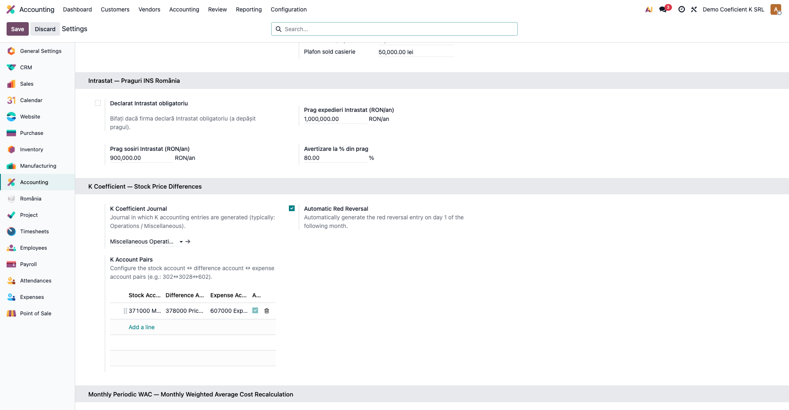
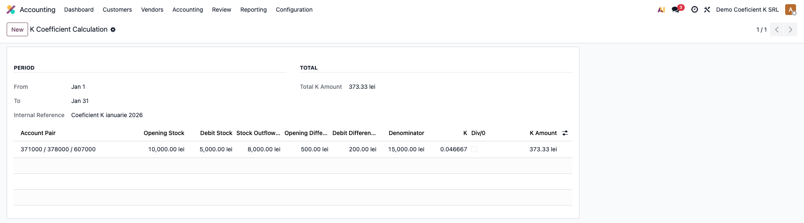
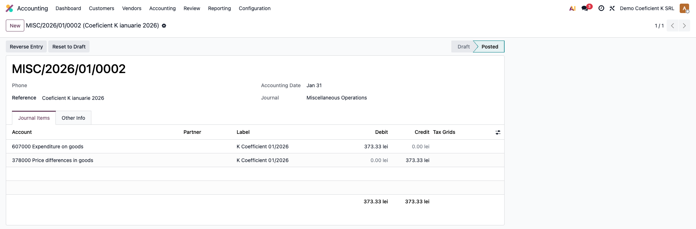
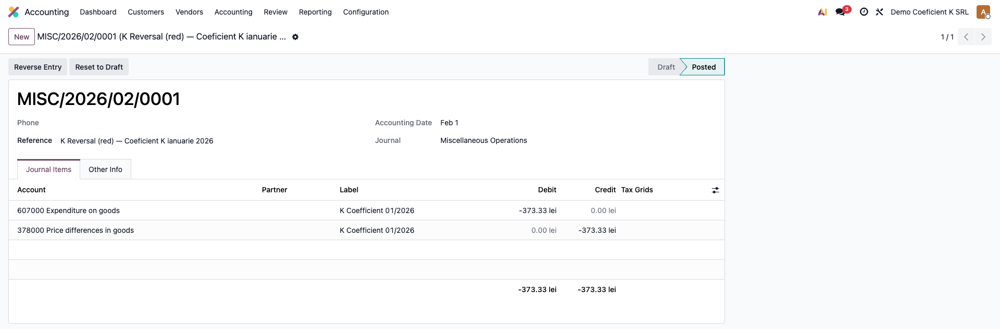
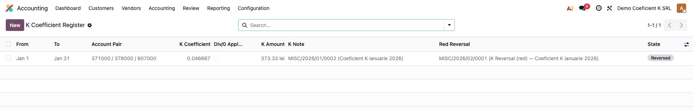

# Fișă Modul: Coeficient K — Diferențe de Preț la Stocuri

**Poziție plan:** B1.1
**Modul:** `l10n_ro_stock_k_coefficient`
**FR:** FR-11
**Capitol manual:** Cap 6.1
**Utilizator principal:** Contabil stocuri, Contabil șef
**Prioritate:** 🔴 Ridicată (rulare lunară obligatorie dacă stocurile sunt ținute la preț de înregistrare standard)

---

## 1. Scop business

Firmele care evaluează stocurile la **preț de înregistrare standard** (prețuri prestabilite) țin
stocul în conturile **302/371** la prețul standard, iar abaterile față de costul real de achiziție
se acumulează în conturile de **diferențe de preț 3028/378**. La finele fiecărei luni, aceste
diferențe trebuie repartizate proporțional cu ieșirile din stoc, prin **coeficientul de repartizare K**.

Modulul calculează lunar K pentru fiecare pereche de conturi configurată, generează **nota de
repartizare** (Dr cheltuieli = Cr diferențe) și, opțional, **stornarea în roșu** la ziua 1 a lunii
următoare (conform practicii contabile RO). Tot calculul este păstrat într-un registru de audit.

## 2. Bază legală și context

OMFP 1802/2014 — Reglementările contabile privind situațiile financiare anuale — reglementează
evaluarea stocurilor la preț de înregistrare (prestabilit) și **repartizarea diferențelor de preț
prin coeficient mediu** asupra ieșirilor și stocului final. Coeficientul K se aplică lunar.

Formula coeficientului:

```
                Si_diferențe (3028/378) + Rd_diferențe (3028/378)
Coeficient K = ───────────────────────────────────────────────────
                Si_stoc (302/371)       + Rd_stoc (302/371)

Sumă de repartizat = K × Rulaj_credit_stoc (ieșirile lunii, Rc 302/371)
```

## 3. Utilizatori și roluri

Contabil stocuri / Contabil șef.

Roluri recomandate pentru testare:
- **Administrator funcțional** (Settings) — instalează modulul, configurează jurnalul și perechile de conturi.
- **Contabil** (grupul „Contabil / Accountant") — rulează wizardul lunar și verifică nota K + stornarea.
- **Contabil șef / Manager** (grupul „Consilier / Adviser") — validează rezultatul și închiderea lunii.

## 4. Conturi și date implicate

Modulul lucrează pe **perechi de conturi** configurate explicit (un rând per pereche):

- **Cont stoc** (numitor) — **302** „Materiale" sau **371** „Mărfuri".
- **Cont diferențe de preț** (numărător) — **3028** „Diferențe de preț la alte materiale consumabile"
  sau **378** „Diferențe de preț la mărfuri".
- **Cont cheltuieli** (debitul notei K) — **602** „Cheltuieli cu materialele" sau **607** „Cheltuieli
  privind mărfurile".

Monografia notei K (pentru K × ieșiri > 0): **Dr 602/607 = Cr 3028/378**. Dacă suma este negativă
(diferențe creditoare — stoc subevaluat), nota se generează în oglindă (valori negative pe aceleași conturi).

> Notele de stoc curente (recepție la preț standard, acumulare diferențe în 3028/378) sunt generate
> automat de Odoo (`stock_account`). Modulul K intervine **exclusiv lunar**, repartizând diferențele
> deja acumulate — nu atinge notele de recepție/vânzare.

Date minime pentru demo:
- companie românească cu plan de conturi RO;
- un jurnal de tip **Operațiuni diverse** (general) pentru notele K;
- cel puțin o pereche de conturi 302/3028/602 configurată;
- rulaje în luna de test pe conturile de stoc (intrări + ieșiri) și pe contul de diferențe.

## 5. Configurare inițială

1. Instalați modulul `l10n_ro_stock_k_coefficient` (dependențe: `account`, `l10n_ro`, `stock`,
   `stock_account`).
2. **Contabilitate → Configurare → Setări → secțiunea „Coeficient K — Diferențe Preț Stocuri"**:
   - alegeți **Jurnalul coeficient K** (tip *Operațiuni diverse*);
   - lăsați bifat **„Stornare automată în roșu"** (recomandat) pentru stornarea la 1 a lunii următoare;
   - adăugați în listă **perechile de conturi** (cont stoc ↔ cont diferențe ↔ cont cheltuieli).
3. Opțional, pe categoriile de produse cu metoda *Preț standard*: activați **„Blochează recepții cu
   preț standard zero"** (Inventar → Configurare → Categorii de produse). Acest comutator refuză
   validarea recepțiilor pentru produse fără cost standard completat — premisa unui calcul K corect.

## 6. Flux de utilizare

### Pasul 1 — Configurarea pe companie

**Contabilitate → Configurare → Setări**, secțiunea „Coeficient K". Selectați jurnalul, lăsați activă
stornarea în roșu și definiți perechile de conturi. Aceleași perechi sunt vizibile și în meniul
**Contabilitate → Coeficient K Stocuri → Perechi conturi K**.



### Pasul 2 — Calculul lunar (previzualizare)

**Contabilitate → Coeficient K Stocuri → Calcul Coeficient K**. Wizardul are perioada implicită pe
**luna anterioară**. Apăsați **„Calculează previzual"**.

Pentru fiecare pereche apare o linie cu: Si stoc, Rd stoc, ieșiri stoc (Rc), Si/Rd diferențe, numitor,
**K** (6 zecimale) și **Suma K**. În antet apare Totalul. Un banner avertizează dacă pentru vreo
pereche numitorul este zero (K = 0, marcaj **Div/0**).



### Pasul 3 — Generarea notei K

Apăsați **„Generează nota contabilă"**. Modulul postează nota K în jurnalul configurat, datată în
ultima zi a lunii: pentru fiecare pereche cu sumă ≠ 0, **Dr cont cheltuieli (602/607) = Cr cont
diferențe (3028/378)**. Perechile cu K = 0 sau fără ieșiri nu produc linii.



### Pasul 4 — Stornarea în roșu

Dacă opțiunea este activă, se postează automat **stornarea în roșu** la **ziua 1 a lunii următoare**:
aceleași conturi, cu **valori negative** (reduc rulajele, nu le inversează — `is_storno = True`,
România fiind în lista țărilor cu storno obligatoriu).



### Pasul 5 — Registrul de audit

**Contabilitate → Coeficient K Stocuri → Registru Coeficient K** afișează toate calculele, cu starea
**Calculat / Postat / Stornat** și link direct la nota K și la stornare.



### Note de monografie și raportare

- Nota K (sumă > 0): **Dr 602/607 = Cr 3028/378** cu valoarea K × ieșiri;
- stornare în roșu (1 a lunii următoare): **aceleași conturi, valori negative** (storno roșu, nu negru);
- nota și stornarea sunt echilibrate (Σ Debit = Σ Credit) și legate de linia din registru;
- corecția mișcă doar conturi de clasă 3/6 — **nu afectează TVA** și nu intră în D300/D394;
- soldul rezidual din 3028/378 după stornare reprezintă diferențele aferente stocului rămas, care se
  repartizează în luna când acel stoc iese.

## 7. Legături cu alte module / declarații

| Modul / proces | Rol în flux | Tip legătură |
|---|---|---|
| `account` | nota K, stornarea și liniile contabile | dependență (manifest) |
| `stock` / `stock_account` | conturile de stoc/diferențe și notele automate la recepție/ieșire | dependență (manifest) |
| `l10n_ro` | localizare contabilă RO (plan de conturi, storno obligatoriu) | dependență (manifest) |
| `l10n_ro_stock_cmp_periodic` | metodă alternativă (CMP periodic) — pentru stocuri la cost mediu, nu la preț standard | independent |
| `l10n_ro_stock_report` | fișa de magazie și rapoartele cantitativ-valorice | integrare prin convenție |
| `l10n_ro_period_close_enhanced` | checklist de închidere — rulați K înainte de închiderea lunii | secvențiere recomandată |

Ce este automat: calculul K, nota de repartizare, stornarea în roșu și registrul de audit.
Ce rămâne manual: configurarea perechilor și a jurnalului, setarea prețului standard pe produse,
validarea perioadei și declanșarea wizardului (sau activarea explicită a cron-ului).

## 8. Verificări pentru consultant

- [ ] Modulul se instalează fără erori pe baza demo.
- [ ] Jurnalul K și perechile de conturi apar în Setări contabilitate.
- [ ] Wizardul afișează o linie per pereche, cu K pe 6 zecimale și Total corect.
- [ ] Nota K este postată, echilibrată (Dr 602/607 = Cr 3028/378).
- [ ] Stornarea în roșu are data de 1 a lunii următoare și valori negative (storno roșu).
- [ ] Registrul Coeficient K conține calculul lunii, cu starea „Stornat" și link la ambele note.
- [ ] Recalculul aceleiași luni deja postate este blocat cu mesaj clar.
- [ ] O perioadă blocată fiscal blochează generarea notei.
- [ ] (Opțional) O recepție cu preț standard zero pe categorie protejată este refuzată.

## 9. Mesaje de eroare frecvente

| Mesaj / simptom | Cauză probabilă | Remediere |
|-----------------|-----------------|-----------|
| „Calculați mai întâi previzualul înainte de confirmare." | S-a apăsat „Generează" fără previzualizare | Apăsați mai întâi „Calculează previzual" |
| „Nu există perechi de conturi K configurate pentru această companie." | Lipsesc perechile în setări | Adăugați perechile cont stoc/diferențe/cheltuieli în Setări |
| „Configurați jurnalul pentru coeficientul K în setările companiei." | Jurnalul K nu este selectat | Selectați jurnalul în Setări → Coeficient K |
| „Luna … are deja coeficientul K calculat și postat. Anulați nota contabilă înainte de recalcul." | Luna a fost deja postată/stornată | Anulați nota și resetați linia din registru, apoi recalculați |
| „Perioada … este blocată fiscal. Nu se pot genera note retroactive." | Data lunii ≤ data de blocare fiscală | Deblocați temporar perioada sau alegeți o lună deschisă |
| Banner ⚠ „K = 0 … numitorul = 0" | Contul de stoc nu are sold inițial și nici rulaj debit în lună | Normal dacă nu sunt intrări; verificați perechea dacă vă așteptați la mișcări |
| „Prețul standard (câmpul «Cost») este zero pentru următoarele produse…" | Recepție pe categorie cu blocaj preț-zero, fără cost completat | Completați câmpul „Cost" pe fișa produsului înainte de validarea recepției |

## 10. Capturi de ecran

Capturile (`readme/screenshots/`) sunt **generate automat** din `tests/test_screenshots.py`
(mixinul `ScreenshotCase` din `l10n_ro_doc_screenshots`, import defensiv), în **limba română**,
pe planul de conturi RO (`setup_country("ro")`):

1. `01_setari_companie.png` — Setări contabilitate cu jurnalul K, stornarea în roșu și perechile de conturi.
2. `02_wizard_preview.png` — wizardul de calcul în previzualizare, cu tabelul K per pereche.
3. `03_nota_k.png` — nota K generată (Dr cheltuieli 607 / Cr diferențe 378).
4. `04_stornare_rosu.png` — stornarea în roșu (aceleași conturi, valori negative).
5. `05_registru_k.png` — Registrul Coeficient K cu istoricul calculelor.

Regenerare:

```bash
./odoo/odoo-bin -c odoo.conf -d <db> -i l10n_ro_stock_k_coefficient,l10n_ro_doc_screenshots \
    --test-tags=fise_screenshots --stop-after-init
```

## 11. Observații pentru manual

În manualul final, păstrați explicația orientată pe activitatea utilizatorului: ce este metoda
prețului de înregistrare standard, cum se acumulează diferențele în 3028/378, când se rulează
repartizarea K (la închiderea lunii, înainte de blocarea perioadei), ce date trebuie pregătite
(perechi de conturi, jurnal, preț standard pe produse) și cum se verifică rezultatul (nota K +
stornarea în roșu + registrul de audit). Subliniați specificul RO al **stornării în roșu** (valori
negative, nu inversare) și regula de a nu modifica prețul standard în cursul lunii.
