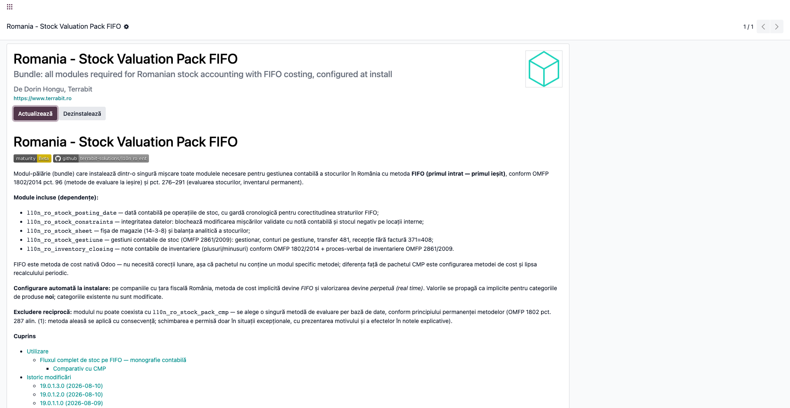
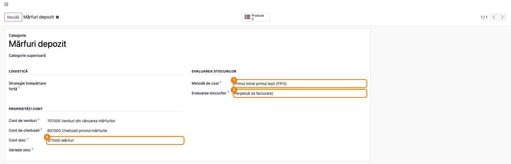
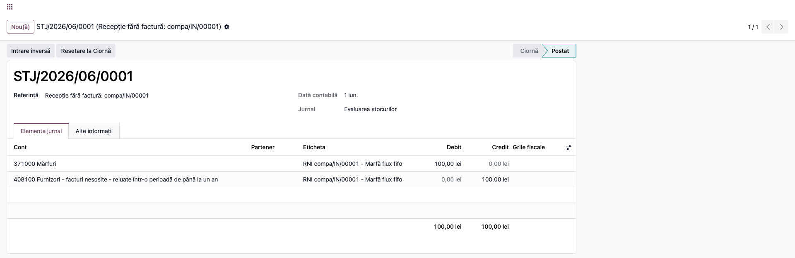
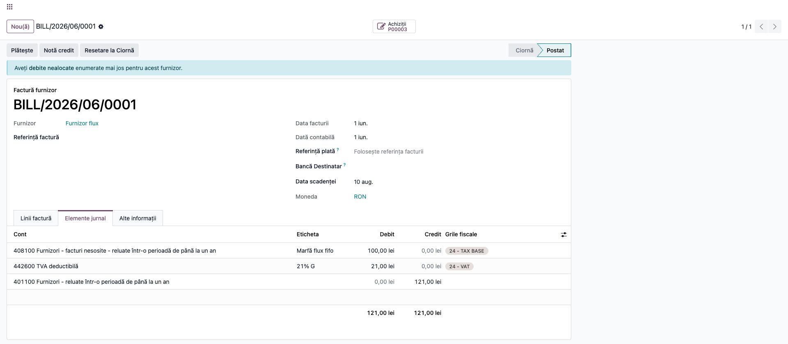
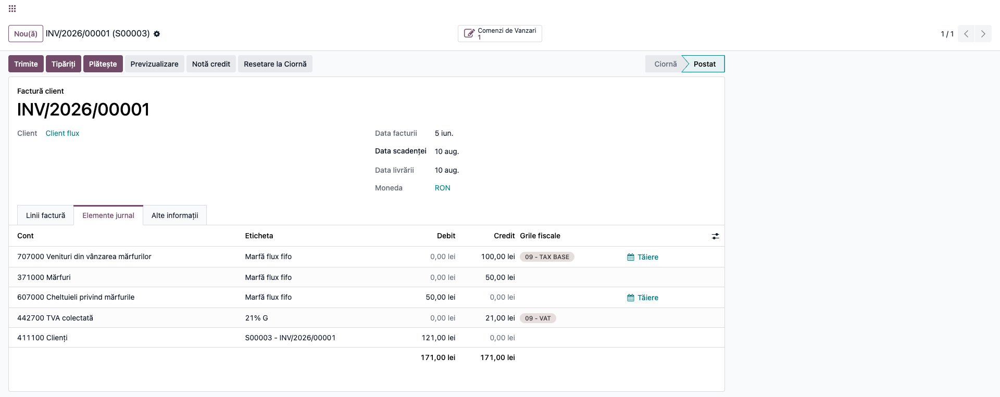
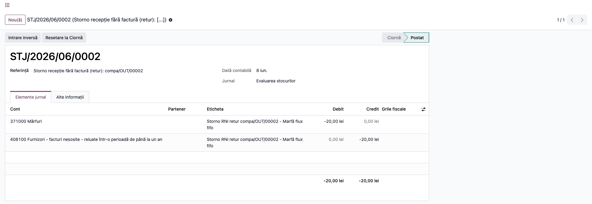
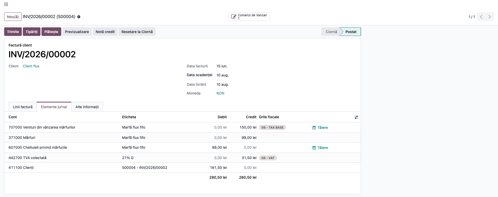
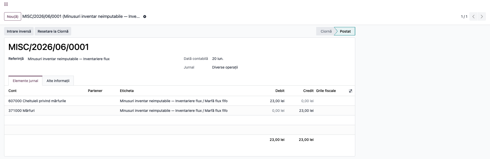
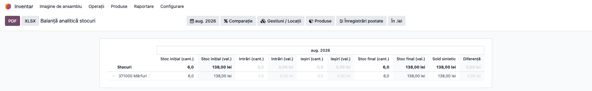

# Fișă Modul: Pachet evaluare stoc FIFO (primul intrat — primul ieșit)

**Modul:** `l10n_ro_stock_pack_fifo`
**Utilizator principal:** Consultant de implementare, Contabil șef
**Prioritate:** 🟡 Medie (se folosește la implementare, nu în fluxul zilnic)

---

## 1. Scop business

Pachetul instalează dintr-o singură mișcare toate modulele necesare pentru
gestiunea contabilă a stocurilor în România pe metoda **FIFO (primul
intrat — primul ieșit)** și configurează automat compania: metoda de cost
*FIFO* și valorizarea perpetuă (*real time*). Fiecare recepție formează un
strat de cost, iar ieșirile consumă straturile în ordine cronologică — fără
recalcul lunar și fără operații de închidere specifice metodei. Consultantul
primește o configurație coerentă: recepție cu pivot 408, dată contabilă cu
gardă cronologică, protecții de integritate, fișă de magazie, gestiuni
contabile și note de inventariere.

## 2. Bază legală și context

- OMFP 1802/2014 pct. 96 — metodele de evaluare la ieșire (CMP/FIFO/LIFO);
  FIFO: bunurile ieșite se evaluează la costul primei intrări, apoi al
  următoarei, în ordine cronologică.
- OMFP 1802/2014 pct. 287 alin. (1) — permanența metodelor: metoda aleasă se
  aplică cu consecvență; schimbarea e permisă doar în situații excepționale,
  cu prezentarea motivului și a efectelor în notele explicative. De aceea
  pachetul FIFO și pachetul CMP **se exclud reciproc** la instalare.
- OMFP 1802/2014 pct. 289–290 — inventarul permanent.
- Funcțiunea contului 408 (Cap. 16 OMFP 1802) — bunuri aprovizionate fără
  factură sosită.

## 3. Utilizatori și roluri

Consultant de implementare (instalare + configurare), contabil șef
(validarea politicii contabile), contabil de gestiune (fluxul curent).

Roluri recomandate pentru testare:
- Administrator funcțional: instalează pachetul și verifică configurarea
  automată a companiei;
- Utilizator operațional: rulează fluxul de recepție/vânzare/inventar;
- Contabil/manager: validează notele contabile și valorile straturilor.

## 4. Conturi și date implicate

371 (mărfuri), 408 (furnizori — facturi nesosite, pivotul recepțiilor),
607 (cheltuieli privind mărfurile), 707 (venituri din vânzarea mărfurilor),
401 (furnizori), 4111 (clienți), 4426/4427 (TVA). Convenție declarată:
pivotul 408 se ține la valoarea fără TVA, iar TVA se înregistrează integral
la factură. Aceasta este o **politică contabilă asumată**: TVA aferentă
avizelor nefacturate nu se evidențiază în 4428, iar deducerea se operează
integral la primirea facturii (art. 297–299 Cod fiscal). Consecință la
reconciliere: soldul 408 reflectă doar baza fără TVA, spre deosebire de
modelul din funcțiunea contului 408.

Date minime pentru demo:
- companie românească cu planul de conturi RO instalat;
- un produs stocabil (marfă) într-o categorie cu contul de stoc 371;
- un furnizor și un client de test;
- perioadă contabilă deschisă.

## 5. Configurare inițială

1. Instalați pachetul `l10n_ro_stock_pack_fifo` pe baza demo — dependențele
   (posting_date, constraints, sheet, gestiune, inventory_closing, purchase,
   sale) se instalează automat.
2. Verificați configurarea automată pe o categorie nouă de produse
   (**Inventar → Configurare → Categorii de produse**): *Metodă de cost* =
   *Primul intrat, primul ieșit (FIFO)* și *Evaluarea stocurilor* =
   *Perpetuă (la facturare)*. Valorile sunt implicitele companiei pentru
   categoriile **noi**; categoriile existente nu sunt modificate.
3. Activați recepția fără factură în **Setări → Inventar**, secțiunea de
   valorizare a stocurilor: bifați *Recepție fără factură (371 = 408)* și
   completați *Cont 408 implicit*.
4. Setați manual conturile de inventariere în **Setări → Inventar**,
   secțiunea *Inventariere RO*: conturile de
   plus și de minus (recomandat 607 pentru mărfuri) — nu au valoare
   implicită, iar fără ele wizardul de note de inventariere refuză generarea.

## 6. Flux de utilizare

Cifrele de mai jos sunt exact cele din testul automat al pachetului
(`tests/test_stock_flow.py`) și din monografia din `readme/USAGE.md`.

Pașii sunt grupați pe tip de operație, dar **cronologia reală a scenariului**
(cea din capturi, respectată de garda cronologică a pachetului) este:
1 iunie recepția 1 și factura ei, 5 iunie prima vânzare, 8 iunie returul și
nota de credit, 10–11 iunie recepția 2 pe aviz și factura ei, 15 iunie a doua
vânzare, 20 iunie inventarierea.

### Pasul 1 — Instalarea pachetului

Accesați **Aplicații**, căutați „Stock Valuation Pack FIFO" și instalați.
Pachetul refuză instalarea dacă pachetul CMP este deja instalat (mesaj de
incompatibilitate) — se alege o singură metodă per bază de date.



### Pasul 2 — Verificarea configurării implicite

Metoda de cost nu are un câmp propriu în ecranul de setări; se verifică pe
categoriile de produse. Creați o categorie nouă (**Inventar → Configurare →
Categorii de produse → Nou**) și priviți secțiunea *Evaluarea stocurilor*:

1. **Găsiți pe ecran**: câmpurile *Metodă de cost* și *Evaluarea stocurilor*.
2. **Verificați**: sunt precompletate cu *Primul intrat, primul ieșit (FIFO)*
   și *Perpetuă (la facturare)* — valorile puse de pachet la instalare, ca
   implicite ale companiei pentru categoriile **noi**.
3. **Completați dumneavoastră** *Cont stoc* (371 pentru mărfuri) — pachetul
   nu îl impune, iar implicita Odoo este 301.
4. Categoriile create înainte de instalare păstrează metoda lor — dacă
   preluați o bază existentă, verificați-le și aliniați-le manual.



### Pasul 3 — Achiziții succesive la prețuri diferite (straturile FIFO)

Creați și recepționați două comenzi de achiziție: 10 buc × 10 lei, apoi
10 buc × 23 lei. Fiecare recepție generează nota `371 = 408` la valoarea ei
(100, respectiv 230 lei) și formează un strat de cost separat.



La sosirea fiecărei facturi (**Creează factură** din comandă), linia de
produs se rutează automat pe 408 și stinge pivotul: `408 = 401` + TVA.



### Pasul 4 — Prima vânzare: descărcare din stratul cel mai vechi

Vindeți 5 buc × 20 lei, livrați și facturați. Descărcarea de gestiune de pe
factura de client consumă stratul cel mai vechi: `607 = 371` **50 lei**
(5 buc × 10). În inventarul permanent Odoo 19 ieșirile se valorizează la
facturare.

1. **Găsiți pe ecran**: pe factura de client, sub liniile de venit, liniile
   de descărcare (607 debit / 371 credit) — la prima vânzare, 5 buc din
   stratul de 10 lei = 50 lei. Dacă livrarea (avizul) și factura cad în **luni
   diferite**, cheltuiala s-ar recunoaște în luna facturii: la închidere
   folosiți 418 „Clienți — facturi de întocmit" (OMFP 1802 pct. 310
   alin. (3)) pentru livrările nefacturate.
2. **Verificați**: valoarea descărcării corespunde stratului consumat, nu
   unui preț mediu — la a doua vânzare (pasul 6) se vede clar consumul a două
   straturi.
3. **Postați** factura abia după confirmarea valorilor.



### Pasul 5 — Retur la furnizor (storno în roșu)

Din prima recepție, **Retur** pentru 2 buc. Returul iese pe stratul de
origine și stornează în roșu nota de recepție; nota de credit a furnizorului
stinge apoi pivotul 408.



### Pasul 6 — A doua vânzare: descărcare pe două straturi

Vânzarea de 6 buc consumă restul stratului vechi și intră în cel nou:
3 buc × 10 + 3 buc × 23 = **99 lei**, vizibil pe factura de client.



### Pasul 7 — Inventariere cu minus

Creați inventarul (**Inventar → Operații → Ajustări → Documente
inventariere**), porniți-l,
completați cantitatea faptică (cu 1 buc mai puțin) și validați. Wizardul de
note contabile generează minusul la costul stratului curent (23 lei):



### Pasul 8 — Verificarea stocului la valoare FIFO

Deschideți **Inventar → Raportare → Balanță analitică stocuri** (raportul din
`l10n_ro_stock_sheet`, inclus în pachet):

1. **Găsiți pe ecran**: liniile grupate pe contul de stoc (371 Mărfuri), cu
   coloanele *Stoc inițial*, *Intrări*, *Ieșiri* și *Stoc final*, în cantitate
   și valoare, plus coloana *Sold sintetic* (soldul contabil al contului).
   Raportul se deschide pe **luna curentă** — pentru a vedea rulajele lunii
   analizate, schimbați perioada din selectorul de dată din antet (în captură,
   luna afișată este ulterioară operațiilor, deci rulajele apar zero, iar
   stocul se regăsește integral în coloana *Stoc inițial*).
2. **Verificați**: *Stoc final (val.)* = valoarea straturilor rămase (în demo:
   6 buc × 23 = 138 lei), iar coloana *Diferență* este zero — adică evidența
   cantitativ-valorică se potrivește cu soldul contului 371 (*Sold sintetic*).
3. **Exportați** abia apoi, cu butoanele **PDF** sau **XLSX** din antetul
   raportului, pentru dosarul lunii.



### Note de monografie și raportare

- Recepție (cu sau fără factură): **Dr 371 = Cr 408**, per strat;
- Factura furnizorului: **Dr 408 + Dr 4426 = Cr 401** (stinge pivotul);
- Vânzare: **Dr 4111 = Cr 707 + Cr 4427** și **Dr 607 = Cr 371** la costul
  straturilor consumate;
- Retur la furnizor: iese pe stratul de origine; storno în roșu **371 = 408**
  (OMFP 1802 pct. 69, în cadrul exercițiului curent) + nota de credit care
  stinge 408;
- Minus de inventar: **Dr 607 = Cr 371** la costul stratului curent —
  nedeductibil dacă e neimputabil, cu excepțiile expres prevăzute la
  **art. 25 alin. (4) lit. c)** din Codul fiscal (bunuri asigurate, distruse
  prin calamități, degradate calitativ cu dovada distrugerii).
  Perisabilitățile și scăzămintele se tratează separat, ca deductibile în
  limitele legale — **art. 25 alin. (3) lit. d)**. Dacă lipsa nu e
  demonstrată, se ajustează și TVA dedusă (art. 304), prin
  **Dr 635 = Cr 4426**;
- fără corecție lunară — FIFO nu are recalcul periodic.

Monografia completă, cu cifrele scenariului demo pas cu pas, este în
`readme/USAGE.md`.

## 7. Legături cu alte module / declarații

| Modul / proces | Rol în flux | Tip legătură |
|---|---|---|
| `l10n_ro_stock_gestiune` | pivotul 408, gestiuni contabile, storno retur | dependență (manifest) |
| `l10n_ro_stock_posting_date` | dată contabilă cu gardă cronologică (critică la FIFO) | dependență (manifest) |
| `l10n_ro_stock_constraints` | blochează modificarea mișcărilor valorizate | dependență (manifest) |
| `l10n_ro_stock_sheet` | fișa de magazie (14-3-8) și balanța stocurilor | dependență (manifest) |
| `l10n_ro_inventory_closing` | notele contabile de inventariere + PV | dependență (manifest) |
| `l10n_ro_stock_pack_cmp` | pachetul echivalent CMP | **exclus reciproc** |

Ce este automat: instalarea suitei, configurarea metodei de cost și a
valorizării pe companiile RO, notele 371=408 la recepție, rutarea facturilor
pe 408, descărcarea pe straturi la facturare.
Ce rămâne manual: activarea RNI și a conturilor de inventariere
(pasul 5.3–5.4) și disciplina datelor contabile (garda cronologică respinge
datări care ar strica ordinea straturilor).

## 8. Verificări pentru consultant

- [ ] Pachetul se instalează fără erori pe baza demo, cu toate dependențele.
- [ ] Instalarea pachetului CMP peste el este refuzată cu mesaj de
      incompatibilitate.
- [ ] O categorie de produse nouă primește implicit *FIFO* și *Perpetuă
      (la facturare)*.
- [ ] Recepția generează nota 371 = 408 la valoarea fără TVA, per strat.
- [ ] Factura furnizorului are linia de produs pe 408, iar soldul 408 pe
      documentele perechii recepție+factură este zero.
- [ ] Descărcarea de pe factura de client corespunde straturilor consumate
      (nu unui preț mediu).
- [ ] Balanța analitică a stocurilor arată valoarea straturilor rămase, iar
      coloana *Diferență* față de soldul contului 371 este zero.
- [ ] Testul automat al fluxului trece: `--test-tags=/l10n_ro_stock_pack_fifo`.

## 9. Mesaje de eroare frecvente

| Mesaj / simptom | Cauză probabilă | Remediere |
|-----------------|-----------------|-----------|
| „Modules … are incompatible." la instalare | Pachetul CMP este deja instalat | Dezinstalați pachetul CMP sau păstrați metoda existentă — nu se pot instala ambele |
| Compania nu a primit metoda FIFO la instalare | Compania nu are țara fiscală România | Setați țara fiscală RO pe companie și configurați manual metoda de cost |
| Recepția nu generează nota 371 = 408 | RNI nu este activat pe companie sau contul 408 lipsește | Bifați *Recepție fără factură (371 = 408)* în Setări → Inventar și completați *Cont 408 implicit* |
| Factura de client nu are liniile 607 = 371 | Produsul nu e stocabil sau categoria nu are valorizare *real time* | Verificați categoria produsului: valorizare automată + cont de stoc 371 |
| Datarea unei operații de stoc este respinsă | Garda cronologică: data ar strica ordinea straturilor FIFO | Folosiți o dată contabilă ulterioară ultimei mișcări valorizate a produsului |

## 10. Capturi de ecran

Capturile din `readme/screenshots/` sunt **generate automat** din
`tests/test_screenshots.py` (mixinul `ScreenshotCase` din
`l10n_ro_doc_screenshots`, import defensiv), în limba română, pe planul de
conturi RO, cu același scenariu ca testul de flux:

1. `01_instalare_pachet.png` — pagina pachetului în Aplicații.
2. `02_categorie_produs.png` — categorie nouă cu metoda implicită FIFO.
3. `03_receptie_nota_rni.png` — recepția cu nota 371 = 408.
4. `04_factura_pe_408.png` — factura furnizorului rutată pe 408.
5. `05_vanzare_cogs_fifo.png` — prima vânzare, descărcare din stratul 1.
6. `06_storno_retur.png` — stornarea în roșu la returul către furnizor.
7. `07_vanzare_doua_straturi.png` — descărcare pe două straturi (99 lei).
8. `08_inventar_minus.png` — nota de minus de inventar 607 = 371.
9. `09_balanta_stocuri.png` — balanța analitică a stocurilor (valoare FIFO).

Regenerare:

```bash
./odoo/odoo-bin -c odoo.conf -d <db> -i l10n_ro_stock_pack_fifo,l10n_ro_doc_screenshots \
    --test-tags=fise_screenshots --stop-after-init
```

## 11. Observații pentru manual

Păstrați perspectiva de politică contabilă: pachetul este alegerea metodei
FIFO pentru toată baza de date (permanența metodelor), nu un simplu
instalator. Subliniați diferența operațională față de CMP: fără închidere
lunară specifică, dar cu disciplină strictă a datelor (garda cronologică) și
cu verificarea descărcării pe straturi la vânzare. Cifrele din monografia
`readme/USAGE.md` sunt verificate de testul automat al pachetului.
