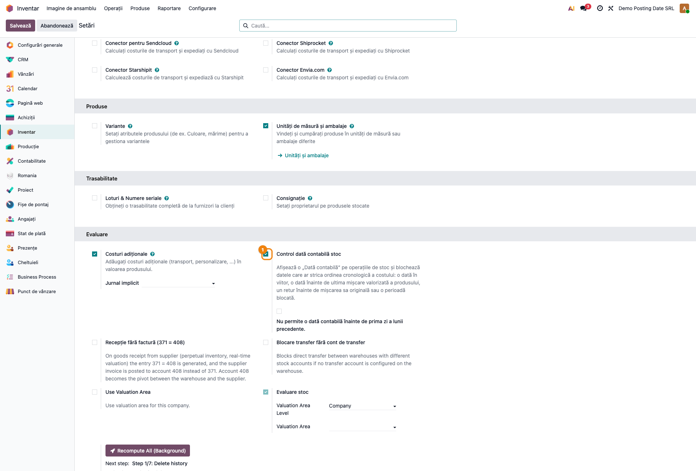
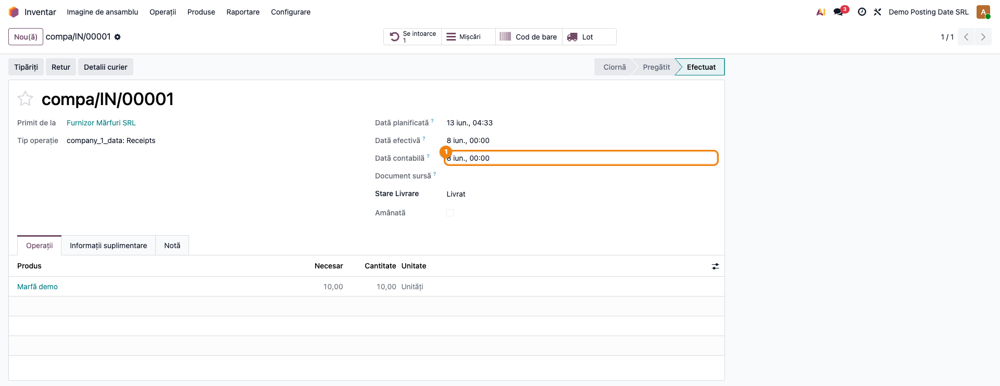
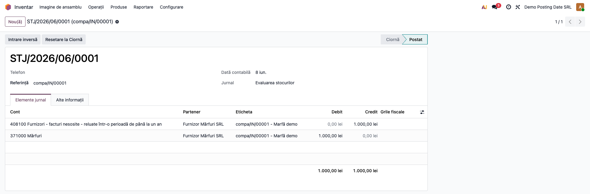
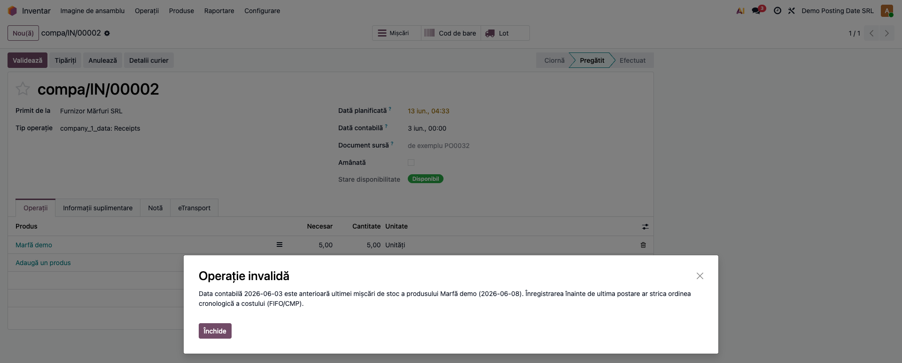
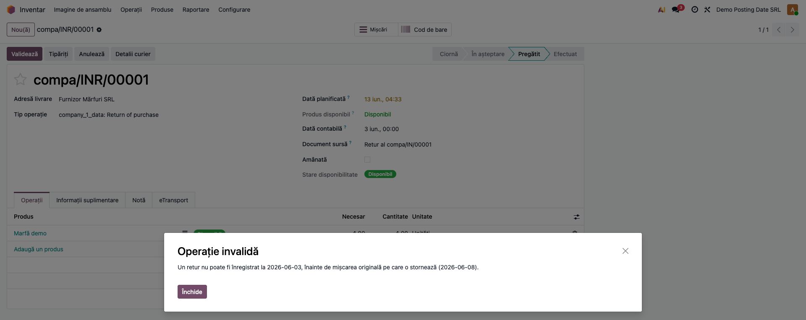

# Fișă Modul: Data Contabilă a Mișcărilor de Stoc (Posting Date)

**Modul:** `l10n_ro_stock_posting_date`
**Utilizator principal:** Gestionar / Operator depozit, Contabil stocuri
**Prioritate:** 🟡 Medie (control de disciplină cronologică pe valorizare)

---

## 1. Scop business

Această fișă descrie utilizarea modulului `l10n_ro_stock_posting_date`, care adaugă o
**dată contabilă („Posting Date", concept din SAP)** pe operațiile de stoc și o pune sub
un control automat. Operatorul poate înregistra o mișcare de stoc cu o dată din trecut
(de ex. o recepție primită fizic ieri, operată azi), iar **toate notele de valorizare**
generate (valorizare nativă, recepție fără factură 371=408, transfer între gestiuni,
storno de retur) cad pe acea dată. În același timp, modulul **blochează** datele care ar
distorsiona ordinea cronologică a costului — pentru că în Odoo costul (FIFO/CMP) se
calculează în ordinea procesării, nu a datei, iar o mișcare strecurată „în trecut" ar
desincroniza valorile deja calculate pe mișcările ulterioare.

## 2. Bază legală și context

Legea contabilității nr. 82/1991 (art. 6) impune înregistrarea **cronologică și
sistematică** a operațiunilor economice, în ordinea efectuării lor. OMFP 1802/2014
reține principiul intangibilității și al independenței exercițiului. Modulul nu este o
cerință declarativă ANAF, ci un **instrument de disciplină operațională**: păstrează
ordinea cronologică a mișcărilor valorizate și respectă datele de blocare contabilă
(lock date) pe perioadele deja declarate (D300/D394/balanțe).

## 3. Utilizatori și roluri

Gestionar de depozit, operator recepții/livrări, contabil de stocuri.

Roluri recomandate pentru testare:
- Administrator funcțional: activează controlul în Setări inventar și verifică câmpul pe operații.
- Utilizator operațional (Inventar): operează recepții/livrări/retururi cu dată contabilă.
- Contabil/manager: verifică data notelor de valorizare și respectarea lunilor închise.

## 4. Conturi și date implicate

Modulul **nu introduce conturi noi** și nu schimbă monografia — acționează doar asupra
**datei** notelor de valorizare existente. Conturile implicate sunt cele de valorizare a
stocului folosite de companie (de regulă **371** „Mărfuri" / 301/302/303 pentru materiale,
cu contrapartida pe variația de stoc), plus, dacă sunt instalate modulele de gestiune:
**408** „Furnizori — facturi nesosite" (recepție fără factură) și **481** „Decontări între
unitate și subunități" (transfer între gestiuni).

Date minime pentru demo:
- companie românească cu localizarea contabilă RO instalată (plan de conturi RO);
- un produs **stocabil** cu valorizare **perpetuă** (real-time) și metodă FIFO sau CMP;
- un depozit cu locații și un tip de operație de recepție;
- jurnalul de evaluare a stocului configurat pe companie.

## 5. Configurare inițială

1. Instalați modulul `l10n_ro_stock_posting_date` pe baza demo.
2. În **Inventar → Configurare → Setări**, la secțiunea de evaluare, activați
   **„Control dată contabilă stoc"**.
3. Opțional, bifați **„Restricționează data contabilă la luna precedentă"** dacă nu vreți
   să se poată înregistra mai în urmă de prima zi a lunii precedente.
4. Asigurați-vă că aveți cel puțin un produs stocabil cu valorizare perpetuă și un jurnal
   de stoc configurat.
5. Verificați că utilizatorul de test are accesul „Inventar" necesar pentru validarea
   operațiilor.

## 6. Flux de utilizare

### Pasul 1 — Activarea controlului datei contabile

Accesați **Inventar → Configurare → Setări** și activați **„Control dată contabilă stoc"**.
La nevoie, bifați și restricția pe luna precedentă. Din acest moment, operațiile de stoc
afișează câmpul „Dată contabilă", iar validarea verifică automat datele introduse.



### Pasul 2 — Recepție cu dată contabilă în trecut

Creați o recepție în **Inventar → Operațiuni → Recepții**, completați produsul și cantitatea,
apoi setați **„Dată contabilă"** la o dată din trecut (de ex. ziua în care marfa a intrat
fizic în depozit). Validați operația cu **Validează**.



La validare, mișcarea primește acea dată, iar nota de valorizare a stocului este
înregistrată **la data contabilă aleasă**, nu la data curentă.



### Pasul 3 — Blocarea unei date care strică cronologia

Dacă încercați să validați o nouă mișcare pe **același produs** cu o dată contabilă
**anterioară ultimei mișcări valorizate** a produsului, modulul oprește validarea cu un
mesaj explicit. Operatorul corectează data și reia validarea.



La fel se întâmplă pentru o dată din **viitor**, pentru o **perioadă contabilă blocată**
sau, dacă restricția e activă, pentru o dată **înainte de luna precedentă** (mesajele
exacte sunt în secțiunea 9).

### Pasul 4 — Retur cu verificarea datei față de mișcarea originală

La un **retur** către furnizor (sau un retur de la client), data contabilă a returului
trebuie să fie **cel puțin egală** cu data mișcării originale pe care o stornează — nu poți
returna marfă pe care nu o primiseși/livraseși încă. Un retur datat la zi (ulterior recepției)
se validează normal și generează storno-ul corespunzător la data returului; un retur
back-datat înainte de recepția originală este **blocat**, indiferent de celelalte reguli.



### Note de monografie și raportare

- Modulul **nu schimbă** liniile Dr/Cr ale notelor — schimbă doar **data** la care se
  înregistrează. Notele generate rămân cele ale fluxului folosit:
  - recepție valorizată (perpetuă): **Dr 371 = Cr** cont variație de stoc / contrapartidă;
  - recepție fără factură (dacă e instalat modulul de gestiune): **Dr 371 = Cr 408**;
  - transfer între gestiuni (dacă e instalat modulul de gestiune): **Cr 371.A / Dr 481**
    și **Dr 371.B / Cr 481**;
  - retur către furnizor: **storno în roșu** al notei de recepție, la **data returului**.
- Mecanismul tehnic: data contabilă aleasă se propagă prin contextul `force_period_date`,
  respectat nativ de Odoo 19, astfel încât toate notele de valorizare cad pe aceeași dată.
- Efectul în raportare: notele apar în **balanță, fișa contului 371 și jurnalul de stoc** în
  perioada datei contabile alese — de aceea controlul interzice datele care ar atinge o lună
  deja închisă/declarată.

## 7. Legături cu alte module / declarații

| Modul / proces | Rol în flux | Tip legătură |
|---|---|---|
| `stock_account` | valorizarea perpetuă a stocului și notele contabile | dependență (manifest) |
| `l10n_ro` | plan de conturi RO (371/408/481) | dependență (manifest) |
| `l10n_ro_stock_gestiune` | recepție fără factură (371=408) și transfer între gestiuni (481) — notele lor preiau aceeași dată contabilă | integrare (opțional) |
| Module de declarații (D300/D394) | perioada notelor de stoc respectă lock date-ul pe lunile declarate | integrare prin lock date |
| `l10n_ro_stock_account_date` (OCA) | alternativă pe stack-ul de valorizare OCA — acest modul este pentru valorizarea **nativă** Odoo 19 | alternativă (nu se instalează împreună) |

Ce este automat: propagarea datei contabile către toate notele de valorizare și blocarea
datelor incorecte la validare.
Ce rămâne manual: alegerea datei contabile corecte pe fiecare operație și gestionarea
datelor de blocare contabilă (lock date) pe perioadele declarate.

## 8. Verificări pentru consultant

- [ ] Modulul se instalează fără erori pe baza demo.
- [ ] După activarea controlului, câmpul „Dată contabilă" apare pe recepții/livrări/transferuri.
- [ ] O recepție cu dată contabilă în trecut se validează, iar **nota de valorizare poartă acea dată** (verificat în fișa contului 371 / pe nota contabilă).
- [ ] O a doua mișcare pe același produs, datată **înainte** de ultima postare, este **blocată** cu mesaj clar.
- [ ] O dată în **viitor** este blocată.
- [ ] Un **retur** datat înainte de recepția originală este blocat; un retur datat la zi se validează.
- [ ] Cu restricția pe luna precedentă activă, o dată mai veche de prima zi a lunii precedente este blocată.
- [ ] O dată într-o **perioadă blocată** (lock date) este blocată.

## 9. Mesaje de eroare frecvente

| Mesaj / simptom | Cauză probabilă | Remediere |
|-----------------|-----------------|-----------|
| „Data contabilă … este anterioară ultimei mișcări de stoc a produsului … Înregistrarea înainte de ultima postare ar strica ordinea cronologică a costului (FIFO/CMP)." | Ați introdus o dată mai veche decât ultima mișcare valorizată a produsului | Folosiți o dată ≥ ultima mișcare a produsului, sau corectați data ultimei mișcări |
| „Data contabilă … nu poate fi în viitor." | Dată contabilă plasată după ziua curentă | Introduceți o dată ≤ data curentă |
| „Un retur nu poate fi înregistrat la …, înainte de mișcarea originală pe care o stornează (…)." | Retur back-datat sub data recepției/livrării originale | Datați returul la cel puțin data mișcării originale |
| „Data contabilă … cade într-o perioadă contabilă blocată." | Lock date fiscal/TVA pe perioada respectivă | Alegeți o dată în perioada deschisă sau ajustați data de blocare (cu drepturile aferente) |
| „Data contabilă … este înainte de fereastra permisă (de la …)." | Restricția pe luna precedentă e activă și data e prea veche | Folosiți o dată ≥ prima zi a lunii precedente |

## 10. Capturi de ecran

Capturile (`readme/screenshots/`) sunt **generate automat** din `tests/test_screenshots.py`
(mixinul `ScreenshotCase` din `l10n_ro_doc_screenshots`, import defensiv), în **limba română**,
pe planul de conturi RO (`setup_country("ro")`):

1. `01_setari_posting_date.png` — Setări inventar cu controlul datei contabile activat.
2. `02_receptie_posting_date.png` — Recepție cu „Dată contabilă" setată în trecut.
3. `03_nota_valorizare.png` — Nota de valorizare a stocului, datată la data contabilă aleasă.
4. `04_blocaj_cronologic.png` — Dialog de eroare la back-datarea sub ultima postare a produsului.
5. `05_blocaj_retur.png` — Dialog de eroare la returul datat înainte de mișcarea originală.

Regenerare:

```bash
./odoo/odoo-bin -c odoo.conf -d <db> -i l10n_ro_stock_posting_date,l10n_ro_doc_screenshots \
    --test-tags=fise_screenshots --stop-after-init
```

## 11. Observații pentru manual

În manualul final, păstrați accentul pe activitatea operatorului: când se folosește data
contabilă (recepție/livrare operată cu întârziere), de ce sistemul refuză anumite date
(protejarea ordinii cronologice a costului și a lunilor închise) și cum se citește efectul
în fișa contului 371. Explicați diferența față de „data programată" (logistică) — data
contabilă este cea care ajunge în contabilitate.
