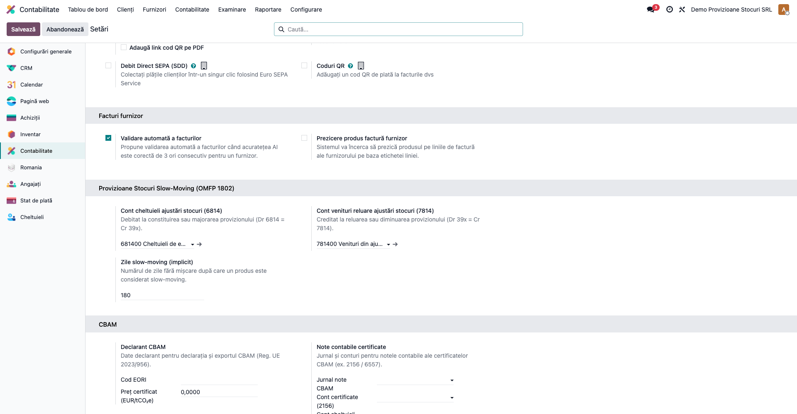
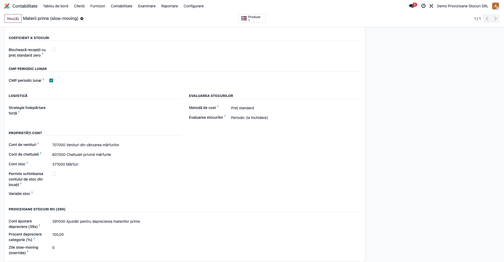
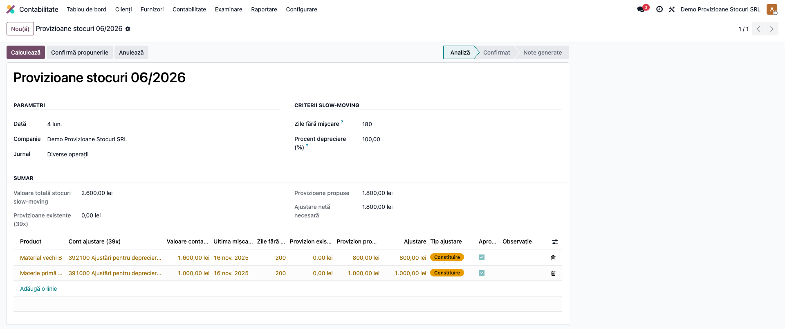
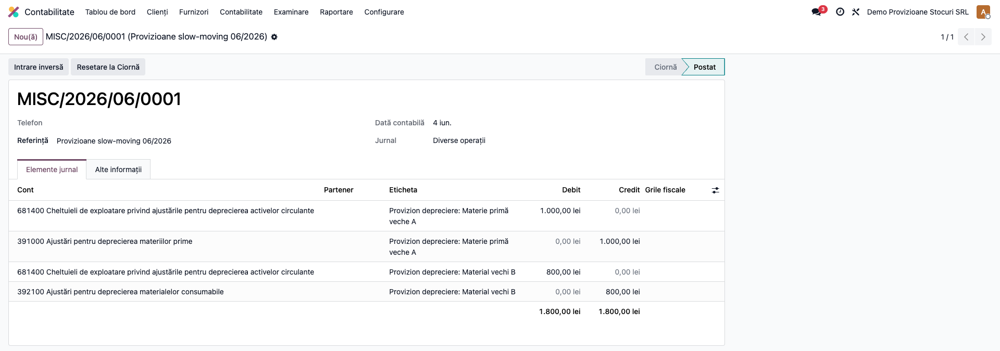
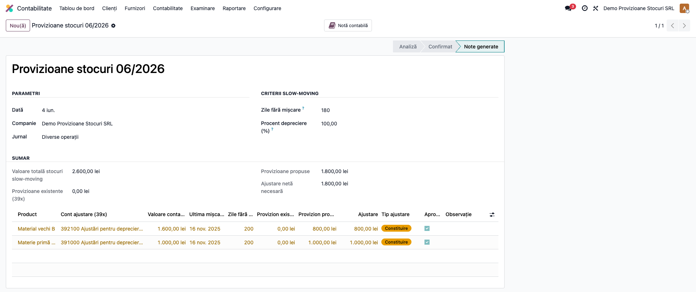

# Fișă Modul: Provizioane Stocuri Slow-Moving (39x)

**Poziție plan:** B1.4
**Modul:** `l10n_ro_stock_provision`
**FR:** FR-10
**Capitol manual:** Cap 6.4
**Utilizator principal:** Contabil stocuri, Contabil șef
**Prioritate:** 🟡 Medie (de regulă la închiderea de lună/an, pentru stocuri cu mișcare lentă)

---

## 1. Scop business

Stocurile fără mișcare o perioadă îndelungată (**slow-moving**) trebuie evaluate la valoarea
realizabilă netă; diferența față de valoarea contabilă se înregistrează ca **ajustare pentru
depreciere** în conturile din clasa **39x**. Modulul identifică automat aceste stocuri, propune
provizionul per produs (cu posibilitatea de a aproba/exclude fiecare linie) și generează nota
contabilă de constituire, majorare, diminuare sau reluare a provizionului.

Calculul compară provizionul **propus** (valoarea contabilă × procent depreciere) cu provizionul
**existent** (soldul contului 39x pentru produs) și înregistrează doar **diferența**.

## 2. Bază legală și context

OMFP 1802/2014 — Reglementările contabile privind situațiile financiare anuale — prevede evaluarea
stocurilor la închidere la cea mai mică valoare dintre cost și valoarea realizabilă netă, deprecierile
constituindu-se ca ajustări (provizioane) pe conturile din grupa **39x**. Cheltuiala/venitul aferent
se reflectă în **6814** „Cheltuieli privind ajustările pentru deprecierea activelor circulante",
respectiv **7814** „Venituri din ajustări pentru deprecierea activelor circulante".

## 3. Utilizatori și roluri

Contabil stocuri / Contabil șef.

Roluri recomandate pentru testare:
- **Administrator funcțional** (Settings) — instalează modulul, configurează conturile 6814/7814 și
  conturile 39x pe categorii.
- **Contabil / Manager contabilitate** (grupul „Consilier / Adviser") — rulează analiza, revizuiește
  propunerile, confirmă și generează nota (meniul cere `account.group_account_manager`).

## 4. Conturi și date implicate

- **6814** „Cheltuieli privind ajustările pentru deprecierea activelor circulante" — debitat la
  constituire/majorare.
- **7814** „Venituri din ajustări pentru deprecierea activelor circulante" — creditat la diminuare/reluare.
- **39x** — contul de ajustare per categorie de produs: **391** (materii prime), **392** (materiale
  consumabile), **394** (produse finite), **397** (mărfuri).

Monografia:
- **Constituire / Majorare**: **Dr 6814 = Cr 39x** (cu valoarea ajustării);
- **Diminuare / Reluare**: **Dr 39x = Cr 7814** (cu valoarea ajustării).

Date minime pentru demo:
- companie românească cu plan de conturi RO;
- conturile 6814 și 7814 selectate în setări;
- cel puțin o categorie de produs cu cont 39x configurat;
- produse stocabile cu cost (preț standard) > 0 și stoc în locații interne, fără mișcare de N zile.

> Sursa de date: dacă este instalat `deltatech_stock_valuation`, modulul folosește istoricul valoric
> lunar (`product.valuation.history`); altfel cade pe `stock.quant` și data ultimei intrări
> (`l10n_ro_last_in_date` din `l10n_ro_stock_age_report`).

## 5. Configurare inițială

1. Instalați modulul `l10n_ro_stock_provision` (dependențe: `stock`, `account`, `l10n_ro_stock_age_report`).
2. **Contabilitate → Configurare → Setări → secțiunea „Provizioane Stocuri Slow-Moving (OMFP 1802)"**:
   selectați **Contul de cheltuieli 6814**, **Contul de venituri 7814** și **Zilele slow-moving
   implicite** (180 implicit, folosit de cron).
3. **Inventar → Configurare → Categorii de produse** → pe fiecare categorie relevantă completați, în
   secțiunea „Provizioane Stocuri RO (39x)": **Contul de ajustare 39x**, opțional **Procentul de
   depreciere** și **Zilele slow-moving** specifice categoriei (suprascriu valorile globale).
   Categoriile fără cont 39x sunt ignorate de analiză.

## 6. Flux de utilizare

### Pasul 1 — Configurarea conturilor pe companie

**Contabilitate → Configurare → Setări**, secțiunea „Provizioane Stocuri Slow-Moving". Stabiliți
conturile 6814/7814 și pragul implicit de zile.



### Pasul 2 — Contul 39x pe categoria de produs

**Inventar → Configurare → Categorii de produse** → deschideți categoria. În secțiunea „Provizioane
Stocuri RO (39x)" alegeți contul de ajustare (ex. 391) și, opțional, procentul de depreciere.



### Pasul 3 — Crearea analizei și calculul propunerilor

**Contabilitate → Închidere → Provizioane Stocuri (39x) → Nou**. Completați data analizei, jurnalul,
**Zilele fără mișcare** și **Procentul de depreciere**, apoi apăsați **„Calculează"**.

Sistemul listează produsele din locații interne, cu stoc > 0, fără mișcare de N zile, și calculează
per linie: cantitate, valoare contabilă, ultima mișcare, zile fără mișcare, provizion existent,
provizion propus, **ajustare** și **tipul** (Constituire / Majorare / Diminuare / Reluare / Fără
ajustare). Fiecare linie are bifa **„Aprobat"** (debifați-le pe cele de exclus).



### Pasul 4 — Confirmare și generarea notei

Apăsați **„Confirmă propunerile"** (trebuie să existe cel puțin o linie aprobată cu ajustare ≠ 0),
apoi **„Generează Note Contabile"**. Se postează o singură notă în jurnalul ales, cu liniile:
**Dr 6814 = Cr 39x** (constituire/majorare) și/sau **Dr 39x = Cr 7814** (diminuare/reluare), per produs.



### Pasul 5 — Analiza postată și evidența

După generare, analiza trece în starea **Note generate**, iar butonul inteligent **„Notă contabilă"**
deschide nota. Lista **Contabilitate → Închidere → Provizioane Stocuri (39x)** arată toate analizele,
cu valoarea stocurilor, ajustarea totală și starea (**Analiză / Confirmat / Note generate / Anulat**).



### Note de monografie și raportare

- Constituire/Majorare provizion: **Dr 6814 = Cr 39x** cu valoarea ajustării (propus − existent);
- Diminuare/Reluare: **Dr 39x = Cr 7814** cu valoarea ajustării (existent − propus / total la reluare);
- nota este echilibrată (Σ Debit = Σ Credit) și legată de analiză prin câmpul „Notă contabilă";
- operațiunea mișcă doar conturi de clasă 3/6/7 — **nu afectează TVA** și nu intră în D300/D394;
- ajustările pentru deprecierea stocurilor sunt, de regulă, **nedeductibile fiscal** (nu figurează între
  provizioanele/ajustările deductibile la art. 26 din Legea 227/2015 — Codul fiscal; de confirmat cu
  consultantul fiscal) — de urmărit în registrul de evidență fiscală la calculul impozitului pe profit.

## 7. Legături cu alte module / declarații

| Modul / proces | Rol în flux | Tip legătură |
|---|---|---|
| `stock` | stocul pe locații interne (`stock.quant`) | dependență (manifest) |
| `account` | nota de ajustare și liniile contabile | dependență (manifest) |
| `l10n_ro_stock_age_report` | data ultimei intrări per quant (`l10n_ro_last_in_date`) pentru pragul slow-moving | dependență (manifest) |
| `deltatech_stock_valuation` | dacă e instalat, sursa de date devine `product.valuation.history` (valori contabile exacte) | opțional (detectat la runtime) |
| `l10n_ro_period_close_enhanced` | checklist de închidere — rulați analiza înainte de închiderea perioadei | secvențiere recomandată |

Ce este automat: identificarea stocurilor slow-moving, propunerea provizionului, calculul tipului de
ajustare și generarea notei contabile.
Ce rămâne manual: configurarea conturilor și a categoriilor, revizuirea/aprobarea liniilor, confirmarea
și postarea (inclusiv când analiza e generată automat de cron).

## 8. Verificări pentru consultant

- [ ] Modulul se instalează fără erori pe baza demo.
- [ ] Conturile 6814/7814 și zilele slow-moving apar în Setări contabilitate.
- [ ] Categoriile au cont 39x configurat; cele fără cont sunt ignorate de analiză.
- [ ] „Calculează" listează produsele slow-moving cu valori și tip de ajustare corecte.
- [ ] Produsele cu mișcare recentă (sub pragul de zile) NU apar în analiză.
- [ ] Confirmarea fără linii aprobate cu ajustare este blocată cu mesaj clar.
- [ ] Nota generată este postată, echilibrată (Dr 6814 = Cr 39x / Dr 39x = Cr 7814).
- [ ] Lista analizelor reflectă corect starea „Note generate" și totalurile.

## 9. Mesaje de eroare frecvente

| Mesaj / simptom | Cauză probabilă | Remediere |
|-----------------|-----------------|-----------|
| „Puteți recalcula doar o analiză în stare Analiză." | „Calculează" apăsat după confirmare | Resetați/creați o analiză nouă pentru recalcul |
| „Nu există linii aprobate cu ajustări de efectuat." | Toate liniile sunt debifate sau au tip „Fără ajustare" | Bifați cel puțin o linie cu ajustare reală |
| „Configurați conturile 6814 și 7814 în Setări → Contabilitate → … → Provizioane Stocuri." | Conturile de cheltuieli/venituri nu sunt setate | Selectați conturile 6814 și 7814 în Setări |
| „Nota contabilă este postată. Stornați mai întâi nota înainte de anulare." | Anulare cerută pe o analiză cu notă postată | Stornați nota contabilă, apoi anulați analiza |
| Produs slow-moving lipsă din analiză | Categoria produsului nu are cont 39x, sau valoarea de stoc este 0 | Configurați contul 39x pe categorie; verificați costul și stocul |

## 10. Capturi de ecran

Capturile (`readme/screenshots/`) sunt **generate automat** din `tests/test_screenshots.py`
(mixinul `ScreenshotCase` din `l10n_ro_doc_screenshots`, import defensiv), în **limba română**,
pe planul de conturi RO (`setup_country("ro")`):

1. `01_setari_companie.png` — Setări contabilitate cu conturile 6814/7814 și zilele slow-moving.
2. `02_categorie_produs.png` — categorie de produs cu cont 39x și procent de depreciere.
3. `03_analiza_propuneri.png` — analiza de provizioane după calcul, cu propunerile per produs.
4. `04_nota_contabila.png` — nota contabilă generată (Dr 6814 / Cr 39x).
5. `05_analiza_postata.png` — analiza în starea „Note generate", cu butonul către notă.

Regenerare:

```bash
./odoo/odoo-bin -c odoo.conf -d <db> -i l10n_ro_stock_provision,l10n_ro_doc_screenshots \
    --test-tags=fise_screenshots --stop-after-init
```

## 11. Observații pentru manual

În manualul final, păstrați explicația orientată pe activitatea utilizatorului: ce înseamnă stoc
slow-moving, când se rulează analiza (la închiderea lunii/anului), ce date trebuie pregătite (conturi
6814/7814, conturi 39x pe categorii, prag de zile) și cum se verifică rezultatul (propunerile, nota
Dr 6814 = Cr 39x sau Dr 39x = Cr 7814). Subliniați că modulul înregistrează **doar diferența** față de
provizionul existent (constituire/majorare/diminuare/reluare) și că ajustările pentru deprecierea
stocurilor sunt în general nedeductibile fiscal (art. 26 Cod fiscal) — de corelat cu registrul de
evidență fiscală și de confirmat cu consultantul fiscal.
