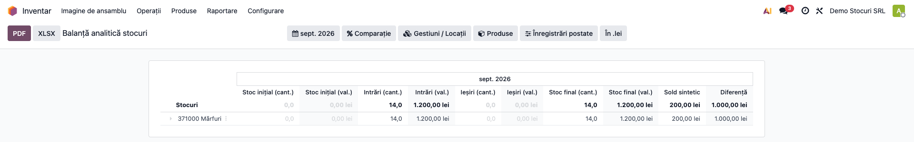
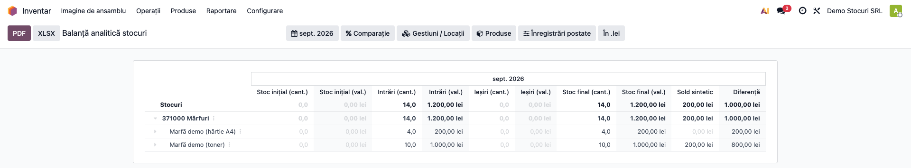
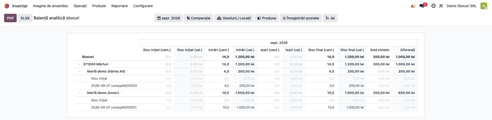
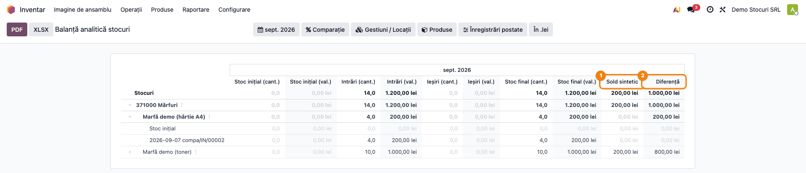
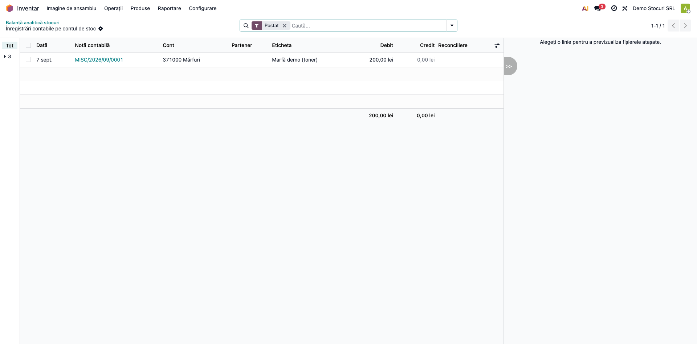
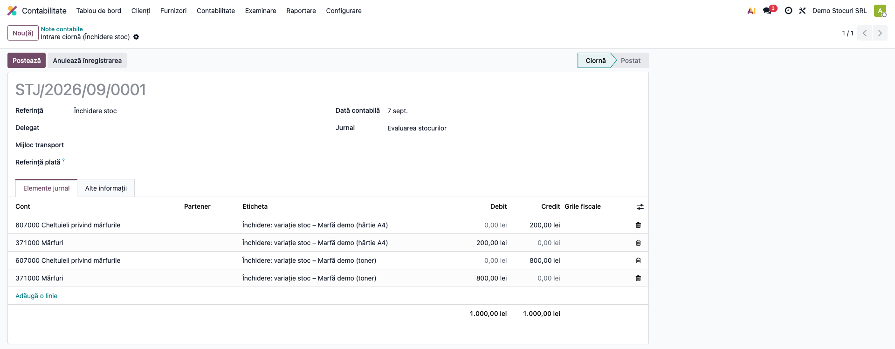
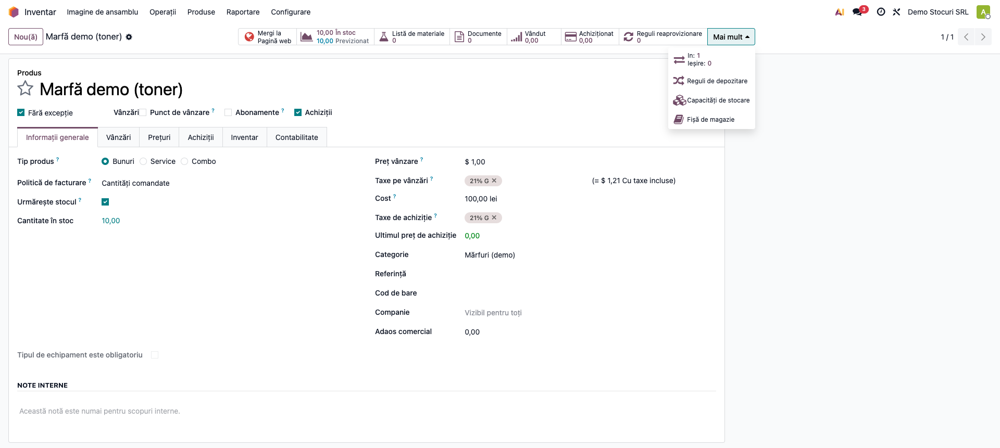
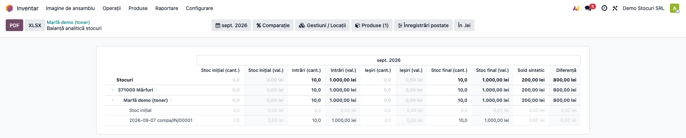

# Fișă Modul: Fișa de Magazie și Balanța Analitică a Stocurilor (RO)

**Modul:** `l10n_ro_stock_sheet`
**Utilizator principal:** Contabil stocuri / gestiune, Contabil-șef
**Prioritate:** 🔴 Ridicată (control obligatoriu al stocurilor, concordanță analitic-sintetic)

---

## 1. Scop business

Modulul oferă, ca **raport Enterprise** (`account.report`), două documente de evidență a
stocurilor cerute în România: **Fișa de magazie (cod 14-3-8)** — evidența document-cu-document a
intrărilor/ieșirilor și a stocului — și **Balanța analitică a stocurilor** (cantitativ-valorică).
În plus, raportul **reconciliază valoarea analitică a stocului (din mișcări) cu soldul contabil**
(din conturile de clasa 3), **pe fiecare material**, și permite generarea unei note de
regularizare. Este alternativa nativă Odoo 19 (pe `stock.move.value`), fără stack-ul OCA de
valorizare.

## 2. Bază legală și context

- **Fișa de magazie** — cod 14-3-8, OMFP 2634/2015 (documente financiar-contabile).
- **Balanța analitică a stocurilor** — concordanța analitic ↔ sintetic, Legea contabilității
  82/1991 + OMFP 2634/2015.
- **Evaluarea stocurilor** (CMP/FIFO/standard) — OMFP 1802/2014.
- Formatul tipizat nu mai este obligatoriu (OMFP 2634/2015); obligatoriu rămâne **conținutul minim**.

## 3. Utilizatori și roluri

Contabil stocuri, gestionar (consultare), contabil-șef (verificare concordanță).

Roluri recomandate pentru testare:
- Administrator funcțional: instalează modulul și verifică meniul din Inventar.
- Utilizator operațional: rulează raportul lunar, filtrează pe gestiune/produs.
- Contabil-șef: verifică reconcilierea analitic-sintetic și generează regularizarea.

## 4. Conturi și date implicate

- **Conturi de stoc (clasa 3):** 371 (mărfuri), 301 (materii prime), 302 (materiale),
  303 (obiecte de inventar), 345 (produse finite), 381 (ambalaje).
- **Conturi de variație** (la regularizare): 607/601/602/603 (achiziție), **711** (producție),
  608 (ambalaje); opțional 378/348 (diferențe de preț).
- Date minime pentru demo:
  - companie românească cu plan de conturi RO și valorizare configurată pe categorii;
  - cont de valorizare pe categoria de produs (`property_stock_valuation_account_id`);
  - mișcări de stoc (recepții/livrări) postate, eventual o factură furnizor la alt preț.

## 5. Configurare inițială

1. Instalați modulul `l10n_ro_stock_sheet` pe baza demo (necesită Enterprise — `account_reports`).
2. Pe **categoriile de produs**, setați contul de stoc (clasa 3) în **„Cont Evaluare Stoc"**
   (`property_stock_valuation_account_id`).
3. Pentru regularizare, setați pe fiecare cont de stoc câmpul **„Cont variație"**
   (`account_stock_variation_id`): 371→607, 301→601, 302→602, 303→603, 345/341/331→711.
   **Atenție:** dacă nu e setat nici acest câmp, nici contul de cheltuieli implicit al
   companiei, contul respectiv este **sărit în silențiu** la închidere — nu apare nicio
   eroare, doar lipsesc liniile.
4. Pregătiți un set de mișcări postate (recepții, livrări) în perioada de test.
5. Verificați că utilizatorul are acces la meniul **Inventar → Raportare** (raportul acestui
   modul) și, pentru generarea notei de regularizare, la **Contabilitate → Examinare**
   (grupul `account.group_account_readonly`).

## 6. Flux de utilizare

### Pasul 1 — Deschiderea raportului (defalcare pe conturi)

Accesați **Inventar → Raportare → Balanță analitică stocuri**. Raportul se deschide pe
luna curentă și afișează, implicit, **defalcarea pe conturile de stoc** (371, 303 etc.), cu
Stoc inițial / Intrări / Ieșiri / Stoc final (cantitativ și valoric) și coloanele de reconciliere.



### Pasul 2 — Balanța analitică pe material (drill cont → produse)

Desfășurați un cont (ex. 371 Mărfuri) pentru a vedea **balanța pe fiecare produs**:
cantități și valori Si/Intrări/Ieșiri/Sf. Liniile fără produs apar grupat la „Fără produs".



### Pasul 3 — Fișa de magazie (drill produs → documente)

Desfășurați un produs pentru a obține **Fișa de magazie (14-3-8)**: linia „Stoc inițial", apoi
fiecare mișcare (dată + document), cu **stocul curent cumulat**.



### Pasul 4 — Reconcilierea analitic ↔ sintetic

Pe linia de cont și de produs, coloanele **„Sold sintetic"** (din `account.move.line`) și
**„Diferență"** (= valoare de inventar − sold sintetic) arată unde și cu cât **nu coincide**
evidența cantitativă cu contabilitatea — pe fiecare material (prinde compensările pe care raportul
global nu le vede).



### Pasul 5 — Auditul înregistrărilor (caret „Înregistrări contabile")

Pe orice linie de cont/produs, din caretul ▸ alegeți **„Înregistrări contabile"** pentru a
deschide exact liniile contabile (`account.move.line`) din care e calculat soldul sintetic.



### Pasul 6 — Generarea notei de regularizare (per material)

Regularizarea de valoare **nu se generează din raportul acestui modul**, ci din raportul nativ
de evaluare: **Contabilitate → Examinare → Inventar → Evaluare stoc**, butonul
**„Generează înregistrare"**. Modulul nostru intervine acolo prin override-ul RO **per
material** (`res.company._get_stock_valuation_account_vals`), deci rezultatul este o **notă
contabilă ciornă** cu **linii pe fiecare produs**, totalizate identic pe cont cu nativul —
pentru verificare și postare manuală. Nota primește referința **„Închidere stoc"**
(`ref`, în limba utilizatorului care o generează).



**Note de monografie și raportare** (regularizarea de valoare, inventar intermitent):
- Creștere de valoare: `Dr 3xx (stoc) = Cr 60x/711`.
- Scădere de valoare: `Dr 60x/711 = Cr 3xx (stoc)`.
- Stocuri achiziționate → 607/601/602/603; **producție proprie → 711**.
- Reconcilierea este **instrument de verificare** — nu postează automat; nota se generează la cerere.

**Periodicitatea închiderii** se configurează în **Contabilitate → Configurare → Setări →
„Evaluare stoc"**, câmpul **„Periodic Valuation"** (`inventory_period`):

| Valoare | Comportament |
|---|---|
| **Manual** | închiderea se face numai din buton; cronul nu face nimic |
| **Zilnic** | cronul „Stock Account: Inventory Valuation Closing" închide și **postează automat** în fiecare zi |
| **Lunar** | același cron închide și postează automat **doar în ultima zi calendaristică a lunii** |

Pentru închiderea lunară de stocuri în România recomandăm **Manual** sau **Lunar cu
verificare**: nota generată automat este **postată direct** (`auto_post=True`), fără pasul de
control pe material. Închiderea refuză o dată anterioară unei închideri deja postate
(„Există înregistrări de închidere după data selectată…"); istoricul închiderilor e ținut în
`ir.config_parameter` (`<company_id>.stock_valuation_closing_ids`) și e **plafonat la
ultimele 10** — nu vă bazați pe el ca registru de audit.

### Pasul 7 — Filtre și acces din produs

Folosiți filtrele de **perioadă**, **gestiuni/locații** și **produse** din bara raportului. Pe
fișa produsului, butonul **„Fișă de magazie"** deschide raportul pre-filtrat pe acel produs.



### Pasul 8 — Raportul deschis, filtrat pe produsul selectat

După apăsarea butonului, raportul se deschide **pre-filtrat pe produsul respectiv** (filtrul
„Produse (1)" activ) și **desfășurat**: contul de stoc → produsul → documentele (fișa de magazie),
cu reconcilierea analitic ↔ sintetic limitată strict la acel material.



## 7. Legături cu alte module / declarații

| Modul | Rol |
|---|---|
| `stock_account` (nativ) | valorizarea pe `stock.move.value`; raportul „Evaluare stoc" + închiderea de stoc (regularizare globală pe cont) |
| `stock_accountant` (Enterprise) | meniul **Contabilitate → Examinare → Inventar → Evaluare stoc** și setările de evaluare/periodicitate |
| `l10n_ro_inventory_closing` | inventarierea fizică (diferențe cantitative: 6588/4282-7588/6583) |
| `l10n_ro_stock_cmp_periodic` | nota de corecție CMP perpetuu vs. periodic |
| `l10n_ro_stock_k_coefficient` | coeficient K, diferențe de preț (348/378) |
| `l10n_ro_stock_picking_report` | NIR / bon de consum / bon de transfer / aviz |

**Ce e automat:** raportul, defalcarea pe cont/produs/document, reconcilierea pe material, butonul
de regularizare. **Ce rămâne manual:** setarea conturilor de variație pe conturile de stoc;
postarea/aprobarea notei de regularizare; corectarea erorilor de valorizare la nivel de mișcare.

## 8. Verificări pentru consultant

- [ ] Raportul se deschide din **Inventar → Raportare** și afișează conturile de stoc.
- [ ] Desfășurarea unui cont arată produsele (balanța analitică).
- [ ] Desfășurarea unui produs arată documentele cu **stoc curent** (fișa de magazie).
- [ ] Coloanele „Sold sintetic" și „Diferență" sunt populate pe cont și pe produs.
- [ ] Caretul „Înregistrări contabile" deschide `account.move.line` filtrate pe cont/produs.
- [ ] Butonul „Generează înregistrare" (Contabilitate → Examinare → Inventar → Evaluare stoc)
      produce o notă cu linii **pe material**, cu referința „Închidere stoc".
- [ ] După postarea regularizării (la o dată ≤ azi), diferența pe material → 0.
- [ ] Butonul „Fișă de magazie" de pe produs deschide raportul pre-filtrat.

## 9. Mesaje de eroare frecvente

| Mesaj | Cauză | Remediere |
|---|---|---|
| „Vă rugăm să setați Contul de evaluare pentru Evaluarea stocurilor în setări." (`Please set the Valuation Account for Inventory Valuation in the settings.`) | Lipsește **contul de evaluare pe companie** (`account_stock_valuation_id`), din Setări → Evaluare stoc | Setați un cont de clasa 3 (ex. 371) în setările companiei |
| „Vă rugăm să setați Jurnalul pentru Evaluarea Stocurilor în setări." | Lipsește jurnalul de stoc pe companie (`account_stock_journal_id`) | Setați un jurnal de tip Diverse în setările companiei |
| „Totul este închis corect" (`Everything is correctly closed`) | Nu există diferență de valoare pe conturile de stoc (deja reconciliat) | Normal — nu e nimic de regularizat |
| „Există înregistrări de închidere după data selectată. Anulați-le înainte să generați o înregistrare anterioară acestora" | Cereți o închidere la o dată anterioară unei închideri deja postate | Anulați închiderea ulterioară sau alegeți o dată mai recentă |
| **Niciun mesaj, dar lipsesc liniile pe un cont** | Contul de stoc nu are „Cont variație" și nici companiile nu au cont de cheltuieli implicit → contul e sărit **în silențiu** | Setați `account_stock_variation_id` pe fiecare cont de clasa 3 |
| Diferența rămâne după postare | Nota a fost postată cu **dată viitoare** (rămâne ciornă) sau există aml fără produs | Postați la o dată ≤ azi; verificați liniile „Fără produs"; corectați valorizarea mișcărilor |
| Nota de închidere iese pe altă companie | Raportul de evaluare lucrează pe `env.company` (compania activă), nu pe selecția multiplă | Comutați pe compania dorită înainte de a genera nota |

## 10. Capturi de ecran

Capturile din `readme/screenshots/` se obțin din `tests/test_screenshots.py` (mixinul
`ScreenshotCase` din `l10n_ro_doc_screenshots`, HttpCase + Playwright, import defensiv), pe
companie RO, cu plan de conturi RO.

Toate capturile există în `readme/screenshots/` (în ordinea fluxului):
1. `01_balanta_conturi.png` — raportul, defalcare pe conturi + coloanele Sold sintetic / Diferență
2. `02_drill_produse.png` — cont (371000 Mărfuri) desfășurat pe produse
3. `03_fisa_magazie_documente.png` — raport desfășurat complet: cont → produse → documente
4. `04_reconciliere.png` — coloanele Sold sintetic vs. Diferență, evidențiate
5. `05_caret_aml.png` — caret „Înregistrări contabile" → lista `account.move.line`
6. `06_nota_regularizare.png` — nota de regularizare („Închidere stoc"), ciornă
7. `07_buton_produs.png` — butonul „Fișă de magazie" pe fișa produsului
8. `08_fisa_produs_filtrata.png` — raportul deschis din buton, pre-filtrat pe produs (desfășurat)

**Toate cele 8 capturi** se regenerează din `tests/test_screenshots.py` (tag
`fise_screenshots`), inclusiv desfășurările, caretul și nota de regularizare. Testul seedează
două materiale recepționate fără factură (deci fără sold sintetic) plus o recepție înregistrată
doar contabil, ca reconcilierea să aibă diferențe reale de arătat.

Regenerare:
```
./odoo/odoo-bin -c odoo.conf -d test19 -u l10n_ro_stock_sheet \
    --test-tags=fise_screenshots --stop-after-init
```

## 11. Observații pentru manual

- Subliniați **diferența față de raportul nativ** „Evaluare stoc": acesta lucrează **global
  pe cont**; `l10n_ro_stock_sheet` verifică **pe fiecare material** (prinde compensările).
- Reconcilierea e **verificare**, nu postare; regularizarea de valoare se postează la cerere, iar
  corecțiile RO specifice (CMP, diferențe de preț) se fac cu modulele dedicate.
- Regula de aur: **închideți/regularizați la o dată ≤ azi** și **vizualizați raportul la aceeași
  dată** — altfel apar diferențe de sincronizare.
- La cost mediu/FIFO, `Stoc inițial + Intrări − Ieșiri ≠ Stoc final` în valoare (firesc — costul
  se schimbă); reconcilierea se face pe valoarea de inventar (`Stoc final`).
