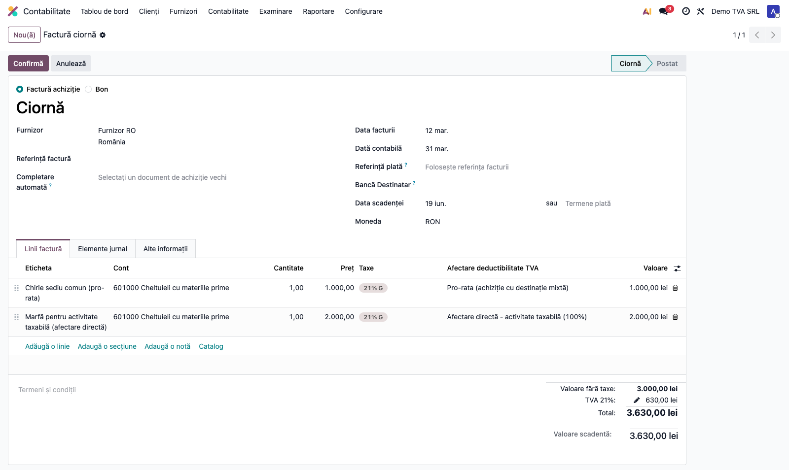
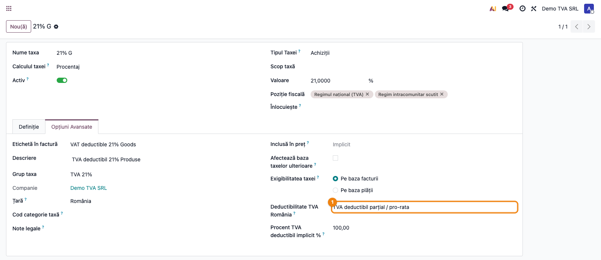
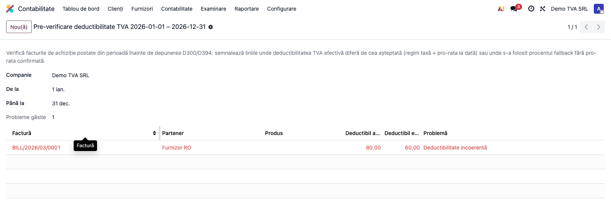

# Fișă Modul: TVA deductibil integral / parțial / nedeductibil

**Poziție plan:** C10
**Modul:** `l10n_ro_vat_deductibility`
**FR:** FR-55
**Capitol manual:** Cap 12.8
**Utilizator principal:** Contabil TVA, Contabil furnizori
**Prioritate:** Ridicată

---

## 1. Scop business

Modulul gestionează explicit deductibilitatea TVA pe achiziții:

- TVA deductibil integral;
- TVA parțial deductibil prin procent/pro-rata;
- TVA nedeductibil.

Scopul consultantului este să poată explica utilizatorului de ce aceeași cotă TVA poate avea efecte contabile diferite și cum se reflectă partea deductibilă în 4426, jurnal TVA, D300 și D394.

## 2. Bază legală și context

În România, dreptul de deducere depinde de natura achiziției și de regimul fiscal al contribuabilului. Pentru companiile cu activitate mixtă, procentul de deducere poate fi determinat prin pro-rata, conform Codului Fiscal art. 300. Pentru cheltuieli sau bunuri nedeductibile, TVA nu trebuie raportată ca TVA deductibilă.

Pro-rata se aplică la achizițiile comune folosite atât pentru operațiuni cu drept de deducere, cât și pentru operațiuni scutite fără drept de deducere. Dacă utilizarea poate fi separată clar prin evidență analitică, se folosește afectarea directă: 100% deductibil pentru activitatea taxabilă și 0% deductibil pentru activitatea scutită. Pro-rata rămâne mecanismul pentru cheltuielile comune care nu pot fi alocate direct.

În cursul anului se folosește pro-rata provizorie, de regulă pe baza procentului definitiv din anul anterior. La finalul exercițiului se calculează pro-rata definitivă și diferențele se regularizează în ultimul decont D300 al anului.

Modulul enterprise extinde baza OCA `l10n_ro_nondeductible_vat`, care generează liniile dinamice pentru partea nedeductibilă. Diferența enterprise este configurarea unificată pe taxă, pro-rata pe perioadă și acceptarea procentelor 0-100 pentru companiile RO.

## 3. Utilizatori și roluri

- Contabil TVA: configurează taxele și pro-rata.
- Contabil furnizori: selectează taxa corectă pe factura de achiziție.
- Contabil șef: validează procentul de pro-rata și conturile nedeductibile.
- Auditor/consultant: verifică trasabilitatea între factură, note contabile și declarații.

## 4. Date implicate

- taxe de cumpărare cu regim de deductibilitate;
- procent de pro-rata pe perioadă fiscală;
- tip pro-rata: provizorie sau definitivă;
- facturi furnizor și linii de factură;
- conturi 4426 și conturi de cheltuială/cost pentru partea nedeductibilă;
- linii dinamice generate de `l10n_ro_nondeductible_vat`;
- jurnal TVA, D300, D394 și rapoarte de reconciliere.

## 5. Configurare inițială

1. Instalați `l10n_ro_vat_deductibility` peste `l10n_ro_nondeductible_vat`.
2. Verificați taxele RO existente:
   - taxe standard integral deductibile;
   - taxe statice 50% nedeductibile din `l10n_ro`;
   - taxe care vor folosi pro-rata.
3. Pe taxă, setați regimul:
   - `full` pentru deductibil integral;
   - `partial` pentru pro-rata;
   - `none` pentru nedeductibil.
4. Configurați procentul implicit deductibil sau pro-rata pe perioada fiscală.
5. Marcați pro-rata ca provizorie sau definitivă, după momentul fiscal al perioadei.
6. Configurați contul pentru partea nedeductibilă, de exemplu 635 (sau un analitic intern al politicii contabile, ex. 6352).
7. Verificați că perioada de pro-rata este confirmată înainte de înregistrarea facturilor.

## 6. Flux de utilizare

### Pasul 1 — Accesare

Meniuri folosite:
- pro-rata: **Contabilitate → Configurare → Configurare TVA deductibil → TVA pro-rata**;
- taxe: **Contabilitate → Configurare → Taxe** (regimul de deductibilitate este pe fila „Opțiuni avansate" a taxei).

1. Contabilul introduce factura furnizor.
2. Pe linia de factură se selectează taxa cu regimul fiscal corect.
3. Pe coloana **Afectare deductibilitate TVA** a liniei, contabilul alege cum se determină deductibilitatea acelei achiziții (vezi mai jos): pro-rata pentru achiziții comune sau afectare directă (100% / 0%) pentru achiziții atribuibile direct unei activități.
4. Modulul setează procentul efectiv de deductibilitate.
5. La postare, partea deductibilă rămâne în 4426.
6. Partea nedeductibilă este transferată în contul configurat, prin mecanismul OCA.
7. Consultantul verifică efectul în notă contabilă, jurnal TVA și declarații.
8. Dacă pro-rata se modifică pentru o perioadă ulterioară, facturile noi folosesc procentul perioadei lor, fără recalcul retroactiv automat al perioadelor închise. Liniile cu afectare directă nu sunt afectate de modificarea pro-ratei.
9. La finalul anului, contabilul compară pro-rata provizorie cu pro-rata definitivă și înregistrează regularizarea în D300 al ultimei perioade.

### Pasul 2 — Afectare directă vs pro-rata pe linia facturii

Pe fiecare linie de achiziție RO apare coloana **Afectare deductibilitate TVA**, cu trei opțiuni:

- **Pro-rata (achiziție cu destinație mixtă)** — implicit; linia urmează coeficientul pro-rata confirmat al perioadei (achiziții comune, neatribuibile direct).
- **Afectare directă - activitate taxabilă (100%)** — TVA rămâne 100% deductibilă, **indiferent** de pro-rata perioadei.
- **Afectare directă - activitate scutită (0%)** — TVA este 0% deductibilă, **indiferent** de pro-rata.

Mecanismul permite ca **aceeași taxă** configurată în regim `partial` (pro-rata implicită) să fie folosită și pentru achiziții comune, și pentru achiziții atribuibile direct: liniile direct atribuibile se marchează individual, primesc procent fix și sunt **excluse** din recalculul pro-rata și din pre-verificarea D300/D394.

În exemplul de mai jos, ambele linii folosesc aceeași taxă TVA 21% în regim pro-rata 60%: chiria comună rămâne la 60% (pro-rata), iar marfa pentru activitatea taxabilă este afectată direct la 100%.



## 7. Exemple contabile

### TVA integral deductibil

Factură servicii 1.000 + TVA 210:

```text
Dr 628     1.000
Dr 4426      210
    Cr 401     1.210
```

### TVA parțial deductibil, pro-rata 60%

Factură servicii 1.000 + TVA 210:

```text
Dr 628     1.000
Dr 4426      126   TVA deductibilă
Dr 635       84    TVA nedeductibilă
    Cr 401     1.210
```

### TVA nedeductibil

Factură servicii 1.000 + TVA 210:

```text
Dr 628     1.000
Dr 635       210   TVA nedeductibilă
    Cr 401     1.210
```

Pentru stocuri și imobilizări, politica trebuie decisă explicit: partea nedeductibilă poate fi dusă în cheltuială sau poate majora costul bunului, în funcție de natura achiziției și de implementarea fazei de cost.

## 8. Impact în rapoarte

| Raport | Așteptare |
|---|---|
| Jurnal cumpărări | evidențiază TVA totală, deductibilă și nedeductibilă |
| D300 | include la deducere doar partea deductibilă |
| D394 | păstrează coerența documentului fără dublarea TVA nedeductibile |
| e-TVA | diferențele din pro-rata trebuie să poată fi explicate pe document |
| Audit | fiecare sumă nedeductibilă trebuie legată de factura și linia sursă |

## 9. Pro-rata provizorie, definitivă și afectare directă

Afectarea directă (art. 300 Cod fiscal — pro-rata doar pentru achiziții comune) se poate exprima în **două moduri complementare**:

- **la nivel de taxă** — regim `full` (100%) sau `none` (0%), când o taxă întreagă este dedicată unei singure activități;
- **la nivel de linie de factură** — coloana **Afectare deductibilitate TVA** (`direct taxabil` / `direct scutit`), când aceeași taxă în regim `partial` (pro-rata) este folosită și pentru achiziții comune, și pentru achiziții atribuibile direct. Linia marcată direct primește procent fix și este exclusă din recalculul/pre-verificarea pro-rata.

| Situație | Procedură consultant |
|---|---|
| O taxă dedicată exclusiv operațiunilor taxabile | folosiți taxă `full`, TVA 100% în 4426 |
| O taxă dedicată exclusiv operațiunilor scutite fără drept de deducere | folosiți taxă `none`, TVA 0% deductibilă |
| Achiziție atribuibilă direct, pe o taxă altfel folosită pentru achiziții comune | pe linie, alegeți **Afectare directă** (100% taxabil / 0% scutit) — pro-rata este ignorată pe acea linie |
| Achiziție comună fără alocare directă posibilă | lăsați linia pe **Pro-rata** și folosiți taxă `partial` cu pro-rata perioadei |
| Pro-rata provizorie în cursul anului | configurați procentul estimat/precedent și marcați perioada ca provizorie |
| Pro-rata definitivă la sfârșit de an | calculați procentul pe datele reale și înregistrați regularizarea în ultimul D300 |

## 10. Legături cu alte module / declarații

| Modul / declarație | Rol în flux |
|---|---|
| `l10n_ro_nondeductible_vat` | bază OCA pentru linii dinamice și partea nedeductibilă |
| `l10n_ro_anaf_d394` (Tax Purchase Report) | jurnal cumpărări cu separare TVA deductibilă/nedeductibilă |
| `l10n_ro_anaf_d300` | trebuie să includă la deducere doar TVA deductibilă |
| `l10n_ro_anaf_d394` | trebuie să păstreze coerența documentului fără dublare |
| `l10n_ro_anaf_d318` | referință pentru pro-rata în rambursarea TVA UE |
| `stock_account` / stocuri | necesar când TVA nedeductibilă trebuie să majoreze costul stocului |
| `account_asset` / imobilizări | necesar când TVA nedeductibilă trebuie să majoreze valoarea activului |

Ce este automat: aplicarea procentului pe factura furnizor și generarea liniilor nedeductibile.
Ce rămâne gap: politica completă pentru includerea TVA nedeductibile în costul stocurilor/imobilizărilor și raportarea extinsă în toate declarațiile.

## 11. Scenarii de test pentru consultant

| ID | Scenariu | Rezultat așteptat |
|---|---|---|
| VATD-01 | Servicii cu TVA 100% deductibil | toată TVA este în 4426 |
| VATD-02 | Servicii cu pro-rata 60% | 60% în 4426, 40% în cont nedeductibil |
| VATD-03 | Servicii 0% deductibil | 4426 nu primește TVA |
| VATD-04 | Factură cu două cote TVA | split corect pe fiecare cotă |
| VATD-05 | Storno factură parțial deductibilă | storno proporțional cu semne corecte |
| VATD-06 | Pro-rata lipsă pentru taxă partial | utilizatorul primește eroare/avertizare clară |
| VATD-07 | Perioade cu procente diferite | factura folosește procentul valabil la data ei |
| VATD-08 | Integrare D300/D394 | doar partea deductibilă ajunge în deducere |
| VATD-09 | Pro-rata definitivă diferită de cea provizorie | diferența este documentată pentru regularizarea D300 |
| VATD-10 | Linie marcată „Afectare directă - activitate taxabilă" pe o taxă pro-rata 60% | linia rămâne 100% deductibilă, neafectată de pro-rata |
| VATD-11 | Linie marcată „Afectare directă - activitate scutită" pe o taxă pro-rata 60% | linia este 0% deductibilă, neafectată de pro-rata |
| VATD-12 | Recalcul facturi draft / pre-verificare D300 cu linii directe | liniile cu afectare directă nu sunt modificate și nu sunt semnalate |

## 12. Verificări pentru consultant

- [ ] Taxa integral deductibilă păstrează TVA deductibilă 100%.
- [ ] Taxa parțială aplică procentul pro-rata al perioadei.
- [ ] Taxa nedeductibilă mută TVA în contul configurat.
- [ ] Liniile generate de OCA sunt clare și nu dublează totalul facturii.
- [ ] Jurnalul TVA, D300 și D394 pot fi reconciliate.
- [ ] Conturile nedeductibile sunt configurate înainte de testare.
- [ ] Pro-rata provizorie/definitivă este documentată pentru perioada testată.
- [ ] Achizițiile cu afectare directă nu sunt amestecate cu cheltuielile comune.
- [ ] Liniile marcate „Afectare directă" păstrează procentul fix (100%/0%) și nu sunt schimbate de recalculul pro-rata.
- [ ] Scenariile cu stocuri/imobilizări sunt marcate ca fază separată dacă includerea în cost nu este activă.

## 13. Mesaje de eroare frecvente

| Simptom | Cauză probabilă | Remediere |
|---|---|---|
| Procent greșit | Pro-rata perioadei lipsește sau nu este confirmată | Configurați și confirmați pro-rata |
| TVA raportată integral | Taxa este marcată `full` în loc de `partial`/`none` | Verificați regimul pe taxă |
| Factura nu postează | Cont nedeductibil lipsă | Configurați contul la taxă/companie |
| D300 prea mare pe deducere | TVA nedeductibilă a rămas în 4426 | Verificați liniile dinamice și tax tags |
| Stocul nu include TVA nedeductibilă | Faza de includere în cost nu este activă | Folosiți procedura contabilă sau extinderea de stoc |
| Pro-rata aplicată la achiziții alocabile direct | Configurare fiscală prea largă | Folosiți taxă integral deductibilă sau nedeductibilă, după destinația reală |

## 14. Capturi de ecran

Capturile (`readme/screenshots/`) sunt **generate automat** din `tests/test_screenshots.py`
(mixinul `ScreenshotCase` din `l10n_ro_doc_screenshots`, import defensiv), în **limba română**:

1. `01_prorata.png` — pro-rata pe perioadă (provizorie, confirmată).
2. `02_taxa_regim.png` — taxă de achiziție cu **regim de deductibilitate** (parțial / pro-rata).
3. `03_recompute.png` — wizardul **Recalcul facturi draft** după schimbarea pro-rata.
4. `04_precheck.png` — wizardul **Pre-verificare D300/D394**, cu o linie semnalată
   (deductibilitate efectivă 60% vs. așteptată 80% — pro-rata provizorie vs. definitivă).
5. `05_afectare_directa.png` — factură de achiziție cu **afectare directă vs pro-rata** pe linii:
   aceeași taxă pro-rata 60%, dar o linie comună (60%) și o linie atribuibilă direct (100%).






Regenerare:

```bash
./odoo/odoo-bin -c odoo.conf -d <db> -i l10n_ro_vat_deductibility,l10n_ro_doc_screenshots \
    --test-tags=fise_screenshots --stop-after-init
```
