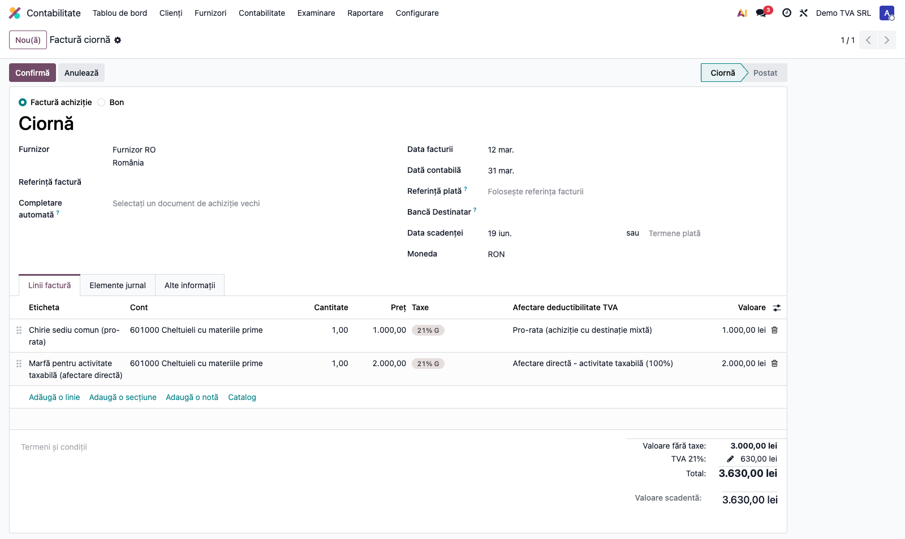
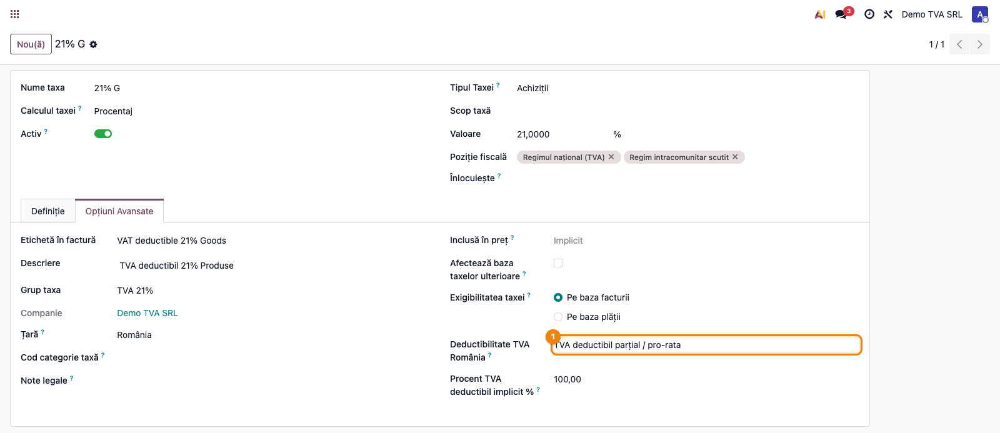
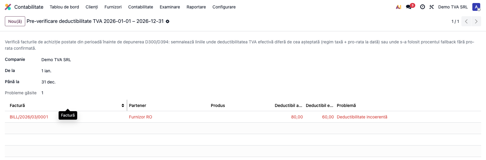

# Fișă Modul: TVA deductibil integral / parțial / nedeductibil

**Poziție plan:** C10
**Modul:** `l10n_ro_vat_deductibility`
**FR:** FR-55
**Capitol manual:** Cap 12.8
**Utilizator principal:** Contabil TVA, Contabil furnizori
**Prioritate:** Ridicată

---

## 1. Scop business

Modulul gestionează explicit deductibilitatea TVA pe achiziții:

- TVA deductibil integral;
- TVA parțial deductibil prin procent/pro-rata;
- TVA nedeductibil.

Scopul consultantului este să poată explica utilizatorului de ce aceeași cotă TVA poate avea efecte contabile diferite și cum se reflectă partea deductibilă în 4426, jurnal TVA, D300 și D394.

## 2. Bază legală și context

În România, dreptul de deducere depinde de natura achiziției și de regimul fiscal al contribuabilului. Pentru companiile cu activitate mixtă, procentul de deducere poate fi determinat prin pro-rata, conform Codului Fiscal art. 300. Pentru cheltuieli sau bunuri nedeductibile, TVA nu trebuie raportată ca TVA deductibilă.

Pro-rata se aplică la achizițiile comune folosite atât pentru operațiuni cu drept de deducere, cât și pentru operațiuni scutite fără drept de deducere. Dacă utilizarea poate fi separată clar prin evidență analitică, se folosește afectarea directă: 100% deductibil pentru activitatea taxabilă și 0% deductibil pentru activitatea scutită. Pro-rata rămâne mecanismul pentru cheltuielile comune care nu pot fi alocate direct.

În cursul anului se folosește pro-rata provizorie, de regulă pe baza procentului definitiv din anul anterior. La finalul exercițiului se calculează pro-rata definitivă și diferențele se regularizează în ultimul decont D300 al anului.

Pentru vehiculele rutiere motorizate de cel mult 3.500 kg și cel mult 9 locuri care nu sunt folosite exclusiv în scop economic, deducerea TVA este limitată la 50% (art. 298 Cod fiscal): combustibil, reparații, întreținere, leasing, achiziție. Limitarea nu se aplică vehiculelor exceptate de art. 298 alin. (2) și celor cu utilizare exclusiv economică justificată prin foaia de parcurs. Pentru acest caz se folosește taxa standard **21% ND 50%** (respectiv **11% ND 50%**) din `l10n_ro`, nu pro-rata (detalii: `readme/Manual_TVA_Nedeductibil_50.md`).

Modulul folosește câmpul standard Odoo **Deductibilitate** (`deductible_amount`) de pe linia facturii, pe care îl completează din regimul taxei, din pro-rata perioadei sau din afectarea directă. Pentru companiile RO, nota nu mai folosește mecanismul Odoo de „uz privat” (care scade partea nedeductibilă din bază și o mută pe alt cont): cheltuiala rămâne întreagă pe contul ei și doar TVA-ul se împarte între 4426 și contul TVA-ului nededus.

## 3. Utilizatori și roluri

- Contabil TVA: configurează taxele și pro-rata.
- Contabil furnizori: selectează taxa corectă pe factura de achiziție.
- Contabil șef: validează procentul de pro-rata și conturile nedeductibile.
- Auditor/consultant: verifică trasabilitatea între factură, note contabile și declarații.

## 4. Date implicate

- taxe de cumpărare cu regim de deductibilitate;
- procent de pro-rata pe perioadă fiscală;
- tip pro-rata: provizorie sau definitivă;
- facturi furnizor și linii de factură;
- conturi 4426 și conturi de cheltuială/cost pentru partea nedeductibilă;
- linia de TVA nededus (`non_deductible_tax`, „private part (taxes)” în nota contabilă);
- jurnal TVA, D300, D394 și rapoarte de reconciliere.

## 5. Configurare inițială

1. Instalați `l10n_ro_vat_deductibility`.
2. Verificați taxele RO existente:
   - taxe standard integral deductibile;
   - taxele **21% ND 50%** / **11% ND 50%** din `l10n_ro` pentru deducerea limitată la 50% (art. 298): 50% din TVA pe 4426, 50% pe 6352 sau, cu contul șters de pe a doua linie de repartizare, pe contul liniei;
   - taxe care vor folosi pro-rata.
3. Pe taxă, setați regimul:
   - `full` pentru deductibil integral;
   - `partial` pentru pro-rata;
   - `none` pentru nedeductibil.
4. Configurați procentul implicit deductibil sau pro-rata pe perioada fiscală.
5. Marcați pro-rata ca provizorie sau definitivă, după momentul fiscal al perioadei.
6. Configurați contul pentru TVA-ul nededus prin **pro-rata** în câmpul **Private Share Account** („Cont acțiuni private” în interfața în română) al jurnalului de achiziții (`Contabilitate > Configurare > Jurnale`, tab-ul **Înregistrări contabile**): **6351** (analitic al contului 635 — OMFP 1802, funcțiunea contului 635: TVA devenită nedeductibilă prin pro-rata), inclusiv pentru stocuri și imobilizări. Nu folosiți 6352, al cărui nume („… nedeductibile”) îl marchează ca nedeductibil la impozitul pe profit.
   - **Pro-rata:** TVA-ul nededus merge pe contul din jurnal; fără el, pe contul liniei.
   - **Afectare directă 0%, regim `none` sau „Deductibilitate” pe linie:** TVA-ul face parte din costul de achiziție (OMFP 1802, pct. 8, definiția 6) și merge pe contul liniei (6xx / 371 / 2xx), indiferent de contul din jurnal.
   - Linia de TVA nededus este una singură pe factură: tipul și contul le dă partea nededusă cea mai mare. Pentru facturi cu mai multe conturi sau care amestecă pro-rata cu afectare directă, verificați nota; la pro-rata configurați obligatoriu contul pe jurnal.
   - Contul de pe linia de TVA nededus se recalculează la fiecare modificare a ciornei; o schimbare manuală se pierde. Corecțiile se fac după postare, prin notă contabilă.
   - Baza rămâne întotdeauna întreagă pe contul liniei, fără linii tehnice și fără rulaje în oglindă pe contul de cheltuială.
7. Verificați că perioada de pro-rata este confirmată înainte de înregistrarea facturilor.

## 6. Flux de utilizare

### Pasul 1 — Accesare

Meniuri folosite:
- pro-rata: **Contabilitate → Configurare → Configurare TVA deductibil → TVA pro-rata**;
- taxe: **Contabilitate → Configurare → Taxe** (regimul de deductibilitate este pe fila „Opțiuni avansate" a taxei).

1. Contabilul introduce factura furnizor.
2. Pe linia de factură se selectează taxa cu regimul fiscal corect.
3. Pe coloana **Afectare deductibilitate TVA** a liniei, contabilul alege cum se determină deductibilitatea acelei achiziții (vezi mai jos): pro-rata pentru achiziții comune sau afectare directă (100% / 0%) pentru achiziții atribuibile direct unei activități.
4. Modulul setează procentul efectiv de deductibilitate.
5. La postare, partea deductibilă rămâne în 4426.
6. TVA-ul nededus se înregistrează pe contul stabilit după tipul deducerii (vezi §5, pct. 6); baza rămâne pe contul liniei.
7. Consultantul verifică efectul în notă contabilă, jurnal TVA și declarații.
8. Dacă pro-rata se modifică pentru o perioadă ulterioară, facturile noi folosesc procentul perioadei lor, fără recalcul retroactiv automat al perioadelor închise. Liniile cu afectare directă nu sunt afectate de modificarea pro-ratei.
9. La finalul anului, contabilul compară pro-rata provizorie cu pro-rata definitivă și înregistrează regularizarea în D300 al ultimei perioade.

### Pasul 2 — Afectare directă vs pro-rata pe linia facturii

Pe fiecare linie de achiziție RO apare coloana **Afectare deductibilitate TVA**, cu trei opțiuni:

- **Pro-rata (achiziție cu destinație mixtă)** — implicit; linia urmează coeficientul pro-rata confirmat al perioadei (achiziții comune, neatribuibile direct).
- **Afectare directă - activitate taxabilă (100%)** — TVA rămâne 100% deductibilă, **indiferent** de pro-rata perioadei.
- **Afectare directă - activitate scutită (0%)** — TVA este 0% deductibilă, **indiferent** de pro-rata.

Mecanismul permite ca **aceeași taxă** configurată în regim `partial` (pro-rata implicită) să fie folosită și pentru achiziții comune, și pentru achiziții atribuibile direct: liniile direct atribuibile se marchează individual, primesc procent fix și sunt **excluse** din recalculul pro-rata și din pre-verificarea D300/D394.

În exemplul de mai jos, ambele linii folosesc aceeași taxă TVA 21% în regim pro-rata 60%: chiria comună rămâne la 60% (pro-rata), iar marfa pentru activitatea taxabilă este afectată direct la 100%.



## 7. Exemple contabile

### TVA integral deductibil

Factură servicii 1.000 + TVA 210:

```text
Dr 628     1.000
Dr 4426      210
    Cr 401     1.210
```

### TVA parțial deductibil, pro-rata 60%

Factură servicii 1.000 + TVA 210:

```text
Dr 628     1.000
Dr 4426      126   TVA deductibilă
Dr 6351      84    TVA nedeductibilă (contul din „Private Share Account” al jurnalului)
    Cr 401     1.210
```

### TVA nedeductibil

Factură servicii 1.000 + TVA 210:

```text
Dr 628     1.000
Dr 628       210   TVA nedeductibilă (în costul serviciului — contul liniei)
    Cr 401     1.210
```

### TVA deductibilă 50% (art. 298), taxa „21% ND 50%”

Combustibil autoturism, 2 buc. × 250 = 500 + TVA 105:

```text
Dr 6022      500,00
Dr 4426       52,50   TVA dedusă (50%)
Dr 6352       52,50   TVA nededusă (sau 6022, dacă taxa nu are cont pe a doua repartizare)
    Cr 401       605,00
```

La achiziția autoturismului (imobilizare), partea nededusă intră în costul activului (213x), nu pe 6352. La impozitul pe profit, cheltuiala cu vehiculul, inclusiv TVA-ul nededus, este deductibilă 50% (art. 25 alin. (3) lit. l): (500 + 52,50) × 50% = 276,25 lei nedeductibili.

Pentru stocuri și imobilizări: la **pro-rata**, TVA-ul nededus merge pe 6351 (contul din jurnal), nu în cost — pro-rata e provizorie, iar regularizarea de la sfârșitul anului trece tot prin 635 / 4426. La **afectare directă 0%** sau regim `none`, TVA-ul intră în costul bunului (371 / 2xx), pe contul liniei. Pentru investițiile cu destinație mixtă, art. 300 alin. (5) permite deducerea integrală în perioada investițională, cu ajustare ulterioară conform art. 305.

## 8. Impact în rapoarte

| Raport | Așteptare |
|---|---|
| Jurnal cumpărări | evidențiază TVA totală, deductibilă și nedeductibilă |
| D300 | rândurile de achiziții (rd. 24/25) și rd. 30 au TVA-ul brut, inclusiv partea nededusă; rd. 31 doar TVA-ul dedus. Ex. 500 + 105 la 50%: rd. 24 = 500 / 105, rd. 31 = 53 (rotunjit o singură dată, pe rândul brut) |
| SAF-T (D406) | cu `l10n_ro_saft_export_fix`, taxa „21% ND 50%” iese cu 341104 pe partea dedusă (4426) și 391104 pe cea nededusă; înregistrarea brută cu notă de corecție 6xx = 4426 („Situația 2”) nu e tratată automat |
| D394 | păstrează coerența documentului fără dublarea TVA nedeductibile |
| e-TVA | diferențele din pro-rata trebuie să poată fi explicate pe document |
| Audit | fiecare sumă nedeductibilă trebuie legată de factura și linia sursă |

## 9. Pro-rata provizorie, definitivă și afectare directă

Afectarea directă (art. 300 Cod fiscal — pro-rata doar pentru achiziții comune) se poate exprima în **două moduri complementare**:

- **la nivel de taxă** — regim `full` (100%) sau `none` (0%), când o taxă întreagă este dedicată unei singure activități;
- **la nivel de linie de factură** — coloana **Afectare deductibilitate TVA** (`direct taxabil` / `direct scutit`), când aceeași taxă în regim `partial` (pro-rata) este folosită și pentru achiziții comune, și pentru achiziții atribuibile direct. Linia marcată direct primește procent fix și este exclusă din recalculul/pre-verificarea pro-rata.

| Situație | Procedură consultant |
|---|---|
| O taxă dedicată exclusiv operațiunilor taxabile | folosiți taxă `full`, TVA 100% în 4426 |
| O taxă dedicată exclusiv operațiunilor scutite fără drept de deducere | folosiți taxă `none`, TVA 0% deductibilă |
| Achiziție atribuibilă direct, pe o taxă altfel folosită pentru achiziții comune | pe linie, alegeți **Afectare directă** (100% taxabil / 0% scutit) — pro-rata este ignorată pe acea linie |
| Achiziție comună fără alocare directă posibilă | lăsați linia pe **Pro-rata** și folosiți taxă `partial` cu pro-rata perioadei |
| Pro-rata provizorie în cursul anului | configurați procentul estimat/precedent și marcați perioada ca provizorie |
| Pro-rata definitivă la sfârșit de an | calculați procentul pe datele reale și înregistrați regularizarea în ultimul D300 |

## 10. Legături cu alte module / declarații

| Modul / declarație | Rol în flux |
|---|---|
| `l10n_ro_saft_export_fix` | la D406, perechea de coduri 341104 / 391104 pentru taxa „21% ND 50%” („Situația 1”); „Situația 2” nu e automatizată — vezi `l10n_ro_saft_export_fix/readme/FISA_CONSULTANT.md` |
| `l10n_ro_anaf_d394` (Tax Purchase Report) | jurnal cumpărări cu separare TVA deductibilă/nedeductibilă |
| `l10n_ro_anaf_d300` | trebuie să includă la deducere doar TVA deductibilă |
| `l10n_ro_anaf_d394` | trebuie să păstreze coerența documentului fără dublare |
| `l10n_ro_anaf_d318` | referință pentru pro-rata în rambursarea TVA UE |
| `stock_account` / stocuri | necesar când TVA nedeductibilă trebuie să majoreze costul stocului |
| `account_asset` / imobilizări | necesar când TVA nedeductibilă trebuie să majoreze valoarea activului |

Ce este automat: aplicarea procentului pe factura furnizor, împărțirea TVA-ului între 4426 și contul TVA-ului nededus (după tipul deducerii) și reflectarea în D300 și în jurnalul de TVA.
Ce rămâne gap: facturile care amestecă pro-rata cu afectare directă (o singură linie de TVA nededus, pe tipul cu suma mai mare) și raportarea extinsă în toate declarațiile.

## 11. Scenarii de test pentru consultant

| ID | Scenariu | Rezultat așteptat |
|---|---|---|
| VATD-01 | Servicii cu TVA 100% deductibil | toată TVA este în 4426 |
| VATD-02 | Servicii cu pro-rata 60% | 60% în 4426, 40% în cont nedeductibil |
| VATD-03 | Servicii 0% deductibil | 4426 nu primește TVA |
| VATD-04 | Factură cu două cote TVA | split corect pe fiecare cotă |
| VATD-05 | Storno factură parțial deductibilă | storno proporțional cu semne corecte |
| VATD-06 | Pro-rata lipsă pentru taxă partial | utilizatorul primește eroare/avertizare clară |
| VATD-07 | Perioade cu procente diferite | factura folosește procentul valabil la data ei |
| VATD-08 | Integrare D300/D394 | doar partea deductibilă ajunge în deducere |
| VATD-09 | Pro-rata definitivă diferită de cea provizorie | diferența este documentată pentru regularizarea D300 |
| VATD-10 | Linie marcată „Afectare directă - activitate taxabilă" pe o taxă pro-rata 60% | linia rămâne 100% deductibilă, neafectată de pro-rata |
| VATD-11 | Linie marcată „Afectare directă - activitate scutită" pe o taxă pro-rata 60% | linia este 0% deductibilă, neafectată de pro-rata |
| VATD-12 | Recalcul facturi draft / pre-verificare D300 cu linii directe | liniile cu afectare directă nu sunt modificate și nu sunt semnalate |
| VATD-13 | Combustibil autoturism, 2 × 250, taxa „21% ND 50%” | 4426 = 52,50, 6352 = 52,50, 401 = 605; fără mișcare creditoare pe 4426 |
| VATD-14 | Același caz, taxa fără cont pe a doua repartizare | 52,50 nededus pe contul liniei (6022) |
| VATD-15 | Storno al facturii VATD-13 | Cr 4426 52,50, Cr 6352 52,50, Dr 401 605 |
| VATD-16 | D300 pentru VATD-13 | rd. 24 = 500 / 105, rd. 30 = 105, rd. 31 = 53 (nu 106 pe rd. 24) |
| VATD-17 | Servicii 1.000 + 210, pro-rata 60%, jurnal cu „Private Share Account” = 6351 | 628 = 1.000, 4426 = 126, 6351 = 84, 401 = 1.210; o singură linie 4426, fără mișcare creditoare pe 628 |
| VATD-18 | Același caz, jurnal fără „Private Share Account” | 628 = 1.084 (baza + TVA nededus), 4426 = 126 |
| VATD-19 | Pro-rata 60%, linii 628 = 1.000 și 6022 = 500, jurnal fără cont | 628 = 1.126 (TVA nededus 126 pe contul cu baza cea mai mare), 6022 = 500, 4426 = 189 |
| VATD-20 | Servicii 1.000 + 210, afectare directă 0%, jurnal cu 6351 | 628 = 1.210 (TVA în cost), 4426 = 0, 6351 neatins |
| VATD-21 | D300 pentru VATD-17 | rd. 24 = 1.000 / 210, rd. 31 = 126 |

## 12. Verificări pentru consultant

- [ ] Taxa integral deductibilă păstrează TVA deductibilă 100%.
- [ ] Taxa parțială aplică procentul pro-rata al perioadei.
- [ ] Taxa nedeductibilă mută TVA în contul configurat.
- [ ] Nota nu are linii tehnice de „uz privat” și nici rulaje în oglindă pe contul de cheltuială.
- [ ] Jurnalul TVA, D300 și D394 pot fi reconciliate.
- [ ] Conturile nedeductibile sunt configurate înainte de testare.
- [ ] Pro-rata provizorie/definitivă este documentată pentru perioada testată.
- [ ] Achizițiile cu afectare directă nu sunt amestecate cu cheltuielile comune.
- [ ] Achizițiile cu deducere limitată 50% (art. 298) folosesc taxa „21% ND 50%” (cod SAF-T dedicat), nu câmpul „Deductibilitate” pe linie.
- [ ] Contul de cheltuială al liniei păstrează baza întreagă; la pro-rata TVA-ul nededus apare pe contul din jurnal (6351), la afectare directă 0% / regim `none` pe contul liniei.
- [ ] Pentru vehiculele exceptate sau cu foaie de parcurs se folosește taxa integral deductibilă.
- [ ] În D300, partea nededusă apare pe rd. 24 și rd. 30, dar nu pe rd. 31.
- [ ] Liniile marcate „Afectare directă" păstrează procentul fix (100%/0%) și nu sunt schimbate de recalculul pro-rata.
- [ ] Scenariile cu stocuri/imobilizări sunt marcate ca fază separată dacă includerea în cost nu este activă.

## 13. Mesaje de eroare frecvente

| Simptom | Cauză probabilă | Remediere |
|---|---|---|
| Procent greșit | Pro-rata perioadei lipsește sau nu este confirmată | Configurați și confirmați pro-rata |
| TVA raportată integral | Taxa este marcată `full` în loc de `partial`/`none` | Verificați regimul pe taxă |
| TVA-ul nededus prin pro-rata a intrat pe contul de cheltuială | Jurnalul nu are „Private Share Account” | Completați 6351 pe jurnalul de achiziții |
| D300 prea mare pe deducere | TVA nedeductibilă a rămas în 4426 | Verificați liniile dinamice și tax tags |
| Stocul nu include TVA nedeductibilă | Faza de includere în cost nu este activă | Folosiți procedura contabilă sau extinderea de stoc |
| Pro-rata aplicată la achiziții alocabile direct | Configurare fiscală prea largă | Folosiți taxă integral deductibilă sau nedeductibilă, după destinația reală |

## 14. Capturi de ecran

Capturile (`readme/screenshots/`) sunt **generate automat** din `tests/test_screenshots.py`
(mixinul `ScreenshotCase` din `l10n_ro_doc_screenshots`, import defensiv), în **limba română**:

1. `01_prorata.png` — pro-rata pe perioadă (provizorie, confirmată).
2. `02_taxa_regim.png` — taxă de achiziție cu **regim de deductibilitate** (parțial / pro-rata).
3. `03_recompute.png` — wizardul **Recalcul facturi draft** după schimbarea pro-rata.
4. `04_precheck.png` — wizardul **Pre-verificare D300/D394**, cu o linie semnalată
   (deductibilitate efectivă 60% vs. așteptată 80% — pro-rata provizorie vs. definitivă).
5. `05_afectare_directa.png` — factură de achiziție cu **afectare directă vs pro-rata** pe linii:
   aceeași taxă pro-rata 60%, dar o linie comună (60%) și o linie atribuibilă direct (100%).






Regenerare:

```bash
./odoo/odoo-bin -c odoo.conf -d <db> -i l10n_ro_vat_deductibility,l10n_ro_doc_screenshots \
    --test-tags=fise_screenshots --stop-after-init
```
