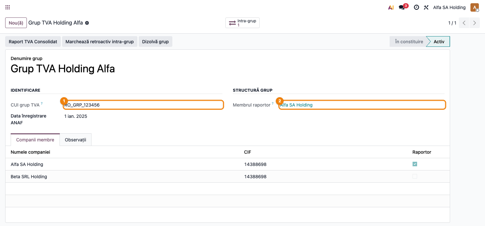
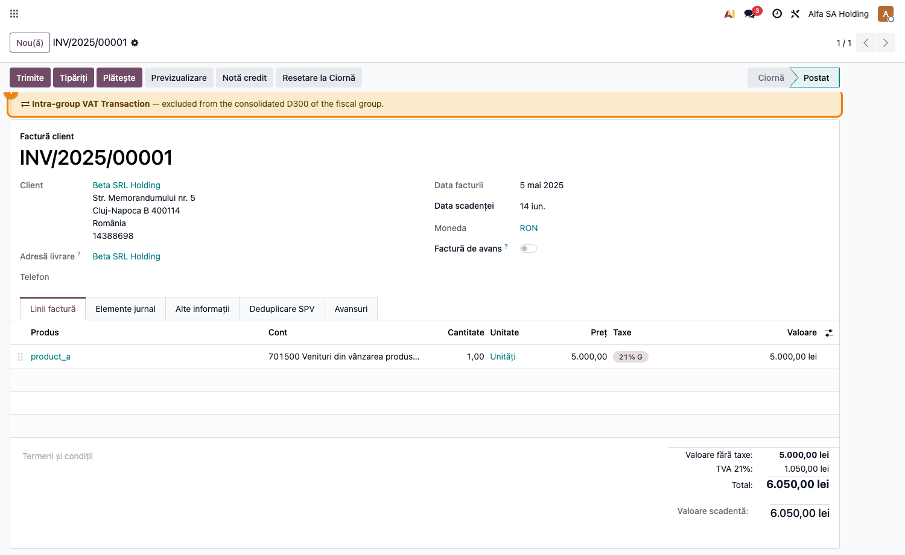
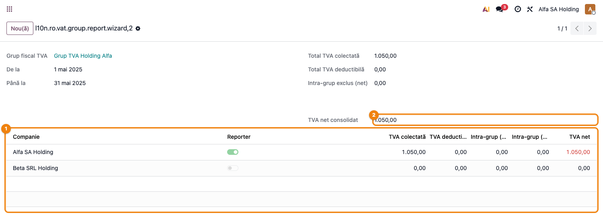

# Fișă Modul: Grup Fiscal TVA

**Modul:** `l10n_ro_vat_group`
**Capitol manual:** Cap 3.2 — Grup Fiscal TVA
**Utilizator principal:** Contabil Grup, Manager Financiar Holding
**Prioritate:** 🟡 Medie (nișă — holdinguri cu aprobare ANAF)

---

## 1. Scop business

Grupul fiscal TVA permite mai multor companii dintr-un holding să depună **un singur
decont D300 consolidat** prin membrul raportor, excluzând tranzacțiile intra-grup
din baza TVA.

> ⚠️ **Această funcționalitate se aplică exclusiv** companiilor care au obținut
> aprobare ANAF conform **art. 269² Cod Fiscal + OPANAF 2731/2016**. Este un
> scenariu de nișă — nu toate implementările vor utiliza acest modul.

---

## 2. Bază legală

- **Codul Fiscal art. 269²** — grupul fiscal TVA
- **OPANAF 2731/2016** — procedura de constituire și funcționare
- **OMFP 1802/2014** — evidența contabilă separată per companie membră

---

## 3. Utilizatori și roluri

| Rol | Acțiune |
|---|---|
| Contabil Grup | Configurează grupul și verifică raportul consolidat |
| Manager Financiar Holding | Validează membrul raportor și decizia de blocare perioadă |
| Contabil companie membră | Verifică tranzacțiile propriei companii |
| Responsabil fiscal | Corelează raportul consolidat cu aprobarea ANAF și D300 |

---

## 4. Condiții de eligibilitate (verificate de ANAF)

- Companiile membre sunt rezidente în România
- Deținere directă sau indirectă > 50% între membri
- Cel puțin 2 companii membre
- Solicitare formală (Formular 045) aprobată de ANAF

---

## 5. Configurare inițială

### Pasul 1 — Creare grup

**Contabilitate → Grup TVA → Grupuri Fiscale TVA → Nou**

**Formularul grupului fiscal activ** — CUI grup, membrul raportor și companiile membre cu marcajul
de raportor (✓):

| Câmp | Exemplu |
|------|---------|
| **Denumire** | Grup TVA Holding Alfa |
| **CUI unic TVA grup** | `RO_GRP_123456` (atribuit de ANAF) |
| **Companie raportoare** | Alfa SA (cea care depune D300 consolidat) |
| **Data constituirii** | `01.01.2026` |

### Pasul 2 — Adăugare companii membre

În tab-ul **Companii membre**, adăugați fiecare companie din holding:

| Câmp | Exemplu |
|------|---------|
| **Companie** | Beta SRL |
| **CUI** | RO12345678 |
| **Rol** | Membră (sau Raportoare) |

### Pasul 3 — Activare grup

Click **Activează** → starea trece din `În constituire` în `Activ`.

La activare, câmpul **Grup fiscal TVA** se setează automat pe toate companiile membre.

---

## 6. Flux de utilizare

### Pasul 1 — Marcarea tranzacțiilor intra-grup

Când o companie membră emite o factură către o altă companie membră din același grup,
sistemul detectează automat și marchează factura cu **Tranzacție intra-grup TVA = True**.

Pe formularul facturii apare un banner de avertizare:

**Factură intra-grup** — bannerul portocaliu apare imediat sub header-ul facturii,
indicând că tranzacția va fi exclusă din D300 consolidat:

---

### Pasul 2 — Raport TVA consolidat

**Contabilitate → Grup TVA → Raport TVA Consolidat**

Wizard cu:
- **Perioadă**: luna/trimestrul pentru D300
- **Grup**: selectați grupul configurat

Raportul afișează per companie membră TVA colectată, deductibilă, sumele intra-grup excluse
și TVA net. **Raport TVA consolidat** după calcul — linii per companie, reporter marcat cu
toggle verde, TVA net per companie și total consolidat:

### Pasul 3 — Blocare perioadă

Click **Blochează perioada** → setează `tax_lock_date` sincronizat pe **toate companiile membre**
simultan. Previne modificări retroactive în perioadele deja raportate.

---

## 7. Legături cu alte module / declarații

| Modul / declarație | Rol în flux |
|---|---|
| `account` | facturi și tax tags per companie membră |
| `l10n_ro_anaf_d300` | ținta funcțională pentru D300 consolidat cu CUI grup |
| `l10n_ro_anaf_d394` (Tax Sale/Purchase Report) | reconciliere TVA per companie |
| Multi-company Odoo | izolare și consolidare date pe companii membre |
| Formular 045 | document ANAF de constituire grup, planificat separat |

Ce este automat: marcarea intra-grup, raportul consolidat și blocarea sincronizată a perioadei.
Ce rămâne gap: generarea XML D300 cu CUI de grup și Formularul 045.

## 8. Limitări versiune Beta

| Funcționalitate | Status |
|-----------------|--------|
| Raport TVA consolidat | ✅ Implementat |
| Marcare automată intra-grup | ✅ Implementat |
| Blocare perioadă sincronizată | ✅ Implementat |
| Generare XML D300 cu CUI grup | ❌ Planificat (necesită extensie `l10n_ro_anaf_d300`) |
| Formular 045 (cerere constituire) | ❌ Planificat |

---

## 9. Mesaje de eroare frecvente

| Mesaj | Cauză | Remediere |
|-------|-------|-----------|
| „CUI grup TVA obligatoriu" | Câmpul CUI necompletat | Introduceți CUI-ul atribuit de ANAF |
| „Compania X nu este RO" | Companie non-rezidentă adăugată | Grupul acceptă doar companii cu Țara = România |
| „Membrul raportor nu este membră" | Configurare greșită | Adăugați compania raportoare și în lista de membre |

---

## 10. Capturi de ecran

| # | Fișier | Conținut |
|---|--------|----------|
| 1 | `screenshots/01_grup_fiscal.png` | Grup fiscal activ — CUI grup, membrul raportor, companiile membre cu marcaj raportor |
| 2 | `screenshots/02_factura_intragroup.png` | Factură intra-grup cu bannerul de avertizare (excludere din D300 consolidat) |
| 3 | `screenshots/03_raport_consolidat.png` | Wizard raport TVA consolidat — linii per companie, coloane intra-grup, TVA net total |
