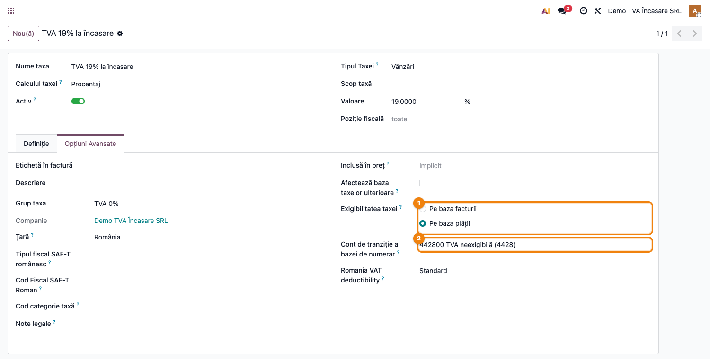
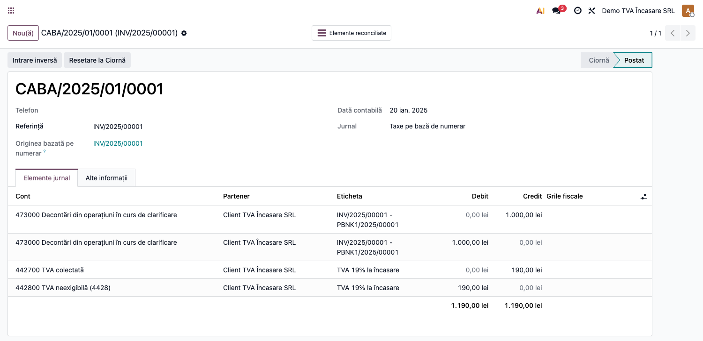

# Fișă Modul: Blocare storno TVA la încasare declarat (4428)

**Modul:** `l10n_ro_vat_on_payment_lock`
**FR:** FR-16
**Utilizator principal:** Contabil TVA, Contabil-șef
**Prioritate:** 🟡 Medie (control de conformitate; previne stornarea retroactivă a TVA declarat)

---

## 1. Scop business

Modulul împiedică **desfacerea reconcilierii** unei încasări atunci când TVA la încasare aferentă
(exigibilitate amânată pe contul **4428**, mecanismul *cash-basis*) a fost deja inclusă într-un
**decont D300 declarat**. Astfel, contabilul nu poate storna retroactiv — din greșeală — TVA-ul
care a devenit deja exigibil și a fost raportat la ANAF. Este un control de fundal, fără ecran
propriu: acționează în momentul în care cineva încearcă să reseteze o plată la ciornă sau să
desfacă o reconciliere dintr-o perioadă închisă fiscal.

## 2. Bază legală și context

- **Cod Fiscal, art. 282** — TVA la încasare: exigibilitatea se amână până la încasarea facturii;
  la încasare (inclusiv parțială) TVA neexigibilă (4428) devine exigibilă și se transferă la
  4426/4427.
- Odată inclusă într-un **D300 validat**, exigibilitatea este definitivă: desfacerea ulterioară a
  reconcilierii ar storna retroactiv TVA-ul deja declarat, ceea ce nu este permis.
- Reperul tehnic pentru „perioadă declarată" este **data de blocare a TVA** (`tax_lock_date`),
  setată la validarea D300 (vezi `l10n_ro_period_close_enhanced` / fluxul de declarații).

## 3. Utilizatori și roluri

- **Contabil TVA** — operează încasările și reconcilierile; primește mesajul de blocare.
- **Contabil-șef** — gestionează data de blocare fiscală (validarea D300) și deblocarea controlată.

Roluri recomandate pentru testare:
- Administrator funcțional: instalează modulul, activează „Exigibilitate la încasare" pe companie.
- Utilizator operațional: emite factura cu TVA la încasare, încasează, încearcă stornarea.
- Contabil/manager: validează D300 (setează blocarea) și confirmă comportamentul de blocare.

## 4. Conturi și date implicate

| Cont | Rol |
|---|---|
| `4428` | TVA neexigibilă (cont de tranziție cash-basis) |
| `4427` | TVA colectată (devine exigibilă la încasare) |
| `4426` | TVA deductibilă (la achiziții cu TVA la încasare) |
| `4111` | clienți (creanța care se încasează) |
| `5121`/`5311` | bancă / casă (încasarea) |

Date minime pentru demo:
- companie românească cu **Exigibilitate la încasare** activată (TVA cash-basis);
- o taxă de vânzare cu **Exigibilitate = La încasare** și cont de tranziție `4428`;
- o factură client cu această taxă, postată și încasată (generează nota de exigibilitate);
- o dată de blocare a TVA (`tax_lock_date`) care acoperă luna încasării.

## 5. Configurare inițială

1. Instalați modulul `l10n_ro_vat_on_payment_lock` pe baza demo (depinde de `account` și `l10n_ro`).
2. Activați **Contabilitate → Configurare → Setări → Taxe → Exigibilitate TVA la încasare** pe companie.
3. Configurați o taxă de vânzare (fila **Opțiuni Avansate**) cu **Exigibilitatea taxei = Pe baza plății** și **Cont de tranziție a bazei de numerar** `4428`.
4. **Setați contul de bază pentru notele cash-basis** — câmpul **„Base Tax Received Account"**
   (`account_cash_basis_base_account_id`) pe companie, în Setări → Contabilitate (secțiunea Taxe).
   Recomandat: un **cont tehnic neutru**, ex. **`473` „Decontări din operații în curs de clarificare"**.
   Liniile de bază din nota de exigibilitate sunt o mișcare în oglindă (Dr = Cr, sold 0) folosită doar
   pentru raportarea bazei în grilele de TVA; dacă acest câmp este gol, baza rulează pe **contul de
   venituri/cheltuieli** al facturii (ex. 7xx), ceea ce nu este corect. Setând `473`, baza nu mai
   atinge conturile de rezultat.
5. Asigurați-vă că utilizatorul de test are drepturi de Contabilitate.
6. Nu este nevoie de meniuri noi — modulul nu adaugă interfață proprie; acționează automat.

## 6. Flux de utilizare

### Pasul 1 — Taxa „TVA la încasare"

Verificați taxa de vânzare folosită: **Contabilitate → Configurare → Taxe**, fila **Opțiuni
Avansate**. Câmpul **Exigibilitatea taxei** trebuie să fie **Pe baza plății**, cu **Cont de tranziție
a bazei de numerar** `4428`. Aceasta este taxa care amână exigibilitatea TVA până la încasare.



### Pasul 2 — Factura încasată și nota de exigibilitate (4428 → 4427)

Emiteți și postați o factură client cu taxa de mai sus, apoi înregistrați încasarea
(**Înregistrează plata**). La reconcilierea încasării cu factura, Odoo generează automat **nota de
exigibilitate** (cash-basis): TVA-ul trece din **4428** (neexigibil) în **4427** (colectat),
proporțional cu suma încasată. Liniile de **bază** apar în oglindă pe contul tehnic configurat la
Pasul 4 (ex. `473`) — se anulează între ele și servesc doar la raportarea bazei în grilele de TVA.



### Pasul 3 — După declararea D300: blocarea stornării

După ce TVA-ul lunii este declarat în D300, contabilul-șef setează data de blocare a TVA
(`tax_lock_date`) pe lună (operațiune din fluxul de închidere / validare D300). Din acest moment,
orice încercare de a **reseta plata la ciornă** sau de a **desface reconcilierea** încasării — care
ar storna nota de exigibilitate dintr-o perioadă deja declarată — este **blocată**. Fiind un control
de fundal (fără ecran propriu), blocarea apare ca un dialog de eroare peste ecranul curent, cu mesajul:

> Nu puteți desface această reconciliere: TVA la încasare aferentă (nota CABA/2025/01/0001 din
> 20.01.2025) este deja inclusă într-un decont D300 declarat — perioada este blocată fiscal la 31.01.2025.

Operatorul nu poate continua. Pentru o corecție legitimă, contabilul-șef trebuie întâi să
**deblocheze** perioada (retragerea
`tax_lock_date`) și să depună un D300 rectificativ, conform procedurii — nu prin storno retroactiv tăcut.

### Note de monografie și raportare

- La încasare (exigibilitate), nota cash-basis generată automat de Odoo: **Dr 4428 = Cr 4427**
  (latura neexigibil → colectat), pe baza facturii cu TVA la încasare; la achiziții, simetric
  **Dr 4426 = Cr 4428**.
- Modulul **nu** generează note contabile proprii — adaugă doar **controlul de blocare** la
  desfacerea reconcilierii care ar storna nota de exigibilitate dintr-o perioadă declarată.
- Reperul „declarat" = `tax_lock_date`; perioadele de după data de blocare rămân editabile normal.

## 7. Legături cu alte module / declarații

| Modul / proces | Rol în flux | Tip legătură |
|---|---|---|
| `account` | reconciliere, note cash-basis (4428), data de blocare TVA | dependență (manifest) |
| `l10n_ro` | plan de conturi RO (4428/4426/4427), țară fiscală RO | dependență (manifest) |
| `l10n_ro_vat_on_payment` (OCA) | regimul „TVA la încasare" pe partener + țintirea contului 4428 | companion (recomandat) |
| `l10n_ro_anaf_d300` | declarația D300 a cărei validare setează `tax_lock_date` | integrare prin convenție |
| `l10n_ro_period_close_enhanced` | închiderea lunii care aplică blocarea fiscală | integrare prin convenție |

Ce este automat: blocarea desfacerii reconcilierii când nota de exigibilitate cade în perioadă declarată.
Ce rămâne manual: setarea/retragerea `tax_lock_date` (validarea D300, respectiv deblocarea pentru rectificare).

## 8. Verificări pentru consultant

- [ ] Modulul se instalează fără erori pe o companie RO.
- [ ] Cu **exigibilitate la încasare** activă, încasarea unei facturi generează nota 4428 → 4427.
- [ ] Cu `tax_lock_date` ≥ data notei de exigibilitate, resetarea plății / desfacerea reconcilierii este **blocată** cu mesaj explicit.
- [ ] Cu `tax_lock_date` mai vechi decât data notei (perioadă nedeclarată), desfacerea este **permisă**.
- [ ] Fără `tax_lock_date`, desfacerea este permisă.
- [ ] Pe o companie cu țară fiscală non-RO, controlul nu se aplică.

## 9. Mesaje de eroare frecvente

| Mesaj / simptom | Cauză probabilă | Remediere |
|---|---|---|
| „Nu puteți desface această reconciliere: TVA la încasare aferentă (nota … din …) este deja inclusă într-un decont D300 declarat — perioada este blocată fiscal la …" | Se încearcă stornarea/desfacerea unei încasări a cărei TVA exigibilă e deja declarată | Deblocați perioada (retragere `tax_lock_date`) și corectați prin D300 rectificativ, conform procedurii |
| Blocarea nu apare deși perioada e declarată | Compania nu are țara fiscală RO sau `tax_lock_date` nu acoperă data notei de exigibilitate | Verificați țara fiscală a companiei și data de blocare a TVA |
| Nu se generează nota de exigibilitate la încasare | Taxa nu are exigibilitate „La încasare" sau lipsește contul de tranziție 4428 | Configurați taxa cu exigibilitate la încasare și cont tranziție 4428 |

## 10. Capturi de ecran

Capturile (`readme/screenshots/`) sunt **generate automat** din `tests/test_screenshots.py`
(mixinul `ScreenshotCase` din `l10n_ro_doc_screenshots`, import defensiv), în **limba română**,
pe planul de conturi RO (`setup_country("ro")`):

1. `01_taxa_tva_incasare.png` — taxa de vânzare, fila Opțiuni Avansate: exigibilitate „Pe baza plății" + cont tranziție 4428.
2. `02_nota_exigibilitate.png` — nota de exigibilitate (taxe pe bază de numerar) generată la încasare, cu TVA pe 4428.

> Blocarea de la Pasul 3 este un **control de fundal**, fără ecran propriu: se manifestă ca un dialog
> de eroare peste ecranul curent (mesajul e redat integral în Pasul 3 și în secțiunea 9), de aceea nu
> are o captură dedicată.

Regenerare:

```bash
./odoo/odoo-bin -c odoo.conf -d <db> -i l10n_ro_vat_on_payment_lock,l10n_ro_doc_screenshots \
    --test-tags=fise_screenshots --stop-after-init
```

## 11. Observații pentru manual

Modulul este un **control de conformitate fără interfață proprie**: în manual, prezentați-l ca o
„plasă de siguranță" pentru TVA la încasare — explicați când apare blocajul (după declararea D300,
prin `tax_lock_date`), de ce (art. 282 — exigibilitate definitivă) și care e procedura corectă de
corecție (deblocare + D300 rectificativ, nu storno retroactiv).
