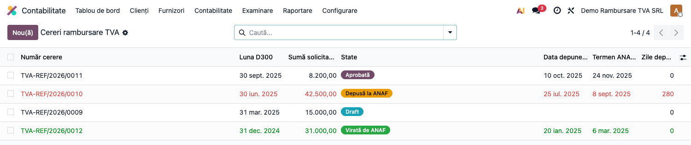
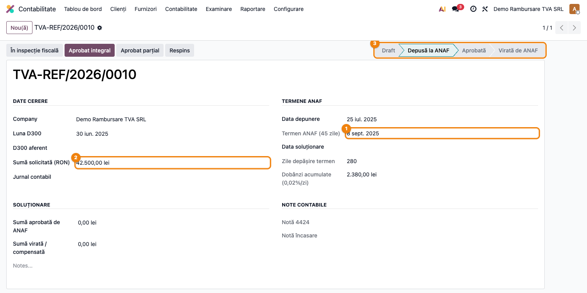

# Fișă Modul: Rambursare TVA (Sold Negativ D300)

**Poziție plan:** B3.1
**Modul:** `l10n_ro_vat_refund`
**FR:** FR-35
**Capitol manual:** Cap 3.3
**Utilizator principal:** Contabil TVA, Responsabil Fiscal
**Prioritate:** 🟡 Medie

---

## 1. Scop business

Modulul urmărește **cererile de rambursare TVA** generate de un sold negativ în D300 (4424 > 4427).
Oferă un registru centralizat al cererilor cu mașină de stări în 8 pași, monitorizare termen legal
ANAF de 45 zile, calculul automat al dobânzilor penalizatoare (0,02%/zi) și generarea notelor
contabile la rambursare (Dr 5121 = Cr 4424) sau compensare.

## 2. Bază legală și context

- **Codul Fiscal art. 303** — dreptul la rambursarea TVA; termenul ANAF de 45 zile de la depunerea
  cererii.
- **O.G. 92/2003 (Codul de Procedură Fiscală)** — dobânzi pentru întârziere: 0,02%/zi după
  expirarea termenului de 45 zile.
- Monografie la rambursare: **Dr 5121** Cont curent = **Cr 4424** TVA de recuperat.

## 3. Utilizatori și roluri

- **Contabil TVA**: creează cererea după depunerea D300 cu sold negativ, urmărește statusul.
- **Responsabil Fiscal**: decide modalitatea de soluționare (rambursare vs. reportare) și
  confirmă recepția sumei.

## 4. Date implicate

- Cerere cu număr automat (`TVA-REF/YYYY/XXXX`), perioadă D300, sumă solicitată.
- Termen ANAF calculat automat: `data_depunere + 45 zile`.
- Zile depășire și dobânzi acumulate (calculate daily, fără stocare).
- Note contabile generate: 4424 → 5121 (rambursare) sau 4424 → alte conturi (compensare).

## 5. Configurare inițială

1. Instalați `l10n_ro_vat_refund` (dependențe: `l10n_ro_anaf_d300`, `mail`).
2. Accesați **Contabilitate → Declarații ANAF → Cereri rambursare TVA**.
3. Nu necesită configurare suplimentară — conturile 4424/5121 sunt căutate automat din planul RO.

## 6. Flux de utilizare

### Pasul 1 — Lista cererilor

Accesați **Contabilitate → Declarații ANAF → Cereri rambursare TVA**.
Lista afișează toate cererile cu badge-uri de status colorate:
- 🔵 **Draft** — cerere nouă, nedepusă
- 🟡 **Depusă la ANAF** — în termenul de 45 zile (sau roșu dacă termenul a expirat)
- 🟣 **Aprobată** — ANAF a aprobat rambursarea
- 🟢 **Virată de ANAF** — suma a fost primită în cont

**Lista cu cereri în stări multiple — badge-uri colorate și zile depășire 280:**

### Pasul 2 — Formularul cererii

Deschideți o cerere. Formularul arată:
- **DATE CERERE**: companie, Luna D300, suma solicitată ②, jurnal contabil.
- **TERMENE ANAF**: data depunere, Termen ANAF 45 zile ①, data soluționare, zile depășire, dobânzi.
- **Bara de stare** ③: Draft → Depusă la ANAF → Aprobată → Virată de ANAF.

**Cerere Depusă la ANAF — Termen ANAF ①, Sumă ②, bară de stare ③, dobânzi acumulate:**

### Pasul 3 — Tranziții de stare

| Buton | Tranziție | Condiție |
|---|---|---|
| **Depune la ANAF** | draft → submitted | setează data_depunere la astăzi |
| **Inspecție fiscală** | submitted → inspection | ANAF solicită control |
| **Aprobat integral** | submitted/inspection → approved | sumă aprobată = sumă solicitată |
| **Aprobat parțial** | submitted/inspection → partially | completați `amount_approved` |
| **Respins** | submitted/inspection → rejected | fără note contabile |
| **Înregistrare viraj** | approved/partially → paid | generează Dr 5121 = Cr 4424 |
| **Înregistrare compensare** | approved/partially → compensated | generează nota compensare |

### Pasul 4 — Dobânzi și alertă cron

Zilnic (cron lunar): modulul verifică cererile cu termenul depășit și creează activități de
avertizare pe cerere. Dobânzile se calculează automat: `suma_solicitată × 0,02% × zile_depășire`.

## 7. Legături cu alte module

| Modul | Rol în flux |
|---|---|
| `l10n_ro_anaf_d300` | sursa D300 cu sold negativ → creare cerere rambursare |
| `l10n_ro_vat_regularization` | regularizarea contabilă 4426/4427/4424 |
| `account` | notele contabile generate (Dr 5121=Cr 4424 la rambursare) |
| `l10n_ro_period_close_enhanced` | checklist de închidere — verificare cereri TVA deschise |

Ce este automat: calculul termenului, dobânzilor și notelor contabile la viraj/compensare.
Ce rămâne manual: depunerea documentației la ANAF, atașarea recipisei/deciziei de rambursare.

## 8. Verificări pentru consultant

- [ ] Lista cererilor se deschide din **Contabilitate → Declarații ANAF → Cereri rambursare TVA**.
- [ ] La depunere, data_deadline se calculează automat (data_submitted + 45 zile).
- [ ] Cererile cu termenul depășit apar evidențiate în roșu în listă.
- [ ] Dobânzile acumulate sunt vizibile pe formularul cererii.
- [ ] La **Înregistrare viraj**, se generează nota Dr 5121 = Cr 4424.

## 9. Mesaje frecvente

| Simptom | Cauză probabilă | Remediere |
|---------|-----------------|-----------|
| Meniul lipsă | `l10n_ro_anaf_d300` nu e instalat | Instalați dependența |
| Conturi 5121/4424 negăsite | Plan de conturi incomplet | Verificați că planul RO e instalat pe companie |
| Cron nu creează activități | Cereri în stare draft sau termen neexpiriat | Verificați starea și data_deadline |

## 10. Capturi de ecran

| # | Fișier | Conținut |
|---|--------|----------|
| 1 | `screenshots/01_lista_cereri.png` | Lista cu 4 cereri în stări diferite — badge-uri colorate, linie roșie la depășire termen |
| 2 | `screenshots/02_cerere_submitted.png` | Formularul cererii Depuse — Termen ANAF ①, Sumă ②, bară stare ③, 280 zile depășire + dobânzi |
