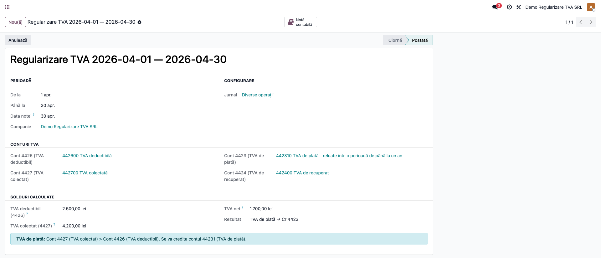
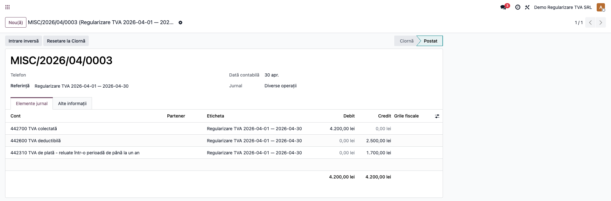
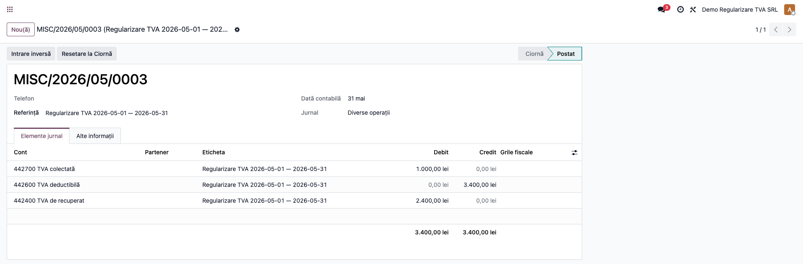
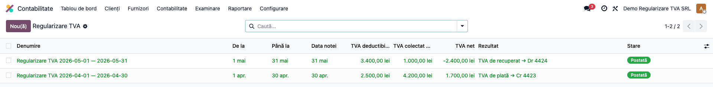

# Fișă Modul: Regularizare TVA (4426/4427 → 4423/4424)

**Modul:** `l10n_ro_vat_regularization`
**FR:** FR-27
**Utilizator principal:** Contabil TVA, Contabil șef
**Prioritate:** 🔴 Ridicată (lunar/trimestrial, la depunerea decontului D300)

---

## 1. Scop business

La finele fiecărei perioade de TVA, conturile **4426** (TVA deductibilă) și **4427** (TVA colectată)
se închid între ele, iar diferența se reflectă în **4423** (TVA de plată) sau **4424** (TVA de
recuperat). Modulul calculează automat soldurile perioadei din notele postate și generează, cu un
singur clic, **nota de regularizare** corespunzătoare. Include un flux ciornă → postată → anulată și
o verificare în checklistul de închidere (account.return / D300).

## 2. Bază legală și context

OMFP 1802/2014 și Codul fiscal (Legea 227/2015, Titlul VII — TVA) impun regularizarea TVA la finalul
fiecărei perioade fiscale, corelată cu depunerea **decontului de TVA (D300)**. Soldul rezultat
reprezintă fie TVA de plată către buget (4423), fie TVA de recuperat/rambursat (4424).

## 3. Utilizatori și roluri

Contabil TVA / Contabil șef.

Roluri recomandate pentru testare:
- **Contabil** (grupul „Contabil / Accountant") — creează regularizarea, calculează și postează
  (meniul cere `account.group_account_user`).
- **Contabil șef** — validează rezultatul înainte de depunerea D300.

## 4. Conturi și date implicate

- **4426** „TVA deductibilă" — sold debitor al perioadei.
- **4427** „TVA colectată" — sold creditor al perioadei.
- **4423** (implicit **44231** „TVA de plată") — creditat când 4427 > 4426.
- **4424** „TVA de recuperat" — debitat când 4426 > 4427.

Monografia:
- **TVA de plată** (4427 > 4426): **Dr 4427 = Cr 4426 + Cr 44231** (cu diferența);
- **TVA de recuperat** (4426 > 4427): **Dr 4427 + Dr 4424 = Cr 4426** (cu diferența);
- **TVA = 0**: nu se generează notă.

> Contul **44231** (TVA de plată sub 1 an) este folosit implicit. Pentru TVA de plată cu scadență mai
> mare de 1 an, schimbați manual contul în **44232**.

Date minime pentru demo:
- companie românească cu plan de conturi RO (conturile 4426/4427/44231/4424);
- un jurnal de tip *Operațiuni diverse*;
- note postate în perioadă care alimentează 4426 și 4427.

## 5. Configurare inițială

1. Instalați modulul `l10n_ro_vat_regularization` (dependențe: `account`, `l10n_ro`).
2. Conturile 4426/4427/44231/4424 și jurnalul general sunt **precompletate automat** din planul de
   conturi RO la crearea unei regularizări (le puteți schimba manual pe document).
3. Verificați că notele de TVA ale perioadei sunt **postate** (soldurile se calculează doar din
   înregistrări postate).

## 6. Flux de utilizare

### Pasul 1 — Crearea regularizării și calculul soldurilor

**Contabilitate → Regularizare TVA → Nou**. Setați **De la / Până la** (perioada), **Data notei**
(ultima zi a perioadei), verificați conturile precompletate și jurnalul, apoi apăsați
**„Calculează solduri"**.

Se afișează **TVA deductibilă (4426)**, **TVA colectată (4427)**, **TVA net** și **Rezultatul**
(TVA de plată / de recuperat / zero), cu un banner explicativ corespunzător.



### Pasul 2 — Postarea (TVA de plată)

Apăsați **„Postează"**. Când 4427 > 4426, se generează nota **Dr 4427 = Cr 4426 + Cr 44231** cu
diferența de plată, iar regularizarea trece în starea **Postată** (cu buton către notă).



### Pasul 3 — Cazul TVA de recuperat

Când 4426 > 4427, nota generată este **Dr 4427 + Dr 4424 = Cr 4426**: se închide TVA colectată, se
închide TVA deductibilă și diferența rămâne de recuperat în contul 4424.



### Pasul 4 — Evidența și anularea

Lista **Contabilitate → Regularizare TVA** afișează toate regularizările, cu perioada, soldurile,
TVA net, rezultatul și starea. O regularizare postată poate fi **Anulată** (anulează și nota
contabilă), apoi **Resetată la ciornă** pentru refacere.



### Note de monografie și raportare

- TVA de plată: **Dr 4427 = Cr 4426 + Cr 44231**; TVA de recuperat: **Dr 4427 + Dr 4424 = Cr 4426**;
- nota este echilibrată și legată de regularizare (buton „Notă contabilă");
- soldurile se calculează **numai din înregistrările postate** ale perioadei;
- rezultatul trebuie să corespundă **decontului D300** al perioadei; dacă este instalat modulul de
  închidere (account.return), checklistul semnalează lipsa regularizării pentru perioadă.

## 7. Legături cu alte module / declarații

| Modul / proces | Rol în flux | Tip legătură |
|---|---|---|
| `account` | nota de regularizare și soldurile conturilor | dependență (manifest) |
| `l10n_ro` | plan de conturi RO (4426/4427/44231/4424) | dependență (manifest) |
| `account.return` / D300 | checklistul de închidere verifică existența regularizării postate pentru perioadă | integrare (detectată la runtime) |
| `l10n_ro_anaf_d300` | decontul de TVA al perioadei — rezultatul regularizării trebuie să coincidă | corelare manuală |

Ce este automat: precompletarea conturilor/jurnalului, calculul soldurilor 4426/4427, determinarea
rezultatului și generarea notei de regularizare.
Ce rămâne manual: alegerea perioadei și a datei notei, verificarea soldurilor față de D300 și decizia
de anulare/refacere.

## 8. Verificări pentru consultant

- [ ] Modulul se instalează fără erori pe baza demo.
- [ ] Conturile 4426/4427/44231/4424 și jurnalul se precompletează la crearea unei regularizări.
- [ ] „Calculează solduri" afișează corect soldurile perioadei și rezultatul.
- [ ] TVA de plată generează Dr 4427 = Cr 4426 + Cr 44231.
- [ ] TVA de recuperat generează Dr 4427 + Dr 4424 = Cr 4426.
- [ ] TVA net = 0 blochează postarea cu mesaj clar.
- [ ] Anularea anulează și nota; resetarea la ciornă permite refacerea.
- [ ] Rezultatul coincide cu decontul D300 al perioadei.

## 9. Mesaje de eroare frecvente

| Mesaj / simptom | Cauză probabilă | Remediere |
|-----------------|-----------------|-----------|
| „Selectați conturile lipsă înainte de regularizare: …" | Unul dintre conturile 442x nu este setat/găsit | Completați conturile pe document (sau verificați planul de conturi) |
| „Selectați jurnalul contabil." | Jurnalul nu este setat | Alegeți un jurnal de operațiuni diverse |
| „TVA net = 0 — nu este necesară nicio regularizare." | Soldurile 4426 și 4427 sunt egale | Verificați notele perioadei; nicio regularizare necesară |
| „Regularizarea este deja postată sau anulată." | Postare cerută pe un document care nu e în ciornă | Anulați și resetați dacă trebuie refăcută |
| „Doar regularizările anulate pot fi resetate la ciornă." | Resetare cerută pe document postat/ciornă | Anulați întâi regularizarea |

## 10. Capturi de ecran

Capturile (`readme/screenshots/`) sunt **generate automat** din `tests/test_screenshots.py`
(mixinul `ScreenshotCase` din `l10n_ro_doc_screenshots`, import defensiv), în **limba română**,
pe planul de conturi RO (`setup_country("ro")`):

1. `01_formular_regularizare.png` — regularizarea cu soldurile calculate și rezultatul (TVA de plată).
2. `02_nota_plata.png` — nota de regularizare TVA de plată (Dr 4427 / Cr 4426 / Cr 44231).
3. `03_nota_recuperare.png` — nota de regularizare TVA de recuperat (Dr 4427 / Dr 4424 / Cr 4426).
4. `04_lista_regularizari.png` — lista regularizărilor de TVA.

Regenerare:

```bash
./odoo/odoo-bin -c odoo.conf -d <db> -i l10n_ro_vat_regularization,l10n_ro_doc_screenshots \
    --test-tags=fise_screenshots --stop-after-init
```

## 11. Observații pentru manual

În manualul final, păstrați explicația orientată pe activitatea utilizatorului: când se face
regularizarea (la finalul fiecărei perioade de TVA, înainte de D300), cum se citește rezultatul
(TVA de plată 4423/44231 vs. TVA de recuperat 4424) și cum se corelează cu decontul. Subliniați că
soldurile se calculează doar din notele postate și că nota de regularizare nu înlocuiește depunerea
D300, ci o pregătește contabil.
