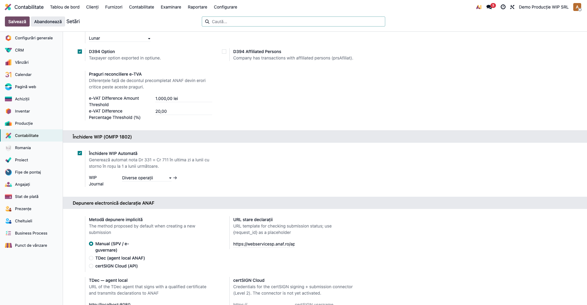
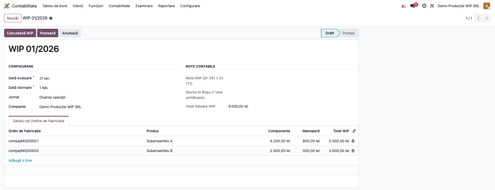
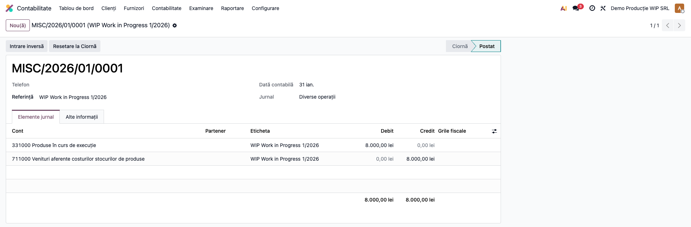
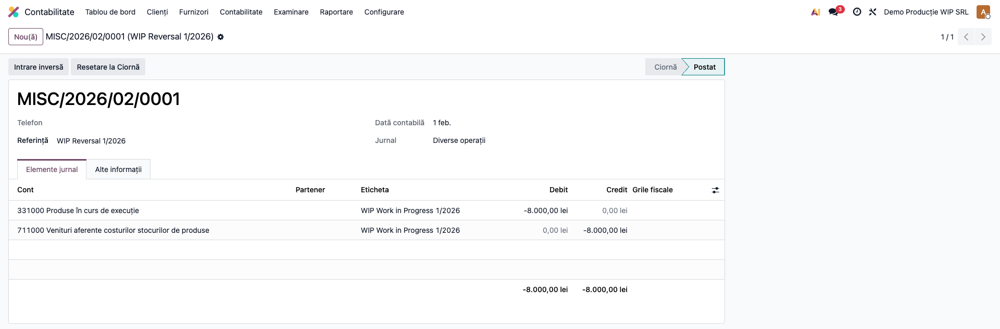
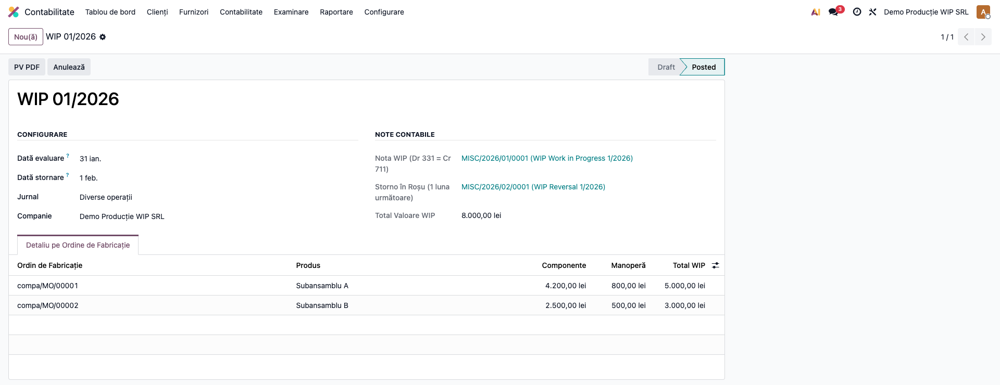

# Fișă Modul: Producție în Curs WIP (331/711)

**Poziție plan:** B1.3
**Modul:** `l10n_ro_wip_closing`
**FR:** FR-09
**Capitol manual:** Cap 6.3
**Utilizator principal:** Contabil producție, Contabil șef
**Prioritate:** 🔴 Ridicată (lunar obligatoriu pentru firmele cu producție)

---

## 1. Scop business

Firmele cu activitate de producție trebuie să evalueze, la finele fiecărei luni, **producția în curs
de execuție (WIP)** — ordinele de fabricație nefinalizate — și să o înregistreze contabil
**Dr 331 = Cr 711**, urmată de **stornarea în roșu la prima zi a lunii următoare**.

Odoo standard (`mrp_account`) generează stornarea WIP cu data „a doua zi" (`data + 1`), ceea ce nu
respectă legislația RO. Modulul **corectează automat data stornării la 1 a lunii următoare**, adaugă
un model persistent cu audit trail, calculează valoarea WIP din ordinele de fabricație în curs și
emite Procesul-Verbal de evaluare (PDF).

## 2. Bază legală și context

OMFP 1802/2014 — Reglementările contabile privind situațiile financiare anuale — tratează producția
în curs de execuție (cont **331**) și variația stocurilor (cont **711**): la inventariere/închidere,
producția neterminată se evaluează și se înregistrează, urmând a fi reluată (stornată) la începutul
perioadei următoare. Stornarea se face **în roșu** (valori negative), nu prin notă inversă.
Procesul-Verbal de evaluare are temei în OMFP 2861/2009 privind inventarierea.

## 3. Utilizatori și roluri

Contabil producție / Contabil șef.

Roluri recomandate pentru testare:
- **Administrator funcțional** (Settings) — instalează modulul, configurează jurnalul WIP.
- **Contabil** (grupul „Contabil / Accountant") — creează evaluarea, calculează și postează
  (meniul cere `account.group_account_user`).
- **Contabil șef / Manager** — validează nota, semnează Procesul-Verbal.

## 4. Conturi și date implicate

- **331** „Produse în curs de execuție" — debitat la evaluarea WIP.
- **711** „Venituri aferente costurilor stocurilor de produse" (variația stocurilor) — creditat.

Modulul caută conturile automat după prefix (`331%`, `711%`) în planul companiei.

Monografia:
- **La data evaluării** (ultima zi a lunii): **Dr 331 = Cr 711** cu valoarea totală WIP;
- **La 1 a lunii următoare** (storno în roșu): **Dr 331 = Cr 711** cu **valori negative**
  (`is_storno = True`), reluând producția în curs.

Valoarea WIP per ordin de fabricație = **valoarea componentelor consumate** (cantitate preluată ×
preț standard / preț lot) **+ valoarea manoperei** (costul operațiilor de lucru până la data evaluării).

Date minime pentru demo:
- companie românească cu plan de conturi RO (conturile 331 și 711);
- un jurnal de tip *Operațiuni diverse* pentru notele WIP;
- ordine de fabricație în stare *Confirmat / În producție / De finalizat*, cu componente preluate
  și, opțional, manoperă cu cost pe oră.

## 5. Configurare inițială

1. Instalați modulul `l10n_ro_wip_closing` (dependențe: `mrp_account`, `l10n_ro`).
2. **Contabilitate → Configurare → Setări → secțiunea „Închidere WIP (OMFP 1802)"**: opțional bifați
   **„Închidere WIP Automată"** și selectați **Jurnalul WIP** (folosit de cron). Pentru fluxul manual,
   jurnalul se alege direct pe fiecare evaluare.
3. Verificați că în planul de conturi există și sunt active conturile **331** și **711**.

## 6. Flux de utilizare

### Pasul 1 — Configurarea (opțional) și jurnalul

**Contabilitate → Configurare → Setări**, secțiunea „Închidere WIP (OMFP 1802)". Bifați închiderea
automată și alegeți jurnalul dacă doriți rularea prin cron; altfel jurnalul se alege pe evaluare.



### Pasul 2 — Crearea și calculul evaluării WIP

**Contabilitate → Închidere → WIP Producție în Curs (OMFP 1802) → Nou**. Data de evaluare se
completează automat (ultima zi a lunii), iar **Data stornării** se calculează la **1 a lunii
următoare** (nu se modifică). Alegeți jurnalul și apăsați **„Calculează WIP"**.

Modulul parcurge ordinele de fabricație în curs și afișează, în tabelul „Detaliu pe Ordine de
Fabricație", câte o linie per ordin, cu **valoarea componentelor**, **valoarea manoperei** și
**Total WIP**; în antet apare **Total Valoare WIP**.



### Pasul 3 — Postarea notei WIP

Apăsați **„Postează"**. Se generează și se postează **nota WIP** la data evaluării:
**Dr 331 = Cr 711** cu valoarea totală.



### Pasul 4 — Stornarea în roșu

În același pas se postează automat **stornarea în roșu** la **1 a lunii următoare**: aceleași conturi,
cu **valori negative** (`is_storno = True`) — reluarea producției în curs, conform OMFP 1802.



### Pasul 5 — Evaluarea postată și Procesul-Verbal

După postare, evaluarea trece în starea **Postată**, cu legături către **Nota WIP** și **Storno în
Roșu**. Butonul **„PV PDF"** generează Procesul-Verbal de evaluare (semnături Director Economic /
Contabil Șef). Evidența tuturor evaluărilor este în lista din același meniu.



### Note de monografie și raportare

- Evaluare WIP (ultima zi a lunii): **Dr 331 = Cr 711** cu valoarea totală;
- storno în roșu (1 a lunii următoare): **Dr 331 = Cr 711** cu valori **negative** (`is_storno`),
  nu notă inversă — conform OMFP 1802;
- ambele note sunt echilibrate și legate de evaluare prin câmpurile „Nota WIP" / „Storno în Roșu";
- operațiunea mișcă doar conturile 331/711 — **nu afectează TVA** și nu intră în D300/D394;
- la postare se actualizează `l10n_ro_wip_closing_date` pe companie (folosit de checklistul de
  închidere din `l10n_ro_period_close_enhanced`).

## 7. Legături cu alte module / declarații

| Modul / proces | Rol în flux | Tip legătură |
|---|---|---|
| `mrp_account` | ordinele de fabricație, costurile și wizardul core WIP corectat | dependență (manifest) |
| `l10n_ro` | localizare contabilă RO (plan de conturi, storno obligatoriu) | dependență (manifest) |
| `l10n_ro_period_close_enhanced` | checklistul de închidere verifică `l10n_ro_wip_closing_date` | integrare prin convenție |

Ce este automat: calculul WIP din ordinele de fabricație, nota Dr 331 = Cr 711, stornarea în roșu la
1 a lunii următoare, corectarea datei de stornare în wizardul core și actualizarea datei pe companie.
Ce rămâne manual: configurarea jurnalului, alegerea datei de evaluare, declanșarea calculului și
postarea (sau activarea explicită a cron-ului), semnarea Procesului-Verbal.

## 8. Verificări pentru consultant

- [ ] Modulul se instalează fără erori pe baza demo (necesită Producție / `mrp_account`).
- [ ] Opțiunea „Închidere WIP Automată" și jurnalul WIP apar în Setări contabilitate.
- [ ] Data stornării se calculează automat la 1 a lunii următoare (nu data + 1).
- [ ] „Calculează WIP" listează ordinele de fabricație în curs cu componente + manoperă.
- [ ] Postarea generează nota Dr 331 = Cr 711 la data evaluării.
- [ ] Stornarea în roșu are data de 1 a lunii următoare și valori negative (`is_storno`).
- [ ] Evaluarea postată are legături către ambele note și starea „Postată".
- [ ] „PV PDF" generează Procesul-Verbal de evaluare.
- [ ] Postarea cu valoare WIP zero este blocată cu mesaj clar.

## 9. Mesaje de eroare frecvente

| Mesaj / simptom | Cauză probabilă | Remediere |
|-----------------|-----------------|-----------|
| „Doar înregistrările în ciornă pot fi recalculate." | „Calculează" apăsat după postare | Creați o evaluare nouă pentru recalcul |
| „Valoarea WIP calculată este zero. Apăsați «Calculează»…" | Nu s-a calculat WIP sau nu există producție în curs evaluabilă | Apăsați „Calculează WIP"; verificați ordinele de fabricație și componentele preluate |
| „Data stornării (…) trebuie să fie după data WIP (…)." | Data de stornare a fost editată greșit | Lăsați data de stornare calculată automat (1 a lunii următoare) |
| „Contul 331 (Producție în curs) lipsește din planul de conturi." | Planul de conturi RO nu conține 331 | Verificați/activați contul 331 în plan |
| „Contul 711 (Variația stocurilor) lipsește din planul de conturi." | Planul de conturi RO nu conține 711 | Verificați/activați contul 711 în plan |
| Ordin de fabricație absent din tabel | Fără componente preluate (`picked`) sau valoare zero | Preluați componentele pe ordin; verificați prețul standard și costul manoperei |

## 10. Capturi de ecran

Capturile (`readme/screenshots/`) sunt **generate automat** din `tests/test_screenshots.py`
(mixinul `ScreenshotCase` din `l10n_ro_doc_screenshots`, import defensiv), în **limba română**,
pe planul de conturi RO (`setup_country("ro")`):

1. `01_setari_companie.png` — Setări contabilitate cu închiderea WIP automată și jurnalul WIP.
2. `02_wip_formular.png` — evaluarea WIP în ciornă, cu detaliul pe ordine de fabricație.
3. `03_nota_wip.png` — nota WIP generată (Dr 331 / Cr 711).
4. `04_storno_rosu.png` — stornarea în roșu (valori negative, 1 a lunii următoare).
5. `05_wip_postat.png` — evaluarea WIP postată, cu legături la note.

Regenerare:

```bash
./odoo/odoo-bin -c odoo.conf -d <db> -i l10n_ro_wip_closing,l10n_ro_doc_screenshots \
    --test-tags=fise_screenshots --stop-after-init
```

## 11. Observații pentru manual

În manualul final, păstrați explicația orientată pe activitatea utilizatorului: ce este producția în
curs, când se evaluează (la închiderea lunii), cum se calculează (componente preluate + manoperă),
ce note se generează (Dr 331 = Cr 711 + storno în roșu la 1 a lunii următoare) și cum se documentează
(Procesul-Verbal de evaluare). Subliniați specificul RO: **data stornării la 1 a lunii următoare**
(corecție față de Odoo standard care folosește data + 1) și **stornarea în roșu** (valori negative,
nu notă inversă).
